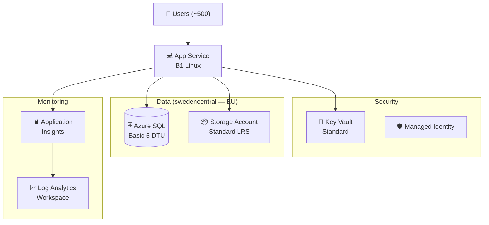
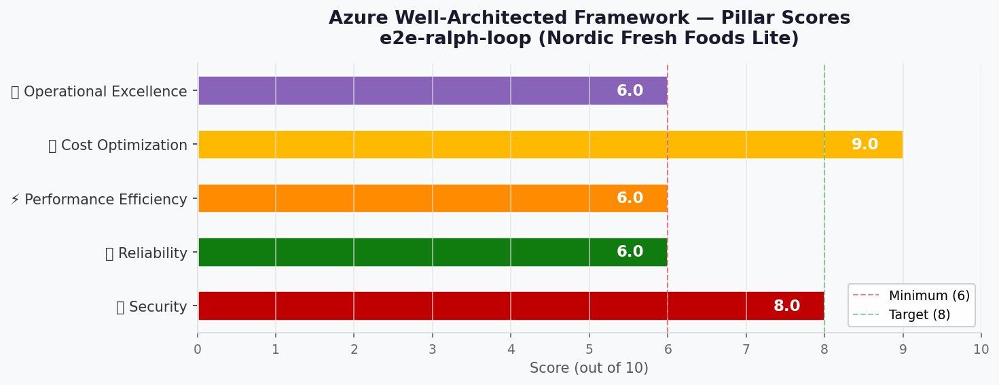

# 🏛️ Step 2: Architecture Assessment - e2e-ralph-loop

<strong>📑 Assessment Contents</strong>

- [✅ Requirements Validation](#-requirements-validation)
- [💎 Executive Summary](#-executive-summary)
- [🏛️ WAF Pillar Assessment](#-waf-pillar-assessment)
- [📦 Resource SKU Recommendations](#-resource-sku-recommendations)
- [🎯 Architecture Decision Summary](#-architecture-decision-summary)
- [🚀 Implementation Handoff](#-implementation-handoff)
- [🔒 Approval Gate](#-approval-gate)
- [References](#references)

> Generated by architect agent | 2026-03-15

| ⬅️ Previous                              | 📑 Index            | Next ➡️                                            |
| ---------------------------------------- | ------------------- | -------------------------------------------------- |
| [01-requirements.md](01-requirements.md) | [README](README.md) | [03-des-cost-estimate.md](03-des-cost-estimate.md) |

## ✅ Requirements Validation

| Requirement Area        | Status     | Validation Notes                                                        |
| ----------------------- | ---------- | ----------------------------------------------------------------------- |
| NFRs (SLA, RTO, RPO)    | ✅ Defined | SLA 99.9%, RTO 24h, RPO 24h — relaxed recovery objectives for MVP       |
| Compliance requirements | ✅ Defined | GDPR applicable — EU data residency, Article 17 erasure support         |
| Budget (approximate)    | ✅ Defined | <€500/month hard cap                                                    |
| Scale requirements      | ✅ Defined | ~500 users, ~50 orders/day, <50 concurrent users                        |
| Security controls       | ✅ Defined | Managed Identity, TLS 1.2, HTTPS-only, no public blob, AD-only SQL auth |
| Data residency          | ✅ Defined | EU-only, swedencentral primary region                                   |

---

## 💎 Executive Summary

Nordic Fresh Foods Lite is a greenfield, cost-optimized web ordering platform for
a Scandinavian farm-to-table startup. The architecture follows a simple N-Tier
pattern: **Azure App Service (B1 Linux)** for the web tier, **Azure SQL Database
(Basic 5 DTU)** for relational data, and **Azure Storage Account (Standard LRS)**
for blob/file storage. Supporting services include **Key Vault** for secrets
management, **Log Analytics + Application Insights** for monitoring, and
**Azure AD / Entra ID** for authentication.

The estimated monthly cost of **~€16/month** is dramatically under the €500 hard
cap, leaving significant headroom for future scaling. The architecture prioritises
**Cost Optimization** and **Security** as primary pillars, with acceptable
trade-offs on Reliability (single-region, relaxed RTO/RPO) and Performance
(budget-tier SKUs appropriate for <50 concurrent users).

### Recommended Architecture

---

## 🏛️ WAF Pillar Assessment

### Overall Scores

| Pillar                    | Score | Confidence | Summary                                                              |
| ------------------------- | ----- | ---------- | -------------------------------------------------------------------- |
| 🔒 Security               | 8/10  | High       | Strong security posture with MI, TLS 1.2, firewall rules, AD-only    |
| 🔄 Reliability            | 6/10  | Medium     | Single-region, basic tier, relaxed RTO/RPO — acceptable for MVP      |
| ⚡ Performance            | 6/10  | Medium     | Budget-tier SKUs sufficient for <50 concurrent users, limited growth |
| 💰 Cost Optimization      | 9/10  | High       | ~€16/month against €500 cap — 97% budget headroom                    |
| 🔧 Operational Excellence | 6/10  | Medium     | Monitoring in place but no automation, runbooks, or staging env      |

**Primary Pillar Optimized**: 💰 Cost Optimization
**Trade-offs Accepted**: Reduced reliability (single-region, no zone redundancy),
limited performance headroom (B1 tier), no staging environment for pre-prod testing.

---

### 🔒 Security Assessment (8/10)

**Strengths:**

- Managed Identity for App Service → SQL and Storage (no stored credentials)
- TLS 1.2 minimum enforced on all services
- HTTPS-only traffic on App Service and Storage Account
- No public blob access (`allowBlobPublicAccess: false`)
- Azure AD-only authentication for SQL Database (no SQL auth passwords)
- Key Vault for secrets management with RBAC access policies
- SQL firewall rules restricting access to App Service outbound IPs
- Storage Account access secured via Entra RBAC (no shared keys); no anonymous blob access
- All data at rest encrypted (Azure-managed keys)
- EU data residency enforced (swedencentral region)

**Gaps:**

- No private endpoints — data-plane traffic traverses public network (mitigated by Entra RBAC and managed identity)
- No VNet integration for App Service — outbound traffic not locked to a VNet
- No DDoS Protection Standard (acceptable: Basic DDoS is included)
- No WAF/Front Door — web tier exposed directly (acceptable for <500 users)

**Recommendations:**

1. Consider adding App Service VNet Integration when scaling beyond MVP (enables private endpoint connectivity)
2. Add diagnostic settings to ship security audit logs from Key Vault and SQL to Log Analytics
3. Implement GDPR Article 17 erasure procedure as a documented runbook with SQL stored procedures

### 🔄 Reliability Assessment (6/10)

**Strengths:**

- Azure SQL Basic provides 99.99% SLA with built-in geo-redundant backup
- Storage Account LRS provides 99.9% availability (11 nines durability)
- App Service B1 provides 99.95% SLA
- SQL PITR (Point-in-Time Restore) with 7-day retention (Basic tier)
- Effective composite SLA: ~99.84% (below the 99.9% target — accepted as MVP trade-off)

**Gaps:**

- Single-region deployment — no failover region for disaster recovery
- No zone redundancy (B1 App Service does not support availability zones)
- LRS storage — no cross-zone or cross-region replication
- No auto-scaling — B1 is fixed-scale (1 instance)
- SQL Basic limited to 2 GB max database size
- Relaxed RTO/RPO (24h) — acceptable for MVP but not enterprise-grade

**Recommendations:**

1. For 12-month scaling: evaluate upgrade to B2/S1 App Service and Standard SQL (S0) for zone redundancy
2. Consider GRS storage if cross-region backup becomes a requirement
3. Implement automated backup verification as part of operations maturity

### ⚡ Performance Assessment (6/10)

**Strengths:**

- B1 App Service (1 core, 1.75 GB RAM) sufficient for <50 concurrent users
- Azure SQL Basic (5 DTU) handles ~50 orders/day with simple queries
- Storage Account Hot tier optimized for frequent read access (product images)
- Application Insights for performance monitoring and alerting

**Gaps:**

- B1 has no auto-scale capability — traffic spikes above 50 concurrent users will degrade
- 5 DTU is the minimum SQL tier — complex queries or report generation may bottleneck
- No CDN for static assets — product images served directly from App Service/Storage
- No Redis cache layer — repeated database queries not cached
- Single App Service instance — no load balancing

**Recommendations:**

1. Monitor p95 response times via Application Insights; set alert at 500ms
2. If 6-month projections (~2,000 users, ~200 orders/day) materialize, upgrade to S1 App Service + S0 SQL
3. Add Azure CDN for static product images when traffic exceeds 100 concurrent users

### 💰 Cost Assessment (9/10)

| Service              | SKU                | Monthly Cost (EUR) | Notes                                   |
| -------------------- | ------------------ | -----------------: | --------------------------------------- |
| App Service Plan     | B1 Linux           |             €11.17 | €0.0153/hr × 730 hrs                    |
| Azure SQL Database   | Basic (5 DTU)      |              €4.15 | €0.1364/day × 30.44 days                |
| Storage Account      | Standard LRS (Hot) |              €0.16 | ~10 GB @ €0.0156/GB/month               |
| Key Vault            | Standard           |              €0.10 | ~1K ops/month @ €0.0254/10K             |
| Log Analytics        | Pay-as-you-go      |              €0.00 | ~2 GB/month within 5 GB free tier       |
| Application Insights | Workspace-based    |              €0.00 | Data ingestion included in LA free tier |
| SQL PITR Backup      | LRS                |              €0.10 | ~1 GB @ €0.1008/GB/month                |
| **Total Estimated**  |                    |         **€15.68** | **97% under €500 budget cap**           |

**Cost Optimization Applied:**

- Selected minimum viable SKUs (B1, Basic DTU, Standard LRS) for startup workload
- Leveraged Log Analytics 5 GB/month free tier for monitoring
- Application Insights workspace-based mode (no separate ingestion cost)
- Single environment (prod only) — no dev/staging resource duplication
- Standard Key Vault (not Premium HSM) sufficient for software-backed secrets

### 🔧 Operational Excellence Assessment (6/10)

**Strengths:**

- Log Analytics workspace for centralized logging
- Application Insights for application performance monitoring (APM)
- Bicep IaC for repeatable, version-controlled infrastructure
- Key Vault for externalized configuration/secrets management
- Azure Monitor alerts capability available

**Gaps:**

- No automated runbooks or Azure Automation
- No staging/preview environment for testing changes
- No CI/CD pipeline defined (assumed to be configured separately)
- No auto-scaling policies (B1 is fixed-scale)
- GDPR Article 17 erasure procedure not automated (manual process)
- No health check endpoints defined for App Service

**Recommendations:**

1. Configure Azure Monitor alerts for: CPU >80%, response time p95 >500ms, SQL DTU >80%
2. Implement health check endpoint (`/healthz`) in App Service configuration
3. Create GDPR erasure stored procedure in SQL and document as operational runbook
4. Consider Azure DevOps or GitHub Actions pipeline for Bicep deployment

---

## 📦 Resource SKU Recommendations

| Service              | Recommended SKU    | Configuration                    | Monthly Est. | Justification                                  |
| -------------------- | ------------------ | -------------------------------- | ------------ | ---------------------------------------------- |
| App Service Plan     | B1 Linux           | 1 core, 1.75 GB RAM, 10 GB disk  | €11.17       | Minimum paid tier, sufficient for <50 users    |
| Azure SQL Database   | Basic (5 DTU)      | 2 GB max size, 7-day PITR        | €4.15        | Minimum DTU tier, sufficient for 50 orders/day |
| Storage Account      | Standard LRS (Hot) | GPv2, HTTPS-only, no public blob | €0.16        | Lowest-cost blob storage for ~10 GB            |
| Key Vault            | Standard           | Software-backed keys, RBAC       | €0.10        | Standard sufficient for non-HSM requirements   |
| Log Analytics        | Pay-as-you-go      | 5 GB/month free tier, 30-day ret | €0.00        | Free tier covers ~2 GB/month telemetry         |
| Application Insights | Workspace-based    | Connected to Log Analytics       | €0.00        | Included with LA workspace ingestion           |

<strong>App Service Plan</strong> — Pricing Tier Comparison

| Tier          | vCPU | RAM     | Price/mo (EUR) | Fits?                                     |
| ------------- | ---- | ------- | -------------- | ----------------------------------------- |
| Free (F1)     | —    | 1 GB    | €0.00          | ❌ No custom domain, 60min/day CPU limit  |
| Basic (B1)    | 1    | 1.75 GB | €11.17         | ✅ Custom domain, always-on, SSL          |
| Standard (S1) | 1    | 1.75 GB | €62.05         | ⚠️ Auto-scale, staging — overkill for MVP |

**Selected**: B1 — Cheapest tier with custom domain support, always-on, and SSL. Upgrade path to S1 available when auto-scale is needed.

<strong>Azure SQL Database</strong> — Pricing Tier Comparison

| Tier          | Capacity | Price/mo (EUR) | Fits?                                           |
| ------------- | -------- | -------------- | ----------------------------------------------- |
| Basic (5 DTU) | 2 GB     | €4.15          | ✅ Sufficient for 50 orders/day                 |
| S0 (10 DTU)   | 250 GB   | €12.45         | ⚠️ More DTU headroom, needed at ~200 orders/day |
| S1 (20 DTU)   | 250 GB   | €24.91         | ❌ Overkill for current workload                |

**Selected**: Basic (5 DTU) — Minimum cost tier, 2 GB max sufficient for startup. Upgrade to S0 when transaction volume exceeds 200/day.

---

## 🎯 Architecture Decision Summary

| Decision           | Choice                   | Rationale                                                                |
| ------------------ | ------------------------ | ------------------------------------------------------------------------ |
| Compute tier       | App Service B1 Linux     | Minimum paid tier supporting custom domains and SSL                      |
| Database tier      | SQL Basic (5 DTU)        | Lowest cost DTU model, sufficient for 50 orders/day                      |
| Storage redundancy | LRS (locally redundant)  | No cross-region DR requirement; lowest cost                              |
| Authentication     | Managed Identity + Entra | Zero-credential architecture; GDPR-aligned                               |
| Private endpoints  | Not included             | Complexity budget: simple tier; firewall rules provide network isolation |
| VNet integration   | Not included             | Not required at current scale; adds cost and complexity                  |
| Monitoring stack   | LA + App Insights        | Free tier covers expected telemetry volume                               |
| Secrets management | Key Vault Standard       | Software-backed keys sufficient; HSM not required                        |
| Region             | swedencentral            | EU GDPR compliance, data residency requirement                           |
| IaC tool           | Bicep                    | Native Azure tooling, AVM module support, azd integration                |

---

## 🚀 Implementation Handoff

### Ready for Bicep Planner

The architecture is approved for implementation with the following key parameters:

| Parameter      | Value                                |
| -------------- | ------------------------------------ |
| Region         | swedencentral                        |
| Environment    | prod                                 |
| Budget         | €500/month (estimated: €15.68/month) |
| Resource Count | 6 (+ supporting resources)           |

### Resources to Provision

| #   | Resource             | SKU                | Key Config                                             |
| --- | -------------------- | ------------------ | ------------------------------------------------------ |
| 1   | Resource Group       | —                  | `rg-e2e-ralph-loop-prod`                               |
| 2   | App Service Plan     | B1 Linux           | Always-on, HTTPS-only, TLS 1.2                         |
| 3   | App Service          | —                  | Managed Identity, health check endpoint                |
| 4   | Azure SQL Server     | —                  | Azure AD-only auth, firewall rules for App Service IPs |
| 5   | Azure SQL Database   | Basic (5 DTU)      | 2 GB max, 7-day PITR, TDE enabled                      |
| 6   | Storage Account      | Standard LRS (Hot) | GPv2, HTTPS-only, no public blob, Entra RBAC auth      |
| 7   | Key Vault            | Standard           | RBAC access, soft delete, purge protection             |
| 8   | Log Analytics        | Pay-as-you-go      | 30-day retention, 5 GB free tier                       |
| 9   | Application Insights | Workspace-based    | Connected to Log Analytics workspace                   |

### Security Requirements for Implementation

| Requirement            | Implementation                                                       |
| ---------------------- | -------------------------------------------------------------------- |
| Managed Identity       | System-assigned MI on App Service; RBAC roles to SQL, Storage, KV    |
| TLS 1.2 minimum        | `minTlsVersion: '1.2'` on App Service, Storage, SQL                  |
| HTTPS-only             | `httpsOnly: true` on App Service; `supportsHttpsTrafficOnly: true`   |
| No public blob access  | `allowBlobPublicAccess: false` on Storage Account                    |
| Azure AD-only SQL auth | `azureADOnlyAuthentication: true` on SQL Server                      |
| SQL firewall rules     | Allow App Service outbound IPs only                                  |
| Storage access control | Entra RBAC auth via managed identity; no shared key access           |
| Key Vault soft delete  | `enableSoftDelete: true`, `enablePurgeProtection: true`              |
| Required tags          | Environment=prod, ManagedBy=Bicep, Project=e2e-ralph-loop, Owner=E2E |

### Monitoring Requirements for Implementation

| Requirement             | Implementation                                                     |
| ----------------------- | ------------------------------------------------------------------ |
| Application performance | Application Insights SDK in App Service, connected to LA workspace |
| Infrastructure metrics  | Azure Monitor diagnostic settings on all resources → LA workspace  |
| Alerting                | CPU >80%, response time p95 >500ms, SQL DTU >80%, 5xx error rate   |
| GDPR audit logging      | Key Vault audit logs and SQL audit logs → Log Analytics            |

---

## 🔒 Approval Gate

> [!IMPORTANT]
> **🏗️ Architecture Assessment Complete**
>
> | Pillar      | Score |
> | ----------- | ----- |
> | Security    | 8/10  |
> | Reliability | 6/10  |
> | Performance | 6/10  |
> | Cost        | 9/10  |
> | Operations  | 6/10  |
>
> **Estimated Monthly Cost**: ~€15.68 (97% under €500 budget cap)
>
> **Confidence Level**: High
>
> - [ ] **Approved** — proceed to Bicep Planner
> - Approver: \_\_\_
> - Date: \_\_\_
>
> Reply **"approve"** to proceed to Bicep Planner, or provide feedback for revisions.

---

## References

> [!NOTE]
> 📚 The following Microsoft Learn resources informed this assessment.

| Topic                      | Link                                                                                        |
| -------------------------- | ------------------------------------------------------------------------------------------- |
| Well-Architected Framework | [Overview](https://learn.microsoft.com/azure/well-architected/)                             |
| Security Checklist         | [WAF Security](https://learn.microsoft.com/azure/well-architected/security/checklist)       |
| Reliability Checklist      | [WAF Reliability](https://learn.microsoft.com/azure/well-architected/reliability/checklist) |
| Cost Optimization          | [WAF Cost](https://learn.microsoft.com/azure/well-architected/cost-optimization/checklist)  |
| App Service B1 Pricing     | [App Service Pricing](https://azure.microsoft.com/pricing/details/app-service/linux/)       |
| SQL Database Pricing       | [SQL DB Pricing](https://azure.microsoft.com/pricing/details/azure-sql-database/single/)    |
| Azure Pricing Calculator   | [Calculator](https://azure.microsoft.com/pricing/calculator/)                               |

---

_Assessment performed using Azure Well-Architected Framework. Pricing data from Azure Retail Prices API (2026-03-15), swedencentral region, EUR currency._

---

| ⬅️ [01-requirements.md](01-requirements.md) | 🏠 [Project Index](README.md) | ➡️ [03-des-cost-estimate.md](03-des-cost-estimate.md) |
| ------------------------------------------- | ----------------------------- | ----------------------------------------------------- |

