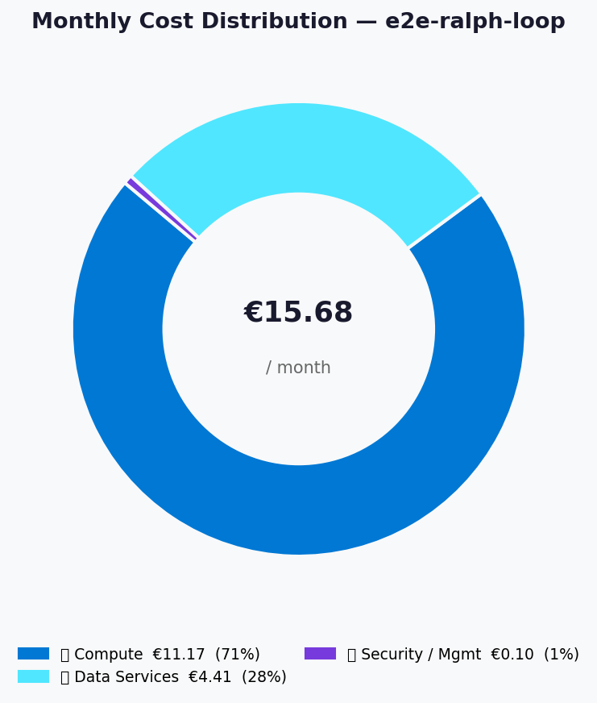
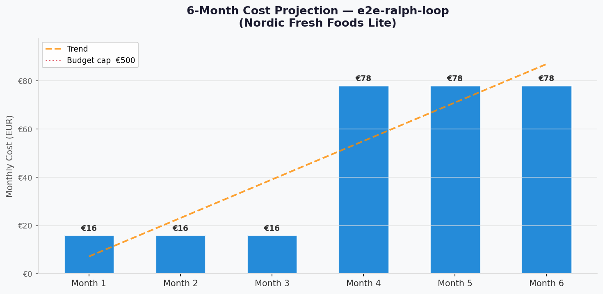

# 💰 Azure Cost Estimate: e2e-ralph-loop


<details open>
<summary><strong>📑 Cost Estimate Contents</strong></summary>

- [💵 Cost At-a-Glance](#-cost-at-a-glance)
- [✅ Decision Summary](#-decision-summary)
- [🔁 Requirements → Cost Mapping](#-requirements--cost-mapping)
- [📊 Top 5 Cost Drivers](#-top-5-cost-drivers)
- [🏛️ Architecture Overview](#-architecture-overview)
- [🧾 What We Are Not Paying For (Yet)](#-what-we-are-not-paying-for-yet)
- [⚠️ Cost Risk Indicators](#-cost-risk-indicators)
- [🎯 Quick Decision Matrix](#-quick-decision-matrix)
- [💰 Savings Opportunities](#-savings-opportunities)
- [🧾 Detailed Cost Breakdown](#-detailed-cost-breakdown)
- [References](#references)

</details>

> Generated by architect agent | 2026-03-15

| ⬅️ Previous                                                    | 📑 Index            | Next ➡️                                                      |
| -------------------------------------------------------------- | ------------------- | ------------------------------------------------------------ |
| [02-architecture-assessment.md](02-architecture-assessment.md) | [README](README.md) | [04-governance-constraints.md](04-governance-constraints.md) |

**Generated**: 2026-03-15
**Region**: swedencentral
**Environment**: Production
**Pricing Source**: Azure Retail Prices API (`prices.azure.com`), EUR currency, 2026-03-15
**Architecture Reference**: [02-architecture-assessment.md](02-architecture-assessment.md)

## 💵 Cost At-a-Glance

> **Monthly Total: ~€15.68** | Annual: ~€188.16
>
> ```text
> Budget: €500/month (hard) | Utilization: 3% (€15.68 of €500)
> ```
>
> | Status            | Indicator                           |
> | ----------------- | ----------------------------------- |
> | Cost Trend        | ➡️ Stable (fixed SKUs, no autoscale) |
> | Savings Available | 💰 Minimal — already at lowest tiers |
> | Compliance        | ✅ GDPR-aligned (swedencentral)      |

## ✅ Decision Summary

- ✅ Approved: App Service B1, SQL Basic, Storage Standard LRS, Key Vault Standard, LA + AI monitoring
- ⏳ Deferred: Private endpoints, VNet integration, CDN, Redis cache, multi-region DR
- 🔁 Redesign Trigger: >200 orders/day or >2,000 users triggers S1 App Service + S0 SQL upgrade

**Confidence**: High | **Expected Variance**: ±5% (prices are API-verified; variance from operations volume only)

## 🔁 Requirements → Cost Mapping

| Requirement                    | Architecture Decision         | Cost Impact    | Mandatory |
| ------------------------------ | ----------------------------- | -------------- | --------- |
| SLA 99.9%, RTO/RPO 24h        | Single-region, Basic tiers    | Base cost only | Yes       |
| GDPR EU data residency         | swedencentral region          | +€0/month      | Yes       |
| GDPR Article 17 erasure        | SQL stored procedure + ops    | +€0/month      | Yes       |
| <50 concurrent users           | B1 App Service (1 core)       | €11.17/month   | Yes       |
| ~50 orders/day                 | SQL Basic (5 DTU)             | €4.15/month    | Yes       |
| Managed Identity               | System-assigned MI            | +€0/month      | Yes       |
| Monitoring                     | LA + App Insights (free tier) | €0.00/month    | Yes       |

## 📊 Top 5 Cost Drivers

| Rank | Resource              | Monthly Cost | % of Total | Trend | Optimization           |
| ---- | --------------------- | ------------ | ---------- | ----- | ---------------------- |
| 1️⃣   | App Service Plan B1   | €11.17       | 71.2%      | ➡️    | Already at lowest tier  |
| 2️⃣   | Azure SQL Basic       | €4.15        | 26.5%      | ➡️    | Already at lowest tier  |
| 3️⃣   | Storage Account LRS   | €0.16        | 1.0%       | ➡️    | Hot tier appropriate    |
| 4️⃣   | Key Vault Standard    | €0.10        | 0.6%       | ➡️    | Negligible cost         |
| 5️⃣   | SQL PITR Backup       | €0.10        | 0.6%       | ➡️    | Included with SQL Basic |

> 💡 **Quick Win**: Cost is already optimized at ~€16/month. The primary optimization is to monitor for unexpected data growth in Storage or Log Analytics.

<details>
<summary><strong>Cost Driver Details</strong></summary>

#### 1️⃣ App Service Plan (B1 Linux)

| Aspect            | Detail                                   |
| ----------------- | ---------------------------------------- |
| Current SKU       | B1 Linux                                 |
| Monthly Cost      | €11.17                                   |
| Cost Breakdown    | Compute: €11.17 (flat hourly rate)        |
| Optimization      | No further optimization without downgrade |
| Potential Savings | F1 (Free) saves €11.17 but loses custom domain, SSL, always-on |

#### 2️⃣ Azure SQL Database (Basic 5 DTU)

| Aspect            | Detail                                   |
| ----------------- | ---------------------------------------- |
| Current SKU       | Basic (5 DTU, 2 GB)                      |
| Monthly Cost      | €4.15                                    |
| Optimization      | No lower tier available                  |
| Potential Savings | None — this is the minimum DTU tier      |

</details>

## 🏛️ Architecture Overview

### Cost Distribution

| Category            | Monthly Cost (EUR) | Share  |
| ------------------- | -----------------: | -----: |
| 💻 Compute          |             €11.17 | 71.2%  |
| 💾 Data Services    |              €4.41 | 28.1%  |
| 🔑 Security / Mgmt  |              €0.10 | 0.6%   |



### Month-over-Month Projection



> Projection assumes stable usage for months 1-3, then gradual scaling to
> accommodate 6-month projections (~2,000 users, ~200 orders/day) which
> would trigger SKU upgrades in months 4-6.

### Key Design Decisions Affecting Cost

| Decision                | Cost Impact     | Business Rationale                  | Status   |
| ----------------------- | --------------- | ----------------------------------- | -------- |
| B1 vs S1 App Service    | -€50.88/month   | 50 users don't need auto-scale      | Required |
| Basic vs S0 SQL         | -€8.30/month    | 50 orders/day fits within 5 DTU     | Required |
| LRS vs GRS Storage      | -€0.07/month    | No cross-region DR requirement      | Required |
| No private endpoints    | -€7.30/month    | Firewall rules sufficient for MVP   | Optional |
| No CDN                  | -€0/month       | <500 users, product images via blob  | Optional |

## 🧾 What We Are Not Paying For (Yet)

- Private endpoints for SQL and Storage (~€7.30/month each)
- VNet integration for App Service (~€0/month but requires Standard tier)
- Azure CDN for static assets (~€0.06/GB for Verizon Standard)
- Redis cache for session/query caching (~€13/month for Basic C0)
- Multi-region failover (doubles all resource costs)
- DDoS Protection Standard (~€2,660/month — not needed at this scale)
- Staging/dev environment (doubles all resource costs)

### Assumptions & Uncertainty

- Storage volume assumed at ~10 GB (product images + order documents)
- Log Analytics ingestion assumed at ~2 GB/month (within 5 GB free tier)
- No egress charges modelled (minimal for web-to-client traffic in Sweden)
- SQL database size assumed at ~1 GB (500 customers, order history)
- Key Vault operations assumed at ~1,000/month (app startup + secret reads)

## ⚠️ Cost Risk Indicators

| Resource          | Risk Level | Issue                                                | Mitigation                                        |
| ----------------- | ---------- | ---------------------------------------------------- | ------------------------------------------------- |
| Log Analytics     | 🟡 Medium  | Data ingestion exceeding 5 GB free tier → €2.53/GB   | Set daily cap at 5 GB; alert at 4 GB              |
| Storage Account   | 🟢 Low     | Unexpected blob growth                                | Set budget alert at €5/month for storage           |
| SQL Database      | 🟢 Low     | Basic tier 2 GB limit could be hit with order volume  | Monitor DB size; plan S0 upgrade at 1.5 GB         |

> **⚠️ Watch Item**: Log Analytics is the only service where unexpected costs could appear. Configure a 5 GB daily cap to stay within the free tier.

## 🎯 Quick Decision Matrix

_"If you need X, expect to pay Y more"_

| Requirement                | Additional Cost | SKU Change            | Verdict     | Notes                           |
| -------------------------- | --------------- | --------------------- | ----------- | ------------------------------- |
| Auto-scaling               | +€50.88/month   | B1 → S1 App Service   | 🟡 Monitor  | Trigger at >50 concurrent users |
| More SQL capacity          | +€8.30/month    | Basic → S0 (10 DTU)   | 🟡 Monitor  | Trigger at >200 orders/day      |
| Private Endpoints          | +€14.60/month   | 2× PE (SQL + Storage) | 🟢 Go       | When VNet becomes required       |
| Multi-region DR            | +€15.68/month   | Full resource duplication | 🔴 Investigate | Only if RTO <4h required     |
| Redis Cache                | +€13.00/month   | Basic C0 (250 MB)     | 🟡 Monitor  | When p95 >500ms consistently    |

## 💰 Savings Opportunities

> ### Total Potential Savings: €0/year
>
> | Strategy                | Commitment | Monthly Savings | Annual Savings | % Reduction |
> | ----------------------- | ---------- | --------------- | -------------- | ----------- |
> | Reserved Instances (RI) | 1-year     | N/A             | N/A            | N/A         |
> | Reserved Instances (RI) | 3-year     | N/A             | N/A            | N/A         |
> | Savings Plan (SP)       | 1-year     | N/A             | N/A            | N/A         |
> | Dev/Test Pricing        | N/A        | N/A             | N/A            | N/A         |
>
> **Note**: At ~€16/month total spend, reservation commitments are not cost-effective.
> The 1-year minimum commitment for App Service RI would require upfront payment
> (~€100) with minimal savings (~10%). The absolute savings would be ~€1/month —
> not worth the commitment lock-in for a startup MVP.

## 🧾 Detailed Cost Breakdown

### Assumptions

- Hours: 730 hours/month (24/7 operation)
- Network egress: Negligible (<1 GB/month expected for <500 Swedish users)
- Storage growth: ~1 GB/month for first 6 months
- SQL data: ~1 GB total, growing ~100 MB/month

### Line Items

| Category            | Service              | SKU / Meter            | Quantity / Units     | Est. Monthly (EUR) |
| ------------------- | -------------------- | ---------------------- | -------------------- | -----------------: |
| 💻 Compute          | App Service Plan     | B1 Linux               | 730 hrs              |             €11.17 |
| 💾 Data Services    | Azure SQL Database   | Basic (5 DTU)          | 30.44 days           |              €4.15 |
| 💾 Data Services    | Storage Account      | Standard LRS (Hot)     | ~10 GB stored        |              €0.16 |
| 💾 Data Services    | SQL PITR Backup      | LRS Backup             | ~1 GB                |              €0.10 |
| 🔑 Security / Mgmt  | Key Vault            | Standard Operations    | ~1K ops              |              €0.10 |
| 📊 Monitoring       | Log Analytics        | Pay-as-you-go          | ~2 GB (free tier)    |              €0.00 |
| 📊 Monitoring       | Application Insights | Workspace-based        | Included in LA       |              €0.00 |
| **Total**           |                      |                        |                      |         **€15.68** |

### Pricing Sources

| Service          | API Price          | Unit          | API Query Date |
| ---------------- | -----------------: | ------------- | -------------- |
| App Service B1   | €0.0153            | 1 Hour        | 2026-03-15     |
| SQL Basic        | €0.1364            | 1/Day         | 2026-03-15     |
| Storage LRS Hot  | €0.0156            | 1 GB/Month    | 2026-03-15     |
| LA Ingestion     | €2.5336            | 1 GB          | 2026-03-15     |
| KV Operations    | €0.0254            | 10K           | 2026-03-15     |
| SQL Backup LRS   | €0.1008            | 1 GB/Month    | 2026-03-15     |

### Notes

- All prices sourced from Azure Retail Prices API (`prices.azure.com`) in EUR for swedencentral
- First 5 GB/month of Log Analytics ingestion is free per billing account
- Application Insights workspace-based mode routes data through Log Analytics (no separate charge)
- SQL Basic includes up to database-size backup storage free; only overage charged
- No reservation/commitment discounts recommended at this spend level
- Bandwidth charges not modelled (domestic Swedish traffic, <1 GB egress expected)

---

## References

| Topic                    | Link                                                                                                                   |
| ------------------------ | ---------------------------------------------------------------------------------------------------------------------- |
| Azure Pricing Calculator | [Calculator](https://azure.microsoft.com/pricing/calculator/)                                                          |
| Azure Retail Prices API  | [REST API](https://learn.microsoft.com/rest/api/cost-management/retail-prices/azure-retail-prices)                     |
| Cost Management          | [Overview](https://learn.microsoft.com/azure/cost-management-billing/costs/overview-cost-management)                   |
| Reserved Instances       | [Reservations](https://learn.microsoft.com/azure/cost-management-billing/reservations/save-compute-costs-reservations) |
| WAF Cost Optimization    | [Checklist](https://learn.microsoft.com/azure/well-architected/cost-optimization/checklist)                            |

---

<div align="center">

| ⬅️ [02-architecture-assessment.md](02-architecture-assessment.md) | 🏠 [Project Index](README.md) | ➡️ [04-governance-constraints.md](04-governance-constraints.md) |
| ----------------------------------------------------------------- | ----------------------------- | --------------------------------------------------------------- |

</div>
