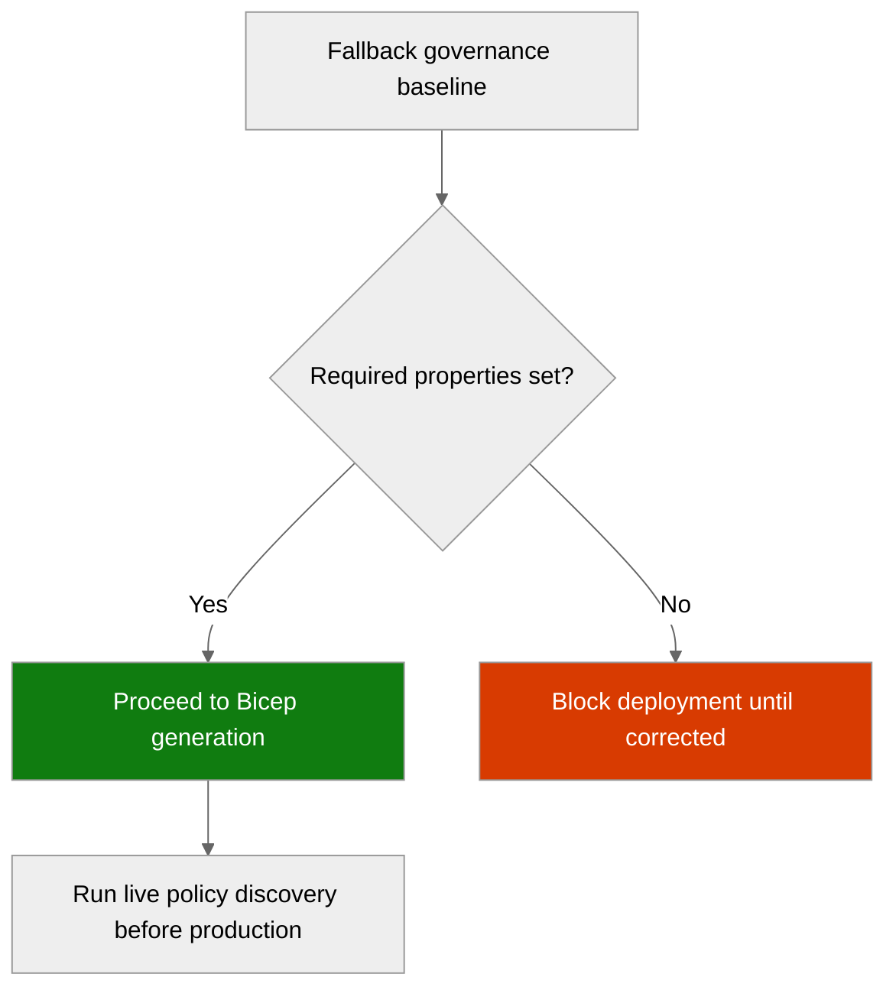

# 🛡️ Governance Constraints - e2e-ralph-loop


<details open>
<summary><strong>📑 Governance Contents</strong></summary>

- [🔍 Discovery Source](#-discovery-source)
- [📋 Azure Policy Compliance](#-azure-policy-compliance)
- [🔄 Plan Adaptations Based on Policies](#-plan-adaptations-based-on-policies)
- [🚫 Deployment Blockers](#-deployment-blockers)
- [🏷️ Required Tags](#-required-tags)
- [🔐 Security Policies](#-security-policies)
- [💰 Cost Policies](#-cost-policies)
- [🌐 Network Policies](#-network-policies)
- [References](#references)

</details>

> Generated by governance agent | 2026-03-16

| ⬅️ Previous                                        | 📑 Index            | Next ➡️                                                |
| -------------------------------------------------- | ------------------- | ------------------------------------------------------ |
| [03-des-cost-estimate.md](03-des-cost-estimate.md) | [README](README.md) | [04-implementation-plan.md](04-implementation-plan.md) |

This document captures the governance constraints and Azure Policy requirements
that must be addressed in the Bicep implementation.

## 🔍 Discovery Source

> [!IMPORTANT]
> Live Azure Policy discovery was attempted for the active Azure context but the
> Azure CLI REST policy assignment queries did not return usable results in this
> automated E2E environment.

| Query              | Results                                                               | Timestamp            |
| ------------------ | --------------------------------------------------------------------- | -------------------- |
| Policy Assignments | 0 live assignments captured; REST policy discovery failed in this run | 2026-03-16T08:29:29Z |
| Tag Policies       | 1 template tag constraint set covering 4 required tags                | 2026-03-16T08:29:29Z |
| Security Policies  | 7 template constraints prepared for App Service, Storage, SQL, MI     | 2026-03-16T08:29:29Z |

**Discovery Method**: Template fallback from architecture assessment and explicit
E2E baseline requirements
**Subscription**: Active Azure CLI context detected: noalz
(`00858ffc-dded-4f0f-8bbf-e17fff0d47d9`)
**Scope**: Intended subscription-level governance for the project resource group
and planned resources

> [!WARNING]
> This artifact is a fallback template, not a verified extract of effective Azure
> Policy assignments. Run live governance discovery before production deployment.

⚠️ Live tenant policy state was not captured in this automated run.

### Policy Definition Analysis

> [!IMPORTANT]
> These rows document the fallback constraints that downstream Bicep must satisfy.

| Policy Display Name                   | Assignment Scope | Effect | Actually Blocks                                     | Evidence from policyRule.if                        | Bicep Property Path                                                        | Required Value                                 |
| ------------------------------------- | ---------------- | ------ | --------------------------------------------------- | -------------------------------------------------- | -------------------------------------------------------------------------- | ---------------------------------------------- |
| Template: Allowed EU regions only     | Subscription     | Deny   | Any planned resource deployed outside EU baseline   | `field: location`, allowed list constrained to EU  | `location`                                                                 | `swedencentral`, `germanywestcentral`          |
| Template: Require standard tags       | Subscription     | Deny   | Resource creation without mandatory deployment tags | `field: tags`, required keys must exist            | `tags`                                                                     | `Environment`, `ManagedBy`, `Project`, `Owner` |
| Template: App Service HTTPS only      | Subscription     | Deny   | Web app creation without HTTPS-only enabled         | `field: type == Microsoft.Web/sites`               | `sites::properties.httpsOnly`                                              | `true`                                         |
| Template: App Service minimum TLS 1.2 | Subscription     | Deny   | Web app creation below TLS 1.2                      | `field: type == Microsoft.Web/sites`               | `sites::properties.siteConfig.minTlsVersion`                               | `1.2`                                          |
| Template: Storage HTTPS only          | Subscription     | Deny   | Storage account secure transfer disabled            | `field: type == Microsoft.Storage/storageAccounts` | `storageAccounts::properties.supportsHttpsTrafficOnly`                     | `true`                                         |
| Template: Storage minimum TLS 1.2     | Subscription     | Deny   | Storage account below TLS 1.2                       | `field: type == Microsoft.Storage/storageAccounts` | `storageAccounts::properties.minimumTlsVersion`                            | `TLS1_2`                                       |
| Template: Storage public access off   | Subscription     | Deny   | Storage account with anonymous blob access          | `field: type == Microsoft.Storage/storageAccounts` | `storageAccounts::properties.allowBlobPublicAccess`                        | `false`                                        |
| Template: SQL Entra-only auth         | Subscription     | Deny   | SQL server creation without Entra-only auth         | `field: type == Microsoft.Sql/servers`             | `servers/azureADOnlyAuthentications::properties.azureADOnlyAuthentication` | `true`                                         |

**Analysis Notes**:

- The architecture assessment already aligns with the fallback EU region, TLS,
  HTTPS-only, storage public access, and SQL Entra-only requirements.
- Managed identity is treated as a template compliance requirement for the web
  tier but is modeled as an audit expectation rather than a confirmed Deny rule.
- No live Modify or DeployIfNotExists behavior was verified in this run.

## 📋 Azure Policy Compliance

| Category       | Constraint                                          | Implementation                                  | Status |
| -------------- | --------------------------------------------------- | ----------------------------------------------- | ------ |
| Naming         | CAF-aligned naming and single prod resource group   | `rg-e2e-ralph-loop-prod` and planned CAF names  | ✅     |
| Tagging        | `Environment`, `ManagedBy`, `Project`, `Owner`      | Set on all planned resources and the RG         | ✅     |
| Security       | HTTPS-only, TLS 1.2, no public blob, Entra-only SQL | Explicit Bicep properties required              | ✅     |
| Data Residency | EU-only deployment baseline                         | Primary region `swedencentral` already selected | ✅     |

> [!WARNING]
> These statuses reflect template alignment against the requested fallback
> baseline. They are not proof of tenant policy compliance.

## 🔄 Plan Adaptations Based on Policies

> [!NOTE]
> The fallback policy set caused only small implementation clarifications because
> the architecture assessment already planned a compliant MVP footprint.

### Architectural Changes

| Original Design                          | Blocking Policy                     | Effect | Adaptation Applied                                          |
| ---------------------------------------- | ----------------------------------- | ------ | ----------------------------------------------------------- |
| Single-region EU deployment              | Template: Allowed EU regions only   | Deny   | Lock all deployable resources to `swedencentral`            |
| App Service with backend secret access   | Template: Managed identity required | Audit  | Require system-assigned managed identity on the web app     |
| Resource tagging defined in requirements | Template: Require standard tags     | Deny   | Ensure all four required tags are emitted in every template |

### Auto-Applied Resources

✅ No additional resources will be auto-deployed.

### Auto-Modified Configurations

✅ No auto-modifications expected.

## 🚫 Deployment Blockers

> [!CAUTION]
> No confirmed live blockers were discovered because this run used a fallback
> template instead of effective Azure Policy assignments.

✅ No deployment blockers detected.

❌ Any deviation from the template constraints below should be treated as a
deployment blocker until live discovery is available.

The following conditions would become blockers if the Bicep implementation omits
them:

- Deploying any regional resource outside `swedencentral` or
  `germanywestcentral`
- Omitting any of the four required deployment tags
- Creating App Service without `httpsOnly: true` or TLS 1.2
- Creating Storage without HTTPS-only, TLS 1.2, or public blob access disabled
- Creating Azure SQL Server without Entra-only authentication

## 🏷️ Required Tags

All resources must include the following tags:

```bicep
tags: {
  Environment: 'prod'
  ManagedBy: 'Bicep'
  Project: 'e2e-ralph-loop'
  Owner: owner
}
```

> Replace `owner` with the deployment owner parameter used by the Bicep templates.

## 🔐 Security Policies

| Policy           | Requirement                                                                          |
| ---------------- | ------------------------------------------------------------------------------------ |
| HTTPS Only       | App Service `httpsOnly: true`; Storage `supportsHttpsTrafficOnly: true`              |
| TLS Version      | App Service `siteConfig.minTlsVersion: '1.2'`; Storage `minimumTlsVersion: 'TLS1_2'` |
| Public Access    | Storage `allowBlobPublicAccess: false`; no anonymous blob access                     |
| Managed Identity | App Service must enable system-assigned managed identity for downstream auth         |
| Key Vault        | Use RBAC access, soft delete, purge protection, and MI-based secret access           |

## 💰 Cost Policies

| Policy            | Constraint                                                              |
| ----------------- | ----------------------------------------------------------------------- |
| Budget            | Keep the solution within the `<EUR500/month` project cap                |
| SKU Restrictions  | No template SKU deny list assumed for B1, Basic, Standard, or LRS tiers |
| Reserved Capacity | Not assumed for the MVP workload                                        |

## 🌐 Network Policies

| Policy            | Constraint                                                                  |
| ----------------- | --------------------------------------------------------------------------- |
| Private Endpoints | Not assumed by the fallback baseline; verify with live discovery later      |
| VNet Integration  | Not assumed by the fallback baseline; keep simple unless policy requires it |
| Public Endpoints  | Public blob access is denied; other endpoints remain unverified live policy |

---

## References



| Topic             | Link                                                                                                                     |
| ----------------- | ------------------------------------------------------------------------------------------------------------------------ |
| Azure Policy      | [Overview](https://learn.microsoft.com/azure/governance/policy/overview)                                                 |
| Azure App Service | [Configure HTTPS and TLS](https://learn.microsoft.com/azure/app-service/configure-ssl-bindings)                          |
| Azure SQL         | [Microsoft Entra-only authentication](https://learn.microsoft.com/azure/azure-sql/database/authentication-azure-ad-only) |
| Azure Storage     | [Prevent anonymous public read access](https://learn.microsoft.com/azure/storage/blobs/anonymous-read-access-prevent)    |
| GDPR on Azure     | [Microsoft Learn](https://learn.microsoft.com/compliance/regulatory/gdpr-data-protection-impact-assessments)             |

---

_Governance constraints generated as a fallback template for automated E2E validation._
_Live policy discovery should replace this artifact before production use._
