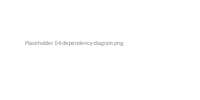
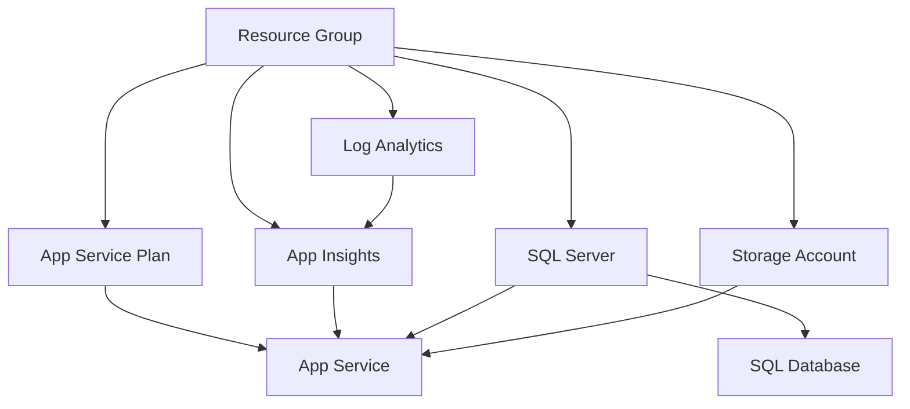
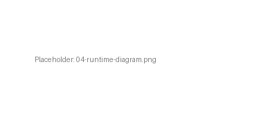
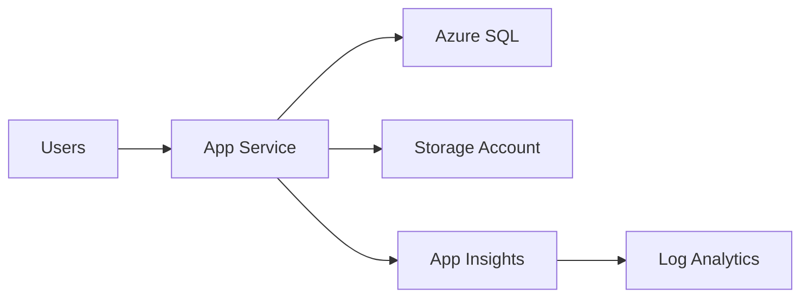

# 📋 Step 4: Implementation Plan - e2e-ralph-loop


> Generated by Bicep Planner agent | 2026-03-15 (pre-seeded for E2E RALPH loop)

<details>
<summary>📑 Table of Contents</summary>

- [📋 Overview](#-overview)
- [📦 Resource Inventory](#-resource-inventory)
- [🗂️ Module Structure](#%EF%B8%8F-module-structure)
- [🔨 Implementation Tasks](#-implementation-tasks)
- [🚀 Deployment Phases](#-deployment-phases)
- [🔗 Dependency Graph](#-dependency-graph)
- [🔄 Runtime Flow Diagram](#-runtime-flow-diagram)
- [🏷️ Naming Conventions](#%EF%B8%8F-naming-conventions)
- [🔐 Security Configuration](#-security-configuration)
- [⏱️ Estimated Implementation Time](#%EF%B8%8F-estimated-implementation-time)
- [🔒 Approval Gate](#-approval-gate)
- [References](#references)

</details>

| ⬅️ Previous                                                  | 📑 Index            | Next ➡️                                                          |
| ------------------------------------------------------------ | ------------------- | ---------------------------------------------------------------- |
| [04-governance-constraints.md](04-governance-constraints.md) | [README](README.md) | [infra/bicep/e2e-ralph-loop/](../../infra/bicep/e2e-ralph-loop/) |

---

## 📋 Overview

This plan defines the Bicep implementation for the Nordic Fresh Foods Lite — a simplified cost-optimized web application in `swedencentral`. The deployment uses **Azure Verified Modules (AVM)** and a **3-phase deployment strategy** for simple complexity.

| Property                   | Value                     |
| -------------------------- | ------------------------- |
| **Project**                | e2e-ralph-loop            |
| **IaC Tool**               | Bicep (AVM-first)         |
| **Region**                 | swedencentral             |
| **Environments**           | Prod only                 |
| **Deployment Strategy**    | Phased (3 phases)         |
| **Total Resources**        | 5 resource types          |
| **Estimated Monthly Cost** | ~€150 (Prod steady-state) |
| **Budget**                 | <€500/month               |
| **Compliance**             | GDPR                      |

---

## 📦 Resource Inventory

### Production Environment

| #   | Resource                | Type                                       | AVM Module                                         | Version  | SKU / Tier      |
| --- | ----------------------- | ------------------------------------------ | -------------------------------------------------- | -------- | --------------- |
| 1   | Resource Group          | `Microsoft.Resources/resourceGroups`       | N/A (subscription-level)                           | —        | —               |
| 2   | Log Analytics Workspace | `Microsoft.OperationalInsights/workspaces` | `br/public:avm/res/operational-insights/workspace` | `0.15.0` | Pay-per-GB      |
| 3   | Application Insights    | `Microsoft.Insights/components`            | `br/public:avm/res/insights/component`             | `0.7.1`  | Workspace-based |
| 4   | App Service Plan        | `Microsoft.Web/serverfarms`                | `br/public:avm/res/web/serverfarm`                 | `0.7.0`  | B1 Linux        |
| 5   | App Service             | `Microsoft.Web/sites`                      | `br/public:avm/res/web/site`                       | `0.22.0` | B1 (on plan)    |
| 6   | Azure SQL Server        | `Microsoft.Sql/servers`                    | `br/public:avm/res/sql/server`                     | `0.21.1` | —               |
| 7   | Azure SQL Database      | `Microsoft.Sql/servers/databases`          | (via SQL Server module)                            | —        | Basic (5 DTU)   |
| 8   | Storage Account         | `Microsoft.Storage/storageAccounts`        | `br/public:avm/res/storage/storage-account`        | `0.32.0` | Standard LRS    |
| 9   | Budget Alert            | `Microsoft.Consumption/budgets`            | Raw Bicep resource                                 | —        | €500/month      |

---

## 🗂️ Module Structure

```text
infra/bicep/e2e-ralph-loop/
├── main.bicep                      # Orchestrator — all module calls
├── main.bicepparam                 # Parameter file (prod defaults)
├── modules/
│   ├── monitoring.bicep            # Log Analytics + App Insights
│   ├── sql.bicep                   # SQL Server + Database
│   ├── storage.bicep               # Storage Account
│   ├── compute.bicep               # App Service Plan + App Service
│   └── budget.bicep                # Consumption budget + alerts
```

### Module Interface Contract

Every module accepts these standard parameters:

```yaml
Parameters (standard):
  location: string # Region (default: resourceGroup().location)
  tags: object # Required tags (Environment, ManagedBy, Project, Owner)
  uniqueSuffix: string # uniqueString(resourceGroup().id)

Outputs (standard):
  resourceId: string # Resource ID
  resourceName: string # Resource name
```

---

## 🔨 Implementation Tasks

### Task List

| #   | Task                           | Module           | Depends On | Est. Time |
| --- | ------------------------------ | ---------------- | ---------- | --------- |
| 1   | Create main.bicep orchestrator | main             | —          | 30 min    |
| 2   | Implement monitoring module    | monitoring.bicep | —          | 20 min    |
| 3   | Implement SQL module           | sql.bicep        | —          | 30 min    |
| 4   | Implement storage module       | storage.bicep    | —          | 15 min    |
| 5   | Implement compute module       | compute.bicep    | 2, 3, 4    | 30 min    |
| 6   | Implement budget module        | budget.bicep     | —          | 15 min    |
| 7   | Create parameter file          | main.bicepparam  | 1          | 10 min    |
| 8   | Validate and lint              | —                | 1-7        | 15 min    |

---

## 🚀 Deployment Phases

### Phase 1: Foundation

| Resource                | Purpose                            |
| ----------------------- | ---------------------------------- |
| Resource Group          | Container for all resources        |
| Log Analytics Workspace | Centralized logging                |
| Application Insights    | Application performance monitoring |
| Budget Alert            | Cost control                       |

### Phase 2: Data & Storage

| Resource         | Purpose                       |
| ---------------- | ----------------------------- |
| Azure SQL Server | Relational database backend   |
| Azure SQL DB     | Orders and product data       |
| Storage Account  | Static files and blob storage |

### Phase 3: Compute

| Resource         | Purpose                  |
| ---------------- | ------------------------ |
| App Service Plan | Hosting plan for web app |
| App Service      | Web application frontend |

---

## 🔗 Dependency Graph

See [04-dependency-diagram.py](04-dependency-diagram.py) for the visual dependency diagram.





---

## 🔄 Runtime Flow Diagram

See [04-runtime-diagram.py](04-runtime-diagram.py) for the visual runtime flow diagram.





---

## 🏷️ Naming Conventions

| Resource         | Naming Pattern                 | Example                       |
| ---------------- | ------------------------------ | ----------------------------- |
| Resource Group   | `rg-{project}-{env}`           | `rg-e2e-ralph-loop-prod`      |
| Log Analytics    | `log-{project}-{env}`          | `log-e2e-ralph-loop-prod`     |
| App Insights     | `appi-{project}-{env}`         | `appi-e2e-ralph-loop-prod`    |
| App Service Plan | `asp-{project}-{env}`          | `asp-e2e-ralph-loop-prod`     |
| App Service      | `app-{project}-{env}`          | `app-e2e-ralph-loop-prod`     |
| SQL Server       | `sql-{project}-{env}-{suffix}` | `sql-e2e-ralph-loop-prod-abc` |
| SQL Database     | `sqldb-{project}-{env}`        | `sqldb-e2e-ralph-loop-prod`   |
| Storage Account  | `st{short}{env}{suffix}`       | `ste2eprodabc`                |
| Budget           | `budget-{project}-{env}`       | `budget-e2e-ralph-loop-prod`  |

---

## 🔐 Security Configuration

| Control             | Setting                          |
| ------------------- | -------------------------------- |
| TLS Minimum Version | 1.2                              |
| HTTPS Only          | true                             |
| Public Blob Access  | false                            |
| SQL Authentication  | Azure AD-only                    |
| Managed Identity    | System-assigned for App Service  |
| Key Vault           | Not included (simple complexity) |
| Private Endpoints   | Not included (simple complexity) |

---

## ⏱️ Estimated Implementation Time

| Phase                  | Estimated Time |
| ---------------------- | -------------- |
| Module development     | 2.5 hours      |
| Validation and linting | 30 min         |
| **Total**              | **3 hours**    |

---

## 🔒 Approval Gate

| Check                     | Status | Notes                            |
| ------------------------- | ------ | -------------------------------- |
| Resource inventory valid  | ✅     | 5 resource types, within budget  |
| AVM modules identified    | ✅     | All resources use AVM modules    |
| Naming conventions set    | ✅     | CAF-compliant patterns           |
| Security baseline met     | ✅     | TLS 1.2, HTTPS-only, no pub blob |
| Deployment phases defined | ✅     | 3-phase simple strategy          |
| Budget within limits      | ✅     | ~€150/month < €500/month budget  |

---

## References

| Topic                      | Link                                                                                                                  |
| -------------------------- | --------------------------------------------------------------------------------------------------------------------- |
| Azure Verified Modules     | [AVM Registry](https://azure.github.io/Azure-Verified-Modules/)                                                       |
| Well-Architected Framework | [Overview](https://learn.microsoft.com/azure/well-architected/)                                                       |
| CAF Naming Conventions     | [Naming Rules](https://learn.microsoft.com/azure/cloud-adoption-framework/ready/azure-best-practices/resource-naming) |

---

_Implementation plan pre-seeded for E2E RALPH loop evaluation using Nordic Fresh Foods template structure_

---

<div align="center">

| ⬅️ [04-governance-constraints.md](04-governance-constraints.md) | 🏠 [Project Index](README.md) | ➡️ [infra/bicep/e2e-ralph-loop/](../../infra/bicep/e2e-ralph-loop/) |
| --------------------------------------------------------------- | ----------------------------- | ------------------------------------------------------------------- |

</div>
