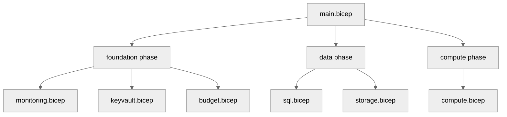

# 💻 Step 5: Implementation Reference - e2e-ralph-loop


<details open>
<summary><strong>📑 Implementation Reference</strong></summary>

- [📁 IaC Templates Location](#-iac-templates-location)
- [🗂️ File Structure](#-file-structure)
- [✅ Validation Status](#-validation-status)
- [🏗️ Resources Created](#-resources-created)
- [🚀 Deployment Instructions](#-deployment-instructions)
- [📝 Key Implementation Notes](#-key-implementation-notes)

</details>

> Generated by bicep-code agent | 2026-03-16

| ⬅️ Previous                                    | 📑 Index            | Next ➡️                                              |
| ---------------------------------------------- | ------------------- | ---------------------------------------------------- |
| [04-preflight-check.md](04-preflight-check.md) | [README](README.md) | [06-deployment-summary.md](06-deployment-summary.md) |

## 📁 IaC Templates Location

📁 **Code Location**: [`infra/bicep/e2e-ralph-loop/`](../../infra/bicep/e2e-ralph-loop/)

## 🗂️ File Structure

```text
infra/bicep/e2e-ralph-loop/
├── main.bicep
├── main.bicepparam
├── azure.yaml
├── deploy.ps1
└── modules/
    ├── budget.bicep
    ├── compute.bicep
    ├── keyvault.bicep
    ├── monitoring.bicep
    ├── sql.bicep
    └── storage.bicep
```

## ✅ Validation Status

✅ `bicep build` completed successfully. ✅ `bicep lint` completed successfully. ⚠️ `what-if` was intentionally not run during code generation. ❌ No validation failures remain in the generated Bicep.

| Check         | Result  | Details                                                 |
| ------------- | ------- | ------------------------------------------------------- |
| `bicep build` | ✅      | Local compilation completed successfully on 2026-03-16. |
| `bicep lint`  | ✅      | Local linting completed successfully on 2026-03-16.     |
| `what-if`     | Not run | Not executed by the code-generation step.               |

## 🏗️ Resources Created

| Resource                         | Bicep Type                                         | Module             |
| -------------------------------- | -------------------------------------------------- | ------------------ |
| Log Analytics Workspace          | `Microsoft.OperationalInsights/workspaces`         | `monitoring.bicep` |
| Application Insights             | `Microsoft.Insights/components`                    | `monitoring.bicep` |
| Key Vault                        | `Microsoft.KeyVault/vaults`                        | `keyvault.bicep`   |
| Budget                           | `Microsoft.Consumption/budgets`                    | `budget.bicep`     |
| Azure SQL Server and Database    | `Microsoft.Sql/servers`                            | `sql.bicep`        |
| Storage Account                  | `Microsoft.Storage/storageAccounts`                | `storage.bicep`    |
| App Service Plan and App Service | `Microsoft.Web/serverfarms`, `Microsoft.Web/sites` | `compute.bicep`    |
| Role Assignments                 | `Microsoft.Authorization/roleAssignments`          | `compute.bicep`    |



## 🚀 Deployment Instructions

<details>
<summary><strong>🟢 Quick Deploy (PowerShell)</strong></summary>

```powershell
cd infra/bicep/e2e-ralph-loop
./deploy.ps1
```

</details>

<details>
<summary><strong>🔍 Preview Changes (What-If)</strong></summary>

```powershell
cd infra/bicep/e2e-ralph-loop
./deploy.ps1 -WhatIf
```

</details>

<details>
<summary><strong>⚙️ Custom Phase Deployment</strong></summary>

```powershell
cd infra/bicep/e2e-ralph-loop
./deploy.ps1 -Phase foundation
./deploy.ps1 -Phase data
./deploy.ps1 -Phase compute
```

</details>

<details>
<summary><strong>🚀 Azure CLI</strong></summary>

```bash
az deployment group create \
  --resource-group rg-e2e-ralph-loop-prod \
  --template-file infra/bicep/e2e-ralph-loop/main.bicep \
  --parameters infra/bicep/e2e-ralph-loop/main.bicepparam
```

</details>

## 📝 Key Implementation Notes

| Note                                                                                                 | Impact                                                                              | Reference               |
| ---------------------------------------------------------------------------------------------------- | ----------------------------------------------------------------------------------- | ----------------------- |
| `uniqueSuffix` is generated once in `main.bicep` and reused for all globally unique names.           | Keeps storage, SQL, and Key Vault names deterministic across phases.                | `main.bicep`            |
| Deterministic naming replaces cross-module runtime dependencies.                                     | Any phase can be deployed independently as long as earlier resources already exist. | `main.bicep`            |
| App Service receives both Key Vault Secrets User and Storage Blob Data Contributor role assignments. | Enables secret retrieval and Entra-based blob access without shared keys.           | `modules/compute.bicep` |
| SQL uses Microsoft Entra-only authentication with a caller-supplied Entra administrator.             | Satisfies governance and avoids SQL authentication passwords.                       | `modules/sql.bicep`     |

```bicep
var uniqueSuffix = uniqueString(resourceGroup().id)
var storageAccountName = take('st${shortProjectName}${environment}${take(uniqueSuffix, 6)}', 24)
```

The implementation intentionally keeps networking simple for the E2E run: no private endpoints or VNet integration are generated because they were not part of the approved plan. Diagnostics are still sent to Log Analytics for Key Vault, Storage, and App Service.

---

_Implementation reference generated from Bicep templates._

---

<div align="center">

| ⬅️ [04-preflight-check.md](04-preflight-check.md) | 🏠 [Project Index](README.md) | ➡️ [06-deployment-summary.md](06-deployment-summary.md) |
| ------------------------------------------------- | ----------------------------- | ------------------------------------------------------- |

</div>
