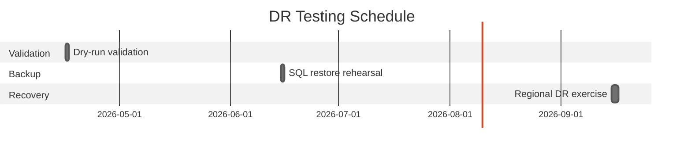

# 🛡️ Backup and Disaster Recovery Plan: e2e-ralph-loop


<details open>
<summary><strong>📑 DR Plan Contents</strong></summary>

- [📋 Executive Summary](#-executive-summary)
- [🎯 1. Recovery Objectives](#-1-recovery-objectives)
- [💾 2. Backup Strategy](#-2-backup-strategy)
- [🌍 3. Disaster Recovery Procedures](#-3-disaster-recovery-procedures)
- [🧪 4. Testing Schedule](#-4-testing-schedule)
- [📢 5. Communication Plan](#-5-communication-plan)
- [👥 6. Roles and Responsibilities](#-6-roles-and-responsibilities)
- [🔗 7. Dependencies](#-7-dependencies)
- [📖 8. Recovery Runbooks](#-8-recovery-runbooks)
- [📎 9. Appendix](#-9-appendix)
- [References](#references)

</details>

> Generated by 08-As-Built agent | 2026-03-16

<div align="center">

| ⬅️ Previous                                          | 📑 Index            | Next ➡️                                            |
| ---------------------------------------------------- | ------------------- | -------------------------------------------------- |
| [07-resource-inventory.md](07-resource-inventory.md) | [README](README.md) | [07-compliance-matrix.md](07-compliance-matrix.md) |

</div>

**Generated**: 2026-03-16
**Version**: 1.0
**Environment**: Production
**Primary Region**: swedencentral
**Secondary Region**: germanywestcentral (cold recovery target)

---

## 📋 Executive Summary

> [!IMPORTANT]
> This document defines the backup strategy and disaster recovery procedures for `e2e-ralph-loop`.

| Metric           | Current                  | Target                  |
| ---------------- | ------------------------ | ----------------------- |
| **RPO**          | Dry-run validated design | 24 hours                |
| **RTO**          | Dry-run validated design | 24 hours                |
| **Availability** | Not yet measured         | 99.9% service objective |

The architecture is a single-region MVP. Recovery therefore depends on Azure platform backups,
blob recoverability, and reproducible Bicep deployments rather than a hot standby environment.

---

## 🎯 1. Recovery Objectives

### 1.1 Recovery Time Objective (RTO)

| Tier         | RTO Target | Services                                                    |
| ------------ | ---------- | ----------------------------------------------------------- |
| 🔴 Critical  | 24 hours   | App Service, Azure SQL Database, Storage Account, Key Vault |
| 🟠 Important | 48 hours   | Application Insights, Log Analytics                         |
| 🟢 Standard  | 72 hours   | Budget alerts and non-critical governance automation        |

### 1.2 Recovery Point Objective (RPO)

| Data Type                 | RPO Target                                        | Backup Strategy                                              |
| ------------------------- | ------------------------------------------------- | ------------------------------------------------------------ |
| Customer and order data   | 24 hours                                          | Azure SQL platform-managed backups and point-in-time restore |
| Product images and files  | 24 hours logical recovery, 7 days object recovery | Blob soft delete and blob versioning                         |
| Application configuration | Rebuild from source                               | Redeploy Bicep templates and application configuration       |

```mermaid
%%{init: {'theme':'neutral'}}%%
gantt
    title RPO / RTO Targets by Tier
    dateFormat HH:mm
    axisFormat %H:%M
    section Critical
        RPO :crit, rpo1, 00:00, 24h
        RTO :crit, rto1, 00:00, 24h
    section Important
        RPO :rpo2, 00:00, 24h
        RTO :rto2, 00:00, 48h
    section Standard
        RPO :rpo3, 00:00, 48h
        RTO :rto3, 00:00, 72h
```



---

## 💾 2. Backup Strategy

<details>
<summary><strong>💾 Azure SQL Database</strong></summary>

| Setting             | Configuration                                         |
| ------------------- | ----------------------------------------------------- |
| Backup Type         | Azure SQL platform-managed backups                    |
| Retention (PITR)    | Basic tier recovery capability for short-term restore |
| Long-Term Retention | Not configured                                        |
| Geo-Redundancy      | Not explicitly configured in the MVP design           |

**Point-in-Time Restore Command:**

```bash
RG_NAME="rg-e2e-ralph-loop-prod"
SQL_SERVER_NAME="$(az sql server list --resource-group "$RG_NAME" --query "[0].name" -o tsv)"
az sql db restore \
  --resource-group "$RG_NAME" \
  --server "$SQL_SERVER_NAME" \
  --name sqldb-nordicfresh-prod \
  --dest-name sqldb-nordicfresh-prod-restored \
  --time "2026-03-16T00:00:00Z"
```

</details>

<details>
<summary><strong>🔐 Azure Key Vault</strong></summary>

| Setting          | Configuration |
| ---------------- | ------------- |
| Soft Delete      | Enabled       |
| Purge Protection | Enabled       |

</details>

Additional recovery measures:

- Storage account design assumes blob soft delete and versioning will be enabled with the workload configuration.
- Application configuration is recoverable by rerunning the Bicep deployment and reapplying app settings.
- All infrastructure state is represented in source control under [../../infra/bicep/e2e-ralph-loop/](../../infra/bicep/e2e-ralph-loop/).

---

## 🌍 3. Disaster Recovery Procedures

<details>
<summary><strong>🌍 Region Failover</strong></summary>

### 3.1 Failover Procedure

1. Declare a regional incident affecting `swedencentral`.
2. Freeze application changes and preserve the latest available SQL restore point.
3. Update deployment parameters to target `germanywestcentral`.
4. Redeploy the Bicep stack and restore data from the latest recoverable SQL point and blob versions.
5. Validate application startup, identity bindings, and telemetry before reopening service.

</details>

<details>
<summary><strong>↩️ Failback Procedure</strong></summary>

### 3.2 Failback Procedure

1. Confirm the primary region is healthy.
2. Capture delta data from the temporary recovery environment.
3. Redeploy the primary-region stack from the approved Bicep source.
4. Restore or migrate data back to the primary region.
5. Update DNS and reopen traffic after validation.

</details>

---

## 🧪 4. Testing Schedule

| Test Type                  | Frequency                          | Last Test        | Next Test                   |
| -------------------------- | ---------------------------------- | ---------------- | --------------------------- |
| Bicep dry-run validation   | Monthly                            | 2026-03-16       | 2026-04-16                  |
| SQL restore rehearsal      | Quarterly after first deployment   | Not yet executed | After first live deployment |
| Regional recovery exercise | Semi-annual after first deployment | Not yet executed | After first live deployment |



---

## 📢 5. Communication Plan

| Audience              | Channel         | Template                                                           |
| --------------------- | --------------- | ------------------------------------------------------------------ |
| Internal operators    | Teams or email  | Incident declaration with impact, owner, and ETA                   |
| Business stakeholders | Email           | Customer-impact summary and recovery ETA                           |
| Security reviewer     | Email or ticket | Compliance-impact summary, especially for PII and restore activity |

---

## 👥 6. Roles and Responsibilities

| Role                | Team                    | Responsibility                                           |
| ------------------- | ----------------------- | -------------------------------------------------------- |
| Incident commander  | Platform engineering    | Coordinate recovery decisions and timelines              |
| Data recovery lead  | Platform engineering    | SQL restore, storage recovery, and validation            |
| Application owner   | Product engineering     | Application smoke tests and customer communication input |
| Compliance reviewer | Governance and security | Confirm evidence capture and GDPR considerations         |

---

## 🔗 7. Dependencies

| Dependency                          | Impact                                                     | Mitigation                                          |
| ----------------------------------- | ---------------------------------------------------------- | --------------------------------------------------- |
| Microsoft Entra tenant availability | Required for SQL administration and managed identity flows | Maintain documented break-glass administrative path |
| Azure operator credentials          | Needed for restore and redeploy actions                    | Verify privileged access before maintenance windows |
| Source-controlled Bicep templates   | Required for environment rebuild                           | Protect repository access and review branch health  |
| Email notifications                 | Needed for budget and incident communications              | Maintain secondary contact list outside Azure       |

---

## 📖 8. Recovery Runbooks

| Scenario               | Runbook                                                            | Owner                |
| ---------------------- | ------------------------------------------------------------------ | -------------------- |
| SQL logical corruption | Point-in-time restore to a new database and application validation | Data recovery lead   |
| Region outage          | Redeploy to `germanywestcentral` and restore data                  | Incident commander   |
| Blob deletion          | Recover blobs from soft delete and version history                 | Platform engineering |

<details>
<summary><strong>📖 Runbook: SQL Point-in-Time Recovery</strong></summary>

**Trigger**: Accidental deletion or corruption of order data
**Estimated Duration**: 2-4 hours

1. Confirm the last known good restore point.
2. Restore the database to a new name.
3. Point the application to the restored database after validation.

**Validation**:

```bash
az sql db show \
  --resource-group rg-e2e-ralph-loop-prod \
  --server "$SQL_SERVER_NAME" \
  --name sqldb-nordicfresh-prod-restored \
  --query "{name:name,status:status}"
```

</details>

---

## 📎 9. Appendix

<details>
<summary>📋 Detailed Recovery Procedures</summary>

- Replace all placeholder deployment values before the first production deployment.
- Export deployment outputs after the first live run so resource names with suffixes are captured for operations.
- Store a tested restore checklist alongside release procedures.

</details>

---

## References

> [!NOTE]
> 📚 The following Microsoft Learn resources provide DR guidance.

| Topic                 | Link                                                                                            |
| --------------------- | ----------------------------------------------------------------------------------------------- |
| Azure Backup Overview | [Backup Overview](https://learn.microsoft.com/azure/backup/backup-overview)                     |
| Backup Best Practices | [Best Practices](https://learn.microsoft.com/azure/backup/backup-best-practices)                |
| RTO/RPO Guidance      | [Reliability Metrics](https://learn.microsoft.com/azure/well-architected/reliability/metrics)   |
| Site Recovery         | [ASR Overview](https://learn.microsoft.com/azure/site-recovery/site-recovery-overview)          |
| Business Continuity   | [DR Planning](https://learn.microsoft.com/azure/well-architected/reliability/disaster-recovery) |

---

_Backup and DR plan generated from dry-run validated infrastructure artifacts._

---

<div align="center">

| ⬅️ [07-resource-inventory.md](07-resource-inventory.md) | 🏠 [Project Index](README.md) | ➡️ [07-compliance-matrix.md](07-compliance-matrix.md) |
| ------------------------------------------------------- | ----------------------------- | ----------------------------------------------------- |

</div>
