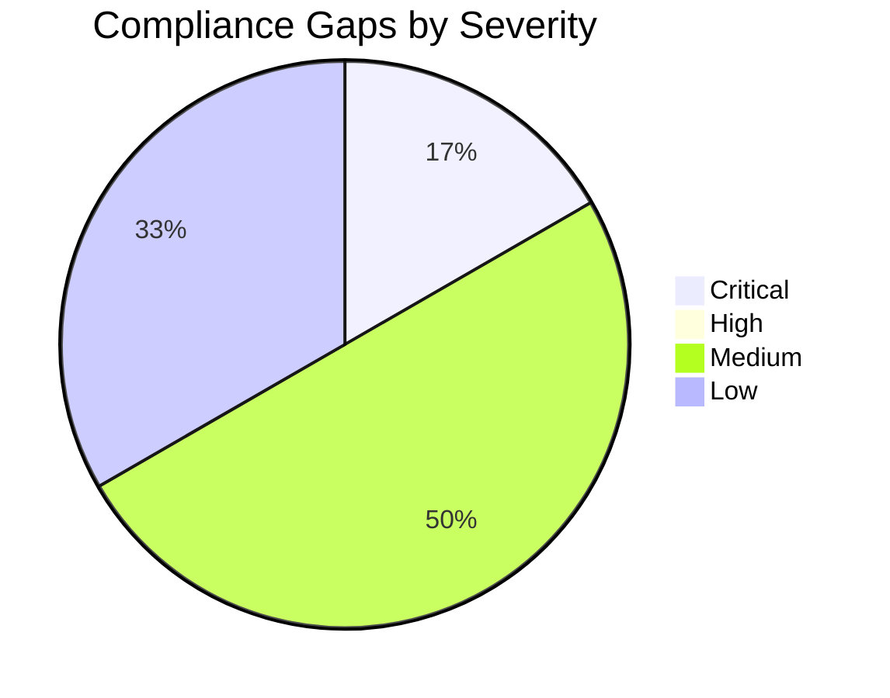

# ⚖️ Compliance Matrix: e2e-ralph-loop

<strong>📑 Compliance Contents</strong>

- [📋 Executive Summary](#-executive-summary)
- [🗺️ 1. Control Mapping](#%EF%B8%8F-1-control-mapping)
- [🔍 2. Gap Analysis](#-2-gap-analysis)
- [📁 3. Evidence Collection](#-3-evidence-collection)
- [📝 4. Audit Trail](#-4-audit-trail)
- [🔧 5. Remediation Tracker](#-5-remediation-tracker)
- [📎 6. Appendix](#-6-appendix)
- [References](#references)

> Generated by 08-As-Built agent | 2026-03-16

| ⬅️ Previous                                  | 📑 Index            | Next ➡️                                          |
| -------------------------------------------- | ------------------- | ------------------------------------------------ |
| [07-backup-dr-plan.md](07-backup-dr-plan.md) | [README](README.md) | [07-ab-cost-estimate.md](07-ab-cost-estimate.md) |

**Generated**: 2026-03-16
**Version**: 1.0
**Environment**: Production
**Primary Compliance Framework**: GDPR with Azure security baseline controls

---

## 📋 Executive Summary

> [!IMPORTANT]
> This compliance matrix maps the `e2e-ralph-loop` security controls to GDPR requirements and Azure technical baseline expectations.

| Compliance Area    | Coverage | Status |
| ------------------ | -------- | ------ |
| Network Security   | 70%      | ⚠️     |
| Data Protection    | 85%      | ✅     |
| Access Control     | 90%      | ✅     |
| Monitoring & Audit | 75%      | ⚠️     |
| Incident Response  | 60%      | ⚠️     |
| Overall            | 80%      | ⚠️     |

The design is strong on identity, encryption, tagging, and regional residency. The remaining gaps are mostly procedural or deployment-stage items rather than template defects.

---

## 🗺️ 1. Control Mapping

### Requirement 1: Data Residency and Protection

| Control                  | Requirement                                   | Implementation                                                                                           | Status |
| ------------------------ | --------------------------------------------- | -------------------------------------------------------------------------------------------------------- | ------ |
| EU-only region selection | Customer and order data must remain in the EU | `location` limited to `swedencentral` or `germanywestcentral` with primary deployment in `swedencentral` | ✅     |
| Encryption in transit    | Protect web, storage, and SQL traffic         | TLS 1.2 minimum and HTTPS-only settings                                                                  | ✅     |
| Blob privacy             | Prevent anonymous file exposure               | `allowBlobPublicAccess: false` and container `publicAccess: None`                                        | ✅     |
| GDPR erasure handling    | Support Article 17 deletion requests          | Operational process required; backup retention can delay final purge from PITR copies                    | ⚠️     |

<strong>📎 Evidence</strong>

**Evidence Location**: [01-requirements.md](01-requirements.md), [06-deployment-summary.md](06-deployment-summary.md), [modules/storage.bicep](../../infra/bicep/e2e-ralph-loop/modules/storage.bicep)

| Evidence Item                 | Type                  | Date Collected |
| ----------------------------- | --------------------- | -------------- |
| Regional requirement baseline | Requirements artifact | 2026-03-15     |
| Storage privacy controls      | Bicep source          | 2026-03-16     |
| Dry-run security validation   | Deployment summary    | 2026-03-16     |

### Requirement 2: Identity and Access Control

| Control                    | Requirement                                       | Implementation                                                    | Status |
| -------------------------- | ------------------------------------------------- | ----------------------------------------------------------------- | ------ |
| Entra-only SQL admin       | Avoid SQL authentication secrets                  | `azureADOnlyAuthentication: true` with Entra administrator object | ✅     |
| App identity to secrets    | Secret access without embedded credentials        | System-assigned managed identity and Key Vault RBAC               | ✅     |
| App identity to storage    | Blob access without shared keys                   | Managed identity plus `Storage Blob Data Contributor`             | ✅     |
| Production identity values | Real production administrator object and contacts | `main.bicepparam` still contains placeholder values               | ⚠️     |

### Requirement 3: Monitoring and Auditability

| Control               | Requirement                            | Implementation                                                                    | Status |
| --------------------- | -------------------------------------- | --------------------------------------------------------------------------------- | ------ |
| Centralized logs      | Consolidate platform and app telemetry | Log Analytics workspace with diagnostics from App Service, Storage, and Key Vault | ✅     |
| Application telemetry | Observe performance and failures       | Workspace-based Application Insights with production sampling                     | ✅     |
| Audit evidence        | Prove live control operation           | Dry-run only; no runtime evidence yet                                             | ⚠️     |

### Requirement 4: Operational Resilience

| Control                  | Requirement                              | Implementation                                                   | Status |
| ------------------------ | ---------------------------------------- | ---------------------------------------------------------------- | ------ |
| Budget control           | Detect spend drift early                 | €500 monthly budget with actual and forecast notifications       | ✅     |
| Recovery objectives      | Support 24h RTO and 24h RPO              | Single-region design with documented rebuild and restore process | ⚠️     |
| Tenant policy validation | Confirm effective Azure Policy alignment | Fallback governance artifact used; live discovery not captured   | ❌     |

---

## 🔍 2. Gap Analysis

| Gap                                                                                | Severity | Risk Level | Remediation                                                                 | Timeline                    |
| ---------------------------------------------------------------------------------- | -------- | ---------- | --------------------------------------------------------------------------- | --------------------------- |
| Placeholder SQL admin object ID and notification email remain in `main.bicepparam` | 🔴       | High       | Replace before first live deployment and revalidate                         | Before deployment           |
| Live Azure Policy assignment evidence was not captured                             | 🟡       | Medium     | Run live governance discovery in the target subscription                    | Before deployment           |
| No runtime evidence exists because Step 6 was dry-run only                         | 🟡       | Medium     | Collect post-deployment evidence from Azure Monitor and resource properties | After deployment            |
| GDPR erasure process must account for retained SQL PITR backups                    | 🟡       | Medium     | Publish an erasure runbook with backup exception wording                    | Before go-live              |
| Public endpoints remain enabled for simplicity                                     | 🟢       | Low        | Reassess private endpoints if threat model or governance changes            | Future scale review         |
| DR procedures are documented but not exercised                                     | 🟢       | Low        | Schedule a restore rehearsal after deployment                               | First quarter after go-live |

---

## 📁 3. Evidence Collection

<strong>📁 Evidence Items</strong>

| Control                | Evidence Type                             | Location                                                                                                                                          | Last Collected |
| ---------------------- | ----------------------------------------- | ------------------------------------------------------------------------------------------------------------------------------------------------- | -------------- |
| EU residency           | Requirements and architecture artifacts   | [01-requirements.md](01-requirements.md), [02-architecture-assessment.md](02-architecture-assessment.md)                                          | 2026-03-15     |
| Security baseline      | Dry-run validation artifact               | [06-deployment-summary.md](06-deployment-summary.md)                                                                                              | 2026-03-16     |
| Identity configuration | Bicep source and implementation reference | [modules/compute.bicep](../../infra/bicep/e2e-ralph-loop/modules/compute.bicep), [05-implementation-reference.md](05-implementation-reference.md) | 2026-03-16     |
| Governance alignment   | Governance baseline artifact              | [04-governance-constraints.md](04-governance-constraints.md)                                                                                      | 2026-03-16     |

---

## 📝 4. Audit Trail

| Date       | Auditor            | Finding                                                         | Status | Evidence                                                       |
| ---------- | ------------------ | --------------------------------------------------------------- | ------ | -------------------------------------------------------------- |
| 2026-03-15 | Architecture agent | Selected GDPR-aligned EU region and identity-first design       | Closed | [02-architecture-assessment.md](02-architecture-assessment.md) |
| 2026-03-16 | Governance agent   | Fallback governance baseline used due incomplete live discovery | Open   | [04-governance-constraints.md](04-governance-constraints.md)   |
| 2026-03-16 | E2E conductor      | Dry-run validation passed; placeholders remain                  | Open   | [06-deployment-summary.md](06-deployment-summary.md)           |

---

## 🔧 5. Remediation Tracker

| Finding                                       | Owner                          | Due Date                | Status  |
| --------------------------------------------- | ------------------------------ | ----------------------- | ------- |
| Replace placeholder SQL admin object ID       | Platform owner                 | Before first deployment | ⬜ Todo |
| Replace placeholder budget notification email | Platform owner                 | Before first deployment | ⬜ Todo |
| Execute live governance discovery             | Governance reviewer            | Before first deployment | ⬜ Todo |
| Publish GDPR erasure runbook                  | Product owner + platform owner | Before go-live          | ⬜ Todo |
| Collect post-deployment evidence set          | Platform owner                 | First production week   | ⬜ Todo |

---

## 📎 6. Appendix

### A. Compliance Framework Reference

The primary regulatory driver is GDPR, specifically EU data residency and Article 17 deletion support.
Technical baseline expectations are derived from Azure security best practices for TLS, HTTPS-only access,
identity-based authentication, and centralized logging.

`❌` in this document indicates a missing or unverified control rather than an implementation defect in the Bicep syntax itself.

### B. Azure Security Baseline Mapping

| Baseline Topic  | Current State                                                        |
| --------------- | -------------------------------------------------------------------- |
| Identity        | Managed identity on App Service, Entra-only SQL administration       |
| Data protection | TLS 1.2, HTTPS-only, no public blob access, no shared keys           |
| Logging         | Log Analytics and Application Insights configured                    |
| Network         | Public endpoints retained; service ACLs act as compensating controls |

---

## References

> [!NOTE]
> 📚 The following Microsoft Learn resources provide compliance guidance.

| Topic                              | Link                                                                                                                        |
| ---------------------------------- | --------------------------------------------------------------------------------------------------------------------------- |
| Microsoft Cloud Security Benchmark | [MCSB Overview](https://learn.microsoft.com/security/benchmark/azure/overview)                                              |
| Azure Compliance Offerings         | [Compliance](https://learn.microsoft.com/azure/compliance/)                                                                 |
| Azure Policy                       | [Policy Overview](https://learn.microsoft.com/azure/governance/policy/overview)                                             |
| Regulatory Compliance              | [Built-in Policies](https://learn.microsoft.com/azure/governance/policy/samples/built-in-initiatives#regulatory-compliance) |

---

_Compliance matrix generated from dry-run validated infrastructure artifacts._

---

| ⬅️ [07-backup-dr-plan.md](07-backup-dr-plan.md) | 🏠 [Project Index](README.md) | ➡️ [07-ab-cost-estimate.md](07-ab-cost-estimate.md) |
| ----------------------------------------------- | ----------------------------- | --------------------------------------------------- |

