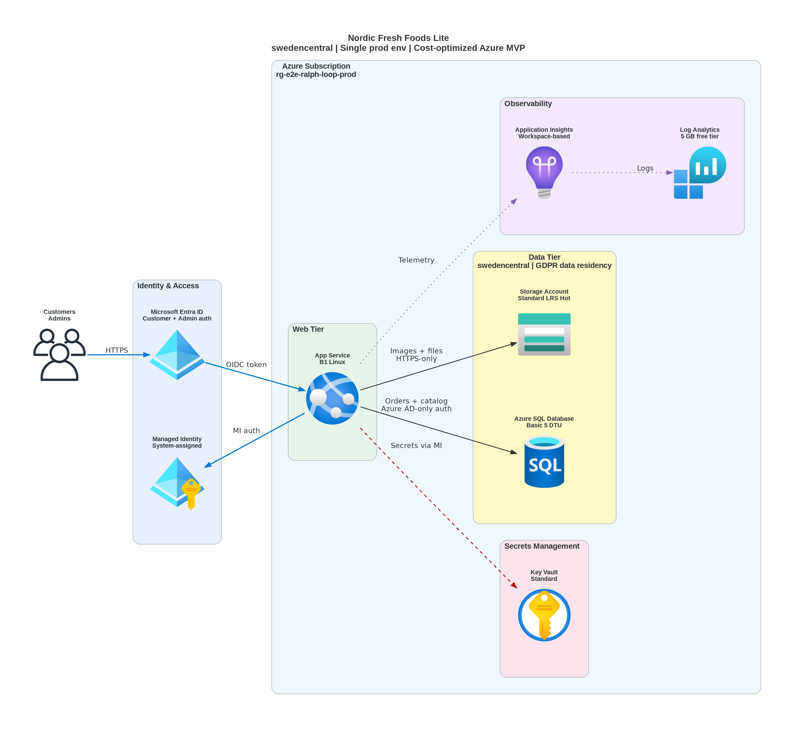

# 📐 Azure Design Document: e2e-ralph-loop

<strong>📑 Design Contents</strong>

- [📝 1. Introduction](#-1-introduction)
- [🏛️ 2. Azure Architecture Overview](#-2-azure-architecture-overview)
- [🌐 3. Networking](#-3-networking)
- [💾 4. Storage](#-4-storage)
- [💻 5. Compute](#-5-compute)
- [👤 6. Identity & Access](#-6-identity--access)
- [🔐 7. Security & Compliance](#-7-security--compliance)
- [🔄 8. Backup & Disaster Recovery](#-8-backup--disaster-recovery)
- [📊 9. Management & Monitoring](#-9-management--monitoring)
- [📎 10. Appendix](#-10-appendix)
- [References](#references)

> Generated by 08-As-Built agent | 2026-03-16

| ⬅️ Previous                                            | 📑 Index            | Next ➡️                                              |
| ------------------------------------------------------ | ------------------- | ---------------------------------------------------- |
| [07-documentation-index.md](07-documentation-index.md) | [README](README.md) | [07-operations-runbook.md](07-operations-runbook.md) |

**Version**: 1.0
**Date**: 2026-03-16
**Author**: Generated by 08-As-Built agent
**Status**: Complete

---

## 📝 1. Introduction

### 1.1 Document Purpose

This design document provides comprehensive technical documentation for the `e2e-ralph-loop`
Azure infrastructure. Because Step 6 was an intentional dry-run, this document records the
validated target design rather than an observed deployed estate.

**Intended Audience:**

- Solution architects
- Operations and support engineers
- Security and compliance reviewers
- Developers preparing the first live deployment

### 1.2 Project Overview

Nordic Fresh Foods Lite is a simple Azure-hosted ordering platform for a Scandinavian startup.
The approved MVP architecture uses Azure App Service B1 on Linux for the web tier, Azure SQL
Database Basic for transactional data, Azure Storage Standard LRS for product assets, Azure Key
Vault for secret access, and Azure Monitor services for telemetry.

**Business Objectives:**

- Launch a production-capable ordering platform within a strict Azure budget below €500/month.
- Keep customer and order data inside the EU to satisfy GDPR residency expectations.
- Use managed Azure services and Bicep AVM modules to minimize operational complexity.

### 1.3 Design Objectives

| Objective    | Target                                        | Implementation                                                                       |
| ------------ | --------------------------------------------- | ------------------------------------------------------------------------------------ |
| Availability | 99.9% service objective                       | Single-region managed services with platform SLAs and documented recovery procedures |
| Performance  | <50 concurrent users, p95 API latency <500 ms | Linux App Service B1, SQL Basic, and direct blob storage for low-volume workloads    |
| Security     | Entra-first, TLS 1.2+, no shared keys         | App Service managed identity, Entra-only SQL, Key Vault RBAC, Storage RBAC           |
| Scalability  | Straightforward scale-up path                 | Clean upgrade path to S1 App Service, S0 SQL, and optional private networking        |

### 1.4 Constraints & Assumptions

**Constraints:**

- Single production environment only for the MVP and E2E evaluation.
- Budget ceiling remains below €500/month, with the validated baseline near €16/month.

**Assumptions:**

- Live deployment will replace placeholder SQL administrator and notification email values before provisioning.
- The initial production rollout can accept single-region recovery objectives of RTO 24h and RPO 24h.

### 1.5 Stakeholders

| Role              | Team                             | Responsibility                                          |
| ----------------- | -------------------------------- | ------------------------------------------------------- |
| Product owner     | Nordic Fresh Foods business team | Service requirements, budget, and go-live approval      |
| Platform owner    | Azure engineering team           | Deployment, monitoring, patching, and incident response |
| Security reviewer | Governance and compliance        | GDPR posture, access control, and evidence review       |

---

## 🏛️ 2. Azure Architecture Overview

### 2.1 Architecture Diagram

Source: [03-des-diagram.py](./03-des-diagram.py)

The diagram above remains the authoritative visual for the validated design because no Step 7
runtime diagram was needed for this dry-run evaluation.

### 2.2 Resource Summary

| Category   | Count                         |
| ---------- | ----------------------------- |
| Compute    | 2                             |
| Networking | 0 dedicated network resources |
| Data       | 3                             |
| Security   | 2                             |

The validated footprint is intentionally minimal: an App Service Plan and site, an Azure SQL server
and database, a Storage Account, a Key Vault, Log Analytics, Application Insights, and a resource-group
budget. Networking remains public-endpoint based with compensating service-level controls.

---

## 🌐 3. Networking

The design does not provision a virtual network, private endpoints, NAT gateway, or Application Gateway.
That is a conscious cost and complexity decision aligned to the `simple` classification for this workload.

| Area                      | Validated Design                                                              |
| ------------------------- | ----------------------------------------------------------------------------- |
| Ingress                   | Public App Service endpoint over HTTPS only                                   |
| East-west traffic         | Platform-managed public endpoints between App Service and downstream services |
| SQL network posture       | Public network enabled with Azure services firewall exception                 |
| Storage network posture   | `defaultAction: Deny`, Azure services bypass, public network enabled          |
| Key Vault network posture | `defaultAction: Deny`, Azure services bypass, public network enabled          |
| Private networking        | Deferred until scale, stricter governance, or threat model changes require it |

This model trades stronger isolation for lower cost and faster initial delivery. The security model
therefore depends on managed identity, Entra RBAC, TLS enforcement, and service diagnostics rather than
private IP connectivity.

---

## 💾 4. Storage

The validated design uses two distinct data stores.

| Service                      | Role                                    | Key Configuration                                                     |
| ---------------------------- | --------------------------------------- | --------------------------------------------------------------------- |
| Azure SQL Database Basic     | Orders, customer data, product metadata | 2 GB max size, Entra-only authentication, security alerts enabled     |
| Storage Account Standard LRS | Product images and unstructured assets  | StorageV2, HTTPS-only, TLS 1.2, no public blob access, no shared keys |

Storage-specific implementation details from the Bicep source:

- An `assets` blob container is created with `publicAccess: None`.
- Shared key access is disabled to force Entra RBAC or managed identity usage.
- Storage diagnostics send metrics to the Log Analytics workspace.
- The SQL server deploys a single Basic tier database named `sqldb-nordicfresh-prod`.

The design deliberately avoids premium storage, geo-redundant storage, and cache layers because the
workload profile does not justify those costs at MVP scale.

---

## 💻 5. Compute

The compute layer is intentionally conservative and optimized for cost.

| Component                 | Validated Configuration                                |
| ------------------------- | ------------------------------------------------------ | ------- |
| App Service Plan          | `asp-e2e-ralph-loop-prod`, Linux, B1, capacity 1       |
| Web App                   | `app-e2e-ralph-loop-prod-{suffix6}`, Linux App Service |
| Runtime                   | `NODE                                                  | 20-lts` |
| App availability settings | `alwaysOn: true` in production                         |
| Protocols                 | HTTPS only, HTTP/2 enabled, FTPS disabled              |

The ADR in [03-des-adr-001-compute-tier.md](03-des-adr-001-compute-tier.md) records why B1 Linux was
selected over Free, S1, or Azure Container Apps. The chosen tier preserves a simple scale-up path while
keeping the platform far under the approved cost envelope.

---

## 👤 6. Identity & Access

Identity is the central security control in this design.

| Access Path              | Implementation                                                             |
| ------------------------ | -------------------------------------------------------------------------- |
| App Service to Key Vault | System-assigned managed identity with `Key Vault Secrets User` role        |
| App Service to Storage   | System-assigned managed identity with `Storage Blob Data Contributor` role |
| SQL administration       | Microsoft Entra administrator object provided at deployment time           |
| SQL authentication mode  | `azureADOnlyAuthentication: true`                                          |
| Key Vault authorization  | RBAC mode enabled                                                          |

The application receives configuration values for Key Vault URI, SQL server name, SQL database name,
storage account name, and Application Insights connection string as app settings. No secret material is
stored in the template or application configuration.

---

## 🔐 7. Security & Compliance

<strong>🔒 Security Controls</strong>

| Control           | Implementation                                                                                            | Evidence                                                                                                                                                           |
| ----------------- | --------------------------------------------------------------------------------------------------------- | ------------------------------------------------------------------------------------------------------------------------------------------------------------------ |
| TLS 1.2+          | App Service `minTlsVersion: '1.2'`, Storage `minimumTlsVersion: 'TLS1_2'`, SQL `minimalTlsVersion: '1.2'` | [06-deployment-summary.md](06-deployment-summary.md), [modules/compute.bicep](../../infra/bicep/e2e-ralph-loop/modules/compute.bicep)                              |
| HTTPS-only        | App Service `httpsOnly: true`, Storage `supportsHttpsTrafficOnly: true`                                   | [06-deployment-summary.md](06-deployment-summary.md)                                                                                                               |
| Managed Identity  | System-assigned identity on App Service                                                                   | [modules/compute.bicep](../../infra/bicep/e2e-ralph-loop/modules/compute.bicep)                                                                                    |
| Network isolation | Service-level ACLs on Storage and Key Vault, Azure services exception on SQL firewall                     | [modules/storage.bicep](../../infra/bicep/e2e-ralph-loop/modules/storage.bicep), [modules/keyvault.bicep](../../infra/bicep/e2e-ralph-loop/modules/keyvault.bicep) |

<strong>📋 Compliance Mapping</strong>

| Framework               | Control ID                   | Status |
| ----------------------- | ---------------------------- | ------ |
| GDPR                    | EU data residency            | ✅     |
| GDPR                    | Article 17 erasure support   | ⚠️     |
| Azure security baseline | Identity-first access        | ✅     |
| Azure security baseline | Public endpoint minimization | ⚠️     |
| Operational evidence    | Live deployment proof        | ❌     |

Security posture is strong for a low-cost MVP, but not equivalent to a private-networked production estate.
Accepted design trade-offs include public endpoints for App Service, SQL, Storage, and Key Vault, mitigated by
Entra-only access, RBAC, firewall rules, and logging. The main outstanding compliance items are procedural:
replace placeholder production values, document erasure handling against SQL PITR retention, and confirm tenant
policy state with live governance discovery before the first deployment.

Current non-compliant evidence gaps for this dry-run state:

- ❌ No live deployment evidence exists yet for runtime control verification.

---

## 🔄 8. Backup & Disaster Recovery

The design targets relaxed MVP recovery objectives.

| Topic             | Validated Position                                                               |
| ----------------- | -------------------------------------------------------------------------------- |
| RTO               | 24 hours                                                                         |
| RPO               | 24 hours                                                                         |
| Primary region    | `swedencentral`                                                                  |
| Failover strategy | Rebuild in `germanywestcentral` from Bicep and restore data where possible       |
| SQL recovery      | Platform-managed SQL backups with point-in-time restore capability on Basic tier |
| Blob recovery     | Blob soft delete and versioning per workload requirement                         |

There is no warm standby region, active-passive deployment, or cross-region storage replication in this design.
Recovery therefore depends on infrastructure reproducibility and retained platform backups rather than immediate failover.

---

## 📊 9. Management & Monitoring

Monitoring is built around Azure Monitor services.

| Component            | Configuration                                                              |
| -------------------- | -------------------------------------------------------------------------- |
| Log Analytics        | `log-e2e-ralph-loop-prod`, `PerGB2018`, 30-day retention, 2 GB daily quota |
| Application Insights | Workspace-based, web application type, 50% sampling in production          |
| Diagnostic settings  | App Service, Storage, and Key Vault send logs and metrics to Log Analytics |
| Cost control         | Monthly budget of €500 with forecast and actual notifications              |

Operationally, the design still needs live alert rules and dashboards to be configured after deployment. The Step 6
artifact validates that the infrastructure supports the telemetry path, but it does not prove runtime signal quality yet.

---

## 📎 10. Appendix

📋 Detailed Resource Configuration

| Resource                | Target Name                         |
| ----------------------- | ----------------------------------- |
| Resource Group          | `rg-e2e-ralph-loop-prod`            |
| Log Analytics Workspace | `log-e2e-ralph-loop-prod`           |
| Application Insights    | `appi-e2e-ralph-loop-prod`          |
| Key Vault               | `kv-e2erlp-prod-{suffix6}`          |
| SQL Server              | `sql-e2e-ralph-loop-prod-{suffix6}` |
| SQL Database            | `sqldb-nordicfresh-prod`            |
| Storage Account         | `ste2erlpprod{suffix6}`             |
| App Service Plan        | `asp-e2e-ralph-loop-prod`           |
| App Service             | `app-e2e-ralph-loop-prod-{suffix6}` |
| Budget                  | `budget-e2e-ralph-loop-prod`        |

`{suffix6}` is the first six characters of `uniqueString(resourceGroup().id)` and remains unresolved until the first live deployment.

📚 Reference Architecture Links

| Architecture                            | Link                                                                   |
| --------------------------------------- | ---------------------------------------------------------------------- |
| Azure App Service landing zone guidance | https://learn.microsoft.com/azure/app-service/overview                 |
| Azure SQL Database security guidance    | https://learn.microsoft.com/azure/azure-sql/database/security-overview |
| Azure Verified Modules index            | https://aka.ms/avm/index                                               |

---

## References

> [!NOTE]
> 📚 The following Microsoft Learn resources provide additional guidance.

| Topic                      | Link                                                                                               |
| -------------------------- | -------------------------------------------------------------------------------------------------- |
| Well-Architected Framework | [Overview](https://learn.microsoft.com/azure/well-architected/)                                    |
| Azure Architecture Center  | [Architectures](https://learn.microsoft.com/azure/architecture/)                                   |
| Security Best Practices    | [Security Baseline](https://learn.microsoft.com/security/benchmark/azure/overview)                 |
| Networking Best Practices  | [Network Security](https://learn.microsoft.com/azure/security/fundamentals/network-best-practices) |
| Backup Best Practices      | [Azure Backup](https://learn.microsoft.com/azure/backup/backup-best-practices)                     |
| Monitoring Overview        | [Azure Monitor](https://learn.microsoft.com/azure/azure-monitor/overview)                          |

---

_Design document generated from validated infrastructure artifacts._

---

| ⬅️ [07-documentation-index.md](07-documentation-index.md) | 🏠 [Project Index](README.md) | ➡️ [07-operations-runbook.md](07-operations-runbook.md) |
| --------------------------------------------------------- | ----------------------------- | ------------------------------------------------------- |

