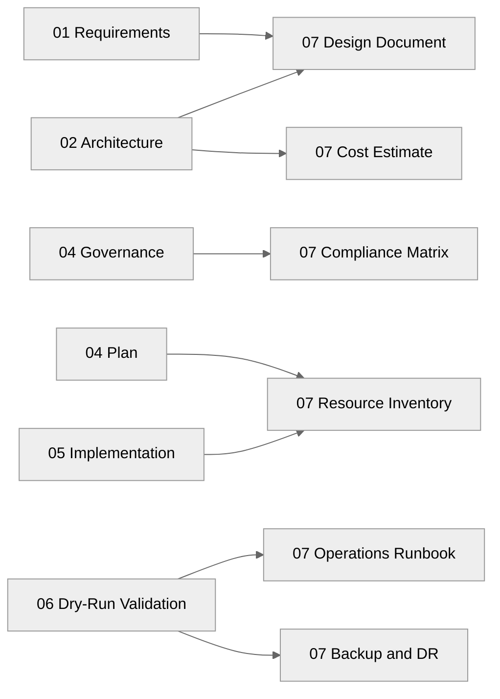

# 📚 e2e-ralph-loop - Workload Documentation

<strong>📑 Documentation Contents</strong>

- [📦 1. Document Package Contents](#-1-document-package-contents)
- [📚 2. Source Artifacts](#-2-source-artifacts)
- [📋 3. Project Summary](#-3-project-summary)
- [🔗 4. Related Resources](#-4-related-resources)
- [⚡ 5. Quick Links](#-5-quick-links)

> Generated by 08-As-Built agent | 2026-03-16

| ⬅️ Previous                                          | 📑 Index            | Next ➡️                                        |
| ---------------------------------------------------- | ------------------- | ---------------------------------------------- |
| [06-deployment-summary.md](06-deployment-summary.md) | [README](README.md) | [07-design-document.md](07-design-document.md) |

**Generated**: 2026-03-16
**Version**: 1.0
**Status**: Complete

---

## 📦 1. Document Package Contents

| Document                                           | Description                                                                       | Status                                                        |
| -------------------------------------------------- | --------------------------------------------------------------------------------- | ------------------------------------------------------------- |
| [Design Document](./07-design-document.md)         | Comprehensive validated infrastructure design for the Nordic Fresh Foods Lite MVP |  |
| [Operations Runbook](./07-operations-runbook.md)   | Day-2 operations, validation, incident handling, and change procedures            |  |
| [Resource Inventory](./07-resource-inventory.md)   | Validated target resource inventory with names, SKUs, and key settings            |  |
| [Backup & DR Plan](./07-backup-dr-plan.md)         | Backup, restore, failover, and recovery guidance for the single-region MVP        |  |
| [Compliance Matrix](./07-compliance-matrix.md)     | GDPR and Azure security control mapping with implementation gaps                  |  |
| [As-Built Cost Estimate](./07-ab-cost-estimate.md) | Dry-run validated cost baseline derived from the approved Bicep design            |  |

---

## 📚 2. Source Artifacts

These documents were generated from the following agentic workflow outputs:

| Artifact                 | Source                                                             | Generated  |
| ------------------------ | ------------------------------------------------------------------ | ---------- |
| Requirements baseline    | [01-requirements.md](./01-requirements.md)                         | 2026-03-15 |
| Architecture assessment  | [02-architecture-assessment.md](./02-architecture-assessment.md)   | 2026-03-15 |
| Design cost estimate     | [03-des-cost-estimate.md](./03-des-cost-estimate.md)               | 2026-03-15 |
| Compute ADR              | [03-des-adr-001-compute-tier.md](./03-des-adr-001-compute-tier.md) | 2026-03-16 |
| Governance constraints   | [04-governance-constraints.md](./04-governance-constraints.md)     | 2026-03-16 |
| Implementation plan      | [04-implementation-plan.md](./04-implementation-plan.md)           | 2026-03-15 |
| Pre-flight validation    | [04-preflight-check.md](./04-preflight-check.md)                   | 2026-03-16 |
| Implementation reference | [05-implementation-reference.md](./05-implementation-reference.md) | 2026-03-16 |
| Deployment summary       | [06-deployment-summary.md](./06-deployment-summary.md)             | 2026-03-16 |

> The Step 7 suite documents the validated design because the Step 6 run was intentionally dry-run only and created no Azure resources.

---

## 📋 3. Project Summary

| Attribute                           | Value                                      |
| ----------------------------------- | ------------------------------------------ |
| **Project Name**                    | Nordic Fresh Foods Lite (`e2e-ralph-loop`) |
| **Environment**                     | Production only                            |
| **Primary Region**                  | `swedencentral`                            |
| **Compliance**                      | GDPR with EU data residency                |
| **IaC Tool**                        | Bicep with Azure Verified Modules          |
| **Deployment State**                | Validated dry-run, not deployed            |
| **Validated Monthly Cost Baseline** | ~€15.68/month                              |

---

## 🔗 4. Related Resources

- **Infrastructure Code**: [../../infra/bicep/e2e-ralph-loop/](../../infra/bicep/e2e-ralph-loop/)
- **Project Artifact Index**: [README.md](./README.md)
- **Design Diagram**: [03-des-diagram.png](./03-des-diagram.png)
- **Deployment Summary**: [06-deployment-summary.md](./06-deployment-summary.md)

---

## ⚡ 5. Quick Links

- 📄 **Architecture**: [02-architecture-assessment.md](./02-architecture-assessment.md) | [07-design-document.md](./07-design-document.md)
- 🧾 **Implementation**: [04-implementation-plan.md](./04-implementation-plan.md) | [05-implementation-reference.md](./05-implementation-reference.md)
- 🔐 **Operations & Controls**: [07-operations-runbook.md](./07-operations-runbook.md) | [07-compliance-matrix.md](./07-compliance-matrix.md)
- 💰 **Cost & Recovery**: [07-ab-cost-estimate.md](./07-ab-cost-estimate.md) | [07-backup-dr-plan.md](./07-backup-dr-plan.md)

---

_Documentation index generated by the As-Built agent from dry-run validated artifacts._

---

| ⬅️ [06-deployment-summary.md](06-deployment-summary.md) | 🏠 [Project Index](README.md) | ➡️ [07-design-document.md](07-design-document.md) |
| ------------------------------------------------------- | ----------------------------- | ------------------------------------------------- |

