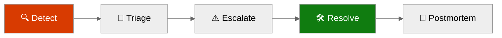
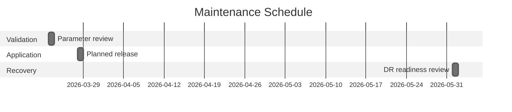
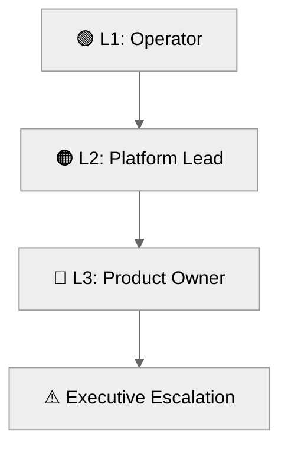

# 📖 Operations Runbook: e2e-ralph-loop


<details open>
<summary><strong>📑 Runbook Contents</strong></summary>

- [⚡ Quick Reference](#-quick-reference)
- [📋 1. Daily Operations](#-1-daily-operations)
- [🚨 2. Incident Response](#-2-incident-response)
- [🔧 3. Common Procedures](#-3-common-procedures)
- [🕐 4. Maintenance Windows](#-4-maintenance-windows)
- [📞 5. Contacts & Escalation](#-5-contacts--escalation)
- [📝 6. Change Log](#-6-change-log)
- [References](#references)

</details>

> Generated by 08-As-Built agent | 2026-03-16

| ⬅️ Previous                                    | 📑 Index            | Next ➡️                                              |
| ---------------------------------------------- | ------------------- | ---------------------------------------------------- |
| [07-design-document.md](07-design-document.md) | [README](README.md) | [07-resource-inventory.md](07-resource-inventory.md) |

**Version**: 1.0
**Date**: 2026-03-16
**Environment**: Production
**Region**: swedencentral

---

## ⚡ Quick Reference

| Item                | Value                                    |
| ------------------- | ---------------------------------------- |
| **Primary Region**  | swedencentral                            |
| **Resource Group**  | `rg-e2e-ralph-loop-prod`                 |
| **Support Contact** | Business-hours platform owner            |
| **Escalation Path** | Operator → platform lead → product owner |

### Critical Resources

| Resource           | Name                                | Resource Group           | Severity |
| ------------------ | ----------------------------------- | ------------------------ | -------- |
| App Service        | `app-e2e-ralph-loop-prod-{suffix6}` | `rg-e2e-ralph-loop-prod` | 🔴 P1    |
| Azure SQL Database | `sqldb-nordicfresh-prod`            | `rg-e2e-ralph-loop-prod` | 🔴 P1    |
| Storage Account    | `ste2erlpprod{suffix6}`             | `rg-e2e-ralph-loop-prod` | 🟠 P2    |
| Key Vault          | `kv-e2erlp-prod-{suffix6}`          | `rg-e2e-ralph-loop-prod` | 🟠 P2    |

---

## 📋 1. Daily Operations

### 1.1 Health Checks

**Morning Health Check:**

1. ✅ Confirm the Bicep templates in [../../infra/bicep/e2e-ralph-loop/](../../infra/bicep/e2e-ralph-loop/) still build and lint cleanly.
2. ✅ Verify that placeholder values in `main.bicepparam` have not leaked into a deployment request.
3. ✅ Review budget, security, and telemetry configuration drift against [06-deployment-summary.md](06-deployment-summary.md).

**KQL Query - System Health Overview:**

<details>
<summary><strong>📊 Health Check KQL</strong></summary>

```kusto
let lookback = 24h;
union AppRequests, AppExceptions
| where TimeGenerated > ago(lookback)
| summarize Count = count() by Type
| order by Count desc
```

</details>

This query becomes actionable after the first live deployment. For the current E2E run, the equivalent operational check is that diagnostics are configured in Bicep and validation still passes.

### 1.2 Log Review

**Priority Logs to Review:**

| Log Source            | Query Focus                                               | Action Threshold                        |
| --------------------- | --------------------------------------------------------- | --------------------------------------- |
| Application Insights  | HTTP 5xx, failed dependencies, high p95 latency           | Investigate if sustained for 15 minutes |
| Log Analytics         | Key Vault audit failures and storage authorization errors | Investigate any repeated failures       |
| Azure SQL diagnostics | Login failures or security alert triggers                 | Escalate same business day              |
| Budget notifications  | 80%, 100%, or 120% forecast threshold                     | Review within one business day          |

---

## 🚨 2. Incident Response

### 2.1 Severity Definitions

| Severity | Definition                                                                       | Response Time               |
| -------- | -------------------------------------------------------------------------------- | --------------------------- |
| 🔴 P1    | Ordering platform unavailable or order data inaccessible                         | 1 hour during support hours |
| 🟠 P2    | Partial degradation affecting admin workflows, secrets access, or file retrieval | 4 business hours            |
| 🟢 P3    | Low-impact issue, documentation drift, or non-critical alert noise               | 2 business days             |

### Incident Response Flow



### 2.2 Runbooks by Alert

| Alert                             | Runbook                                                                       | Owner                          |
| --------------------------------- | ----------------------------------------------------------------------------- | ------------------------------ |
| App Service unavailable           | Restart site, validate App Insights telemetry, review deployment changes      | Platform owner                 |
| SQL login or connectivity failure | Verify Entra admin object, firewall posture, and managed identity permissions | Platform owner                 |
| Storage authorization denied      | Validate RBAC role assignment and app identity principal                      | Platform owner                 |
| Budget threshold reached          | Review cost line items and deferred features before any SKU increase          | Product owner + platform owner |

---

## 🔧 3. Common Procedures

### 3.1 Restart Services

<details>
<summary>🔧 Restart App Service</summary>

```bash
RG_NAME="rg-e2e-ralph-loop-prod"
APP_NAME="$(az webapp list --resource-group "$RG_NAME" --query "[0].name" -o tsv)"
az webapp restart --resource-group "$RG_NAME" --name "$APP_NAME"
```

</details>

### 3.2 Scale Resources

<details>
<summary>📈 Scale Up/Out Commands</summary>

```bash
RG_NAME="rg-e2e-ralph-loop-prod"
PLAN_NAME="asp-e2e-ralph-loop-prod"
SQL_SERVER_NAME="$(az sql server list --resource-group "$RG_NAME" --query "[0].name" -o tsv)"

az appservice plan update --resource-group "$RG_NAME" --name "$PLAN_NAME" --sku S1
az sql db update --resource-group "$RG_NAME" --server "$SQL_SERVER_NAME" --name sqldb-nordicfresh-prod --service-objective S0
```

</details>

Other routine tasks:

- Replace `sqlAdminObjectId` and notification emails before the first live deployment.
- Re-run `bicep build` and `bicep lint` after any template or parameter change.
- Review role assignments whenever the application identity model changes.

---

## 🕐 4. Maintenance Windows

| Task                            | Schedule                  | Duration      |
| ------------------------------- | ------------------------- | ------------- |
| Infrastructure parameter review | Weekly, business hours    | 30 minutes    |
| Planned application maintenance | Weekends, 02:00-06:00 CET | Up to 2 hours |
| DR readiness review             | Quarterly                 | 2 hours       |



> Use the low-traffic weekend window for production changes once the service is live.

> [!TIP]
> 💡 Keep Bicep deployments and app releases separate during the first production month to simplify rollback and incident isolation.

---

## 📞 5. Contacts & Escalation

| Role              | Contact                          | Phone | On-Call Rotation    |
| ----------------- | -------------------------------- | ----- | ------------------- |
| Platform owner    | Azure engineering lead           | N/A   | Business hours only |
| Product owner     | Nordic Fresh Foods service owner | N/A   | N/A                 |
| Security reviewer | Governance reviewer              | N/A   | N/A                 |

### Escalation Path



---

## 📝 6. Change Log

| Date       | Change                                                                | Author            |
| ---------- | --------------------------------------------------------------------- | ----------------- |
| 2026-03-16 | Initial dry-run operations runbook generated from Steps 1-6 artifacts | 08-As-Built agent |

---

## References

> [!NOTE]
> 📚 The following Microsoft Learn resources provide operational guidance.

| Topic                 | Link                                                                                             |
| --------------------- | ------------------------------------------------------------------------------------------------ |
| Azure Monitor Alerts  | [Alerting Best Practices](https://learn.microsoft.com/azure/azure-monitor/best-practices-alerts) |
| Log Analytics Queries | [KQL Reference](https://learn.microsoft.com/azure/azure-monitor/logs/get-started-queries)        |
| Incident Management   | [Azure Status](https://status.azure.com/)                                                        |
| Service Health        | [Azure Service Health](https://learn.microsoft.com/azure/service-health/overview)                |

---

_Operations runbook generated from dry-run validated infrastructure artifacts._

---

<div align="center">

| ⬅️ [07-design-document.md](07-design-document.md) | 🏠 [Project Index](README.md) | ➡️ [07-resource-inventory.md](07-resource-inventory.md) |
| ------------------------------------------------- | ----------------------------- | ------------------------------------------------------- |

</div>
