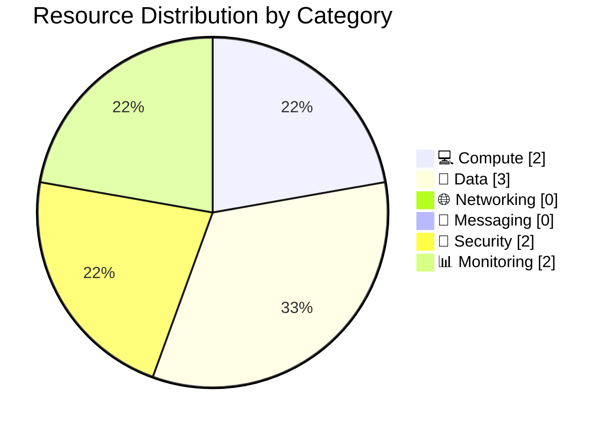

# 📦 Resource Inventory: e2e-ralph-loop

<strong>📑 Inventory Contents</strong>

- [📊 Summary](#-summary)
- [📦 Resource Listing](#-resource-listing)
- [References](#references)

> Generated by 08-As-Built agent | 2026-03-16

| ⬅️ Previous                                          | 📑 Index            | Next ➡️                                      |
| ---------------------------------------------------- | ------------------- | -------------------------------------------- |
| [07-operations-runbook.md](07-operations-runbook.md) | [README](README.md) | [07-backup-dr-plan.md](07-backup-dr-plan.md) |

**Generated**: 2026-03-16
**Source**: Infrastructure as Code (Bicep)
**Environment**: Production
**Region**: swedencentral

---

## 📊 Summary

| Category            | Count |
| ------------------- | ----- |
| **Total Resources** | 9     |
| 💻 Compute          | 2     |
| 💾 Data Services    | 3     |
| 🌐 Networking       | 0     |
| 📨 Messaging        | 0     |
| 🔐 Security         | 2     |
| 📊 Monitoring       | 2     |

This inventory records validated target resources from the Bicep templates. No Azure resources were created during Step 6, so names with globally unique suffixes remain in their deterministic pre-deployment form.

---

## 📦 Resource Listing

### 💻 Compute Resources

| Name                                | Type                        | SKU                           | Location        | Monthly Cost     | Purpose                                                    | Portal       |
| ----------------------------------- | --------------------------- | ----------------------------- | --------------- | ---------------- | ---------------------------------------------------------- | ------------ |
| `asp-e2e-ralph-loop-prod`           | `Microsoft.Web/serverfarms` | B1 Linux                      | `swedencentral` | ~€11.17          | Hosts the single Linux App Service instance                | Not deployed |
| `app-e2e-ralph-loop-prod-{suffix6}` | `Microsoft.Web/sites`       | B1 plan consumer, Node 20 LTS | `swedencentral` | Included in plan | Web frontend and application runtime with managed identity | Not deployed |

### 💾 Data Services

| Name                                | Type                                | SKU                      | Configuration                                                                             | Location        | Monthly Cost           |
| ----------------------------------- | ----------------------------------- | ------------------------ | ----------------------------------------------------------------------------------------- | --------------- | ---------------------- |
| `sql-e2e-ralph-loop-prod-{suffix6}` | `Microsoft.Sql/servers`             | Serverless control plane | Entra-only admin, TLS 1.2, Azure services firewall rule, security alerts enabled          | `swedencentral` | Included with database |
| `sqldb-nordicfresh-prod`            | `Microsoft.Sql/servers/databases`   | Basic (5 DTU)            | 2 GB max size, non-zone-redundant, PITR-capable                                           | `swedencentral` | ~€4.15                 |
| `ste2erlpprod{suffix6}`             | `Microsoft.Storage/storageAccounts` | Standard LRS             | StorageV2, HTTPS-only, TLS 1.2, no public blob access, no shared keys, `assets` container | `swedencentral` | ~€0.16                 |

### 🌐 Networking Resources

| Name | Type | Configuration                                                                                                     | Location |
| ---- | ---- | ----------------------------------------------------------------------------------------------------------------- | -------- |
| None | N/A  | The design intentionally uses public endpoints with service-level ACLs instead of dedicated networking resources. | N/A      |

### 📨 Messaging Resources

| Name | Type | SKU                                                     | Configuration | Location |
| ---- | ---- | ------------------------------------------------------- | ------------- | -------- |
| None | N/A  | No messaging resources are in scope for the MVP design. | N/A           |

### 🔐 Security Resources

| Name                       | Type                                      | Configuration                                                                                      | Location        |
| -------------------------- | ----------------------------------------- | -------------------------------------------------------------------------------------------------- | --------------- |
| `kv-e2erlp-prod-{suffix6}` | `Microsoft.KeyVault/vaults`               | RBAC authorization, soft delete 90 days, purge protection, default deny ACL, Azure services bypass | `swedencentral` |
| Generated role assignments | `Microsoft.Authorization/roleAssignments` | App Service managed identity receives `Key Vault Secrets User` and `Storage Blob Data Contributor` | `global`        |

### 📊 Monitoring Resources

| Name                       | Type                                       | Retention                                          | Location        |
| -------------------------- | ------------------------------------------ | -------------------------------------------------- | --------------- |
| `log-e2e-ralph-loop-prod`  | `Microsoft.OperationalInsights/workspaces` | 30 days, 2 GB daily quota                          | `swedencentral` |
| `appi-e2e-ralph-loop-prod` | `Microsoft.Insights/components`            | Workspace-based telemetry, 50% production sampling | `swedencentral` |

---

---

## References

| Topic                | Link                                                                                                                   |
| -------------------- | ---------------------------------------------------------------------------------------------------------------------- |
| Azure Resource Types | [Resource Providers](https://learn.microsoft.com/azure/azure-resource-manager/management/resource-providers-and-types) |
| Naming Conventions   | [CAF Naming](https://learn.microsoft.com/azure/cloud-adoption-framework/ready/azure-best-practices/resource-naming)    |
| Pricing Calculator   | [Azure Pricing](https://azure.microsoft.com/pricing/calculator/)                                                       |

---

_Resource inventory generated from the validated Bicep templates._

---

| ⬅️ [07-operations-runbook.md](07-operations-runbook.md) | 🏠 [Project Index](README.md) | ➡️ [07-backup-dr-plan.md](07-backup-dr-plan.md) |
| ------------------------------------------------------- | ----------------------------- | ----------------------------------------------- |

