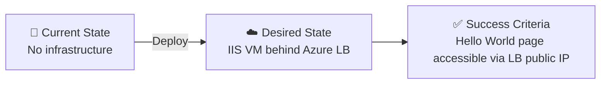

# 📋 Step 1: Requirements - iis-hello-world

<strong>📑 Requirements Overview</strong>

- [🎯 Project Overview](#-project-overview)
- [🚀 Functional Requirements](#-functional-requirements)
- [⚡ Non-Functional Requirements (NFRs)](#-non-functional-requirements-nfrs)
- [🔒 Compliance & Security Requirements](#-compliance--security-requirements)
- [💰 Budget](#-budget)
- [🔧 Operational Requirements](#-operational-requirements)
- [🌍 Regional Preferences](#-regional-preferences)
- [📊 Complexity Classification](#-complexity-classification)
- [📋 Summary for Architecture Assessment](#-summary-for-architecture-assessment)
- [References](#references)

> Generated by @requirements agent | 2026-03-06

| ⬅️ Previous | 📑 Index            | Next ➡️                                                        |
| ----------- | ------------------- | -------------------------------------------------------------- |
| —           | [README](README.md) | [02-architecture-assessment.md](02-architecture-assessment.md) |

## 🎯 Project Overview

| Field                   | Value                                                               |
| ----------------------- | ------------------------------------------------------------------- |
| **Project Name**        | iis-hello-world                                                     |
| **Project Type**        | IaaS Web Server                                                     |
| **Timeline**            | 2026-03-06 → 2026-03-20                                             |
| **Primary Stakeholder** | user                                                                |
| **Business Context**    | Windows VM running IIS with Hello World page behind a Load Balancer |
| **IaC Tool**            | Bicep                                                               |

### Business Context

| Field               | Value                                                                  |
| ------------------- | ---------------------------------------------------------------------- |
| Industry / Vertical | Technology / Demo                                                      |
| Company Size        | N/A (demo project)                                                     |
| Current State       | Greenfield                                                             |
| Migration Source    | N/A                                                                    |
| Business Drivers    | Learning / demonstration of Azure IaaS with load balancing             |
| Success Criteria    | VM serves Hello World page via public Load Balancer IP on HTTP port 80 |

### State Transition

## 🚀 Functional Requirements

### Core Capabilities

| #   | Capability                    | Priority | Acceptance Criteria                                               |
| --- | ----------------------------- | -------- | ----------------------------------------------------------------- |
| 1   | Windows Server VM running IIS | 🔴 Must  | VM provisioned with IIS role enabled and Hello World default page |
| 2   | Public Azure Load Balancer    | 🔴 Must  | LB with public IP, HTTP probe and rule on port 80                 |
| 3   | Hello World default page      | 🔴 Must  | Browsing LB public IP returns "Hello World" HTML page             |
| 4   | Network isolation via NSG     | 🔴 Must  | NSG allows only HTTP (80) inbound; RDP restricted                 |

### User Types

| User Type     | Description                   | Est. Count | Access Level |
| ------------- | ----------------------------- | ---------- | ------------ |
| Web Visitor   | Anyone browsing the public IP | Unlimited  | Reader       |
| Administrator | VM operator for maintenance   | 1-2        | Admin        |

### Integrations

| System | Direction | Protocol | Auth Method | SLA |
| ------ | --------- | -------- | ----------- | --- |
| None   | —         | —        | —           | —   |

### Data Types

| Category    | Sensitivity | Est. Volume | Retention | Residency     |
| ----------- | ----------- | ----------- | --------- | ------------- |
| Static HTML | 🟢 Low      | < 1 MB      | N/A       | swedencentral |

### Architecture Pattern

| Field              | Value                                                             |
| ------------------ | ----------------------------------------------------------------- |
| Workload Pattern   | N-Tier (single-tier IaaS)                                         |
| Recommended Option | Single Windows VM with Azure Load Balancer                        |
| Tier               | Cost-Optimized                                                    |
| Justification      | Simple demo workload; single VM behind LB, no HA required for dev |

## ⚡ Non-Functional Requirements (NFRs)

| WAF Pillar     | Metric            | Target                          | Current | Gap |
| -------------- | ----------------- | ------------------------------- | ------- | --- |
| 🔄 Reliability | SLA               | 99.5%                           | N/A     | N/A |
| 🔄 Reliability | RTO               | 24h                             | N/A     | N/A |
| 🔄 Reliability | RPO               | 12h                             | N/A     | N/A |
| ⚡ Performance | Page Load         | < 2000ms                        | N/A     | N/A |
| ⚡ Performance | Concurrent Users  | < 100                           | N/A     | N/A |
| 🔒 Security    | Auth Method       | N/A (public static page)        | —       | —   |
| 🔒 Security    | Encryption        | In-transit (HTTP only for demo) | —       | —   |
| 💰 Cost        | Monthly Budget    | ~$50                            | —       | —   |
| 🔧 Operations  | Uptime Monitoring | No                              | —       | —   |

### Scalability

| Dimension        | Current | 6-Month Projection | 12-Month Projection |
| ---------------- | ------- | ------------------ | ------------------- |
| Users            | < 10    | < 10               | N/A (demo)          |
| Data Volume      | < 1 MB  | < 1 MB             | N/A (demo)          |
| Transactions/day | < 100   | < 100              | N/A (demo)          |

## 🔒 Compliance & Security Requirements

### Regulatory Frameworks

<strong>PCI-DSS</strong> — Not Applicable

No payment card data is handled.

<strong>SOC 2</strong> — Not Applicable

Demo project, no SOC 2 controls required.

<strong>HIPAA</strong> — Not Applicable

No healthcare data is handled.

<strong>GDPR</strong> — Not Applicable

No personal data is collected or processed.

<strong>ISO 27001</strong> — Not Applicable

Demo project, no ISO 27001 controls required.

### Data Residency

| Requirement              | Value          |
| ------------------------ | -------------- |
| Primary Region           | swedencentral  |
| Data Sovereignty         | No restriction |
| Cross-region Replication | Not required   |

### Authentication & Authorization

| Requirement       | Value                              |
| ----------------- | ---------------------------------- |
| Identity Provider | N/A (public static page)           |
| MFA Requirement   | Not required                       |
| RBAC Model        | Azure RBAC for resource management |

### Network Security

| Control                     | Required | Notes                                         |
| --------------------------- | -------- | --------------------------------------------- |
| Private endpoints           | ❌       | Not needed for this demo                      |
| VNet integration            | ✅       | VM deployed into a VNet with dedicated subnet |
| Public endpoints acceptable | ✅       | LB public IP is the access point              |
| WAF required                | ❌       | Not needed for simple HTTP demo               |
| NSG rules                   | ✅       | Allow HTTP (80) inbound; restrict RDP (3389)  |

### Recommended Security Controls

| Control               | Recommended | User Confirmed | Notes                                |
| --------------------- | ----------- | -------------- | ------------------------------------ |
| Managed Identity      | No          | No             | Not applicable for standalone IIS VM |
| Private Endpoints     | No          | No             | Public demo workload                 |
| WAF                   | No          | No             | Simple HTTP demo                     |
| Key Vault for Secrets | No          | No             | VM admin password via Bicep param    |
| Diagnostic Settings   | No          | No             | Optional for dev                     |
| TLS 1.2 Minimum       | No          | No             | HTTP-only demo (no TLS)              |
| Encryption at Rest    | Yes         | Yes            | Platform default on managed disks    |
| Network Isolation     | Yes         | Yes            | NSG restricts inbound traffic        |

## 💰 Budget

> [!NOTE]
> The Azure Pricing MCP server generates detailed cost estimates during
> architecture assessment (Step 2). Provide an approximate budget here.

| Field              | Value       |
| ------------------ | ----------- |
| 💰 Monthly Budget  | ~$50        |
| 📅 Annual Budget   | ~$600       |
| 🚦 Limit Type      | 🟡 Soft     |
| 📊 Cost Model Pref | Consumption |

### Cost Optimization Priorities

| Priority                         | Selected | Impact |
| -------------------------------- | -------- | ------ |
| Minimize compute costs           | ☑        | High   |
| Prefer consumption-based pricing | ☐        | Low    |
| Reserved instances acceptable    | ☐        | Low    |
| Spot instances for non-critical  | ☐        | Low    |

## 🔧 Operational Requirements

### Monitoring & Alerting

| Capability             | Required | Tool / Service | Notes               |
| ---------------------- | -------- | -------------- | ------------------- |
| Application monitoring | ❌       | N/A            | Not needed for demo |
| Log aggregation        | ❌       | N/A            | Not needed for demo |
| Alert notifications    | ❌       | N/A            | Not needed for demo |
| Custom dashboards      | ❌       | N/A            | Not needed for demo |

### Support & Maintenance

| Requirement         | Value        |
| ------------------- | ------------ |
| Support Hours       | Best-effort  |
| On-call Requirement | No           |
| Maintenance Windows | N/A          |
| Change Management   | Self-service |

### Backup & Disaster Recovery

| Component  | Backup Frequency | Retention | Recovery Method |
| ---------- | ---------------- | --------- | --------------- |
| Windows VM | N/A (dev/demo)   | N/A       | Redeploy        |

## 🌍 Regional Preferences

| Preference         | Value         | Justification            |
| ------------------ | ------------- | ------------------------ |
| Primary Region     | swedencentral | Default — EU GDPR region |
| Failover Region    | N/A           | Not required for dev     |
| Availability Zones | Not needed    | Single VM dev workload   |

---

## 📊 Complexity Classification

| Field      | Value                                                                                                                      |
| ---------- | -------------------------------------------------------------------------------------------------------------------------- |
| Complexity | `simple`                                                                                                                   |
| Criteria   | simple: ≤3 resources, no custom policies, single env                                                                       |
| Rationale  | 3 core resources (VM, Load Balancer, VNet/NSG), single dev environment, no compliance frameworks, no custom Azure Policies |

---

## 📋 Summary for Architecture Assessment

### Handoff Summary

| Aspect               | Key Points                                                                         |
| -------------------- | ---------------------------------------------------------------------------------- |
| Critical Constraints | Budget ~$50/mo; HTTP-only (no TLS); single dev environment                         |
| Key Decisions        | Windows Server VM with IIS; public Azure Load Balancer; NSG for network security   |
| Open Risks           | No HA (single VM); no HTTPS; RDP access needs securing (Bastion or IP restriction) |
| Recommended Pattern  | Single-tier IaaS: Windows VM + IIS behind Azure LB                                 |
| Budget Envelope      | ~$50/month                                                                         |

### Azure Resources in Scope

| Resource               | Azure Service                           | SKU / Tier       | Purpose                     |
| ---------------------- | --------------------------------------- | ---------------- | --------------------------- |
| Resource Group         | Microsoft.Resources                     | N/A              | Container for all resources |
| Virtual Network        | Microsoft.Network/virtualNetworks       | N/A              | Network isolation           |
| Subnet                 | (part of VNet)                          | N/A              | VM subnet                   |
| Network Security Group | Microsoft.Network/networkSecurityGroups | N/A              | Allow HTTP, restrict RDP    |
| Network Interface      | Microsoft.Network/networkInterfaces     | N/A              | VM network connectivity     |
| Public IP (LB)         | Microsoft.Network/publicIPAddresses     | Standard         | Load Balancer frontend      |
| Load Balancer          | Microsoft.Network/loadBalancers         | Standard / Basic | HTTP traffic distribution   |
| Windows VM             | Microsoft.Compute/virtualMachines       | Standard_B2s     | IIS web server              |
| OS Disk                | Microsoft.Compute/disks                 | Standard_LRS     | VM operating system disk    |

### Required Tags

| Tag         | Value           |
| ----------- | --------------- |
| Environment | dev             |
| ManagedBy   | Bicep           |
| Project     | iis-hello-world |
| Owner       | user            |

### Requirements Completeness

| Section                  | Status | Notes                              |
| ------------------------ | ------ | ---------------------------------- |
| Project Overview         | ✅     | Fully defined                      |
| Functional Requirements  | ✅     | All core capabilities captured     |
| NFRs                     | ✅     | Relaxed targets for dev/demo       |
| Compliance & Security    | ✅     | No compliance; NSG for security    |
| Budget                   | ✅     | ~$50/month                         |
| Operational Requirements | ✅     | Minimal — self-service dev project |

---

## References

> [!NOTE]
> 📚 The following Microsoft Learn resources provide additional guidance.

| Topic                      | Link                                                                                                   |
| -------------------------- | ------------------------------------------------------------------------------------------------------ |
| Well-Architected Framework | [Overview](https://learn.microsoft.com/azure/well-architected/)                                        |
| Azure Load Balancer        | [Documentation](https://learn.microsoft.com/azure/load-balancer/load-balancer-overview)                |
| Windows VM on Azure        | [Quickstart](https://learn.microsoft.com/azure/virtual-machines/windows/quick-create-bicep)            |
| IIS on Azure VM            | [Tutorial](https://learn.microsoft.com/azure/virtual-machines/windows/tutorial-automate-vm-deployment) |
| Azure Regions              | [Products by Region](https://azure.microsoft.com/explore/global-infrastructure/products-by-region/)    |

---

_Requirements captured using [plan-requirements.prompt.md](../../.github/prompts/plan-requirements.prompt.md) template_

---

| ⬅️ — | 🏠 [Project Index](README.md) | ➡️ [02-architecture-assessment.md](02-architecture-assessment.md) |
| ---- | ----------------------------- | ----------------------------------------------------------------- |

