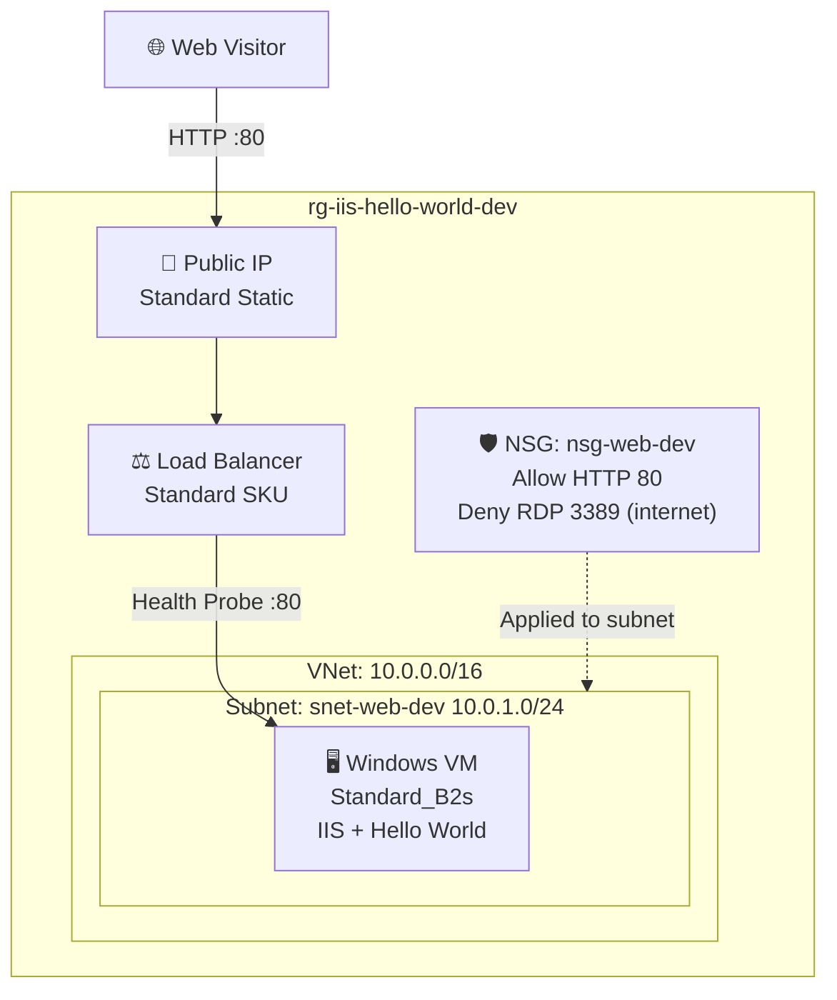

# 🏛️ Step 2: Architecture Assessment - iis-hello-world

<strong>📑 Assessment Contents</strong>

- [✅ Requirements Validation](#-requirements-validation)
- [💎 Executive Summary](#-executive-summary)
- [🏛️ WAF Pillar Assessment](#-waf-pillar-assessment)
- [📦 Resource SKU Recommendations](#-resource-sku-recommendations)
- [🎯 Architecture Decision Summary](#-architecture-decision-summary)
- [🚀 Implementation Handoff](#-implementation-handoff)
- [🔒 Approval Gate](#-approval-gate)
- [References](#references)

> Generated by architect agent | 2026-03-06

| ⬅️ Previous                              | 📑 Index            | Next ➡️                                            |
| ---------------------------------------- | ------------------- | -------------------------------------------------- |
| [01-requirements.md](01-requirements.md) | [README](README.md) | [03-des-cost-estimate.md](03-des-cost-estimate.md) |

## ✅ Requirements Validation

| Requirement Area        | Status     | Validation Notes                                                |
| ----------------------- | ---------- | --------------------------------------------------------------- |
| NFRs (SLA, RTO, RPO)    | ✅ Defined | SLA 99.5%, RTO 24h, RPO 12h — appropriate for dev demo workload |
| Compliance requirements | ✅ Defined | No regulatory frameworks apply — demo/learning project          |
| Budget (approximate)    | ✅ Defined | ~$50/month soft limit — estimate exceeds by ~$19 (see below)    |
| Scale requirements      | ✅ Defined | <100 concurrent users, <100 txn/day — single VM sufficient      |
| Security controls       | ✅ Defined | NSG (HTTP allow, RDP restrict), no TLS (HTTP demo), no WAF      |
| Data residency          | ✅ Defined | swedencentral, no cross-region replication needed               |

> [!NOTE]
> All requirements are adequately defined for a simple dev/demo workload. The estimated
> cost (~$69/mo) exceeds the ~$50/mo soft budget — optimization options documented below.

---

## 💎 Executive Summary

This is a simple IaaS demo workload: a single Windows Server 2022 VM running IIS with a
static "Hello World" page, fronted by an Azure Standard Load Balancer with a public IP.
The architecture prioritizes **cost optimization** for a dev/learning environment while
maintaining basic network security through NSG rules.

The pattern is a straightforward single-tier IaaS deployment with no high-availability
requirements, no data persistence beyond the VM OS disk, and no compliance mandates.

### Recommended Architecture

---

## 🏛️ WAF Pillar Assessment

### Overall Scores

| Pillar                    | Score | Confidence | Summary                                                       |
| ------------------------- | ----- | ---------- | ------------------------------------------------------------- |
| 🔒 Security               | 5/10  | High       | Basic NSG controls; no TLS, no Bastion, no managed identity   |
| 🔄 Reliability            | 3/10  | High       | Single VM, no redundancy, no auto-recovery                    |
| ⚡ Performance            | 7/10  | High       | B2s adequate for <100 users; LB adds future scale path        |
| 💰 Cost Optimization      | 7/10  | High       | B-series burstable is cost-effective; ~$19 over soft budget   |
| 🔧 Operational Excellence | 4/10  | Medium     | IaC via Bicep is good; no monitoring, no alerting, no backups |

**Primary Pillar Optimized**: 💰 Cost Optimization
**Trade-offs Accepted**: Reduced reliability (single VM), reduced security (HTTP-only, no Bastion), reduced operational visibility (no monitoring) — all acceptable for a dev demo workload.

---

### 🔒 Security Assessment (5/10)

**Strengths:**

- NSG restricts inbound traffic to HTTP port 80 only
- RDP (3389) blocked from internet — prevents brute-force attacks
- VM deployed inside a VNet with dedicated subnet
- Platform-managed encryption at rest on OS disk

**Gaps:**

- No TLS/HTTPS — traffic is unencrypted (acceptable for HTTP demo only)
- No Azure Bastion — no secure admin access path to VM
- No Azure Key Vault — VM admin password supplied via Bicep parameter (not stored securely)
- No DDoS protection beyond platform default
- No diagnostic logging configured

**Recommendations:**

1. For production: Add Azure Bastion ($139/mo Standard) for secure VM access instead of RDP
2. For production: Enable HTTPS with a certificate via Key Vault or App Gateway
3. Restrict NSG source IPs further if a known admin IP range is available

### 🔄 Reliability Assessment (3/10)

**Strengths:**

- Azure Standard Load Balancer provides health probing (detects IIS failures)
- Standard Public IP has zone-redundant frontend by default
- Platform SLA: single VM with Standard SSD = 99.9% VM SLA

**Gaps:**

- Single VM — any VM failure causes complete outage
- No availability set or availability zone deployment
- No auto-scaling or auto-recovery mechanism
- No backup configured (redeploy strategy only)
- RTO 24h achieved via IaC redeploy, not automatic failover

**Recommendations:**

1. For production: Deploy 2+ VMs across availability zones behind the LB
2. For production: Enable Azure Backup for VM state recovery
3. Current design meets 99.5% SLA target via redeploy within 24h RTO

### ⚡ Performance Assessment (7/10)

**Strengths:**

- Standard_B2s (2 vCPUs, 4 GiB RAM) is well-suited for a static HTML page
- B-series burstable model handles sporadic traffic efficiently
- Standard Load Balancer supports low-latency health probing
- Static HTML page — near-zero backend processing latency

**Gaps:**

- No CDN for content caching (unnecessary for simple demo)
- No performance monitoring to baseline response times
- Single instance limits max concurrent connections

**Recommendations:**

1. Page load target of <2000ms easily achievable with static HTML on local IIS
2. If future load increases, scale up to B2ms or add VM instances behind LB

### 💰 Cost Assessment (7/10)

| Service             | SKU                    | Monthly Cost | Notes                           |
| ------------------- | ---------------------- | -----------: | ------------------------------- |
| Windows VM          | Standard_B2s           |       $37.38 | 730 hrs × $0.0512/hr (PAYG)     |
| Load Balancer       | Standard               |       $18.25 | 730 hrs × $0.025/hr (5 rules)   |
| Public IP           | Standard Static        |        $3.65 | 730 hrs × $0.005/hr             |
| OS Disk             | Standard SSD E10 128GB |        $9.60 | LRS, Windows default OS disk    |
| VNet/Subnet/NSG/NIC | N/A                    |        $0.00 | Free resources                  |
| **Total Estimated** |                        |   **$68.88** | ⚠️ ~$19 over $50/mo soft budget |

> Pricing source: Azure Retail Pricing API (swedencentral, 2026-03-06)

**Cost Optimization Applied:**

- B-series burstable VM selected (cheapest Windows-capable SKU meeting requirements)
- Standard SSD E10 selected over Premium SSD for dev workload
- No Log Analytics, Application Insights, or Backup services (dev environment)

**Budget Optimization Options:**

| Option                       | Savings | New Total | Trade-off                |
| ---------------------------- | ------: | --------: | ------------------------ |
| Deallocate VM 12hrs/day      | ~$18.69 |   ~$50.19 | VM unavailable off-hours |
| Use Standard_B1s (1vCPU/2GB) | ~$18.25 |   ~$50.63 | Less CPU/RAM headroom    |
| Dev/Test pricing (MSDN)      | ~$27.68 |   ~$41.20 | Requires VS subscription |

### 🔧 Operational Excellence Assessment (4/10)

**Strengths:**

- Infrastructure as Code via Bicep — fully reproducible deployments
- CAF naming conventions applied to all resources
- Required tags (Environment, ManagedBy, Project, Owner) enforced

**Gaps:**

- No diagnostic settings or log collection
- No Azure Monitor alerts for VM health or IIS availability
- No automated deployment pipeline (CI/CD)
- No runbook or operational documentation
- IIS configuration via CustomScriptExtension — limited day-2 management

**Recommendations:**

1. For production: Enable boot diagnostics and VM guest metrics
2. For production: Configure Azure Monitor alerts for VM availability
3. Consider Azure Automation for scheduled start/stop to reduce cost

---

## 📦 Resource SKU Recommendations

| Service       | Recommended SKU      | Configuration         | Monthly Est. | Justification                            |
| ------------- | -------------------- | --------------------- | -----------: | ---------------------------------------- |
| Windows VM    | Standard_B2s         | 2 vCPU, 4 GiB RAM     |       $37.38 | Cheapest burstable SKU for IIS workload  |
| Load Balancer | Standard             | 1 LB rule, HTTP probe |       $18.25 | Required for public HTTP distribution    |
| Public IP     | Standard Static IPv4 | Zone-redundant        |        $3.65 | Required for LB frontend                 |
| OS Disk       | Standard SSD E10 LRS | 128 GB                |        $9.60 | Windows default OS disk, dev-appropriate |
| VNet          | N/A                  | 10.0.0.0/16           |        $0.00 | Free — network isolation                 |
| Subnet        | N/A                  | 10.0.1.0/24           |        $0.00 | Free — VM placement                      |
| NSG           | N/A                  | HTTP allow, RDP deny  |        $0.00 | Free — network security                  |
| NIC           | N/A                  | Dynamic private IP    |        $0.00 | Free — VM connectivity                   |

<strong>Virtual Machine</strong> — Pricing Tier Comparison

| Tier          | vCPU | RAM   | Price/mo | Fits?                      |
| ------------- | ---- | ----- | -------: | -------------------------- |
| Standard_B1s  | 1    | 1 GiB |   $19.13 | ⚠️ Tight for Windows + IIS |
| Standard_B1ms | 1    | 2 GiB |   $22.63 | ⚠️ Minimal headroom        |
| Standard_B2s  | 2    | 4 GiB |   $37.38 | ✅ Good for dev workload   |
| Standard_B2ms | 2    | 8 GiB |   $76.65 | ❌ Over budget             |

**Selected**: Standard_B2s — sufficient CPU/RAM for IIS with headroom, within budget constraints

<strong>Load Balancer</strong> — Pricing Tier Comparison

| Tier     | Features                        | Price/mo | Fits?                       |
| -------- | ------------------------------- | -------: | --------------------------- |
| Basic    | No SLA, limited features        |    $0.00 | ❌ Deprecated Sept 2025     |
| Standard | SLA-backed, zone-redundant, NSG |   $18.25 | ✅ Required (Basic retired) |

**Selected**: Standard — Basic LB retired September 2025; Standard is the only supported option

---

## 🎯 Architecture Decision Summary

| Decision     | Choice               | Rationale                                                        |
| ------------ | -------------------- | ---------------------------------------------------------------- |
| VM SKU       | Standard_B2s         | Cheapest burstable SKU with sufficient RAM for Windows + IIS     |
| LB SKU       | Standard             | Basic LB retired Sept 2025; Standard required for new deploys    |
| OS Disk      | Standard SSD E10 LRS | Cost-effective for dev; SSD gives better boot/response times     |
| Region       | swedencentral        | Default EU GDPR-compliant region per project conventions         |
| Redundancy   | None (single VM)     | Dev/demo — no HA requirement; rely on IaC redeploy for recovery  |
| TLS          | Not configured       | HTTP-only demo; add via App Gateway or cert if needed later      |
| Admin Access | NSG-restricted RDP   | No Bastion for cost savings; restrict by source IP in NSG rule   |
| Monitoring   | None                 | Dev environment — add boot diagnostics if troubleshooting needed |
| IaC          | Bicep                | Project requirement; AVM modules where available                 |

---

## 🚀 Implementation Handoff

### Ready for bicep-plan

The architecture is approved for implementation with the following key parameters:

| Parameter      | Value                               |
| -------------- | ----------------------------------- |
| Region         | swedencentral                       |
| Environment    | dev                                 |
| Budget         | ~$50/month (estimated: ~$69/month)  |
| Resource Count | 8 (6 billable-capable, 4 with cost) |

### Resources to Provision

| #   | Resource               | SKU             | Key Config                                   |
| --- | ---------------------- | --------------- | -------------------------------------------- |
| 1   | Resource Group         | N/A             | `rg-iis-hello-world-dev`                     |
| 2   | Virtual Network        | N/A             | `vnet-iis-hello-world-dev`, 10.0.0.0/16      |
| 3   | Subnet                 | N/A             | `snet-web-dev`, 10.0.1.0/24                  |
| 4   | Network Security Group | N/A             | `nsg-web-dev`, HTTP allow, RDP deny          |
| 5   | Network Interface      | N/A             | `nic-vm-iis-dev`, dynamic private IP         |
| 6   | Public IP Address      | Standard Static | `pip-lb-iis-hello-world-dev`, zone-redundant |
| 7   | Load Balancer          | Standard        | `lb-iis-hello-world-dev`, HTTP rule + probe  |
| 8   | Windows VM             | Standard_B2s    | `vm-iis-dev`, Win2022, IIS via CSE           |

### Security Requirements for Implementation

| Requirement             | Implementation                                                        |
| ----------------------- | --------------------------------------------------------------------- |
| NSG HTTP allow          | Inbound rule: Allow TCP 80 from Any to snet-web-dev                   |
| NSG RDP deny (internet) | Inbound rule: Deny TCP 3389 from Internet                             |
| Encryption at rest      | Platform default on Standard SSD managed disk                         |
| Required tags           | Environment=dev, ManagedBy=Bicep, Project=iis-hello-world, Owner=user |
| VM admin credentials    | Secure parameter in Bicep — do not hardcode                           |

### Monitoring Requirements for Implementation

| Requirement      | Implementation                                |
| ---------------- | --------------------------------------------- |
| Boot diagnostics | Optional — enable if troubleshooting needed   |
| LB health probe  | HTTP probe on port 80, path `/`, interval 15s |
| VM guest metrics | Not required for dev — enable for production  |

---

## 🔒 Approval Gate

> [!IMPORTANT]
> **🏗️ Architecture Assessment Complete**
>
> | Pillar      | Score |
> | ----------- | ----- |
> | Security    | 5/10  |
> | Reliability | 3/10  |
> | Performance | 7/10  |
> | Cost        | 7/10  |
> | Operations  | 4/10  |
>
> **Estimated Monthly Cost**: ~$69 (⚠️ ~$19 over $50/mo soft budget)
>
> **Cost Note**: Deallocating VM 12hrs/day or using Dev/Test pricing brings cost within budget.
>
> **Confidence Level**: High
>
> - [ ] **Approved** — proceed to bicep-plan
> - Approver: \_\_\_
> - Date: \_\_\_
>
> Reply **"approve"** to proceed to bicep-plan, or provide feedback for revisions.

---

## References

> [!NOTE]
> 📚 The following Microsoft Learn resources informed this assessment.

| Topic                            | Link                                                                                               |
| -------------------------------- | -------------------------------------------------------------------------------------------------- |
| Well-Architected Framework       | [Overview](https://learn.microsoft.com/azure/well-architected/)                                    |
| B-series burstable VMs           | [B-series](https://learn.microsoft.com/azure/virtual-machines/sizes-b-series-burstable)            |
| Standard Load Balancer           | [Overview](https://learn.microsoft.com/azure/load-balancer/load-balancer-overview)                 |
| NSG security rules               | [NSG Overview](https://learn.microsoft.com/azure/virtual-network/network-security-groups-overview) |
| Windows VM on Azure              | [Quickstart](https://learn.microsoft.com/azure/virtual-machines/windows/quick-create-bicep)        |
| Azure Pricing — Virtual Machines | [Pricing](https://azure.microsoft.com/pricing/details/virtual-machines/windows/)                   |
| Basic LB retirement              | [Retirement](https://learn.microsoft.com/azure/load-balancer/load-balancer-basic-upgrade-guidance) |

---

_Assessment performed using Azure Well-Architected Framework. Pricing data from Azure Retail Pricing API (2026-03-06)._

---

| ⬅️ [01-requirements.md](01-requirements.md) | 🏠 [Project Index](README.md) | ➡️ [03-des-cost-estimate.md](03-des-cost-estimate.md) |
| ------------------------------------------- | ----------------------------- | ----------------------------------------------------- |

