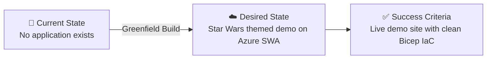

# 📋 Step 1: Requirements - my-demo

<strong>📑 Requirements Overview</strong>

- [🎯 Project Overview](#-project-overview)
- [🚀 Functional Requirements](#-functional-requirements)
- [⚡ Non-Functional Requirements (NFRs)](#-non-functional-requirements-nfrs)
- [🔒 Compliance & Security Requirements](#-compliance--security-requirements)
- [💰 Budget](#-budget)
- [🔧 Operational Requirements](#-operational-requirements)
- [🌍 Regional Preferences](#-regional-preferences)
- [📋 Summary for Architecture Assessment](#-summary-for-architecture-assessment)
- [References](#references)

> Generated by @requirements agent | 2026-02-24

| ⬅️ Previous | 📑 Index            | Next ➡️                                                        |
| ----------- | ------------------- | -------------------------------------------------------------- |
| —           | [README](README.md) | [02-architecture-assessment.md](02-architecture-assessment.md) |

## 🎯 Project Overview

| Field                   | Value                                                                   |
| ----------------------- | ----------------------------------------------------------------------- |
| **Project Name**        | my-demo                                                                 |
| **Project Type**        | Static Site with optional serverless API                                |
| **Timeline**            | 2026-02-24 → 2026-03-24 (1 month)                                       |
| **Primary Stakeholder** | Demo owner                                                              |
| **Business Context**    | A fun, Star Wars themed demo app showcasing Azure architecture patterns |

### Business Context

| Field               | Value                                                                      |
| ------------------- | -------------------------------------------------------------------------- |
| Industry / Vertical | Technology / Demo                                                          |
| Company Size        | Individual / Small team                                                    |
| Current State       | Greenfield                                                                 |
| Migration Source    | N/A (greenfield)                                                           |
| Business Drivers    | Demonstrate Azure Static Web Apps, serverless patterns, and IaC with Bicep |
| Success Criteria    | Working Star Wars themed demo site deployed to Azure with clean IaC        |

### State Transition

## 🚀 Functional Requirements

### Core Capabilities

| #   | Capability                               | Priority  | Acceptance Criteria                                         |
| --- | ---------------------------------------- | --------- | ----------------------------------------------------------- |
| 1   | Star Wars themed static web frontend     | 🔴 Must   | HTML/CSS/JS site renders Star Wars content in a browser     |
| 2   | Serverless API for dynamic data          | 🟡 Should | Azure Functions returns Star Wars data (characters, quotes) |
| 3   | Responsive design for mobile and desktop | 🟡 Should | Site renders correctly on screens from 320px to 1920px wide |
| 4   | HTTPS-only access                        | 🔴 Must   | All traffic served over TLS; HTTP redirects to HTTPS        |
| 5   | Custom domain support                    | 🟢 Could  | Optional custom domain binding on Static Web App            |

### User Types

| User Type   | Description                       | Est. Count | Access Level |
| ----------- | --------------------------------- | ---------- | ------------ |
| Demo Viewer | Anyone viewing the Star Wars demo | 1-50       | Reader       |
| Demo Admin  | Developer maintaining the demo    | 1-2        | Admin        |

### Integrations

| System         | Direction | Protocol | Auth Method   | SLA         |
| -------------- | --------- | -------- | ------------- | ----------- |
| GitHub (CI/CD) | Inbound   | Webhook  | GitHub Token  | N/A         |
| Star Wars API  | Outbound  | REST     | None (public) | Best-effort |

### Data Types

| Category      | Sensitivity | Est. Volume | Retention        | Residency       |
| ------------- | ----------- | ----------- | ---------------- | --------------- |
| Static assets | 🟢 Low      | < 50 MB     | Indefinite       | EU (westeurope) |
| API responses | 🟢 Low      | < 1 MB/day  | None (stateless) | EU (westeurope) |

### Architecture Pattern

| Field              | Value                                                                                                            |
| ------------------ | ---------------------------------------------------------------------------------------------------------------- |
| Workload Pattern   | Static Site                                                                                                      |
| Recommended Option | SWA Standard + optional Azure Functions (Consumption) + Application Insights (Free tier)                         |
| Tier               | Cost-Optimized                                                                                                   |
| Justification      | Standard SWA SKU ensures reliable Bicep/ARM deployment; Application Insights adds observability at no extra cost |

## ⚡ Non-Functional Requirements (NFRs)

| WAF Pillar     | Metric             | Target             | Current | Gap |
| -------------- | ------------------ | ------------------ | ------- | --- |
| 🔄 Reliability | SLA                | Best-effort        | N/A     | N/A |
| 🔄 Reliability | RTO                | 24 hours           | N/A     | N/A |
| 🔄 Reliability | RPO                | 24 hours           | N/A     | N/A |
| ⚡ Performance | Page Load          | < 3000 ms          | N/A     | N/A |
| ⚡ Performance | API Response (p95) | < 1000 ms          | N/A     | N/A |
| ⚡ Performance | Concurrent Users   | 10                 | N/A     | N/A |
| 🔒 Security    | Auth Method        | None (public demo) | —       | —   |
| 🔒 Security    | Encryption         | In-transit (TLS)   | —       | —   |
| 💰 Cost        | Monthly Budget     | ~$0-10             | —       | —   |
| 🔧 Operations  | Uptime Monitoring  | Yes (free tier)    | —       | —   |

### Scalability

| Dimension        | Current | 6-Month Projection | 12-Month Projection |
| ---------------- | ------- | ------------------ | ------------------- |
| Users            | 1-10    | 10-50              | 10-50               |
| Data Volume      | < 50 MB | < 50 MB            | < 100 MB            |
| Transactions/day | < 100   | < 500              | < 500               |

## 🔒 Compliance & Security Requirements

### Regulatory Frameworks

<strong>PCI-DSS</strong> — Not Applicable

| Requirement             | Applicability | Notes                     |
| ----------------------- | ------------- | ------------------------- |
| Cardholder data storage | No            | No payment processing     |
| Network segmentation    | No            | Public demo site          |
| Encryption requirements | No            | No sensitive data handled |

<strong>SOC 2</strong> — Not Applicable

| Trust Principle | Applicability | Notes                    |
| --------------- | ------------- | ------------------------ |
| Security        | No            | Non-production demo      |
| Availability    | No            | Best-effort availability |
| Confidentiality | No            | No confidential data     |

<strong>HIPAA</strong> — Not Applicable

| Requirement   | Applicability | Notes          |
| ------------- | ------------- | -------------- |
| PHI handling  | No            | No health data |
| BAA required  | No            | N/A            |
| Audit logging | No            | N/A            |

<strong>GDPR</strong> — Not Applicable

| Requirement      | Applicability | Notes                                        |
| ---------------- | ------------- | -------------------------------------------- |
| EU data subjects | No            | No personal data collected                   |
| Data residency   | No            | Static content only, hosted in EU by default |
| Right to erasure | No            | No user data stored                          |

<strong>ISO 27001</strong> — Not Applicable

| Control Area        | Applicability | Notes            |
| ------------------- | ------------- | ---------------- |
| Access control      | No            | Non-production   |
| Asset management    | No            | Demo environment |
| Incident management | No            | Best-effort      |

### Data Residency

| Requirement              | Value          |
| ------------------------ | -------------- |
| Primary Region           | westeurope     |
| Data Sovereignty         | No restriction |
| Cross-region Replication | Not required   |

### Authentication & Authorization

| Requirement       | Value                   |
| ----------------- | ----------------------- |
| Identity Provider | None (public access)    |
| MFA Requirement   | Not required            |
| RBAC Model        | Azure RBAC (admin only) |

### Network Security

| Control                     | Required | Notes                            |
| --------------------------- | -------- | -------------------------------- |
| Private endpoints           | ❌       | Not needed for public demo       |
| VNet integration            | ❌       | Not needed for static site       |
| Public endpoints acceptable | ✅       | This is a public-facing demo     |
| WAF required                | ❌       | Overkill for non-production demo |

### Recommended Security Controls

| Control               | Recommended | User Confirmed | Notes                                     |
| --------------------- | ----------- | -------------- | ----------------------------------------- |
| Managed Identity      | Yes         | —              | For Functions ↔ Application Insights      |
| Private Endpoints     | No          | —              | Public demo, no sensitive data            |
| WAF                   | No          | —              | Not justified for demo workload           |
| Key Vault for Secrets | No          | —              | No secrets needed for static site         |
| Diagnostic Settings   | Yes         | —              | Route to Application Insights (free tier) |
| TLS 1.2 Minimum       | Yes         | —              | Always recommended                        |
| Encryption at Rest    | Yes         | —              | Platform default, no extra cost           |
| Network Isolation     | No          | —              | Public demo site                          |

## 💰 Budget

> [!NOTE]
> The Azure Pricing MCP server generates detailed cost estimates during
> architecture assessment (Step 2). Provide an approximate budget here.

| Field              | Value                                    |
| ------------------ | ---------------------------------------- |
| 💰 Monthly Budget  | ~$9 (SWA Standard SKU)                   |
| 📅 Annual Budget   | ~$108                                    |
| 🚦 Limit Type      | 🟡 Soft = prefer staying under $15/month |
| 📊 Cost Model Pref | Consumption                              |

### Cost Optimization Priorities

| Priority                         | Selected | Impact |
| -------------------------------- | -------- | ------ |
| Minimize compute costs           | ☑        | High   |
| Prefer consumption-based pricing | ☑        | High   |
| Reserved instances acceptable    | ☐        | N/A    |
| Spot instances for non-critical  | ☐        | N/A    |

## 🔧 Operational Requirements

### Monitoring & Alerting

| Capability             | Required | Tool / Service       | Notes                         |
| ---------------------- | -------- | -------------------- | ----------------------------- |
| Application monitoring | ✅       | Application Insights | Free tier (5 GB/month ingest) |
| Log aggregation        | ✅       | Application Insights | Included with App Insights    |
| Alert notifications    | ❌       | —                    | Best-effort availability      |
| Custom dashboards      | ❌       | —                    | Not needed                    |

### Support & Maintenance

| Requirement         | Value        |
| ------------------- | ------------ |
| Support Hours       | Best-effort  |
| On-call Requirement | No           |
| Maintenance Windows | None formal  |
| Change Management   | Self-service |

### Backup & Disaster Recovery

| Component      | Backup Frequency | Retention | Recovery Method           |
| -------------- | ---------------- | --------- | ------------------------- |
| Static assets  | N/A              | N/A       | Redeploy from GitHub repo |
| Functions code | N/A              | N/A       | Redeploy from GitHub repo |

## 🌍 Regional Preferences

| Preference         | Value      | Justification                                    |
| ------------------ | ---------- | ------------------------------------------------ |
| Primary Region     | westeurope | Static Web Apps not available in swedencentral   |
| Failover Region    | N/A        | Not needed for non-production demo               |
| Availability Zones | Not needed | Cost-optimized demo; single-region is sufficient |

---

## 📋 Summary for Architecture Assessment

### Handoff Summary

| Aspect               | Key Points                                                                                       |
| -------------------- | ------------------------------------------------------------------------------------------------ |
| Critical Constraints | Low-cost budget (~$9/mo); non-production demo                                                    |
| Key Decisions        | Static Site pattern; SWA Standard SKU; Application Insights (free); no compliance; public access |
| Open Risks           | None — Standard SKU resolves Bicep deployment limitations                                        |
| Recommended Pattern  | Static Site (Cost-Optimized tier)                                                                |
| Budget Envelope      | ~$9/month                                                                                        |

### Requirements Completeness

| Section                  | Status | Notes                                       |
| ------------------------ | ------ | ------------------------------------------- |
| Project Overview         | ✅     | Star Wars demo, greenfield, static site     |
| Functional Requirements  | ✅     | Frontend + optional API, responsive, HTTPS  |
| NFRs                     | ✅     | Relaxed targets appropriate for demo        |
| Compliance & Security    | ✅     | No compliance; basic TLS + managed identity |
| Budget                   | ✅     | $0/month target, free tier eligible         |
| Operational Requirements | ✅     | Best-effort, redeploy-from-source recovery  |

---

## References

> [!NOTE]
> 📚 The following Microsoft Learn resources provide additional guidance.

| Topic                      | Link                                                                                                |
| -------------------------- | --------------------------------------------------------------------------------------------------- |
| Well-Architected Framework | [Overview](https://learn.microsoft.com/azure/well-architected/)                                     |
| Azure Static Web Apps      | [Documentation](https://learn.microsoft.com/azure/static-web-apps/)                                 |
| Azure Functions            | [Documentation](https://learn.microsoft.com/azure/azure-functions/)                                 |
| Azure Regions              | [Products by Region](https://azure.microsoft.com/explore/global-infrastructure/products-by-region/) |

---

_Requirements captured using [plan-requirements.prompt.md](../../.github/prompts/plan-requirements.prompt.md) template_

---

| ⬅️ — | 🏠 [Project Index](README.md) | ➡️ [02-architecture-assessment.md](02-architecture-assessment.md) |
| ---- | ----------------------------- | ----------------------------------------------------------------- |

