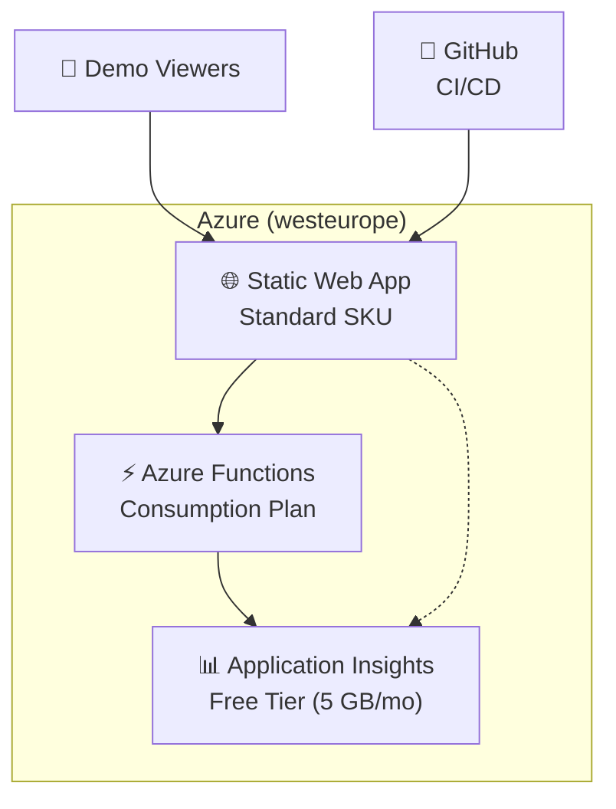
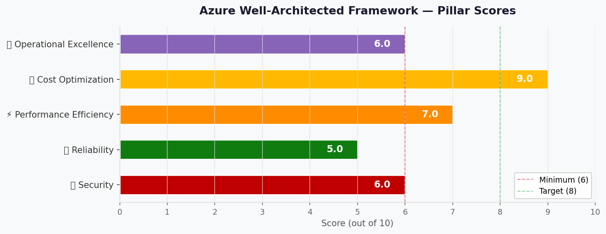

# 🏛️ Step 2: Architecture Assessment - my-demo

<strong>📑 Assessment Contents</strong>

- [✅ Requirements Validation](#-requirements-validation)
- [💎 Executive Summary](#-executive-summary)
- [🏛️ WAF Pillar Assessment](#-waf-pillar-assessment)
- [📦 Resource SKU Recommendations](#-resource-sku-recommendations)
- [🎯 Architecture Decision Summary](#-architecture-decision-summary)
- [🚀 Implementation Handoff](#-implementation-handoff)
- [🔒 Approval Gate](#-approval-gate)
- [References](#references)

> Generated by architect agent | 2026-02-24

| ⬅️ Previous                              | 📑 Index            | Next ➡️                                            |
| ---------------------------------------- | ------------------- | -------------------------------------------------- |
| [01-requirements.md](01-requirements.md) | [README](README.md) | [03-des-cost-estimate.md](03-des-cost-estimate.md) |

## ✅ Requirements Validation

| Requirement Area        | Status     | Validation Notes                                                                          |
| ----------------------- | ---------- | ----------------------------------------------------------------------------------------- |
| NFRs (SLA, RTO, RPO)    | ✅ Defined | Best-effort SLA, 24h RTO/RPO — appropriate for non-production demo workload               |
| Compliance requirements | ✅ Defined | No compliance frameworks apply — confirmed N/A for PCI-DSS, SOC 2, HIPAA, GDPR, ISO 27001 |
| Budget (approximate)    | ✅ Defined | ~$9/month target with soft limit of $15/month                                             |
| Scale requirements      | ✅ Defined | 1-50 users, <500 transactions/day, <100 MB data — minimal scale requirements              |
| Security controls       | ✅ Defined | TLS 1.2, HTTPS-only, Managed Identity for Functions, no private endpoints needed          |
| Data residency          | ✅ Defined | EU (westeurope) — no sovereignty requirements, no cross-region replication                |

> [!TIP]
> All requirement areas are fully defined. No blockers for proceeding to architecture design.

---

## 💎 Executive Summary

This assessment evaluates a **Star Wars themed non-production demo application** built on Azure Static Web Apps with optional serverless API capabilities. The architecture follows the **Static Site (Cost-Optimized)** pattern from the service recommendation matrix.

The design prioritizes **Cost Optimization** as the primary WAF pillar, accepting trade-offs in Reliability and Security appropriate for a non-production demo. The architecture uses three Azure services at their lowest viable tiers:

- **Azure Static Web App (Standard)** — hosting the Star Wars themed frontend with built-in CDN
- **Azure Functions (Consumption)** — optional serverless API for dynamic Star Wars data
- **Application Insights (Free tier)** — observability at zero additional cost

**Estimated monthly cost: ~$9.00** — within the $9/month budget target and well under the $15 soft limit.

### Recommended Architecture

### Service Maturity Assessment

| Service               | GA Status | Years in GA | Maturity | Deprecation Risk |
| --------------------- | --------- | ----------- | -------- | ---------------- |
| Azure Static Web Apps | GA        | 4+          | Mature   | 🟢 Low           |
| Azure Functions       | GA        | 8+          | Mature   | 🟢 Low           |
| Application Insights  | GA        | 8+          | Mature   | 🟢 Low           |

---

## 🏛️ WAF Pillar Assessment

### Overall Scores

| Pillar                    | Score | Confidence | Summary                                                  |
| ------------------------- | ----- | ---------- | -------------------------------------------------------- |
| 🔒 Security               | 6/10  | High       | Basic security controls; appropriate for a public demo   |
| 🔄 Reliability            | 5/10  | High       | Best-effort availability; single-region, no redundancy   |
| ⚡ Performance            | 7/10  | Medium     | CDN-backed static content; cold start risk on Functions  |
| 💰 Cost Optimization      | 9/10  | High       | Near-minimum spend; free tiers leveraged where possible  |
| 🔧 Operational Excellence | 6/10  | Medium     | IaC + CI/CD + monitoring; no alerting or formal runbooks |

**Primary Pillar Optimized**: 💰 Cost Optimization
**Trade-offs Accepted**: Reduced Reliability (no HA/DR) and limited Security controls (no private endpoints, no WAF) in exchange for minimal cost — acceptable for a non-production demo.

---

### 🔒 Security Assessment (6/10)

**Strengths:**

- TLS 1.2 enforced on all services — HTTPS-only access
- Managed Identity configured for Functions ↔ Application Insights integration
- No sensitive data handled — Star Wars content only
- Platform-managed encryption at rest (Azure default, AES-256)
- Azure RBAC for administrative access

**Gaps:**

- No Web Application Firewall (WAF) — public endpoints exposed without L7 protection
- No DDoS Protection Standard (relies on Azure platform DDoS Basic)
- No private endpoints — all services publicly accessible
- No Key Vault integration (no secrets to manage)
- No authentication on the application itself (intentionally public)

**Recommendations:**

1. Accept current posture — WAF and DDoS Standard are cost-prohibitive for a ~$9/month demo
2. If the demo is later promoted to production, add SWA Enterprise-grade edge ($17.52/app/month) for managed Azure Front Door with DDoS and WAF

### 🔄 Reliability Assessment (5/10)

**Strengths:**

- SWA Standard provides built-in global CDN distribution
- Stateless architecture — no data loss risk (all content redeploys from GitHub)
- Azure Functions Consumption plan auto-scales from zero
- 24h RTO/RPO met trivially by redeploying from source control

**Gaps:**

- No multi-region deployment or failover
- No availability zone redundancy
- No health checks or automated recovery
- SLA is best-effort (SWA Standard SLA is 99.95% but not a requirement here)
- Functions Consumption has no guaranteed warm instances

**Recommendations:**

1. Accept current posture for demo workload — HA/DR would exceed the budget many times over
2. Document the redeploy-from-GitHub recovery procedure as the DR strategy

### ⚡ Performance Assessment (7/10)

**Strengths:**

- Static content served from Azure CDN edge nodes (global POP distribution)
- < 3s page load target achievable — static HTML/CSS/JS with CDN caching
- Low user count (1-50) means no scaling pressure
- SWA Standard includes 100 GB bandwidth/subscription — more than sufficient

**Gaps:**

- Azure Functions Consumption plan has cold start latency (500ms-2s on first invocation)
- No Application Gateway or Front Door for intelligent routing
- No caching layer beyond CDN for API responses

**Recommendations:**

1. Accept cold start trade-off — demo API calls are infrequent, and p95 target of 1s may be occasionally exceeded during cold starts
2. If cold starts become noticeable, consider Functions warm-up triggers or upgrade to Flex Consumption

### 💰 Cost Assessment (9/10)

| Service              | SKU         | Monthly Cost | Notes                                         |
| -------------------- | ----------- | -----------: | --------------------------------------------- |
| Static Web App       | Standard    |        $9.00 | $9/app/month (730 hrs), 100 GB BW included    |
| Azure Functions      | Consumption |        $0.00 | 1M executions + 400K GB-s free/month          |
| Application Insights | Free tier   |        $0.00 | 5 GB/month ingest included (90-day retention) |
| **Total Estimated**  |             |    **$9.00** | ✅ Within $9/month target budget              |

> [!NOTE]
> All prices sourced from Azure official pricing pages (2026-02-24). Static Web Apps Standard
> at $9/app/month, Functions Consumption free grant covers demo-level usage, and Application
> Insights workspace-based with 5 GB/month free ingest.

**Cost Optimization Applied:**

- Free tier for Application Insights (5 GB/month more than sufficient for demo telemetry)
- Consumption plan for Functions (1M free executions/month far exceeds demo needs)
- Standard SWA chosen over Free to ensure reliable Bicep/ARM deployability
- No optional add-ons (Enterprise-grade edge, custom auth providers)

### 🔧 Operational Excellence Assessment (6/10)

**Strengths:**

- Infrastructure as Code via Bicep with AVM modules
- GitHub-native CI/CD pipeline for Static Web App deployments
- Application Insights provides request tracing, failure monitoring, and live metrics
- Diagnostic settings routed to Application Insights workspace

**Gaps:**

- No formal alerting rules configured (no budget for alert action groups)
- No operations runbook or incident response plan
- No cost alerts or budget monitoring automation
- Best-effort support model with no on-call rotation

**Recommendations:**

1. Configure a budget alert at $15/month threshold using Azure Cost Management (free)
2. Add a basic availability test in Application Insights (included in free tier)
3. Document a simple recovery procedure: "redeploy from GitHub main branch"

---

## 📦 Resource SKU Recommendations

| Service              | Recommended SKU | Configuration                     | Monthly Est. | Justification                                       |
| -------------------- | --------------- | --------------------------------- | -----------: | --------------------------------------------------- |
| Static Web App       | Standard        | 1 app, westeurope, 100 GB BW      |        $9.00 | Reliable Bicep deployment; SLA; 5 custom domains    |
| Azure Functions      | Consumption     | Managed by SWA, pay-per-execution |        $0.00 | Free grant covers demo usage; auto-scales from zero |
| Application Insights | Free tier       | Workspace-based, 5 GB/mo ingest   |        $0.00 | Observability at zero cost; 90-day retention        |

<strong>Azure Static Web Apps</strong> — Pricing Tier Comparison

| Tier     | Custom Domains | Storage | BW/sub | Price/mo | Fits?                                  |
| -------- | -------------- | ------- | ------ | -------: | -------------------------------------- |
| Free     | 2              | 0.25 GB | 100 GB |    $0.00 | ⚠️ ARM deployment issues with Free SKU |
| Standard | 5              | 0.50 GB | 100 GB |    $9.00 | ✅ Reliable Bicep/ARM deployment       |

**Selected**: Standard — Free SKU has known issues with ARM/Bicep deployability. Standard ensures reliable IaC deployment and adds SLA, custom auth, and more storage.

<strong>Azure Functions</strong> — Pricing Tier Comparison

| Tier             | Executions Free | GB-s Free  | Price/mo (demo load) | Fits?                 |
| ---------------- | --------------- | ---------- | -------------------: | --------------------- |
| Consumption      | 1M/month        | 400K/month |                $0.00 | ✅ Perfect for demo   |
| Flex Consumption | 250K/month      | 100K/month |               ~$0.00 | ⚠️ Overkill           |
| Premium          | N/A             | N/A        |             ~$126/mo | ❌ Far exceeds budget |

**Selected**: Consumption — demo usage (<500 executions/day) is well within the free grant. No cold-start mitigation needed for non-production.

<strong>Application Insights</strong> — Pricing Tier Comparison

| Tier           | Free Ingest | Retention | Price/mo (demo load) | Fits?             |
| -------------- | ----------- | --------- | -------------------: | ----------------- |
| Free (5 GB/mo) | 5 GB        | 90 days   |                $0.00 | ✅ Ample for demo |
| Pay-as-you-go  | 5 GB        | 90+ days  |            $2.30/GB+ | ❌ Not needed     |

**Selected**: Free tier — demo generates negligible telemetry volume. 5 GB/month free ingest with 90-day retention is more than sufficient.

---

## 🎯 Architecture Decision Summary

| Decision          | Choice                  | Rationale                                                         |
| ----------------- | ----------------------- | ----------------------------------------------------------------- |
| Hosting platform  | Azure Static Web Apps   | Purpose-built for static sites + optional serverless API          |
| SWA SKU           | Standard ($9/mo)        | Reliable ARM/Bicep deployment; Free SKU has deployment issues     |
| API backend       | Functions (Consumption) | Pay-per-use, free grant covers demo load, managed by SWA          |
| Observability     | Application Insights    | Free 5 GB/month ingest, integrated with Functions and SWA         |
| Region            | westeurope              | SWA not available in swedencentral; EU data residency maintained  |
| Authentication    | None (public demo)      | Intentionally open — no sensitive data or user accounts           |
| Network isolation | Public endpoints only   | Private endpoints unjustified for a $9/month public demo          |
| WAF / DDoS        | None                    | Cost-prohibitive; platform DDoS Basic provides minimal protection |
| DR strategy       | Redeploy from GitHub    | Stateless architecture; source control is the backup              |
| IaC approach      | Bicep with AVM modules  | Project standard; `web/static-site` AVM module available          |

---

## 🚀 Implementation Handoff

### Ready for bicep-plan

The architecture is approved for implementation with the following key parameters:

| Parameter      | Value                              |
| -------------- | ---------------------------------- |
| Region         | westeurope                         |
| Environment    | dev                                |
| Budget         | $9/month (estimated: $9.00)        |
| Resource Count | 3 (SWA + Functions + App Insights) |

### Resources to Provision

| #   | Resource             | SKU         | Key Config                                    |
| --- | -------------------- | ----------- | --------------------------------------------- |
| 1   | Static Web App       | Standard    | westeurope, GitHub integration, HTTPS-only    |
| 2   | Azure Functions      | Consumption | Managed by SWA, Managed Identity enabled      |
| 3   | Application Insights | Free tier   | Workspace-based, 5 GB/month, 90-day retention |

### Security Requirements for Implementation

| Requirement         | Implementation                                           |
| ------------------- | -------------------------------------------------------- |
| TLS 1.2 minimum     | `minimumTlsVersion: 'TLS1_2'` on all resources           |
| HTTPS-only          | SWA enforces HTTPS by default; no HTTP allowed           |
| Managed Identity    | System-assigned MI on Functions for App Insights RBAC    |
| Encryption at rest  | Platform default (AES-256) — no additional config needed |
| Diagnostic settings | Route Functions diagnostics to Application Insights      |

### Monitoring Requirements for Implementation

| Requirement            | Implementation                                             |
| ---------------------- | ---------------------------------------------------------- |
| Application monitoring | Application Insights connection string in Functions config |
| Log aggregation        | Workspace-based Application Insights (auto-created LAW)    |
| Availability testing   | Optional: URL ping test in Application Insights (free)     |
| Budget alert           | Azure Cost Management alert at $15/month threshold         |

---

## 🔒 Approval Gate

> [!IMPORTANT]
> **🏗️ Architecture Assessment Complete**
>
> | Pillar      | Score |
> | ----------- | ----- |
> | Security    | 6/10  |
> | Reliability | 5/10  |
> | Performance | 7/10  |
> | Cost        | 9/10  |
> | Operations  | 6/10  |
>
> **Estimated Monthly Cost**: ~$9.00 (✅ within $9/month target budget)
>
> **Confidence Level**: High
>
> - [ ] **Approved** — proceed to bicep-plan
> - Approver: \_\_\_
> - Date: \_\_\_
>
> Reply **"approve"** to proceed to bicep-plan, or provide feedback for revisions.

---

## References

> [!NOTE]
> 📚 The following Microsoft Learn resources informed this assessment.

| Topic                      | Link                                                                                        |
| -------------------------- | ------------------------------------------------------------------------------------------- |
| Well-Architected Framework | [Overview](https://learn.microsoft.com/azure/well-architected/)                             |
| Security Checklist         | [WAF Security](https://learn.microsoft.com/azure/well-architected/security/checklist)       |
| Reliability Checklist      | [WAF Reliability](https://learn.microsoft.com/azure/well-architected/reliability/checklist) |
| Cost Optimization          | [WAF Cost](https://learn.microsoft.com/azure/well-architected/cost-optimization/checklist)  |
| Static Web Apps Docs       | [Documentation](https://learn.microsoft.com/azure/static-web-apps/)                         |
| Static Web Apps Pricing    | [Pricing](https://azure.microsoft.com/pricing/details/app-service/static/)                  |
| Functions Pricing          | [Pricing](https://azure.microsoft.com/pricing/details/functions/)                           |
| Application Insights       | [Overview](https://learn.microsoft.com/azure/azure-monitor/app/app-insights-overview)       |
| Azure Pricing Calculator   | [Calculator](https://azure.microsoft.com/pricing/calculator/)                               |

---

_Assessment performed using Azure Well-Architected Framework. Pricing data from Azure official pricing pages (2026-02-24)._

---

| ⬅️ [01-requirements.md](01-requirements.md) | 🏠 [Project Index](README.md) | ➡️ [03-des-cost-estimate.md](03-des-cost-estimate.md) |
| ------------------------------------------- | ----------------------------- | ----------------------------------------------------- |

