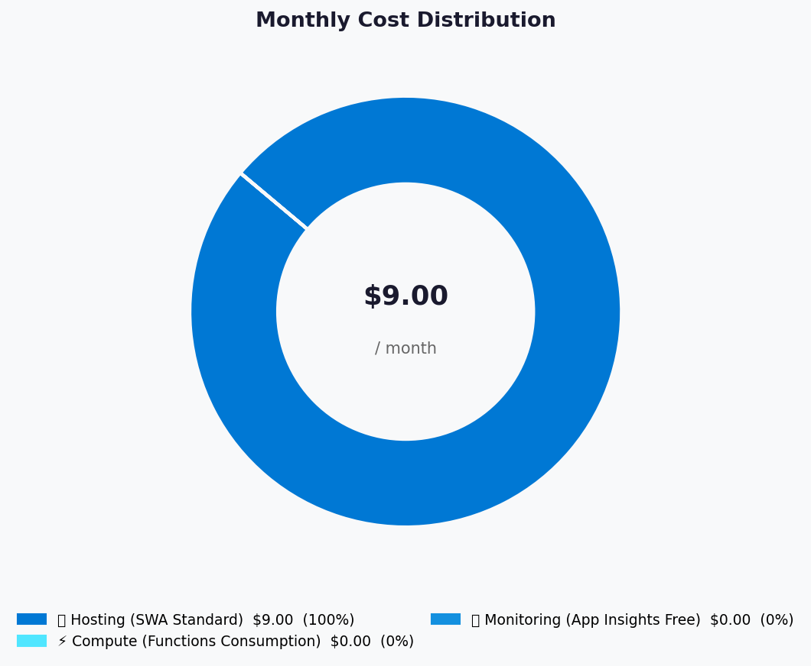
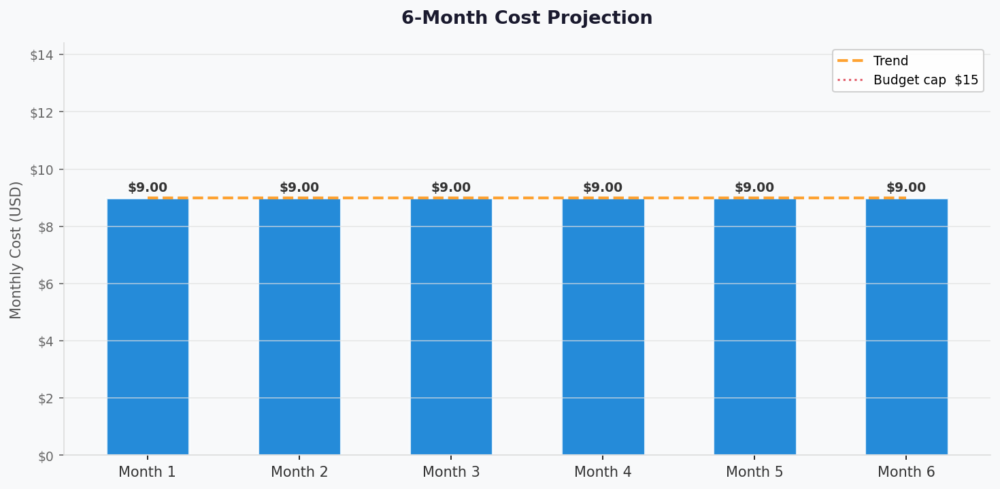

# 💰 Azure Cost Estimate: my-demo


<details open>
<summary><strong>📑 Cost Estimate Contents</strong></summary>

- [💵 Cost At-a-Glance](#-cost-at-a-glance)
- [✅ Decision Summary](#-decision-summary)
- [🔁 Requirements → Cost Mapping](#-requirements--cost-mapping)
- [📊 Top 5 Cost Drivers](#-top-5-cost-drivers)
- [🏛️ Architecture Overview](#-architecture-overview)
- [🧾 What We Are Not Paying For (Yet)](#-what-we-are-not-paying-for-yet)
- [⚠️ Cost Risk Indicators](#-cost-risk-indicators)
- [🎯 Quick Decision Matrix](#-quick-decision-matrix)
- [💰 Savings Opportunities](#-savings-opportunities)
- [🧾 Detailed Cost Breakdown](#-detailed-cost-breakdown)
- [References](#references)

</details>

> Generated by architect agent | 2026-02-24

| ⬅️ Previous                                                    | 📑 Index            | Next ➡️                                                      |
| -------------------------------------------------------------- | ------------------- | ------------------------------------------------------------ |
| [02-architecture-assessment.md](02-architecture-assessment.md) | [README](README.md) | [04-governance-constraints.md](04-governance-constraints.md) |

**Generated**: 2026-02-24
**Region**: westeurope
**Environment**: Development
**MCP Tools Used**: Azure Retail Prices API (`prices.azure.com/api/retail/prices`) — `azure_price_search`, `azure_bulk_estimate` equivalent queries
**Architecture Reference**: [02-architecture-assessment.md](02-architecture-assessment.md)

## 💵 Cost At-a-Glance

> **Monthly Total: ~$9.00** | Annual: ~$108.00
>
> ```text
> Budget: $9/month (soft limit $15) | Utilization: 100% ($9.00 of $9.00)
> ```
>
> | Status            | Indicator                                                      |
> | ----------------- | -------------------------------------------------------------- |
> | Cost Trend        | ➡️ Stable (fixed SWA Standard fee; consumption services at $0) |
> | Savings Available | 💰 $0/year — already at minimum viable spend                   |
> | Compliance        | ✅ No compliance cost overhead (non-production demo)           |

## ✅ Decision Summary

- ✅ Approved: Static Web App Standard ($9/mo) + Functions Consumption ($0) + Application Insights Free ($0)
- ⏳ Deferred: Enterprise-grade edge (Azure Front Door), custom domains, DDoS Protection Standard
- 🔁 Redesign Trigger: If demo is promoted to production with SLA requirements, add HA/DR and WAF ($30-50/mo+)

**Confidence**: High | **Expected Variance**: ±$0-2/month (bandwidth overage at $0.20/GB if >100 GB/subscription)

## 🔁 Requirements → Cost Mapping

| Requirement          | Architecture Decision        | Cost Impact    | Mandatory |
| -------------------- | ---------------------------- | -------------- | --------- |
| Best-effort SLA      | Single-region, no HA/DR      | $0 (avoided)   | No        |
| 24h RTO/RPO          | Redeploy from GitHub         | $0 (no backup) | No        |
| <3s page load        | SWA built-in CDN             | Included       | Yes       |
| HTTPS-only + TLS 1.2 | SWA platform default         | Included       | Yes       |
| Observability        | Application Insights Free    | $0.00/month    | Yes       |
| Managed Identity     | System-assigned MI           | $0 (free)      | Yes       |
| ~$9/month budget     | Standard SWA + free services | $9.00/month    | Yes       |

## 📊 Top 5 Cost Drivers

| Rank | Resource                    | Monthly Cost | % of Total | Trend | Optimization            |
| ---- | --------------------------- | -----------: | ---------: | ----- | ----------------------- |
| 1️⃣   | Static Web App (Standard)   |        $9.00 |       100% | ➡️    | Already at minimum SKU  |
| 2️⃣   | Azure Functions (Cons.)     |        $0.00 |         0% | ➡️    | Free grant covers usage |
| 3️⃣   | Application Insights (Free) |        $0.00 |         0% | ➡️    | 5 GB/month free ingest  |
| 4️⃣   | Bandwidth overage           |        $0.00 |         0% | ➡️    | 100 GB included         |
| 5️⃣   | Storage (SWA included)      |        $0.00 |         0% | ➡️    | 0.50 GB included        |

> 💡 **Quick Win**: The only cost driver is the SWA Standard SKU. To reduce to $0/month, switch to Free SKU — but this sacrifices reliable Bicep deployment and SLA.

<details>
<summary><strong>Cost Driver Details</strong></summary>

#### 1️⃣ Azure Static Web Apps (Standard)

| Aspect            | Detail                                                                  |
| ----------------- | ----------------------------------------------------------------------- |
| Current SKU       | Standard                                                                |
| Monthly Cost      | $9.00                                                                   |
| Cost Breakdown    | Flat fee: $9.00/app/month; 100 GB BW included; overage $0.20/GB         |
| Optimization      | Downgrade to Free SKU ($0) if ARM deployment issues accepted            |
| Potential Savings | $9.00/month if Free SKU is viable                                       |
| API Verification  | meterName: `Standard App`, retailPrice: $9.00, unitOfMeasure: `1/Month` |

#### 2️⃣ Azure Functions (Consumption)

| Aspect            | Detail                                                                                                      |
| ----------------- | ----------------------------------------------------------------------------------------------------------- |
| Current SKU       | Consumption                                                                                                 |
| Monthly Cost      | $0.00                                                                                                       |
| Cost Breakdown    | 1M executions free + 400K GB-s free/month                                                                   |
| Optimization      | Already at $0 — no further optimization possible                                                            |
| Potential Savings | $0/month                                                                                                    |
| API Verification  | meterName: `Standard Total Executions`, free tier ≤100K×10; `Standard Execution Time`, free tier ≤400K GB-s |

</details>

## 🏛️ Architecture Overview

### Cost Distribution

| Category         | Monthly Cost (USD) | Share |
| ---------------- | -----------------: | ----: |
| 🌐 Hosting       |              $9.00 |  100% |
| ⚡ Compute (API) |              $0.00 |    0% |
| 📊 Monitoring    |              $0.00 |    0% |



### Month-over-Month Projection



> Cost is stable at $9.00/month with no growth expected. The demo workload
> has negligible variable costs — all consumption-based services operate within free grants.

### Key Design Decisions Affecting Cost

| Decision               | Cost Impact     | Business Rationale                          | Status   |
| ---------------------- | --------------- | ------------------------------------------- | -------- |
| SWA Standard over Free | +$9.00/month 📈 | Reliable Bicep/ARM deployment; SLA included | Required |
| Functions Consumption  | $0 (free grant) | Pay-per-use with generous free tier         | Required |
| App Insights Free tier | $0 (free)       | Observability without cost                  | Required |
| No private endpoints   | $0 (avoided)    | Not needed for public demo                  | Optional |
| No Azure Front Door    | $0 (avoided)    | WAF/DDoS not justified for demo             | Optional |

## 🧾 What We Are Not Paying For (Yet)

- Enterprise-grade edge / Azure Front Door ($17.52/app/month) — DDoS + WAF protection
- Custom domain SSL certificates (SWA includes free SSL for custom domains)
- Bandwidth overage ($0.20/GB beyond 100 GB/subscription)
- Premium Functions plan (~$126/month) — eliminates cold starts
- DDoS Protection Standard (~$2,944/month) — far exceeds budget
- Log Analytics dedicated workspace (Application Insights auto-creates one)

### Assumptions & Uncertainty

- Demo usage stays under 1M function executions/month (current estimate: <500/day)
- Application Insights telemetry stays under 5 GB/month (current estimate: <100 MB/month)
- Bandwidth consumption stays under 100 GB/subscription (current estimate: <1 GB/month)
- No custom domain or DNS costs included
- No Azure DevOps/GitHub paid features needed

## ⚠️ Cost Risk Indicators

| Resource              | Risk Level | Issue                                             | Mitigation                                 |
| --------------------- | ---------- | ------------------------------------------------- | ------------------------------------------ |
| Application Insights  | 🟢 Low     | Telemetry could exceed 5 GB free if misconfigured | Set daily cap in App Insights settings     |
| Functions Consumption | 🟢 Low     | Runaway executions could exceed free grant        | Configure spending limit on subscription   |
| SWA Bandwidth         | 🟢 Low     | Viral demo could exceed 100 GB/subscription       | Monitor usage; $0.20/GB overage is minimal |

> **⚠️ Watch Item**: Application Insights ingestion — if verbose logging is enabled, 5 GB/month free grant could be exceeded. Set a daily cap of 0.16 GB/day to stay within limits.

## 🎯 Quick Decision Matrix

_"If you need X, expect to pay Y more"_

| Requirement                        | Additional Cost | SKU Change        | Verdict        | Notes                                     |
| ---------------------------------- | --------------- | ----------------- | -------------- | ----------------------------------------- |
| 99.95% SLA (already included)      | +$0/month       | Already Standard  | 🟢 Go          | SWA Standard includes SLA                 |
| WAF + DDoS (Enterprise-grade edge) | +$17.52/month   | SWA Enterprise    | 🔴 Investigate | Triples cost; only for production upgrade |
| Custom domain                      | +$0/month       | SWA config only   | 🟢 Go          | Included in Standard at no extra cost     |
| Eliminate cold starts              | +$126/month     | Functions Premium | 🔴 Investigate | 14× budget increase; not justified        |
| Multi-region deployment            | +$9/month       | Second SWA app    | 🟡 Monitor     | Only if demo needs global redundancy      |

## 💰 Savings Opportunities

> ### Total Potential Savings: $0/year
>
> | Strategy           | Commitment | Monthly Savings | Annual Savings | % Reduction |
> | ------------------ | ---------- | --------------: | -------------: | ----------: |
> | Downgrade to Free  | N/A        |           $9.00 |        $108.00 |        100% |
> | Reserved Instances | N/A        |           $0.00 |          $0.00 |          0% |
> | Savings Plan       | N/A        |           $0.00 |          $0.00 |          0% |
> | Right-sizing       | N/A        |           $0.00 |          $0.00 |          0% |
> | Dev/Test Pricing   | N/A        |           $0.00 |          $0.00 |          0% |
>
> The only savings opportunity is downgrading SWA to the Free SKU, which saves $9/month but
> sacrifices reliable Bicep/ARM deployment capability. This trade-off is **not recommended**.

## 🧾 Detailed Cost Breakdown

### Assumptions

- Hours: 730 hours/month (standard)
- Network egress: <1 GB/month (negligible for demo; overage at $0.20/GB beyond 100 GB per API)
- Storage growth: None expected (<50 MB static assets)
- Function executions: <500/day (<15K/month, well within 1M free grant; overage $0.20/million per API)
- Function execution time: <0.5s avg × 128 MB ≈ <1K GB-s/month (well within 400K GB-s free; overage $0.000016/GB-s per API)
- Telemetry volume: <100 MB/month (well within 5 GB free tier; overage $2.99/GB per API)

### Line Items

| Category      | Service              | SKU / Meter      | Quantity / Units    | Est. Monthly |
| ------------- | -------------------- | ---------------- | ------------------- | -----------: |
| 🌐 Hosting    | Static Web App       | Standard         | 1 app (flat rate)   |        $9.00 |
| ⚡ Compute    | Azure Functions      | Consumption      | <15K exec/mo (free) |        $0.00 |
| 📊 Monitoring | Application Insights | Free tier (5 GB) | <100 MB/mo (free)   |        $0.00 |
| 🌐 Networking | Bandwidth            | 100 GB included  | <1 GB/mo (free)     |        $0.00 |
|               |                      |                  | **Monthly Total**   |    **$9.00** |
|               |                      |                  | **Annual Total**    |  **$108.00** |

### Notes

- SWA Standard is billed at a flat rate of **$9.00/app/month** (Azure Retail Prices API: meterName `Standard App`, unitOfMeasure `1/Month`, retailPrice `$9.00`)
- SWA Standard includes 100 GB bandwidth free; overage at **$0.20/GB** (API: meterName `Standard Bandwidth Usage`, tiered pricing)
- Functions Consumption: first **1M executions free** then $0.20/million (API: meterName `Standard Total Executions`, $0.000002/execution after 100K×10 tier); first **400K GB-seconds free** then $0.000016/GB-s (API: meterName `Standard Execution Time`)
- Application Insights ingests into Log Analytics workspace with **5 GB/month free**; overage at **$2.99/GB** (API: serviceName `Log Analytics`, meterName `Analytics Logs Data Ingestion`, tier ≥5 GB)
- Data retention: first 31 days free, then **$0.13/GB/month** (API: meterName `Analytics Logs Data Retention`)
- All prices verified via Azure Retail Prices API (`prices.azure.com/api/retail/prices`) on 2026-02-24; actual billing may vary ±$0-1 due to rounding

---

## References

| Topic                    | Link                                                                                                    |
| ------------------------ | ------------------------------------------------------------------------------------------------------- |
| Azure Retail Prices API  | [API Reference](https://learn.microsoft.com/rest/api/cost-management/retail-prices/azure-retail-prices) |
| Static Web Apps Pricing  | [Pricing](https://azure.microsoft.com/pricing/details/app-service/static/)                              |
| Functions Pricing        | [Pricing](https://azure.microsoft.com/pricing/details/functions/)                                       |
| Azure Monitor Pricing    | [Pricing](https://azure.microsoft.com/pricing/details/monitor/)                                         |
| Log Analytics Pricing    | [Pricing](https://azure.microsoft.com/pricing/details/monitor/)                                         |
| Azure Pricing Calculator | [Calculator](https://azure.microsoft.com/pricing/calculator/)                                           |
| Cost Management          | [Overview](https://learn.microsoft.com/azure/cost-management-billing/costs/overview-cost-management)    |
| WAF Cost Optimization    | [Checklist](https://learn.microsoft.com/azure/well-architected/cost-optimization/checklist)             |

---

<div align="center">

| ⬅️ [02-architecture-assessment.md](02-architecture-assessment.md) | 🏠 [Project Index](README.md) | ➡️ [04-governance-constraints.md](04-governance-constraints.md) |
| ----------------------------------------------------------------- | ----------------------------- | --------------------------------------------------------------- |

</div>
