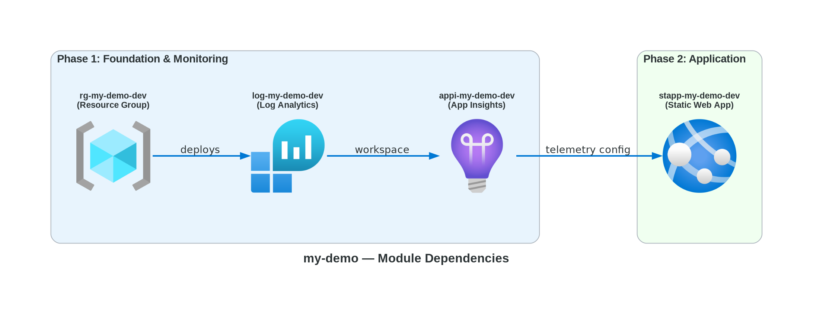
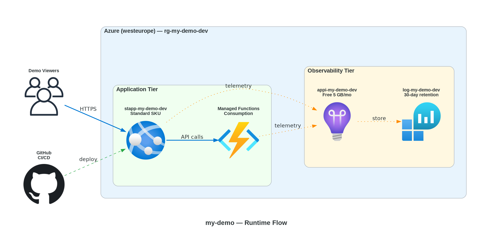

# 📀 Step 4: Implementation Plan - my-demo


<details open>
<summary><strong>📑 Implementation Contents</strong></summary>

- [📋 Overview](#-overview)
- [📦 Resource Inventory](#-resource-inventory)
- [🗂️ Module Structure](#-module-structure)
- [🔨 Implementation Tasks](#-implementation-tasks)
- [🚀 Deployment Phases](#-deployment-phases)
- [🔗 Dependency Graph](#-dependency-graph)
- [🔄 Runtime Flow Diagram](#-runtime-flow-diagram)
- [🏷️ Naming Conventions](#-naming-conventions)
- [🔐 Security Configuration](#-security-configuration)
- [⏱️ Estimated Implementation Time](#-estimated-implementation-time)
- [🔒 Approval Gate](#-approval-gate)
- [References](#references)

</details>

> Generated by bicep-plan agent | 2026-02-24

| ⬅️ Previous                                                  | 📑 Index            | Next ➡️                                        |
| ------------------------------------------------------------ | ------------------- | ---------------------------------------------- |
| [04-governance-constraints.md](04-governance-constraints.md) | [README](README.md) | [04-preflight-check.md](04-preflight-check.md) |

## 📋 Overview

This plan implements a **Star Wars themed demo application** on Azure using 4 resources across 2 deployment phases. The architecture follows the **Static Site (Cost-Optimized)** pattern with Azure Static Web Apps as the primary hosting platform, integrated Azure Functions for optional serverless API, and Application Insights for observability.

All resources use **Azure Verified Modules (AVM)** from the Bicep public registry. Governance constraints from 20 discovered Azure Policies have been incorporated, including 9 required tags and MFA-aware deployment.

**Key constraints addressed:**

- 9 required tags on resource group (Deny policy: JV-Enforce RG Tags v3)
- MFA enforcement for ARM writes (Deny policy: sys.mfa-write)
- Diagnostic settings for Functions (Audit policy)
- Tag inheritance from RG to child resources (Modify policy)

---

## 📦 Resource Inventory

| Resource                | Type                                       | SKU                       | AVM Module                                  | Version | Dependencies            | Status  |
| ----------------------- | ------------------------------------------ | ------------------------- | ------------------------------------------- | ------- | ----------------------- | ------- |
| Log Analytics Workspace | `Microsoft.OperationalInsights/workspaces` | PerGB2018 (5 GB/day free) | ✅ `avm/res/operational-insights/workspace` | 0.15.0  | Resource Group          | ⬜ Todo |
| Application Insights    | `Microsoft.Insights/components`            | web (free 5 GB)           | ✅ `avm/res/insights/component`             | 0.7.1   | Log Analytics Workspace | ⬜ Todo |
| Static Web App          | `Microsoft.Web/staticSites`                | Standard                  | ✅ `avm/res/web/static-site`                | 0.9.3   | Application Insights    | ⬜ Todo |
| Azure Functions         | `Microsoft.Web/sites` (managed by SWA)     | Consumption               | ✅ `avm/res/web/site` (via SWA)             | N/A     | Static Web App          | ⬜ Todo |

> [!NOTE]
> Azure Functions are managed by Static Web Apps when using the SWA-integrated API model.
> The Functions runtime is configured via the SWA resource, not as a separate deployment.
> A Log Analytics Workspace is required as the backing store for Application Insights (workspace-based).

---

## 🗂️ Module Structure

```text
infra/bicep/my-demo/
├── main.bicep              # Orchestration: parameters, variables, module calls
├── main.bicepparam         # Parameter file with environment-specific values
├── modules/
│   ├── log-analytics.bicep     # Log Analytics Workspace (AVM)
│   ├── app-insights.bicep      # Application Insights (AVM)
│   └── static-web-app.bicep    # Static Web App with Functions (AVM)
└── deploy.ps1              # Deployment script (What-If + deploy)
```

| Module               | AVM Source                                                | Version | Purpose                                           |
| -------------------- | --------------------------------------------------------- | ------- | ------------------------------------------------- |
| log-analytics.bicep  | `br/public:avm/res/operational-insights/workspace:0.15.0` | 0.15.0  | Log Analytics Workspace for App Insights          |
| app-insights.bicep   | `br/public:avm/res/insights/component:0.7.1`              | 0.7.1   | Application monitoring and telemetry              |
| static-web-app.bicep | `br/public:avm/res/web/static-site:0.9.3`                 | 0.9.3   | Static Web App hosting with SWA-managed Functions |

---

## 🔨 Implementation Tasks

### Task 1: main.bicep (Orchestration)

**Purpose**: Main entry point orchestrating all module deployments

**Parameters**:

```yaml
- location: string = 'westeurope'
- environment: string = 'dev'
- projectName: string = 'my-demo'
- owner: string # Required by tag policy
- costCenter: string = 'demo' # Required by tag policy
- technicalContact: string # Required by tag policy
```

**Variables**:

```yaml
- uniqueSuffix: uniqueString(resourceGroup().id)
- tags: object with all 9 required governance tags
- logName: "log-${projectName}-${environment}"
- appiName: "appi-${projectName}-${environment}"
- stappName: "stapp-${projectName}-${environment}-${take(uniqueSuffix, 6)}" # Globally unique (SWA hostnames are tenant-wide)
```

**Modules Called**:

1. `modules/log-analytics.bicep` — Log Analytics Workspace
2. `modules/app-insights.bicep` — Application Insights (depends on #1)
3. `modules/static-web-app.bicep` — Static Web App (depends on #2)

### Task 2: modules/log-analytics.bicep

**Purpose**: Deploy Log Analytics Workspace as backing store for Application Insights

**Resources**:

- Log Analytics Workspace via AVM (`br/public:avm/res/operational-insights/workspace:0.15.0`)

**Key Configuration**:

```yaml
- sku: PerGB2018 (5 GB/day free ingestion allowance, then $2.76/GB)
- retentionInDays: 30
- dailyQuotaGb: 1 # AVM parameter is type int — minimum value; demo usage <<1 GB/day
```

**Outputs**:

- `resourceId` — Workspace resource ID (for App Insights)
- `name` — Workspace name

### Task 3: modules/app-insights.bicep

**Purpose**: Deploy Application Insights for observability

**Resources**:

- Application Insights via AVM (`br/public:avm/res/insights/component:0.7.1`)

**Key Configuration**:

```yaml
- kind: "web"
- applicationType: "web"
- workspaceResourceId: logAnalyticsWorkspace.outputs.resourceId
- retentionInDays: 90
- dailyDataCapGb: 1 # Minimum integer; demo telemetry <<1 GB/day
```

**Outputs**:

- `connectionString` — App Insights connection string (for SWA)
- `instrumentationKey` — Instrumentation key
- `resourceId` — Resource ID

### Task 4: modules/static-web-app.bicep

**Purpose**: Deploy Static Web App with integrated Functions API

**Resources**:

- Static Web App via AVM (`br/public:avm/res/web/static-site:0.9.3`)

**Key Configuration**:

```yaml
- sku: Standard
- stagingEnvironmentPolicy: "Enabled"
- allowConfigFileUpdates: true
- appSettings:
    APPLICATIONINSIGHTS_CONNECTION_STRING: appInsights.outputs.connectionString
```

**Outputs**:

- `defaultHostname` — SWA default URL
- `name` — SWA resource name

### Task 5: deploy.ps1 (Deployment Script)

**Features**:

- **Resource group creation** with all 9 required tags (subscription-scope pre-step)
- Parameter validation (location, environment, required tags)
- **Identity pre-flight check** — detects SP vs interactive auth, warns if MFA may block writes
- Bicep lint and build verification
- What-If preview with user confirmation
- Phased deployment execution (Phase 1 → validate → Phase 2)
- Output display (SWA URL, App Insights connection)
- **Default: service principal authentication** (MFA Deny policy compliance)
- Rollback guidance on failure (delete resource group to clean up all resources)

---

## 🚀 Deployment Phases

> Deployment strategy: **Phased** (2 phases with approval gate)

### Phase 1: Foundation & Monitoring

| Order | Module              | Resources               | Validation                                              |
| ----- | ------------------- | ----------------------- | ------------------------------------------------------- |
| 1     | log-analytics.bicep | Log Analytics Workspace | Verify workspace provisioned, daily cap set             |
| 2     | app-insights.bicep  | Application Insights    | Verify connection string available, linked to workspace |

**Pre-step**: Create resource group `rg-my-demo-dev` with all 9 required tags (Deny policy gate).
**Estimated Deploy Time**: ~3 minutes
**Approval Gate**: Verify monitoring foundation is operational before deploying application resources.

### Phase 2: Application

| Order | Module               | Resources                            | Validation                                                     |
| ----- | -------------------- | ------------------------------------ | -------------------------------------------------------------- |
| 3     | static-web-app.bicep | Static Web App (+ managed Functions) | Verify SWA default hostname accessible, App Insights connected |

**Estimated Deploy Time**: ~2 minutes
**Approval Gate**: Verify SWA is live and telemetry flows to Application Insights.

### Rollback Strategy

If any phase fails:

1. **Phase 2 failure**: Phase 1 resources remain (LAW + App Insights) — cost impact ~$0/month at demo volume. Re-run Phase 2 after fixing the issue.
2. **Full rollback**: `az group delete -n rg-my-demo-dev --yes --no-wait` removes all resources.
3. **Idle cleanup**: Demo resources should be deleted if unused after 30 days.

### Phase Summary

| Phase                       | Resources                   | Est. Deploy Time | Approval Gate        |
| --------------------------- | --------------------------- | ---------------- | -------------------- |
| 1 — Foundation & Monitoring | 2 (LAW + App Insights)      | ~3 min           | ✅ Verify monitoring |
| 2 — Application             | 1 (SWA + managed Functions) | ~2 min           | ✅ Verify live site  |

---

## 🔗 Dependency Graph



Source: [04-dependency-diagram.py](./04-dependency-diagram.py)

> The dependency graph shows the deployment order: Resource Group → Log Analytics → Application Insights → Static Web App (with managed Functions).

---

## 🔄 Runtime Flow Diagram



Source: [04-runtime-diagram.py](./04-runtime-diagram.py)

> The runtime flow shows request paths (user → SWA → Functions), telemetry paths (all resources → App Insights → LAW), and the GitHub CI/CD integration.

---

## 🏷️ Naming Conventions

| Resource       | Pattern                          | Example                    | Generated Name                               |
| -------------- | -------------------------------- | -------------------------- | -------------------------------------------- |
| Resource Group | `rg-{project}-{env}`             | `rg-my-demo-dev`           | `rg-my-demo-dev`                             |
| Log Analytics  | `log-{project}-{env}`            | `log-my-demo-dev`          | `log-my-demo-dev`                            |
| App Insights   | `appi-{project}-{env}`           | `appi-my-demo-dev`         | `appi-my-demo-dev`                           |
| Static Web App | `stapp-{project}-{env}-{suffix}` | `stapp-my-demo-dev-abc123` | `stapp-my-demo-dev-${take(uniqueSuffix, 6)}` |

> All names follow CAF abbreviation conventions. SWA requires a globally-unique suffix (hostname is tenant-wide). LAW and App Insights names are RG-scoped.
>
> **Tag key casing**: All tag keys use **lowercase** per governance policy discovery (e.g., `environment`, not `Environment`).

---

## 🔐 Security Configuration

| Resource             | Security Setting     | Value                                                        |
| -------------------- | -------------------- | ------------------------------------------------------------ |
| Static Web App       | HTTPS enforcement    | Enabled (platform default)                                   |
| Static Web App       | TLS minimum version  | TLS 1.2                                                      |
| Static Web App       | Staging environments | Enabled                                                      |
| Static Web App       | Managed Identity     | System-assigned (covers SWA-managed Functions)               |
| Static Web App       | FTPS state           | FtpsOnly (set on SWA resource, applies to managed Functions) |
| Application Insights | Daily cap            | 0.16 GB/day (~5 GB/month free tier)                          |
| Log Analytics        | Daily cap            | 0.16 GB/day                                                  |
| All resources        | Tags                 | 9 governance-required tags                                   |
| Deployment           | Authentication       | Service principal (MFA policy compliance)                    |

---

## ⏱️ Estimated Implementation Time

| Task                                   | Estimated Duration |
| -------------------------------------- | ------------------ |
| Bicep modules (3 modules + main.bicep) | ~30 minutes        |
| Parameter file (main.bicepparam)       | ~5 minutes         |
| Deployment script (deploy.ps1)         | ~15 minutes        |
| Testing (lint + build + What-If)       | ~10 minutes        |
| Phase 1 deployment                     | ~3 minutes         |
| Phase 2 deployment                     | ~2 minutes         |
| **Total**                              | **~65 minutes**    |

---

## 🔒 Approval Gate

> [!IMPORTANT]
> **📋 Implementation Plan Ready**
>
> | Metric                           | Value                                            |
> | -------------------------------- | ------------------------------------------------ |
> | Azure resources planned          | 4 (LAW + App Insights + SWA + managed Functions) |
> | Bicep modules to create          | 3 + main.bicep + deploy.ps1                      |
> | AVM coverage                     | 100% (all resources use AVM modules)             |
> | Governance constraints addressed | ✅ All 2 blockers resolved                       |
> | CAF naming conventions applied   | ✅ All resources follow CAF patterns             |
> | Deployment strategy              | Phased (2 phases)                                |
> | Estimated monthly cost           | ~$9.00                                           |
>
> - [ ] **Approved** — proceed to bicep-code
> - **Approver**: \_\_\_
> - **Date**: \_\_\_
>
> Reply **"approve"** to proceed to bicep-code, or provide feedback.

---

## References

> [!NOTE]
> 📚 The following Microsoft Learn resources inform this implementation.

| Topic                  | Link                                                                                                                          |
| ---------------------- | ----------------------------------------------------------------------------------------------------------------------------- |
| Azure Verified Modules | [AVM Index](https://aka.ms/avm/index)                                                                                         |
| Bicep Best Practices   | [Documentation](https://learn.microsoft.com/azure/azure-resource-manager/bicep/best-practices)                                |
| CAF Naming Conventions | [Naming Rules](https://learn.microsoft.com/azure/cloud-adoption-framework/ready/azure-best-practices/resource-naming)         |
| Resource Abbreviations | [Abbreviations](https://learn.microsoft.com/azure/cloud-adoption-framework/ready/azure-best-practices/resource-abbreviations) |
| Static Web Apps AVM    | [Module Docs](https://github.com/Azure/bicep-registry-modules/tree/main/avm/res/web/static-site)                              |
| App Insights AVM       | [Module Docs](https://github.com/Azure/bicep-registry-modules/tree/main/avm/res/insights/component)                           |
| Log Analytics AVM      | [Module Docs](https://github.com/Azure/bicep-registry-modules/tree/main/avm/res/operational-insights/workspace)               |

---

_Plan generated by bicep-plan agent following Azure Well-Architected Framework guidelines._

---

<div align="center">

| ⬅️ [04-governance-constraints.md](04-governance-constraints.md) | 🏠 [Project Index](README.md) | ➡️ [04-preflight-check.md](04-preflight-check.md) |
| --------------------------------------------------------------- | ----------------------------- | ------------------------------------------------- |

</div>
