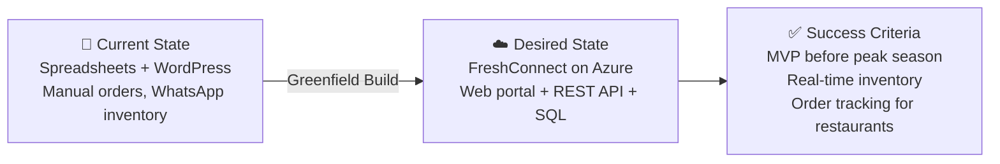

# 📋 Step 1: Requirements - Nordic Fresh Foods - FreshConnect MVP

<strong>📑 Requirements Overview</strong>

- [🎯 Project Overview](#-project-overview)
- [🚀 Functional Requirements](#-functional-requirements)
- [⚡ Non-Functional Requirements (NFRs)](#-non-functional-requirements-nfrs)
- [🔒 Compliance & Security Requirements](#-compliance--security-requirements)
- [💰 Budget](#-budget)
- [🔧 Operational Requirements](#-operational-requirements)
- [🌍 Regional Preferences](#-regional-preferences)
- [📊 Complexity Classification](#-complexity-classification)
- [📋 Summary for Architecture Assessment](#-summary-for-architecture-assessment)
- [References](#references)

> Generated by @requirements agent | 2026-05-11

| ⬅️ Previous | 📑 Index            | Next ➡️                                                        |
| ----------- | ------------------- | -------------------------------------------------------------- |
| —           | [README](README.md) | [02-architecture-assessment.md](02-architecture-assessment.md) |

<!-- iac_tool: Bicep -->

## 🎯 Project Overview

| Field                   | Value                                                                                                  |
| ----------------------- | ------------------------------------------------------------------------------------------------------ |
| **Project Name**        | Nordic Fresh Foods - FreshConnect MVP                                                                  |
| **Project Type**        | Full-Stack (Web Portal + REST API + Database)                                                          |
| **Timeline**            | 2026-05-11 → ~2026-08-11 (3 months to peak-season MVP)                                                 |
| **Primary Stakeholder** | CTO, Nordic Fresh Foods                                                                                |
| **Target Environment**  | Dev — sized to production-equivalent capacity so all NFRs (99.9% SLA, 500 peak users, 3× seasonal spike) are testable in this environment. A separate Production env is deferred until post-MVP. |
| **Business Context**    | Cloud-native order, inventory, and delivery platform replacing manual spreadsheet/WhatsApp processes.  |

### Business Context

| Field               | Value                                                                                                |
| ------------------- | ---------------------------------------------------------------------------------------------------- |
| Industry / Vertical | Food & Beverage / Logistics (farm-to-table delivery)                                                 |
| Company Size        | Startup / Small (founded 2022; 500+ partner restaurants; ~10,000 active consumers; 4-person tech team) |
| Current State       | Greenfield (new build; existing tech is spreadsheets, WordPress, manual processes)                   |
| Migration Source    | N/A — greenfield (legacy spreadsheet/WhatsApp/WordPress workflows being replaced)                    |
| Business Drivers    | Modernize before peak season; reduce 8% order-loss rate; eliminate overselling; scale without temp staff |
| Success Criteria    | MVP live before peak season; manual order entry eliminated; real-time inventory visible to ops team  |

### State Transition

## 🚀 Functional Requirements

### Core Capabilities

| #   | Capability                                                                  | Priority   | Acceptance Criteria                                                                |
| --- | --------------------------------------------------------------------------- | ---------- | ---------------------------------------------------------------------------------- |
| 1   | Web portal for restaurant and consumer order entry                          | 🔴 Must    | Authenticated order submission; sustains 500 concurrent users at peak              |
| 2   | RESTful API backend for mobile/integration consumers                        | 🔴 Must    | Documented REST endpoints; Entra-protected; supports current + future mobile app   |
| 3   | Persisted store for orders, customers, inventory, delivery schedules        | 🔴 Must    | Relational database with daily backup, point-in-time restore within RPO 1h         |
| 4   | Object storage for product images, invoices, delivery receipts              | 🔴 Must    | Blob storage with EU residency; lifecycle to cool tier for invoices > 90 days      |
| 5   | Centralized secrets, keys, and certificate management                       | 🔴 Must    | Key Vault holds all connection strings, API keys, and certificates; no app-side secrets |
| 6   | Application health, performance metrics, and alerting                       | 🔴 Must    | Application Insights + Log Analytics with availability + error-rate alerts         |
| 7   | Real-time inventory updates from partner farms                              | 🟡 Should  | API write-path for stock updates; reads consistent within seconds                  |
| 8   | Order tracking visibility for restaurants and consumers                     | 🟡 Should  | Status endpoint returning lifecycle state and ETA placeholder                      |
| 9   | Operational analytics for business decisions                                | 🟢 Could   | Log Analytics workbooks or basic Power BI views (out of MVP scope if cost-constrained) |

### User Types

| User Type             | Description                                                  | Est. Count     | Access Level                            |
| --------------------- | ------------------------------------------------------------ | -------------- | --------------------------------------- |
| Restaurant buyer      | Places orders via web portal                                  | 500+           | External (Entra External ID); Contributor on own orders |
| Consumer              | Places direct orders via web portal                           | ~10,000 active | External (Entra External ID); Contributor on own orders |
| Operations staff      | Manages orders, inventory, deliveries                         | <20            | Internal (Entra ID); Admin in app       |
| Farmer / supplier     | Updates stock levels via API or simple form                   | 50–200         | External (Entra External ID); scoped Contributor |
| DevOps / Engineering  | Deploys, monitors, maintains platform                         | 4              | Azure RBAC at resource group / subscription scope |

### Integrations

| System               | Direction   | Protocol | Auth Method               | SLA                |
| -------------------- | ----------- | -------- | ------------------------- | ------------------ |
| Future mobile app    | Inbound     | REST     | OAuth via Entra External ID | Aligned with API SLA (99.9%) |
| Farm inventory feeds | Inbound     | REST     | **OAuth via Entra External ID required**; API keys allowed only as time-boxed exception per supplier with rotation, scope-limited write paths, and audit logging | Best-effort during MVP |
| Email / notification | Outbound    | SMTP/REST | Managed Identity to provider | Best-effort        |

> Payment processing and route-optimization integrations are explicitly out of scope for MVP.

### Data Types

| Category                           | Sensitivity | Est. Volume               | Retention               | Residency      |
| ---------------------------------- | ----------- | ------------------------- | ----------------------- | -------------- |
| Customer PII (name, contact, address) | 🔴 High    | Tens of thousands of records | 7 years (commercial law) | EU only        |
| Orders & delivery records           | 🟡 Medium   | ~Thousands/day at peak     | 7 years                  | EU only        |
| Inventory snapshots                 | 🟢 Low      | Frequent updates per farm  | 30–90 days operational  | EU only        |
| Product images                      | 🟢 Low      | <100 GB MVP                | Indefinite               | EU only        |
| Invoices / receipts                 | 🟡 Medium   | Aligned with order volume  | 7 years                  | EU only        |
| Authentication / secrets            | 🔴 High     | Small                      | Rotation per policy      | EU only (Key Vault) |

### Architecture Pattern

| Field              | Value                                                                                                    |
| ------------------ | -------------------------------------------------------------------------------------------------------- |
| Workload Pattern   | N-Tier (Web Portal + REST API + Relational Database)                                                     |
| Recommended Option | Azure App Service (Web + API) + Azure SQL Database + Storage Account + Key Vault + Application Insights  |
| Tier               | Balanced (standard SKUs, zone-aware where it does not increase cost)                                     |
| Justification      | Small DevOps team needs managed PaaS; pattern matches functional needs; fits ~€500/month MVP envelope     |

## ⚡ Non-Functional Requirements (NFRs)

| WAF Pillar     | Metric             | Target                                  | Current | Gap                                    |
| -------------- | ------------------ | --------------------------------------- | ------- | -------------------------------------- |
| 🔄 Reliability | SLA                | 99.9% (binds to the Dev env at prod-equivalent sizing) | N/A     | New build                              |
| 🔄 Reliability | RTO                | 4 hours (in-region; per-component matrix below) | N/A     | DR strategy designed in Step 2         |
| 🔄 Reliability | RPO                | 1 hour (applies to SQL data; per-component matrix below) | N/A     | Backup cadence to be set in Step 4     |
| ⚡ Performance | Page Load          | <2.5s p95 on web portal                 | N/A     | Architect to validate SKU sizing       |
| ⚡ Performance | API Response (p95) | <500 ms                                 | N/A     | Architect to validate                  |
| ⚡ Performance | Concurrent Users   | 500 at peak (3× normal during seasonal spikes) | N/A | Autoscale plan needed                  |
| 🔒 Security    | Auth Method        | Entra ID (workforce) + Entra External ID (customers) | — | Avoid deprecated B2C path             |
| 🔒 Security    | Encryption         | At-rest (platform-managed keys) + in-transit (TLS 1.2+) | — | — |
| 💰 Cost        | Monthly Budget     | ~€500/month MVP; ~€700/month after DR add-on | — | Validated by Architect cost estimate |
| 🔧 Operations  | Uptime Monitoring  | Yes (Application Insights availability tests) | — | — |

### Recovery Targets by Component

| Component               | Failure Mode                          | RTO     | RPO     | Recovery Mechanism                                |
| ----------------------- | ------------------------------------- | ------- | ------- | ------------------------------------------------- |
| Azure SQL Database      | Data loss / corruption                | ≤ 4 h   | ≤ 1 h   | Continuous PITR within 7-day window               |
| Storage (Blob)          | Accidental deletion / overwrite       | ≤ 4 h   | ≤ 24 h  | Soft delete + blob versioning (retention TBD by data class — REQ-C-02 deferred) |
| Key Vault               | Item deletion                         | ≤ 1 h   | n/a     | Soft delete + purge protection (90 days)          |
| App Service config      | Misconfiguration / accidental loss    | ≤ 2 h   | n/a     | Re-deploy from IaC + Git history                  |
| Whole-region outage     | Regional Azure outage                 | Best-effort (DR deferred to workshop Challenge 4) | Best-effort | Out of MVP scope; revisited at €700/mo budget |

### Scalability

| Dimension        | Current                  | 6-Month Projection         | 12-Month Projection                            |
| ---------------- | ------------------------ | -------------------------- | ---------------------------------------------- |
| Users            | ~10,000 active consumers + 500 restaurants | Same baseline + onboarding push | 3× peak during seasonal spikes (summer, December) |
| Data Volume      | <50 GB SQL + <100 GB blob | ~100 GB SQL + ~250 GB blob | ~250 GB SQL + ~500 GB blob                     |
| Transactions/day | Hundreds                 | Thousands                  | Several thousand at peak (~3× off-peak)        |

## 🔒 Compliance & Security Requirements

### Regulatory Frameworks

<strong>PCI-DSS</strong> — Not Applicable (MVP)

| Requirement             | Applicability | Notes                                                  |
| ----------------------- | ------------- | ------------------------------------------------------ |
| Cardholder data storage | No            | Payment integration deferred; no PAN stored in MVP     |
| Network segmentation    | No            | Re-evaluate when payment processing is added           |
| Encryption requirements | No            | Re-evaluate when payment processing is added           |

<strong>SOC 2</strong> — Not Applicable

| Trust Principle | Applicability | Notes                                  |
| --------------- | ------------- | -------------------------------------- |
| Security        | No            | Not contractually required for MVP     |
| Availability    | No            | Not contractually required for MVP     |
| Confidentiality | No            | Not contractually required for MVP     |

<strong>HIPAA</strong> — Not Applicable

| Requirement   | Applicability | Notes                            |
| ------------- | ------------- | -------------------------------- |
| PHI handling  | No            | No health data processed         |
| BAA required  | No            | N/A                              |
| Audit logging | No            | Standard audit logging only      |

<strong>GDPR</strong> — Applicable

| Requirement      | Applicability | Notes                                                                         |
| ---------------- | ------------- | ----------------------------------------------------------------------------- |
| EU data subjects | Yes           | All consumers and restaurants are EU residents                                |
| Data residency   | Yes           | Customer PII must remain in EU; primary region `swedencentral`                |
| Right to erasure | Yes           | Application + database must support customer-initiated deletion workflows     |

<strong>EU Data Boundary</strong> — Applicable

| Requirement                                | Applicability | Notes                                                                                 |
| ------------------------------------------ | ------------- | ------------------------------------------------------------------------------------- |
| Customer data processed/stored in EU only  | Yes           | All data services pinned to `swedencentral`; no GRS replication outside EU            |
| Avoid global services that egress data     | Yes           | Validate Front Door / Traffic Manager / Azure DNS use against EU Data Boundary scope  |
| Logs and telemetry residency               | Yes           | Log Analytics workspace in `swedencentral`                                            |

<strong>ISO 27001</strong> — Not Applicable (MVP)

| Control Area        | Applicability | Notes                                  |
| ------------------- | ------------- | -------------------------------------- |
| Access control      | No            | Industry-standard practices applied    |
| Asset management    | No            | Not formally certified                 |
| Incident management | No            | Lightweight incident process for MVP   |

### Data Residency

| Requirement              | Value                                                                            |
| ------------------------ | -------------------------------------------------------------------------------- |
| Primary Region           | `swedencentral`                                                                  |
| Data Sovereignty         | EU-only (all customer PII, orders, invoices)                                     |
| Cross-region Replication | Not required for MVP; revisit when DR add-on is approved (workshop Challenge 4)  |

### Authentication & Authorization

| Requirement       | Value                                                                                              |
| ----------------- | -------------------------------------------------------------------------------------------------- |
| Identity Provider | Entra ID (workforce) + Entra External ID (customers, restaurants, farmers, suppliers)              |
| MFA Requirement   | Conditional (mandatory for workforce; risk-based for external users)                               |
| RBAC Model        | Azure RBAC for platform; application-level role mapping for customer/restaurant/farmer/supplier personas |
| Supplier Write Access | Entra External ID OAuth required for all stock-update API calls; API keys are exception-only (per-supplier scope, expiry, rotation, audit) |

> Decision: avoid Azure AD B2C — it is on a deprecation path; new customer identity must use Entra External ID.
>
> Assumption: an Entra External ID tenant will be provisioned during Step 2/3 and is sized for ~10,000 active consumers, 500 restaurants, and 50–200 suppliers. Tenant ownership and licensing model are an open item for the Architect.

### Network Security

| Control                     | Required | Notes                                                                                           |
| --------------------------- | -------- | ----------------------------------------------------------------------------------------------- |
| Private endpoints           | ✅       | For SQL, Storage, Key Vault — protects customer PII even within MVP scope                        |
| VNet integration            | ✅       | App Service VNet integration to reach private endpoints                                          |
| Public endpoints acceptable | ⚠️       | Acceptable for the public-facing web/API tier behind App Service; private for data services     |
| WAF required                | ⚠️       | Optional for MVP **only if** the public-edge baseline below is fully implemented as compensating controls |

#### Public-Edge Baseline (mandatory if WAF is deferred)

| Compensating Control                          | Required | Notes                                                       |
| --------------------------------------------- | -------- | ----------------------------------------------------------- |
| Authentication on every API route             | ✅       | Entra ID / Entra External ID; no anonymous write paths      |
| Application-layer rate limiting + throttling  | ✅       | Per-IP and per-identity ceilings on order/inventory APIs    |
| TLS 1.2+ only, HTTPS-only on App Service      | ✅       | Enforced platform setting                                   |
| Diagnostic logging on App Service + WAF (if any) | ✅    | Streamed to Log Analytics                                   |
| Alerting on suspicious request patterns       | ✅       | 5xx surge, auth-failure spike, unusual geo distribution     |
| App Service access restrictions where applicable | ✅    | Lock admin/management endpoints to known IPs                 |

### Recommended Security Controls

Controls are tagged with priority tiers so Step 2 has an explicit budget trade-off rule:

- **Non-negotiable (MVP)**: must be in the baseline cost estimate.
- **Cost-sensitive (architect decision)**: include if envelope allows; otherwise document trade-off + compensating control.
- **Post-MVP**: out of MVP scope, revisit later.

| Control               | Priority             | Recommended | User Confirmed | Notes                                                                  |
| --------------------- | -------------------- | ----------- | -------------- | ---------------------------------------------------------------------- |
| Managed Identity      | Non-negotiable       | yes         | yes            | All app-to-Azure access via system-assigned MI; no shared keys          |
| Key Vault for Secrets | Non-negotiable       | yes         | yes            | All secrets, certs, KV-issued connection strings                        |
| TLS 1.2 Minimum       | Non-negotiable       | yes         | yes            | Enforced on App Service, SQL, Storage, Key Vault                        |
| Encryption at Rest    | Non-negotiable       | yes         | yes            | Platform-managed keys for MVP; CMK deferred                             |
| Diagnostic Settings   | Non-negotiable       | yes         | yes            | All resources to Log Analytics workspace in `swedencentral`             |
| Public-Edge Baseline  | Non-negotiable       | yes         | yes            | See compensating controls table above                                   |
| Private Endpoints (SQL, Storage, KV) | Cost-sensitive | yes | yes        | ~€7/mo per endpoint × 3; if envelope-blocked, require service firewalls + MI-only access as compensation |
| WAF                   | Cost-sensitive       | yes         | conditional    | Required unless full Public-Edge Baseline is in place                   |
| Network Isolation (VNet + NSG) | Cost-sensitive | yes      | yes            | Coupled with private endpoints; cost mostly from PE side                |
| Customer-Managed Keys | Post-MVP             | no          | no             | Defer to post-MVP; not required by GDPR for MVP scope                   |
| DDoS Protection Standard | Post-MVP          | no          | no             | Defer; rely on Azure platform DDoS Basic for MVP                        |

> Cost-estimate requirement: Step 2 must produce a **baseline MVP option** (non-negotiable controls only) and a **secure-plus option** (adds Private Endpoints + WAF) so stakeholders can choose against the €500/€700/month envelope explicitly.

## 💰 Budget

> [!NOTE]
> The Azure Pricing MCP server generates detailed cost estimates during
> architecture assessment (Step 2). Provide an approximate budget here.

| Field              | Value                                                          |
| ------------------ | -------------------------------------------------------------- |
| 💰 Monthly Budget  | ~€500/month (MVP); ~€700/month after DR add-on (Challenge 4)   |
| 📅 Annual Budget   | ~€6,000/year MVP baseline                                      |
| 🚦 Limit Type      | 🟡 Soft — CFO-approved envelope; can negotiate for justified scope |
| 📊 Cost Model Pref | Consumption-leaning with low-tier reserved baselines if break-even at MVP scale |

### Cost Monitoring & Enforcement

| Control                            | Required | Notes                                                                   |
| ---------------------------------- | -------- | ----------------------------------------------------------------------- |
| Azure Budget at MVP envelope       | ✅       | One budget at ~€500/mo (MVP), updated to ~€700/mo after DR add-on        |
| Forecast / actual alerts           | ✅       | 80% (warning), 100% (breach), 120% (escalation) — actual + forecast     |
| Anomaly detection                  | ✅       | Cost Management anomaly alerts where available                           |
| Notification recipients            | ✅       | Parameterized in IaC (no hardcoded emails); Ops + CFO distribution lists |
| Monthly cost review cadence        | ✅       | Light Ops review during MVP; supports 4-person team workload             |

### Cost Optimization Priorities

| Priority                         | Selected | Impact |
| -------------------------------- | -------- | ------ |
| Minimize compute costs           | ☑        | High   |
| Prefer consumption-based pricing | ☑        | High   |
| Reserved instances acceptable    | ☐        | Low (defer until usage stabilizes) |
| Spot instances for non-critical  | ☐        | Low (not applicable to PaaS shape) |

## 🔧 Operational Requirements

### Monitoring & Alerting

| Capability             | Required | Tool / Service              | Notes                                                                |
| ---------------------- | -------- | --------------------------- | -------------------------------------------------------------------- |
| Application monitoring | ✅       | Application Insights        | Web portal + API instrumented; failures, dependencies, performance   |
| Log aggregation        | ✅       | Log Analytics               | Diagnostic settings on all resources; central workspace              |
| Alert notifications    | ✅       | Email (action group)        | Ops staff distribution list; Teams webhook optional                  |
| Custom dashboards      | ✅       | Azure Monitor workbooks     | Health, latency, error-rate, daily order volume                      |

### Support & Maintenance

| Requirement         | Value                                                                                |
| ------------------- | ------------------------------------------------------------------------------------ |
| Support Hours       | Business hours (Stockholm) with best-effort after-hours during peak season           |
| On-call Requirement | Lightweight rotation across the 4-person tech team                                   |
| Maintenance Windows | Planned changes outside peak hours; documented in runbook                            |
| Change Management   | Team approval via PR + automated deployment pipeline (no formal CAB)                 |

### Backup & Disaster Recovery

| Component             | Backup Frequency                  | Retention | Recovery Method                         |
| --------------------- | --------------------------------- | --------- | --------------------------------------- |
| Azure SQL Database    | Continuous (PITR)                 | 7 days PITR + LTR per regulatory need | PITR restore (in-region)        |
| Storage (Blob)        | Soft delete + versioning          | 30 days   | Restore from soft-deleted version       |
| Key Vault             | Soft delete + purge protection    | 90 days   | Recover from soft-deleted state         |
| App Service config    | Source control (IaC + app config) | Indefinite (Git history) | Re-deploy via pipeline       |

> Multi-region DR is explicitly out of MVP scope. Re-evaluated in workshop Challenge 4 (budget rises to ~€700/month).

## 🌍 Regional Preferences

| Preference         | Value                                | Justification                                          |
| ------------------ | ------------------------------------ | ------------------------------------------------------ |
| Primary Region     | `swedencentral`                      | Stockholm proximity; EU/GDPR aligned; project default  |
| Failover Region    | N/A for MVP (`germanywestcentral` candidate post-Challenge 4) | EU-paired alternative when DR is added       |
| Availability Zones | Preferred where SKU supports at no extra cost | Improves SLA without inflating MVP budget    |

---

## 📊 Complexity Classification

| Field      | Value                                                                                                                                |
| ---------- | ------------------------------------------------------------------------------------------------------------------------------------ |
| Complexity | `standard`                                                                                                                           |
| Criteria   | simple: ≤3 resource types, single region, no custom policies, single env                                                             |
|            | standard: 4–8 resource types, multi-region OR multi-env, ≤3 custom policies                                                          |
|            | complex: >8 resource types, multi-region + multi-env, >3 custom policies                                                             |
| Rationale  | Primary workload services: App Service, Azure SQL Database, Storage Account, Key Vault, Log Analytics + Application Insights (~5–6 types). Supporting Azure resources required for a deployable MVP and which Step 2 must include in the architecture and cost estimate: Virtual Network + subnets, NSGs, Private Endpoints (SQL/Storage/KV) + Private DNS Zones, App Service VNet integration, Action Groups, Azure Budget, Role Assignments (RBAC), and Entra External ID configuration. Single env (Dev) sized to production-equivalent capacity. GDPR + EU Data Boundary policy posture. |

---

## 📋 Summary for Architecture Assessment

### Handoff Summary

| Aspect               | Key Points                                                                                                                                  |
| -------------------- | ------------------------------------------------------------------------------------------------------------------------------------------- |
| Critical Constraints | (1) ~€500/mo MVP budget, (2) GDPR + EU Data Boundary residency, (3) 3-month timeline to peak season                                          |
| Key Decisions        | Bicep IaC; N-Tier on App Service + Azure SQL + Storage + Key Vault + Monitor; Entra External ID instead of deprecated Azure AD B2C; private endpoints for data services; control priority tiers (Non-negotiable / Cost-sensitive / Post-MVP); WAF required unless Public-Edge Baseline fully implemented |
| Open Risks           | Single env (Dev) sized to production-equivalent capacity — Architect must validate SKUs meet 99.9% + 500-peak-user NFRs; private endpoints push budget; WAF vs compensating-controls trade-off; supplier API keys allowed only as exception; DR deferred until Challenge 4; **REQ-C-02 (blob retention per data class) deferred** — Architect must surface in Step 2 cost estimate |
| Recommended Pattern  | N-Tier (Web Portal + REST API + Relational DB) on Azure App Service                                                                         |
| Budget Envelope      | ~€500/month MVP, ~€700/month after DR add-on; Step 2 must produce baseline + secure-plus options                                            |

### Requirements Completeness

| Section                  | Status | Notes                                                                          |
| ------------------------ | ------ | ------------------------------------------------------------------------------ |
| Project Overview         | ✅     | Captured from workshop prep + Phase 1 confirmation                             |
| Functional Requirements  | ✅     | All 6 MVP capabilities + 3 future-leaning items                                |
| NFRs                     | ✅     | SLA / RTO / RPO / scale / auth / encryption captured                           |
| Compliance & Security    | ✅     | GDPR + EU Data Boundary in scope; controls confirmed                           |
| Budget                   | ✅     | Approximate envelope confirmed; cost detail deferred to Step 2                 |
| Operational Requirements | ✅     | Dev env sized to prod-equivalent capacity; Azure Budget alerting and per-component RPO/RTO matrix specified |

---

## References

> [!NOTE]
> 📚 The following Microsoft Learn resources provide additional guidance.

| Topic                      | Link                                                                                                |
| -------------------------- | --------------------------------------------------------------------------------------------------- |
| Well-Architected Framework | [Overview](https://learn.microsoft.com/azure/well-architected/)                                     |
| Azure Regions              | [Products by Region](https://azure.microsoft.com/explore/global-infrastructure/products-by-region/) |
| Compliance Offerings       | [Azure Compliance](https://learn.microsoft.com/azure/compliance/)                                   |
| EU Data Boundary           | [Microsoft EU Data Boundary](https://learn.microsoft.com/privacy/eudb/eu-data-boundary-learn)       |
| Entra External ID          | [Overview](https://learn.microsoft.com/entra/external-id/)                                          |
| Workshop Source            | [Nordic Fresh Foods scenario](https://jonathan-vella.github.io/microhack-agentic-infraops/getting-started/workshop-prep/) |

---

_Requirements captured using [plan-requirements.prompt.md](../../.github/prompts/plan-requirements.prompt.md) template_

---

| ⬅️ — | 🏠 [Project Index](README.md) | ➡️ [02-architecture-assessment.md](02-architecture-assessment.md) |
| ---- | ----------------------------- | ----------------------------------------------------------------- |

