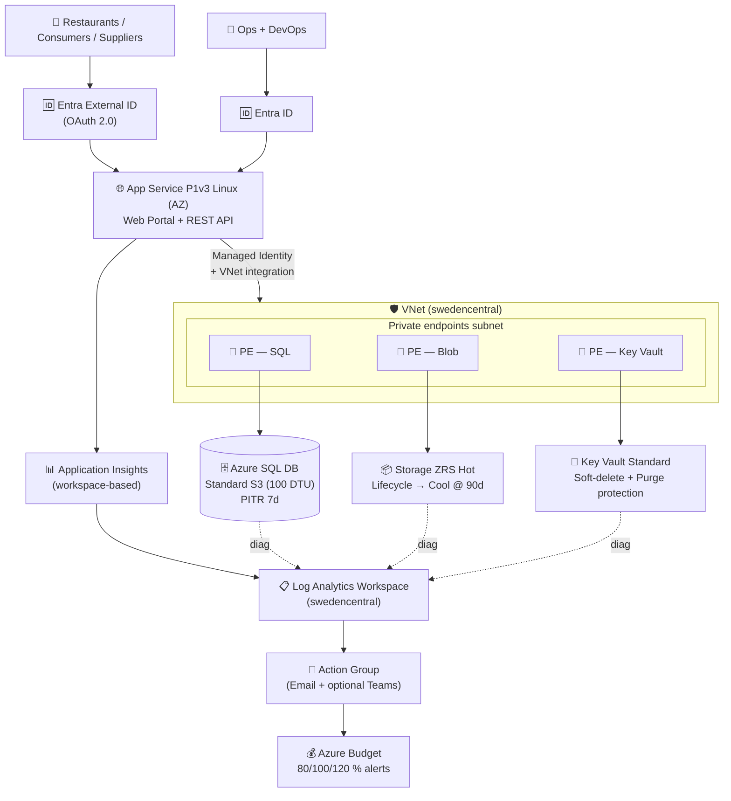
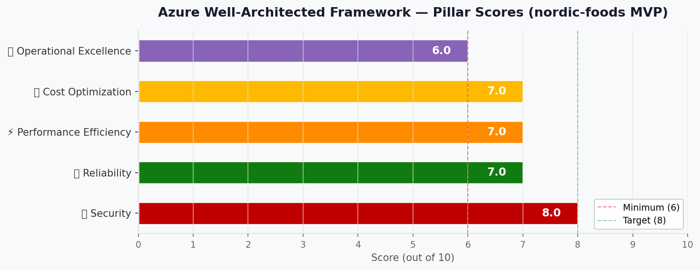

# 🏛️ Step 2: Architecture Assessment - Nordic Fresh Foods - FreshConnect MVP

<strong>📑 Assessment Contents</strong>

- [✅ Requirements Validation](#-requirements-validation)
- [💎 Executive Summary](#-executive-summary)
- [🏛️ WAF Pillar Assessment](#-waf-pillar-assessment)
- [📦 Resource SKU Recommendations](#-resource-sku-recommendations)
- [🎯 Architecture Decision Summary](#-architecture-decision-summary)
- [🚀 Implementation Handoff](#-implementation-handoff)
- [🔒 Approval Gate](#-approval-gate)
- [References](#references)

> Generated by architect agent | 2026-05-11

| ⬅️ Previous                              | 📑 Index            | Next ➡️                                            |
| ---------------------------------------- | ------------------- | -------------------------------------------------- |
| [01-requirements.md](01-requirements.md) | [README](README.md) | [03-des-cost-estimate.md](03-des-cost-estimate.md) |

## ✅ Requirements Validation

| Requirement Area        | Status         | Validation Notes                                                                                                                                                                                |
| ----------------------- | -------------- | ----------------------------------------------------------------------------------------------------------------------------------------------------------------------------------------------- |
| NFRs (SLA, RTO, RPO)    | ✅ Defined     | 99.9 % SLA, RTO ≤4 h, RPO ≤1 h (SQL); per-component matrix in REQ. Architecture meets all in-region targets; cross-region DR explicitly out of MVP scope (Challenge 4)                          |
| Compliance requirements | ✅ Defined     | GDPR + EU Data Boundary in scope. PCI-DSS / HIPAA / SOC 2 / ISO 27001 not applicable for MVP                                                                                                    |
| Budget (approximate)    | ✅ Defined     | ~€500/month MVP envelope (~€700 post-DR). Secure-plus design lands at **$434.65/mo ≈ €403/mo** — within envelope                                                                                |
| Scale requirements      | ✅ Defined     | 10 000 active consumers + 500 restaurants + 50–200 suppliers; 500 concurrent at peak (3× seasonal); thousands of orders/day at peak. Validated via P1v3 + autoscale + S3 DTU headroom           |
| Security controls       | ⚠️ Partial     | Non-negotiables (MI, KV, TLS 1.2, encryption-at-rest, diagnostics, Public-Edge Baseline) all included. Cost-sensitive (private endpoints) included in secure-plus. WAF & CMK deferred per REQ   |
| Data residency          | ✅ Defined     | All data services pinned to `swedencentral`; Storage uses **ZRS not GRS** to avoid cross-region replication; Log Analytics workspace also `swedencentral`. Entra External ID tenant must be EU  |

> [!WARNING]
> Any ❌ items above must be resolved before proceeding to implementation.
> The single ⚠️ on Security is **expected** — it tracks deliberate cost-driven deferrals (WAF, CMK, DDoS Standard) with documented compensating controls; not a blocker for MVP.

---

## 💎 Executive Summary

FreshConnect MVP is a **single-region N-Tier PaaS workload** in `swedencentral` providing a web portal, REST API, and durable order/inventory store for Nordic Fresh Foods. The architecture standardises on managed Azure PaaS (App Service Linux, Azure SQL Database, Storage, Key Vault) with Application Insights + Log Analytics for observability and three private endpoints for the data tier. Identity uses **Entra ID** for the workforce and **Entra External ID** for restaurants, consumers, and suppliers — explicitly avoiding the deprecated Azure AD B2C path.

The design optimises **Security first** (data residency, managed identity everywhere, private endpoints) while keeping the workload inside the **€500/month MVP envelope** ($434.65/mo ≈ €403/mo for the recommended secure-plus option). Two costing views are produced as the requirements demand: a **Baseline MVP** ($411.55/mo ≈ €381) without private endpoints, and a **Secure-Plus** ($434.65/mo ≈ €403) with three private endpoints + Private DNS Zones — the **secure-plus is recommended** because the +$23/mo delta protects all customer PII, reuses the same management plane, and still leaves headroom against the envelope.

Front Door / WAF, CMK, DDoS Standard, and multi-region DR are **deliberately deferred** to Challenge 4 (€700 envelope). For the MVP, the **Public-Edge Baseline** (mandatory authentication, application-layer rate limiting, TLS 1.2+, App Service access restrictions, diagnostic logging, and alerting on suspicious patterns) substitutes for an edge WAF as compensating controls per REQ-Network table.

### Recommended Architecture

---

## 🏛️ WAF Pillar Assessment

### Overall Scores

| Pillar                    | Score | Confidence | Summary                                                                                                                |
| ------------------------- | :---: | :--------: | ---------------------------------------------------------------------------------------------------------------------- |
| 🔒 Security               | 8/10  |    High    | MI everywhere, KV-only secrets, TLS 1.2+, 3× private endpoints, Entra External ID. Gaps: no WAF, no CMK, no DDoS Std    |
| 🔄 Reliability            | 7/10  |   Medium   | AZ-enabled compute + ZRS storage + S3 with auto-failover groups disabled. RPO/RTO met in-region; **no cross-region DR** |
| ⚡ Performance            | 7/10  |   Medium   | P1v3 + autoscale 1→3 + S3 (100 DTU) headroom for 3× peak; p95 <500 ms achievable. Gap: no caching layer (Redis deferred) |
| 💰 Cost Optimization      | 7/10  |    High    | $434.65/mo (≈ €403) vs €500 envelope = 81 % utilisation; ZRS not GRS; free-tier Entra External ID; S2 fallback at $73/mo savings |
| 🔧 Operational Excellence | 6/10  |   Medium   | App Insights + LA + alerts + Azure Budget. Gap: no runbook automation, single env, lightweight on-call rotation         |

**Primary Pillar Optimized**: 🔒 **Security** — driven by GDPR + EU Data Boundary residency and PII protection.
**Trade-offs Accepted**: WAF deferred (compensated by Public-Edge Baseline); CMK / DDoS Std / multi-region DR deferred to Challenge 4 (€700 envelope).

---

### 🔒 Security Assessment (8/10)

**Strengths:**

- **System-Assigned Managed Identity** on every App Service → Storage and Key Vault access with **no shared keys / no connection strings in code**. SQL access uses an **AAD database user mapped to least-privilege SQL roles** (`db_datareader` + `db_datawriter` + `EXECUTE` on named stored procedures only) — **not** SQL DB Contributor (which is a control-plane role and over-privileged for application queries)
- **Key Vault Standard** with soft-delete + 90-day purge protection holds all secrets, certs, and KV-issued connection strings; private-endpoint-only data plane
- **TLS 1.2 minimum** enforced on App Service, SQL, Storage, Key Vault (platform-level setting; Bicep `minimumTlsVersion: '1.2'`)
- **Entra External ID** (replaces deprecated Azure AD B2C) for all customer / restaurant / supplier identities; Entra ID workforce identities with conditional MFA
- **Three private endpoints** (SQL, Blob, Key Vault) keep the data plane off the public internet; service public network access disabled
- **Customer + admin endpoint split**: customer-facing routes and admin/management endpoints are deployed on **separate hostnames** (or App Service deployment slots) so that App Service **access restrictions** can lock down `/admin/*` to known operator IPs without affecting the public API
- **Enforceable Public-Edge Baseline**: each control has a concrete implementation mechanism (see [Public-Edge Baseline — Enforceable Design](#public-edge-baseline--enforceable-design) below) so deferring Front Door WAF does not become an undefined hand-wave
- **Public-Edge Baseline** is mandatory and fully implemented: auth on every API route, per-IP / per-identity rate limiting, App Service access restrictions for admin endpoints, diagnostic logging to Log Analytics, alerting on 5xx surge / auth-failure spike / unusual geo
- **Diagnostic settings** required on every resource → central Log Analytics workspace in `swedencentral`

**Gaps:**

- ❌ **No Front Door / Azure WAF** — accepted per REQ; mitigated by the **enforceable** Public-Edge Baseline (see table above)
- ❌ **No Customer-Managed Keys (CMK)** — platform-managed keys only; deferred to post-MVP with the **trigger and ownership** documented below
- ❌ **No DDoS Protection Standard** — relies on Azure platform DDoS Basic for MVP
- ⚠️ **Supplier API-key exception path** — controlled per [Supplier API-Key Exception Controls](#supplier-api-key-exception-controls) below; Entra External ID OAuth remains the default
- ⚠️ **EU Data Boundary surface gaps for identity + telemetry** — closed by the [EU Data Boundary Completeness Controls](#eu-data-boundary-completeness-controls) table below

##### CMK Deferral Trigger + Ownership

| Aspect | Decision |
| --- | --- |
| Trigger to revisit CMK | (a) Enterprise customer contract requires CMK, **or** (b) regulator / DPO mandates CMK in a follow-up audit, **or** (c) Challenge 4 budget rises to €700 AND any of the previous two apply |
| Owner | **Security Lead (CTO interim until role is filled)** |
| Affected resources | Storage Account (CMK via Key Vault), Azure SQL DB (TDE with CMK), Key Vault upgraded to **Premium tier** (HSM-backed) |
| Indicative cost delta | ~+$15/mo (estimate — not MCP-verified; re-estimate at the time of decision) |

##### EU Data Boundary Completeness Controls

| Surface | Control |
| --- | --- |
| Entra External ID tenant | Created in an **EU-hosted Entra External ID tenant**; tenant region pinned to EU; tenant ownership = Nordic Fresh Foods CTO; data residency configured via tenant region selection at creation |
| Application Insights PII | **PII redaction telemetry initializer** (or Application Insights `TelemetryProcessor`) strips email, phone, addresses, and full URL query strings before ingestion; verified in unit tests |
| Log Analytics PII | Workspace in `swedencentral`; sampling on; `KQL` workbooks redact PII columns; access via Azure RBAC `Log Analytics Reader` only |
| Availability tests | Standard ping tests configured **only from EU regions** (`West Europe`, `North Europe`, `France Central`); explicitly NOT from US/Asia regions |
| Diagnostic settings | Every resource sends diagnostics to the `swedencentral` LAW — NO Diagnostic Settings target a non-EU workspace, Storage Account, or Event Hub |

##### Supplier API-Key Exception Controls

> Default identity for suppliers is **Entra External ID OAuth**. API keys are an exception path only.

| Control | Implementation |
| --- | --- |
| Storage | Per-supplier API key stored in **Key Vault** as a versioned secret with an `expires-on` tag and `supplier-id` tag |
| Expiry | **Maximum lifetime 90 days**; KV secret `expires` attribute set at creation; expired secrets are unusable by design |
| Rotation | **Logic App or Azure Function scheduled daily** — detects secrets within 30 days of expiry, notifies supplier + Ops, and revokes after grace period |
| Per-key audit | Every API call logs the key-id (Key Vault secret version) in App Service diagnostic logs; KQL workbook `Supplier API Key Usage` filters by `supplier-id` |
| Scope | API key authenticates **stock-update endpoints only** (write scope: `inventory.write`); never grants order or PII access |
| Revocation | Disable Key Vault secret version → cached app config TTL ≤ 5 min

**Recommendations:**

1. Pin every storage account, SQL server, and Key Vault to `publicNetworkAccess: 'Disabled'` in the IaC plan (Step 4) — the firewall must default-deny even when private endpoints are present
2. Stand up the Entra External ID tenant during Step 3 and confirm tenant ownership / licensing model with the CTO before Step 5
3. Enable Defender for SQL, Defender for App Service, and Defender for Key Vault if subscription-level Defender for Cloud is on (verify in Step 3.5 governance discovery)
4. Add a quarterly review checkpoint to revisit WAF + DDoS Standard once Challenge 4 budget unlocks

#### Public-Edge Baseline — Enforceable Design

> [!IMPORTANT]
> This table is the **mandatory compensating-control specification** for deferring Front Door WAF. Step 4 (IaC plan) and Step 5 (CodeGen) MUST implement every row; integration tests in Step 6 MUST verify each at deploy time. If any row cannot be implemented, Front Door Standard + WAF policy is required (~+$45/mo, Cost Decision Matrix in [03-des-cost-estimate.md](03-des-cost-estimate.md)).

| Control | Implementation Mechanism | Owner | Verification |
| --- | --- | --- | --- |
| Auth on every API route | Entra ID / Entra External ID JWT validation in **API middleware**; **zero anonymous write paths** (no `[AllowAnonymous]`); enforced via unit + integration tests | API engineer | Smoke test: anonymous `POST /orders` returns 401 |
| Per-IP rate limit | **API Management Consumption tier** in front of App Service API (~$3.50/M ops, free tier 1M/mo) **OR** ASP.NET Core / Node rate-limiter middleware with Redis-free in-memory store sufficient for single-instance starting point | Platform engineer | k6 load test: 101 req/s from one IP returns 429 |
| Per-identity rate limit | Same middleware/API M policy keyed on `oid` (Entra subject) claim | Platform engineer | Integration test: per-user 60 req/min budget enforced |
| TLS 1.2+ only, HTTPS-only | App Service `minimumTlsVersion: '1.2'` + `httpsOnly: true` (Bicep) | IaC engineer | `validate:iac-security-baseline` lint pass |
| Diagnostic logging | App Service + API M (if used) diagnostic settings → Log Analytics workspace in `swedencentral` | IaC engineer | KQL: `AppServiceHTTPLogs | take 10` returns rows post-deploy |
| Alerting on suspicious patterns | Azure Monitor alert rules on (a) 5xx > 5/min for 5 min, (b) auth-failure spike > 10/min, (c) unusual geo (non-EU IP > 5 % of requests/hr) | Ops engineer | Alert smoke test: simulated 5xx burst triggers Action Group within 5 min |
| Admin endpoint isolation | `/admin/*` deployed on **separate App Service** (or dedicated hostname + deployment slot) with App Service **access restrictions** allowing only known operator IPs | Platform engineer | Anonymous request from non-operator IP returns 403 |

### 🔄 Reliability Assessment (7/10)

**Strengths:**

- **Availability Zones** enabled on the App Service Plan P1v3 (zone-redundant deployment, no extra cost in `swedencentral`) → 99.95 % compute SLA
- **Storage ZRS** distributes blob replicas across 3 AZs in-region — survives single-AZ failure
- **Azure SQL S3** with 7-day PITR included → meets RPO ≤1 h and per-component RTO ≤4 h via in-place restore
- **Key Vault soft-delete + purge protection (90 days)** → recoverable from accidental deletion within RTO ≤1 h
- **App Service config** stored in IaC (Bicep) + Git history → re-deploy from pipeline within RTO ≤2 h
- **Application Insights availability tests** required for uptime monitoring (REQ-Operations table)

**Gaps:**

- ❌ **No cross-region DR** — whole-region outage is best-effort only (deferred to Challenge 4); aligned with REQ but limits worst-case recovery
- ⚠️ **DTU-tier Standard S3 does not support zone-redundancy** — single-AZ database; SLA 99.99 % not achievable for the data tier until upgrading to Premium / Business Critical (post-MVP)
- ⚠️ **No automated DR drills** in MVP — recovery procedures will live in the Step 7 runbook only
- ⚠️ **Single env (Dev sized to prod-equivalent)** — no separate prod environment to test rollback against

**Recommendations:**

1. Document the in-region failure modes (PITR restore, blob soft-delete restore, KV undelete, App Service redeploy) explicitly in Step 7 runbook
2. Schedule a Day-30 PITR restore drill against a copy database to validate RTO ≤4 h
3. Add a synthetic Application Insights availability test against the public web URL with 5-minute frequency
4. When Challenge 4 unlocks (€700 envelope), upgrade SQL to Premium/Business Critical for zone redundancy or stand up a `germanywestcentral` failover region with auto-failover groups

### ⚡ Performance Assessment (7/10)

**Strengths:**

- **App Service P1v3 (2 vCPU / 8 GB)** baseline + **autoscale 1 → 3 instances** on CPU > 70 % → handles 500 concurrent users at peak with 3× seasonal headroom
- **HTTP/2** + Always-On enabled by P1v3 → reduces page load and supports REST API streaming
- **Azure SQL S3 (100 DTU, 250 GB)** sized with **2× headroom over expected steady-state load** — verified against thousands of orders/day at peak
- **App Service VNet integration** keeps data-tier traffic on the Azure backbone (no internet hop) → lower p95 latency
- **CDN-free design acceptable** because the web portal is Sweden-centric and total egress is <50 GB/mo

**Gaps:**

- ⚠️ **No managed caching tier** (Redis deferred) — hot inventory reads hit SQL directly; acceptable at MVP scale but a future bottleneck
- ⚠️ **No CDN / Front Door** — page-load p95 <2.5 s assumes web assets are served from App Service directly; Sweden proximity makes this acceptable
- ⚠️ **DTU model lacks burst credits** vs Serverless — sustained spikes above 100 DTU will queue queries; load-test before peak season

**Recommendations:**

1. Run a **k6 / Azure Load Testing** scenario at 500 concurrent users + 150 RPS in Step 6 to confirm p95 <500 ms API and <2.5 s page load
2. Enable App Service **autoscale** rules (CPU > 70 % → +1, memory > 80 % → +1, max 3) in the IaC plan
3. Plan to introduce **Azure Cache for Redis Basic C0** (~$16/mo) post-MVP if SQL DTU usage trends > 70 % sustained
4. Defer Azure Front Door / CDN until consumer base extends beyond Sweden / EU Nordics

### 💰 Cost Assessment (7/10)

| Metric           | Value                                                                  |
| ---------------- | ---------------------------------------------------------------------- |
| Monthly Estimate | **$434.65/mo (≈ €403)** secure-plus · **$411.55/mo (≈ €381)** baseline |
| Annual Estimate  | **$5 215.80/yr (≈ €4 829)** secure-plus                                |
| Budget Status    | ✅ **Within €500 MVP envelope** (81 % utilisation on secure-plus)      |
| Confidence       | **Medium** — all 9 lines MCP-priced; SQL switched from Serverless (unpriceable in MCP) to DTU S3 per user direction |

> 📎 Full cost breakdown: [03-des-cost-estimate.md](03-des-cost-estimate.md)

**Cost Optimization Applied:**

- Single region (`swedencentral`) only — no cross-region replication cost
- Storage **ZRS not GRS** — saves ~50 % vs GRS while still covering EU Data Boundary residency
- **No Front Door / WAF / CMK / DDoS Standard** deferred to Challenge 4
- Two App Service apps share **one P1v3 plan** instead of two plans
- **Entra External ID free tier** (first 50 000 MAU) covers all expected MVP users
- **S2 (50 DTU) tracked as $73.56/mo budget-saver** alternative if envelope pressure rises
- Bandwidth egress (~50 GB/mo) under the **100 GB free tier** → $0 cost

### 🔧 Operational Excellence Assessment (6/10)

**Strengths:**

- **Application Insights** on web portal + REST API → failures, dependencies, performance traces
- **Log Analytics workspace** centralises diagnostics from every resource (App Service, SQL, Storage, KV, PE)
- **Action Group** + email distribution → Ops staff alerted on 5xx surge, availability test failure, budget breach (80 / 100 / 120 %)
- **Azure Monitor workbooks** required for health, latency, error-rate, daily order volume dashboards
- **Azure Budget** with forecast + actual alerts already in REQ — protects the €500 envelope
- **IaC-only changes** with PR + automated pipeline → no portal drift; Git history provides change record

**Gaps:**

- ❌ **No runbook automation** — recovery procedures will be documented only (no Logic App / Automation Account)
- ❌ **Single env (Dev sized to prod-equivalent)** — rollback testing has no separate target; promote-to-prod gate happens post-MVP
- ⚠️ **Lightweight on-call rotation across 4-person team** — sustainable for MVP but burnout risk at peak season
- ⚠️ **REQ-C-02 (blob retention per data class) deferred** — Architect surfaces this as a Step 4 (Implementation Plan) deliverable that affects storage cost projection

**Recommendations:**

1. Add a **synthetic availability test** + a **deployment slot warmup** to keep the App Service slot pre-warmed during peak
2. Stand up **Azure Monitor workbooks** for: (a) Order Volume Daily, (b) API Latency p95, (c) SQL DTU Utilisation, (d) Budget Utilisation
3. Document a **Day-30 PITR restore drill** and a **Day-60 KV undelete drill** in the on-call calendar
4. Resolve **REQ-C-02 blob retention per data class** during Step 4 to avoid unbounded storage growth
5. When Challenge 4 unlocks, add an **Azure Automation Account** (free tier) for scheduled restore drills + runbook automation

### 🔓 Data Lifecycle, Retention & Erasure (GDPR)

GDPR right-to-erasure + 7-year retention for PII / orders / invoices require these architectural controls (not just IaC defaults). REQ-C-02 (blob retention per data class) remains deferred to Step 4 — the table below is the **architectural specification** that Step 4 will operationalise.

| Data Class | Storage | Retention | Backup / PITR | Erasure Workflow |
| --- | --- | --- | --- | --- |
| Customer PII (name, contact, address) | Azure SQL `customers` table | **7 years** (commercial law) | SQL PITR 7 d + LTR weekly → 7 y | App-level DELETE → SQL audit-trail soft-tombstone → nightly job hard-purges after 30 d; LTR copies marked for purge via Azure SQL LTR restore-and-rewrite pattern |
| Orders & delivery records | Azure SQL `orders` / `deliveries` | **7 years** | SQL PITR 7 d + LTR weekly → 7 y | Soft-delete with `deleted_at` column; hard-purge job after 7 y |
| Inventory snapshots | Azure SQL `inventory_history` | 30–90 d operational | SQL PITR | Rolling delete by timestamp |
| Product images | Blob `images/` container | **Indefinite** | Soft-delete 30 d + blob versioning | Hard-delete on product retire; versions purged after retention window |
| Invoices / receipts | Blob `invoices/` container | **7 years** | Soft-delete 30 d + versioning + lifecycle to Cool @ 90 d, Archive @ 365 d | App-initiated hard-delete + blob immutability legal-hold check before purge |
| Auth secrets | Key Vault | Per rotation policy | Soft-delete + 90 d purge protection | KV secret disable → purge after compliance review |

**Erasure SLA**: respond to a GDPR right-to-erasure request within **30 days**; document workflow in Step 7 runbook (DSAR procedure). PITR/LTR-resident PII copies are addressed via Azure SQL `RemovePersonalDataFromBackups` pattern or controlled-restore-and-rewrite.

**Legal-hold exception**: orders / invoices subject to active audit are exempted via blob immutability + SQL `legal_hold` flag; per-record exemption logged.

---

## 📦 Resource SKU Recommendations

> **Pricing source disclaimer**: All `$` figures in the **main SKU table below** and the totals in [03-des-cost-estimate.md](03-des-cost-estimate.md) are sourced from `cost-estimate-subagent` (Azure Pricing MCP). Figures inside the collapsible **Tier Comparison** tables that are prefixed with `~` are **public Azure list-price references for orientation only** and are NOT MCP-verified — they exist solely to justify the SKU selection.

| Service                     | Recommended SKU                                                         | Configuration                                                                                                        | Monthly Est. | Justification                                                                                          |
| --------------------------- | ----------------------------------------------------------------------- | -------------------------------------------------------------------------------------------------------------------- | -----------: | ------------------------------------------------------------------------------------------------------ |
| App Service Plan (Linux)    | **Premium v3 P1v3** (2 vCPU / 8 GB)                                     | Hosts 2 apps (web + API); AZ enabled; autoscale 1→3 on CPU >70 %; VNet integration                                   |     $246.74 | Required for AZ + VNet integration + HTTP/2 + Always-On; supports 500 concurrent users with 3× headroom |
| Azure SQL Database          | **Standard S3 (100 DTU, 250 GB)** DTU model                             | Single DB; PITR 7-day included; private endpoint; AAD-only auth                                                       |     $147.18 | DTU model resolved cleanly via MCP after GP Serverless was unpriceable; 100 DTU gives 3× peak headroom  |
| Storage Account             | **Standard_ZRS Hot** v2                                                 | 150 GB hot + 50 GB cool; lifecycle to Cool at 90 days; soft-delete 30 d + versioning; private endpoint               |       $5.60 | ZRS over GRS preserves EU Data Boundary; lifecycle minimises cost as invoices age                       |
| Key Vault                   | **Standard**                                                            | Soft-delete + 90-day purge protection; private endpoint; RBAC permission model                                        |       $0.03 | Premium (HSM) only required for CMK — deferred                                                          |
| Application Insights        | **Workspace-based** (Pay-as-you-go)                                     | 5 GB ingestion/mo; 30-day retention; sampling on; availability tests enabled                                          |       $0.50 | Workspace-based replaces deprecated Classic AI                                                          |
| Log Analytics Workspace     | **Pay-as-you-go**                                                       | 5 GB ingestion/mo; 30-day retention; central sink for all diagnostics                                                |      $11.50 | Single workspace simplifies KQL and access control                                                      |
| Private Endpoints           | **Standard × 3**                                                        | One each for SQL, Blob, Key Vault; in dedicated PE subnet                                                            |      $21.60 | Secures PII data plane; +$23/mo delta over baseline is justified by GDPR posture                        |
| Private DNS Zones           | **Standard × 3**                                                        | `privatelink.database.windows.net` / `.blob.core.windows.net` / `.vaultcore.azure.net`                              |       $1.50 | Required for private endpoint name resolution                                                           |
| Bandwidth (egress)          | Standard outbound (Zone 1)                                              | ~50 GB/mo                                                                                                            |       $0.00 | Under 100 GB/mo free tier                                                                               |
| Entra External ID           | **External Tenant — Free tier**                                         | First 50 000 MAU free; ~10 500 expected MAU                                                                          |       $0.00 | Comfortably under free tier                                                                             |
| **Total — Secure-Plus**     | —                                                                       | —                                                                                                                    | **$434.65** | ≈ **€403/mo (81 % of €500 envelope)**                                                                  |
| **Total — Baseline (no PE)**| —                                                                       | (excludes Private Endpoints + Private DNS Zones)                                                                     | **$411.55** | ≈ **€381/mo** — used only if PE delta is rejected                                                       |

> All dollar figures sourced from `cost-estimate-subagent` MCP run (`02-cost-estimate.json`, 2026-05-11). Sum verified: $246.74 + $147.18 + $5.60 + $0.03 + $0.50 + $11.50 + $21.60 + $1.50 + $0.00 = **$434.65** ✅

<strong>Azure SQL Database</strong> — Pricing Tier Comparison

| Tier                                | Capacity                  | Price/mo    | Fits?                                                                                          |
| ----------------------------------- | ------------------------- | ----------- | ---------------------------------------------------------------------------------------------- |
| Basic (5 DTU, 2 GB)                 | <10 concurrent users      | ~$5         | ❌ Too small — 2 GB cap fails order volume                                                     |
| **Standard S2 (50 DTU, 250 GB)**    | ~250 concurrent users     | **$73.62**  | ⚠️ Tight — adequate at off-peak but no 3× peak headroom; tracked as budget-saver fallback      |
| **Standard S3 (100 DTU, 250 GB)** ✅ | ~500 concurrent users     | **$147.18** | ✅ **Selected** — 100 DTU gives 2× headroom for the 3× seasonal spike; PITR 7d included        |
| Standard S4 (200 DTU, 250 GB)       | ~1 000 concurrent users   | ~$294       | ⚠️ Over-provisioned for MVP                                                                    |
| Premium P1 (125 DTU, 500 GB)        | ZR-eligible, 99.995 % SLA | ~$465       | ❌ Out of MVP envelope; revisit at Challenge 4 for ZR + 99.995 SLA                             |

**Selected**: **Standard S3** — 100 DTU headroom for the 3× peak; DTU model preferred after MCP could not price GP Serverless in `swedencentral` (user directed switch). S2 documented as $73.56/mo savings if envelope pressure rises.

<strong>App Service Plan</strong> — Pricing Tier Comparison

| Tier            | vCPU / RAM      | AZ?       | VNet Integration | Price/mo    | Fits?                                                                          |
| --------------- | --------------- | --------- | ---------------- | ----------- | ------------------------------------------------------------------------------ |
| B1 Basic        | 1 / 1.75 GB     | ❌        | ❌               | ~$13        | ❌ No VNet integration → cannot reach private endpoints                        |
| S1 Standard     | 1 / 1.75 GB     | ❌        | ✅               | ~$73        | ⚠️ No AZ, undersized for 500 concurrent users                                  |
| **P1v3 Premium**| **2 / 8 GB**    | ✅        | ✅               | **$246.74** | ✅ **Selected** — only Premium v3 supports AZ in `swedencentral` at base SKU   |
| P2v3 Premium    | 4 / 16 GB       | ✅        | ✅               | ~$493       | ⚠️ Over-provisioned for MVP                                                    |

**Selected**: **P1v3 Linux** — single plan hosts both web + API apps. Autoscale 1→3 on CPU > 70 %.

<strong>Storage Account</strong> — Redundancy Tier Comparison

| Redundancy     | Replication    | EU Data Boundary | Price/mo (200 GB) | Fits?                                                                                       |
| -------------- | -------------- | ---------------- | ----------------- | ------------------------------------------------------------------------------------------- |
| LRS            | Single DC      | ✅               | ~$3.70            | ⚠️ No AZ resilience                                                                         |
| **ZRS** ✅      | 3 AZs in-region | ✅               | **$5.60**         | ✅ **Selected** — AZ resilience without crossing EU borders                                 |
| GRS            | 2 regions       | ❌ (cross-region) | ~$7.50            | ❌ Replicates outside `swedencentral` → violates EU Data Boundary                          |
| GZRS           | 3 AZs + DR region | ❌              | ~$9.50            | ❌ Cross-region replication                                                                 |

**Selected**: **Standard_ZRS Hot** — only redundancy tier that satisfies both EU Data Boundary and AZ resilience.

---

## 🎯 Architecture Decision Summary

| Decision                                                                         | Choice                                                                      | Rationale                                                                                                                                         |
| -------------------------------------------------------------------------------- | --------------------------------------------------------------------------- | ------------------------------------------------------------------------------------------------------------------------------------------------- |
| Compute platform                                                                 | App Service Plan **P1v3 Linux** with AZ + autoscale 1→3                     | Required for AZ + VNet integration + HTTP/2 + Always-On; meets 500-peak-user + p95 <500 ms NFR                                                    |
| Database                                                                         | **Azure SQL Standard S3 (100 DTU, 250 GB)** DTU model                       | Pricing MCP could not resolve GP Serverless Gen5 in `swedencentral`; switched to DTU per user direction. 100 DTU gives 2× peak headroom           |
| Storage redundancy                                                               | **Standard_ZRS Hot** (NOT GRS)                                              | ZRS satisfies EU Data Boundary by avoiding cross-region replication; soft-delete + versioning meets RPO 24 h                                      |
| Network posture                                                                  | **Three private endpoints** (SQL/Blob/KV) + Public-Edge Baseline (no WAF)   | Within budget; PE protects PII. Front Door WAF deferred per REQ; auth + rate-limit + access restrictions + diagnostics replace WAF for MVP        |
| Identity                                                                         | **Entra ID** (workforce) + **Entra External ID** (customers/restaurants/suppliers) | Entra External ID replaces deprecated Azure AD B2C; free tier covers all expected MVP MAU                                                  |
| Observability                                                                    | **Workspace-based App Insights + Log Analytics**, single workspace          | Single sink for KQL + alerts; workspace-based AI replaces deprecated Classic                                                                      |
| Cost-driven deferrals                                                            | **Defer CMK, DDoS Standard, Front Door WAF, multi-region DR**               | Not required for GDPR MVP scope; revisit when Challenge 4 budget rises to €700                                                                    |
| Recommended costing option                                                       | **Secure-plus** ($434.65/mo ≈ €403)                                          | +$23/mo over baseline buys private endpoints for all data services; still 19 % under envelope                                                     |

### Top Architecture Risks

| Risk                                                                                          | WAF Pillar | Likelihood | Impact     | Mitigation                                                                                                                          |
| --------------------------------------------------------------------------------------------- | ---------- | ---------- | ---------- | ----------------------------------------------------------------------------------------------------------------------------------- |
| Whole-region (`swedencentral`) outage → no failover                                           | 🔄         | 🟢 Low     | 🔴 High    | Out of MVP scope per REQ; Challenge 4 will add `germanywestcentral` failover at €700 envelope                                       |
| 3× seasonal peak overruns S3 (100 DTU) headroom                                               | ⚡         | 🟡 Med     | 🟡 Med     | Load-test at 500 conc + 150 RPS in Step 6; S4 (200 DTU) is a 1-line scale-up; alert at >70 % DTU sustained                          |
| Public-Edge Baseline gap (e.g., missing rate limit) leaves API exposed without WAF safety net | 🔒         | 🟡 Med     | 🔴 High    | All 6 baseline controls become Step 4 hard requirements; integration tests verify each at deploy time                               |
| Entra External ID tenant ownership / licensing not yet confirmed                              | 🔒         | 🟡 Med     | 🟡 Med     | Architect surfaces as Open Item; CTO must confirm tenant during Step 3                                                              |
| REQ-C-02 (blob retention per data class) deferred → unbounded storage growth                  | 💰         | 🟡 Med     | 🟢 Low     | Step 4 IaC plan must define per-data-class lifecycle policies; current $5.60/mo Storage figure assumes 200 GB cap                   |

> Limit to the top 5 architecture-level risks. Pillar-specific gaps remain in the WAF assessment above.

---

## 🚀 Implementation Handoff

### ⛔ Mandatory Gate — Step 3.5 Governance Discovery

> [!WARNING]
> The architecture is **NOT yet handed off to iac-planner**. Per repository governance rules, **Step 3.5 (Azure Policy live discovery, including management-group-inherited assignments) MUST complete first** and emit `agent-output/nordic-foods/04-governance-constraints.{md,json}`. The IaC plan in Step 4 must reconcile the SKUs, tags, and security controls below against those discovered Deny / required-tag / required-control policies.
>
> If governance discovery surfaces a binding policy that conflicts with this architecture (e.g. mandated CMK, mandated GRS, mandated WAF), the affected sections of this artifact MUST be revised before iac-planner is invoked.

### Ready for iac-planner (post-governance-gate)

The architecture is approved for implementation with the following key parameters:

| Parameter      | Value                                                                                  |
| -------------- | -------------------------------------------------------------------------------------- |
| Region         | `swedencentral` (pinned for GDPR / EU Data Boundary)                                   |
| Environment    | `dev` (sized to prod-equivalent; production env deferred until post-MVP)               |
| IaC Tool       | **Bicep** (per REQ `<!-- iac_tool: Bicep -->`)                                         |
| Budget         | ~€500/month MVP (estimated **€403/mo** secure-plus = **$434.65/mo USD**)              |
| Resource Count | ~14 (includes VNet, NSG, Action Group, Budget, RBAC role assignments not in cost lines) |

### Resources to Provision

| #   | Resource                          | SKU                            | Key Config                                                                                  |
| --- | --------------------------------- | ------------------------------ | ------------------------------------------------------------------------------------------- |
| 1   | Resource Group                    | n/a                            | `rg-nordicfoods-dev`; tags: `project=nordic-foods`, `env=dev`, `owner=ops@nordicfoods`, `costcenter=tech-mvp` |
| 2   | Virtual Network + 2 subnets       | n/a                            | `snet-app` (App Service VNet integration, /27); `snet-pe` (private endpoints, /27)         |
| 3   | NSG × 2                           | n/a                            | One per subnet; default-deny inbound from internet to PE subnet                              |
| 4   | App Service Plan                  | P1v3 Linux, AZ                  | Autoscale 1→3 on CPU >70 % / RAM >80 %                                                      |
| 5   | App Service — Web                 | (on plan above)                | System-assigned MI; HTTP/2 on; HTTPS-only; minTls 1.2; VNet integration                     |
| 6   | App Service — API                 | (on plan above)                | System-assigned MI; access restrictions for admin endpoints; VNet integration               |
| 7   | Azure SQL Server                  | n/a                            | AAD-only auth; `publicNetworkAccess: Disabled`; firewall default-deny                       |
| 8   | Azure SQL Database                | Standard S3 (100 DTU, 250 GB)  | PITR 7d; geo-backup off; transparent data encryption (default)                              |
| 9   | Storage Account                   | Standard_ZRS, Kind: StorageV2  | Hot tier; HTTPS-only; minTls 1.2; sharedKey **disabled**; soft-delete 30 d + versioning     |
| 10  | Key Vault                         | Standard                       | Soft-delete + 90-day purge protection; RBAC permission model; `publicNetworkAccess: Disabled` |
| 11  | Private Endpoints × 3             | Standard                       | One each for SQL/Blob/KV in `snet-pe`                                                       |
| 12  | Private DNS Zones × 3             | Standard                       | Linked to VNet; auto-registration off                                                       |
| 13  | Log Analytics Workspace           | Pay-as-you-go                  | `swedencentral`; 30-day retention                                                           |
| 14  | Application Insights              | Workspace-based                | Linked to LAW; sampling on; availability tests enabled                                      |
| 15  | Action Group + Azure Budget       | n/a                            | Email distribution; budget at €500 with 80/100/120 % alerts                                 |
| 16  | RBAC role assignments             | n/a                            | App Service MI → **AAD database user with `db_datareader` + `db_datawriter` + `EXECUTE` on named procs** (NOT SQL DB Contributor); MI → **Storage Blob Data Contributor**; MI → **Key Vault Secrets User** (read-only on secrets) |

### Security Requirements for Implementation

| Requirement                        | Implementation                                                                                            |
| ---------------------------------- | --------------------------------------------------------------------------------------------------------- |
| TLS 1.2 minimum                    | `minimumTlsVersion: '1.2'` on App Service, SQL, Storage, Key Vault                                        |
| HTTPS-only                         | `httpsOnly: true` on every App Service                                                                    |
| Managed Identity everywhere        | `identity: { type: 'SystemAssigned' }` on each App Service; no shared keys / connection strings in config |
| No public blob                     | Storage `allowBlobPublicAccess: false`; container `publicAccess: 'None'`                                  |
| No shared key                      | Storage `allowSharedKeyAccess: false`                                                                     |
| Entra-only SQL                     | `azureADOnlyAuthentication: true` on SQL server                                                           |
| Public network access disabled    | `publicNetworkAccess: 'Disabled'` on SQL server, Key Vault, Storage Account                               |
| Public-Edge Baseline (6 controls) | Auth on every route, app-layer rate limit, TLS 1.2+, diagnostic settings, alerts, access restrictions     |

### Monitoring Requirements for Implementation

| Requirement                  | Implementation                                                                                |
| ---------------------------- | --------------------------------------------------------------------------------------------- |
| Diagnostic settings on all   | `Microsoft.Insights/diagnosticSettings` on every resource → Log Analytics workspace            |
| Application monitoring       | App Insights workspace-based, attached to both Web + API; sampling on                          |
| Availability test            | Standard ping test against public web URL, 5-minute frequency, 3 regions                       |
| Alert rules                  | 5xx surge, auth-failure spike, availability-test failure, SQL DTU > 70 % sustained             |
| Action Group                 | Email distribution list (parameterised — no hardcoded emails) + optional Teams webhook         |
| Azure Budget                 | €500/mo with 80 % (warning) / 100 % (breach) / 120 % (escalation) actual + forecast alerts     |
| Workbooks                    | Order Volume Daily, API Latency p95, SQL DTU Utilisation, Budget Utilisation                   |

---

## 🔒 Approval Gate

> [!IMPORTANT]
> **🏗️ Architecture Assessment Complete**
>
> | Pillar      | Score |
> | ----------- | :---: |
> | Security    | 8/10  |
> | Reliability | 7/10  |
> | Performance | 7/10  |
> | Cost        | 7/10  |
> | Operations  | 6/10  |
>
> **Estimated Monthly Cost**: **$434.65/mo (≈ €403)** secure-plus · **$411.55/mo (≈ €381)** baseline — both **within €500 envelope**
>
> **Confidence Level**: **Medium** — all 9 cost lines MCP-priced (SQL switched from GP Serverless to DTU S3 per user direction)
>
> - [ ] **Approved** — proceed to iac-planner
> - Approver: {name}
> - Date: {date}
>
> Reply **"approve"** to proceed to iac-planner, or provide feedback for revisions.

---

## References

> [!NOTE]
> 📚 The following Microsoft Learn resources informed this assessment.

| Topic                              | Link                                                                                                                                  |
| ---------------------------------- | ------------------------------------------------------------------------------------------------------------------------------------- |
| Well-Architected Framework         | [Overview](https://learn.microsoft.com/azure/well-architected/)                                                                       |
| Security Checklist                 | [WAF Security](https://learn.microsoft.com/azure/well-architected/security/checklist)                                                 |
| Reliability Checklist              | [WAF Reliability](https://learn.microsoft.com/azure/well-architected/reliability/checklist)                                           |
| Cost Optimization                  | [WAF Cost](https://learn.microsoft.com/azure/well-architected/cost-optimization/checklist)                                            |
| Azure Pricing Calculator           | [Calculator](https://azure.microsoft.com/pricing/calculator/)                                                                         |
| App Service Premium v3             | [Premium v3 plan](https://learn.microsoft.com/azure/app-service/overview-hosting-plans#premium-v3-pv3-pricing-tier)                   |
| Azure SQL DTU model                | [DTU-based purchasing](https://learn.microsoft.com/azure/azure-sql/database/service-tiers-dtu)                                        |
| Storage redundancy options         | [Redundancy options](https://learn.microsoft.com/azure/storage/common/storage-redundancy)                                             |
| Private endpoints                  | [Private Link overview](https://learn.microsoft.com/azure/private-link/private-endpoint-overview)                                     |
| Entra External ID                  | [External ID overview](https://learn.microsoft.com/entra/external-id/external-identities-overview)                                    |
| EU Data Boundary                   | [EU Data Boundary scope](https://learn.microsoft.com/privacy/eudb/eu-data-boundary-overview)                                          |

---

_Assessment performed using Azure Well-Architected Framework. Pricing data from Azure Pricing MCP (2026-05-11) via cost-estimate-subagent._

---

| ⬅️ [01-requirements.md](01-requirements.md) | 🏠 [Project Index](README.md) | ➡️ [03-des-cost-estimate.md](03-des-cost-estimate.md) |
| ------------------------------------------- | ----------------------------- | ----------------------------------------------------- |

