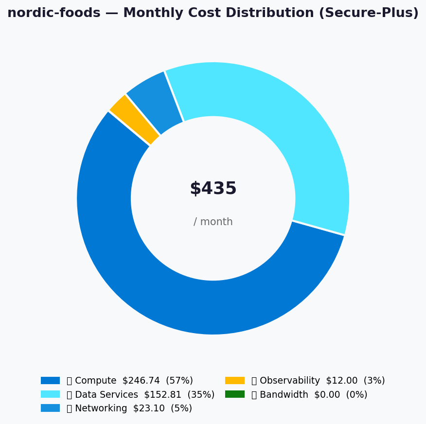
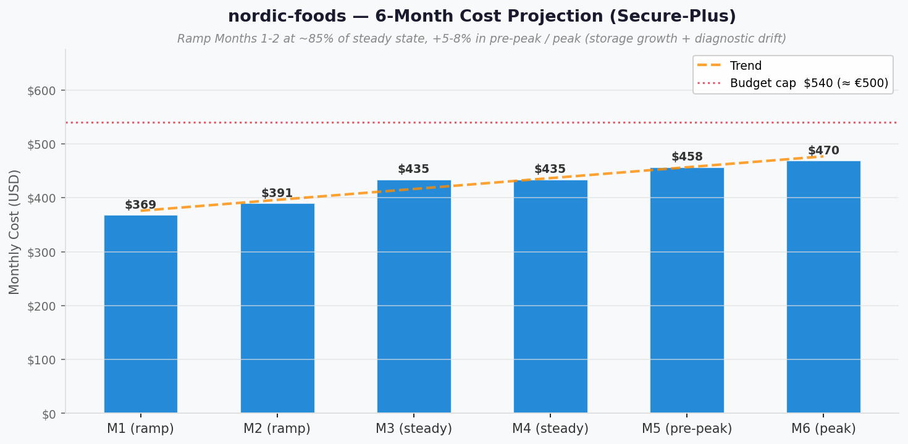

# 💰 Azure Cost Estimate: Nordic Fresh Foods - FreshConnect MVP


<details open>
<summary><strong>📑 Cost Estimate Contents</strong></summary>

- [💵 Cost At-a-Glance](#-cost-at-a-glance)
- [✅ Decision Summary](#-decision-summary)
- [🔁 Requirements → Cost Mapping](#-requirements--cost-mapping)
- [📊 Top 5 Cost Drivers](#-top-5-cost-drivers)
- [🏛️ Architecture Overview](#-architecture-overview)
- [🧾 What We Are Not Paying For (Yet)](#-what-we-are-not-paying-for-yet)
- [⚠️ Cost Risk Indicators](#-cost-risk-indicators)
- [🎯 Quick Decision Matrix](#-quick-decision-matrix)
- [💰 Savings Opportunities](#-savings-opportunities)
- [🧾 Detailed Cost Breakdown](#-detailed-cost-breakdown)
- [References](#references)

</details>

> Generated by architect agent | 2026-05-11

| ⬅️ Previous                                                    | 📑 Index            | Next ➡️                                                      |
| -------------------------------------------------------------- | ------------------- | ------------------------------------------------------------ |
| [02-architecture-assessment.md](02-architecture-assessment.md) | [README](README.md) | [04-governance-constraints.md](04-governance-constraints.md) |

**Generated**: 2026-05-11
**Region**: `swedencentral`
**Environment**: Dev (sized to production-equivalent capacity)
**MCP Tools Used**: `azure_bulk_estimate`, `azure_price_search` (via cost-estimate-subagent)
**Architecture Reference**: [02-architecture-assessment.md](02-architecture-assessment.md)
**Source JSON**: [02-cost-estimate.json](02-cost-estimate.json)

> [!IMPORTANT]
> **Pricing-source disclaimer (applies to the entire document)**: Every dollar figure in the **🧾 Detailed Cost Breakdown line items**, the **💵 Cost At-a-Glance totals**, and the **📊 Top 5 Cost Drivers** table is sourced from `cost-estimate-subagent` via the Azure Pricing MCP (see [02-cost-estimate.json](02-cost-estimate.json)). Any figure prefixed with `~` — in any section (Decision Summary, Requirements→Cost Mapping, Key Design Decisions, What We Are Not Paying For Yet, Cost Driver Details, Savings Opportunities, Quick Decision Matrix, Burst-Cost Sensitivity, Storage Growth Sensitivity) — is a **public Azure list-price reference for orientation only and is NOT MCP-verified**. The `~` prefix is the marker; do not infer precision beyond `±25 %` for any orientation figure.

## 💵 Cost At-a-Glance

> **Monthly Total: ~$434.65 (≈ €403)** | Annual: ~$5 215.80 (≈ €4 829)
>
> ```text
> Budget: €500/month MVP (soft) | Utilization: 81% (€403 of €500)
> ```
>
> | Status            | Indicator                                          |
> | ----------------- | -------------------------------------------------- |
> | Cost Trend        | ➡️ Stable (PaaS, low egress, no DR replication)    |
> | Savings Available | 💰 ~$880/yr if SQL S2 substitutes S3 (50→25 % headroom trade-off) |
> | Compliance        | ✅ GDPR + EU Data Boundary aligned (ZRS, no GRS)   |

> Currency note: Pricing MCP returns **USD**. EUR conversions in this artifact use **€1 ≈ $1.08** as a planning approximation (final invoicing varies with monthly FX). Budget envelope (€500 / €700) and currency are owned by the customer; the USD totals are MCP-verified.

## ✅ Decision Summary

- ✅ **Approved**: Secure-Plus design — App Service P1v3 + Azure SQL S3 + Storage ZRS + Key Vault + Observability + **3 Private Endpoints** + Private DNS Zones, all in `swedencentral`. Total: **$434.65/mo (€403)**.
- ⏳ **Deferred**: Front Door / Azure WAF, Customer-Managed Keys, DDoS Protection Standard, multi-region DR, Azure Cache for Redis, CDN. Revisit at Challenge 4 (€700 envelope).
- 🔁 **Redesign Trigger**: Sustained SQL DTU > 70 % → upsize S3→S4 (~+$147/mo) **or** introduce Azure Cache for Redis Basic C0 (~$16/mo). Cross-region DR requirement → adds Azure SQL failover group + secondary App Service + traffic manager.

**Confidence**: **Medium** | **Expected Variance**: **±15 %** — all 9 lines MCP-priced; SQL switched mid-run from GP Serverless (unpriceable in MCP for `swedencentral`) to DTU S3 per user direction; egress assumed ~50 GB/mo (under free tier).

## 🔁 Requirements → Cost Mapping

| Requirement                                                                  | Architecture Decision                                                         | Cost Impact                       | Mandatory  |
| ---------------------------------------------------------------------------- | ----------------------------------------------------------------------------- | --------------------------------- | ---------- |
| 99.9 % SLA + 500 concurrent users + 3× seasonal peak                         | App Service P1v3 (AZ) + autoscale 1→3 + SQL S3 (100 DTU)                      | +$393.92/mo (compute + DB)         | Yes        |
| GDPR + EU Data Boundary residency                                            | All services in `swedencentral`; Storage **ZRS** (not GRS); LAW in-region     | $0 net (ZRS only $1.90/mo cheaper than GRS at this scale) | Yes |
| Private data plane for PII                                                   | 3 × Private Endpoints + Private DNS Zones                                     | +$23.10/mo                         | Recommended |
| RPO ≤1 h on SQL                                                              | PITR 7-day included with Standard S3                                          | $0 (included)                      | Yes        |
| Centralised diagnostics & alerts                                             | Application Insights + Log Analytics + Action Group                           | +$12.00/mo                         | Yes        |
| Customer + supplier identity (replacing deprecated Azure AD B2C)             | Entra External ID free tier (50 000 MAU)                                      | $0 (under free tier at ~10 500 MAU) | Yes       |
| Front Door WAF (cost-sensitive)                                              | **Deferred** — Public-Edge Baseline used as compensating control              | $0 (vs ~+$45/mo for WAF policy)    | No         |
| Multi-region DR                                                              | **Deferred** to Challenge 4                                                   | $0 (would add ~+$200/mo)           | No         |

## 📊 Top 5 Cost Drivers

| Rank | Resource                              | Monthly Cost | % of Total | Trend | Optimization                                                   |
| ---- | ------------------------------------- | -----------: | ---------: | ----- | -------------------------------------------------------------- |
| 1️⃣   | App Service Plan P1v3 Linux (1 inst)  |     $246.74  |       57 % | ➡️    | Eligible for 1-yr / 3-yr Reserved Instance after stabilization |
| 2️⃣   | Azure SQL Database Standard S3        |     $147.18  |       34 % | ➡️    | Downshift to S2 saves $73.56/mo if peak load allows            |
| 3️⃣   | Private Endpoints × 3                 |      $21.60  |        5 % | ➡️    | None — already minimum; required for PII protection            |
| 4️⃣   | Log Analytics Workspace (5 GB)        |      $11.50  |        3 % | ↗️    | Tune sampling + filter low-value tables to keep ingestion <5 GB |
| 5️⃣   | Storage Account Standard_ZRS (200 GB) |       $5.60  |        1 % | ↗️    | Lifecycle to Cool at 90 d already on; Archive tier for invoices >1 yr |

> 💡 **Quick Win**: Negotiate the Public-Edge Baseline as the **MVP-acceptable WAF substitute** — saves ~$45/mo without reopening the WAF debate every sprint. Documented in REQ network-security table.

<details>
<summary><strong>Cost Driver Details</strong></summary>

#### 1️⃣ App Service Plan P1v3 Linux

| Aspect            | Detail                                                                                            |
| ----------------- | ------------------------------------------------------------------------------------------------- |
| Current SKU       | Premium v3 P1v3 (2 vCPU / 8 GB RAM), 1 instance, AZ enabled                                       |
| Monthly Cost      | $246.74 (730 hrs × $0.338/hr)                                                                     |
| Cost Breakdown    | Compute only; bandwidth covered separately under egress line                                      |
| Optimization      | Apply 1-year Reserved Instance after 90 days of stable utilization                                |
| Potential Savings | ~$74/mo (≈ 30 %) with 1-yr RI; ~$140/mo (≈ 57 %) with 3-yr RI                                     |

#### 2️⃣ Azure SQL Database Standard S3

| Aspect            | Detail                                                                                            |
| ----------------- | ------------------------------------------------------------------------------------------------- |
| Current SKU       | Standard S3 (100 DTU, 250 GB), DTU model, 7-day PITR included                                     |
| Monthly Cost      | $147.18 (730 hrs × $0.20/hr)                                                                      |
| Optimization      | Downshift to S2 (50 DTU) if peak load profile permits                                             |
| Potential Savings | $73.56/mo (≈ 50 %) with S2 — trade-off: only 1× peak headroom instead of 2×                       |

#### 3️⃣ Private Endpoints × 3

| Aspect            | Detail                                                                                            |
| ----------------- | ------------------------------------------------------------------------------------------------- |
| Current SKU       | Standard PE (3 endpoints — SQL, Blob, Key Vault)                                                  |
| Monthly Cost      | $21.60 ($7.20 × 3 endpoints)                                                                      |
| Optimization      | None — already minimum required to keep all PII data plane off the public internet                |
| Potential Savings | $21.60/mo if dropping to baseline-only (NOT recommended — defeats GDPR posture)                   |

</details>

## 🏛️ Architecture Overview

### Cost Distribution

| Category                     | Monthly Cost (USD) | Share  |
| ---------------------------- | -----------------: | -----: |
| 💻 Compute (App Service)     |             246.74 |   57 % |
| 💾 Data Services (SQL+Storage+KV) |        152.81 |   35 % |
| 🌐 Networking (PE + DNS)     |              23.10 |    5 % |
| 📊 Observability (AI + LAW)  |              12.00 |    3 % |
| 📤 Bandwidth                 |               0.00 |    0 % |
| **Total**                    |         **434.65** | **100 %** |



### Month-over-Month Projection



### Key Design Decisions Affecting Cost

| Decision                                                  | Cost Impact     | Business Rationale                                                                  | Status      |
| --------------------------------------------------------- | --------------- | ----------------------------------------------------------------------------------- | ----------- |
| App Service P1v3 (only Premium v3 supports AZ at base SKU) | +$174/mo vs S1 | AZ + VNet integration + HTTP/2 + Always-On for 99.9 % SLA + 500-peak users          | Required    |
| SQL DTU S3 (vs Serverless GP)                              | Variable       | Pricing MCP could not resolve GP Serverless; user directed DTU model                | Required    |
| Storage ZRS (vs GRS)                                       | −$1.90/mo      | EU Data Boundary requires no cross-region replication                               | Required    |
| 3 Private Endpoints (vs no PE baseline)                    | +$23.10/mo     | Protects PII data plane; small delta vs total envelope                              | Recommended |
| Defer Front Door WAF                                       | −~$45/mo       | Public-Edge Baseline (auth + rate-limit + access restrictions) substitutes for MVP  | Required    |
| Defer multi-region DR                                      | −~$200/mo      | Out of MVP scope per REQ; revisit at Challenge 4                                    | Required    |
| Defer CMK + DDoS Standard                                  | −~$3 000/mo    | Not required for GDPR MVP scope; DDoS Std alone is ~$2 944/mo                       | Required    |

## 🧾 What We Are Not Paying For (Yet)

- **Multi-region active/passive DR** — `germanywestcentral` failover region (~+$200/mo)
- **Azure Front Door / WAF policy** — Public-Edge Baseline substitutes (~+$45/mo when added)
- **Customer-Managed Keys (CMK)** — premium Key Vault + Azure Key Vault premium (~+$15/mo)
- **DDoS Protection Standard** — relies on platform DDoS Basic (~$2 944/mo when added)
- **Azure Cache for Redis** — DTU model handles MVP load directly; Redis Basic C0 ~$16/mo when needed
- **Azure CDN / Front Door for static assets** — Sweden-centric audience; intra-region latency acceptable
- **Premium Key Vault (HSM-backed)** — Standard tier sufficient until CMK is added
- **SQL zone-redundancy** — DTU Standard tier does not support ZR; Premium / Business Critical needed (~+$320/mo)
- **Azure Automation Account / Logic Apps** — runbooks documented manually for MVP
- **Separate production environment** — Dev sized to prod-equivalent in MVP

### Assumptions & Uncertainty

- Egress bandwidth ~50 GB/mo (under 100 GB/mo free tier)
- ~10 000 active consumers + 500 restaurants + 50–200 suppliers ≈ 10 500 MAU → comfortably under Entra External ID 50 000 free MAU tier
- 5 GB/mo Application Insights ingestion with sampling enabled
- 5 GB/mo Log Analytics ingestion across all diagnostic settings
- Storage ~200 GB total (150 GB hot + 50 GB cool); REQ-C-02 retention rules **deferred** — unbounded growth risk flagged below
- Private DNS Zone queries < 1 M/mo (negligible)
- USD → EUR conversion at €1 ≈ $1.08 (planning approximation only)

## ⚠️ Cost Risk Indicators

| Resource                          | Risk Level | Issue                                                                                          | Mitigation                                                                                |
| --------------------------------- | ---------- | ---------------------------------------------------------------------------------------------- | ----------------------------------------------------------------------------------------- |
| Azure SQL Standard S3 (100 DTU)   | 🟡 Medium  | Sustained 3× seasonal peak may saturate 100 DTU                                                 | Alert at >70 % DTU sustained → S4 upsize is 1-line change (+$147/mo)                      |
| Storage Account                   | 🟡 Medium  | **REQ-C-02 deferred** — no per-data-class lifecycle = unbounded growth across 7-yr retention   | Step 4 IaC plan must define lifecycle policies per data class (invoices, images, logs)    |
| App Service Plan P1v3             | 🟢 Low     | Locked-in compute cost regardless of utilization                                                 | Reserved Instance (1-yr / 3-yr) once usage stabilizes                                     |
| Log Analytics                     | 🟡 Medium  | Diagnostic verbosity drift may push ingestion above 5 GB/mo                                     | Daily cap at 5 GB; review top tables monthly; sample chatty resources                     |
| Entra External ID                 | 🟢 Low     | Free tier only covers first 50 000 MAU                                                          | At 12-month projection (~3× growth), still well under 50 000 MAU                          |
| FX risk (USD-priced, EUR budget)  | 🟡 Medium  | Strong USD vs EUR could push monthly EUR cost above envelope without architecture change        | CFO buys forward FX or accepts ±10 % envelope variance; revisit quarterly                 |

> **⚠️ Watch Item**: Sustained DTU > 70 % during peak season would force an S3→S4 upsize that single-handedly adds ~50 % to the SQL bill — load-test in Step 6 is the most important risk-burndown action.

### App Service Autoscale Burst-Cost Sensitivity

The MCP-priced `app_service_plan` line ($246.74/mo) reflects **1 instance × 730 hours**. The architecture requires **autoscale 1→3 instances** during the 3× seasonal peak. Burst hours are billed per-instance-hour at the same P1v3 rate ($0.338/hr).

| Scenario | Extra Instance-Hours / month | Burst Cost (orientation, `~`) | Effective Monthly Total (orientation, `~`) | Envelope Impact |
| --- | ---: | ---: | ---: | --- |
| Low season (no scale-out) | 0 | $0 | $434.65 (MCP) | 81 % of €500 |
| Shoulder season (1 extra inst × 200 hrs) | 200 | ~+$67.60 | ~$502.25 | ~93 % of €500 |
| **Peak season (2 extra inst × 200 hrs)** ✅ representative | 400 | **~+$135.20** | **~$569.85** | **~106 % of €500 — brief overrun expected** |
| Sustained peak (2 extra inst × 730 hrs) | 1 460 | ~+$493.50 | ~$928.15 | ~172 % — implies sustained 3× baseline = redesign trigger |

> The representative peak scenario (~+$135/mo for ~9 days of seasonal scale-out) takes the monthly total **slightly over €500** for those months — expected and acceptable per the REQ "soft" budget limit type. Sustained-peak overrun is a **redesign trigger** (consider Redis cache, S4 SQL, RI for App Service).

### Storage Growth Sensitivity (REQ-C-02 Deferred)

The MCP-priced storage line ($5.60/mo) assumes **200 GB total** today. REQ documents 6-month (~250 GB) and 12-month (~500 GB) projections without per-data-class retention rules yet (REQ-C-02 deferred to Step 4). Orientation projections at Standard ZRS Hot list price (~$0.022/GB/mo, not MCP-verified):

| Horizon | Blob Total | Storage Cost (orientation, `~`) | Notes |
| --- | ---: | ---: | --- |
| Today (MVP launch) | 200 GB | $5.60 (MCP) | Hot tier only, lifecycle not yet engaged |
| 6-month projection | ~250 GB | ~$6.50 | Lifecycle Hot→Cool @ 90d active; blended rate slightly lower per-GB |
| 12-month projection | ~500 GB | ~$11.50 | Material doubling — not yet a P&L threat but justifies REQ-C-02 closure |
| 7-year regulatory tail (no lifecycle) | ~5–10 TB | ~$110–$220 | Without Archive tier policy this becomes the **largest deferred cost risk** |

> Step 4 (IaC plan) MUST close REQ-C-02 by defining per-data-class lifecycle policies (Archive for invoices > 365 days, Cool for product images > 180 days, hard-delete for inventory snapshots > 90 days).

## 🎯 Quick Decision Matrix

> **Pricing source disclaimer**: Cost deltas in this matrix prefixed with `~` are **public Azure list-price references for orientation** (not MCP-verified) — per the document-level disclaimer at the top. The recommended-design totals in the [💵 Cost At-a-Glance](#-cost-at-a-glance) and [🧾 Detailed Cost Breakdown](#-detailed-cost-breakdown) sections are MCP-verified.

_"If you need X, expect to pay Y more"_

| Requirement                                       | Additional Cost | SKU Change                                          | Verdict          | Notes                                                                  |
| ------------------------------------------------- | --------------- | --------------------------------------------------- | ---------------- | ---------------------------------------------------------------------- |
| Azure Front Door + WAF policy (Front Door Std)    | +~$45/mo        | Add `Microsoft.Cdn/profiles` + WAF policy           | 🟡 Monitor       | Justified once consumer base extends beyond Sweden / EU Nordics        |
| Multi-region DR (`germanywestcentral` warm)       | +~$200/mo       | Add SQL failover group + secondary App Service      | 🟡 Monitor       | Aligns with Challenge 4 €700 envelope                                  |
| SQL Premium P1 (zone-redundant, 99.995 SLA)       | +~$318/mo       | S3 → P1                                             | 🔴 Investigate   | Out of MVP envelope; only justified if SLA tightens to 99.99 %         |
| Customer-Managed Keys (CMK)                       | +~$15/mo        | Storage CMK + KV Premium                            | 🟡 Monitor       | Not required by GDPR for MVP scope                                     |
| DDoS Protection Standard                          | +~$2 944/mo     | Add `Microsoft.Network/ddosProtectionPlans`         | 🔴 Investigate   | Cost-prohibitive for MVP; only justified if attack profile escalates   |
| Azure Cache for Redis Basic C0                    | +~$16/mo        | Add `Microsoft.Cache/Redis`                         | 🟢 Go (post-MVP) | Add when SQL DTU > 70 % sustained                                      |
| Downshift SQL S3 → S2                             | −$73.56/mo      | S3 → S2                                             | 🟡 Monitor       | Only if peak headroom can drop from 2× to 1×                           |
| Private endpoints removal (baseline-only)         | −$23.10/mo      | Remove 3 PE + DNS zones                             | 🔴 Investigate   | NOT recommended — defeats GDPR posture                                 |

## 💰 Savings Opportunities

> ### Savings: Not Quantified in This Run
>
> This estimate covers baseline consumption pricing only. Reservation and
> commitment strategies should be evaluated once production workload patterns
> and SKU selections are confirmed (per REQ: "Reserved instances acceptable" is currently **unchecked** — revisit after MVP stabilization).
>
> **Eligible strategies to evaluate**:
>
> | Strategy                | Applicability | Prerequisites                                          |
> | ----------------------- | ------------- | ------------------------------------------------------ |
> | Reserved Instances (RI) | ✅ App Service + SQL | 90 days of stable utilization data                |
> | Savings Plan (SP)       | ✅ App Service       | Committed compute spend confirmed by CFO          |
> | Spot / Low Priority     | ❌                   | PaaS-only design; no IaaS/AKS surface             |
> | Right-sizing            | ✅ SQL DTU           | Production telemetry from peak season             |
> | Dev/Test Pricing        | ⚠️ Optional          | Only if a separate Dev environment is added later |

> **Tracked alternative SKU**: SQL **Standard S2 (50 DTU)** at **$73.62/mo** = **$73.56/mo savings vs S3** if peak headroom can be reduced. Documented in `02-cost-estimate.json → alternative_skus[]`.

## 🧾 Detailed Cost Breakdown

### Assumptions

- Hours: **730 hours/month** for compute + PE
- Storage: 150 GB hot + 50 GB cool blob; ~10 000 transactions/month; lifecycle to Cool at 90 days
- Application Insights ingestion: 5 GB/month with sampling on
- Log Analytics ingestion: 5 GB/month, 30-day retention
- Network egress: ~50 GB/month outbound Zone 1 (under 100 GB/mo free tier)
- Key Vault operations: ~10 000/month
- **Private Link data processing**: assumed **< 5 TB/mo across all 3 endpoints** (MVP envelope) — the first 1 PB tier is billed at ~$0.01/GB; at ~5 TB this is ~$50 worst-case but realistic MVP volume is < 100 GB → < $1/mo (orientation, not MCP-verified). Re-check at Step 7 with actual data.
- **Private DNS Zone queries**: assumed **< 1 M queries/mo** — under the per-zone free query allowance; overage billed at ~$0.40 per 1 M queries (orientation, not MCP-verified). Diagnostic verbosity could push this higher if Always-On health checks resolve KV / Storage frequently — monitor in Step 6.
- Pricing source: Azure Pricing MCP (via `cost-estimate-subagent`), 2026-05-11 query timestamp

### Line Items

| Category                | Service                  | SKU / Meter                                     | Quantity / Units                  | Est. Monthly |
| ----------------------- | ------------------------ | ----------------------------------------------- | --------------------------------- | -----------: |
| 💻 Compute              | Azure App Service        | Premium v3 P1v3 Linux                           | 1 instance × 730 hrs              |     $246.74  |
| 💾 Data Services        | Azure SQL Database       | Standard S3 (100 DTU, 250 GB) — DTU model      | 1 DB × 730 hrs                    |     $147.18  |
| 💾 Data Services        | Azure Storage Account    | Standard ZRS Hot — General Block Blob           | 200 GB stored + 10 k transactions |       $5.60  |
| 💾 Data Services        | Azure Key Vault          | Standard                                        | ~10 000 operations                |       $0.03  |
| 📊 Observability        | Application Insights     | Workspace-based, Pay-as-you-go                  | 5 GB ingestion                    |       $0.50  |
| 📊 Observability        | Log Analytics Workspace  | Pay-as-you-go (Standard Data Analyzed)          | 5 GB ingestion                    |      $11.50  |
| 🌐 Networking           | Private Endpoints        | Standard                                        | 3 endpoints × 730 hrs             |      $21.60  |
| 🌐 Networking           | Private DNS Zones        | Standard                                        | 3 zones                           |       $1.50  |
| 📤 Bandwidth            | Outbound data transfer   | Zone 1                                          | ~50 GB (under free tier)          |       $0.00  |
| **Total — Secure-Plus** |                          |                                                 |                                   | **$434.65**  |
| **Total — Baseline (no PE)** | _excludes PE + DNS_ |                                                 |                                   | **$411.55**  |

> Sum cross-check: 246.74 + 147.18 + 5.60 + 0.03 + 0.50 + 11.50 + 21.60 + 1.50 + 0.00 = **434.65** ✅

### Notes

- All dollar figures sourced from `02-cost-estimate.json` produced by `cost-estimate-subagent` (Pricing MCP). No parametric pricing.
- Initial Pricing MCP run could not resolve Azure SQL **GP Serverless Gen5** in `swedencentral` after 9 calls; user directed switch to **DTU model (Standard S3)** which resolved on first retry.
- Reservation pricing not quantified in this run (REQ "Reserved instances acceptable" is currently unchecked); revisit at MVP stabilization.
- USD→EUR conversion at €1 ≈ $1.08 is for budget alignment only; final invoicing varies with monthly FX rates. Customer's CFO owns FX risk.
- Storage cost assumes 200 GB cap; **REQ-C-02 (blob retention per data class)** is **deferred** — Step 4 IaC plan must close this gap to keep storage cost predictable across the 7-year regulatory retention.

---

## References

| Topic                    | Link                                                                                                                   |
| ------------------------ | ---------------------------------------------------------------------------------------------------------------------- |
| Azure Pricing Calculator | [Calculator](https://azure.microsoft.com/pricing/calculator/)                                                          |
| Cost Management          | [Overview](https://learn.microsoft.com/azure/cost-management-billing/costs/overview-cost-management)                   |
| Reserved Instances       | [Reservations](https://learn.microsoft.com/azure/cost-management-billing/reservations/save-compute-costs-reservations) |
| WAF Cost Optimization    | [Checklist](https://learn.microsoft.com/azure/well-architected/cost-optimization/checklist)                            |
| App Service P-v3 pricing | [App Service pricing](https://azure.microsoft.com/pricing/details/app-service/linux/)                                  |
| Azure SQL DB pricing     | [SQL Database pricing](https://azure.microsoft.com/pricing/details/azure-sql-database/single/)                         |
| Storage redundancy       | [Storage redundancy options](https://learn.microsoft.com/azure/storage/common/storage-redundancy)                      |
| Private Link pricing     | [Private Link pricing](https://azure.microsoft.com/pricing/details/private-link/)                                      |

---

<div align="center">

| ⬅️ [02-architecture-assessment.md](02-architecture-assessment.md) | 🏠 [Project Index](README.md) | ➡️ [04-governance-constraints.md](04-governance-constraints.md) |
| ----------------------------------------------------------------- | ----------------------------- | --------------------------------------------------------------- |

</div>
