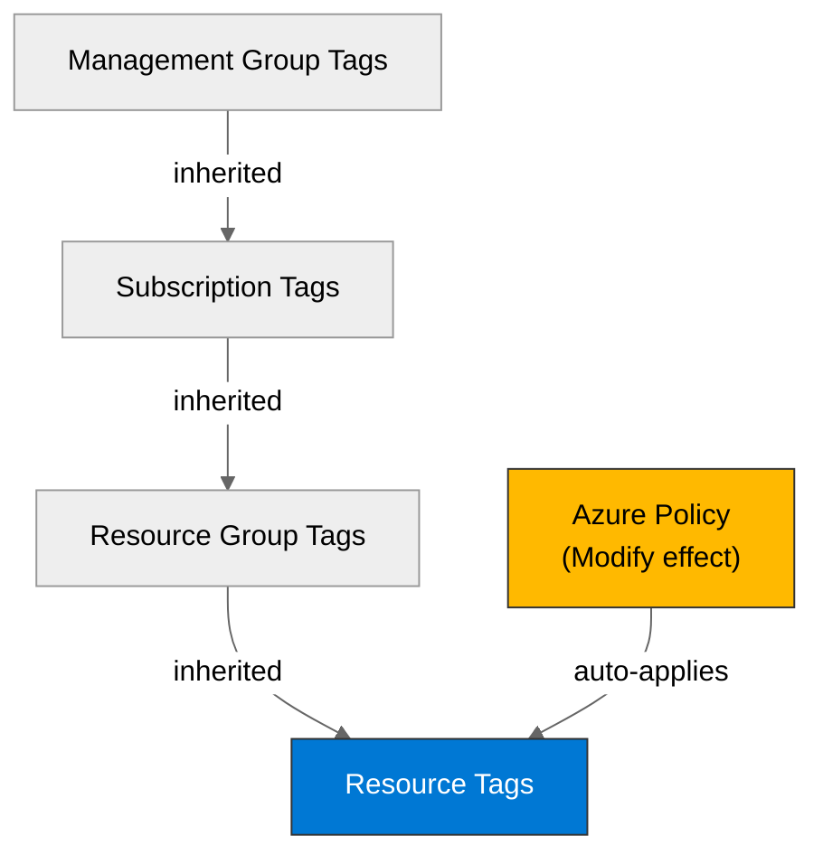

# 🛡️ Governance Constraints - nordic-foods

<strong>📑 Governance Contents</strong>

- [🔍 Discovery Source](#-discovery-source)
- [📋 Azure Policy Compliance](#-azure-policy-compliance)
- [🔄 Plan Adaptations Based on Policies](#-plan-adaptations-based-on-policies)
- [🚫 Deployment Blockers](#-deployment-blockers)
- [🏷️ Required Tags](#-required-tags)
- [🔐 Security Policies](#-security-policies)
- [💰 Cost Policies](#-cost-policies)
- [🌐 Network Policies](#-network-policies)
- [📜 Compliance Frameworks](#-compliance-frameworks)
- [References](#references)

> Generated by 04g-Governance agent | 2026-05-11T16:14:34Z

| ⬅️ Previous | 📑 Index | Next ➡️ |
| --- | --- | --- |
| [02-architecture-assessment.md](02-architecture-assessment.md) | [README](README.md) | [04-implementation-plan.md](04-implementation-plan.md) |

## 🔍 Discovery Source

| Query | Results | Timestamp |
| --- | --- | --- |
| Policy Assignments | 36 discovered / 33 kept / 3 Defender auto-filtered | 2026-05-11T16:14:34Z |
| Tag Policies | 9 required keys confirmed (lowercase, hyphenated) | 2026-05-11T16:30:00Z |
| Security Policies | 1 constraints | 2026-05-11T16:14:34Z |

**Discovery Method**: Azure Policy REST API (discover.py)
**Subscription**: 00858ffc-dded-4f0f-8bbf-e17fff0d47d9
**Scope**: Subscription + management-group inherited

> ⚠️ **8 deployment blocker(s)** detected. Review the [Deployment Blockers](#-deployment-blockers) section before proceeding to IaC planning.

### L0 Discovery Attestation

| Field | Value |
| --- | --- |
| Discovery status | COMPLETE |
| Discovered at | 2026-05-11T16:14:34Z |
| Subscription | 00858ffc-dded-4f0f-8bbf-e17fff0d47d9 |
| Management groups | 2d04cb4c-999b-4e60-a3a7-e8993edc768b, alz, alz-sandboxes |
| Page counts | policyAssignments=36, policyDefinitions=3947, policyExemptions=0 |
| Completeness signature | sha256:c1f2a6c8561869c2765567c229e78251d0094d0627004f21908ab71838a67cc9 |
| TTL | 7 days |

### Count Reconciliation

| Metric | JSON Source of Truth | Markdown Handling |
| --- | --- | --- |
| Total assignments | 36 discovered, 33 kept | Defender auto-assignments are filtered by default |
| Blocker findings | 10 blocker findings | 8 unique blocker policies after duplicate inheritance consolidation |
| Auto-remediation findings | 18 findings | Listed as subscription-governance or workload-impacting actions |
| Required tags | 9 confirmed keys (lowercase, hyphenated) | Final required keys for resource group and workload resources |
| Allowed locations | `swedencentral` confirmed | Resource group and all regional resources must match `swedencentral` |

> [!NOTE]
> The live REST discovery completed, and the three outstanding manual confirmations were resolved on
> 2026-05-11: required tag keys/casing, `swedencentral` allowed by `JV - Allowed Locations`, and
> resource group / resource same-region enforcement. The governance gate is **READY_FOR_PLANNING**.

### Policy Definition Analysis

| Policy Display Name | Assignment Scope | Effect | Classification | Category | Bicep Property Path | Required Value |
| --- | --- | --- | --- | --- | --- | --- |
| Block VM SKU Sizes | /providers/Microsoft.Management/managementGroups/2d04cb4c-999b-4e60-a3a7-e8993edc768b | deny | blocker | Compute |  |  |
| Deny AKS deployment with agent pool count greater than 10 | /providers/Microsoft.Management/managementGroups/2d04cb4c-999b-4e60-a3a7-e8993edc768b | deny | blocker | Compute | managedClusters::agentPoolProfiles[*] |  |
| Deny VMSS deployment with instance count greater than 10 | /providers/Microsoft.Management/managementGroups/2d04cb4c-999b-4e60-a3a7-e8993edc768b | deny | blocker | Compute | virtualMachineScaleSets::sku.capacity |  |
| Block Azure OpenAI Provisioned Capacity | /providers/Microsoft.Management/managementGroups/2d04cb4c-999b-4e60-a3a7-e8993edc768b | deny | blocker | Cognitive Services | accounts/deployments::sku.name |  |
| Block Azure Sentinel Commitment over 100 | /providers/Microsoft.Management/managementGroups/2d04cb4c-999b-4e60-a3a7-e8993edc768b | deny | blocker | Monitoring | workspaces::sku.capacityReservationLevel |  |
| Deny Azure Key Vault Managed HSM with Purge Protection Enabled | /providers/Microsoft.Management/managementGroups/2d04cb4c-999b-4e60-a3a7-e8993edc768b | deny | blocker | Key Vault |  |  |
| Deploy the Windows Guest Configuration extension to enable Guest Configuration assignments on Windows VMs | /providers/Microsoft.Management/managementGroups/2d04cb4c-999b-4e60-a3a7-e8993edc768b | deployIfNotExists | auto-remediate | Guest Configuration | virtualMachines::extensions/provisioningState |  |
| Add system-assigned managed identity to enable Guest Configuration assignments on virtual machines with no identities | /providers/Microsoft.Management/managementGroups/2d04cb4c-999b-4e60-a3a7-e8993edc768b | modify | auto-remediate | Managed Identity for Guest Configuration | virtualMachines::storageProfile.osDisk.osType | SystemAssigned |
| Add system-assigned managed identity to enable Guest Configuration assignments on VMs with a user-assigned identity | /providers/Microsoft.Management/managementGroups/2d04cb4c-999b-4e60-a3a7-e8993edc768b | modify | auto-remediate | Managed identity for Guest Configuration | virtualMachines::storageProfile.osDisk.osType | [concat(field('identity.type'), ',SystemAssigned')] |
| Ensure secure access to storage account containers | /providers/Microsoft.Management/managementGroups/2d04cb4c-999b-4e60-a3a7-e8993edc768b | modify | auto-remediate | Modify Allow Blob anonymous access | resourceGroups::tags | false |
| Deploy Resource Group McapsGovernance | /providers/Microsoft.Management/managementGroups/2d04cb4c-999b-4e60-a3a7-e8993edc768b | deployIfNotExists | auto-remediate | Uncategorized |  |  |
| Deploy Storage Account for Diagnostic Settings | /providers/Microsoft.Management/managementGroups/2d04cb4c-999b-4e60-a3a7-e8993edc768b | deployIfNotExists | auto-remediate | Uncategorized |  |  |
| JV - Inherit Multiple Tags from Resource Group | /providers/Microsoft.Management/managementGroups/2d04cb4c-999b-4e60-a3a7-e8993edc768b | modify | auto-remediate | Tags |  | environment |
| Block Azure RM Resource Creation | /providers/Microsoft.Management/managementGroups/2d04cb4c-999b-4e60-a3a7-e8993edc768b | deny | blocker | Uncategorized |  |  |
| JV-Enforce Resource Group Tags | /providers/Microsoft.Management/managementGroups/2d04cb4c-999b-4e60-a3a7-e8993edc768b | deny | blocker | Tags | resourceGroups::tags |  |
| Add system-assigned managed identity to enable Guest Configuration assignments on virtual machines with no identities | /providers/Microsoft.Management/managementGroups/alz | modify | auto-remediate | Guest Configuration | virtualMachines::storageProfile.osDisk.osType | SystemAssigned |
| Deploy the Linux Guest Configuration extension to enable Guest Configuration assignments on Linux VMs | /providers/Microsoft.Management/managementGroups/alz | deployIfNotExists | auto-remediate | Guest Configuration | virtualMachines::extensions/provisioningState |  |
| Deploy the Windows Guest Configuration extension to enable Guest Configuration assignments on Windows VMs | /providers/Microsoft.Management/managementGroups/alz | deployIfNotExists | auto-remediate | Guest Configuration | virtualMachines::extensions/provisioningState |  |
| Deploy Service Health Action Group | /providers/Microsoft.Management/managementGroups/alz | deployIfNotExists | auto-remediate | Monitoring |  | rg-amba-monitoring-001 |
| Deploy AMBA Notification Assets | /providers/Microsoft.Management/managementGroups/alz | deployIfNotExists | auto-remediate | Monitoring |  | rg-amba-monitoring-001 |
| Deploy AMBA Notification Suppression Asset | /providers/Microsoft.Management/managementGroups/alz | deployIfNotExists | auto-remediate | Monitoring |  | rg-amba-monitoring-001 |
| Deploy export to Log Analytics workspace for Microsoft Defender for Cloud data | /providers/Microsoft.Management/managementGroups/alz | deployIfNotExists | auto-remediate | Security Center |  | vella.jonathan@outlook.com |
| Configure Azure Defender to be enabled on SQL servers | /providers/Microsoft.Management/managementGroups/alz | deployIfNotExists | auto-remediate | SQL |  |  |
| Inherit a tag from the resource group | /providers/Microsoft.Management/managementGroups/alz | modify | auto-remediate | Tags |  | [resourceGroup().tags[parameters('tagName')]] |

## 📋 Azure Policy Compliance

| Category | Constraint | Implementation | Status |
| --- | --- | --- | --- |
| Cognitive Services | Block Azure OpenAI Provisioned Capacity | No Azure OpenAI provisioned deployment is planned; avoid provisioned capacity SKUs if AI is added later. | ❌ |
| Compute | Block VM SKU Sizes | No VMs are planned; keep the PaaS-first design and avoid adding VM-based components without SKU validation. | ❌ |
| Compute | Deny AKS deployment with agent pool count greater than 10 | No AKS cluster is planned; any future AKS design must keep each pool at 10 nodes or fewer. | ❌ |
| Compute | Deny VMSS deployment with instance count greater than 10 | No VMSS is planned; any future scale set must cap capacity at 10 instances or fewer. | ❌ |
| Guest Configuration | Deploy the Windows Guest Configuration extension to enable Guest Configuration assignments on Windows VMs | Not applicable to the current PaaS design; would auto-deploy only if Windows VMs are introduced. | ✅ |
| Guest Configuration | Add system-assigned managed identity to enable Guest Configuration assignments on virtual machines with no identities | Not applicable to PaaS resources; no VM identity mutation expected. | ✅ |
| Guest Configuration | Deploy the Linux Guest Configuration extension to enable Guest Configuration assignments on Linux VMs | Not applicable to the current PaaS design; would auto-deploy only if Linux VMs are introduced. | ✅ |
| Guest Configuration | Deploy the Windows Guest Configuration extension to enable Guest Configuration assignments on Windows VMs | Duplicate inherited policy; no action for current PaaS design. | ✅ |
| Key Vault | Deny Azure Key Vault Managed HSM with Purge Protection Enabled | Use standard Key Vault, not Managed HSM; current architecture already avoids this resource type. | ❌ |
| Managed Identity for Guest Configuration | Add system-assigned managed identity to enable Guest Configuration assignments on virtual machines with no identities | Not applicable to PaaS resources; no VM identity mutation expected. | ✅ |
| Managed identity for Guest Configuration | Add system-assigned managed identity to enable Guest Configuration assignments on VMs with a user-assigned identity | Not applicable to PaaS resources; no VM identity mutation expected. | ✅ |
| Modify Allow Blob anonymous access | Ensure secure access to storage account containers | Aligns with the storage security baseline; set blob public access disabled in IaC. | ✅ |
| Monitoring | Block Azure Sentinel Commitment over 100 | Log Analytics is planned without Sentinel commitment tiers; keep capacity reservation unset or at/below 100. | ❌ |
| Monitoring | Deploy Service Health Action Group | Subscription-level monitoring asset may be auto-created by policy; include as governance-managed, not workload-owned. | ✅ |
| Monitoring | Deploy AMBA Notification Assets | Subscription-level AMBA assets may be auto-created by policy; include as governance-managed, not workload-owned. | ✅ |
| Monitoring | Deploy AMBA Notification Suppression Asset | Subscription-level AMBA suppression asset may be auto-created by policy; include as governance-managed, not workload-owned. | ✅ |
| SQL | Configure Azure Defender to be enabled on SQL servers | SQL Defender can be auto-enabled; include the monitoring/security cost expectation in Step 4. | ✅ |
| Security Center | Deploy export to Log Analytics workspace for Microsoft Defender for Cloud data | Defender export may be configured at subscription scope; do not duplicate it in workload IaC unless required. | ✅ |
| Tags | JV - Inherit Multiple Tags from Resource Group | Resource tags may inherit from the resource group; still emit all known required tags explicitly in IaC. | ✅ |
| Tags | JV-Enforce Resource Group Tags | Resource group creation is blocked unless required tags are supplied; Step 4 must define the full RG tag set. | ❌ |
| Tags | Inherit a tag from the resource group | Resource-level tag inheritance expected; keep resource group tags complete and consistent. | ✅ |
| Uncategorized | Deploy Resource Group McapsGovernance | Governance resource group may be auto-created by policy; do not model it as part of the workload. | ✅ |
| Uncategorized | Deploy Storage Account for Diagnostic Settings | Governance diagnostics storage may be auto-created by policy; do not duplicate it in workload IaC. | ✅ |
| Uncategorized | Block Azure RM Resource Creation | Blocks classic Azure resource types only; keep all resources on ARM/PaaS resource providers. | ❌ |

## 🔄 Plan Adaptations Based on Policies

### Architectural Changes

| Original Design | Blocking Policy | Effect | Target Resource Types | Adaptation Applied |
| --- | --- | --- | --- | --- |
| PaaS-first design with no VMs | Block VM SKU Sizes | deny |  | No adaptation needed for current App Service/SQL/Storage/Key Vault design; avoid adding VM resources without SKU validation. |
| No Kubernetes runtime | Deny AKS deployment with agent pool count greater than 10 | deny | Microsoft.ContainerService/managedClusters | No adaptation needed; do not introduce AKS for MVP. |
| No scale sets | Deny VMSS deployment with instance count greater than 10 | deny | Microsoft.Compute/virtualMachineScaleSets | No adaptation needed; do not introduce VMSS for MVP. |
| No Azure OpenAI provisioned deployments | Block Azure OpenAI Provisioned Capacity | deny | Microsoft.CognitiveServices/accounts/deployments | No adaptation needed; any future AI feature must avoid provisioned capacity. |
| Log Analytics without Sentinel commitment | Block Azure Sentinel Commitment over 100 | deny | Microsoft.OperationalInsights/workspaces | Keep the workload Log Analytics workspace pay-as-you-go or at a commitment level of 100 or below. |
| Standard Key Vault planned | Deny Azure Key Vault Managed HSM with Purge Protection Enabled | deny | Microsoft.KeyVault/managedHSMs | Use standard Key Vault with purge protection; do not deploy Managed HSM. |
| ARM/PaaS resources only | Block Azure RM Resource Creation | deny | Microsoft.ClassicNetwork/reservedIps, Microsoft.MarketplaceApps/classicDevServices, Microsoft.ClassicNetwork/virtualNetworks, Microsoft.ClassicCompute/domainNames, Microsoft.ClassicStorage/storageAccounts, Microsoft.ClassicCompute/virtualMachines, Microsoft.ClassicNetwork/networkSecurityGroups | No adaptation needed; avoid all classic resource providers. |
| Resource group created by IaC | JV-Enforce Resource Group Tags | deny | Microsoft.Resources/subscriptions/resourceGroups | Step 4 must emit complete resource group tags before any child resources deploy. |

### Auto-Applied Resources

| Policy | Effect | Auto-Applied Resource |
| --- | --- | --- |
| Deploy the Windows Guest Configuration extension to enable Guest Configuration assignments on Windows VMs | DeployIfNotExists | Windows VM Guest Configuration extension if Windows VMs are ever deployed; none expected for MVP. |
| Deploy Resource Group McapsGovernance | DeployIfNotExists | Governance-owned resource group for MCAPSGov assets at subscription scope. |
| Deploy Storage Account for Diagnostic Settings | DeployIfNotExists | Governance-owned diagnostics storage account at subscription scope. |
| Deploy the Linux Guest Configuration extension to enable Guest Configuration assignments on Linux VMs | DeployIfNotExists | Linux VM Guest Configuration extension if Linux VMs are ever deployed; none expected for MVP. |
| Deploy the Windows Guest Configuration extension to enable Guest Configuration assignments on Windows VMs | DeployIfNotExists | Duplicate inherited Windows VM Guest Configuration extension policy; none expected for MVP. |
| Deploy Service Health Action Group | DeployIfNotExists | Subscription-level Service Health action group. |
| Deploy AMBA Notification Assets | DeployIfNotExists | Subscription-level AMBA notification resources. |
| Deploy AMBA Notification Suppression Asset | DeployIfNotExists | Subscription-level AMBA suppression resource. |
| Deploy export to Log Analytics workspace for Microsoft Defender for Cloud data | DeployIfNotExists | Defender for Cloud export configuration to Log Analytics. |
| Configure Azure Defender to be enabled on SQL servers | DeployIfNotExists | Defender for SQL configuration on Azure SQL servers. |

### Auto-Modified Configurations

| Policy | Effect | Auto-Applied Change |
| --- | --- | --- |
| Add system-assigned managed identity to enable Guest Configuration assignments on virtual machines with no identities | Modify | Adds system-assigned managed identity to VMs without identities; no current MVP impact. |
| Add system-assigned managed identity to enable Guest Configuration assignments on VMs with a user-assigned identity | Modify | Adds system-assigned managed identity to VMs with user-assigned identity; no current MVP impact. |
| Ensure secure access to storage account containers | Modify | Enforces non-public blob container access; mirror this directly in storage account IaC. |
| JV - Inherit Multiple Tags from Resource Group | Modify | Inherits multiple tags from the resource group; resource group tag completeness remains mandatory. |
| Add system-assigned managed identity to enable Guest Configuration assignments on virtual machines with no identities | Modify | Duplicate inherited VM identity modification policy; no current MVP impact. |
| Inherit a tag from the resource group | Modify | Inherits individual resource tags from the resource group; keep RG tags authoritative. |

## 🚫 Deployment Blockers

> **8** blocker finding(s) from **8** unique policies (duplicates from multi-scope inheritance are consolidated below).

### Block VM SKU Sizes

- **Policy ID**: `/providers/Microsoft.Management/managementGroups/2d04cb4c-999b-4e60-a3a7-e8993edc768b/providers/Microsoft.Authorization/policyDefinitions/VirtualMachine_SKU_Deny`
- **Effect**: deny
- **Scope**: /providers/Microsoft.Management/managementGroups/2d04cb4c-999b-4e60-a3a7-e8993edc768b
- **Category**: Compute
- **Bicep Property Path**: ``
- **Required Value**: N/A — parameter values not available in cached baseline; run `--refresh` for live lookup

**Resolution**: Not applicable to the current PaaS MVP. Do not add VM resources unless the SKU allow/deny parameters
are checked during Step 4 planning.

### Deny AKS deployment with agent pool count greater than 10

- **Policy ID**: `/providers/Microsoft.Management/managementGroups/2d04cb4c-999b-4e60-a3a7-e8993edc768b/providers/Microsoft.Authorization/policyDefinitions/AKS_LimitNodeCount_Deny`
- **Effect**: deny
- **Scope**: /providers/Microsoft.Management/managementGroups/2d04cb4c-999b-4e60-a3a7-e8993edc768b
- **Category**: Compute
- **Bicep Property Path**: `managedClusters::agentPoolProfiles[*]`
- **Required Value**: N/A — parameter values not available in cached baseline; run `--refresh` for live lookup

**Resolution**: No AKS deployment is planned. If AKS is introduced later, cap each agent pool at 10 nodes or request
an exemption before implementation.

### Deny VMSS deployment with instance count greater than 10

- **Policy ID**: `/providers/Microsoft.Management/managementGroups/2d04cb4c-999b-4e60-a3a7-e8993edc768b/providers/Microsoft.Authorization/policyDefinitions/VMSS_LimitNodesCount_Deny`
- **Effect**: deny
- **Scope**: /providers/Microsoft.Management/managementGroups/2d04cb4c-999b-4e60-a3a7-e8993edc768b
- **Category**: Compute
- **Bicep Property Path**: `virtualMachineScaleSets::sku.capacity`
- **Required Value**: N/A — parameter values not available in cached baseline; run `--refresh` for live lookup

**Resolution**: No VMSS deployment is planned. If VMSS is introduced later, cap instance capacity at 10 or fewer.

### Block Azure OpenAI Provisioned Capacity

- **Policy ID**: `/providers/Microsoft.Management/managementGroups/2d04cb4c-999b-4e60-a3a7-e8993edc768b/providers/Microsoft.Authorization/policyDefinitions/AzureOpenAI_ProvisionedCapacity_Deny`
- **Effect**: deny
- **Scope**: /providers/Microsoft.Management/managementGroups/2d04cb4c-999b-4e60-a3a7-e8993edc768b
- **Category**: Cognitive Services
- **Bicep Property Path**: `accounts/deployments::sku.name`
- **Required Value**: N/A — parameter values not available in cached baseline; run `--refresh` for live lookup

**Resolution**: No Azure OpenAI deployment is planned. If AI features are added later, use non-provisioned capacity
or obtain an exemption.

### Block Azure Sentinel Commitment over 100

- **Policy ID**: `/providers/Microsoft.Management/managementGroups/2d04cb4c-999b-4e60-a3a7-e8993edc768b/providers/Microsoft.Authorization/policyDefinitions/Sentinel_Commitment_Deny`
- **Effect**: deny
- **Scope**: /providers/Microsoft.Management/managementGroups/2d04cb4c-999b-4e60-a3a7-e8993edc768b
- **Category**: Monitoring
- **Bicep Property Path**: `workspaces::sku.capacityReservationLevel`
- **Required Value**: N/A — parameter values not available in cached baseline; run `--refresh` for live lookup

**Resolution**: Keep the workload Log Analytics workspace out of Sentinel commitment tiers above 100. The MVP design
uses Log Analytics for diagnostics, not Sentinel reserved capacity.

### Deny Azure Key Vault Managed HSM with Purge Protection Enabled

- **Policy ID**: `/providers/Microsoft.Management/managementGroups/2d04cb4c-999b-4e60-a3a7-e8993edc768b/providers/Microsoft.Authorization/policyDefinitions/KeyVaultManagedHSM_PurgeProtectionEnabled_Deny`
- **Effect**: deny
- **Scope**: /providers/Microsoft.Management/managementGroups/2d04cb4c-999b-4e60-a3a7-e8993edc768b
- **Category**: Key Vault
- **Bicep Property Path**: ``
- **Required Value**: N/A — parameter values not available in cached baseline; run `--refresh` for live lookup

**Resolution**: Use standard Azure Key Vault with purge protection. Do not deploy `Microsoft.KeyVault/managedHSMs`.

### Block Azure RM Resource Creation

- **Policy ID**: `/providers/Microsoft.Management/managementGroups/2d04cb4c-999b-4e60-a3a7-e8993edc768b/providers/Microsoft.Authorization/policyDefinitions/f0b6d104-1292-4b81-a05d-c2d8db5a651d`
- **Effect**: deny
- **Scope**: /providers/Microsoft.Management/managementGroups/2d04cb4c-999b-4e60-a3a7-e8993edc768b
- **Category**: Uncategorized
- **Bicep Property Path**: ``
- **Required Value**: N/A — parameter values not available in cached baseline; run `--refresh` for live lookup

**Resolution**: Use only ARM-based PaaS resources. The current architecture already avoids classic resource types.

### JV-Enforce Resource Group Tags

- **Policy ID**: `/providers/Microsoft.Management/managementGroups/2d04cb4c-999b-4e60-a3a7-e8993edc768b/providers/Microsoft.Authorization/policyDefinitions/27833bcf-5909-4a37-891c-16a3cb06856d`
- **Effect**: deny
- **Scope**: /providers/Microsoft.Management/managementGroups/2d04cb4c-999b-4e60-a3a7-e8993edc768b
- **Category**: Tags
- **Bicep Property Path**: `resourceGroups::tags`
- **Required Value**: N/A — parameter values not available in cached baseline; run `--refresh` for live lookup

**Resolution**: Step 4 must provide the full required resource group tag set. Because tag names are partly unresolved
from the policy parameters, confirm required RG tags before code generation.

## 🏷️ Required Tags

All resources must include the following tags:

> **Resolution Status**: CONFIRMED (2026-05-11). The 9 lowercase, hyphenated tag keys below are the canonical
> required set for the resource group and every taggable workload resource. Do not emit PascalCase or alternate
> casing variants for the same semantic key.

**Casing guidance**: Use the discovered lowercase tag keys exactly. Do not mix lowercase governance tags with
PascalCase defaults for the same semantic tag.

| Tag Name | Source Policy |
| --- | --- |
| `environment` | JV - Inherit Multiple Tags from Resource Group |
| `owner` | JV - Inherit Multiple Tags from Resource Group |
| `costcenter` | JV - Inherit Multiple Tags from Resource Group |
| `application` | JV - Inherit Multiple Tags from Resource Group |
| `workload` | JV - Inherit Multiple Tags from Resource Group |
| `sla` | JV - Inherit Multiple Tags from Resource Group |
| `backup-policy` | JV - Inherit Multiple Tags from Resource Group |
| `maint-window` | JV - Inherit Multiple Tags from Resource Group |
| `tech-contact` | JV - Inherit Multiple Tags from Resource Group |

**Planner action**: Emit all 9 required tag keys on the resource group; propagate to every taggable workload
resource. Do not invent additional tag keys or alternate casing.

**Planner action**: Block Step 4 until the canonical tag list is confirmed, then emit every required key on the
resource group and all taggable workload resources.

**Update 2026-05-11**: Canonical tag list confirmed (9 lowercase keys above). Step 4 may proceed without manual
re-confirmation.

## 🔐 Security Policies

| Policy | Effect | Status |
| --- | --- | --- |
| Deny Azure Key Vault Managed HSM with Purge Protection Enabled | deny | ❌ |

## 💰 Cost Policies

| Policy | Effect | Constraint |
| --- | --- | --- |
| Block VM SKU Sizes | deny | See policy parameters |
| Deny AKS deployment with agent pool count greater than 10 | deny | Agent pools must remain at 10 nodes or fewer if AKS is ever added |
| Deny VMSS deployment with instance count greater than 10 | deny | VMSS capacity must remain at 10 instances or fewer if VMSS is ever added |
| Block Azure OpenAI Provisioned Capacity | deny | Avoid provisioned Azure OpenAI capacity SKUs |
| Block Azure Sentinel Commitment over 100 | deny | Keep Sentinel/Log Analytics commitment capacity unset or at 100 or below |

### Auto-Remediation Ownership and Cost Notes

| Policy | Owner | Planner Action |
| --- | --- | --- |
| Deploy Resource Group McapsGovernance | Subscription governance | Do not duplicate in workload IaC |
| Deploy Storage Account for Diagnostic Settings | Subscription governance | Do not duplicate in workload IaC |
| Deploy Service Health Action Group | Subscription governance | Keep workload alerts separate from Service Health alerts |
| Deploy AMBA Notification Assets | Subscription governance | Do not assume AMBA replaces workload-specific alerts |
| Configure Azure Defender to be enabled on SQL servers | Shared security | Carry Defender for SQL behavior and any cost impact into Step 4 notes |

## 🌐 Network Policies

No network-specific Deny findings were classified. Two location-related assignments were present in inventory
and have been resolved with the project owner on 2026-05-11:

| Assignment | Status | Planner Action |
| --- | --- | --- |
| JV - Allowed Locations | Confirmed — `swedencentral` allowed | Deploy all regional resources to `swedencentral` |
| Resource Group and Resource locations should match | Confirmed — must match | Set the resource group location to `swedencentral`; every regional resource must use the same location |

**Architecture intent**: Nordic Foods is pinned to `swedencentral`. The allowed-locations gate is policy-validated
for this subscription.

## 📜 Compliance Frameworks

> These audit/compliance assignments are active at subscription or management-group scope.
> While they do not block deployments (audit effect), they may impose architecture constraints
> (data residency, encryption, access logging, network segmentation).

| Assignment | Scope | Type |
| --- | --- | --- |
| Microsoft Azure Multi Factor Authentication Enforcement for Resource Delete Actions | /providers/Microsoft.Management/managementGroups/2d04cb4c-999b-4e60-a3a7-e8993edc768b | management-group |
| Azure Security Baseline | /providers/Microsoft.Management/managementGroups/2d04cb4c-999b-4e60-a3a7-e8993edc768b | management-group |
| Microsoft Azure Multi Factor Authentication Enforcement for Resource Write Actions | /providers/Microsoft.Management/managementGroups/2d04cb4c-999b-4e60-a3a7-e8993edc768b | management-group |
| Enforce Azure Compute Security Baseline compliance auditing | /providers/Microsoft.Management/managementGroups/alz | management-group |
| Microsoft Cloud Security Benchmark | /providers/Microsoft.Management/managementGroups/alz | management-group |
| EU General Data Protection Regulation (GDPR) 2016/679 | /subscriptions/00858ffc-dded-4f0f-8bbf-e17fff0d47d9 | subscription |
| PCI DSS v4 | /subscriptions/00858ffc-dded-4f0f-8bbf-e17fff0d47d9 | subscription |

### Audit Initiative Mapping

| Planned Surface | Active Audit Signal | Nordic Foods Control |
| --- | --- | --- |
| App Service | Microsoft Cloud Security Benchmark / Azure Security Baseline | HTTPS-only, TLS 1.2+, managed identity, diagnostics |
| Azure SQL | Defender for SQL / security benchmark | Entra-auth design, private endpoint, diagnostics, Defender expectation |
| Storage | Security benchmark / blob anonymous access modify | Disable blob public access, HTTPS-only, private endpoint, lifecycle controls |
| Key Vault | Security benchmark | Standard Key Vault, purge protection, private endpoint, RBAC/managed identity |
| Log Analytics | Monitoring and Sentinel guardrails | Pay-as-you-go workspace in `swedencentral`; no Sentinel commitment >100 |
| Compliance | GDPR assigned; PCI DSS v4 assigned | GDPR is business-applicable; PCI controls may still emit audit signals even if MVP payment scope excludes PCI |

## References

| Topic | Link |
| --- | --- |
| Azure Policy | [Overview](https://learn.microsoft.com/azure/governance/policy/overview) |
| Tag Governance | [Tagging Strategy](https://learn.microsoft.com/azure/cloud-adoption-framework/ready/azure-best-practices/resource-tagging) |

---

_Governance constraints discovered from Azure Policy REST API via discover.py._

