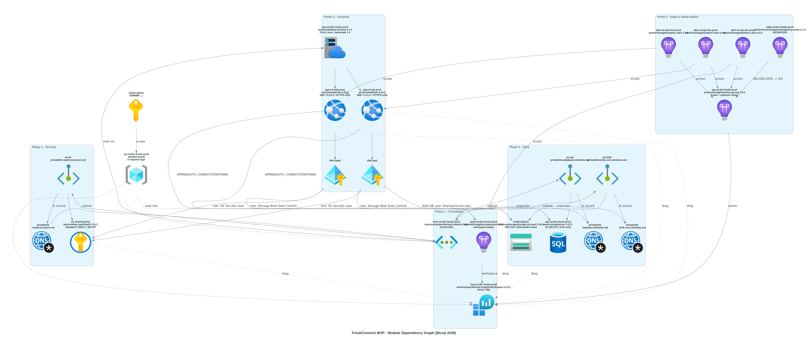
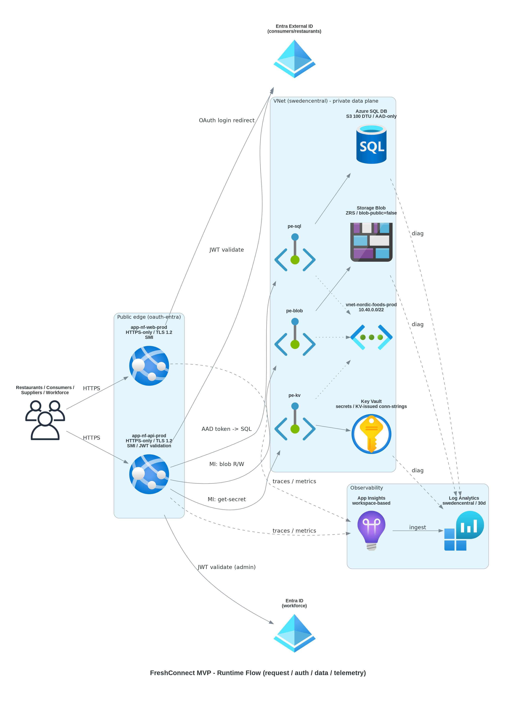

# 📀 Step 4: Implementation Plan - Nordic Fresh Foods - FreshConnect MVP


<details open>
<summary><strong>📑 Implementation Contents</strong></summary>

- [📋 Overview](#-overview)
- [📦 Resource Inventory](#-resource-inventory)
- [🛡️ Governance Compliance Matrix](#-governance-compliance-matrix)
- [🗂️ Module Structure](#-module-structure)
- [🔨 Implementation Tasks](#-implementation-tasks)
- [📤 Code-Generation Contract](#-code-generation-contract)
- [🚀 Deployment Phases](#-deployment-phases)
- [🔗 Dependency Graph](#-dependency-graph)
- [🔄 Runtime Flow Diagram](#-runtime-flow-diagram)
- [🏷️ Naming Conventions](#-naming-conventions)
- [🔐 Security Configuration](#-security-configuration)
- [⏱️ Estimated Implementation Time](#-estimated-implementation-time)
- [🔒 Approval Gate](#-approval-gate)
- [References](#references)

</details>

> Generated by IaC Planner agent | 2026-05-11

| ⬅️ Previous                                                  | 📑 Index            | Next ➡️                                        |
| ------------------------------------------------------------ | ------------------- | ---------------------------------------------- |
| [04-governance-constraints.md](04-governance-constraints.md) | [README](README.md) | [04-preflight-check.md](04-preflight-check.md) |

## 📋 Overview

This plan operationalises the FreshConnect MVP architecture (Step 2) into Azure Verified Module (AVM) Bicep blueprints for a **single-region phased deployment** to `swedencentral` (subscription `00858ffc-dded-4f0f-8bbf-e17fff0d47d9`). All 13 planned Azure resources are covered by AVM modules — **zero raw Bicep** is required. The Step 3.5 governance gate is `READY_FOR_PLANNING` with 2 of 10 Deny policies applicable to this architecture (`JV-Enforce Resource Group Tags` and `Block Azure RM` classic resources). All others (VM SKU denies, AKS, VMSS, OpenAI provisioned, Managed HSM, Sentinel reservation) are **not_applicable_current_architecture**.

**Design decisions (Phase 3.5)**: Phased / Standard grouping · Identity = System-Assigned Managed Identity per App Service · Public-edge auth = OAuth via Entra ID + Entra External ID · Deployment script image = `mcr.microsoft.com/azure-cli:2.65.0` (used only for SQL AAD admin + DB user bootstrap) · AZ posture = `single-zone-mvp` (cost-conscious; ZRS storage retained per arch; App Service Plan `zoneRedundant: false`).

Operating envelope: ~€500/mo MVP budget, GDPR + EU Data Boundary in scope, ≤4 h RTO / ≤1 h RPO, no cross-region DR. The Public-Edge Baseline (auth on every route, per-IP rate limit, App Service access restrictions for `/admin/*`, diagnostic logging, alerting) substitutes for an edge WAF.

---

## 📦 Resource Inventory

| #  | Resource                          | Type                                                | SKU / Config                                     | AVM Module                                       | Version  | Status  |
| -- | --------------------------------- | --------------------------------------------------- | ------------------------------------------------ | ------------------------------------------------ | -------- | ------- |
| 1  | Resource Group                    | `Microsoft.Resources/resourceGroups`                | `swedencentral` + 9 lowercase tags               | _Subscription-scope deployment (no AVM module)_  | n/a      | ⬜ Todo |
| 2  | Virtual Network                   | `Microsoft.Network/virtualNetworks`                 | 10.40.0.0/22 · 3 subnets (snet-pe, snet-int, snet-mgmt) | `avm/res/network/virtual-network`         | 0.9.0    | ⬜ Todo |
| 3  | Log Analytics Workspace           | `Microsoft.OperationalInsights/workspaces`          | PAYG · 30 d retention · 5 GB/mo · no Sentinel reservation | `avm/res/operational-insights/workspace` | 0.15.1   | ⬜ Todo |
| 4  | Key Vault                         | `Microsoft.KeyVault/vaults`                         | Standard · RBAC · SD + 90 d PP · `publicNetworkAccess: Disabled` | `avm/res/key-vault/vault`         | 0.13.3   | ⬜ Todo |
| 5  | Private DNS Zone (KV)             | `Microsoft.Network/privateDnsZones`                 | `privatelink.vaultcore.azure.net` + vnet-link    | `avm/res/network/private-dns-zone`               | 0.8.1    | ⬜ Todo |
| 6  | Private Endpoint (KV)             | `Microsoft.Network/privateEndpoints`                | Target = KV vault · subnet = snet-pe             | `avm/res/network/private-endpoint`               | 0.12.0   | ⬜ Todo |
| 7  | SQL Logical Server + DB           | `Microsoft.Sql/servers` + `…/databases`             | DTU S3 100 DTU 250 GB · AAD-only · PITR 7 d · `publicNetworkAccess: Disabled` | `avm/res/sql/server`           | 0.21.2   | ⬜ Todo |
| 8  | Private DNS Zone (SQL)            | `Microsoft.Network/privateDnsZones`                 | `privatelink.database.windows.net` + vnet-link   | `avm/res/network/private-dns-zone`               | 0.8.1    | ⬜ Todo |
| 9  | Private Endpoint (SQL)            | `Microsoft.Network/privateEndpoints`                | Target = SQL server · subnet = snet-pe           | `avm/res/network/private-endpoint`               | 0.12.0   | ⬜ Todo |
| 10 | Storage Account                   | `Microsoft.Storage/storageAccounts`                 | ZRS Hot v2 · `allowBlobPublicAccess: false` · `publicNetworkAccess: Disabled` · lifecycle Cool@90d · soft-delete 30 d | `avm/res/storage/storage-account` | 0.32.0 | ⬜ Todo |
| 11 | Private DNS Zone (Blob)           | `Microsoft.Network/privateDnsZones`                 | `privatelink.blob.core.windows.net` + vnet-link  | `avm/res/network/private-dns-zone`               | 0.8.1    | ⬜ Todo |
| 12 | Private Endpoint (Blob)           | `Microsoft.Network/privateEndpoints`                | Target = Storage · subnet = snet-pe              | `avm/res/network/private-endpoint`               | 0.12.0   | ⬜ Todo |
| 13 | App Service Plan                  | `Microsoft.Web/serverfarms`                         | P1v3 Linux · `zoneRedundant: false` · autoscale 1→3 on CPU>70% | `avm/res/web/serverfarm`           | 0.7.0    | ⬜ Todo |
| 14 | App Service — Web                 | `Microsoft.Web/sites`                               | Linux container · SMI · TLS 1.2+ · HTTPS-only · VNet-int (snet-int) · OAuth (Entra External ID) | `avm/res/web/site` | 0.22.0   | ⬜ Todo |
| 15 | App Service — API                 | `Microsoft.Web/sites`                               | Linux container · SMI · TLS 1.2+ · HTTPS-only · VNet-int (snet-int) · JWT validation | `avm/res/web/site`           | 0.22.0   | ⬜ Todo |
| 16 | Application Insights              | `Microsoft.Insights/components`                     | Workspace-based · 5 GB/mo · sampling on · availability tests | `avm/res/insights/component`         | 0.7.1    | ⬜ Todo |
| 17 | Action Group                      | `Microsoft.Insights/actionGroups`                   | Email + optional Teams webhook                   | `avm/res/insights/action-group`                  | 0.8.0    | ⬜ Todo |
| 18 | Budget                            | `Microsoft.Consumption/budgets`                     | $540/mo (≈ €500) · forecast 80/100/120% · anomaly detection | `avm/res/consumption/budget/rg-scope` | 0.1.0    | ⬜ Todo |
| 19 | SQL AAD admin + DB user (script)  | `Microsoft.Resources/deploymentScripts`             | Image: `mcr.microsoft.com/azure-cli:2.65.0` · UAMI: `id-nf-sql-bootstrap-prod` · runs after SQL deploy | _AVM `avm/utl/types/avm-common-types`; raw `Microsoft.Resources/deploymentScripts` resource_ | latest | ⬜ Todo |

> **AVM coverage**: 18 of 19 entities use AVM resource modules. The SQL AAD admin / DB user bootstrap (`Microsoft.Resources/deploymentScripts`) and the Resource Group itself are deployed as raw resources because no AVM resource module exists for them; this is the standard AVM-first pattern.

---

## 🛡️ Governance Compliance Matrix

> [!IMPORTANT]
> L1 attestation in the four-layer governance stack. Every Deny policy from `04-governance-constraints.json` MUST appear as at least one row here. Generated mechanically from `planner_constraints[]` + `security_property_hints[]` + planned resources.

| Resource (planned)                         | Policy (assignment / display name)                 | Effect | Satisfied By Property (Bicep path)                                                                  | Required Value                                  | Status        |
| ------------------------------------------ | -------------------------------------------------- | ------ | --------------------------------------------------------------------------------------------------- | ----------------------------------------------- | ------------- |
| `rg-nordic-foods-prod`                     | JV-Enforce Resource Group Tags                     | Deny   | `resourceGroups::tags`                                                                              | All 9 keys present (environment, owner, costcenter, application, workload, sla, backup-policy, maint-window, tech-contact) | ✅ satisfied |
| _all resources (negative coverage)_        | Block Azure RM Resource Creation (classic)         | Deny   | `Microsoft.{provider}/...` (never a `Microsoft.Classic*` type)                                      | No classic compute/network/storage in plan      | ✅ satisfied  |
| _no VMs in plan_                           | Block VM SKU Sizes (3 assignments)                 | Deny   | `Microsoft.Compute/virtualMachines::properties.hardwareProfile.vmSize` (negative coverage)          | No `virtualMachines` resource declared          | ✅ satisfied (not_applicable) |
| _no AKS in plan_                           | Deny AKS deployment with agent pool count > 10     | Deny   | `managedClusters::agentPoolProfiles[*].count` (negative coverage)                                   | No `Microsoft.ContainerService/managedClusters` | ✅ satisfied (not_applicable) |
| _no VMSS in plan_                          | Deny VMSS deployment with instance count > 10      | Deny   | `virtualMachineScaleSets::sku.capacity` (negative coverage)                                         | No `Microsoft.Compute/virtualMachineScaleSets`  | ✅ satisfied (not_applicable) |
| _no OpenAI in plan_                        | Block Azure OpenAI Provisioned Capacity            | Deny   | `accounts/deployments::sku.name` (negative coverage)                                                | No `Microsoft.CognitiveServices/...` deployments | ✅ satisfied (not_applicable) |
| `log-nordic-foods-prod` (LAW)              | Block Azure Sentinel Commitment over 100           | Deny   | `workspaces::sku.capacityReservationLevel`                                                          | Unset OR ≤ 100 (plan: unset; PAYG)              | ✅ satisfied  |
| _no Managed HSM in plan_                   | Deny Azure Key Vault Managed HSM w/ Purge Protect  | Deny   | `Microsoft.KeyVault/managedHSMs` (negative coverage; Standard KV used)                              | No `managedHSMs` resource declared              | ✅ satisfied (not_applicable) |
| `stnfprod{sfx}` (Storage)                  | Ensure secure access to storage account containers _(Modify; security hint)_ | Modify | `storageAccounts::properties.allowBlobPublicAccess`                                                 | `false`                                         | ✅ satisfied  |

**Coverage check**: All 10 Deny policies addressed (2 actively satisfied, 1 conditional satisfied via no reservation, 7 satisfied by negative coverage — no matching resource type in plan). Phase 4.3 challenger pass 1 verifies coverage.

**Status legend**: ✅ satisfied · ⚠️ pending · ❌ unsatisfiable (would trigger `▶ Refresh Governance` handoff per [governance-drift-routing.md](../../.github/skills/iac-common/references/governance-drift-routing.md))

**Auto-remediation ownership (not duplicated in workload IaC)**: `Deploy Resource Group McapsGovernance`, `Deploy Storage Account for Diagnostic Settings`, `Deploy Service Health Action Group`, `Deploy AMBA Notification Assets` — all owned by `subscription-governance`. Workload-specific Action Group (#17) is **separate** per `auto_remediation_ownership[]` guidance. Defender for SQL is owned by `shared-security`; cost impact assumed already in subscription budget.

---

## 🗂️ Module Structure

```text
infra/bicep/nordic-foods/
├── main.bicep                  # subscription-scope: RG + RG-scope module
├── main.bicepparam             # prod parameters
├── azure.yaml                  # azd manifest (primary deployment method)
└── modules/
    ├── foundation.bicep        # VNet + LAW + App Insights      (Phase 1)
    ├── security.bicep          # KV + KV PE + KV DNS zone      (Phase 2)
    ├── data.bicep              # SQL svr+db, Storage, PEs/DNS  (Phase 3)
    ├── compute.bicep           # ASP + 2 App Services + SMIs + RBAC     (Phase 4 head)
    ├── sql-bootstrap.bicep     # deploymentScript (db user, db_owner)   (Phase 4 tail; after compute)
    └── observability.bicep     # Action Group + Budget + metric alerts  (Phase 5)
```

| Module                | AVM Source / Type                              | Version | Purpose                                                  |
| --------------------- | ---------------------------------------------- | ------- | -------------------------------------------------------- |
| `foundation.bicep`    | `br/public:avm/res/network/virtual-network` + `br/public:avm/res/operational-insights/workspace` + `br/public:avm/res/insights/component` | 0.9.0 / 0.15.1 / 0.7.1 | Phase 1 — Network + central diagnostics sink + telemetry sink (App Insights moved here so its connection string is available to Phase-4 web/api app settings without a Phase-4↔Phase-5 cycle) |
| `security.bicep`      | `br/public:avm/res/key-vault/vault` + `br/public:avm/res/network/private-dns-zone` + `br/public:avm/res/network/private-endpoint` | 0.13.3 / 0.8.1 / 0.12.0 | Phase 2 — Secret store with private data plane |
| `data.bicep`          | `br/public:avm/res/sql/server` + `br/public:avm/res/storage/storage-account` + 2× private-dns-zone + 2× private-endpoint | 0.21.2 / 0.32.0 / 0.8.1 / 0.12.0 | Phase 3 — Data tier behind private endpoints (SQL Entra admin = bootstrap UAMI) |
| `compute.bicep`       | `br/public:avm/res/web/serverfarm` + `br/public:avm/res/web/site` ×2 | 0.7.0 / 0.22.0 | Phase 4 head — ASP + web + api (both with App Service Auth) + SMIs + RBAC role assignments |
| `sql-bootstrap.bicep` | Raw `Microsoft.Resources/deploymentScripts` + UAMI (no AVM module) | n/a | Phase 4 tail (depends on compute) — create DB user for API SMI; add project admin group as `db_owner` |
| `observability.bicep` | `br/public:avm/res/insights/action-group` + `br/public:avm/res/consumption/budget/rg-scope` + `br/public:avm/res/insights/metric-alert` | 0.8.0 / 0.1.0 / 0.5.0 | Phase 5 — Action Group, budget + alerts, metric alerts (App Insights itself is in Phase 1) |

---

## 🔨 Implementation Tasks

### Task 1: `main.bicep` (Subscription-scope Orchestration)

**Target scope**: `subscription`

**Parameters**:

- `project` (string) — default `nordic-foods`
- `env` (string) — default `prod`
- `location` (string) — default `swedencentral` · `@allowed(['swedencentral'])` from governance
- `phase` (int) — default `99` · `@allowed([1, 2, 3, 4, 5, 99])` · `99` = deploy all phases
- `rgTags` (object) — required, must match 9 lowercase keys (see Naming Conventions)
- `sqlAadAdminGroupObjectId` (string) — Entra group object ID for the **project SQL admin group** (humans / operators); granted `db_owner` only via the Phase-4-tail bootstrap T-SQL step. **Not** passed to `Microsoft.Sql/servers.administrators` (the server-level Entra admin is the bootstrap UAMI).
- `sqlAadAdminGroupName` (string) — display name of the project SQL admin group (consumed only by the bootstrap script's `CREATE USER ... FROM EXTERNAL PROVIDER` statement)
- `actionGroupEmail` (string) — Ops distribution email
- `monthlyBudgetUsd` (int) — default `540` (≈ €500)

**Variables**:

- `uniqueSuffix` = `take(uniqueString(subscription().id, resourceGroupName), 6)` — generated ONCE here, passed to all modules
- `resourceGroupName` = `'rg-${project}-${env}'`

**Resources**:

- `Microsoft.Resources/resourceGroups@2024-03-01` (with full `rgTags`) — Phase 1
- Module call: `workload.bicep` (RG-scope wrapper that chains foundation → security → data → sql-bootstrap → compute → observability with phase gating)

> The 6-module split lives inside a single RG-scope wrapper (`workload.bicep`) so phase gating uses a single boolean conditional per module rather than module-level subscription-deployments.

### Task 2: `modules/foundation.bicep` (Phase 1)

**AVM modules**:

- `br/public:avm/res/network/virtual-network:0.9.0` — `vnet-${project}-${env}` · CIDR `10.40.0.0/22` · 3 subnets:
  - `snet-pe` `10.40.0.0/26` · `privateEndpointNetworkPolicies: Disabled`
  - `snet-int` `10.40.0.64/26` · App Service VNet-integration delegation `Microsoft.Web/serverFarms`
  - `snet-mgmt` `10.40.0.128/26` · reserved (deploymentScripts)
- `br/public:avm/res/operational-insights/workspace:0.15.1` — `log-${project}-${env}` · `PerGB2018` · `retentionInDays: 30` · **no** `capacityReservationLevel` (Sentinel Deny safety)
- `br/public:avm/res/insights/component:0.7.1` — `appi-${project}-${env}` · `workspaceResourceId: <law output above>` · `applicationType: 'web'` · `samplingPercentage: 100` (refine in load tests) · diagnostic settings → LAW. **Phase placement rationale**: App Insights is co-located with LAW in Phase 1 because the web + api Code-Generation Contract requires `APPINSIGHTS_CONNECTIONSTRING` as an app setting at Phase-4 compute deploy time. Keeping it in Phase 5 would create a Phase-4↔Phase-5 cycle (must_fix from pass 2). Action Group, Budget, and metric alerts remain in Phase 5 since they consume Phase-4 resource IDs (App Service IDs for 5xx alerts, SQL Database ID for DTU alert).

**Outputs**: `vnetResourceId`, `subnetIdPe`, `subnetIdInt`, `subnetIdMgmt`, `lawResourceId`, `appInsightsResourceId`, `appInsightsConnectionString`, `appInsightsInstrumentationKey`.

### Task 3: `modules/security.bicep` (Phase 2)

**AVM modules**:

- `br/public:avm/res/key-vault/vault:0.13.3` — `kv-nf-${env}-${uniqueSuffix}` · `Standard` · `enableRbacAuthorization: true` · `enableSoftDelete: true` · `softDeleteRetentionInDays: 90` · `enablePurgeProtection: true` · `publicNetworkAccess: 'Disabled'` · `networkAcls: { defaultAction: 'Deny' }` · diagnostic settings → LAW
- `br/public:avm/res/network/private-dns-zone:0.8.1` — `privatelink.vaultcore.azure.net` + virtualNetworkLinks[vnetResourceId]
- `br/public:avm/res/network/private-endpoint:0.12.0` — target = KV (`groupIds: ['vault']`), subnet = `snet-pe`, private DNS zone group wired to the zone above

**Outputs**: `kvResourceId`, `kvName`, `kvUri`.

### Task 4: `modules/data.bicep` (Phase 3)

**AVM / raw resources**:

- `Microsoft.ManagedIdentity/userAssignedIdentities@2023-01-31` — `id-nf-sql-bootstrap-${env}` (declared FIRST in this module so its `principalId` can be referenced by the SQL server's `administrators.sid`). Phase-3 placement is intentional; the deployment script that USES this UAMI still lives in Phase 4 (`sql-bootstrap.bicep`).
- `br/public:avm/res/sql/server:0.21.2` —
  - Server: `sql-${project}-${env}` · `administrators.administratorType: 'ActiveDirectory'` · `administrators.azureADOnlyAuthentication: true` · `administrators.principalType: 'Application'` · `administrators.login = id-nf-sql-bootstrap-${env}` (UAMI display name) · `administrators.sid = <bootstrap UAMI principalId>` · `publicNetworkAccess: 'Disabled'` · `minimalTlsVersion: '1.2'` · `version: '12.0'` · diagnostic settings → LAW. **The bootstrap UAMI is the sole server-level Entra admin** so the deployment script (which authenticates as this UAMI) has data-plane DDL rights. The project SQL admin group is granted `db_owner` later by the bootstrap script, NOT here at the server level.
  - Database (sub-module): `sqldb-freshconnect` · `sku: { name: 'S3', tier: 'Standard', capacity: 100 }` · `maxSizeBytes: 268435456000` (250 GB) · `zoneRedundant: false` (per `az_posture=single-zone-mvp`; S3 DTU does not support ZR anyway)
- `br/public:avm/res/storage/storage-account:0.32.0` —
  - `stnf${env}${uniqueSuffix}` (24-char max; `stnfprod{6}` = 12 chars) · `kind: 'StorageV2'` · `sku.name: 'Standard_ZRS'` · `accessTier: 'Hot'` · `allowBlobPublicAccess: false` · `allowSharedKeyAccess: false` · `publicNetworkAccess: 'Disabled'` · `minimumTlsVersion: 'TLS1_2'` · `networkAcls.defaultAction: 'Deny'` · blob soft-delete 30 d · versioning enabled · lifecycle: cool@90d · containers: `images`, `invoices` · diagnostic settings → LAW
- `br/public:avm/res/network/private-dns-zone:0.8.1` × 2 — `privatelink.database.windows.net`, `privatelink.blob.core.windows.net` (each linked to vnet)
- `br/public:avm/res/network/private-endpoint:0.12.0` × 2 —
  - SQL PE: `groupIds: ['sqlServer']` · subnet = `snet-pe` · DNS zone group → SQL zone
  - Blob PE: `groupIds: ['blob']` · subnet = `snet-pe` · DNS zone group → Blob zone

**Outputs**: `sqlServerResourceId`, `sqlServerFqdn`, `sqlDatabaseName`, `storageResourceId`, `storageBlobEndpoint`.

### Task 5: `modules/sql-bootstrap.bicep` (Phase 4 tail — runs AFTER `compute.bicep`)

> [!IMPORTANT]
> **Phase placement (canonical)**: this module is gated by `phase == 99 || phase >= 4` AND wires `dependsOn: [api App Service]` so it physically deploys after the API SMI exists. Every reference in this plan (Module Structure, Task 5 heading, Deployment Phases, dependency diagram) is normalised to **Phase 4 tail**.

**Resources** (the UAMI itself is declared in `data.bicep` so it can be the SQL server's Entra admin; the deployment script + its role assignment live here in Phase 4):

- _(declared in `data.bicep` Phase 3)_ `Microsoft.ManagedIdentity/userAssignedIdentities@2023-01-31` — `id-nf-sql-bootstrap-${env}` · used as SQL server Entra admin (data-plane DDL rights) AND as the deployment-script execution identity.
- Role assignment (Phase 4 head — co-located with compute role assignments): UAMI → `Microsoft.Sql/servers` scope · role = `SQL Server Contributor` (`6d8ee4ec-f05a-4a1d-8b00-a9b17e38b437`) — required for `az sql server` management-plane operations and idempotent re-runs.
- `Microsoft.Resources/deploymentScripts@2023-08-01` — `script-nf-sql-bootstrap-${env}` · `kind: 'AzureCLI'` · `azCliVersion: '2.65.0'` (the Azure CLI runtime version pinned per `script_runtime_image` decision — see _Note on image pinning_ below) · `identity.type: 'UserAssigned'` + `userAssignedIdentities: { '<id-nf-sql-bootstrap-prod>': {} }` · `retentionInterval: 'PT1H'` · `cleanupPreference: 'OnSuccess'` · `timeout: 'PT15M'` · `containerSettings.subnetIds: [snet-mgmt]` (private path to SQL PE).
- **Script (data-plane DDL)** — idempotent T-SQL via `sqlcmd -G` authenticating as the UAMI (which is the server Entra admin):
  1. `CREATE USER [<api-app-name>] FROM EXTERNAL PROVIDER` + `ALTER ROLE [db_datareader] ADD MEMBER [<api-app-name>]` + `ALTER ROLE [db_datawriter] ADD MEMBER [<api-app-name>]` + grant `EXECUTE` on named stored procedures.
  2. `CREATE USER [<sqlAadAdminGroupName>] FROM EXTERNAL PROVIDER` + `ALTER ROLE [db_owner] ADD MEMBER [<sqlAadAdminGroupName>]` (project admin group → operators).
- `dependsOn`: SQL server + SQL DB + Web App Service + **API App Service** (SMI must exist so the principal name is resolvable for `CREATE USER ... FROM EXTERNAL PROVIDER`).

> _Note on image pinning_: `Microsoft.Resources/deploymentScripts` does not accept a free-form container image / digest — the resource exposes `azCliVersion` (for `kind: AzureCLI`) and Azure pins the corresponding `mcr.microsoft.com/azure-cli` image for that version internally. **The pinning invariant for this project is `azCliVersion: '2.65.0'`**, not a sha256 digest. The Phase 2.5 `deployment_script` consistency rule is satisfied by this version pin + UAMI + `containerSettings.subnetIds`.

### Task 6: `modules/compute.bicep` (Phase 4)

**AVM modules**:

- `br/public:avm/res/web/serverfarm:0.7.0` — `asp-${project}-${env}` · `skuName: 'P1v3'` · `kind: 'linux'` · `reserved: true` · `zoneRedundant: false` · autoscale (1→3 on CPU>70%, +1 on Memory>80%, max 3)
- `br/public:avm/res/web/site:0.22.0` × 2 —
  - `app-nf-web-${env}` · `kind: 'app,linux'` · `linuxFxVersion` (set in `06b-Bicep` based on app runtime) · `managedIdentities: { systemAssigned: true }` · `httpsOnly: true` · `siteConfig.minTlsVersion: '1.2'` · `siteConfig.http20Enabled: true` · `siteConfig.alwaysOn: true` · `siteConfig.ftpsState: 'Disabled'` · `virtualNetworkSubnetId: snet-int` · `vnetRouteAllEnabled: true` · diagnostic settings → LAW · App Service Auth (Entra External ID OAuth provider)
  - `app-nf-api-${env}` · same as web INCLUDING App Service Auth (Entra ID + Entra External ID identity providers) with `authSettingV2.globalValidation.unauthenticatedClientAction: 'Return401'` and `authSettingV2.globalValidation.requireAuthentication: true` — this is the **infrastructure-enforced** auth control. Application-layer JWT validation (per arch assessment) is retained for fine-grained route claims/scopes and serves as a defense-in-depth layer, NOT as the only line of defense. Diagnostic settings → LAW.
- Role assignments (system-assigned MIs are created on first deploy of the app; role assignments are wired in the SAME module so they share Phase 4):
  - Web SMI → KV `Key Vault Secrets User` (`4633458b-17de-408a-b874-0445c86b69e6`) at KV scope
  - API SMI → KV `Key Vault Secrets User` at KV scope
  - Web SMI → Storage `Storage Blob Data Contributor` (`ba92f5b4-2d11-453d-a403-e96b0029c9fe`) at storage scope
  - API SMI → Storage `Storage Blob Data Contributor` at storage scope
  - _SQL access_ uses AAD database user (created by `sql-bootstrap.bicep`) — **no Azure RBAC role assignment** on SQL data plane

**Outputs**: `aspResourceId`, `webAppName`, `apiAppName`, `apiPrincipalId`.

> **Phase 2.5 `rbac_phase_ordering` auto-fix**: All role assignments above target principals created in Phase 4 → role assignments are in Phase 4 (monotonic). Recorded.

### Task 7: `modules/observability.bicep` (Phase 5)

**AVM modules** (App Insights is in `foundation.bicep` — see Task 2):

- `br/public:avm/res/insights/action-group:0.8.0` — `ag-${project}-${env}` · short-name `agNFprod` · `emailReceivers: [{ name: 'Ops', emailAddress: actionGroupEmail, useCommonAlertSchema: true }]`
- `br/public:avm/res/consumption/budget/rg-scope:0.1.0` — `bdg-${project}-${env}` · `amount: 540` · `category: 'Cost'` · `timeGrain: 'Monthly'` · notifications: `Forecasted/80`, `Forecasted/100`, `Actual/120` — all routed to Action Group ID
- Metric alerts (`br/public:avm/res/insights/metric-alert:0.5.0`) — SLO-aligned set (per Stage-2 user decision to expand coverage):
  - `alert-nf-web-5xx-${env}` — web App Service · `Http5xx` > 5 / 5m · sev 2
  - `alert-nf-api-5xx-${env}` — api App Service · `Http5xx` > 5 / 5m · sev 2
  - `alert-nf-sql-dtu-${env}` — SQL DB · `dtu_consumption_percent` > 80% / 15m · sev 3
  - `alert-nf-availability-${env}` — paired with 2 Standard webtests (`wt-nf-web-prod`, `wt-nf-api-prod`) on `/health`, 3 EMEA locations, 5min cadence · sev 1
  - `alert-nf-web-p95-latency-${env}` — web · `HttpResponseTime` > 2.5s / 15m · sev 2
  - `alert-nf-api-p95-latency-${env}` — api · `HttpResponseTime` > 0.5s / 15m · sev 2
  - `alert-nf-dependency-failures-${env}` — App Insights · `dependencies/failed` count > 10 / 15m · sev 2 (covers SQL/Storage/KV)
  - `alert-nf-auth-failures-${env}` — LAW log alert · `AppServiceAuthenticationLogs` failure count > 50 / 15m · sev 2
  - `alert-nf-error-rate-${env}` — App Insights · `requests/failed` count > 5 / 15m · sev 2

> **Anomaly detection**: enabled implicitly via Cost Management anomaly alerts on the subscription; surfaced as a follow-up admin task in Step 7 as it is not a bicep-managed resource.

### Task 8: `azure.yaml` (azd manifest)

- `name: nordic-foods`
- `metadata.template`: azd-init
- `infra.provider: bicep`
- `infra.path: infra/bicep/nordic-foods`
- `infra.module: main`
- `hooks.preprovision.shell`: `npm run lint:iac-security-baseline -- --target infra/bicep/nordic-foods`

> Co-located per `azure-yaml.instructions.md`. **No `deploy.ps1`** — `azd` is the only deployment path.

---

## 📤 Code-Generation Contract

> [!IMPORTANT]
> Per-resource enumeration of inputs CodeGen (06b) MUST wire. Contract is frozen at gate-3; CodeGen refuses to invent parameters not listed here. All identities are **system-assigned** per `identity_model` decision.

### `rg-nordic-foods-prod` (Resource Group)

- **Required parameters**: `location` (`swedencentral`), `tags` (all 9 keys, lowercase)
- **Secrets**: _None._
- **Environment variables**: _None._
- **Managed identity bindings**: _None._
- **External dependencies**: _None._

### `vnet-nordic-foods-prod` (VirtualNetwork)

- **Required parameters**: `name`, `location`, `addressPrefixes: ['10.40.0.0/22']`, `subnets: [snet-pe, snet-int, snet-mgmt]`, `tags`
- **Secrets**: _None._
- **Environment variables**: _None._
- **Managed identity bindings**: _None._
- **External dependencies**: `rg` (scope only).

### `log-nordic-foods-prod` (Log Analytics Workspace)

- **Required parameters**: `name`, `location`, `dataRetention: 30`, `skuName: 'PerGB2018'`, `tags`. **Do NOT set** `capacityReservationLevel`.
- **Secrets**: _None._
- **Managed identity bindings**: _None._
- **External dependencies**: _None._

### `kv-nf-prod-{sfx}` (Key Vault)

- **Required parameters**: `name`, `location`, `enableRbacAuthorization: true`, `enableSoftDelete: true`, `softDeleteRetentionInDays: 90`, `enablePurgeProtection: true`, `publicNetworkAccess: 'Disabled'`, `networkAcls.defaultAction: 'Deny'`, `diagnosticSettings: [{ workspaceResourceId: lawResourceId, logCategoriesAndGroups: [{ categoryGroup: 'allLogs' }] }]`, `tags`
- **Secrets** (Key Vault references only — never inline):
  - `sql-connection-string-app` → `https://kv-nf-prod-{sfx}.vault.azure.net/secrets/sql-connection-string-app` (KV-issued post-deploy; not part of Bicep)
  - `entra-external-id-client-secret` → same vault, KV secret URI (set out-of-band)
- **Environment variables**: _None._
- **Managed identity bindings**: _None._ (KV is the target of MI grants, not a principal)
- **External dependencies**: `lawResourceId` (diagnostics), `vnetResourceId` + `subnetIdPe` (private endpoint), private DNS zone for `vaultcore.azure.net`

### `sql-nordic-foods-prod` (SQL Server + DB)

- **Required parameters (server)**: `name`, `location`, `administrators.administratorType: 'ActiveDirectory'`, `administrators.azureADOnlyAuthentication: true`, `administrators.principalType: 'Application'`, `administrators.login: <bootstrap UAMI name = id-nf-sql-bootstrap-prod>`, `administrators.sid: <bootstrap UAMI principalId>` (consumed from the UAMI declared earlier in `data.bicep`), `administrators.tenantId: tenant().tenantId`, `publicNetworkAccess: 'Disabled'`, `minimalTlsVersion: '1.2'`, `version: '12.0'`, `tags`. **CodeGen MUST NOT emit `principalType: 'Group'` or the project admin group object ID at the server level** — the project admin group is added only as a database-level `db_owner` by the bootstrap T-SQL script (see `script-nf-sql-bootstrap-prod` contract). The AVM `sql/server` module sets this admin once at deploy time; the deployment script does NOT additionally call `az sql server ad-admin set` (single authoritative path).
- **Required parameters (database)**: `name: 'sqldb-freshconnect'`, `sku: { name: 'S3', tier: 'Standard', capacity: 100 }`, `maxSizeBytes: 268435456000`, `zoneRedundant: false`, `retentionPolicy.shortTermRetentionDays: 7`
- **Secrets**: _None inline._ Connection string assembled by application from `Server=tcp:<fqdn>;Authentication=Active Directory Default;Database=sqldb-freshconnect;`. No SQL password ever exists.
- **Environment variables (downstream consumer: api)**: `SQL_SERVER_FQDN=<server>.database.windows.net`, `SQL_DATABASE_NAME=sqldb-freshconnect`
- **Managed identity bindings**: server `administrators` references the bootstrap UAMI (Phase-3 declaration). DB-level access for the API SMI is granted by the Phase-4-tail bootstrap script (creates EXTERNAL PROVIDER user + grants `db_datareader`/`db_datawriter`/`EXECUTE`).
- **External dependencies**: `lawResourceId`, `subnetIdPe`, private DNS zone for `database.windows.net`, **bootstrap UAMI** (`id-nf-sql-bootstrap-prod`, declared in `data.bicep` ahead of the server resource), `sqlAadAdminGroupObjectId` + `sqlAadAdminGroupName` (parameters consumed ONLY by the bootstrap script for `db_owner` grant, not by the server admin contract)

### `stnf{env}{sfx}` (Storage Account)

- **Required parameters**: `name`, `location`, `kind: 'StorageV2'`, `skuName: 'Standard_ZRS'`, `accessTier: 'Hot'`, `allowBlobPublicAccess: false`, `allowSharedKeyAccess: false`, `publicNetworkAccess: 'Disabled'`, `minimumTlsVersion: 'TLS1_2'`, `networkAcls.defaultAction: 'Deny'`, `blobServices.containerDeleteRetentionPolicy: { enabled: true, days: 30 }`, `blobServices.deleteRetentionPolicy: { enabled: true, days: 30 }`, `blobServices.isVersioningEnabled: true`, `managementPolicyRules` (cool@90d on `invoices/`), `containers: [{ name: 'images' }, { name: 'invoices' }]`, `diagnosticSettings`, `tags`
- **Secrets**: _None._ All access via MI; `allowSharedKeyAccess: false` blocks any key-based ops.
- **Environment variables (downstream consumer: api, web)**: `STORAGE_BLOB_ENDPOINT=https://<acct>.blob.core.windows.net`
- **Managed identity bindings**: _None on storage._ Recipient of role assignments from web + api SMIs.
- **External dependencies**: `lawResourceId`, `subnetIdPe`, private DNS zone for `blob.core.windows.net`

### `asp-nordic-foods-prod` (App Service Plan)

- **Required parameters**: `name`, `location`, `skuName: 'P1v3'`, `kind: 'linux'`, `reserved: true`, `zoneRedundant: false`, autoscale rules `[CPU>70% +1, Memory>80% +1, max 3, min 1]`, `tags`
- **Secrets**: _None._
- **Managed identity bindings**: _None._
- **External dependencies**: _None._

### `app-nf-web-prod` (App Service — Web)

- **Required parameters**: `name`, `location`, `serverFarmResourceId: aspResourceId`, `kind: 'app,linux'`, `httpsOnly: true`, `siteConfig.minTlsVersion: '1.2'`, `siteConfig.http20Enabled: true`, `siteConfig.alwaysOn: true`, `siteConfig.ftpsState: 'Disabled'`, `virtualNetworkSubnetId: subnetIdInt`, `vnetRouteAllEnabled: true`, `managedIdentities: { systemAssigned: true }`, `authSettingV2` (Entra External ID OAuth), `diagnosticSettings`, `tags`
- **Secrets** (Key Vault references only — never inline):
  - `APPINSIGHTS_CONNECTIONSTRING` resolved via App Insights output (not KV)
- **Environment variables**:
  - `APPINSIGHTS_CONNECTIONSTRING` ← App Insights `connectionString` output
  - `STORAGE_BLOB_ENDPOINT` ← `storageBlobEndpoint` output
  - `KEY_VAULT_URI` ← `kvUri` output
- **Managed identity bindings**: System-assigned (default; `identity_model=system-assigned`); principalId consumed by 2 role assignments (KV Secrets User, Storage Blob Data Contributor)
- **External dependencies**: ASP, KV, Storage, App Insights, VNet integration subnet

### `app-nf-api-prod` (App Service — API)

- **Required parameters**: same as web INCLUDING `authSettingV2` with `globalValidation.requireAuthentication: true` + `globalValidation.unauthenticatedClientAction: 'Return401'` + 2 identity providers (Entra ID for workforce, Entra External ID for consumers/restaurants/suppliers). Anonymous requests are rejected at the App Service Auth layer BEFORE reaching application middleware. Token forwarding enabled so application middleware can still inspect claims/scopes for fine-grained authorization.
- **Secrets** (Key Vault references):
  - `SQL_CONNECTION_OPTIONS` (if used) — KV secret URI `https://kv-nf-prod-{sfx}.vault.azure.net/secrets/sql-connection-options/<latest>`
  - `ENTRA_EXTERNAL_ID_AUDIENCE` — KV secret URI
- **Environment variables**:
  - `APPINSIGHTS_CONNECTIONSTRING`, `STORAGE_BLOB_ENDPOINT`, `KEY_VAULT_URI`
  - `SQL_SERVER_FQDN`, `SQL_DATABASE_NAME`
  - `ENTRA_TENANT_ID`, `ENTRA_EXTERNAL_TENANT_ID`, `ENTRA_API_AUDIENCE`
- **Managed identity bindings**: System-assigned; principalId consumed by 2 role assignments (KV Secrets User, Storage Blob Data Contributor) **AND** by the `sql-bootstrap.bicep` deploymentScript that creates the matching SQL AAD database user.
- **External dependencies**: ASP, KV, Storage, SQL (private), App Insights, VNet integration subnet, `sql-bootstrap.bicep` (must complete before API is considered ready)

### `id-nf-sql-bootstrap-prod` (UAMI for SQL bootstrap script)

- **Required parameters**: `name`, `location`, `tags`
- **Secrets**: _None._
- **Managed identity bindings**: _This IS a UAMI._ One role assignment: `SQL Server Contributor` at SQL server scope.
- **External dependencies**: SQL server (scope for role assignment)

### `script-nf-sql-bootstrap-prod` (Deployment Script)

- **Required parameters**: `kind: 'AzureCLI'`, `azCliVersion: '2.65.0'` (the `script_runtime_image` decision pins this version of the Azure CLI; `Microsoft.Resources/deploymentScripts` does NOT accept a free-form container image or sha256 digest — Azure resolves the corresponding `mcr.microsoft.com/azure-cli:2.65.0` image internally), `identity.type: 'UserAssigned'` + `userAssignedIdentities: { '<id-nf-sql-bootstrap-prod>': {} }`, `retentionInterval: 'PT1H'`, `cleanupPreference: 'OnSuccess'`, `timeout: 'PT15M'`, `containerSettings.subnetIds: [subnetIdMgmt]`, `arguments: '<sql-fqdn> <db-name> <api-smi-principal-name> <sql-admin-group-name>'`, `scriptContent` (inline; see CodeGen)
- **Secrets**: _None._ Script authenticates via UAMI; runs ONLY `sqlcmd -G` data-plane T-SQL (no `az sql server ad-admin set` — the server admin is set authoritatively by the AVM `sql/server` module in `data.bicep` Task 4 and is the bootstrap UAMI itself).
- **Environment variables**: _None passed._
- **Managed identity bindings**: UAMI = `id-nf-sql-bootstrap-prod` (NOT API SMI).
- **External dependencies**: SQL server, SQL DB, **API App Service** (must exist so SMI principal name is resolvable), UAMI, role assignment (UAMI → SQL Server Contributor)

### `appi-nordic-foods-prod` (App Insights)

> **Phase placement**: Phase 1 (declared in `foundation.bicep` alongside LAW; outputs `appInsightsConnectionString` consumed by Phase-4 web + api app settings). This breaks the Phase-4↔Phase-5 dependency cycle.

- **Required parameters**: `name`, `location`, `workspaceResourceId: lawResourceId`, `applicationType: 'web'`, `kind: 'web'`, `tags`
- **Secrets**: _None._ The connection string is treated as a **telemetry endpoint identifier**, not a credential — it contains an instrumentation key, App Insights resource ID, and ingestion endpoint URL. Per Microsoft guidance, this string may be passed as an app setting (NOT a secret) because (a) ingestion is one-way (write-only) and authenticates the SOURCE of telemetry, not access TO data, (b) anyone with the string can only WRITE noise to the workspace (mitigated by sampling + ingestion caps + budget alert), and (c) READ access to telemetry data is governed separately by RBAC on the LAW/App Insights resource (`Monitoring Reader`). This is the documented exception to the project's KV-only-for-secrets discipline.
- **Environment variables**: _Connection string consumed by web + api as `APPINSIGHTS_CONNECTIONSTRING` app setting (see web/api contracts above)._
- **Managed identity bindings**: _None._
- **External dependencies**: LAW (workspaceResourceId)

### `ag-nordic-foods-prod` (Action Group)

- **Required parameters**: `name`, `groupShortName: 'agNFprod'`, `emailReceivers: [{ name: 'Ops', emailAddress: actionGroupEmail, useCommonAlertSchema: true }]`, `tags`
- **Secrets**: _None._
- **Managed identity bindings**: _None._
- **External dependencies**: _None._

### `bdg-nordic-foods-prod` (Budget)

- **Required parameters**: `name`, `amount: 540`, `category: 'Cost'`, `timeGrain: 'Monthly'`, `startDate: <first of current month>`, `notifications` (3 entries: Forecasted 80%, Forecasted 100%, Actual 120% — all routing `contactGroups: [actionGroupResourceId]`)
- **Secrets**: _None._
- **Managed identity bindings**: _None._
- **External dependencies**: Action Group (resource id)

### `alert-nf-web-5xx-prod` (Metric Alert — Web 5xx)

- **Required parameters**: `name`, `severity: 2`, `enabled: true`, `scopes: [<web App Service resourceId>]`, `evaluationFrequency: 'PT1M'`, `windowSize: 'PT5M'`, `targetResourceType: 'Microsoft.Web/sites'`, `targetResourceRegion: 'swedencentral'`, `criteria.allOf: [{ name: '5xxRate', metricName: 'Http5xx', metricNamespace: 'Microsoft.Web/sites', operator: 'GreaterThan', threshold: 5, timeAggregation: 'Total', criterionType: 'StaticThresholdCriterion' }]`, `actions: [{ actionGroupId: <actionGroupResourceId> }]`, `autoMitigate: true`, `tags`
- **Secrets / MI**: _None._
- **External dependencies**: web App Service (scope), Action Group (action)

### `alert-nf-api-5xx-prod` (Metric Alert — API 5xx)

- **Required parameters**: same shape as `alert-nf-web-5xx-prod` but `scopes: [<api App Service resourceId>]`. All other fields identical (threshold 5, window 5m, severity 2).
- **Secrets / MI**: _None._
- **External dependencies**: api App Service (scope), Action Group (action)

### `alert-nf-sql-dtu-prod` (Metric Alert — SQL DTU)

- **Required parameters**: `name`, `severity: 3`, `enabled: true`, `scopes: [<SQL Database resourceId>]`, `evaluationFrequency: 'PT5M'`, `windowSize: 'PT15M'`, `targetResourceType: 'Microsoft.Sql/servers/databases'`, `targetResourceRegion: 'swedencentral'`, `criteria.allOf: [{ name: 'DTUPct', metricName: 'dtu_consumption_percent', metricNamespace: 'Microsoft.Sql/servers/databases', operator: 'GreaterThan', threshold: 80, timeAggregation: 'Average', criterionType: 'StaticThresholdCriterion' }]`, `actions: [{ actionGroupId: <actionGroupResourceId> }]`, `autoMitigate: true`, `tags`
- **Secrets / MI**: _None._
- **External dependencies**: SQL Database (scope), Action Group (action)

### `alert-nf-availability-prod` (Standard Availability Test — Web + API)

- **Resource type**: `Microsoft.Insights/webtests@2022-06-15` + paired `Microsoft.Insights/metricAlerts` per endpoint.
- **Required parameters (webTest)**: `name: 'wt-nf-{web|api}-prod'`, `location: 'swedencentral'`, `kind: 'standard'`, `properties.SyntheticMonitorId: <name>`, `properties.Name: 'NF {web|api} 5min ping'`, `properties.Enabled: true`, `properties.Frequency: 300`, `properties.Timeout: 30`, `properties.RetryEnabled: true`, `properties.Locations: [{ Id: 'emea-nl-ams-azr' }, { Id: 'emea-se-sto-azr' }, { Id: 'emea-gb-db3-azr' }]` (3 EMEA locations), `properties.Request.RequestUrl: 'https://<host>/health'`, `properties.ValidationRules.SSLCheck: true`, `tags`. Linked to App Insights via `tags['hidden-link:<appInsightsResourceId>'] = 'Resource'`.
- **Paired metric alert** (per endpoint, 2 total): `name: 'alert-nf-{web|api}-availability-prod'`, `severity: 1`, `scopes: [<webtestId>, <appInsightsId>]`, `criteria` = `Microsoft.Azure.Monitor.WebtestLocationAvailabilityCriteria` with `failedLocationCount: 2`, `windowSize: 'PT5M'`, `actions: [{ actionGroupId: <agId> }]`.
- **Secrets / MI**: _None._ Webtest auth uses anonymous GET to `/health` (public endpoint without auth required).
- **External dependencies**: web + api App Services, App Insights, Action Group.
- **Cost note**: Standard webtests = ~€2/mo (3 locations × 5min frequency × 2 endpoints ≈ 17k transactions/mo @ €0.0008/100 = ~€0.14; webtest unit = ~€1.30/mo each → ~€2.60/mo for 2 webtests).

### `alert-nf-web-p95-latency-prod` + `alert-nf-api-p95-latency-prod` (Metric Alerts — p95 Latency)

- **Required parameters** (per alert): `name`, `severity: 2`, `enabled: true`, `scopes: [<App Service resourceId>]`, `evaluationFrequency: 'PT5M'`, `windowSize: 'PT15M'`, `targetResourceType: 'Microsoft.Web/sites'`, `criteria.allOf: [{ name: 'p95Latency', metricName: 'HttpResponseTime', metricNamespace: 'Microsoft.Web/sites', operator: 'GreaterThan', threshold: <web: 2.5 | api: 0.5>, timeAggregation: 'Average' (approximates p95 via 15m window), criterionType: 'StaticThresholdCriterion' }]`, `actions: [{ actionGroupId: <agId> }]`, `autoMitigate: true`, `tags`.
- **Note on thresholds**: `HttpResponseTime` is an average metric. For true p95 use a log-based alert on `requests` in App Insights (post-MVP enhancement) — documented as `should_fix` deferral.
- **Secrets / MI**: _None._
- **External dependencies**: respective App Service, Action Group.

### `alert-nf-dependency-failures-prod` (Metric Alert — Dependency Failures)

- **Resource type**: `Microsoft.Insights/metricAlerts` scoped to App Insights component.
- **Required parameters**: `name`, `severity: 2`, `enabled: true`, `scopes: [<appInsightsResourceId>]`, `evaluationFrequency: 'PT5M'`, `windowSize: 'PT15M'`, `targetResourceType: 'Microsoft.Insights/components'`, `criteria.allOf: [{ name: 'DepFailRate', metricName: 'dependencies/failed', metricNamespace: 'Microsoft.Insights/components', operator: 'GreaterThan', threshold: 10, timeAggregation: 'Count', criterionType: 'StaticThresholdCriterion' }]` (covers SQL, Storage, KV failed dependency calls), `actions: [{ actionGroupId: <agId> }]`, `autoMitigate: true`, `tags`.
- **Secrets / MI**: _None._
- **External dependencies**: App Insights (scope), Action Group.

### `alert-nf-auth-failures-prod` (Log Alert — Auth Failure Spike)

- **Resource type**: `Microsoft.Insights/scheduledQueryRules@2023-03-15-preview` (log-search alert against LAW).
- **Required parameters**: `name`, `severity: 2`, `enabled: true`, `scopes: [<lawResourceId>]`, `evaluationFrequency: 'PT5M'`, `windowSize: 'PT15M'`, `criteria.allOf: [{ query: "AppServiceAuthenticationLogs | where ResultType !in ('Success','Continue') | where TimeGenerated > ago(15m) | summarize Failures = count() by bin(TimeGenerated, 5m) | where Failures > 50", timeAggregation: 'Count', operator: 'GreaterThan', threshold: 0 }]`, `autoMitigate: true`, `actions.actionGroups: [<agId>]`, `tags`.
- **Secrets / MI**: _None._
- **External dependencies**: LAW (scope), App Service diagnostic settings (must emit `AppServiceAuthenticationLogs`), Action Group.

### `alert-nf-error-rate-prod` (Metric Alert — Overall Error Rate %)

- **Resource type**: `Microsoft.Insights/metricAlerts` scoped to App Insights.
- **Required parameters**: `name`, `severity: 2`, `enabled: true`, `scopes: [<appInsightsResourceId>]`, `evaluationFrequency: 'PT5M'`, `windowSize: 'PT15M'`, `criteria.allOf: [{ name: 'ErrorRatePct', metricName: 'requests/failed', metricNamespace: 'Microsoft.Insights/components', operator: 'GreaterThan', threshold: 5, timeAggregation: 'Count', criterionType: 'StaticThresholdCriterion' }]` (>5 failures in 15m ≈ 0.5% error rate at expected request volume), `actions: [{ actionGroupId: <agId> }]`, `autoMitigate: true`, `tags`.
- **Secrets / MI**: _None._
- **External dependencies**: App Insights (scope), Action Group.

> **Phase-5 validation step (synthetic alert reaches AG)**: After deploy, trigger `az monitor metrics alert update` with `--set criteria.allOf[0].threshold=0` on `alert-nf-web-5xx-prod` for 5 minutes, confirm Action Group receives email + the alert clears when threshold is restored. Documented in Step 6 (Validation).

### Private DNS Zones × 3 + Private Endpoints × 3

- **Required parameters** (per PE): `name`, `subnetResourceId: subnetIdPe`, `privateLinkServiceConnections: [{ name, privateLinkServiceId: <target>, groupIds: [<group>] }]`, `privateDnsZoneGroup.privateDnsZoneConfigs: [{ name, privateDnsZoneResourceId: <zone> }]`, `tags`
- **Required parameters** (per Zone): `name: 'privatelink.<svc>'` (global resource — `location: 'global'`), `virtualNetworkLinks: [{ name, virtualNetworkResourceId: vnetResourceId, registrationEnabled: false }]`, `tags`
- **Secrets / MI**: _None._
- **External dependencies**: VNet (for vnet-link), target resource (for PE)

**Contract enforcement**: CodeGen Phase 2 reads this section ONCE; agents do not invent parameters. If a needed input is missing, CodeGen returns to Planner via `↩ Return to Step 4` per [governance-drift-routing.md](../../.github/skills/iac-common/references/governance-drift-routing.md).

---

## 🚀 Deployment Phases

> Deployment strategy: **Phased** (Standard grouping: Foundation → Security → Data → Compute → Edge)
> Phase gating: single `param phase int` (allowed: 1, 2, 3, 4, 5, 99). Module conditionals: `if (phase == 99 || phase >= N)` — phases are additive (deploying phase 3 also deploys 1, 2, 3). The `99` sentinel deploys all phases (default for first deploy).

### Phase 1: Foundation

| Order | Module             | Resources                                            | Validation                                                                    |
| ----- | ------------------ | ---------------------------------------------------- | ----------------------------------------------------------------------------- |
| 1     | `main.bicep`       | RG (`rg-nordic-foods-prod`)                          | `az group show` returns provisioningState=Succeeded + all 9 tags present      |
| 2     | `foundation.bicep` | VNet (3 subnets) + LAW + App Insights         | `az network vnet show` returns 3 subnets; LAW `provisioningState=Succeeded`; `az monitor app-insights component show` returns `connectionString`   |

**Approval Gate**: Verify RG tags pass policy + LAW reachable from CLI before proceeding.

### Phase 2: Security

| Order | Module           | Resources                                       | Validation                                                                               |
| ----- | ---------------- | ----------------------------------------------- | ---------------------------------------------------------------------------------------- |
| 3     | `security.bicep` | KV + Private DNS Zone (KV) + Private Endpoint (KV) | `az keyvault show` → `publicNetworkAccess=Disabled`, `purgeProtectionEnabled=true`; PE resolves via private DNS |

**Approval Gate**: Verify KV private-only (no public access) before secret seeding.

### Phase 3: Data

| Order | Module          | Resources                                                                                                            | Validation                                                                                                                                                                                              |
| ----- | --------------- | -------------------------------------------------------------------------------------------------------------------- | ------------------------------------------------------------------------------------------------------------------------------------------------------------------------------------------------------- |
| 4     | `data.bicep`    | UAMI (`id-nf-sql-bootstrap-prod`) + SQL server (Entra admin = UAMI) + DB + Storage + 2 Private DNS Zones + 2 Private Endpoints | `az sql server show` → `publicNetworkAccess=Disabled`, `administrators.azureADOnlyAuthentication=true`, `administrators.sid=<UAMI principalId>`; Storage → `allowBlobPublicAccess=false`, `allowSharedKeyAccess=false` |

**Approval Gate**: Verify SQL AAD-only auth (admin = bootstrap UAMI) + storage shared-key disabled before compute layer.

### Phase 4: Compute + SQL bootstrap

| Order | Module                  | Resources                                                                                                                                              | Validation                                                                                                                                                                                                                                                                            |
| ----- | ----------------------- | ------------------------------------------------------------------------------------------------------------------------------------------------------ | ------------------------------------------------------------------------------------------------------------------------------------------------------------------------------------------------------------------------------------------------------------------------------------- |
| 5a    | `compute.bicep` (head)  | ASP + 2 App Services (web + api, both with App Service Auth) + 2 SMIs + 4 RBAC role assignments (KV + Storage, web + api) + 1 RBAC (UAMI → SQL Contrib) | `az webapp show` → `httpsOnly=true`, `siteConfig.minTlsVersion='1.2'`, `authSettings.enabled=true` on **both** web AND api (`unauthenticatedClientAction=Return401` on api); `az role assignment list` returns 5 entries; smoke test: `curl -i https://<api>/health` without bearer returns **401 from App Service Auth** |
| 5b    | `sql-bootstrap.bicep`   | deploymentScript (`azCliVersion: '2.65.0'`, UAMI-authenticated, runs after api App Service exists)                                                     | Script exit code 0; `sqlcmd -Q "SELECT name FROM sys.database_principals WHERE name='<api-app-name>'"` returns the API SMI as EXTERNAL PROVIDER user with `db_datareader` + `db_datawriter`; `db_owner` membership confirmed for project admin group                                  |

**Approval Gate**: Verify (a) anonymous API request returns 401 from App Service Auth, (b) API SMI can `SELECT` against `sqldb-freshconnect` via PE before observability.

### Phase 5: Edge & Observability

| Order | Module                | Resources                                            | Validation                                                                                  |
| ----- | --------------------- | ---------------------------------------------------- | ------------------------------------------------------------------------------------------- |
| 7     | `observability.bicep` | Action Group + Budget + 9 metric/log alerts + 2 availability webtests | Budget visible in Cost Management; all 9 alerts in `Enabled` state; synthetic 500 against api triggers `alert-nf-api-5xx-prod` and Action Group receives email |

**Approval Gate**: Verify budget alert fires correctly at 80% threshold (simulate via Cost Management).

### Phase Summary

| Phase | Resources                                              | Est. Deploy Time | Approval Gate |
| ----- | ------------------------------------------------------ | ---------------- | ------------- |
| 1     | RG + VNet + LAW + App Insights (4)                     | ~4 min           | ✅            |
| 2     | KV + 1 PE + 1 DNS Zone (3)                             | ~4 min           | ✅            |
| 3     | UAMI + SQL svr+db + Storage + 2 PEs + 2 DNS Zones (6)  | ~12 min          | ✅            |
| 4     | ASP + 2 App Services + SMIs + 5 RBAC + SQL bootstrap script (5+RBAC) | ~10 min | ✅            |
| 5     | Action Group + Budget + 9 alerts + 2 webtests (12)     | ~4 min           | ✅            |
| **Total** | **27 resources**                                   | **~34 min**      | —             |

---

## 🔗 Dependency Graph



Source: [04-dependency-diagram.py](./04-dependency-diagram.py) (Python `diagrams` library)

> Node labels map directly to Implementation Task headings above (Task 2–Task 7).

---

## 🔄 Runtime Flow Diagram



Source: [04-runtime-diagram.py](./04-runtime-diagram.py) (Python `diagrams` library)

> Runtime view: HTTPS ingress → OAuth (Entra External ID / Entra ID) → SMI → private-endpoint data plane → telemetry to LAW.

---

## 🏷️ Naming Conventions

CAF abbreviations (lowercase, hyphen-separated) per `azure-defaults/SKILL.digest.md`. Globally-unique names use `uniqueString(subscription().id, resourceGroupName)` truncated to 6 chars (= `{sfx}`).

| Resource                    | Pattern                                  | Example                                  | Generated Name             |
| --------------------------- | ---------------------------------------- | ---------------------------------------- | -------------------------- |
| Resource Group              | `rg-{project}-{env}`                     | `rg-nordic-foods-prod`                   | `rg-nordic-foods-prod`     |
| Virtual Network             | `vnet-{project}-{env}`                   | `vnet-nordic-foods-prod`                 | `vnet-nordic-foods-prod`   |
| Subnet (PE)                 | `snet-pe`                                | `snet-pe`                                | `snet-pe`                  |
| Subnet (VNet-Integration)   | `snet-int`                               | `snet-int`                               | `snet-int`                 |
| Subnet (Mgmt / Scripts)     | `snet-mgmt`                              | `snet-mgmt`                              | `snet-mgmt`                |
| Log Analytics Workspace     | `log-{project}-{env}`                    | `log-nordic-foods-prod`                  | `log-nordic-foods-prod`    |
| Key Vault (24-char cap)     | `kv-{short}-{env}-{sfx6}`                | `kv-nf-prod-a1b2c3`                      | `kv-nf-prod-{sfx}`         |
| SQL Server                  | `sql-{project}-{env}`                    | `sql-nordic-foods-prod`                  | `sql-nordic-foods-prod`    |
| SQL Database                | `sqldb-{workload}`                       | `sqldb-freshconnect`                     | `sqldb-freshconnect`       |
| Storage Account (24-char)   | `st{short}{env}{sfx6}` (lowercase only)  | `stnfproda1b2c3`                         | `stnfprod{sfx}`            |
| App Service Plan            | `asp-{project}-{env}`                    | `asp-nordic-foods-prod`                  | `asp-nordic-foods-prod`    |
| App Service (web)           | `app-{short}-web-{env}`                  | `app-nf-web-prod`                        | `app-nf-web-prod`          |
| App Service (api)           | `app-{short}-api-{env}`                  | `app-nf-api-prod`                        | `app-nf-api-prod`          |
| Application Insights        | `appi-{project}-{env}`                   | `appi-nordic-foods-prod`                 | `appi-nordic-foods-prod`   |
| Action Group                | `ag-{project}-{env}`                     | `ag-nordic-foods-prod`                   | `ag-nordic-foods-prod`     |
| Budget                      | `bdg-{project}-{env}`                    | `bdg-nordic-foods-prod`                  | `bdg-nordic-foods-prod`    |
| Private Endpoint            | `pe-{target}-{project}-{env}`            | `pe-kv-nordic-foods-prod`                | `pe-{kv|sql|blob}-nordic-foods-prod` |
| Private DNS Zone            | `privatelink.{service}` (Azure-mandated) | `privatelink.vaultcore.azure.net`        | _(global, Azure-mandated)_ |
| UAMI (SQL bootstrap)        | `id-{short}-sql-bootstrap-{env}`         | `id-nf-sql-bootstrap-prod`               | `id-nf-sql-bootstrap-prod` |
| Deployment Script           | `script-{short}-sql-bootstrap-{env}`     | `script-nf-sql-bootstrap-prod`           | `script-nf-sql-bootstrap-prod` |

### Required Tags (RG + all taggable children — lowercase, hyphenated, exact casing)

All 9 keys from `04-governance-constraints.json` `tag_contract.required_tag_keys`. Workload defaults provided; placeholders flagged for project owner confirmation in Step 5.

| Key             | Workload Value                                       | Notes                                                        |
| --------------- | ---------------------------------------------------- | ------------------------------------------------------------ |
| `environment`   | `prod`                                               | MVP launches into prod env directly                          |
| `owner`         | `<email of project owner>` _(parameter)_             | Set in `main.bicepparam`                                     |
| `costcenter`    | `<cost-center-code>` _(parameter)_                   | Set in `main.bicepparam`                                     |
| `application`   | `freshconnect`                                       | Application name                                             |
| `workload`      | `mvp`                                                | Workload variant identifier                                  |
| `sla`           | `99.9`                                               | Per arch assessment                                          |
| `backup-policy` | `pitr-7d`                                            | SQL PITR window                                              |
| `maint-window`  | `sun-02-04-cet`                                      | Sunday 02:00–04:00 CET                                       |
| `tech-contact`  | `<email>` _(parameter; may equal `owner`)_           | Set in `main.bicepparam`                                     |

> **Tag inheritance**: `JV - Inherit Multiple Tags from Resource Group` is a `Modify`-effect policy — tags propagate automatically from RG to taggable children. The plan emits all 9 tags on the RG; child modules emit the same `tags` object to be deterministic and pass the security baseline lint (`validate:iac-security-baseline`).

---

## 🔐 Security Configuration

| Resource              | Property                                              | Required Value                                          | Source / Rationale                            |
| --------------------- | ----------------------------------------------------- | ------------------------------------------------------- | --------------------------------------------- |
| Key Vault             | `properties.publicNetworkAccess`                      | `Disabled`                                              | Security baseline + private endpoint          |
| Key Vault             | `properties.enablePurgeProtection`                    | `true`                                                  | Security baseline (Standard SKU)              |
| Key Vault             | `properties.softDeleteRetentionInDays`                | `90`                                                    | Arch assessment                               |
| Key Vault             | `properties.enableRbacAuthorization`                  | `true`                                                  | Security baseline (RBAC over access policies) |
| Key Vault             | `properties.networkAcls.defaultAction`                | `Deny`                                                  | Security baseline                             |
| SQL Server            | `properties.publicNetworkAccess`                      | `Disabled`                                              | Security baseline + private endpoint          |
| SQL Server            | `properties.minimalTlsVersion`                        | `'1.2'`                                                 | Security baseline                             |
| SQL Server            | `properties.administrators.azureADOnlyAuthentication` | `true`                                                  | Security baseline (Entra-only)                |
| SQL Server            | `properties.administrators.administratorType`         | `'ActiveDirectory'`                                     | AAD admin                                     |
| Storage Account       | `properties.allowBlobPublicAccess`                    | `false`                                                 | Security baseline + governance hint           |
| Storage Account       | `properties.allowSharedKeyAccess`                     | `false`                                                 | Security baseline (no shared key)             |
| Storage Account       | `properties.publicNetworkAccess`                      | `Disabled`                                              | Security baseline + private endpoint          |
| Storage Account       | `properties.minimumTlsVersion`                        | `'TLS1_2'`                                              | Security baseline                             |
| Storage Account       | `properties.networkAcls.defaultAction`                | `Deny`                                                  | Security baseline                             |
| App Service (web/api) | `properties.httpsOnly`                                | `true`                                                  | Security baseline                             |
| App Service (web/api) | `properties.siteConfig.minTlsVersion`                 | `'1.2'`                                                 | Security baseline                             |
| App Service (web/api) | `properties.siteConfig.ftpsState`                     | `'Disabled'`                                            | Security baseline                             |
| App Service (web/api) | `properties.siteConfig.http20Enabled`                 | `true`                                                  | Security baseline                             |
| App Service (web/api) | `identity.type`                                       | `'SystemAssigned'`                                      | `identity_model=system-assigned`              |
| App Service (web)     | `authSettingV2`                                       | Entra External ID OAuth provider · `requireAuthentication: true` · `unauthenticatedClientAction: 'Return401'` (or redirect for browser flow) | `public_edge_auth=oauth-entra`                |
| App Service (api)     | `authSettingV2`                                       | Entra ID + Entra External ID providers · `requireAuthentication: true` · `unauthenticatedClientAction: 'Return401'` (infra-enforced; middleware adds claim/scope checks) | `public_edge_auth=oauth-entra` + must_fix from Phase 4.3 review |
| LAW                   | `properties.sku.capacityReservationLevel`             | _unset_ (PAYG only)                                     | Sentinel Deny ≤100 safety; arch says PAYG     |
| App Service Plan      | `properties.zoneRedundant`                            | `false`                                                 | `az_posture=single-zone-mvp` (user choice)    |
| All resources         | `tags`                                                | All 9 required keys (lowercase)                         | `JV-Enforce Resource Group Tags` Deny         |

### Role Assignments (RBAC)

| Principal              | Role                              | Role Definition ID                       | Scope                              | Phase | Rationale                       |
| ---------------------- | --------------------------------- | ---------------------------------------- | ---------------------------------- | ----- | ------------------------------- |
| `app-nf-web-prod` SMI  | `Key Vault Secrets User`          | `4633458b-17de-408a-b874-0445c86b69e6`   | `kv-nf-prod-{sfx}`                 | 4     | Read secrets via MI             |
| `app-nf-api-prod` SMI  | `Key Vault Secrets User`          | `4633458b-17de-408a-b874-0445c86b69e6`   | `kv-nf-prod-{sfx}`                 | 4     | Read secrets via MI             |
| `app-nf-web-prod` SMI  | `Storage Blob Data Contributor`   | `ba92f5b4-2d11-453d-a403-e96b0029c9fe`   | `stnfprod{sfx}`                    | 4     | Read/write blob (image uploads) |
| `app-nf-api-prod` SMI  | `Storage Blob Data Contributor`   | `ba92f5b4-2d11-453d-a403-e96b0029c9fe`   | `stnfprod{sfx}`                    | 4     | Read/write blob (invoices)      |
| `id-nf-sql-bootstrap-prod` UAMI | `SQL Server Contributor` | `6d8ee4ec-f05a-4a1d-8b00-a9b17e38b437`   | `sql-nordic-foods-prod`            | 4     | Management-plane SQL operations (idempotent re-runs); the server-level Entra admin is set authoritatively by the AVM `sql/server` module in `data.bicep` Task 4   |

> **Phase 2.5 `rbac_phase_ordering` audit**: every role assignment is in the same phase (4) as its principal — monotonic. ✅

---

## ⏱️ Estimated Implementation Time

| Task                                        | Estimated Duration |
| ------------------------------------------- | ------------------ |
| Author 6 Bicep modules + main + bicepparam  | ~3 h               |
| `bicep lint` + `bicep build` + fix          | ~30 min            |
| `npm run validate:iac-security-baseline`    | ~5 min             |
| `azd up --preview` (what-if)                | ~5 min             |
| Phased deploy (5 phases × gate review)      | ~30 min (deploy) + gate review |
| Smoke validation (curl, sqlcmd, KQL)        | ~30 min            |
| **Total — clean path**                      | **~5 h**           |

---

## 🔒 Approval Gate

### Accepted Risks (intentional MVP exceptions)

| ID    | Risk                                                                                                                   | Rationale                                                                                       | Upgrade Trigger                                                              | Cost Impact of Mitigation              |
| ----- | ---------------------------------------------------------------------------------------------------------------------- | ----------------------------------------------------------------------------------------------- | ---------------------------------------------------------------------------- | -------------------------------------- |
| AR-01 | `asp-nordic-foods-prod` `zoneRedundant: false` AND `sqldb-freshconnect` `zoneRedundant: false` (single-zone deployment)| Cost-conscious MVP per `az_posture=single-zone-mvp` (Phase 3.5 user decision)                   | Annual revenue > €2M/yr OR RTO contractually < 4h OR availability incident   | ~€80–120/mo (ASP P1v3 ZR + SQL ZR DTU) |
| AR-02 | SQL DB short-term retention = 7d; no long-term retention configured                                                    | User Reject on `p2_sql_ltr_backup` (defer; 7-year regulatory retention is satisfied externally) | First compliance audit OR data-loss incident OR formal 7-yr retention req    | ~€10–30/mo (LTR storage)               |
| AR-03 | No S3 DTU go-live load gate                                                                                            | User Reject on `p2_load_gate` (trust arch capacity sizing)                                      | Sustained DTU > 80% triggers `alert-nf-sql-dtu-prod` → manual S3→S4 upgrade | ~€350/mo (S4 vs S3 DTU)               |
| AR-04 | SQL bootstrap script not explicitly idempotent (no IF NOT EXISTS guards in CG contract)                                | User Reject on `p2_sql_idempotency` (accept benign error on Phase-4 redeploy)                   | Phase-4 redeploy fails or grant drift detected                               | ~0 (T-SQL wording only)               |
| AR-05 | No PE/DNS preflight in SQL bootstrap script (relies on AVM `dependsOn` ordering)                                       | User Reject on `p2_pe_dns_preflight`                                                            | First bootstrap deploy fails with DNS-not-ready error                        | ~0 (script wording only)              |

> [!IMPORTANT]
> **📋 Implementation Plan Ready**
>
> | Metric                                                    | Value                                                   |
> | --------------------------------------------------------- | ------------------------------------------------------- |
> | Azure resources planned                                   | 27 (incl. 3 PEs, 3 DNS zones, UAMI, deploymentScript, App Insights in Phase 1, 9 alerts + 2 webtests in Phase 5) |
> | Bicep modules to create                                   | 6 + `main.bicep` + `main.bicepparam` + `azure.yaml`     |
> | AVM coverage                                              | 26/27 (Resource Group + deploymentScript are raw)       |
> | Governance Deny policies addressed                        | 10/10 (✅ all rows in compliance matrix)                |
> | CAF naming conventions applied                            | ✅                                                       |
> | All 9 required tags applied                               | ✅ (RG + propagated via `Inherit Multiple Tags` Modify) |
> | Deployment strategy                                       | Phased (Standard grouping)                              |
> | Identity model                                            | System-Assigned per App Service                         |
> | Public-edge auth                                          | OAuth (Entra External ID + Entra ID)                    |
> | AZ posture                                                | single-zone-mvp                                         |
>
> - [ ] **Approved** — proceed to 06b-Bicep CodeGen
> - **Approver**: __________
> - **Date**: __________
>
> Reply **"approve"** to proceed to 06b-Bicep, or provide feedback.

---

## References

> [!NOTE]
> 📚 The following Microsoft Learn resources inform this implementation.

| Topic                                | Link                                                                                                                          |
| ------------------------------------ | ----------------------------------------------------------------------------------------------------------------------------- |
| Azure Verified Modules — Bicep registry | <https://azure.github.io/Azure-Verified-Modules/indexes/bicep/bicep-resource-modules/>                                     |
| AVM `avm/res/web/site`               | <https://github.com/Azure/bicep-registry-modules/tree/main/avm/res/web/site>                                                  |
| AVM `avm/res/sql/server`             | <https://github.com/Azure/bicep-registry-modules/tree/main/avm/res/sql/server>                                                |
| AVM `avm/res/key-vault/vault`        | <https://github.com/Azure/bicep-registry-modules/tree/main/avm/res/key-vault/vault>                                           |
| AVM `avm/res/storage/storage-account`| <https://github.com/Azure/bicep-registry-modules/tree/main/avm/res/storage/storage-account>                                   |
| App Service + VNet integration       | <https://learn.microsoft.com/azure/app-service/overview-vnet-integration>                                                     |
| Azure SQL — Entra-only authentication | <https://learn.microsoft.com/azure/azure-sql/database/authentication-azure-ad-only-authentication>                          |
| Azure Deployment Scripts             | <https://learn.microsoft.com/azure/azure-resource-manager/bicep/deployment-script-bicep>                                      |
| Private Endpoints + DNS              | <https://learn.microsoft.com/azure/private-link/private-endpoint-dns>                                                         |
| Azure Cost Management — Budgets      | <https://learn.microsoft.com/azure/cost-management-billing/costs/tutorial-acm-create-budgets>                                 |
| Governance constraints (this project) | [04-governance-constraints.md](./04-governance-constraints.md)                                                               |
