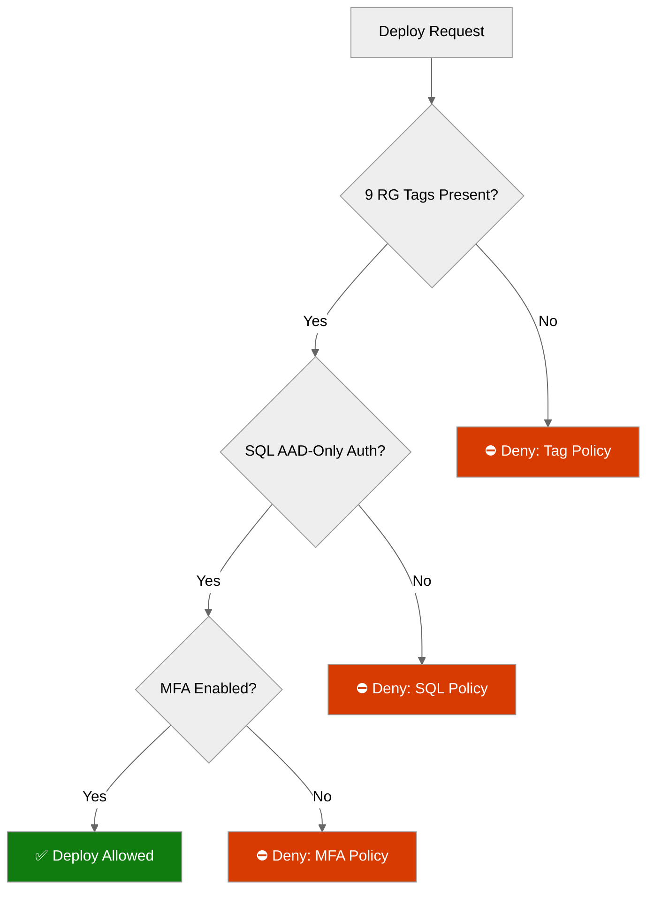

# 🛡️ Step 4: Governance Constraints - nordic-fresh-foods


> Generated by Bicep Planner agent | 2026-03-11

<details>
<summary>📑 Table of Contents</summary>

- [🔍 Discovery Source](#-discovery-source)
- [📋 Azure Policy Compliance](#-azure-policy-compliance)
- [🔄 Plan Adaptations Based on Policies](#-plan-adaptations-based-on-policies)
- [🚫 Deployment Blockers](#-deployment-blockers)
- [🏷️ Required Tags](#%EF%B8%8F-required-tags)
- [🔐 Security Policies](#-security-policies)
- [💰 Cost Policies](#-cost-policies)
- [🌐 Network Policies](#-network-policies)
- [References](#references)

</details>

| ⬅️ Previous                                                                    | 📑 Index            | Next ➡️                                                |
| ------------------------------------------------------------------------------ | ------------------- | ------------------------------------------------------ |
| [03-des-adr-0001](03-des-adr-0001-cost-optimized-n-tier-azure-architecture.md) | [README](README.md) | [04-implementation-plan.md](04-implementation-plan.md) |

---

## 🔍 Discovery Source

| Property                     | Value                                                      |
| ---------------------------- | ---------------------------------------------------------- |
| **Method**                   | Azure REST API (`management.azure.com`)                    |
| **Subscription**             | noalz (`00858ffc-dded-4f0f-8bbf-e17fff0d47d9`)             |
| **Tenant**                   | Lord of the Cloud (`2d04cb4c-999b-4e60-a3a7-e8993edc768b`) |
| **Discovery Date**           | 2026-03-11                                                 |
| **Total Policy Assignments** | 21                                                         |
| **Scope**                    | Subscription + Management Group (inherited)                |

> [!NOTE]
> Policies discovered via REST API include management group-inherited policies.

### Discovery Reconciliation

| Scope                            | Count  | Method                                                                               |
| -------------------------------- | ------ | ------------------------------------------------------------------------------------ |
| **Subscription-level**           | 5      | REST API (`/subscriptions/{id}/providers/Microsoft.Authorization/policyAssignments`) |
| **Management Group-inherited**   | 10     | REST API (management group scope)                                                    |
| **ArcBox resource-group-scoped** | 6      | REST API (limited to `rg-arcbox-swc01`, excluded from project)                       |
| **Total**                        | **21** | Matches Azure Portal total                                                           |

**ArcBox-scoped assignments (6, excluded):**

1. `Enable Azure Monitor for VMs` — scope: `rg-arcbox-swc01`
2. `Enable Azure Monitor for VMSS` — scope: `rg-arcbox-swc01`
3. `Deploy Dependency Agent for Linux VMs` — scope: `rg-arcbox-swc01`
4. `Deploy Dependency Agent for Windows VMs` — scope: `rg-arcbox-swc01`
5. `Configure Linux VMs to run Azure Monitor Agent` — scope: `rg-arcbox-swc01`
6. `Configure Windows VMs to run Azure Monitor Agent` — scope: `rg-arcbox-swc01`

> These 6 assignments only affect resources in the ArcBox resource group and have zero impact on this project's resources in `rg-nff-{env}-swedencentral`.

---

## 📋 Azure Policy Compliance

### Policy Summary by Effect

| Effect                         | Count                                        | Impact on Project                            |
| ------------------------------ | -------------------------------------------- | -------------------------------------------- |
| **Deny**                       | 8 assignments (3 initiatives)                | 2 blockers for project resources             |
| **Audit / AuditIfNotExists**   | 5 assignments (3 initiatives + 2 regulatory) | Compliance visibility — no deployment blocks |
| **Modify / DeployIfNotExists** | 2 assignments                                | Auto-remediation of tags and blob access     |
| **Other**                      | 6 (ArcBox-scoped)                            | No impact — different resource group scope   |

### Deny Policies (Hard Blockers)

| Policy                                         | Scope            | Impact                                                             | Severity |
| ---------------------------------------------- | ---------------- | ------------------------------------------------------------------ | -------- |
| **JV-Enforce Resource Group Tags v3**          | Management Group | ⛔ BLOCKER — RG creation fails without 9 mandatory tags            | Critical |
| **SFI-ID4.2.2 SQL DB - Safe Secrets Standard** | Management Group | ⛔ BLOCKER — SQL Server requires `azureADOnlyAuthentication: true` | Critical |
| **MFA for Resource Write Actions**             | Management Group | ⚠️ WARNING — Deployer must have MFA enabled                        | High     |
| **MFA for Resource Delete Actions**            | Management Group | ⚠️ WARNING — Affects teardown only                                 | Medium   |
| **Block Classic Resources**                    | Management Group | ✅ No impact — project uses ARM resources only                     | None     |
| **Not Allowed Resource Types**                 | Management Group | ✅ No impact — blocks Classic types only                           | None     |
| **Block VM SKUs (H/M/N series)**               | Management Group | ✅ No impact — project does not use VMs                            | None     |
| **Key Vault HSM Purge Protection**             | Management Group | ✅ No impact — project uses Standard KV                            | None     |

### Audit Policies (Compliance Monitoring)

| Policy                           | Scope            | Relevant Checks                                              |
| -------------------------------- | ---------------- | ------------------------------------------------------------ |
| **GDPR 2016/679**                | Subscription     | Data residency, encryption, access controls                  |
| **PCI DSS v4**                   | Subscription     | Network segmentation, encryption, TLS                        |
| **Azure Security Baseline**      | Management Group | TLS 1.2, identity, network, monitoring                       |
| **MCAPSGov Audit (44 policies)** | Management Group | SQL auditing, threat detection, FTP-S only, TLS, diagnostics |
| **ASC DataProtection**           | Subscription     | Storage and SQL data protection                              |

### Modify / DeployIfNotExists Policies (Auto-Remediation)

| Policy                                     | Scope            | Action                                                         |
| ------------------------------------------ | ---------------- | -------------------------------------------------------------- |
| **JV - Inherit Multiple Tags from RG**     | Management Group | Auto-copies 9 tags from RG to child resources                  |
| **MCAPSGov Deploy & Modify (27 policies)** | Management Group | Disables blob anonymous access, disables local auth on storage |

---

## 🔄 Plan Adaptations Based on Policies

### Adaptation 1: Expanded Tag Requirements (CRITICAL)

The architecture planned 4 tags (`Environment`, `ManagedBy`, `Project`, `Owner`). **Azure Policy enforces 9 tags** on resource groups:

| #   | Tag Name            | Planned?                  | Source       | Example Value             |
| --- | ------------------- | ------------------------- | ------------ | ------------------------- |
| 1   | `environment`       | ✅ Yes (as `Environment`) | Architecture | `dev`, `prod`             |
| 2   | `owner`             | ✅ Yes (as `Owner`)       | Architecture | `nordic-fresh-foods-team` |
| 3   | `costcenter`        | ❌ **NEW**                | Policy Deny  | `NFF-001`                 |
| 4   | `application`       | ❌ **NEW**                | Policy Deny  | `freshconnect`            |
| 5   | `workload`          | ❌ **NEW**                | Policy Deny  | `web-app`                 |
| 6   | `sla`               | ❌ **NEW**                | Policy Deny  | `99.9%`                   |
| 7   | `backup-policy`     | ❌ **NEW**                | Policy Deny  | `daily-30d`               |
| 8   | `maint-window`      | ❌ **NEW**                | Policy Deny  | `sun-02:00-06:00-utc`     |
| 9   | `technical-contact` | ❌ **NEW**                | Policy Deny  | `cto@nordicfreshfoods.eu` |

> [!IMPORTANT]
> The `ManagedBy` and `Project` tags from the architecture are NOT in the Policy Deny list but remain best practice. The implementation plan includes all 11 tags (9 policy-enforced + 2 best-practice).

**Strategy**: Define all 9 policy-required tags as Bicep parameters with defaults. Tags set on RG; child resources auto-inherit via Modify policy.

### Adaptation 2: Azure SQL Azure AD-Only Auth (Already Aligned)

Architecture already specifies `azureADOnlyAuthentication: true`. No change needed — this confirms policy compliance.

### Adaptation 3: MFA Prerequisite for Deployment

Deployer account must have MFA enabled (MFA Write Enforcement deny policy). This is a control-plane requirement, not a template change. Document in deployment prerequisites.

**CI/CD automation path (conditional):** Federated workload identity (OIDC) with a service principal is a potential alternative for automated pipelines. However, this path is **unverified against this tenant's write-action enforcement model**. The tenant's Conditional Access policies may treat workload identities differently from interactive MFA sessions. **Validation task:** Before relying on OIDC for CI/CD, test a federated service principal write operation against this subscription and confirm the MFA deny policy does not block it. Until validated, interactive MFA-authenticated deployment remains the only proven path.

### Adaptation 4: Storage Account Blob Access

MCAPSGov Deploy policy auto-disables blob anonymous access. Architecture already specifies `allowBlobPublicAccess: false` — auto-remediation is a safety net.

---

## 🚫 Deployment Blockers

| #   | Blocker                                | Policy                | Resolution                                              | Status              |
| --- | -------------------------------------- | --------------------- | ------------------------------------------------------- | ------------------- |
| 1   | Resource group creation without 9 tags | JV-Enforce RG Tags v3 | Add 5 new tags to Bicep parameters                      | 🔧 Resolved in plan |
| 2   | SQL Server without AD-only auth        | SFI-ID4.2.2           | Already in architecture                                 | ✅ Pre-resolved     |
| 3   | Deployer without MFA                   | MFA Write Enforcement | Interactive MFA required; OIDC conditional (unverified) | 📋 Documented       |

---

## 🏷️ Required Tags

### Resource Group Level (Policy-Enforced)

```bicep
// All 9 tags are MANDATORY on resource groups (Azure Policy: Deny)
var rgTags = {
  environment: environment          // 'dev' | 'prod'
  owner: owner                       // team or individual
  costcenter: costCenter             // cost center code
  application: applicationName       // application identifier
  workload: workloadName             // workload type
  sla: slaTarget                     // SLA percentage
  'backup-policy': backupPolicy      // backup schedule
  'maint-window': maintWindow        // maintenance window
  'technical-contact': techContact   // technical contact email
  // Best-practice additions (not policy-enforced):
  ManagedBy: 'Bicep'
  Project: 'nordic-fresh-foods'
}
```

### Child Resources (Auto-Inherited)

Child resources automatically receive all 9 policy-enforced tags from their resource group via the **JV - Inherit Multiple Tags** Modify policy. Additional resource-specific tags (e.g., `ManagedBy`, `Project`) should be set explicitly in templates.

---

## 🔐 Security Policies

| Requirement                | Policy Source                   | Implementation                            |
| -------------------------- | ------------------------------- | ----------------------------------------- |
| Azure AD-only auth for SQL | MCAPSGov Deny                   | `azureADOnlyAuthentication: true`         |
| TLS 1.2 minimum            | Azure Security Baseline (Audit) | `minTlsVersion: 'TLS1_2'` on all services |
| HTTPS-only                 | Azure Security Baseline (Audit) | `httpsOnly: true` on App Service          |
| No blob public access      | MCAPSGov Deploy (Modify)        | `allowBlobPublicAccess: false`            |
| SQL threat detection       | MCAPSGov Audit                  | Enable in SQL Server config               |
| SQL auditing               | MCAPSGov Audit                  | Enable diagnostic settings                |
| MFA for writes             | Management Group Deny           | Deployer prerequisite                     |
| Managed Identity           | Azure Security Baseline (Audit) | System-assigned MI on App Service         |

---

## 💰 Cost Policies

| Policy                      | Effect       | Impact                                                                                                                           |
| --------------------------- | ------------ | -------------------------------------------------------------------------------------------------------------------------------- |
| Budget alert (planned)      | N/A (custom) | Aggregate €1K + per-env budgets with 80/100/120% forecast alerts                                                                 |
| Anomaly detection (planned) | N/A (custom) | Separate Cost Management anomaly alert (not part of budget resource) — via `Microsoft.CostManagement/scheduledActions` or Portal |
| VM SKU restrictions         | Deny (H/M/N) | No impact — no VMs in project                                                                                                    |
| AKS node limit              | Deny         | No impact — no AKS in project                                                                                                    |

> [!NOTE]
> No cost-specific Deny policies affect planned resources. Budget monitoring is implemented via `Microsoft.Consumption/budgets` resource with forecast thresholds at 80%, 100%, 120%. Anomaly detection is a **separate** Cost Management capability implemented via `Microsoft.CostManagement/scheduledActions` (subscription scope) or configured in Azure Portal — it is NOT a property of the budget resource.

---

## 🌐 Network Policies

| Requirement                         | Source                                 | Implementation                                                    |
| ----------------------------------- | -------------------------------------- | ----------------------------------------------------------------- |
| Private Endpoints for data services | Architecture + PCI DSS v4 (Audit)      | PE for SQL + Storage + Key Vault in `pe-subnet`                   |
| VNet integration                    | Architecture                           | App Service delegated to `app-subnet`                             |
| Public network access disabled      | Architecture + Azure Security Baseline | `publicNetworkAccess: 'Disabled'` on SQL, Storage, and Key Vault  |
| NSG on all subnets                  | Architecture + Azure Security Baseline | Network Security Groups on `snet-app`, `snet-data`, and `snet-pe` |

### PCI DSS Boundary Definition

> [!IMPORTANT]
> The FreshConnect application uses **redirect-based tokenization** for payment processing. Card data is handled exclusively by the third-party payment provider (e.g., Stripe/Adyen hosted payment fields). No cardholder data (CHD) enters or is stored in the Azure environment.

| Component                            | PCI Scope        | Rationale                                                                    |
| ------------------------------------ | ---------------- | ---------------------------------------------------------------------------- |
| App Service (public tier)            | **Out of scope** | Serves redirect/iframe to hosted payment fields; no CHD transits App Service |
| Azure SQL Database                   | **Out of scope** | Stores order data, user profiles — no PAN, CVV, or track data                |
| Storage Account                      | **Out of scope** | Product images, static assets — no payment data                              |
| Application Insights / Log Analytics | **Out of scope** | No payment payload logging; request/response bodies are NOT captured         |
| Key Vault                            | **Out of scope** | Stores connection strings and app secrets — no payment cryptographic keys    |

**Compensating controls on public web tier:**

- TLS 1.2+ enforced on all inbound traffic
- HTTPS-only (`httpsOnly: true`)
- Managed Identity for all backend connections (no credential exposure)
- FTPS-only (`ftpsState: 'FtpsOnly'`)
- Content Security Policy headers to restrict iframe sources to approved payment provider domains

> If the application evolves to process CHD directly, this boundary assessment must be revisited and the App Service/SQL/Storage tier re-scoped into the CDE.

---

## References



| Document                          | Link                                                                                                 |
| --------------------------------- | ---------------------------------------------------------------------------------------------------- |
| Azure Policy definition reference | [Microsoft Learn](https://learn.microsoft.com/azure/governance/policy/concepts/definition-structure) |
| GDPR compliance on Azure          | [Microsoft Learn](https://learn.microsoft.com/azure/compliance/offerings/offering-gdpr)              |
| PCI DSS on Azure                  | [Microsoft Learn](https://learn.microsoft.com/azure/compliance/offerings/offering-pci-dss)           |
| Azure Security Baseline           | [Microsoft Learn](https://learn.microsoft.com/security/benchmark/azure/overview)                     |

---

<div align="center">

| ⬅️ [Previous Step](03-des-adr-0001-cost-optimized-n-tier-azure-architecture.md) | 🏠 [Project Index](README.md) | ➡️ [04-implementation-plan.md](04-implementation-plan.md) |
| ------------------------------------------------------------------------------- | ----------------------------- | --------------------------------------------------------- |

</div>
