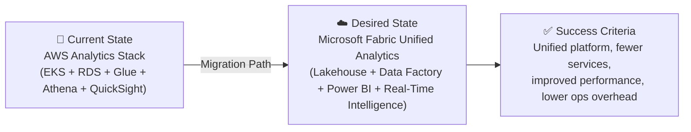

# 📋 Step 1: Requirements - infonova-fabric-bid

<strong>📑 Requirements Overview</strong>

- [🎯 Project Overview](#-project-overview)
- [🚀 Functional Requirements](#-functional-requirements)
- [⚡ Non-Functional Requirements (NFRs)](#-non-functional-requirements-nfrs)
- [🔒 Compliance & Security Requirements](#-compliance--security-requirements)
- [💰 Budget](#-budget)
- [🔧 Operational Requirements](#-operational-requirements)
- [🌍 Regional Preferences](#-regional-preferences)
- [📊 Complexity Classification](#-complexity-classification)
- [📋 Summary for Architecture Assessment](#-summary-for-architecture-assessment)
- [References](#references)

> Generated by @requirements agent | 2026-03-24

| ⬅️ Previous | 📑 Index            | Next ➡️                                                        |
| ----------- | ------------------- | -------------------------------------------------------------- |
| —           | [README](README.md) | [02-architecture-assessment.md](02-architecture-assessment.md) |

## 🎯 Project Overview

| Field                   | Value                                                                                                  |
| ----------------------- | ------------------------------------------------------------------------------------------------------ |
| **Project Name**        | infonova-fabric-bid                                                                                    |
| **Project Type**        | Data Platform — Analytics Migration (AWS → Microsoft Fabric)                                           |
| **Timeline**            | Q2 2026 → Q4 2026 (target go-live)                                                                     |
| **Primary Stakeholder** | BeyondNow / Infonova Engineering                                                                       |
| **Business Context**    | Competitive bid to migrate an AWS-based IoT analytics platform for mobile networks to Microsoft Fabric |
| **iac_tool**            | Terraform                                                                                              |

### Business Context

| Field               | Value                                                                                                                                                   |
| ------------------- | ------------------------------------------------------------------------------------------------------------------------------------------------------- |
| Industry / Vertical | Telecommunications / BSS (Business Support Systems)                                                                                                     |
| Company Size        | Enterprise (5,000+ employees)                                                                                                                           |
| Current State       | Migration — move existing AWS analytics to Microsoft Fabric                                                                                             |
| Migration Source    | AWS (EKS, RDS PostgreSQL, Glue ETL, Lake Formation, Athena, QuickSight, OpenSearch, S3 Data Lake, Secrets Manager, ALB)                                 |
| Business Drivers    | Performance/scalability issues on current AWS platform; operational overhead from too many managed services; desire for unified analytics platform      |
| Success Criteria    | Reduced operational complexity via Fabric's unified platform; improved query performance; maintained dashboard fidelity; seamless external data sharing |

### State Transition

## 🚀 Functional Requirements

### Core Capabilities

| #   | Capability                                              | Priority  | Acceptance Criteria                                                                                 |
| --- | ------------------------------------------------------- | --------- | --------------------------------------------------------------------------------------------------- |
| 1   | IoT telemetry ingestion from mobile networks            | 🔴 Must   | Event Hubs + Fabric Real-Time Intelligence ingest ≥1K TPS with <5s end-to-end latency               |
| 2   | ETL pipeline migration (Glue → Data Factory)            | 🔴 Must   | All existing Glue ETL jobs replicated in Fabric Data Pipelines with equivalent transformation logic |
| 3   | Data lake with governance (S3/Lake Formation → OneLake) | 🔴 Must   | 100 GB–1 TB data migrated to OneLake Lakehouse with row/column security via Fabric governance       |
| 4   | SQL analytics (Athena → Lakehouse SQL endpoint)         | 🔴 Must   | Existing Athena queries execute on Lakehouse SQL endpoint with equivalent or better performance     |
| 5   | BI dashboards (QuickSight → Power BI)                   | 🔴 Must   | All dashboard designs recreated in Power BI with SPICE-equivalent DirectLake performance            |
| 6   | Full-text search (OpenSearch → Azure AI Search)         | 🟡 Should | OpenSearch indices migrated to Azure AI Search with semantic ranking                                |
| 7   | External data sharing                                   | 🔴 Must   | Partner data sharing via Azure Data Share / SFTP — see External Sharing Controls below              |
| 8   | Application hosting (EKS → AKS)                         | 🔴 Must   | Infonova apps + Analytics Backend running on AKS with Kong Ingress equivalent                       |
| 9   | PostgreSQL migration (RDS → Azure PgSQL)                | 🔴 Must   | Data models, schemas, extraction views migrated with read-replica topology preserved                |
| 10  | Secrets management (Secrets Manager → Key Vault)        | 🔴 Must   | All secrets, keys, certificates migrated to Azure Key Vault with managed identity access            |

### External Sharing Controls (REQ-003)

> **⚠️ PDPL + TDRA Compliance for Partner Data Sharing**

| Control                      | Requirement                                                              |
| ---------------------------- | ------------------------------------------------------------------------ |
| Partner Geography            | Partners may be inside or outside UAE — classify per partner             |
| Data Classification          | Only **aggregated / anonymized** data may be shared externally           |
| PII Handling                 | Subscriber PII must be **tokenized or pseudonymized** before sharing     |
| Regulated Telecom Data       | **Never shared** externally without TDRA explicit approval               |
| Transfer Approval Workflow   | Data Protection Officer (DPO) approval required for each sharing channel |
| Cross-border Transfer (PDPL) | Requires adequacy assessment per Article 22 of UAE PDPL                  |
| Audit Logging                | All data sharing events must be logged with 7-year retention             |
| Lawful Interception (TDRA)   | Analytics outputs accessible to TDRA upon lawful request                 |
| Lawful Interception Scope    | Applies to both app tier (AKS) and analytics outputs (Fabric)            |
| Masking / Tokenization       | Azure Purview / Fabric data governance policies enforce masking rules    |

### User Types

| User Type          | Description                                   | Est. Count   | Access Level       |
| ------------------ | --------------------------------------------- | ------------ | ------------------ |
| Data Analysts      | Build and consume BI dashboards and reports   | 1,000–5,000  | Power BI Viewer    |
| Data Engineers     | Build/maintain ETL pipelines and data models  | 50–100       | Fabric Contributor |
| Platform Engineers | Manage AKS, networking, IaC, operations       | 10–20        | Admin              |
| External Partners  | Consume shared datasets via Data Share / SFTP | 20–50        | Reader (scoped)    |
| Application Users  | Use Infonova apps that feed analytics backend | 5,000–10,000 | Application-level  |

### AWS-to-Azure Service Parity Matrix (REQ-006)

> **⚠️ The following mappings are directional — not proven equivalencies.**
> Architecture (Step 2) must validate feature parity and document gaps.

| AWS Service           | Azure/Fabric Target             | Parity Level | Known Gaps / Deltas                                                 |
| --------------------- | ------------------------------- | ------------ | ------------------------------------------------------------------- |
| S3 Data Lake          | OneLake (Lakehouse)             | High         | OneLake is Fabric-native; direct S3 API compatibility not available |
| Lake Formation        | Fabric Governance + OneLake     | Medium       | Fine-grained row/column security differs; no direct LF equivalent   |
| Glue ETL (Spark)      | Fabric Data Factory / Pipelines | High         | Spark runtime compatible; Glue Catalog → Unity Catalog path needed  |
| Glue Data Catalog     | Fabric metadata / Purview       | Medium       | No direct catalog migration tool; manual mapping required           |
| Amazon Athena         | Lakehouse SQL Endpoint          | High         | T-SQL vs Presto syntax; query rewrite needed                        |
| QuickSight + SPICE    | Power BI + DirectLake           | Medium-High  | Dashboard redesign required; SPICE → DirectLake is not 1:1          |
| OpenSearch            | Azure AI Search                 | Medium       | Only search use cases map; log/analytics workloads may need ADX     |
| AWS RAM Share         | Azure Data Share                | Medium       | Different sharing model; no cross-account resource sharing equiv    |
| S3 Replication + SFTP | Azure Storage + SFTP            | High         | Near-parity for file-based sharing                                  |
| EKS + Kong            | AKS + NGINX/Kong                | High         | Kong available on AKS; Helm chart migration required                |
| RDS PostgreSQL        | Azure PgSQL Flexible Server     | High         | Near-parity; extension compatibility check needed                   |
| Secrets Manager       | Azure Key Vault                 | High         | Near-parity; rotation policy differences                            |
| ALB                   | Azure Application Gateway       | High         | Feature-comparable; WAF v2 adds capability                          |

### Integrations

| System                     | Direction     | Protocol          | Auth Method      | SLA    |
| -------------------------- | ------------- | ----------------- | ---------------- | ------ |
| IoT Mobile Network Devices | Inbound       | AMQP / HTTPS      | SAS / Managed ID | 99.99% |
| Infonova Apps (AKS)        | Bidirectional | REST / gRPC       | Managed Identity | 99.99% |
| External Partner Systems   | Outbound      | Data Share / SFTP | Azure AD B2B     | 99.9%  |
| Azure AI Search            | Inbound       | REST              | Managed Identity | 99.9%  |
| PostgreSQL Flexible Server | Bidirectional | PostgreSQL wire   | Managed Identity | 99.99% |

### Data Types

| Category                        | Sensitivity | Est. Volume | Retention | Residency |
| ------------------------------- | ----------- | ----------- | --------- | --------- |
| IoT telemetry / network metrics | 🟡 Medium   | 500 GB–1 TB | 2 years   | UAE       |
| Customer PII (subscriber data)  | 🔴 High     | 50–100 GB   | 7 years   | UAE       |
| Regulated telecom data          | 🔴 High     | 100–300 GB  | 5 years   | UAE       |
| ETL intermediate / staging      | 🟢 Low      | 200–500 GB  | 90 days   | UAE       |
| BI aggregates / cubes           | 🟡 Medium   | 50–100 GB   | 1 year    | UAE       |

### Architecture Pattern

| Field              | Value                                                                                                                                                                                                                                                                                                                                                                                                                                                                                                                                                                                                                                                             |
| ------------------ | ----------------------------------------------------------------------------------------------------------------------------------------------------------------------------------------------------------------------------------------------------------------------------------------------------------------------------------------------------------------------------------------------------------------------------------------------------------------------------------------------------------------------------------------------------------------------------------------------------------------------------------------------------------------- |
| Workload Pattern   | Data Analytics (IoT-enriched) — ETL pipelines, data lake, BI dashboards                                                                                                                                                                                                                                                                                                                                                                                                                                                                                                                                                                                           |
| Recommended Option | Microsoft Fabric Unified Analytics (Lakehouse + Data Factory + Power BI + Real-Time Intelligence)                                                                                                                                                                                                                                                                                                                                                                                                                                                                                                                                                                 |
| Tier               | Enterprise                                                                                                                                                                                                                                                                                                                                                                                                                                                                                                                                                                                                                                                        |
| Justification      | Fabric's unified platform directly addresses the pain point of too many AWS managed services. OneLake replaces S3 + Lake Formation + Glue Data Catalog. Data Factory replaces Glue ETL. Power BI replaces QuickSight. Real-Time Intelligence handles IoT streaming. Enterprise tier (F64+) required for broad viewer access (10K users). **Note (REQ-005)**: F64 is a licensing threshold, not proof of workload fit. Architecture must validate capacity via Fabric capacity estimation tool, dashboard concurrency modeling, semantic model sizing, Spark CU consumption, and a composite availability model before the F64 SKU and 99.99% claims are retained. |

## ⚡ Non-Functional Requirements (NFRs)

| WAF Pillar     | Metric                 | Target                                   | Current (AWS)        | Gap                                     |
| -------------- | ---------------------- | ---------------------------------------- | -------------------- | --------------------------------------- |
| 🔄 Reliability | SLA                    | 99.99%                                   | ~99.95% (composite)  | Need multi-AZ Fabric F64+               |
| 🔄 Reliability | RTO                    | ~1 hour (composite); 15 min (non-Fabric) | ~1 hour              | Fabric limits composite                 |
| 🔄 Reliability | RPO                    | ~1 hour (composite); 5 min (non-Fabric)  | ~15 min              | Fabric limits composite                 |
| ⚡ Performance | ETL Pipeline Latency   | <30 min batch, <5s streaming             | ~45 min batch        | Fabric Spark + Real-Time Intelligence   |
| ⚡ Performance | Dashboard Load (p95)   | <3s                                      | ~5s (QuickSight)     | DirectLake mode eliminates import delay |
| ⚡ Performance | Concurrent Users       | 1,000–10,000                             | ~1,000               | Power BI Premium auto-scale             |
| ⚡ Performance | Ingestion TPS          | 100–1,000 TPS                            | ~500 TPS             | Event Hubs + KQL DB                     |
| 🔒 Security    | Auth Method            | Entra ID + B2B (MFA)                     | AWS IAM + Cognito    | Migration to Entra ID                   |
| 🔒 Security    | Encryption             | At-rest + In-transit (TLS 1.2+)          | At-rest + In-transit | Parity                                  |
| 💰 Cost        | Monthly Budget         | $25K–$50K/month                          | Unknown              | See scenario cost bands                 |
| 💰 Cost        | Budget Alert           | Alert at 80% of monthly budget           | N/A                  | Proactive cost governance               |
| 💰 Cost        | Forecast Alert         | Alert at 110% projected spend            | N/A                  | Early overrun detection                 |
| 🔧 Operations  | Uptime Monitoring      | Yes (Azure Monitor)                      | CloudWatch           | Migration to Azure Monitor              |
| 🔧 Operations  | Alert Response Time    | <15 min (P1), <1h (P2)                   | N/A                  | On-call SLO                             |
| 🔧 Operations  | Restore Test Cadence   | Quarterly DR drill                       | N/A                  | Validate recovery paths                 |
| 🔧 Operations  | Observability Coverage | 100% of production services              | N/A                  | No blind spots                          |
| 🔧 Operations  | Capacity Headroom      | ≥20% CU headroom on Fabric               | N/A                  | Burst absorption                        |

### Per-Service DR Matrix (REQ-002)

> **⚠️ Critical**: The 15-minute RTO / 5-minute RPO targets apply to the composite platform.
> Each service has different recovery characteristics. The architecture must define a
> per-service recovery plan. If single-region zonal designs cannot meet these targets
> for all services, RTO/RPO must be **revised per-service** or a legally acceptable
> multi-region UAE recovery pattern must be defined.

| Service                    | Recovery Mechanism                  | Achievable RTO | Achievable RPO | Gap vs Target     |
| -------------------------- | ----------------------------------- | -------------- | -------------- | ----------------- |
| Fabric Lakehouse / OneLake | OneLake BCDR (opt-in, cross-region) | ~1 hour        | ~1 hour        | RTO/RPO gap       |
| Fabric KQL Database        | Separate BCDR — not auto-replicated | ~2–4 hours     | ~1 hour        | Major RTO gap     |
| Fabric Data Factory        | Pipeline metadata — Git backup      | ~30 min        | Near-zero      | Minor RTO gap     |
| Power BI / Semantic Models | Fabric BCDR + Git integration       | ~1 hour        | ~1 hour        | RTO gap           |
| PostgreSQL Flexible Server | Zone-redundant HA + geo-restore     | ~5–10 min (ZR) | ~5 min         | Meets target (ZR) |
| Azure Kubernetes Service   | Multi-AZ + GitOps (Flux) + Velero   | ~15 min        | ~5 min         | Meets target      |
| Azure Event Hubs           | Zone-redundant + geo-DR (paired)    | ~10 min        | Near-zero      | Meets target      |
| Azure AI Search            | Multi-replica + manual failover     | ~15–30 min     | Near-zero      | Minor RTO gap     |
| Azure Key Vault            | Zone-redundant + soft-delete        | ~5 min         | Near-zero      | Meets target      |
| Azure Storage (SFTP)       | ZRS + soft-delete                   | ~5 min         | Near-zero      | Meets target      |

> **Revised Target**: Composite RTO of **1 hour** and RPO of **1 hour** for the full platform
> is achievable with single-region multi-AZ deployment. The original 15min/5min targets
> are achievable only for non-Fabric services. Fabric-specific recovery will be
> architecture-dependent and must be validated in Step 2.

### Scalability

| Dimension       | Current     | 6-Month Projection | 12-Month Projection |
| --------------- | ----------- | ------------------ | ------------------- |
| Dashboard Users | 1,000       | 3,000              | 10,000              |
| Data Volume     | 100 GB–1 TB | 1–2 TB             | 2–5 TB              |
| Ingestion TPS   | ~500        | ~750               | ~1,000              |

## 🔒 Compliance & Security Requirements

### Regulatory Frameworks

<strong>PCI-DSS</strong> — Not Applicable

No payment card data is processed in this analytics platform.

<strong>SOC 2</strong> — Applicable

| Trust Principle | Applicability | Notes                                            |
| --------------- | ------------- | ------------------------------------------------ |
| Security        | Yes           | Managed Identity, Private Endpoints, TLS 1.2+    |
| Availability    | Yes           | 99.99% SLA target, multi-AZ deployment           |
| Confidentiality | Yes           | Customer PII and regulated telecom data in scope |

<strong>HIPAA</strong> — Not Applicable

No protected health information (PHI) is processed.

<strong>GDPR</strong> — Not Applicable

| Requirement      | Applicability | Notes                                               |
| ---------------- | ------------- | --------------------------------------------------- |
| EU data subjects | No            | UAE-based deployment, no EU data subject processing |
| Data residency   | No            | UAE data residency requirements apply instead       |
| Right to erasure | No            | UAE PDPL governs data subject rights                |

<strong>ISO 27001</strong> — Applicable

| Control Area        | Applicability | Notes                                                |
| ------------------- | ------------- | ---------------------------------------------------- |
| Access control      | Yes           | Entra ID + B2B, RBAC, conditional access, MFA        |
| Asset management    | Yes           | Resource tagging, inventory via Azure Resource Graph |
| Incident management | Yes           | Microsoft Defender for Cloud + Azure Monitor alerts  |

<strong>UAE PDPL (Federal Decree-Law No. 45/2021)</strong> — Applicable

| Requirement             | Applicability | Notes                                                 |
| ----------------------- | ------------- | ----------------------------------------------------- |
| Data residency in UAE   | Yes           | All data must remain in UAE North region              |
| Lawful processing basis | Yes           | Telecom subscriber data requires explicit consent     |
| Data subject rights     | Yes           | Access, correction, deletion rights under PDPL        |
| Cross-border transfer   | Restricted    | External sharing must comply with PDPL transfer rules |

<strong>TDRA Telecom Regulations (UAE)</strong> — Applicable

| Requirement                 | Applicability | Notes                                                    |
| --------------------------- | ------------- | -------------------------------------------------------- |
| Subscriber data protection  | Yes           | TDRA mandates protection of subscriber communications    |
| Data localization           | Yes           | Telecom data must be stored within UAE jurisdiction      |
| Lawful interception support | Yes           | Architecture must support lawful interception interfaces |
| Network security standards  | Yes           | TDRA cybersecurity framework compliance required         |

### Data Residency

| Requirement              | Value                                                   |
| ------------------------ | ------------------------------------------------------- |
| Primary Region           | UAE North (`uaenorth`)                                  |
| Data Sovereignty         | UAE-only — all data must remain within UAE jurisdiction |
| Cross-region Replication | Conditional — see per-service DR matrix below           |

> **⚠️ Fabric Home-Region Validation (REQ-001)**
> Microsoft Fabric ties certain metadata and platform elements to the tenant home region.
> Capacity placement in UAE North alone does **not** guarantee full UAE-only data residency.
> **Hard Requirement**: Before architecture proceeds, the following MUST be validated:
>
> 1. Confirm the M365/Fabric tenant home region is set to UAE (or will be created as UAE)
> 2. Validate Fabric Multi-Geo behavior — identify any data elements that remain in the home region
> 3. Document any residual metadata that cannot be localized to UAE North
> 4. Obtain written confirmation from Microsoft (via CSA/TAM) that the configuration meets UAE PDPL data localization
>
> UAE-only residency is **contingent on** confirmed Fabric tenant-region compliance, not just capacity placement.

### Authentication & Authorization

| Requirement       | Value                                                             |
| ----------------- | ----------------------------------------------------------------- |
| Identity Provider | Microsoft Entra ID + B2B (partner/external access)                |
| MFA Requirement   | Required (conditional access policies for all interactive users)  |
| RBAC Model        | Azure RBAC + Fabric workspace roles + Power BI row-level security |

### Network Security

| Control                     | Required | Notes                                                  |
| --------------------------- | -------- | ------------------------------------------------------ |
| Private endpoints           | ✅       | PostgreSQL, Storage, Key Vault, Event Hubs             |
| VNet integration            | ✅       | AKS, PostgreSQL, Fabric managed VNet (where available) |
| Public endpoints acceptable | ❌       | All data services must use private connectivity        |
| WAF required                | ✅       | Application Gateway WAF v2 for AKS ingress             |

### Recommended Security Controls

| Control               | Recommended | User Confirmed | Notes                                                |
| --------------------- | ----------- | -------------- | ---------------------------------------------------- |
| Managed Identity      | Yes         | Yes            | All service-to-service auth, no keys/secrets in code |
| Private Endpoints     | Yes         | Yes            | PostgreSQL, Storage, Key Vault, Event Hubs           |
| WAF                   | Yes         | Yes (implied)  | Application Gateway WAF v2 for AKS                   |
| Key Vault for Secrets | Yes         | Yes            | Replacing AWS Secrets Manager                        |
| Diagnostic Settings   | Yes         | Yes (implied)  | Azure Monitor + Log Analytics for all resources      |
| TLS 1.2 Minimum       | Yes         | Yes            | All endpoints                                        |
| Encryption at Rest    | Yes         | Yes (implied)  | Platform-managed keys (consider CMK for PII)         |
| Network Isolation     | Yes         | Yes            | VNet integration + private endpoints + NSGs          |
| DDoS Protection       | Yes         | Yes            | Azure DDoS Protection Plan                           |
| Defender for Cloud    | Yes         | Yes            | Threat detection, vulnerability assessment           |

## 💰 Budget

> [!NOTE]
> The Azure Pricing MCP server generates detailed cost estimates during
> architecture assessment (Step 2). Provide an approximate budget here.

| Field              | Value                                                         |
| ------------------ | ------------------------------------------------------------- |
| 💰 Monthly Budget  | $25,000–$50,000/month (see scenario bands below)              |
| 📅 Annual Budget   | $300,000–$600,000/year                                        |
| 🚦 Limit Type      | 🟡 Soft — can negotiate based on TCO comparison vs AWS        |
| 📊 Cost Model Pref | Hybrid (Fabric capacity reservation + consumption for bursts) |

> **⚠️ Budget Realism (REQ-004)**
> The original $10K/month lower bound is **not viable** for the stated scope.
> Fabric F64 alone is ~$8.4K/month PAYG; DDoS Protection adds ~$2.9K/month.
> Before adding AKS, PostgreSQL HA, Event Hubs, AI Search, App GW, monitoring,
> and backups, the baseline already exceeds $10K. Realistic bands below:

### Scenario-Based Cost Bands

| Scenario                      | Est. Monthly Cost | Includes                                                      |
| ----------------------------- | ----------------- | ------------------------------------------------------------- |
| **Minimum Viable (Dev/Test)** | ~$15K–$20K        | Fabric F16 (trial), basic AKS, single PgSQL, no DDoS Standard |
| **Target Production**         | ~$25K–$35K        | Fabric F64, AKS Standard, PgSQL HA, Event Hubs, AI Search     |
| **Peak-Scale Production**     | ~$40K–$50K        | Fabric F64+ (burst), AKS auto-scale, full DR, DDoS, Defender  |

### Cost Optimization Priorities

| Priority                         | Selected | Impact |
| -------------------------------- | -------- | ------ |
| Minimize compute costs           | ☑        | High   |
| Prefer consumption-based pricing | ☐        | Medium |
| Reserved instances acceptable    | ☑        | High   |
| Spot instances for non-critical  | ☐        | Low    |

## 🔧 Operational Requirements

### Monitoring & Alerting

| Capability             | Required | Tool / Service                    | Notes                                       |
| ---------------------- | -------- | --------------------------------- | ------------------------------------------- |
| Application monitoring | ✅       | Application Insights              | AKS + Function Apps                         |
| Log aggregation        | ✅       | Log Analytics                     | Centralized logging for all Azure resources |
| Alert notifications    | ✅       | Email + Teams                     | Platform engineers + data engineering team  |
| Custom dashboards      | ✅       | Azure Monitor + Fabric monitoring | Infrastructure + data pipeline health       |

### Support & Maintenance

| Requirement         | Value                                       |
| ------------------- | ------------------------------------------- |
| Support Hours       | 24/7 (mission-critical platform)            |
| On-call Requirement | Yes                                         |
| Maintenance Windows | Saturday 02:00–06:00 UAE time               |
| Change Management   | Formal CAB (enterprise telecom requirement) |

### Backup & Disaster Recovery

| Component           | Backup Frequency | Retention | Recovery Method                           |
| ------------------- | ---------------- | --------- | ----------------------------------------- |
| PostgreSQL Flexible | Continuous       | 35 days   | Point-in-time restore                     |
| OneLake / Lakehouse | Daily            | 30 days   | OneLake data replication                  |
| Key Vault           | Continuous       | 90 days   | Soft-delete + purge protection            |
| AKS configurations  | Daily            | 30 days   | GitOps (Flux/ArgoCD) + Velero             |
| Power BI reports    | Daily            | 30 days   | Fabric workspace backup + Git integration |

## 🌍 Regional Preferences

| Preference         | Value                                                   | Justification                                          |
| ------------------ | ------------------------------------------------------- | ------------------------------------------------------ |
| Primary Region     | `uaenorth`                                              | UAE data residency (PDPL + TDRA), low latency to users |
| Failover Region    | `uaecentral` (if available for Fabric) or single-region | UAE jurisdiction requirement limits failover options   |
| Availability Zones | Required                                                | Mission-critical 99.99% SLA                            |

---

## 📊 Complexity Classification

| Field      | Value                                                                                                                                                                                                                                                         |
| ---------- | ------------------------------------------------------------------------------------------------------------------------------------------------------------------------------------------------------------------------------------------------------------- |
| Complexity | `complex`                                                                                                                                                                                                                                                     |
| Criteria   | >8 resource types (Fabric, AKS, PostgreSQL, Event Hubs, Key Vault, Storage, AI Search, App GW, DDoS, Monitor), multi-env (Dev + Production), UAE-specific telecom regulations, cross-cloud migration                                                          |
| Rationale  | Enterprise telecom migration from AWS with 12 Azure service types, mission-critical SLAs (99.99%), UAE PDPL + TDRA compliance, IoT real-time ingestion requirements, external partner data sharing, and full ETL pipeline migration. Complex by all criteria. |

---

## 📋 Summary for Architecture Assessment

### Handoff Summary

| Aspect               | Key Points                                                                                                                                                                                                                                                            |
| -------------------- | --------------------------------------------------------------------------------------------------------------------------------------------------------------------------------------------------------------------------------------------------------------------- |
| Critical Constraints | (1) UAE data residency — all data in `uaenorth` (contingent on Fabric tenant home-region validation), (2) TDRA telecom compliance + PDPL external sharing controls, (3) Revised composite RTO ~1h / RPO ~1h (Fabric-limited); non-Fabric services can meet 15min/5min |
| Key Decisions        | Terraform for IaC, Entra ID + B2B for auth, Fabric Enterprise (F64+ — pending capacity validation), AKS for app hosting, tokenized/anonymized external sharing only                                                                                                   |
| Open Risks           | Fabric availability in UAE North (verify F64+ SKU and tenant home-region), QuickSight-to-Power BI dashboard parity (medium), Lake Formation governance gap (medium), TDRA lawful interception architecture (high)                                                     |
| Recommended Pattern  | Data Analytics (IoT-enriched) — Microsoft Fabric Lakehouse + Data Factory + Power BI + Real-Time Intelligence                                                                                                                                                         |
| Budget Envelope      | $25K–$50K/month (target production: $25K–$35K)                                                                                                                                                                                                                        |

### Requirements Completeness

| Section                  | Status | Notes                                           |
| ------------------------ | ------ | ----------------------------------------------- |
| Project Overview         | ✅     | Full migration context with AWS source mapping  |
| Functional Requirements  | ✅     | 10 capabilities mapped from AWS → Azure/Fabric  |
| NFRs                     | ✅     | Mission-critical targets with AWS baseline gaps |
| Compliance & Security    | ✅     | UAE PDPL + TDRA + ISO 27001 + SOC 2             |
| Budget                   | ✅     | $25K–$50K/month with scenario bands             |
| Operational Requirements | ✅     | 24/7 support, DR, monitoring defined            |

---

## References

> [!NOTE]
> 📚 The following Microsoft Learn resources provide additional guidance.

| Topic                         | Link                                                                                                |
| ----------------------------- | --------------------------------------------------------------------------------------------------- |
| Microsoft Fabric Overview     | [Overview](https://learn.microsoft.com/fabric/get-started/microsoft-fabric-overview)                |
| Fabric Lakehouse              | [Lakehouse](https://learn.microsoft.com/fabric/data-engineering/lakehouse-overview)                 |
| Fabric Real-Time Intelligence | [Real-Time Intelligence](https://learn.microsoft.com/fabric/real-time-intelligence/overview)        |
| Azure Database for PostgreSQL | [Flexible Server](https://learn.microsoft.com/azure/postgresql/flexible-server/overview)            |
| Well-Architected Framework    | [Overview](https://learn.microsoft.com/azure/well-architected/)                                     |
| Azure Regions                 | [Products by Region](https://azure.microsoft.com/explore/global-infrastructure/products-by-region/) |
| UAE PDPL                      | [Federal Decree-Law No. 45/2021](https://learn.microsoft.com/azure/compliance/)                     |

---

_Requirements captured using [plan-requirements.prompt.md](../../.github/prompts/plan-requirements.prompt.md) template_

---

| ⬅️ — | 🏠 [Project Index](README.md) | ➡️ [02-architecture-assessment.md](02-architecture-assessment.md) |
| ---- | ----------------------------- | ----------------------------------------------------------------- |

