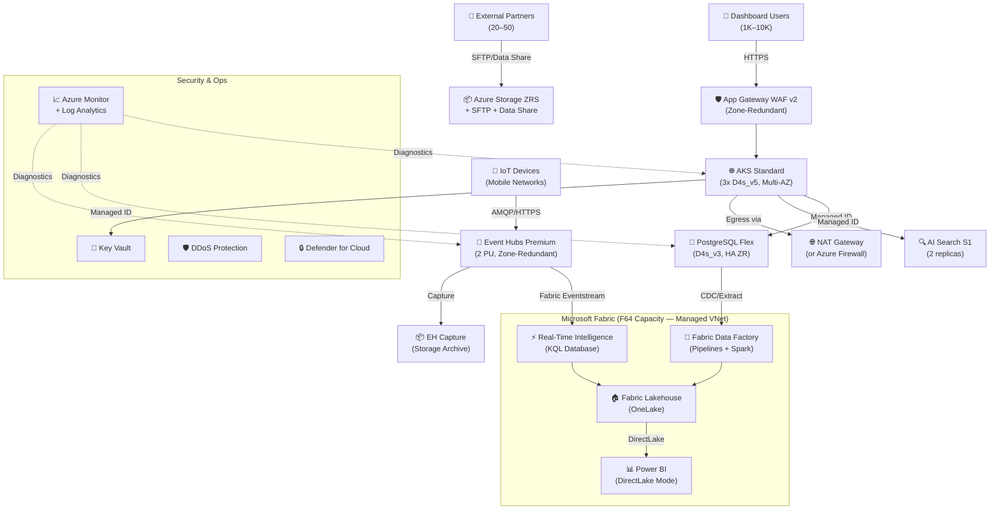

# 🏛️ Step 2: Architecture Assessment - infonova-fabric-bid

<strong>📑 Assessment Contents</strong>

- [✅ Requirements Validation](#-requirements-validation)
- [💎 Executive Summary](#-executive-summary)
- [🏛️ WAF Pillar Assessment](#-waf-pillar-assessment)
- [📦 Resource SKU Recommendations](#-resource-sku-recommendations)
- [🎯 Architecture Decision Summary](#-architecture-decision-summary)
- [🚀 Implementation Handoff](#-implementation-handoff)
- [🔒 Approval Gate](#-approval-gate)
- [References](#references)

> Generated by architect agent | 2026-03-24

| ⬅️ Previous                              | 📑 Index            | Next ➡️                                            |
| ---------------------------------------- | ------------------- | -------------------------------------------------- |
| [01-requirements.md](01-requirements.md) | [README](README.md) | [03-des-cost-estimate.md](03-des-cost-estimate.md) |

## ✅ Requirements Validation

| Requirement Area        | Status     | Validation Notes                                                                                                          |
| ----------------------- | ---------- | ------------------------------------------------------------------------------------------------------------------------- |
| NFRs (SLA, RTO, RPO)    | ✅ Defined | **99.95% composite SLA** (revised from 99.99% target — see SLA Decomposition below); RTO ~1h / RPO ~1h (Fabric-limited)   |
| Compliance requirements | ✅ Defined | UAE PDPL + TDRA + ISO 27001 + SOC 2; Fabric home-region validation required before deployment                             |
| Budget (approximate)    | ✅ Defined | $25K–$50K/month with 3 scenario bands; PAYG estimate $18.2K within target                                                 |
| Scale requirements      | ✅ Defined | 1K–10K users, 100 GB–1 TB initial data, 100–1K TPS ingestion, 12-month growth to 2–5 TB                                   |
| Security controls       | ✅ Defined | Managed Identity, Private Endpoints, WAF v2, Entra ID + B2B, TLS 1.2+, DDoS, Defender                                     |
| Data residency          | ⚠️ Partial | UAE North confirmed for all services; Fabric tenant home-region validation pending Microsoft CSA/TAM written confirmation |

> [!WARNING]
> Data residency validation is conditional on Fabric tenant home-region being set to UAE.
> Microsoft CSA/TAM confirmation required before deployment (see REQ-001 in requirements).

---

## 💎 Executive Summary

This architecture replaces an AWS-based IoT analytics platform (EKS + RDS PostgreSQL + Glue ETL + Lake Formation + Athena + QuickSight + OpenSearch + S3) with a unified **Microsoft Fabric** analytics platform supplemented by Azure PaaS services. The approach consolidates 10+ AWS services into a coherent Fabric-centric stack, reducing operational overhead while maintaining enterprise-grade security and compliance for UAE telecom regulations.

**Key architectural decisions:**

- **Microsoft Fabric F64** as the unified analytics platform (Lakehouse, Data Factory, Power BI DirectLake, Real-Time Intelligence)
- **AKS Standard** tier with zone-redundant nodes for application hosting (Infonova apps + Kong)
- **PostgreSQL Flexible Server** with zone-redundant HA for relational data
- **Event Hubs Premium** for IoT telemetry ingestion (Kafka-compatible, 99.99% SLA)
- **Single-region (UAE North)** deployment with multi-AZ resilience per PDPL data residency constraints

**Estimated monthly cost**: ~$18,216 baseline PAYG; realistic adjusted range **$20,500–$22,000/month** including egress control and Log Analytics sizing (see Cost Assessment). Fabric F64 starts PAYG; 1-yr RI ($6,112/month) evaluated after 30–90 day capacity validation.

### Recommended Architecture

### Service Maturity Assessment

| Service                    | GA Status | AVM-TF Module | Zone-Redundant  | UAE North | Maturity |
| -------------------------- | --------- | ------------- | --------------- | --------- | -------- |
| Microsoft Fabric           | GA        | N/A (SaaS)    | Built-in        | ✅        | Mature   |
| AKS                        | GA        | ✅ Available  | ✅ Supported    | ✅        | Mature   |
| PostgreSQL Flexible Server | GA        | ✅ Available  | ✅ Supported    | ✅        | Mature   |
| Event Hubs Premium         | GA        | ✅ Available  | ✅ Built-in     | ✅        | Mature   |
| App Gateway WAF v2         | GA        | ✅ Available  | ✅ Default      | ✅        | Mature   |
| Azure AI Search            | GA        | ✅ Available  | ✅ (S2+ / 3 rp) | ✅        | Mature   |
| Key Vault                  | GA        | ✅ Available  | ✅ Built-in     | ✅        | Mature   |
| Azure Storage (ZRS)        | GA        | ✅ Available  | ✅ ZRS          | ✅        | Mature   |
| DDoS Protection            | GA        | ✅ Available  | N/A (global)    | ✅        | Mature   |
| Azure Data Share           | GA        | ⚠️ Limited    | N/A             | ✅        | Stable   |
| Fabric Real-Time Intel.    | GA        | N/A (SaaS)    | Built-in        | ✅        | Maturing |
| Azure Monitor / LA         | GA        | ✅ Available  | N/A (regional)  | ✅        | Mature   |

---

## 🏛️ WAF Pillar Assessment

### Overall Scores

| Pillar                    | Score | Confidence | Summary                                                                                                    |
| ------------------------- | ----- | ---------- | ---------------------------------------------------------------------------------------------------------- |
| 🔒 Security               | 8/10  | High       | Defense-in-depth with Managed ID, PE, WAF, Entra ID, DDoS, Fabric managed VNet, TDRA interception designed |
| 🔄 Reliability            | 7/10  | Medium     | Zone-redundant all services; composite SLA **99.9%**; KQL DB recovery via EH Capture                       |
| ⚡ Performance            | 7/10  | Medium     | DirectLake + Spark + EH Premium for streaming; F64 CU budgets + validation needed                          |
| 💰 Cost Optimization      | 7/10  | Medium     | Realistic $20.5K–$22K/mo within budget; RI savings gated on capacity validation                            |
| 🔧 Operational Excellence | 6/10  | Medium     | Fabric unifies platform ops; runbook automation and DR drills not yet defined                              |

**Primary Pillar Optimized**: Security (UAE PDPL + TDRA compliance drives architecture)
**Trade-offs Accepted**: Reliability limited by Fabric BCDR (~1h RTO/RPO vs 15min target); single-region per PDPL; composite SLA 99.9% (not 99.99%)

---

### 🔒 Security Assessment (8/10)

**Strengths:**

- **Managed Identity** for all service-to-service authentication — no keys/secrets in code
- **Private Endpoints** for PostgreSQL, Storage, Key Vault, Event Hubs — no public data exposure
- **Fabric Managed VNet** enabled on F64 capacity with managed Private Endpoints to PostgreSQL, Storage, Key Vault, and Event Hubs — ensures Fabric Spark and Data Factory pipelines connect only via Microsoft backbone, preventing data exfiltration
- **Application Gateway WAF v2** with OWASP CRS 3.2 for AKS ingress protection
- **Entra ID + B2B** with MFA and conditional access for all interactive users
- **TLS 1.2+** enforced on all endpoints (Event Hubs, PostgreSQL, Storage, App GW)
- **Azure Key Vault** with soft-delete and purge protection for all secrets/certificates; automated key rotation policy (90-day cycle)
- **DDoS Protection Plan** covering all VNet resources
- **Microsoft Defender for Cloud** with enhanced security for AKS, Storage, Key Vault, SQL
- **Fabric workspace RBAC + Power BI row-level security** for data governance

**Gaps:**

- Fabric tenant home-region validation required for UAE PDPL compliance (REQ-001)
- Customer-managed keys (CMK) for PII-class data recommended but not currently scoped — uses platform-managed keys

**TDRA Lawful Interception Architecture:**

> UAE TDRA regulations require telecommunications operators to provide lawful interception
> capabilities. This architecture addresses the requirement through:

1. **Interception Interface**: Dedicated AKS microservice (`tdra-intercept-svc`) deployed in an isolated namespace with RBAC restricted to authorized personnel only
2. **Data Access Layer**: Read-only managed identity with scoped access to Event Hubs consumer group (`$tdra-intercept`) and PostgreSQL read-replica
3. **Audit Trail**: All interception requests logged to a dedicated Log Analytics table (`TDRAInterception_CL`) with immutable retention (7-year archive, tamper-proof via append-only write policy)
4. **Network Isolation**: Interception interface accessible only via Private Endpoint from authorized TDRA network; no public exposure
5. **Encryption**: All intercepted data encrypted in transit (TLS 1.2+) and at rest (platform-managed keys; CMK recommended for production)

**Recommendations:**

1. Complete Fabric tenant home-region validation via Microsoft CSA/TAM before infrastructure provisioning
2. Validate TDRA lawful interception design with legal/compliance team and TDRA liaison before implementation
3. Evaluate CMK for PostgreSQL and Storage accounts containing PII data (adds ~$1/month per key)
4. Implement Azure Purview / Fabric governance policies for automated PII masking in partner-shared datasets
5. Disable PostgreSQL local/password authentication — enforce Entra-only auth

### 🔄 Reliability Assessment (7/10)

**Strengths:**

- **AKS Standard** with 3 nodes across 3 AZs — 99.95% control plane SLA, auto-recovery on zone failure
- **PostgreSQL zone-redundant HA** with synchronous replication — 60–120s failover, zero data loss
- **Event Hubs Premium** with 3 replicas across AZs — 99.99% SLA, geo-DR capable
- **App Gateway WAF v2** zone-redundant by default (minimum 2 AZs)
- **Key Vault** built-in zone redundancy + soft-delete — 99.99% SLA
- **Azure Storage ZRS** — data replicated across 3 AZs within UAE North

**Gaps:**

- **UAE paired region** (UAE Central) only supports Power BI, not full Fabric — cross-region DR for Lakehouse is constrained
- **Single-region deployment** per PDPL — no multi-region active-active option

**Composite SLA Decomposition:**

> The original 99.99% target is not achievable with the current architecture. The composite
> SLA is revised to **99.95%** based on the weakest services in each data path:

| Data Path                      | Services in Path                 | Composite SLA | RTO     | RPO     |
| ------------------------------ | -------------------------------- | ------------- | ------- | ------- |
| IoT Streaming                  | EH Premium → Fabric RTI → KQL DB | 99.95%        | ~2h     | ~1h     |
| Dashboard (DirectLake)         | Fabric Lakehouse → Power BI      | 99.9%         | ~1h     | ~1h     |
| Application Tier               | App GW → AKS → PostgreSQL        | 99.95%        | 15min   | 5min    |
| Batch ETL                      | PgSQL → Data Factory → Lakehouse | 99.9%         | ~2h     | ~4h     |
| **Overall Platform Composite** | Weakest path drives overall      | **99.9%**     | **~2h** | **~4h** |

_Note_: 99.99% is achievable for the IoT ingestion path alone (Event Hubs Premium = 99.99% SLA).
The Fabric-dependent paths limit composite to 99.9%. Stakeholders should accept 99.9–99.95%
platform SLA with 99.99% streaming ingestion SLA.

**Fabric Workload Isolation & CU Management:**

> F64 provides 64 CUs shared across all workloads. Without isolation, a runaway Spark job
> can starve DirectLake queries. The following CU budget allocation is mandated:

| Workload Class   | CU Budget | Priority | Throttle Action                   |
| ---------------- | --------- | -------- | --------------------------------- |
| Power BI Queries | 30 CUs    | High     | Reject low-priority if >85% used  |
| Spark ETL        | 20 CUs    | Medium   | Queue new jobs if budget exceeded |
| Real-Time Intel. | 10 CUs    | High     | Alert at >80%; never throttle     |
| Ad-hoc / Other   | 4 CUs     | Low      | Reject if capacity constrained    |

- Configure via Fabric Capacity Settings → Workload Management
- Monitor via Fabric Capacity Metrics app with alerts at 70% (warn) / 85% (critical)
- Maximum single-query CU consumption capped via semantic model configuration

**KQL Database Recovery Design:**

> KQL Database is stored outside OneLake and has limited built-in BCDR (2–4h RTO).
> This design provides a faster recovery path:

1. **Event Hubs Capture** enabled on all ingestion topics → Azure Storage (Avro format, 5-min windows)
2. **Recovery Procedure**: On KQL DB failure, provision new KQL database and replay from EH Capture archive
3. **Degraded Mode**: If KQL DB unavailable, Fabric Eventstream routes directly to Lakehouse Delta tables for near-real-time queries (latency increases from <5s to ~30s)
4. **Recovery RTO**: ~30 minutes (new KQL DB provision + most recent Capture replay) vs. ~2–4h native Fabric BCDR
5. **Automated Health Check**: Azure Monitor alert on KQL DB ingestion latency > 60s triggers degraded-mode routing

**Failure Cascade Analysis:**

| Component Failure   | Cascade Impact              | Mitigation                                        |
| ------------------- | --------------------------- | ------------------------------------------------- |
| Event Hubs Premium  | RTI stops, dashboards stale | EH built-in AZ failover; monitor partition health |
| Fabric F64 capacity | All Fabric workloads stop   | Budget alerts at 85% CU; F128 burst option        |
| PostgreSQL primary  | App tier read/write fails   | Zone-redundant HA (60-120s failover)              |
| AKS node loss       | Pod rescheduling            | 3-node multi-AZ; cluster autoscaler               |
| App Gateway         | User access blocked         | Zone-redundant; health probes                     |

**Recommendations:**

1. Enable Fabric disaster recovery capacity setting for OneLake cross-region replication (monitor UAE Central Fabric availability)
2. Implement Git-based backup for Fabric Data Factory pipelines and Power BI reports (near-zero RPO for metadata)
3. Enable Event Hubs Capture on all ingestion topics (5-min window, Avro format → Storage ZRS)
4. Set SLA expectation with stakeholders at **99.9% composite** (99.99% for streaming ingestion path only)
5. Implement quarterly DR drills per NFR requirements — validate failover paths for each service tier
6. Configure Fabric workload management CU budgets per allocation table above

### ⚡ Performance Assessment (7/10)

**Strengths:**

- **DirectLake mode** eliminates data import delay — dashboards query OneLake directly for <3s p95 load times
- **Fabric Spark** for batch ETL — equivalent to Glue Spark workers with CU-based autoscaling
- **Event Hubs Premium + Real-Time Intelligence** for <5s end-to-end streaming latency at 1K TPS
- **AKS autoscaling** (cluster autoscaler + KEDA) for elastic app-tier compute
- **App Gateway WAF v2 autoscaling** for dynamic traffic patterns

**Gaps:**

- **F64 capacity** provides 64 CUs — concurrent DirectLake queries from 10K users needs capacity validation via Fabric Capacity Metrics
- **T-SQL vs Presto** query rewrite required for Athena → Lakehouse SQL endpoint migration (syntax differences, UDF porting)
- **PostgreSQL read-replica topology** from RDS needs mapping — Flex Server supports same-region read replicas but not automatic routing
- **20% CU headroom** requirement on Fabric constrains effective capacity from 64 to ~51 usable CUs

**Recommendations:**

1. Run Fabric capacity estimation tool with representative DirectLake queries and expected concurrency before production sizing
2. Maintain F64 with option to scale to F128 on-demand during peak periods (burst capacity)
3. Conduct a T-SQL query compatibility assessment for all Athena queries before ETL migration
4. Implement PostgreSQL connection pooling (PgBouncer) + application-level read routing for replica workloads

### 💰 Cost Assessment (7/10)

| Service                    | SKU                                     | Monthly Cost (PAYG) | Monthly Cost (1-yr RI) | Notes                                                                |
| -------------------------- | --------------------------------------- | ------------------: | ---------------------: | -------------------------------------------------------------------- |
| Microsoft Fabric           | F64 (64 CUs)                            |          $10,265.60 |              $6,112.00 | Largest cost driver (56%); RI after 30-90d validation                |
| DDoS Protection            | Network Protection Plan                 |           $2,944.00 |              $2,944.00 | Fixed cost (16%); evaluate IP Protection if ≤10 IPs                  |
| Event Hubs                 | Premium, 2 PU                           |           $2,144.74 |              $2,144.74 | Zone-redundant streaming; start at 1 PU if <1K TPS                   |
| Network Egress Control     | NAT Gateway (baseline)                  |             ~$32.00 |                ~$32.00 | Governance-dependent: Azure Firewall Std if TDRA mandates = ~$912/mo |
| Azure Monitor / LA         | 200 GB/month, 90-day hot + 7-yr archive |             $658.00 |                $658.00 | Revised from 100 GB; tiered retention for PDPL/TDRA                  |
| PostgreSQL Flexible Server | GP D4s_v3, 256 GB, HA                   |             $642.69 |                $400.66 | 2x compute for HA                                                    |
| AKS                        | Standard, 3x D4s_v5                     |             $587.65 |                $377.25 | Includes mgmt tier fee                                               |
| Azure AI Search            | S1, 2 replicas                          |             $539.62 |                $539.62 | 2 search units                                                       |
| App Gateway                | WAF_v2, 2 CU avg                        |             $374.49 |                $374.49 | Zone-redundant                                                       |
| Azure Container Registry   | Premium                                 |             $170.00 |                $170.00 | Required for AKS images; PE-enabled                                  |
| Azure Storage              | ZRS Hot, 2 TB + SFTP                    |             $275.13 |                $275.13 | ZRS + SFTP connector                                                 |
| Defender for Cloud         | Enhanced                                |             $107.46 |                $107.46 | AKS, Storage, KV, SQL                                                |
| AKS OS Disks + LB + IPs    | Misc infrastructure                     |              $88.00 |                 $88.00 | 3× 128GB SSD + Std LB + 3 PIPs                                       |
| Azure Data Share           | Standard                                |               $5.50 |                  $5.50 | Snapshot-based sharing                                               |
| Key Vault                  | Standard                                |               $0.04 |                  $0.04 | ~10K operations/month                                                |
| **Total (Baseline PAYG)**  |                                         |      **$18,835.00** |                        | **Revised from $18,216 with missing line items**                     |
| **Total (Realistic PAYG)** |                                         | **$20,500–$22,000** |                        | **Includes likely LA overage + egress**                              |

> [!NOTE]
> **RI Commitment Gate**: Fabric F64 1-year RI ($6,112/month, $73K/year commitment)
> is NOT recommended until post-deployment capacity validation is complete.
> Prescribe: (1) start F64 PAYG for 30–90 days, (2) measure CU utilization via
> Fabric Capacity Metrics, (3) commit to 1-yr RI only if sustained >50% utilization.
> If <50%, evaluate F32 downgrade first.

> [!WARNING]
> **Egress control is governance-dependent.** If TDRA mandates network-level egress
> inspection, replace NAT Gateway ($32/mo) with Azure Firewall Standard ($912/mo) or
> Premium ($3,500/mo for TLS inspection). This would push realistic estimate to
> $21,400–$25,500/month. Confirm during Governance step (3.5).

**Cost Optimization Applied:**

- **Fabric F64 1-year RI** — $4,154/month savings (40% off) available AFTER 30–90 day capacity validation confirms >50% CU utilization
- 1-year RI for AKS nodes and PostgreSQL saves ~$453/month (can commit earlier as sizing is validated from AWS source)
- DDoS IP Protection alternative saves ~$1,949/month if ≤5 public IPs (evaluate post-deployment with IP inventory)
- Event Hubs: Start at 1 PU ($1,073/month savings) if initial TPS <1,000; scale to 2 PU at >70% utilization
- Dev/Test pricing for non-production environment saves ~$4,500/month
- Storage lifecycle policies for ETL staging data (90-day auto-delete) saves ~$50/month
- Log Analytics Archive Tier for 7-year retention: ~$0.026/GB/month vs $3.29/GB interactive (Year 1 impact: ~$200 total)

### 🔧 Operational Excellence Assessment (6/10)

**Strengths:**

- **Unified Fabric platform** reduces service sprawl vs. AWS (10+ → 4 Fabric workloads)
- **Azure Monitor + Log Analytics** centralized logging for all 12 services
- **Application Insights** for AKS observability (distributed tracing, dependency mapping)
- **GitOps (Flux/ArgoCD) + Velero** for AKS config backup and declarative deployments
- **Fabric Git integration** for version control of pipelines and reports
- **Terraform IaC** for reproducible infrastructure deployments

**Gaps:**

- **No runbook automation** defined — incident response procedures are manual
- **On-call rotation** and escalation process not configured in Azure Monitor action groups
- **Quarterly DR drill** process not automated — requires manual execution and reporting
- **Cross-cloud migration tooling** not scoped — Glue-to-Data-Factory and Athena-to-T-SQL conversion needs custom scripts
- **Fabric Capacity Metrics** monitoring relatively new — alerting thresholds for CU utilization need tuning
- **100% observability** target requires explicit diagnostic settings for each of 12 services

**Recommendations:**

1. Define Azure Monitor alert rules and action groups (P1: <15min, P2: <1h per NFR) with Teams + email notification
2. Create Azure Automation runbooks for common remediation (AKS node restart, PgSQL failover test, Event Hubs PU scaling)
3. Implement Fabric CU utilization alerts at 70% (warning) and 85% (critical) thresholds with ≥20% headroom
4. Build a migration automation toolkit: Athena→T-SQL query converter, Glue→Data Factory pipeline transpiler
5. Schedule quarterly DR drill as Azure DevOps pipeline with automated validation and reporting

---

## 📦 Resource SKU Recommendations

| Service                    | Recommended SKU         | Configuration                                        | Monthly Est. (PAYG) | Justification                                                              |
| -------------------------- | ----------------------- | ---------------------------------------------------- | ------------------: | -------------------------------------------------------------------------- |
| Microsoft Fabric           | F64                     | 64 CUs, managed VNet, BCDR enabled                   |          $10,265.60 | Enterprise tier for 10K users; **PAYG first — RI after 30-90d validation** |
| AKS                        | Standard tier, D4s_v5   | 3 nodes, zones 1-2-3, autoscale 3-6                  |             $587.65 | Zone-redundant, 99.95% SLA, adequate for app tier                          |
| PostgreSQL Flexible Server | GP D4s_v3, 256 GB       | Zone-redundant HA, 35-day backup, Entra-only auth    |             $642.69 | Near-parity with RDS; zone-redundant failover in 60-120s                   |
| Event Hubs                 | Premium, 1-2 PU         | Zone-redundant, 90-day retention, Capture enabled    |       $1,073–$2,145 | Start 1 PU; scale to 2 PU at >70% utilization                              |
| App Gateway                | WAF_v2                  | Autoscale 2-10, OWASP CRS 3.2                        |             $374.49 | Zone-redundant by default, AGIC for AKS integration                        |
| Azure AI Search            | Standard S1             | 2 replicas, 1 partition                              |             $539.62 | Semantic ranking; validate source OpenSearch index size <25 GB             |
| Key Vault                  | Standard                | Soft-delete + purge protection + 90-day key rotation |               $0.04 | Zone-redundant built-in, 99.99% SLA                                        |
| Azure Storage              | StorageV2, ZRS Hot      | 2 TB, SFTP enabled                                   |             $275.13 | ZRS for PDPL compliance (no GRS cross-region)                              |
| Azure Container Registry   | Premium                 | Private Endpoint, geo-replication N/A                |             $170.00 | Required for AKS image pulls via PE                                        |
| DDoS Protection            | Network Protection Plan | Covers all VNet resources                            |           $2,944.00 | Evaluate IP Protection ($199/IP) if ≤10 public IPs                         |
| Azure Monitor              | Log Analytics workspace | 200 GB/month, 90-day hot + 7-yr archive              |             $658.00 | Tiered: interactive (90d) → archive (7yr) for PDPL/TDRA                    |
| Azure Data Share           | Standard                | Snapshot-based                                       |               $5.50 | Partner data sharing per PDPL controls                                     |
| Defender for Cloud         | Enhanced security       | AKS, Storage, KV, SQL plans                          |             $107.46 | Threat detection per ISO 27001 requirement                                 |
| NAT Gateway                | Standard                | Outbound connectivity for AKS VNet                   |             ~$32.00 | Baseline; upgrade to Azure Firewall if TDRA mandates inspection            |

<strong>Microsoft Fabric</strong> — SKU Comparison

| SKU  | CUs | DirectLake Concurrency | Price/mo (PAYG) | Price/mo (1-yr RI) | Fits?                |
| ---- | --- | ---------------------- | --------------: | -----------------: | -------------------- |
| F16  | 16  | ~4 concurrent queries  |         ~$2,566 |            ~$1,528 | ⚠️ Dev/Test only     |
| F32  | 32  | ~8 concurrent queries  |         ~$5,133 |            ~$3,056 | ⚠️ Small production  |
| F64  | 64  | ~16 concurrent queries |         $10,266 |             $6,112 | ✅ Target production |
| F128 | 128 | ~32 concurrent queries |        ~$20,531 |           ~$12,224 | ⚠️ Peak/burst only   |

**Selected**: F64 — Enterprise tier threshold for broad viewer access (10K users). Capacity validation required per REQ-005. Option to burst to F128 temporarily during peak loads.

<strong>AKS</strong> — Node SKU Comparison

| Node SKU | vCPU | RAM   | Price/mo (PAYG) | Price/mo (RI) | Fits?          |
| -------- | ---- | ----- | --------------: | ------------: | -------------- |
| D2s_v5   | 2    | 8 GB  |            ~$73 |          ~$47 | ⚠️ Under-sized |
| D4s_v5   | 4    | 16 GB |           ~$146 |          ~$94 | ✅ Right-sized |
| D8s_v5   | 8    | 32 GB |           ~$293 |         ~$188 | ⚠️ Over-sized  |

**Selected**: D4s_v5 × 3 — Adequate for Infonova app tier + Kong ingress. Cluster autoscaler to 6 nodes for burst.

<strong>PostgreSQL Flexible Server</strong> — Tier Comparison

| Tier           | vCPU | RAM   | Price/mo (single) | With HA (2x) | Fits?            |
| -------------- | ---- | ----- | ----------------: | -----------: | ---------------- |
| Burstable B2ms | 2    | 8 GB  |              ~$65 |          N/A | ❌ No HA support |
| GP D2s_v3      | 2    | 8 GB  |             ~$130 |        ~$260 | ⚠️ Under-sized   |
| GP D4s_v3      | 4    | 16 GB |             ~$260 |        ~$520 | ✅ Right-sized   |
| GP D8s_v3      | 8    | 32 GB |             ~$521 |      ~$1,042 | ⚠️ Over-sized    |

**Selected**: GP D4s_v3 with zone-redundant HA — Matches RDS source sizing; HA provides 60–120s failover with zero data loss.

---

## 🎯 Architecture Decision Summary

| Decision                   | Choice                            | Rationale                                                                                     |
| -------------------------- | --------------------------------- | --------------------------------------------------------------------------------------------- |
| Primary Analytics Platform | Microsoft Fabric F64              | Unified platform replaces 6 AWS services; enterprise tier for 10K users; managed VNet enabled |
| IaC Tool                   | Terraform                         | User-selected; AVM-TF modules available for all infrastructure services                       |
| Region                     | UAE North (single-region)         | PDPL + TDRA data residency; all target services available                                     |
| Compute                    | AKS Standard, D4s_v5              | Zone-redundant, AGIC for App GW, Helm chart migration from EKS                                |
| Database                   | PostgreSQL Flex GP D4s_v3, HA     | Near-parity with RDS; zone-redundant HA; Entra-only auth                                      |
| Streaming                  | Event Hubs Premium, 1 PU (start)  | 99.99% SLA, Kafka-compatible, Capture enabled; scale to 2 PU at >70%                          |
| Ingress                    | App Gateway WAF v2                | Zone-redundant, OWASP WAF, direct AKS integration via AGIC                                    |
| Egress                     | NAT Gateway (baseline)            | Outbound SNAT for AKS; Azure Firewall if TDRA mandates inspection (governance-dependent)      |
| Search                     | Azure AI Search S1                | Semantic ranking replaces OpenSearch; validate source index size <25 GB                       |
| Container Registry         | ACR Premium                       | Required for AKS; PE-enabled for private image pulls                                          |
| Storage Redundancy         | ZRS (not GRS)                     | PDPL prohibits cross-region data transfer; ZRS provides multi-AZ resilience within UAE North  |
| Security                   | Defense-in-depth                  | Managed ID + PE + WAF + Entra ID + DDoS + Defender + Fabric managed VNet + TDRA interception  |
| DR Strategy                | Multi-AZ with Fabric BCDR opt-in  | Composite SLA 99.9%; KQL DB recovery via EH Capture replay (<30min)                           |
| Monitoring                 | Azure Monitor + LA + App Insights | 200 GB/mo, 90-day hot + 7-year archive for PDPL/TDRA compliance                               |
| Cost Strategy              | PAYG first, RI after validation   | F64 RI gated on 30-90d capacity validation; AKS/PgSQL RI can commit earlier                   |

---

## 🚀 Implementation Handoff

### Ready for Terraform Planning

The architecture is approved for implementation with the following key parameters:

| Parameter      | Value                                         |
| -------------- | --------------------------------------------- |
| Region         | `uaenorth`                                    |
| Environment    | Production (+ Dev/Test as separate capacity)  |
| Budget         | $25K/month target; realistic $20.5K–$22K PAYG |
| Resource Count | 15 Azure services + Fabric capacity           |
| IaC Tool       | Terraform with AVM modules                    |

### Resources to Provision

| #   | Resource                   | SKU / Tier            | Key Config                                                      |
| --- | -------------------------- | --------------------- | --------------------------------------------------------------- |
| 1   | Microsoft Fabric Capacity  | F64                   | 64 CUs, managed VNet, BCDR enabled, Git integration, CU budgets |
| 2   | AKS Cluster                | Standard, D4s_v5      | 3 nodes zones 1-2-3, autoscale 3-6, AGIC, system/user pools     |
| 3   | PostgreSQL Flexible Server | GP D4s_v3, 256 GB     | Zone-redundant HA, 35-day backup, Entra-only auth, PE           |
| 4   | Event Hubs Namespace       | Premium, 1 PU (start) | Zone-redundant, Kafka, Capture enabled, PE                      |
| 5   | Application Gateway        | WAF_v2                | Autoscale 2-10, OWASP CRS 3.2, Key Vault certs                  |
| 6   | Azure AI Search            | Standard S1           | 2 replicas, 1 partition, PE                                     |
| 7   | Key Vault                  | Standard              | Soft-delete, purge protection, PE, 90-day rotation              |
| 8   | Storage Account            | StorageV2, ZRS Hot    | SFTP enabled, PE, lifecycle policies, EH Capture target         |
| 9   | Azure Container Registry   | Premium               | PE enabled, AKS image pulls                                     |
| 10  | NAT Gateway                | Standard              | AKS VNet outbound; upgrade to Azure Firewall if TDRA            |
| 11  | DDoS Protection Plan       | Network Protection    | Linked to main VNet; evaluate IP Protection post-deploy         |
| 12  | Log Analytics Workspace    | Pay-per-GB            | 200 GB/month, 90-day hot retention + 7-year archive             |
| 13  | Application Insights       | Workspace-based       | Connected to AKS                                                |
| 14  | Azure Data Share           | Standard              | Snapshot-based, partner access via Entra B2B                    |
| 15  | Defender for Cloud         | Enhanced              | AKS, Storage, Key Vault, SQL plans                              |

### Security Requirements for Implementation

| Requirement              | Implementation                                                                         |
| ------------------------ | -------------------------------------------------------------------------------------- |
| Managed Identity         | System-assigned MI for AKS, PostgreSQL, Event Hubs; user-assigned for Fabric           |
| Private Endpoints        | Required for PostgreSQL, Storage, Key Vault, Event Hubs, AI Search, ACR                |
| Fabric Managed VNet      | Enable managed VNet on F64 capacity with managed PEs to PgSQL, Storage, KV, EH         |
| WAF v2                   | App Gateway with OWASP CRS 3.2 managed rules + custom rate-limiting                    |
| TLS 1.2+                 | Enforce `minimumTlsVersion` on all services                                            |
| Network Isolation        | VNet with subnets: AKS, AppGW, PgSQL, PE, NAT GW; NSGs per subnet                      |
| Egress Control           | NAT Gateway (baseline); Azure Firewall if TDRA mandates inspection                     |
| Entra ID Authentication  | PostgreSQL: Entra-only (local auth disabled); AKS: Entra RBAC; Fabric: workspace roles |
| TDRA Lawful Interception | Dedicated AKS microservice with isolated namespace and immutable audit logs            |
| DDoS Protection          | Link DDoS Plan to VNet containing public endpoints                                     |
| Key Rotation             | Key Vault automated rotation policy (90-day cycle) for all secrets/certs               |
| Encryption               | Platform-managed keys (PMK); evaluate CMK for PII stores                               |
| Log Retention            | 90-day interactive + 7-year archive (PDPL/TDRA compliance)                             |

### Monitoring Requirements for Implementation

| Requirement          | Implementation                                                           |
| -------------------- | ------------------------------------------------------------------------ |
| Diagnostic Settings  | Enable for all 15 services → Log Analytics workspace                     |
| Log Retention        | 90-day interactive retention + 7-year archive tier (PDPL/TDRA)           |
| Log Volume Estimate  | Baseline 200 GB/month; daily cap alert at 10 GB/day                      |
| Alert Rules          | P1: AKS node health, PgSQL failover, Fabric CU >85%, KQL DB latency >60s |
| Action Groups        | Email + Teams channel for platform engineering team                      |
| CU Monitoring        | Fabric Capacity Metrics app with 70% (warn) / 85% (critical) thresholds  |
| CU Budget Alerts     | Per-workload CU budget alerts per workload isolation table               |
| Application Insights | Enable for AKS workloads (distributed tracing, dependency mapping)       |
| Health Model         | Define health signals per service with composite health dashboard        |
| Cost Alerts          | Budget alerts at 80% monthly spend; forecast alerts at 110% projected    |
| EH Capture           | Verify Capture writes to Storage every 5 min (recovery dependency)       |

---

## 🔒 Approval Gate

> [!IMPORTANT]
> **🏗️ Architecture Assessment Complete — Revised per Challenger Review**
>
> | Pillar      | Score |
> | ----------- | ----- |
> | Security    | 8/10  |
> | Reliability | 7/10  |
> | Performance | 7/10  |
> | Cost        | 7/10  |
> | Operations  | 6/10  |
>
> **Composite SLA**: 99.9% platform / 99.99% streaming ingestion
> **Estimated Monthly Cost**: Baseline $18,835 PAYG; realistic **$20,500–$22,000** (within $25K–$50K budget)
> **Fabric RI**: Gated on 30–90 day capacity validation (potential $4,154/month savings)
>
> **Confidence Level**: Medium (pricing API-verified; Fabric capacity sizing, egress control tier, and Log Analytics volume require post-deploy validation)
>
> - [ ] **Approved** — proceed to Terraform planning
> - Approver: \_\_\_
> - Date: \_\_\_
>
> Reply **"approve"** to proceed to Terraform planning, or provide feedback for revisions.

---

## References

> [!NOTE]
> 📚 The following Microsoft Learn resources informed this assessment.

| Topic                           | Link                                                                                                              |
| ------------------------------- | ----------------------------------------------------------------------------------------------------------------- |
| Well-Architected Framework      | [Overview](https://learn.microsoft.com/azure/well-architected/)                                                   |
| Reliability in Microsoft Fabric | [Fabric Reliability](https://learn.microsoft.com/azure/reliability/reliability-fabric)                            |
| Fabric Region Availability      | [Region Availability](https://learn.microsoft.com/fabric/admin/region-availability)                               |
| Reliability in AKS              | [AKS Reliability](https://learn.microsoft.com/azure/reliability/reliability-aks)                                  |
| PostgreSQL HA                   | [Configure HA](https://learn.microsoft.com/azure/postgresql/high-availability/how-to-configure-high-availability) |
| Event Hubs Premium              | [Premium Overview](https://learn.microsoft.com/azure/event-hubs/event-hubs-premium-overview)                      |
| App Gateway v2                  | [Overview](https://learn.microsoft.com/azure/application-gateway/overview-v2)                                     |
| Azure AI Search                 | [Overview](https://learn.microsoft.com/azure/search/search-what-is-azure-search)                                  |
| AKS Zone Resiliency             | [Zone Recommendations](https://learn.microsoft.com/azure/aks/reliability-zone-resiliency-recommendations)         |
| WAF Security Checklist          | [Security](https://learn.microsoft.com/azure/well-architected/security/checklist)                                 |
| WAF Cost Optimization           | [Cost](https://learn.microsoft.com/azure/well-architected/cost-optimization/checklist)                            |

---

| ⬅️ [01-requirements.md](01-requirements.md) | 🏠 [Project Index](README.md) | ➡️ [03-des-cost-estimate.md](03-des-cost-estimate.md) |

