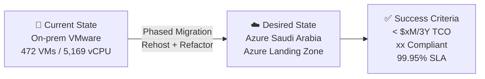

# 📋 Step 1: Requirements - najm

<strong>📑 Requirements Overview</strong>

- [🎯 Project Overview](#-project-overview)
- [🚀 Functional Requirements](#-functional-requirements)
- [⚡ Non-Functional Requirements (NFRs)](#-non-functional-requirements-nfrs)
- [🔒 Compliance & Security Requirements](#-compliance--security-requirements)
- [💰 Budget](#-budget)
- [🔧 Operational Requirements](#-operational-requirements)
- [🌍 Regional Preferences](#-regional-preferences)
- [📊 Complexity Classification](#-complexity-classification)
- [📋 Summary for Architecture Assessment](#-summary-for-architecture-assessment)
- [References](#references)

> Generated by @requirements agent | 2026-03-24

| ⬅️ Previous | 📑 Index            | Next ➡️                                                        |
| ----------- | ------------------- | -------------------------------------------------------------- |
| —           | [README](README.md) | [02-architecture-assessment.md](02-architecture-assessment.md) |

## 🎯 Project Overview

| Field                   | Value                                                                        |
| ----------------------- | ---------------------------------------------------------------------------- |
| **Project Name**        | najm                                                                         |
| **Project Type**        | Datacenter Migration (Rehost + Refactor Hybrid)                              |
| **Timeline**            | 2026 Q2 → 2027 Q4 (18-month phased migration)                                |
| **Primary Stakeholder** | Najm Insurance Services, Saudi Arabia                                        |
| **Business Context**    | 472-VM on-prem VMware to Azure migration competing against AWS $10.2M/3Y bid |
| **IaC Tool**            | iac_tool: Bicep and / or Terraform                                           |

### Business Context

| Field               | Value                                                                                  |
| ------------------- | -------------------------------------------------------------------------------------- |
| Industry / Vertical | Insurance / Financial Services (SAMA-regulated)                                        |
| Company Size        | Enterprise (500+ employees, 180+ IT staff)                                             |
| Current State       | Migration from on-premises VMware datacenter                                           |
| Migration Source    | On-premises VMware (471 VMs, 5,169 vCPU, 20TB RAM, 1,008TB storage)                    |
| Business Drivers    | Infrastructure aging, compliance pressure, cost optimization, scalability, reliability |
| Success Criteria    | Compliance requirements met, zero-downtime for critical claims processing              |

### State Transition

## 🚀 Functional Requirements

### Core Capabilities

| #   | Capability                                | Priority  | Acceptance Criteria                                                          |
| --- | ----------------------------------------- | --------- | ---------------------------------------------------------------------------- |
| 1   | VM rehost (lift-and-shift) for legacy VMs | 🔴 Must   | All 472 VMs operational on Azure with equivalent or better performance       |
| 2   | Refactor candidates to PaaS/containers    | 🔴 Must   | Each workload assessed for rehost vs refactor with cost/benefit comparison   |
| 3   | Azure Hybrid Benefit for Windows/SQL      | 🔴 Must   | 334 Windows + 5 SQL Enterprise VMs running at Linux pricing via AHB          |
| 4   | Hub-spoke enterprise landing zone         | 🔴 Must   | Network segmentation, ExpressRoute connectivity, centralized firewall        |
| 5   | Claims processing continuity              | 🔴 Must   | Minimal-downtime cutover for NDCPRDBSQL00 (40 vCPU, 450GB RAM, 24/7)         |
| 6   | Avaya call center migration               | 🟡 Should | 39 Avaya VMs migrated with vendor certification and call quality maintained  |
| 7   | SQL Server modernization assessment       | 🟡 Should | 5 SQL Enterprise VMs evaluated for SQL MI vs SQL on VM with AHB comparison   |
| 8   | PaaS migration for middleware             | 🟡 Should | Redis, Elasticsearch, RabbitMQ, MongoDB evaluated for Azure PaaS equivalents |
| 9   | Azure Virtual Desktop for VDI             | 🟡 Should | 20+ VDI instances migrated to AVD with equivalent user experience            |
| 10  | ISV license portability validation        | 🟡 Should | QlikView, OutSystems, SolarWinds, Ivanti, Automation Anywhere confirmed      |
| 11  | SharePoint modernization assessment       | 🟢 Could  | Evaluate SharePoint Online vs SharePoint on Azure VMs                        |
| 12  | AD modernization to Entra ID              | 🟢 Could  | 17 AD VMs evaluated for Entra Domain Services replacement                    |
| 13  | AD hosting                                | 🔴 Must   | 3 Domain Controllers per region                                              |

### Rehost vs Refactor Comparison Matrix

> **Requirement**: Every workload category MUST include both rehost and refactor options with cost/benefit analysis.

| Workload Category         | VM Count | Rehost Target                 | Refactor Target                    | Rehost Est. (3Y) | Refactor Est. (3Y) | Recommendation                 |
| ------------------------- | -------- | ----------------------------- | ---------------------------------- | ---------------- | ------------------ | ------------------------------ |
| **Windows App Servers**   | 334      | Azure VMs (Dasv5/Ddsv5) + AHB | Azure App Service / AKS            | Baseline         | -20-30% ops cost   | Rehost first, refactor Wave 4+ |
| **Linux App Servers**     | 138      | Azure VMs (Das_v5/Eas_v5)     | Azure Container Apps / AKS         | Baseline         | -25-35% ops cost   | Rehost first, refactor Wave 4+ |
| **SQL Server Enterprise** | 5        | SQL on Azure VMs + AHB        | Azure SQL Managed Instance         | $69K-120K/VM/3Y  | Evaluate compat.   | Rehost with MI assessment      |
| **Active Directory**      | 17       | AD on Azure VMs               | Microsoft Entra Domain Services    | ~$50K/3Y         | -40-50% savings    | Refactor recommended           |
| **Redis**                 | 10       | Redis on Azure VMs            | Azure Cache for Redis              | ~$30K/3Y         | -30-40% savings    | Refactor recommended           |
| **Elasticsearch**         | 4        | ES on Azure VMs               | Azure AI Search                    | ~$20K/3Y         | -20-30% savings    | Evaluate compatibility         |
| **RabbitMQ**              | 3        | RabbitMQ on Azure VMs         | Azure Service Bus                  | ~$15K/3Y         | -25-35% savings    | Refactor recommended           |
| **MongoDB**               | 2        | MongoDB on Azure VMs          | Azure Cosmos DB for MongoDB        | ~$10K/3Y         | -20-30% savings    | Evaluate compatibility         |
| **Avaya Call Center**     | 39       | Avaya on Azure VMs            | Microsoft Teams (full replacement) | ~$100K/3Y        | Vendor dependent   | Rehost (vendor cert required)  |
| **VDI Instances**         | 20+      | VDI on Azure VMs              | Azure Virtual Desktop (AVD)        | ~$40K/3Y         | -30-40% savings    | Refactor to AVD                |
| **Certificate Services**  | 2        | Cert Services on VMs          | Azure App Gateway (managed certs)  | ~$5K/3Y          | -50-60% savings    | Refactor recommended           |
| **DWH / Analytics**       | 2        | DWH SQL on Azure VMs          | Azure Synapse Analytics            | ~$30K/3Y         | Evaluate scope     | Evaluate for Wave 5            |

### User Types

| User Type               | Description                               | Est. Count  | Access Level         |
| ----------------------- | ----------------------------------------- | ----------- | -------------------- |
| Internal employees      | Najm staff using business applications    | 1,000-5,000 | Contributor / Reader |
| Claims processors       | Staff handling insurance claims 24/7      | 200-500     | Contributor          |
| Call center agents      | Avaya-based customer service agents       | 100-300     | Reader               |
| IT administrators       | Infrastructure and application management | 180+        | Admin                |
| External policyholders  | Customers accessing web portals           | 10K-100K    | Reader (external)    |
| Third-party integrators | ISV vendors and partner systems           | 10-50       | Contributor (scoped) |

### Integrations

| System                    | Direction     | Protocol         | Auth Method                | SLA    |
| ------------------------- | ------------- | ---------------- | -------------------------- | ------ |
| On-premises VMware        | Inbound       | ExpressRoute     | Managed Identity           | 99.95% |
| SAMA reporting systems    | Outbound      | REST / SFTP      | Certificate + MI           | 99.9%  |
| Avaya communication       | Bidirectional | SIP / AMQP       | Network-level + Cert       | 99.9%  |
| QlikView analytics        | Bidirectional | ODBC / REST      | Service Principal          | 99.5%  |
| OutSystems platform       | Bidirectional | REST             | OAuth / API Key            | 99.9%  |
| Commvault backup (Tier-0) | Inbound       | Agent-based      | Certificate                | 99.9%  |
| Microsoft 365 / Entra ID  | Bidirectional | Graph API / LDAP | Entra Connect + Federation | 99.99% |

### Data Types

| Category                    | Sensitivity | Est. Volume | Retention | Residency          |
| --------------------------- | ----------- | ----------- | --------- | ------------------ |
| Insurance claims data       | 🔴 High     | 200+ TB     | 7 years   | Qatar Central only |
| Policyholder PII            | 🔴 High     | 50+ TB      | 10 years  | Qatar Central only |
| Financial transactions      | 🔴 High     | 100+ TB     | 7 years   | Qatar Central only |
| Call recordings (legal)     | 🔴 High     | 50+ TB      | 5 years   | Qatar Central only |
| Application logs            | 🟡 Medium   | 100+ TB     | 1 year    | Qatar Central      |
| Internal business documents | 🟡 Medium   | 200+ TB     | 5 years   | Qatar Central      |
| Dev/test data               | 🟢 Low      | 50+ TB      | 90 days   | Qatar Central      |

### Architecture Pattern

| Field              | Value                                                                                                                                                            |
| ------------------ | ---------------------------------------------------------------------------------------------------------------------------------------------------------------- |
| Workload Pattern   | Hybrid (N-Tier rehost + PaaS refactor + Hub-Spoke landing zone)                                                                                                  |
| Recommended Option | Enterprise hub-spoke with phased migration waves (rehost → assess → refactor)                                                                                    |
| Tier               | Balanced                                                                                                                                                         |
| Justification      | 472 VMs require phased approach; refactor preference for PaaS-eligible workloads; enterprise landing zone mandatory for SAMA compliance and network segmentation |

## ⚡ Non-Functional Requirements (NFRs)

| WAF Pillar     | Metric             | Target                          | Current          | Gap                          |
| -------------- | ------------------ | ------------------------------- | ---------------- | ---------------------------- |
| 🔄 Reliability | SLA                | 99.95%                          | N/A (on-prem)    | Establish cloud SLA baseline |
| 🔄 Reliability | RTO                | 4 hours                         | Unknown          | Define per-tier              |
| 🔄 Reliability | RPO                | 1 hour                          | Unknown          | Define per-tier              |
| ⚡ Performance | API Response (p95) | < 200ms                         | N/A              | Benchmark post-migration     |
| ⚡ Performance | Concurrent Users   | 10,000 - 100,000                | Unknown          | Load test required           |
| ⚡ Performance | Claims Processing  | < 500ms per claim               | Current baseline | Maintain or improve          |
| 🔒 Security    | Auth Method        | Hybrid AD + Entra               | On-prem AD       | Entra Connect sync needed    |
| 🔒 Security    | Encryption         | At-rest + In-transit (TLS 1.2+) | Partial          | Full coverage required       |
| 💰 Cost        | Monthly Budget     | $100,000 - $500,000             | N/A              | TCO target: < $195K/mo avg   |
| 🔧 Operations  | Uptime Monitoring  | Yes (24/7)                      | Partial          | Azure Monitor + Sentinel     |

### Workload Tiering Matrix

> Each workload tier defines differentiated NFRs. Architecture and migration-wave planning MUST use this matrix.

| Tier                           | Workload Examples                                                            | SLA    | RTO      | RPO      | Backup Class                    | Retention | Security Class                                               | Maintenance Tolerance                          |
| ------------------------------ | ---------------------------------------------------------------------------- | ------ | -------- | -------- | ------------------------------- | --------- | ------------------------------------------------------------ | ---------------------------------------------- |
| **Tier-0** (Mission-Critical)  | Claims DB (NDCPRDBSQL00), Avaya call center, Core AD (auth)                  | 99.99% | 15 min   | 5 min    | Continuous (15 min) + Commvault | 1 year    | 🔴 Regulated PII/Financial — CMK, Private Endpoint, MFA-only | Zero — requires CAB + rehearsed cutover window |
| **Tier-1** (Business-Critical) | Policy management apps, CRM, financial reporting, Redis cache, RabbitMQ      | 99.95% | 1 hour   | 15 min   | Hourly                          | 90 days   | 🔴 Regulated — Platform keys, Private Endpoint               | Planned maintenance Saturday 02:00-06:00 AST   |
| **Tier-2** (Business-Standard) | Internal web apps, SharePoint, monitoring dashboards, Elasticsearch, MongoDB | 99.9%  | 4 hours  | 1 hour   | Daily                           | 30 days   | 🟡 Internal — Standard encryption, NSG isolation             | Planned maintenance with 48h notice            |
| **Tier-3** (Non-Critical)      | Dev/test environments, sandbox VMs, training systems                         | 99.5%  | 24 hours | 12 hours | Weekly                          | 7 days    | 🟢 Non-sensitive — Standard encryption                       | Anytime with team notification                 |

### Scalability

| Dimension    | Current       | 6-Month Projection | 12-Month Projection |
| ------------ | ------------- | ------------------ | ------------------- |
| Users        | 1K-10K        | 5K-50K             | 10K-100K            |
| Data Volume  | 756 TB (util) | 850 TB             | 1,000 TB            |
| VMs in Azure | 0             | ~190 (Wave 1-2)    | ~472 (all waves)    |

## 🔒 Compliance & Security Requirements

### Regulatory Frameworks

<strong>SAMA (Saudi Arabian Monetary Authority)</strong> — Applicable

| Requirement                    | Applicability | Notes                                                       |
| ------------------------------ | ------------- | ----------------------------------------------------------- |
| Cloud outsourcing pre-approval | Yes           | SAMA circular requires pre-approval for cloud adoption      |
| Data residency in GCC          | Yes           | Qatar Central is GCC-aligned; verify SAMA acceptance        |
| Encryption requirements        | Yes           | AES-256 at rest, TLS 1.2+ in transit                        |
| Business continuity planning   | Yes           | DR plan with RTO/RPO targets required                       |
| Third-party risk assessment    | Yes           | Microsoft as cloud provider must be assessed                |
| Incident reporting             | Yes           | Security incidents must be reported to SAMA within 24 hours |

<strong>PDPL (Saudi Personal Data Protection Law)</strong> — Applicable

| Requirement                    | Applicability | Notes                                                  |
| ------------------------------ | ------------- | ------------------------------------------------------ |
| PII processing controls        | Yes           | Policyholder data requires explicit consent mechanisms |
| Data minimization              | Yes           | Collect only necessary personal data                   |
| Cross-border transfer controls | Yes           | Qatar Central satisfies GCC data residency             |
| Right to data access/deletion  | Yes           | Must implement data subject request workflows          |

<strong>ISO 27001</strong> — Applicable

| Control Area        | Applicability | Notes                                            |
| ------------------- | ------------- | ------------------------------------------------ |
| Access control      | Yes           | RBAC, MFA, least privilege via Entra ID          |
| Asset management    | Yes           | Azure Resource Graph for inventory               |
| Incident management | Yes           | Microsoft Sentinel for SIEM + automated response |
| Cryptography        | Yes           | Azure Key Vault for key management               |
| Operations security | Yes           | Azure Monitor, Defender for Cloud                |

<strong>SOC 2 Type II</strong> — Applicable

| Trust Principle | Applicability | Notes                                                    |
| --------------- | ------------- | -------------------------------------------------------- |
| Security        | Yes           | Defender for Cloud, NSGs, Azure Firewall, DDoS           |
| Availability    | Yes           | 99.95% SLA, Availability Zones, Azure Backup + ASR       |
| Confidentiality | Yes           | Encryption at rest/transit, Private Endpoints, Key Vault |
| Processing      | Yes           | Azure Policy for governance, audit logging               |
| Privacy         | Yes           | PDPL alignment, data classification in Purview           |

<strong>PCI-DSS</strong> — Not Applicable

| Requirement             | Applicability | Notes                                         |
| ----------------------- | ------------- | --------------------------------------------- |
| Cardholder data storage | No            | Insurance — no direct payment card processing |

### Data Residency

| Requirement              | Value                                                    |
| ------------------------ | -------------------------------------------------------- |
| Primary Region           | qatarcentral (Qatar Central)                             |
| Data Sovereignty         | GCC-specific (SAMA requires GCC-region hosting)          |
| Cross-region Replication | Not required initially; evaluate for DR in future phases |

> **EU Data Boundary Note**: Azure Qatar Central is outside the EU Data Boundary. Global services (Front Door, Entra External ID, Traffic Manager, Azure DNS) are excluded from Microsoft EU Data Boundary. This is acceptable for SAMA compliance which requires GCC hosting, not EU hosting.

### Authentication & Authorization

| Requirement       | Value                                                         |
| ----------------- | ------------------------------------------------------------- |
| Identity Provider | Hybrid: On-prem AD + Entra Connect sync to Entra ID           |
| MFA Requirement   | Required for all administrative access; Conditional for users |
| RBAC Model        | Azure RBAC with custom roles for operations team              |

### Network Security

| Control                     | Required | Notes                                                |
| --------------------------- | -------- | ---------------------------------------------------- |
| Private endpoints           | ✅       | All data services (SQL, Storage, Key Vault)          |
| VNet integration            | ✅       | Hub-spoke with ExpressRoute to on-prem               |
| Public endpoints acceptable | ❌       | Production data services must be private-only        |
| WAF required                | ✅       | Azure Front Door + WAF for internet-facing workloads |
| DDoS Protection             | ✅       | DDoS Network Protection on hub VNet                  |

### Recommended Security Controls

| Control               | Recommended | User Confirmed | Notes                                   |
| --------------------- | ----------- | -------------- | --------------------------------------- |
| Managed Identity      | Yes         | Yes            | Prefer over keys for all service auth   |
| Private Endpoints     | Yes         | Yes            | All data services (SQL, Storage, KV)    |
| WAF                   | Yes         | Yes            | Azure Front Door + WAF Premium          |
| Key Vault for Secrets | Yes         | Yes            | Centralized secrets, certificates, keys |
| Diagnostic Settings   | Yes         | Yes            | All resources → Log Analytics workspace |
| TLS 1.2 Minimum       | Yes         | Yes            | Enforced via Azure Policy               |
| Encryption at Rest    | Yes         | Yes            | Platform-managed keys (CMK for Tier-0)  |
| Network Isolation     | Yes         | Yes            | Hub-spoke, NSGs, Private Link, Firewall |

## 💰 Budget

| Field              | Value                                                             |
| ------------------ | ----------------------------------------------------------------- |
| 💰 Monthly Budget  | $100,000 - $500,000 (target: ~$195K/month average over 3 years)   |
| 📅 3-Year Budget   | Target: < $7,011,000 (31% below AWS $10.2M bid)                   |
| 🚦 Limit Type      | 🟡 Soft — competitive bid; must undercut AWS but with flexibility |
| 📊 Cost Model Pref | Committed (3-Year Reserved Instances, No Upfront)                 |

### Cost Optimization Priorities

| Priority                          | Selected | Impact                                       |
| --------------------------------- | -------- | -------------------------------------------- |
| Azure Hybrid Benefit (Windows)    | ☑        | High — saves ~$2.93M/3Y on 334 Windows VMs   |
| Azure Hybrid Benefit (SQL)        | ☑        | High — saves on 5 SQL Enterprise VMs         |
| 3-Year Reserved Instances         | ☑        | High — 40-60% savings vs PAYG                |
| Dev/Test pricing (91 VMs)         | ☑        | Medium — 40% discount on qualifying VMs      |
| Refactor to PaaS where possible   | ☑        | Medium — 20-50% operational savings          |
| Azure Backup vs Commvault         | ☑        | High — saves ~$1.17M/3Y (hybrid approach)    |
| Azure-native security vs Fortinet | ☑        | High — saves ~$1.57M/3Y                      |
| Spot instances for non-critical   | ☐        | Low — not applicable for insurance workloads |

### TCO Summary (from Counter-Proposal Analysis)

| Line Item         | AWS 3Y Total    | Azure 3Y Total | Azure Savings          |
| ----------------- | --------------- | -------------- | ---------------------- |
| Compute           | $4,444,755      | $2,667,254     | $1,777,501             |
| Storage           | $1,888,724      | $1,962,274     | -$73,550               |
| Data Transfer     | $350,394        | $288,276       | $62,118                |
| Landing Zone      | $349,110        | $327,600       | $21,510                |
| Backup            | $1,863,276      | $691,200       | $1,172,076             |
| Security/Firewall | $2,100,000      | $534,384       | $1,565,616             |
| Support           | $703,298        | $540,000       | $163,298               |
| Migration Credits | -$753,986       | $0             | -$753,986              |
| **TOTAL**         | **$10,191,586** | **$7,010,988** | **$3,180,598 (31.2%)** |

> **Note**: Storage is $73K higher on Azure. Adversarial review flagged this for optimization (tier mix, HDD for cold data). Backup pricing and Sentinel ingestion volumes need validation.

## 🔧 Operational Requirements

### Monitoring & Alerting

| Capability                | Required | Tool / Service              | Notes                             |
| ------------------------- | -------- | --------------------------- | --------------------------------- |
| Application monitoring    | ✅       | Application Insights        | For refactored PaaS workloads     |
| Infrastructure monitoring | ✅       | Azure Monitor + VM Insights | All 472 VMs                       |
| Log aggregation           | ✅       | Log Analytics workspace     | Centralized in hub subscription   |
| SIEM                      | ✅       | Microsoft Sentinel          | Security events, compliance audit |
| Alert notifications       | ✅       | Email + Teams + PagerDuty   | Tiered: P1=PagerDuty, P2+=Teams   |
| Custom dashboards         | ✅       | Azure Monitor workbooks     | Ops team + management views       |

### Support & Maintenance

| Requirement         | Value                                                 |
| ------------------- | ----------------------------------------------------- |
| Support Hours       | 24/7 for production; business hours for dev/test      |
| On-call Requirement | Yes — infrastructure team rotation                    |
| Maintenance Windows | Saturdays 02:00-06:00 AST (Arabia Standard Time)      |
| Change Management   | Formal CAB for production; team approval for dev/test |

### Backup & Disaster Recovery

| Component               | Backup Frequency | Retention | Recovery Method                      |
| ----------------------- | ---------------- | --------- | ------------------------------------ |
| Tier-0 SQL Enterprise   | Continuous (15m) | 1 year    | Commvault (retained) + ASR           |
| Production VMs          | Daily            | 30 days   | Azure Backup vault                   |
| Production databases    | Hourly           | 90 days   | Azure Backup + point-in-time restore |
| Dev/test VMs            | Weekly           | 7 days    | Azure Backup (basic tier)            |
| Call recordings (Avaya) | Daily            | 5 years   | Azure Blob (Cool tier) + lifecycle   |

### Staff Training Requirements

| Certification | Target Audience       | Est. Count | Est. Cost  |
| ------------- | --------------------- | ---------- | ---------- |
| AZ-900        | All IT staff          | 180        | ~$180K     |
| AZ-104        | Infrastructure admins | 30         | ~$90K      |
| AZ-305        | Solution architects   | 5          | ~$25K      |
| AZ-500        | Security team         | 10         | ~$40K      |
| **Total**     |                       |            | **~$335K** |

## 🌍 Regional Preferences

| Preference         | Value               | Justification                                             |
| ------------------ | ------------------- | --------------------------------------------------------- |
| Primary Region     | qatarcentral        | SAMA compliance, Saudi data sovereignty, GCC proximity    |
| Failover Region    | uaenorth (evaluate) | GCC alternative for DR if cross-region replication needed |
| Availability Zones | Required            | 99.95% SLA for production workloads                       |

> **SAMA Data Sovereignty**: Qatar Central is GCC-aligned. SAMA circular 2019 allows GCC cloud usage with specific pre-approval requirements. Azure team must engage SAMA directly for regulatory sign-off before migration.

---

## 📊 Complexity Classification

| Field      | Value                                                                                                                                                                                                                  |
| ---------- | ---------------------------------------------------------------------------------------------------------------------------------------------------------------------------------------------------------------------- |
| Complexity | `complex`                                                                                                                                                                                                              |
| Criteria   | >8 resource types, multi-region potential, SAMA custom policies, multi-env (Dev + Prod)                                                                                                                                |
| Rationale  | 472 VMs across multiple workload types, SAMA regulatory compliance, hub-spoke networking, ExpressRoute, Avaya vendor dependency, ISV license portability, 18-month phased migration, rehost + refactor hybrid strategy |

---

## 📋 Summary for Architecture Assessment

### Handoff Summary

| Aspect               | Key Points                                                                                                                                                                                                                                                               |
| -------------------- | ------------------------------------------------------------------------------------------------------------------------------------------------------------------------------------------------------------------------------------------------------------------------ |
| Critical Constraints | 1. SAMA compliance (Qatar Central, pre-approval required) 2. Azure Hybrid Benefit validation (SA entitlements for 334 Win + 5 SQL) 3. Avaya vendor certification for Azure                                                                                               |
| Key Decisions        | Region: qatarcentral; IaC: Bicep; Hybrid AD + Entra Connect; Balanced tier; 3Y RIs; Rehost-first with refactor assessment for every workload                                                                                                                             |
| Open Risks           | 1. SAMA pre-approval timeline 2. AHB SA entitlement coverage (need SAM audit) 3. Avaya Azure certification 4. ISV license portability (15+ vendors) 5. Sentinel ingestion cost at scale (472 VMs) 6. Storage cost parity with AWS 7. Professional services SOW undefined |
| Recommended Pattern  | Hybrid (N-Tier rehost + PaaS refactor + Hub-Spoke landing zone)                                                                                                                                                                                                          |
| Budget Envelope      | $100K-$500K/month; 3Y target < $7.01M                                                                                                                                                                                                                                    |

### Adversarial Findings (from Pre-Existing Reviews)

The counter-proposal has already undergone 3 adversarial reviews. Key findings requiring architect attention:

| #   | Severity    | Finding                                                            | Impact                       |
| --- | ----------- | ------------------------------------------------------------------ | ---------------------------- |
| 1   | 🔴 Critical | AHB assumes 100% SA coverage — not validated                       | $730K risk if 25% lack SA    |
| 2   | 🔴 Critical | Compute pricing uses hardcoded lookup, not Azure Pricing API       | Pricing accuracy risk        |
| 3   | 🔴 Critical | $0 professional services — AWS includes $1.33M co-funded           | Missing $600-900K line item  |
| 4   | 🔴 Critical | Qatar Central — no SAMA customer references                        | Regulatory risk              |
| 5   | 🟡 High     | Storage cost $73K higher than AWS                                  | Tier mix optimization needed |
| 6   | 🟡 High     | Backup pricing unrealistically low ($19.2K/mo for 472 VMs + 756TB) | Re-price to $25-35K/mo       |
| 7   | 🟡 High     | Sentinel at $4K/mo — needs $8-10K/mo with commitment tier          | Under-estimated by $4-6K/mo  |
| 8   | 🟡 High     | Dev/Test pricing for 91 VMs requires MSDN subscription validation  | Licensing risk               |

### Challenger Review Findings — Gated Requirements for Architecture

> Pass 1 adversarial review identified 7 findings. REQ-003 resolved (workload tiering added). Remaining documented as formal gates.

| ID      | Severity     | Title                                                       | Gate / Owner                                                                                                                                                                     | Resolution Target |
| ------- | ------------ | ----------------------------------------------------------- | -------------------------------------------------------------------------------------------------------------------------------------------------------------------------------- | ----------------- |
| REQ-001 | must_fix     | Live Azure Policy discovery not a stated gate               | Step 3.5 Governance agent MUST run live Azure Policy discovery before Step 4 IaC planning                                                                                        | Pre-Step 4        |
| REQ-002 | must_fix     | Data residency vs DR requirements inconsistent              | Architect MUST define per-tier DR policy: zone-redundancy-only vs cross-region, with regulator-approved secondary region (UAE North) or formal single-region exception           | Step 2            |
| REQ-003 | ~~must_fix~~ | ~~Workload tiering missing~~                                | **RESOLVED** — Tier-0 through Tier-3 matrix added to NFRs                                                                                                                        | ✅ Done           |
| REQ-004 | must_fix     | Tier-0 cutover/rollback criteria undefined                  | Architect MUST define measurable cutover windows, rollback triggers, replication lag tolerance, reconciliation criteria, and rehearsal requirements for claims DB, Avaya, and AD | Step 2            |
| REQ-005 | should_fix   | Budget anchored to optimistic proposal                      | Architect SHOULD present floor/base/ceiling cost scenarios with contingency %, dual-run cost, and professional services line items                                               | Step 2            |
| REQ-006 | should_fix   | Qatar Central service availability/quota validation missing | Architect SHOULD add a pre-IaC validation gate for Qatar Central service availability, zonal support, subscription quotas, and ExpressRoute provider reachability                | Step 2            |
| REQ-007 | should_fix   | Vendor/licensing dependencies are advisory, not wave gates  | Architect SHOULD promote Avaya cert, ISV portability, dev/test MSDN eligibility, and AHB SA coverage into wave-specific go/no-go gates with evidence requirements                | Step 4            |

### Requirements Completeness

| Section                  | Status | Notes                                                                  |
| ------------------------ | ------ | ---------------------------------------------------------------------- |
| Project Overview         | ✅     | Full business context captured                                         |
| Functional Requirements  | ✅     | Rehost + refactor comparison matrix included                           |
| NFRs                     | ✅     | SLA, RTO/RPO, performance, scalability defined; workload tiering added |
| Compliance & Security    | ✅     | SAMA, PDPL, ISO 27001, SOC 2 frameworks covered                        |
| Budget                   | ✅     | TCO comparison with AWS included                                       |
| Operational Requirements | ✅     | Monitoring, backup/DR, training requirements defined                   |
| Challenger Findings      | ✅     | 7 findings documented; 1 resolved, 6 gated to downstream steps         |

---

## References

> [!NOTE]
> 📚 The following Microsoft Learn resources provide additional guidance.

| Topic                      | Link                                                                                                                      |
| -------------------------- | ------------------------------------------------------------------------------------------------------------------------- |
| Well-Architected Framework | [Overview](https://learn.microsoft.com/azure/well-architected/)                                                           |
| Azure Regions              | [Products by Region](https://azure.microsoft.com/explore/global-infrastructure/products-by-region/)                       |
| Compliance Offerings       | [Azure Compliance](https://learn.microsoft.com/azure/compliance/)                                                         |
| Azure Hybrid Benefit       | [AHB Overview](https://learn.microsoft.com/azure/cost-management-billing/scope-level/overview-azure-hybrid-benefit-scope) |
| SAMA Cloud Framework       | [SAMA Regulatory Framework](https://www.sama.gov.sa/en-us/RulesInstructions/Pages/default.aspx)                           |
| Cloud Adoption Framework   | [CAF Overview](https://learn.microsoft.com/azure/cloud-adoption-framework/)                                               |
| Landing Zone Architecture  | [Enterprise-Scale](https://learn.microsoft.com/azure/cloud-adoption-framework/ready/landing-zone/)                        |

### Source Artifacts

| Artifact               | Path                                                                                  |
| ---------------------- | ------------------------------------------------------------------------------------- |
| Migration prompt       | [plan-najmAwsToAzureMigration.prompt.md](docs/plan-najmAwsToAzureMigration.prompt.md) |
| Azure counter-proposal | [najm-azure-counter-proposal.md](output/najm-azure-counter-proposal.md)               |
| Adversarial reviews    | [najm-adversarial-reviews.md](output/najm-adversarial-reviews.md)                     |
| TCO data (JSON)        | [najm-tco-data.json](output/najm-tco-data.json)                                       |
| VM mapping (CSV)       | [najm-vm-azure-mapping.csv](output/najm-vm-azure-mapping.csv)                         |
| Architecture diagram   | [najm-azure-architecture.png](output/najm-azure-architecture.png)                     |

---

| ⬅️ — | 🏠 [Project Index](README.md) | ➡️ [02-architecture-assessment.md](02-architecture-assessment.md) |
| ---- | ----------------------------- | ----------------------------------------------------------------- |

