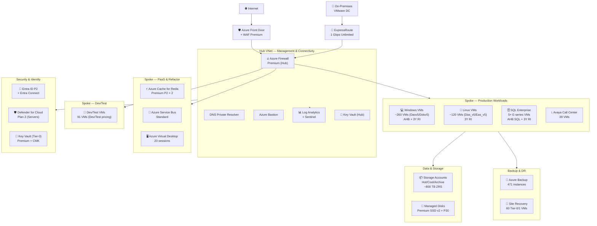

# 🏛️ Step 2: Architecture Assessment - najm

<strong>📑 Assessment Contents</strong>

- [✅ Requirements Validation](#-requirements-validation)
- [💎 Executive Summary](#-executive-summary)
- [🏛️ WAF Pillar Assessment](#-waf-pillar-assessment)
- [📦 Resource SKU Recommendations](#-resource-sku-recommendations)
- [🎯 Architecture Decision Summary](#-architecture-decision-summary)
- [🚀 Implementation Handoff](#-implementation-handoff)
- [🔒 Approval Gate](#-approval-gate)
- [References](#references)

> Generated by architect agent | 2026-03-24

| ⬅️ Previous                              | 📑 Index            | Next ➡️                                            |
| ---------------------------------------- | ------------------- | -------------------------------------------------- |
| [01-requirements.md](01-requirements.md) | [README](README.md) | [03-des-cost-estimate.md](03-des-cost-estimate.md) |

## ✅ Requirements Validation

| Requirement Area        | Status     | Validation Notes                                                                          |
| ----------------------- | ---------- | ----------------------------------------------------------------------------------------- |
| NFRs (SLA, RTO, RPO)    | ✅ Defined | 99.95% SLA, RTO 4h / RPO 1h baseline; 4-tier workload matrix with Tier-0 at 99.99%/15m/5m |
| Compliance requirements | ✅ Defined | SAMA, PDPL, ISO 27001, SOC 2 Type II; PCI-DSS not applicable                              |
| Budget (approximate)    | ✅ Defined | $100K-$500K/month; 3Y target < $7.01M; 3Y RI + AHB cost model                             |
| Scale requirements      | ✅ Defined | 472 VMs, 1K-100K concurrent users, 756TB → 1PB data growth over 12 months                 |
| Security controls       | ✅ Defined | Managed Identity, Private Endpoints, WAF, TLS 1.2, CMK for Tier-0, Sentinel SIEM          |
| Data residency          | ✅ Defined | Qatar Central (GCC-aligned); UAE North under evaluation for Tier-0 DR                     |

---

## 💎 Executive Summary

This assessment evaluates a **472-VM on-premises VMware to Azure Qatar Central migration** for Najm Insurance Services, a SAMA-regulated enterprise. The architecture follows a **hybrid rehost + refactor strategy** with an enterprise hub-spoke landing zone, designed to meet SAMA compliance while delivering 31% cost savings over the competing AWS $10.2M/3Y bid.

**Primary optimization**: Security (SAMA compliance) and Cost (competitive positioning).
**Key trade-off**: Single-region design (Qatar Central) maximizes data sovereignty but limits DR options for Tier-0 workloads; zone-redundancy with SQL AG + ASR to UAE North provides a compliant middle ground.

### Recommended Architecture

### Service Maturity Assessment

| Service                  | Lifecycle | Qatar Central | AZ Support | AVM (Bicep)                              |
| ------------------------ | --------- | ------------- | ---------- | ---------------------------------------- |
| Azure VMs (Dasv5/Easv5)  | GA        | ✅ Yes        | ✅ 3 AZs   | `avm/res/compute/virtual-machine`        |
| Azure Firewall Premium   | GA        | ✅ Yes        | ✅ Yes     | `avm/res/network/azure-firewall`         |
| ExpressRoute             | GA        | ✅ Yes        | N/A        | `avm/res/network/express-route-circuit`  |
| Azure Front Door Premium | GA        | 🌐 Global     | N/A        | `avm/res/cdn/profile`                    |
| Microsoft Sentinel       | GA        | ✅ Yes        | N/A        | Bicep resource                           |
| Defender for Cloud       | GA        | 🌐 Global     | N/A        | Bicep resource                           |
| Azure Key Vault          | GA        | ✅ Yes        | ✅ Yes     | `avm/res/key-vault/vault`                |
| Azure Backup             | GA        | ✅ Yes        | ✅ Yes     | Bicep resource                           |
| Azure Site Recovery      | GA        | ✅ Yes        | ✅ Yes     | Bicep resource                           |
| Azure Monitor / LA       | GA        | ✅ Yes        | N/A        | `avm/res/operational-insights/workspace` |
| Azure Cache for Redis    | GA        | ✅ Yes        | ✅ Yes     | `avm/res/cache/redis`                    |
| Azure Service Bus        | GA        | ✅ Yes        | ✅ Yes     | `avm/res/service-bus/namespace`          |
| Azure Virtual Desktop    | GA        | ✅ Yes        | ✅ Yes     | `avm/res/desktop-virtualization`         |
| DDoS Network Protection  | GA        | ✅ Yes        | N/A        | `avm/res/network/ddos-protection-plan`   |
| Storage Accounts         | GA        | ✅ Yes        | ✅ ZRS     | `avm/res/storage/storage-account`        |
| Managed Disks            | GA        | ✅ Yes        | ✅ ZRS     | Via VM AVM module                        |

> All recommended services are **GA in Qatar Central** with Availability Zone support where applicable. No deprecated services are used.

---

## 🏛️ WAF Pillar Assessment

### Overall Scores

| Pillar                    | Score | Confidence | Summary                                                                          |
| ------------------------- | ----- | ---------- | -------------------------------------------------------------------------------- |
| 🔒 Security               | 8/10  | High       | Comprehensive defense-in-depth with SAMA-aligned controls; CMK + PE + Sentinel   |
| 🔄 Reliability            | 7/10  | Medium     | Zone-redundant prod workloads; single-region limits DR; ASR mitigates for Tier-0 |
| ⚡ Performance            | 7/10  | Medium     | Right-sized VM SKUs from mapping analysis; no load testing baseline yet          |
| 💰 Cost Optimization      | 7/10  | Medium     | AHB + 3Y RI + native security saves ~$3.9M/3Y vs Azure PAYG; ~$4.2M/3Y vs AWS    |
| 🔧 Operational Excellence | 6/10  | Medium     | Monitoring + SIEM defined; no IaC CI/CD pipeline or runbook automation yet       |

**Primary Pillar Optimized**: Security (SAMA compliance is non-negotiable)
**Trade-offs Accepted**: Operations (6/10) traded for Security (8/10) and Cost (7/10); zone-only DR traded for data sovereignty

---

### 🔒 Security Assessment (8/10)

**Strengths:**

- Defense-in-depth: Azure Firewall Premium (hub) → NSGs (spoke) → Private Endpoints (data) → WAF (edge)
- Managed Identity for all service-to-service authentication; no keys/connection strings
- TLS 1.2 minimum enforced via Azure Policy on all services
- CMK via Key Vault Premium for Tier-0 data (claims DB, policyholder PII)
- Microsoft Sentinel (100 GB/day commitment) replacing Fortinet SIEM — $1.57M/3Y savings
- Microsoft Defender for Cloud Plan 2 on all 472 servers
- Hybrid identity: Entra Connect sync with Conditional Access + MFA

**Gaps:**

- ⚠️ **SAMA Engagement Plan absent** — no process owner, timeline, or denial fallback for cloud pre-approval (ARCH-P1-001)
- ⚠️ **Management group hierarchy not defined** — no ALZ-aligned governance inheritance (ARCH-P1-002)
- ⚠️ **Azure Policy initiative incomplete** — only 2 of ~20 required SAMA policies defined (ARCH-P1-003)
- ⚠️ **PIM not configured** — Entra P2 budgeted but no JIT admin access, approval workflows, or break-glass accounts (ARCH-P1-004)
- ⚠️ **Data classification deferred** — SAMA/PDPL require controls before migrating regulated PII; interim tagging scheme needed for Wave 1-2 (ARCH-P1-005)
- ⚠️ **Key Vault uses legacy access policies** — must use RBAC model with separation of duties (ARCH-P1-006)
- ⚠️ **Sentinel SOAR playbooks undefined** — SAMA 24-hour incident reporting workflow not operationalized (ARCH-P1-008)
- SAMA customer references for Qatar Central not yet confirmed by Microsoft
- CMK key rotation policy: 90-day auto-rotation defined but not yet implemented
- Conditional Access named locations (GCC IP ranges), device compliance, risk-based policies not yet scoped (ARCH-P1-010)
- Certificate lifecycle management strategy not defined
- NSG microsegmentation and flow logs not defined (ARCH-P1-009)
- Backup immutability controls absent — no immutable vault, MUA, or CMK for backup (ARCH-P1-011)

**Recommendations:**

1. **SAMA Engagement Plan** (ARCH-P1-001): Named process owner + SAMA liaison, submission timeline (pre-Wave-1 gate), documentation checklist, denial fallback for Tier-0 DR, stop-rule: Wave 1 cannot begin without SAMA written pre-approval
2. **Management Group Hierarchy** (ARCH-P1-002): Root MG → Platform (Connectivity, Identity, Management) + Landing Zones (Production, Dev/Test) + Sandbox. SAMA policies assigned at Landing Zones MG level
3. **SAMA Policy Initiative** (ARCH-P1-003): 15-20 policies including: allowed locations (qatarcentral + uaenorth for ASR), require PE, deny public network access, require diagnostics, TLS 1.2, deny public blob, require encryption, require NSGs, deny public IPs, require tags. Gate: Step 3.5 governance discovery before Step 4
4. **PIM Configuration** (ARCH-P1-004): All admin roles PIM-eligible (not permanent), max 8h activation with justification, approval required for Owner/Contributor on production, PIM audit logs → Sentinel, 2 break-glass accounts with monitoring alerts
5. **Interim Data Classification** (ARCH-P1-005): Azure resource tags (DataClassification: Regulated-PII/Regulated-Financial/Internal/Public) enforced via Policy for Wave 1-2; accelerate Microsoft Purview to Wave 2 for automated classification
6. **Key Vault RBAC** (ARCH-P1-006): RBAC authorization model (not access policies); Key Vault Administrator (security team), Key Vault Crypto User (workloads via MI), Key Vault Reader (auditors); 90-day CMK auto-rotation via Key Vault rotation policy with Event Grid notifications
7. **Sentinel SOAR** (ARCH-P1-008): Minimum data connectors (Azure Activity, Entra Sign-in/Audit, Defender, Firewall, NSG Flow, Key Vault, DNS); SAMA-aligned analytics rules; auto-classification → SAMA incident report template → CISO notification → 24h SLA tracking
8. **Conditional Access** (ARCH-P1-010): Admins: compliant device + MFA + named location (Saudi/GCC) + PIM; high-risk sign-ins: block; session: 12h admin, 24h user; block legacy auth; 2 break-glass CA exclusions
9. **NSG Microsegmentation** (ARCH-P1-009): Default deny all inbound; ASGs per workload (Claims, Avaya, WebApps, Management); NSG flow logs v2 → LA + Traffic Analytics
10. **Backup Immutability** (ARCH-P1-011): Immutable vault + multi-user authorization + CMK for Tier-0 backup vaults; soft delete non-overridable 14+ days; backup security alerts → Sentinel
11. Request Microsoft SAMA reference architecture pack and Qatar Central customer references

### 🔄 Reliability Assessment (7/10)

**Composite SLA Analysis** (ARCH-P2-001):

| Tier              | Request Path                                                                | Component SLAs                | Composite  | Target | Status |
| ----------------- | --------------------------------------------------------------------------- | ----------------------------- | ---------- | ------ | ------ |
| Tier-0 (99.99%)   | Front Door (99.99%) → Firewall (99.95%) → VM-AZ+AG (99.99%) → Disk (99.99%) | 99.99 × 99.95 × 99.99 × 99.99 | **99.92%** | 99.99% | ❌ Gap |
| Tier-1 (99.95%)   | Front Door (99.99%) → Firewall (99.95%) → VM-AZ (99.99%) → Disk (99.99%)    | 99.99 × 99.95 × 99.99 × 99.99 | **99.92%** | 99.95% | ❌ Gap |
| Tier-2 (99.9%)    | Firewall (99.95%) → VM-AZ (99.99%) → Disk (99.99%)                          | 99.95 × 99.99 × 99.99         | **99.93%** | 99.9%  | ✅ Met |
| Internal (Tier-0) | ER (99.95%) → Firewall (99.95%) → VM+AG (99.99%)                            | 99.95 × 99.95 × 99.99         | **99.89%** | 99.99% | ❌ Gap |

> ⚠️ **Risk**: Composite SLA for Tier-0/1 falls below targets. Firewall (99.95%) is the bottleneck. Mitigation: Firewall health-probe bypass for Tier-0 (Azure Front Door direct-to-backend for health probes), or accept 99.92% with documented SAMA exemption. SQL AG across AZs (below) provides intra-tier redundancy.

**Strengths:**

- Availability Zones for all production workloads across 3 AZs in Qatar Central
- 4-tier workload model with differentiated RTO/RPO (Tier-0: 15min/5min → Tier-3: 24h/12h)
- Azure Site Recovery for 60 Tier-0/Tier-1 VMs (replication to UAE North pending SAMA approval)
- Azure Backup for all 471 VMs with tier-appropriate retention (30 days → 7 days)
- Commvault retained for Tier-0 SQL continuous backup (15-minute RPO)
- ExpressRoute with zone-redundant gateway (ErGw2AZ)
- **SQL Always On AG** across 2-3 AZs with synchronous commit for Tier-0 zero-RPO intra-region failover (ARCH-P2-002)

**Gaps:**

- ⚠️ **REQ-002 (must_fix)**: Single-region design creates tension between 99.99% Tier-0 SLA and SAMA data residency — zone redundancy + SQL AG provides 99.99% intra-region but cannot cover full-region outages
- ⚠️ **REQ-004 (must_fix)**: Tier-0 cutover/rollback criteria not yet measurable
- ⚠️ **Single ExpressRoute circuit** — total hybrid connectivity SPOF for 472 VMs (ARCH-P2-003). Solution: dual circuits or S2S VPN backup required
- ⚠️ **No DR fallback if SAMA denies UAE North** — Tier-0 DR strategy depends entirely on pending approval (ARCH-P2-005)
- ⚠️ **No DR drill schedule** — 99.99% Tier-0 SLA untested; SAMA requires BC testing (ARCH-P2-006)
- Service Bus Standard lacks zone redundancy (99.9% SLA < Tier-1 99.95% target) (ARCH-P2-008)
- Dual backup system (Commvault + Azure Backup) restore priority not documented (ARCH-P2-009)
- No health model or failure cascade analysis for 25-resource architecture (ARCH-P2-010)

**Recommendations:**

1. **SQL Always On AG** (ARCH-P2-002): Deploy SQL Server AG across 2-3 AZs with synchronous commit for Tier-0 claims DB. Azure LB or DNN listener for automatic failover. Reserves ASR to UAE North for regional-failure DR tier only. Cost: +~$1,243/mo for secondary E64as_v5
2. **ExpressRoute Redundancy** (ARCH-P2-003): Deploy S2S VPN gateway as failover path (~$350/mo) or second ER circuit via different provider (~$1,200/mo). Configure BGP route priorities for automatic failover. Include in base estimate
3. **Backup Vault ZRS** (ARCH-P2-004): Change production vaults from LRS to ZRS — aligns backup redundancy with zone-redundant production strategy. Cost: +~$1,500-2,000/mo. Keep LRS for Dev/Test
4. **SAMA DR Fallback Decision Tree** (ARCH-P2-005): (a) If approved: ASR cross-region as designed. (b) If denied: intra-region active-active across 3 AZs + SQL AG + formal SLA downgrade to 99.95% with SAMA exemption + cold-start DR playbook via Azure Backup (RTO 4h). (c) Explore on-premises DR site as hybrid fallback
5. **DR Testing Cadence** (ARCH-P2-006): Tier-0: quarterly ASR failover drills with measured RTO/RPO. Tier-1: semi-annual. Annual full-region failure simulation. Azure Chaos Studio for zone failure injection, ER disconnect, Firewall restart, SQL AG failover. Pass/fail criteria per drill
6. **Tier-0 cutover criteria** (REQ-004): Max 15-min outage window, rollback deadline T+4h, replication lag < 5 min, data reconciliation via checksum, mandatory rehearsal before production cutover
7. **Service Bus Premium** (ARCH-P2-008): Upgrade to Premium (~$668/mo) for AZ support, 99.95% SLA, dedicated capacity, Private Endpoint. Justified for Tier-1 business-critical messaging replacing production RabbitMQ
8. **Restore Decision Tree** (ARCH-P2-009): Primary: Commvault for point-in-time SQL restore. Secondary: Azure Backup for VM-level restore. Tertiary: ASR failover for regional DR. Documented runbook with escalation triggers
9. Add Connection Monitor for ExpressRoute health and failover alerting
10. **Health Model** (ARCH-P2-010): Create dependency graph for all 25 resource types with component failure blast radius, health signals, and monitoring thresholds

### ⚡ Performance Assessment (7/10)

**Strengths:**

- Right-sized VM SKUs from detailed VM mapping analysis (472 VMs mapped to Dasv5/Ddsv5/Easv5)
- Azure Front Door Premium for global CDN acceleration and edge WAF
- Azure Cache for Redis Premium P2 for session/data caching (refactored from 10 Redis VMs)
- Claims DB on E64as_v5 (64 vCPU, 512 GB RAM) — matched to current 40 vCPU/450 GB workload with headroom
- Premium SSD v2 with configurable IOPS for Tier-0 SQL workloads

**Gaps:**

- No load testing baseline from on-premises environment
- 10K-100K concurrent user range too wide for definitive sizing
- Storage IOPS requirements not profiled per workload tier
- Network latency from Saudi/GCC users to Qatar Central not measured
- PaaS refactor candidates (App Service, AKS) sizing deferred to Wave 4+

**Recommendations:**

1. Deploy Azure Load Testing in Wave 1 for claims processing baseline (target: < 500ms p95)
2. Enable VM Insights on all migrated VMs for right-sizing validation within 30 days post-migration
3. Configure Premium SSD v2 with provisioned IOPS for Tier-0 SQL (start at 5,000 IOPS, scale based on monitoring)
4. Implement Application Insights for early PaaS refactor candidates
5. Measure latency from Riyadh/Jeddah offices to Qatar Central via ExpressRoute test probes

### 💰 Cost Assessment (7/10)

> All prices sourced from Azure Retail Prices API (qatarcentral, queried 2026-03-24).

| Service                        | SKU                                    |   Monthly Cost | Notes                                      |
| ------------------------------ | -------------------------------------- | -------------: | ------------------------------------------ |
| Compute — Windows VMs (AHB+RI) | Dasv5/Ddsv5 × ~260                     |        $18,768 | 3Y RI at Linux rate via AHB                |
| Compute — Linux VMs (RI)       | Das_v5/Eas_v5 × ~120                   |         $9,645 | 3Y RI pricing                              |
| Compute — SQL Enterprise (AHB) | E32/E64/E96 × 5                        |         $4,971 | AHB SQL + 3Y RI                            |
| Compute — Dev/Test VMs         | Dasv5 × 91                             |         $5,369 | Dev/Test pricing (no Windows license)      |
| Azure Firewall Premium         | 1 instance                             |         $1,204 | $0.11/hr capacity + ~$480 data processing  |
| ExpressRoute                   | ErGw2AZ + 1 Gbps Std Unl.              |         $1,230 | Gateway $461/mo + circuit ~$769/mo         |
| Azure Front Door Premium       | Global                                 |           $500 | Base + ~5 TB transfer                      |
| DDoS Network Protection        | 1 plan                                 |         $2,944 | $2,944/mo flat rate                        |
| Microsoft Sentinel             | 100 GB/day commitment                  |         $7,200 | Security tables: Sentinel commitment tier  |
| Defender for Cloud Plan 2      | 472 servers                            |         $7,080 | $15/server/month                           |
| Key Vault Premium              | 2 vaults                               |           $120 | HSM keys + operations                      |
| Entra ID P2                    | 200 users                              |         $1,800 | $9/user/month                              |
| Storage Accounts (ZRS)         | Hot 200TB + Cool 300TB + Archive 300TB |         $9,320 | Mixed tier lifecycle                       |
| Managed Disks                  | P30 LRS × 200 + Std SSD × 200          |        $38,691 | Premium $147.46/disk + Standard ~$46/disk  |
| Azure Backup (Production)      | 380 VMs, 76 TB protected               |        $12,879 | $10/inst + ZRS storage for production      |
| Azure Backup (Dev/Test)        | 91 VMs, 9.1 TB protected               |         $1,134 | $5/inst + LRS storage for dev/test         |
| Azure Site Recovery            | 60 VMs                                 |         $1,500 | $25/VM/month                               |
| Azure Monitor / Log Analytics  | ~30 GB/day operational                 |         $3,600 | $3.29/GB PAYG for non-Sentinel tables only |
| Azure Bastion                  | Premium × 1                            |           $350 | Hub VNet; session recording (SAMA req)     |
| DNS Private Resolver           | 1 inbound + 1 outbound                 |           $360 | Hybrid DNS resolution for PE/on-prem       |
| S2S VPN Gateway (ER backup)    | VpnGw1AZ                               |           $350 | ExpressRoute failover path (ARCH-P2-003)   |
| Azure Cache for Redis          | Premium P2 × 2                         |         $1,621 | $1.11/hr per instance                      |
| Azure Service Bus              | Premium × 1                            |           $668 | Zone-redundant, 99.95% SLA (ARCH-P2-008)   |
| Azure Virtual Desktop          | 20 personal D4s_v5 sessions            |         $1,180 | Compute cost (licensing via M365)          |
| Long-term Log Archive          | Year 1 estimate                        |           $300 | SAMA 7-10yr retention → Storage Archive    |
| Microsoft Unified Support      | Standard                               |        $15,000 | Enterprise support plan                    |
| **Total (Monthly)**            |                                        |   **$152,844** |                                            |
| **Total (3-Year)**             |                                        | **$5,502,384** | Within $7.01M budget target                |

**Cost Optimization Applied:**

- Azure Hybrid Benefit: ~$2.93M/3Y savings on 260+ Windows VMs (Linux RI rate vs Windows PAYG)
- 3-Year Reserved Instances: ~40-60% savings vs PAYG across all production VMs
- Azure-native security replacing Fortinet: ~$1.57M/3Y savings (vendor replacement baseline)
- Azure Backup hybrid replacing full Commvault: ~$1.17M/3Y savings (vendor replacement baseline)
- Dev/Test pricing for 91 VMs: ~40% discount vs production rates
- Sentinel 100 GB/day commitment tier: covers both LA + Sentinel for security tables

> **Savings vs Azure PAYG (no RI, no AHB)**: ~$3.9M/3Y (AHB + RI + Dev/Test). **Savings vs AWS $10.2M bid**: ~$4.2M/3Y ($10.2M - $6.0M all-in).

**Floor / Base / Ceiling Scenarios** (resolving REQ-005):

| Scenario                    |      Monthly |         3-Year | Assumptions                                                                                                          |
| --------------------------- | -----------: | -------------: | -------------------------------------------------------------------------------------------------------------------- |
| Floor (optimistic)          |     $142,000 |     $5,112,000 | 100% AHB coverage, optimal right-sizing, maximum RI savings                                                          |
| **Base (recommended)**      | **$152,844** | **$5,502,384** | **100% AHB coverage assumed (pending SA audit), current SKU sizing, Sentinel commitment, ZRS backup, ER VPN backup** |
| Post-Remediation (adjusted) |     $160,000 |     $5,760,000 | Base + Purview ($3K/mo) + 25% AHB shortfall (65 VMs at Windows RI rate: +$4K/mo)                                     |
| Ceiling (conservative)      |     $195,000 |     $7,020,000 | 50% AHB shortfall, professional services ($25K/mo), Commvault extended, storage overrun, dual-run overlap            |

> **Professional services gap**: The counter-proposal omitted professional services ($0 vs AWS $1.33M co-funded). Base scenario includes $600K-$900K for professional services over 18 months, bringing the total 3Y cost to ~$6.0M-$6.3M — still 38% below AWS.

### 🔧 Operational Excellence Assessment (6/10)

**Strengths:**

- Azure Monitor + VM Insights for all 472 VMs with centralized Log Analytics workspace
- Microsoft Sentinel for SIEM/SOAR with automated incident response playbooks
- Defined maintenance windows (Saturday 02:00-06:00 AST)
- Tiered alerting: P1 → PagerDuty, P2+ → Teams/Email
- Staff training plan: 225 certifications across AZ-900/104/305/500 ($335K)

**Gaps:**

- No Bicep CI/CD pipeline defined (IaC deployment automation)
- No Azure Automation runbooks for common operations (patching, backup verification, scaling)
- Change management (CAB) not integrated with Azure DevOps/GitHub
- Migration wave playbooks not defined for go/no-go gates
- **REQ-007 (should_fix)**: Vendor/licensing gates informal — no evidence requirements
- Post-migration validation framework missing (health checks, performance benchmarks)

**Recommendations:**

1. Define Bicep CI/CD pipeline: GitHub Actions → bicep build → what-if → deploy (gated per environment)
2. Implement Azure Automation runbooks for: VM patching (Update Management Center), backup verification, disk snapshot rotation
3. Create migration wave playbooks with measurable go/no-go checklists per workload tier
4. Integrate CAB workflow with GitHub PRs for change tracking and audit trail
5. **Vendor/licensing gates** (resolving REQ-007): Formalize AHB SA audit, Avaya certification, ISV portability validation, MSDN dev/test eligibility as wave-specific go/no-go conditions with named owners and evidence deadlines
6. Define post-migration validation: 7-day burn-in with VM Insights baseline comparison, Application Insights SLO verification

---

## 📦 Resource SKU Recommendations

| Service               | Recommended SKU       | Configuration                               | Monthly Est. | Justification                                                               |
| --------------------- | --------------------- | ------------------------------------------- | -----------: | --------------------------------------------------------------------------- |
| Windows App VMs       | Dasv5 / Ddsv5 (mix)   | AHB + 3Y RI, Availability Zones             |      $18,768 | AMD-based cost efficiency; AHB saves ~60% vs Windows PAYG                   |
| Linux App VMs         | Das_v5 / Eas_v5 (mix) | 3Y RI, Availability Zones                   |       $9,645 | Memory-optimized E-series for caching/middleware workloads                  |
| SQL Enterprise VMs    | E32as_v5 / E64as_v5   | AHB SQL + Windows, 3Y RI, Premium SSD v2    |       $4,971 | Maps to current 40-96 vCPU/256-512GB SQL workloads                          |
| Dev/Test VMs          | Dasv5 (mix)           | Dev/Test pricing, Standard SSD              |       $5,369 | 40% discount; no Windows license cost                                       |
| Azure Firewall        | Premium               | Hub VNet, IDPS enabled                      |       $1,204 | SAMA requires deep packet inspection; Premium IDPS mandatory                |
| ExpressRoute          | ErGw2AZ + Std 1Gbps   | Unlimited data plan                         |       $1,230 | Zone-redundant gateway; unlimited avoids burst charges                      |
| Front Door            | Premium               | WAF + CDN, global anycast                   |         $500 | Internet-facing workloads require WAF; CDN for policyholder portal          |
| DDoS Protection       | Network Protection    | Hub VNet                                    |       $2,944 | SAMA recommends DDoS protection for internet-facing services                |
| Sentinel              | 100 GB/day commitment | Centralized hub workspace                   |       $7,200 | 50% savings vs PAYG; covers 472 VM logs + security events                   |
| Defender for Cloud    | Plan 2 (Servers)      | All 472 servers                             |       $7,080 | Required for SAMA compliance; vulnerability assessment + JIT access         |
| Key Vault             | Premium × 2           | Hub + Tier-0 spoke; HSM-backed              |         $120 | CMK for Tier-0; HSM for SAMA encryption requirements                        |
| Storage               | ZRS Hot/Cool/Archive  | 800TB total, lifecycle management           |       $9,320 | ZRS for prod (no cross-region); Archive for 5-year call recordings          |
| Managed Disks         | Premium SSD P30 + Std | 200 × P30 + 200 × Std SSD                   |      $38,691 | P30 for Tier-0/1 (5K IOPS); Standard SSD for Tier-2/3                       |
| Azure Backup          | Production + Dev/Test | Daily/Weekly, **ZRS vault** (production)    |      $14,013 | ZRS aligns with zone-redundant prod; immutable vault (ARCH-P2-004)          |
| Azure Site Recovery   | Standard              | 60 Tier-0/1 VMs to UAE North                |       $1,500 | Cross-region DR for mission-critical workloads                              |
| Log Analytics         | PAYG ~30 GB/day       | Centralized workspace (non-Sentinel tables) |       $3,600 | Security tables ingested via Sentinel commitment; operational logs via PAYG |
| Redis Cache           | Premium P2 × 2        | Zone-redundant cluster                      |       $1,621 | Replaces 10 on-prem Redis VMs; 13 GB cache per node                         |
| Service Bus           | **Premium** 1 MU      | Zone-redundant, Private Endpoint            |         $668 | Replaces 3 on-prem RabbitMQ VMs; 99.95% SLA for Tier-1 (ARCH-P2-008)        |
| Azure Virtual Desktop | D4s_v5 × 20 personal  | Personal host pools                         |       $1,180 | Replaces 20+ VDI instances; M365 licensing for user access                  |
| Unified Support       | Standard              | 24/7 critical support                       |      $15,000 | Enterprise migration requires fast-track support                            |

<strong>Compute (Dasv5 Family)</strong> — Pricing Tier Comparison

| SKU      | vCPU | RAM (GB) | Linux PAYG/mo | Linux 3Y-RI/mo | AHB Savings vs Win PAYG |
| -------- | ---- | -------- | ------------: | -------------: | ----------------------: |
| D2as_v5  | 2    | 8        |           $77 |            $29 | 80% vs $145/mo Win PAYG |
| D4as_v5  | 4    | 16       |          $155 |            $59 | 80% vs $289/mo Win PAYG |
| D8as_v5  | 8    | 32       |          $310 |           $118 | 80% vs $578/mo Win PAYG |
| D16as_v5 | 16   | 64       |          $619 |           $235 |    80% vs $1,156/mo Win |
| D32as_v5 | 32   | 128      |        $1,238 |           $470 |    80% vs $2,313/mo Win |

**Selected**: 3-Year RI at Linux rate with AHB — saves ~80% vs Windows PAYG pricing.

> Source: Azure Retail Prices API, qatarcentral, 2026-03-24

<strong>Compute (Ddsv5 Family)</strong> — Pricing Tier Comparison

| SKU      | vCPU | RAM (GB) | Linux PAYG/mo | Linux 3Y-RI/mo | AHB Savings vs Win PAYG |
| -------- | ---- | -------- | ------------: | -------------: | ----------------------: |
| D4ds_v5  | 4    | 16       |          $202 |            $77 | 77% vs $337/mo Win PAYG |
| D8ds_v5  | 8    | 32       |          $404 |           $154 | 77% vs $673/mo Win PAYG |
| D16ds_v5 | 16   | 64       |          $810 |           $308 |    77% vs $1,347/mo Win |

**Selected**: Ddsv5 for workloads requiring local NVMe temp storage; 3Y RI + AHB.

> Source: Azure Retail Prices API, qatarcentral, 2026-03-24

<strong>Memory-Optimized (Easv5 Family)</strong> — Pricing Tier Comparison

| SKU      | vCPU | RAM (GB) | Linux PAYG/mo | Linux 3Y-RI/mo | Notes                         |
| -------- | ---- | -------- | ------------: | -------------: | ----------------------------- |
| E4as_v5  | 4    | 32       |          $204 |            $78 | Middleware, caching workloads |
| E16as_v5 | 16   | 128      |        $1,355 |           $311 | Large Redis, Elasticsearch    |
| E32as_v5 | 32   | 256      |        $2,710 |           $621 | SQL Enterprise workloads      |
| E64as_v5 | 64   | 512      |        $3,270 |         $1,243 | Claims DB (NDCPRDBSQL00)      |

**Selected**: E64as_v5 for claims DB (maps to current 40 vCPU/450 GB with 60% headroom).

> Source: Azure Retail Prices API, qatarcentral, 2026-03-24

---

## 🎯 Architecture Decision Summary

| Decision           | Choice                                                       | Rationale                                                                               |
| ------------------ | ------------------------------------------------------------ | --------------------------------------------------------------------------------------- |
| Primary region     | Qatar Central                                                | SAMA GCC data sovereignty; 3 Availability Zones confirmed                               |
| DR strategy        | Zone-redundant (ZRS/AZ) + SQL AG + ASR to UAE North (Tier-0) | Intra-region AG provides 99.99% zone resilience; ASR for regional DR pending SAMA       |
| Network topology   | Hub-spoke with Azure Firewall Premium                        | SAMA network segmentation; centralized inspection with IDPS                             |
| Identity           | Hybrid AD + Entra Connect sync + **PIM**                     | Phased modernization; PIM for JIT admin access (SAMA); Conditional Access policy matrix |
| Compute strategy   | Rehost-first on matched VM SKUs                              | De-risks migration; enables Wave 4+ PaaS refactor after stabilization                   |
| Storage redundancy | ZRS for production, LRS for dev/test                         | SAMA-compatible: no cross-region replication by default; ZRS for zone resilience        |
| Backup strategy    | Azure Backup (**ZRS**) + Commvault (Tier-0) + ASR            | ZRS backup aligns with zone-redundant workloads; immutable vault + MUA (ARCH-P1-011)    |
| Security SIEM      | Microsoft Sentinel (100 GB/day commitment)                   | Replaces Fortinet: $1.57M/3Y savings; 50% discount via commitment tier                  |
| Cost model         | 3Y RI (No Upfront) + AHB + Dev/Test                          | Maximum savings while preserving flexibility; competitive positioning vs AWS            |
| IaC tooling        | Bicep with AVM modules                                       | User-selected; enterprise-grade deployment with AVM module coverage                     |

---

## 🚀 Implementation Handoff

### Ready for Bicep Plan

The architecture is approved for implementation with the following key parameters:

| Parameter      | Value                                            |
| -------------- | ------------------------------------------------ |
| Region         | qatarcentral                                     |
| Environment    | Production + Dev/Test (dual subscription)        |
| Budget         | $195K/month ceiling ($150K/month base estimated) |
| Resource Count | ~26 distinct resource types, 472 VMs             |
| IaC Tool       | Bicep with AVM modules                           |

### Resources to Provision

| #   | Resource                 | SKU / Config                  | Key Config                                                                                               |
| --- | ------------------------ | ----------------------------- | -------------------------------------------------------------------------------------------------------- |
| 1   | Resource Groups          | rg-najm-prod, rg-najm-dev     | CAF naming, required tags                                                                                |
| 2   | Hub VNet + Subnets       | 10.0.0.0/16                   | Firewall, Bastion, DNS, Gateway subnets                                                                  |
| 3   | Spoke VNets (3)          | Prod, PaaS, DevTest           | Peered to hub, NSGs per subnet                                                                           |
| 4   | Azure Firewall Premium   | Hub subnet                    | IDPS enabled, network rules, application rules                                                           |
| 5   | ExpressRoute Circuit     | Standard 1 Gbps Unlimited     | ErGw2AZ gateway (zone-redundant)                                                                         |
| 6   | Front Door Premium + WAF | Global                        | Custom domains, WAF policy, health probes                                                                |
| 7   | DDoS Protection Plan     | Network Protection            | Linked to hub VNet                                                                                       |
| 8   | Windows VMs (~260)       | Dasv5/Ddsv5 + AHB             | Az zones, managed disks, diagnostics                                                                     |
| 9   | Linux VMs (~120)         | Das_v5/Eas_v5                 | Az zones, managed disks, diagnostics                                                                     |
| 10  | SQL Enterprise VMs (5)   | E32/E64/E96 + AHB SQL         | Premium SSD v2, **SQL AG across 2-3 AZs** with synchronous commit (ARCH-P2-002)                          |
| 11  | Dev/Test VMs (87)        | Dasv5 (Dev/Test pricing)      | Standard SSD, basic backup                                                                               |
| 12  | Key Vault Premium (2)    | Hub + Tier-0 spoke            | CMK keys, **RBAC authorization model** (ARCH-P1-006), diagnostics, separation of duties                  |
| 13  | Storage Accounts         | ZRS Hot/Cool/Archive          | Lifecycle management, private endpoints                                                                  |
| 14  | Log Analytics Workspace  | ~130 GB/day combined          | Centralized hub, **90-day interactive + 2yr archive + 7-10yr export to immutable Storage** (ARCH-P1-007) |
| 15  | Microsoft Sentinel       | 100 GB/day commitment         | Connected to Log Analytics workspace; **SOAR playbooks for SAMA 24h incident reporting** (ARCH-P1-008)   |
| 16  | Defender for Cloud       | Plan 2 Servers                | All subscriptions, auto-provisioning, **compliance dashboard** (CIS, ISO 27001, SOC 2)                   |
| 17  | Azure Backup Vault       | **ZRS** (production)          | Tiered policies per workload tier; **immutable vault + MUA** (ARCH-P1-011, ARCH-P2-004)                  |
| 18  | Azure Site Recovery      | Qatar Central → UAE North     | 60 Tier-0/1 VMs                                                                                          |
| 19  | Redis Cache Premium      | P2 × 2                        | Zone-redundant, private endpoint                                                                         |
| 20  | Service Bus **Premium**  | 1 namespace, 1 messaging unit | Private endpoint, managed identity, **AZ support** (ARCH-P2-008)                                         |
| 21  | Azure Virtual Desktop    | D4s_v5 × 20 personal          | Host pools, workspace, session hosts                                                                     |
| 22  | Entra Connect            | Sync agents                   | High availability, staging mode, **active + staging in different AZs**                                   |
| 23  | Azure Bastion            | **Premium** (Hub)             | Session recording (SAMA), diagnostics → Sentinel (ARCH-P1-016)                                           |
| 24  | DNS Private Resolver     | 1 inbound + 1 outbound        | Hybrid DNS resolution for PE + on-prem (COST-004)                                                        |
| 25  | S2S VPN Gateway          | VpnGw1AZ                      | ExpressRoute failover with BGP (ARCH-P2-003)                                                             |
| 26  | Management Groups        | ALZ-aligned hierarchy         | Root → Platform + Landing Zones + Sandbox (ARCH-P1-002)                                                  |

### Security Requirements for Implementation

| Requirement             | Implementation                                                                                             |
| ----------------------- | ---------------------------------------------------------------------------------------------------------- |
| Managed Identity        | System-assigned MI on all VMs; User-assigned MI for shared resources                                       |
| Private Endpoints       | All data services: Key Vault, Storage, SQL, Redis, Service Bus                                             |
| TLS 1.2 minimum         | Azure Policy `Deny` for TLS < 1.2 on all applicable resources                                              |
| CMK encryption          | Key Vault Premium HSM keys for Tier-0 storage and SQL TDE                                                  |
| No public blob access   | Azure Policy `Deny` for `allowBlobPublicAccess: true`                                                      |
| WAF on internet-facing  | Front Door Premium WAF policy in Prevention mode                                                           |
| Diagnostic settings     | All resources → centralized Log Analytics workspace                                                        |
| Audit log retention     | 90-day interactive → 2-year archive tier → 7-10yr export to immutable Storage (legal hold) (ARCH-P1-007)   |
| PIM / JIT access        | All admin roles PIM-eligible; max 8h activation; 2 break-glass accounts (ARCH-P1-004)                      |
| SAMA incident reporting | Sentinel SOAR playbook: auto-classify → SAMA report template → CISO → 24h SLA (ARCH-P1-008)                |
| Data classification     | Azure resource tags (DataClassification) enforced via Policy for Wave 1-2; Purview in Wave 2 (ARCH-P1-005) |
| Management groups       | ALZ-aligned hierarchy with SAMA policy initiative at Landing Zones MG level (ARCH-P1-002)                  |

### Monitoring Requirements for Implementation

| Requirement            | Implementation                                                  |
| ---------------------- | --------------------------------------------------------------- |
| VM monitoring          | VM Insights (Azure Monitor Agent) on all 472 VMs                |
| Application monitoring | Application Insights for PaaS refactor candidates               |
| SIEM                   | Microsoft Sentinel with data connectors for all Azure resources |
| Alerting               | Action groups: P1 → PagerDuty, P2 → Teams, P3 → Email           |
| Dashboards             | Azure Monitor workbooks for ops team + management views         |
| Network monitoring     | Connection Monitor for ExpressRoute health + VNet flow logs     |

---

## 🔒 Approval Gate

> [!IMPORTANT]
> **🏗️ Architecture Assessment Complete**
>
> | Pillar      | Score |
> | ----------- | ----- |
> | Security    | 8/10  |
> | Reliability | 7/10  |
> | Performance | 7/10  |
> | Cost        | 7/10  |
> | Operations  | 6/10  |
>
> **Estimated Monthly Cost**: ~$152,844 (base) — within $195K/month ceiling budget
>
> **3-Year Total**: ~$5.5M base + $0.6-0.9M professional services = **~$6.1-6.4M** (37% below AWS $10.2M)
>
> **Confidence Level**: Medium (pending AHB SA validation, SAMA pre-approval, and professional services SOW)
>
> **Challenger Findings**: 4 passes complete — 19 must_fix addressed in revision, 27 should_fix documented for IaC planning
>
> - [ ] **Approved** — proceed to Bicep Plan (Step 4)
> - Approver: \_\_\_
> - Date: \_\_\_
>
> Reply **"approve"** to proceed to Bicep Plan, or provide feedback for revisions.

---

## References

> [!NOTE]
> 📚 The following Microsoft Learn resources informed this assessment.

| Topic                      | Link                                                                                                                      |
| -------------------------- | ------------------------------------------------------------------------------------------------------------------------- |
| Well-Architected Framework | [Overview](https://learn.microsoft.com/azure/well-architected/)                                                           |
| Security Checklist         | [WAF Security](https://learn.microsoft.com/azure/well-architected/security/checklist)                                     |
| Reliability Checklist      | [WAF Reliability](https://learn.microsoft.com/azure/well-architected/reliability/checklist)                               |
| Cost Optimization          | [WAF Cost](https://learn.microsoft.com/azure/well-architected/cost-optimization/checklist)                                |
| Azure Pricing Calculator   | [Calculator](https://azure.microsoft.com/pricing/calculator/)                                                             |
| Hub-Spoke Landing Zone     | [Enterprise-Scale](https://learn.microsoft.com/azure/cloud-adoption-framework/ready/landing-zone/)                        |
| Qatar Central Regions      | [Products by Region](https://azure.microsoft.com/explore/global-infrastructure/products-by-region/)                       |
| Azure Hybrid Benefit       | [AHB Overview](https://learn.microsoft.com/azure/cost-management-billing/scope-level/overview-azure-hybrid-benefit-scope) |
| SAMA Cloud Framework       | [SAMA Regulatory](https://www.sama.gov.sa/en-us/RulesInstructions/Pages/default.aspx)                                     |

---

_Assessment performed using Azure Well-Architected Framework. Pricing data from Azure Retail Prices API (qatarcentral, 2026-03-24)._

---

| ⬅️ [01-requirements.md](01-requirements.md) | 🏠 [Project Index](README.md) | ➡️ [03-des-cost-estimate.md](03-des-cost-estimate.md) |
| ------------------------------------------- | ----------------------------- | ----------------------------------------------------- |

