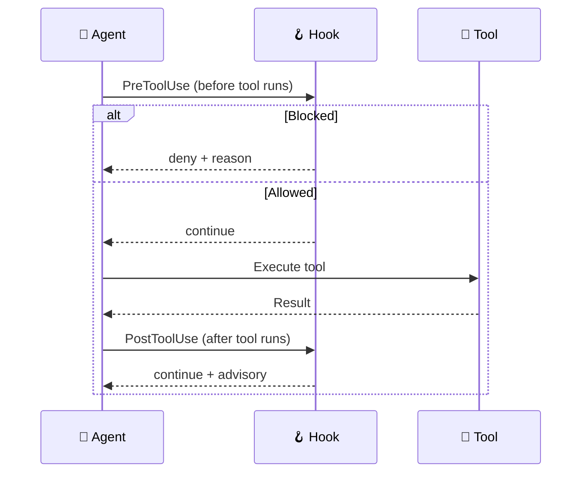

# Agent Hooks

VS Code Agent Hooks automate code quality enforcement by running shell commands at key
lifecycle points during agent sessions. They complement the instruction-based approach
with deterministic, code-driven automation.

!!! note "Git hooks vs. Agent hooks"

    This page covers **VS Code Agent Hooks** (lifecycle events during agent sessions).
    For **git hooks** (pre-commit, pre-push, commit-msg via lefthook), see the
    [Validation & Linting Reference](validation-reference.md).

!!! info "Preview Feature"
Agent hooks are a [VS Code Preview feature](https://code.visualstudio.com/docs/copilot/customization/hooks).
Agent-scoped hooks (defined in `.agent.md` frontmatter) require
`chat.useCustomAgentHooks: true` in `.vscode/settings.json`.

## How Hooks Work



## Hook Inventory

| Hook Directory         | Event(s)                                      | Purpose                                                                                                | Timeout |
| :--------------------- | :-------------------------------------------- | :----------------------------------------------------------------------------------------------------- | ------: |
| `tool-guardian/`       | preToolUse                                    | Block dangerous commands (destructive ops, force pushes, DB drops) + hook self-modification protection |     10s |
| `secrets-scanner/`     | sessionEnd                                    | Scan modified files for leaked secrets, credentials, and sensitive data                                |     30s |
| `session-logger/`      | sessionStart, sessionEnd, userPromptSubmitted | Log session lifecycle and inject project context (step, subscription, branch)                          |      5s |
| `governance-audit/`    | sessionStart, sessionEnd, userPromptSubmitted | Scan prompts for threat signals; audit trail with governance levels                                    |     10s |
| `post-edit-format/`    | PostToolUse                                   | Auto-format `.md`, `.bicep`, `.tf`, `.js` files after edits                                            |     30s |
| `subagent-validation/` | SubagentStop                                  | Validate subagent output quality (advisory)                                                            |     15s |

## Configuration

Hooks are registered in `.vscode/settings.json`:

```json
{
  "chat.hookFilesLocations": {
    ".github/hooks/tool-guardian": true,
    ".github/hooks/secrets-scanner": true,
    ".github/hooks/session-logger": true,
    ".github/hooks/governance-audit": true,
    ".github/hooks/post-edit-format": true,
    ".github/hooks/subagent-validation": true
  },
  "chat.useCustomAgentHooks": true
}
```

### Agent-Scoped Hooks

Agents can define hooks in their YAML frontmatter (requires `chat.useCustomAgentHooks`):

```yaml
hooks:
  PostToolUse:
    - type: command
      command: ".github/hooks/post-edit-format/post-edit-format.sh"
      timeout: 30
```

!!! warning "Do not duplicate global hooks"
If a hook is already registered globally in `chat.hookFilesLocations`, do not
re-define it in agent frontmatter — this causes the hook to run twice.
Use agent-scoped hooks only for agent-specific logic not covered by global hooks.

## Safety Considerations

### Self-Modification Protection

The tool-guardian hook blocks file-edit tools (`replace_string_in_file`, `create_file`, etc.)
from modifying files under `.github/hooks/`. Path resolution uses `realpath` to handle
symlinks and traversal attacks (`../`).

### Timeout Enforcement

Each hook specifies a timeout (5-30s). If a hook exceeds its timeout, VS Code terminates
it and continues the agent session.

## Hook Directory Structure

Each hook follows this pattern:

```text
.github/hooks/{name}/
├── hooks.json          # Event binding + timeout
└── {name}.sh           # Shell script (must be executable)
```

### hooks.json Schema

```json
{
  "hooks": {
    "<EventName>": [
      {
        "type": "command",
        "command": ".github/hooks/{name}/{name}.sh",
        "timeout": 30
      }
    ]
  }
}
```

Valid event names: `PreToolUse`, `PostToolUse`, `SessionStart`, `SubagentStart`,
`SubagentStop`, `Stop`.

### Script Conventions

All hook scripts must:

1. Start with `#!/usr/bin/env bash`
2. Include `set -euo pipefail`
3. Read JSON from stdin
4. Write JSON to stdout (`{"continue": true}` or `{"hookSpecificOutput": {...}}`)
5. Be executable (`chmod +x`)

## Validation

```bash
# Validate hook configurations
npm run validate:hooks

# Run hook integration tests
npm run test:hooks
```

## Adding a New Hook

### 1. Create the hook directory and script

```bash
mkdir -p .github/hooks/my-hook-name
```

Create `.github/hooks/my-hook-name/my-hook-name.sh`:

```bash
#!/usr/bin/env bash
set -euo pipefail

INPUT=$(cat)

# Parse input JSON
FIELD=$(echo "$INPUT" | python3 -c \
  "import sys,json; print(json.load(sys.stdin).get('field',''))" \
  2>/dev/null || echo "")

# Your logic here...

# Output JSON safely (prevents injection)
python3 -c "
import json, sys
print(json.dumps({'continue': True, 'systemMessage': sys.argv[1]}))
" "Your message" 2>/dev/null || echo '{"continue": true}'
```

Then: `chmod +x .github/hooks/my-hook-name/my-hook-name.sh`

### 2. Create hooks.json

```json
{
  "hooks": {
    "PostToolUse": [
      {
        "type": "command",
        "command": ".github/hooks/my-hook-name/my-hook-name.sh",
        "timeout": 30
      }
    ]
  }
}
```

### 3. Register in VS Code settings

Add to `chat.hookFilesLocations` in `.vscode/settings.json`:

```json
".github/hooks/my-hook-name": true
```

### 4. Add tests and validate

Add test cases to `scripts/test-hooks.sh`, then run:

```bash
npm run validate:hooks
npm run test:hooks
```

### Best practices

- **JSON safety**: Always use `python3 json.dumps()` for output — never string interpolation
- **Fast execution**: Keep hooks under their timeout; check tool availability with `command -v`
- **No network calls**: Hooks should be fast and local
- **Path safety**: Use `realpath` and verify paths are within the repository
- **Error handling**: Use `set -euo pipefail`; handle missing tools gracefully

## Troubleshooting

### Hook Not Firing

1. Verify the hook directory is listed in `chat.hookFilesLocations` in `.vscode/settings.json`
2. Check the script is executable: `ls -la .github/hooks/{name}/{name}.sh`
3. View hook output: **Output** panel → **GitHub Copilot Chat Hooks** channel

### Hook Timeout

If a hook exceeds its timeout, VS Code kills the process and continues. Check for:

- Network calls in hooks (avoid — hooks should be fast and local)
- Large file processing (the >1MB guard in post-edit-format prevents this)
- Missing tool binaries (hooks should check `command -v` before running tools)

### Manual Testing

Test a hook locally by piping mock JSON:

```bash
echo '{"toolName":"run_in_terminal","toolInput":"ls"}' | \
  bash .github/hooks/tool-guardian/guard-tool.sh
```

## Relationship to Git Hooks

Agent hooks (`.github/hooks/`) and git hooks (`lefthook.yml`) serve different purposes:

|             | Agent Hooks                   | Git Hooks (lefthook)           |
| :---------- | :---------------------------- | :----------------------------- |
| **When**    | During agent sessions         | On git commit/push             |
| **Scope**   | Individual tool invocations   | Staged/changed files           |
| **Config**  | `.github/hooks/*/hooks.json`  | `lefthook.yml`                 |
| **Purpose** | Real-time quality enforcement | Pre-commit/pre-push validation |

Both systems complement each other — agent hooks catch issues during authoring,
git hooks catch issues before commit.
