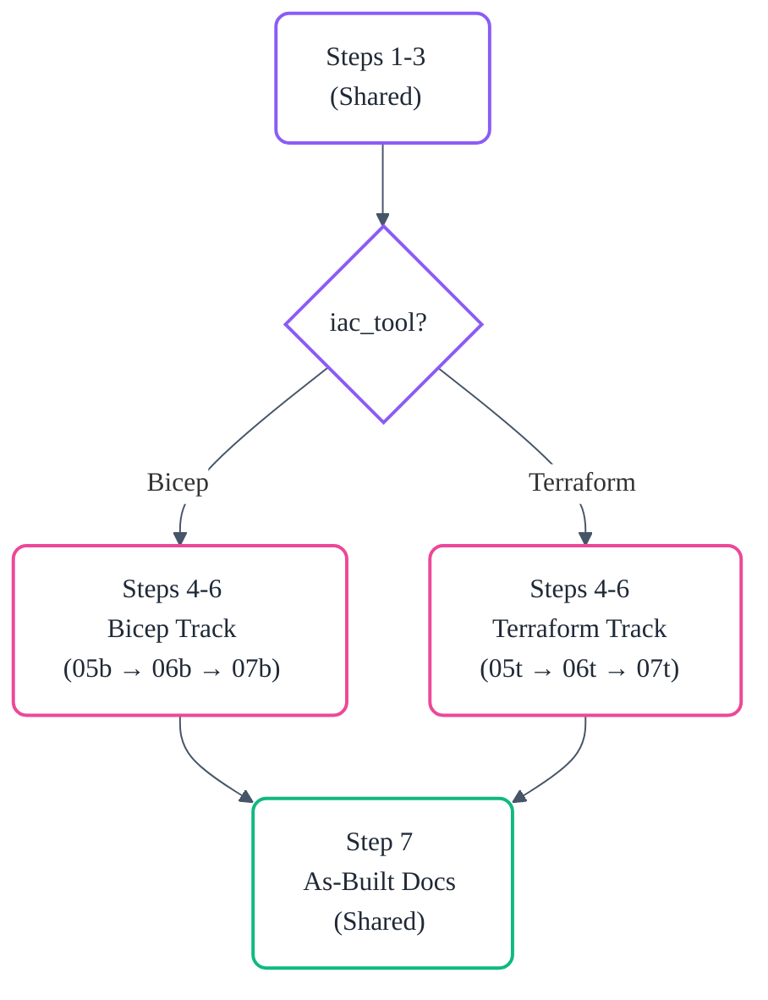
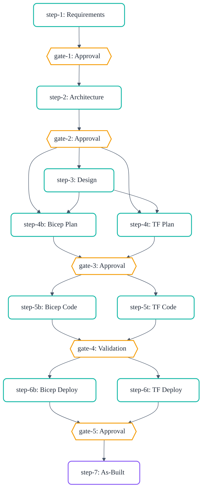
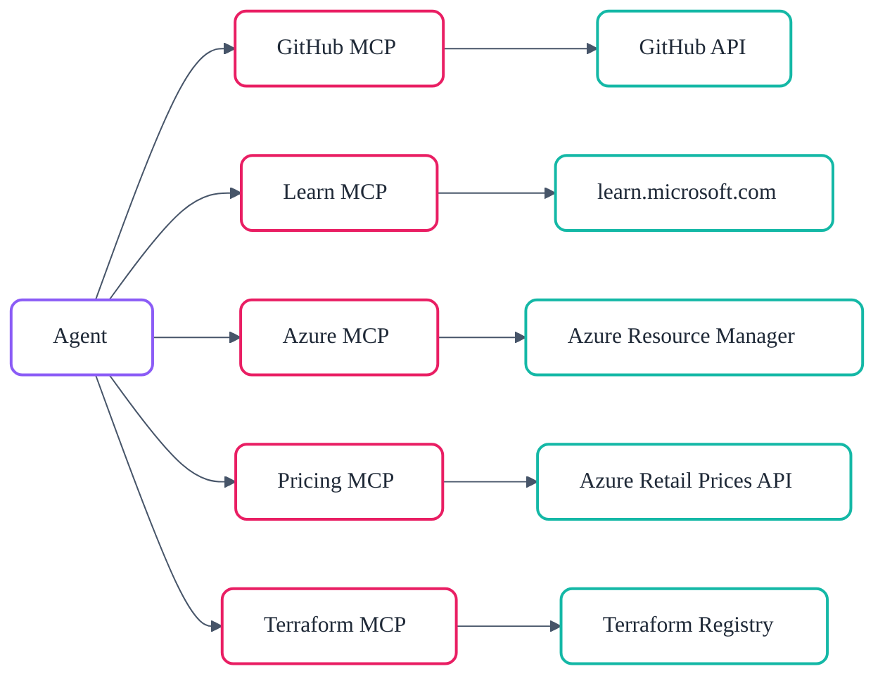

<div align="center">
  
</div>

<a id="how-agentic-infraops-works"></a>

# 🚀 How Agentic InfraOps Works

> A comprehensive guide to the multi-agent orchestration system for Azure infrastructure development.

<a id="table-of-contents"></a>

## 📑 Table of Contents

- [Executive Summary](#executive-summary)
- [Intellectual Foundations](#intellectual-foundations)
  - [Harness Engineering (OpenAI)](#harness-engineering-openai)
  - [Bosun (VirtEngine)](#bosun-virtengine)
  - [Ralph (Snarktank)](#ralph-snarktank)
  - [How This Project Synthesises All Three](#how-this-project-synthesises-all-three)
- [System Architecture Overview](#system-architecture-overview)
  - [The 7-Step Workflow](#the-7-step-workflow)
  - [The Conductor Pattern](#the-conductor-pattern)
  - [Dual IaC Tracks](#dual-iac-tracks)
- [The Four Pillars](#the-four-pillars)
  - [1. Agents](#1-agents)
  - [2. Skills](#2-skills)
  - [3. Instructions](#3-instructions)
  - [4. Configuration Registries](#4-configuration-registries)
- [AGENTS.md and Copilot Instructions](#agentsmd-and-copilot-instructions)
  - [AGENTS.md — The Table of Contents](#agentsmd--the-table-of-contents)
  - [copilot-instructions.md — The VS Code Bridge](#copilot-instructionsmd--the-vs-code-bridge)
- [Deep Dive: Agent Architecture](#deep-dive-agent-architecture)
  - [Agent Anatomy](#agent-anatomy)
  - [Top-Level Agents (14)](#top-level-agents-14)
  - [Subagents (9)](#subagents-9)
  - [The Challenger Pattern](#the-challenger-pattern)
  - [Handoffs and Delegation](#handoffs-and-delegation)
- [Deep Dive: Skills System](#deep-dive-skills-system)
  - [Skill Structure](#skill-structure)
  - [Progressive Loading](#progressive-loading)
  - [Skill Catalog](#skill-catalog)
- [Deep Dive: Instruction System](#deep-dive-instruction-system)
  - [Glob-Based Auto-Application](#glob-based-auto-application)
  - [Enforcement Over Documentation](#enforcement-over-documentation)
- [Deep Dive: Workflow Engine](#deep-dive-workflow-engine)
  - [The DAG Model](#the-dag-model)
  - [Gates and Approval Points](#gates-and-approval-points)
  - [IaC Routing](#iac-routing)
  - [Session State and Resume](#session-state-and-resume)
- [Deep Dive: Quality and Safety Systems](#deep-dive-quality-and-safety-systems)
  - [27 Validation Scripts](#27-validation-scripts)
  - [Git Hooks (Pre-Commit and Pre-Push)](#git-hooks-pre-commit-and-pre-push)
  - [Circuit Breaker](#circuit-breaker)
  - [Context Compression](#context-compression)
- [Deep Dive: MCP Server Integration](#deep-dive-mcp-server-integration)
  - [MCP Architecture](#mcp-architecture)
  - [GitHub MCP Server](#github-mcp-server)
  - [Microsoft Learn MCP Server](#microsoft-learn-mcp-server)
  - [Azure MCP Server](#azure-mcp-server)
  - [Azure Pricing MCP Server](#azure-pricing-mcp-server)
  - [Terraform Registry MCP Server](#terraform-registry-mcp-server)
- [The Golden Principles](#the-golden-principles)
- [File Map](#file-map)
- [References](#references)


<a id="executive-summary"></a>

## 📋 Executive Summary

Agentic InfraOps is a multi-agent orchestration system where specialised AI agents collaborate
through a structured 7-step workflow to transform Azure infrastructure requirements into deployed,
production-grade Infrastructure as Code. The system coordinates 14 top-level agents and
9 subagents through mandatory human approval gates, producing Bicep or Terraform templates
that conform to Azure Well-Architected Framework principles, Azure Verified Modules standards,
and organisational governance policies.

The core thesis is that **AI agents can reliably produce production-grade Azure infrastructure
when properly orchestrated with guardrails**. The system achieves this through
a layered knowledge architecture (agents, skills, instructions, registries), mechanical enforcement
of invariants via 27 validation scripts, and a human-in-the-loop design that preserves
operator control at every critical decision point.


<a id="intellectual-foundations"></a>

## 🧠 Intellectual Foundations

This project draws directly from two bodies of work that define how autonomous AI agents
can operate reliably in professional software engineering contexts.

<a id="harness-engineering-openai"></a>

### 🛠️ Harness Engineering (OpenAI)

<div align="center"></div><br/>

In February 2026, OpenAI published
"[Harness Engineering: Leveraging Codex in an Agent-First World](https://openai.com/index/harness-engineering/),"
describing how a small team built and shipped an internal product with zero lines of
manually-written code. Every line — application logic, tests, CI configuration, documentation,
and internal tooling — was generated by Codex agents. The key insights that shaped this project:

**Repository as the system of record.** Knowledge that lives in Google Docs, chat threads,
or people's heads is invisible to agents. Only versioned, in-repo artifacts — code, markdown,
schemas, execution plans — exist from the agent's perspective. This project implements this
principle by storing all agent outputs in `agent-output/{project}/`, all conventions in skills
and instructions, and all decisions in Architecture Decision Records.

**Map, not manual.** OpenAI initially tried a monolithic `AGENTS.md` approach and found it
failed: context is a scarce resource, and a giant instruction file crowds out the task.
Instead, they treat `AGENTS.md` as a table of contents that points to deeper sources.
This project adopts the same pattern: `AGENTS.md` is approximately 250 lines and points to
20 skills, 27 instruction files, and multiple configuration registries.

**Enforce invariants, not implementations.** Rather than prescribing step-by-step procedures,
the Harness Engineering approach encodes strict boundaries (architectural layering rules,
naming conventions, security requirements) and lets agents choose their own path within those
constraints. This project enforces invariants mechanically: 27 validation scripts check
naming conventions, template compliance, governance references, and architectural rules.

**Human taste gets encoded.** When a human reviewer catches a pattern issue, the fix is
not to patch the output — it is to update the instruction or skill that should have prevented
the issue. Over time, human judgment compounds in the system as linter rules, templates,
and skill updates.

**Garbage collection through continuous enforcement.** Technical debt in an agent-generated
system accumulates the same way it does in human-generated systems, but faster. The Harness
Engineering approach runs recurring agents that scan for deviations and open targeted
refactoring pull requests. This project implements a quarterly context audit checklist
and weekly documentation freshness checks.

<a id="bosun-virtengine"></a>

### ⚓ Bosun (VirtEngine)

[Bosun](https://github.com/virtengine/bosun) is an open-source, production-grade control
plane for autonomous software engineering. Originally named OpenFleet, Bosun routes work
across multiple AI executors (Codex, Copilot, Claude, OpenCode), automates retries and
failover, manages PR lifecycles, and provides operator control through a Telegram Mini App
dashboard. Key concepts adopted from Bosun:

**Distributed shared state with claim-based locking.** Bosun's `shared-state-manager.mjs`
implements heartbeat-based liveness detection and claim tokens to prevent concurrent agents
from double-writing the same task. This project's session state schema v2.0 directly
adapts this pattern with `lock.owner_id`, `lock.heartbeat`, `lock.attempt_token`, and
per-step `claim` objects.

**Workflow engine as a DAG.** Bosun's `workflow-engine.mjs` and `workflow-nodes.mjs`
define workflow execution as a directed acyclic graph with typed nodes, conditional edges,
and fan-out patterns. This project's `workflow-graph.json` encodes the 7-step pipeline
as a machine-readable DAG with `agent-step`, `gate`, `subagent-fan-out`, and `validation`
node types.

**Context shredding.** Bosun's `context-shredding-config.mjs` implements tiered context
compression to manage token budgets across long-running sessions. This project's
`context-shredding` skill defines three compression tiers (`full`, `summarized`, `minimal`)
with per-artifact compression templates.

**Circuit breaker and anomaly detection.** Bosun's `anomaly-detector.mjs` and
`error-detector.mjs` detect stalled loops and repeated failures, triggering escalation.
This project's circuit breaker pattern (in `iac-common/references/circuit-breaker.md`)
defines a failure taxonomy, detection thresholds, and mandatory stopping rules.

**Smart PR lifecycle.** Bosun auto-labels PRs with `bosun-needs-fix` when CI fails
and merges passing PRs through a watchdog with a mandatory review gate. This project's
Smart PR Flow adapts the same pattern with `infraops-ci-pass` / `infraops-needs-fix` labels
and deploy agent integration.

**Diff-based pre-push hooks.** Bosun's `.githooks/` directory implements targeted
validation that only runs checks for changed file domains. This project's `pre-push` hook
in `lefthook.yml` categorises changed files and runs only matching validators in parallel.

**Built-in tools catalog with skill affinity.** Bosun's `agent-custom-tools.mjs` includes
a `BUILTIN_TOOLS` catalog that maps which tools and skills each agent profile needs.
This project's `skill-affinity.json` maps each agent to skills with affinity weights
(`primary`, `secondary`, `never`).

**Agent prompts registry.** Bosun's `agent-prompts.mjs` provides a machine-readable
registry of agent configurations. This project's `agent-registry.json` maps each agent
role to its definition file, default model, and required skills.

<a id="ralph-snarktank"></a>

### 🔁 Ralph (Snarktank)

[Ralph](https://github.com/snarktank/ralph) is an autonomous AI agent loop
(12k+ GitHub stars) based on
[Geoffrey Huntley's Ralph pattern](https://ghuntley.com/ralph/). It spawns
fresh AI coding tool instances (Amp or Claude Code) in a bash loop, picking
off PRD user stories one at a time until all items pass. Key concepts adopted
from Ralph:

**Fresh-context iteration model.** Each Ralph iteration spawns a brand-new
AI instance with zero carry-over context. The only memory between iterations
is git history, a `progress.txt` append-only learning log, and a `prd.json`
task list. This project adopts the same philosophy through its session-resume
skill: each agent step is stateless, and all memory persists through versioned
artefact files in `agent-output/{project}/` and the machine-readable
`00-session-state.json`.

**Right-sized task decomposition.** Ralph insists that each PRD item must be
small enough to complete within a single context window — "Add a database
column" not "Build the entire dashboard." This project enforces the same
principle at a different scale: each of the 7 workflow steps is scoped to a
single well-defined output (one requirements doc, one architecture assessment,
one implementation plan), and subagents are further decomposed to atomic
validation or review tasks.

**AGENTS.md as compounding knowledge.** Ralph treats `AGENTS.md` updates as
critical: after each iteration the AI appends discovered patterns, gotchas,
and conventions so that future iterations (and human developers) benefit.
This project elevates the same pattern to a first-class system: `AGENTS.md`
is the table of contents, skills contain deep domain knowledge, and
instructions encode discovered conventions as enforceable rules. Golden
Principle 7 — "Human Taste Gets Encoded" — directly mirrors Ralph's
append-only learning loop.

**Feedback loops as mandatory infrastructure.** Ralph only works when
typecheck catches errors, tests verify behaviour, and CI stays green —
otherwise broken code compounds across iterations. This project's 27
validation scripts, pre-commit/pre-push hooks, and circuit breaker pattern
serve the identical function: mechanical feedback loops that prevent error
propagation across agent steps.

**Deterministic stop conditions.** Ralph exits when all user stories have
`passes: true`. This project's workflow engine defines explicit gate
conditions: each step transition requires either human approval or automated
validation pass, and the Conductor agent tracks completion state in the
session state file.

<a id="how-this-project-synthesises-all-three"></a>

### ⚖️ How This Project Synthesises All Three

Harness Engineering provides the **philosophy**: treat the repository as the single source
of truth, encode human taste into mechanical rules, enforce invariants rather than
implementations, and manage context as a scarce resource.

Bosun provides the **engineering patterns**: distributed state with claims, DAG-based
workflow execution, complexity routing, context compression, circuit breakers, and PR
automation.

Ralph provides the **execution model**: stateless iteration loops, right-sized task
decomposition, append-only learning, mandatory feedback loops, and deterministic
stop conditions.

This project weaves all three into a system purpose-built for Azure infrastructure:

| Concern                | Harness Engineering Principle        | Bosun Pattern                       | Ralph Pattern                    | This Project                                   |
| ---------------------- | ------------------------------------ | ----------------------------------- | -------------------------------- | ---------------------------------------------- |
| Knowledge management   | Repo is system of record             | Shared knowledge base               | `AGENTS.md` + `progress.txt`     | Skills + instructions + `agent-output/`        |
| Context management     | Map, not manual                      | Context shredding                   | Fresh context per iteration      | Progressive skill loading + 3-tier compression |
| Quality enforcement    | Mechanical enforcement of invariants | Pre-push hooks + anomaly detection  | Mandatory CI feedback loops      | 27 validators + pre-commit/push hooks          |
| Workflow orchestration | Structured step progression          | Workflow engine DAG                 | Bash loop + `prd.json` task list | `workflow-graph.json` + Conductor agent        |
| Concurrency safety     | —                                    | Claim-based locking                 | Single-instance sequential loop  | Session state v2.0 with lock/claim model       |
| Task decomposition     | —                                    | —                                   | One context window per story     | One artefact per workflow step                 |
| Cost optimisation      | —                                    | —                                   | —                                | Model tier selection via Conductor             |
| Failure resilience     | —                                    | Circuit breaker + anomaly detection | CI-gated iteration               | Failure taxonomy + stopping rules              |
| Learning persistence   | Human taste gets encoded             | —                                   | Append-only `progress.txt`       | Skills + instructions evolve over time         |
| Human control          | Human taste gets encoded             | Mandatory review gates              | Max iterations cap               | 5 approval gates + challenger reviews          |


<div align="right"><a href="#table-of-contents"><b>⬆️ Back to Top</b></a></div>

<a id="system-architecture-overview"></a>

## 📐 System Architecture Overview

<a id="the-7-step-workflow"></a>

### 🔄 The 7-Step Workflow

The system follows a strict sequential workflow with mandatory human approval gates
between critical phases:

```mermaid
%%{
  init: {
    'theme': 'base',
    'themeVariables': {
      'primaryColor': '#ffffff',
      'primaryTextColor': '#333333',
      'primaryBorderColor': '#e91e63',
      'lineColor': '#475569',
      'fontFamily': 'ui-sans-serif, system-ui, -apple-system, sans-serif'
    },
    'flowchart': {
      'curve': 'basis',
      'nodeSpacing': 50,
      'rankSpacing': 50
    }
  }
}%%
flowchart LR
    classDef default fill:#ffffff,stroke:#e91e63,stroke-width:2px,color:#1f2937,rx:8px,ry:8px;
    classDef gate fill:#ffffff,stroke:#3b82f6,stroke-width:2px,color:#1f2937,rx:8px,ry:8px;
    classDef endNode fill:#ffffff,stroke:#10b981,stroke-width:2px,color:#1f2937,rx:8px,ry:8px;

    S1["Step 1\nRequirements"]
    G1{{"Gate 1\n🔒 Approval"}}:::gate
    S2["Step 2\nArchitecture"]
    G2{{"Gate 2\n🔒 Approval"}}:::gate
    S3["Step 3\nDesign\n(optional)"]
    S4["Step 4\nIaC Plan"]
    G3{{"Gate 3\n🔒 Approval"}}:::gate
    S5["Step 5\nIaC Code"]
    G4{{"Gate 4\n✔ Validation"}}:::gate
    S6["Step 6\nDeploy"]
    G5{{"Gate 5\n🔒 Approval"}}:::gate
    S7["Step 7\nAs-Built Docs"]:::endNode

    S1 --> G1 --> S2 --> G2 --> S3 --> S4 --> G3 --> S5 --> G4 --> S6 --> G5 --> S7
```



| Step | Phase        | Agent                              | Output                                   | Review            |
| ---- | ------------ | ---------------------------------- | ---------------------------------------- | ----------------- |
| 1    | Requirements | 02-Requirements                    | `01-requirements.md`                     | 1 challenger pass |
| 2    | Architecture | 03-Architect                       | `02-architecture-assessment.md` + cost   | 3+1 passes        |
| 3    | Design (opt) | 04-Design                          | `03-des-*.{py,png,md}`                   | —                 |
| 4    | IaC Plan     | 05b-Bicep Planner / 05t-TF Planner | `04-implementation-plan.md` + governance | 1+3 passes        |
| 5    | IaC Code     | 06b-Bicep CodeGen / 06t-TF CodeGen | `infra/bicep/` or `infra/terraform/`     | 3 passes          |
| 6    | Deploy       | 07b-Bicep Deploy / 07t-TF Deploy   | `06-deployment-summary.md`               | 1 pass            |
| 7    | As-Built     | 08-As-Built                        | `07-*.md` documentation suite            | —                 |

<a id="the-conductor-pattern"></a>

### 🎼 The Conductor Pattern

<div align="center"></div><br/>

The InfraOps Conductor (agent `01-Conductor`) is the master orchestrator. It does not
generate infrastructure code or documentation itself. Instead, it:

1. Reads the workflow DAG from `workflow-graph.json`
2. Resolves agent paths and models from `agent-registry.json`
3. Delegates each step to the appropriate specialised agent via `#runSubagent`
4. Enforces approval gates between steps
5. Maintains session state in `00-session-state.json`
6. Writes human-readable handoff documents at every gate

The Conductor never touches infrastructure templates. It is a pure orchestrator and
state machine.

<a id="dual-iac-tracks"></a>

### 🛤️ Dual IaC Tracks

<div align="center"></div><br/>

Steps 1–3 (Requirements, Architecture, Design) are shared across both infrastructure
tracks. At Step 4, the workflow diverges based on the `iac_tool` field in the requirements
document:




<div align="right"><a href="#table-of-contents"><b>⬆️ Back to Top</b></a></div>

<a id="the-four-pillars"></a>

## 🏛️ The Four Pillars

The system's knowledge architecture is built on four distinct layers, each serving
a specific purpose in the agent's context window.

<a id="1-agents"></a>

### 🤖 1. Agents

**What they are**: Agent definitions (`.agent.md` files) define a specialised AI persona
with a specific role, allowed tools, handoff targets, and a body of instructions.

**Where they live**: `.github/agents/` (top-level) and `.github/agents/_subagents/`

**How they work**: Each agent file contains YAML frontmatter (name, description, model,
tools, handoffs) and a markdown body with the agent's operating instructions. When a user
invokes an agent in VS Code Copilot Chat, the entire body becomes part of the system prompt.

**Key constraint**: Agent bodies are limited to 350 lines to preserve context window space.
Heavy knowledge is externalised into skills and loaded on demand.

<a id="2-skills"></a>

### 🥋 2. Skills

**What they are**: Reusable domain knowledge packages that agents load when they need
specialised context.

**Where they live**: `.github/skills/{name}/SKILL.md` with optional `references/` and
`templates/` subdirectories.

**How they work**: An agent's body contains explicit `Read .github/skills/{name}/SKILL.md`
directives. The `SKILL.md` file provides a compact overview (under 500 lines), and heavy
reference material is stored in subdirectories, loaded only when the agent's task demands it.

**Key constraint**: Skills implement progressive disclosure — agents start with the overview
and drill into `references/` only when needed.

<a id="3-instructions"></a>

### 📜 3. Instructions

**What they are**: Enforcement rules that apply automatically based on file type. Unlike
skills (which must be explicitly read), instructions are injected into context whenever
a matching file is opened or edited.

**Where they live**: `.github/instructions/{name}.instructions.md`

**How they work**: Each instruction file has YAML frontmatter with a `description` and
an `applyTo` glob pattern. When an agent works with a file matching the pattern, the
instruction is automatically loaded. For example, `bicep-code-best-practices.instructions.md`
applies to `**/*.bicep` and enforces AVM-first patterns, security baselines, and unique
suffix conventions.

**Key constraint**: Instruction files are limited to 150 lines and use narrow glob patterns.
`applyTo: "**"` is reserved for truly universal rules only.

<a id="4-configuration-registries"></a>

### ⚙️ 4. Configuration Registries

**What they are**: Machine-readable JSON files that provide runtime configuration for
the agent system.

**Where they live**: `.github/` root and within skills.

| Registry       | Path                                                           | Purpose                                   |
| -------------- | -------------------------------------------------------------- | ----------------------------------------- |
| Agent Registry | `.github/agent-registry.json`                                  | Agent role → file, model, required skills |
| Skill Affinity | `.github/skill-affinity.json`                                  | Agent → skill weights (primary/secondary) |
| Workflow Graph | `.github/skills/workflow-engine/templates/workflow-graph.json` | 7-step DAG with nodes, edges, conditions  |


<div align="right"><a href="#table-of-contents"><b>⬆️ Back to Top</b></a></div>

<a id="agentsmd-and-copilot-instructions"></a>

## 🗂️ AGENTS.md and Copilot Instructions

<a id="agentsmd-the-table-of-contents"></a>

### 📖 AGENTS.md — The Table of Contents

Following the Harness Engineering principle of "map, not manual," the root `AGENTS.md`
serves as the entry point for all agents. At approximately 250 lines, it provides:

- **Setup commands**: How to clone, install dependencies, and open the dev container
- **Build and validation commands**: The complete `npm run` command reference
- **Code style conventions**: CAF naming prefixes, required tags, default regions, AVM-first rules
- **Security baseline**: Non-negotiable security requirements for all generated infrastructure
- **Testing procedures**: How to validate before committing
- **Commit conventions**: Conventional commit format with scopes
- **Project structure**: Directory layout overview
- **Workflow summary**: The 7-step table

`AGENTS.md` does not contain deep architectural guidance, Azure service details, or
template structures. Those are delegated to skills.

<a id="copilot-instructionsmd-the-vs-code-bridge"></a>

### 🌉 copilot-instructions.md — The VS Code Bridge

The `.github/copilot-instructions.md` file is VS Code Copilot's orchestration layer.
It provides:

- **Quick start**: How to enable subagents and invoke the Conductor
- **7-step workflow table**: Quick reference for which agent handles which step
- **Skills catalog**: Table mapping skill names to their purposes
- **Chat triggers**: Rules for handling `gh` commands via GitHub operations
- **Key files**: Table mapping critical paths to their purposes
- **Conventions**: Pointers to skill files for detailed Azure and Terraform conventions

This file is shorter than `AGENTS.md` and focused on VS Code-specific orchestration
concerns rather than repository-wide conventions.


<div align="right"><a href="#table-of-contents"><b>⬆️ Back to Top</b></a></div>

<a id="deep-dive-agent-architecture"></a>

## 🕵️‍♂️ Deep Dive: Agent Architecture

<a id="agent-anatomy"></a>

### 🧬 Agent Anatomy

Every agent definition follows a standard structure:

```yaml
# Frontmatter
---
name: 06b-Bicep CodeGen
description: Expert Azure Bicep IaC specialist...
model: ["Claude Opus 4.6"]
tools: [list of allowed tools]
handoffs:
  - label: "Step 6: Deploy"
    agent: 07b-Bicep Deploy
    prompt: "Deploy the Bicep templates..."
---
# Body (≤ 350 lines)
## MANDATORY: Read Skills First
1. **Read** `.github/skills/azure-defaults/SKILL.md`
2. **Read** `.github/skills/azure-artifacts/SKILL.md`
...
## Session Resume Protocol
...
## DO / DON'T
...
## Phased Workflow
Phase 1: Prerequisites check
Phase 2: Code generation
Phase 3: Validation
...
```

The frontmatter is machine-readable metadata. The body is the agent's operating manual,
loaded into the system prompt when the agent is invoked.

<a id="top-level-agents-14"></a>

### 👑 Top-Level Agents (14)

| Agent                    | Role                                  | Primary Skills                  |
| ------------------------ | ------------------------------------- | ------------------------------- |
| 01-Conductor             | Master orchestrator                   | workflow-engine, session-resume |
| 01-Conductor (Fast Path) | Simplified path for ≤3 resources      | session-resume, azure-defaults  |
| 02-Requirements          | Captures project requirements         | azure-defaults, azure-artifacts |
| 03-Architect             | WAF assessment and cost estimation    | azure-defaults, microsoft-docs  |
| 04-Design                | Diagrams and ADRs                     | azure-diagrams, azure-adr       |
| 05b-Bicep Planner        | Bicep implementation planning         | azure-bicep-patterns            |
| 05t-Terraform Planner    | Terraform implementation planning     | terraform-patterns              |
| 06b-Bicep CodeGen        | Bicep template generation             | azure-bicep-patterns            |
| 06t-Terraform CodeGen    | Terraform configuration generation    | terraform-patterns              |
| 07b-Bicep Deploy         | Bicep deployment execution            | iac-common                      |
| 07t-Terraform Deploy     | Terraform deployment execution        | iac-common, terraform-patterns  |
| 08-As-Built              | Post-deployment documentation         | azure-artifacts, azure-diagrams |
| 09-Diagnose              | Azure resource troubleshooting        | azure-troubleshooting           |
| 10-Challenger            | Standalone adversarial review         | —                               |
| 11-Context Optimizer     | Context window audit and optimisation | context-optimizer               |

<a id="subagents-9"></a>

### 🕵️‍♀️ Subagents (9)

Subagents are not user-invocable. They are delegated to by parent agents for isolated,
specific tasks:

| Subagent                      | Purpose                                | Invoked By          |
| ----------------------------- | -------------------------------------- | ------------------- |
| challenger-review-subagent    | Adversarial review of artifacts        | Steps 1, 2, 4, 5, 6 |
| cost-estimate-subagent        | Azure Pricing MCP queries              | Steps 2, 7          |
| governance-discovery-subagent | Azure Policy discovery via REST API    | Step 4              |
| bicep-lint-subagent           | `bicep build` + `bicep lint`           | Step 5 (Bicep)      |
| bicep-review-subagent         | Code review against AVM standards      | Step 5 (Bicep)      |
| bicep-whatif-subagent         | `az deployment what-if` preview        | Step 6 (Bicep)      |
| terraform-lint-subagent       | `terraform fmt` + `terraform validate` | Step 5 (Terraform)  |
| terraform-review-subagent     | Code review against AVM-TF standards   | Step 5 (Terraform)  |
| terraform-plan-subagent       | `terraform plan` preview               | Step 6 (Terraform)  |

<a id="the-challenger-pattern"></a>

### 🤺 The Challenger Pattern

The `challenger-review-subagent` implements adversarial review at critical workflow steps.
It operates with rotating lenses:

- **1-pass review** (comprehensive): A single review covering all dimensions. Used for
  requirements (Step 1) and deploy (Step 6).
- **3-pass review** (rotating lenses): Three separate reviews, each focused on a specific
  dimension (security, reliability, cost). Used for architecture (Step 2), planning (Step 4),
  and code (Step 5).

Findings are classified as `must_fix` (blocking) or `should_fix` (advisory). Only
`must_fix` findings block workflow progression.

<a id="handoffs-and-delegation"></a>

### 🤝 Handoffs and Delegation

Agents communicate through artefact files, not direct message passing. The Conductor
delegates to a step agent, which produces output files in `agent-output/{project}/`.
The next agent reads those files as input. This design:

- Eliminates context leakage between agents
- Enables resume from any point (artefacts are persistent)
- Allows human review at every gate (artefacts are human-readable markdown)
- Supports parallel development of different steps


<div align="right"><a href="#table-of-contents"><b>⬆️ Back to Top</b></a></div>

<a id="deep-dive-skills-system"></a>

## 🤿 Deep Dive: Skills System

<a id="skill-structure"></a>

### 🏗️ Skill Structure

Each skill follows a standard layout:

```text
.github/skills/{name}/
├── SKILL.md                    # Core overview (≤ 500 lines)
├── references/                 # Deep reference material (loaded on demand)
│   ├── detailed-guide.md
│   └── lookup-table.md
└── templates/                  # Template files (loaded on demand)
    └── artifact.template.md
```

<a id="progressive-loading"></a>

### ⏳ Progressive Loading

Skills implement three levels of disclosure:

1. **Level 1 — SKILL.md**: Compact overview loaded when the agent reads the skill.
   Contains quick-reference tables, decision frameworks, and pointers to deeper content.

2. **Level 2 — references/**: Detailed guides, lookup tables, and protocol definitions.
   Loaded only when a specific sub-task requires deep knowledge.

3. **Level 3 — templates/**: Exact structural skeletons for artefact generation.
   Loaded only during the output generation phase.

<a id="skill-catalog"></a>

### 🗃️ Skill Catalog

The system contains 20 skills across several domains:

| Domain               | Skills                                                                                 |
| -------------------- | -------------------------------------------------------------------------------------- |
| Azure Infrastructure | `azure-defaults`, `azure-bicep-patterns`, `terraform-patterns`                         |
| Azure Operations     | `azure-troubleshooting`, `azure-diagrams`, `azure-adr`                                 |
| Artefact Generation  | `azure-artifacts`, `context-shredding`                                                 |
| Documentation        | `docs-writer`, `microsoft-docs`, `microsoft-code-reference`, `microsoft-skill-creator` |
| Workflow and State   | `session-resume`, `workflow-engine`, `golden-principles`                               |
| Deployment           | `iac-common`                                                                           |
| GitHub Operations    | `github-operations`, `git-commit`                                                      |
| Meta / Tooling       | `make-skill-template`, `context-optimizer`                                             |


<div align="right"><a href="#table-of-contents"><b>⬆️ Back to Top</b></a></div>

<a id="deep-dive-instruction-system"></a>

## 🧪 Deep Dive: Instruction System

<a id="glob-based-auto-application"></a>

### 🌐 Glob-Based Auto-Application

Instructions are not read explicitly by agents. They are injected automatically by
VS Code Copilot when a matching file is in context. The `applyTo` glob pattern controls
when each instruction activates:

| Instruction                     | `applyTo`                    | Enforces                             |
| ------------------------------- | ---------------------------- | ------------------------------------ |
| `bicep-code-best-practices`     | `**/*.bicep`                 | AVM-first, security baseline, naming |
| `terraform-code-best-practices` | `**/*.tf`                    | AVM-TF, provider pinning, naming     |
| `bicep-policy-compliance`       | `**/*.bicep`                 | Azure Policy compliance in Bicep     |
| `terraform-policy-compliance`   | `**/*.tf`                    | Azure Policy compliance in Terraform |
| `azure-artifacts`               | `**/agent-output/**/*.md`    | H2 template compliance for artefacts |
| `agent-definitions`             | `**/*.agent.md`              | Frontmatter standards for agents     |
| `markdown`                      | `**/*.md`                    | Documentation standards              |
| `context-optimization`          | Agents, skills, instructions | Context window management rules      |
| `no-heredoc`                    | `**`                         | Prevents terminal heredoc corruption |

<a id="enforcement-over-documentation"></a>

### 👮 Enforcement Over Documentation

Following the Golden Principle "Mechanical Enforcement Over Documentation," every
instruction has a corresponding validation script. The rule is: if it can be a linter
check, it should be one. Documentation is for humans; machines enforce rules.


<div align="right"><a href="#table-of-contents"><b>⬆️ Back to Top</b></a></div>

<a id="deep-dive-workflow-engine"></a>

## ⚙️ Deep Dive: Workflow Engine

<div align="center"></div><br/>

<a id="the-dag-model"></a>

### 🕸️ The DAG Model

The workflow is encoded as a machine-readable directed acyclic graph in
`workflow-graph.json`:



Each node has a type (`agent-step`, `gate`, `subagent-fan-out`, `validation`), and each
edge has a condition (`on_complete`, `on_skip`, `on_fail`). Conditional routing at IaC
nodes is governed by the `decisions.iac_tool` field.

<a id="gates-and-approval-points"></a>

### 🚧 Gates and Approval Points

Five mandatory gates require explicit human confirmation before the workflow advances:

| Gate | After  | Blocks Until                                      |
| ---- | ------ | ------------------------------------------------- |
| 1    | Step 1 | User approves requirements                        |
| 2    | Step 2 | User approves architecture and cost estimate      |
| 3    | Step 4 | User approves implementation plan                 |
| 4    | Step 5 | Automated validation passes (lint, build, review) |
| 5    | Step 6 | User approves deployment and verifies resources   |

<a id="iac-routing"></a>

### 🔀 IaC Routing

The `iac_tool` field in `01-requirements.md` determines which track is activated.
Steps 4b, 5b, 6b form the Bicep track; steps 4t, 5t, 6t form the Terraform track.
Only one track is active for a given project.

<a id="session-state-and-resume"></a>

### 💾 Session State and Resume

The `00-session-state.json` file (schema v2.0) provides atomic state tracking:

```json
{
  "schema_version": "2.0",
  "project": "my-project",
  "current_step": 2,
  "lock": {
    "owner_id": "copilot-session-abc123",
    "heartbeat": "2026-03-04T10:15:00Z",
    "attempt_token": "550e8400-e29b-41d4-a716-446655440000"
  },
  "steps": {
    "2": {
      "status": "in_progress",
      "sub_step": "phase_2_waf",
      "claim": {
        "owner_id": "copilot-session-abc123",
        "heartbeat": "2026-03-04T10:15:00Z",
        "attempt_token": "550e8400-e29b-41d4-a716-446655440000",
        "retry_count": 0,
        "event_log": []
      }
    }
  }
}
```

The claim model prevents concurrent sessions from corrupting state. Stale heartbeats
(older than `stale_threshold_ms`, default 5 minutes) are automatically recovered.


<div align="right"><a href="#table-of-contents"><b>⬆️ Back to Top</b></a></div>

<a id="deep-dive-quality-and-safety-systems"></a>

## 🛡️ Deep Dive: Quality and Safety Systems

<a id="27-validation-scripts"></a>

### ✅ 27 Validation Scripts

Every convention is backed by a machine-enforceable check:

| Category            | Validators                                                                                |
| ------------------- | ----------------------------------------------------------------------------------------- |
| Markdown            | `lint:md`, `lint:links:docs`                                                              |
| Artefact format     | `lint:artifact-templates`, `lint:h2-sync`, `fix:artifact-h2`                              |
| Agent quality       | `lint:agent-frontmatter`, `lint:agent-body-size`                                          |
| Skill quality       | `lint:skills-format`, `lint:skill-size`, `lint:skill-references`, `lint:orphaned-content` |
| Instruction quality | `lint:instruction-frontmatter`, `validate:instruction-refs`                               |
| Governance          | `lint:governance-refs`, `lint:mcp-config`                                                 |
| Infrastructure      | `lint:terraform-fmt`, `validate:terraform`                                                |
| Session state       | `validate:session-state`, `validate:session-lock`                                         |
| Registry/config     | `validate:workflow-graph`, `validate:agent-registry`, `validate:skill-affinity`           |
| Code quality        | `lint:json`, `lint:python`                                                                |
| Meta                | `lint:version-sync`, `lint:deprecated-refs`, `lint:docs-freshness`, `lint:glob-audit`     |

All validators run via `npm run validate:all`.

<a id="git-hooks-pre-commit-and-pre-push"></a>

### 🪝 Git Hooks (Pre-Commit and Pre-Push)

**Pre-commit** (sequential, via lefthook): Validates staged files only — markdown lint,
link checks, H2 sync, artefact templates, agent frontmatter, instruction frontmatter,
Python lint, Terraform format and validate.

**Pre-push** (parallel, via lefthook): Diff-based domain routing. The `diff-based-push-check.sh`
script categorises changed files and runs only matching validators:

- `*.bicep` → Bicep build + lint
- `*.tf` → Terraform fmt + validate
- `*.agent.md` → Agent frontmatter + body size
- `*.instructions.md` → Instruction frontmatter
- `SKILL.md` → Skills format + skill size
- `*.json` → JSON syntax
- `*.py` → Ruff lint

<a id="circuit-breaker"></a>

### 🔌 Circuit Breaker

The circuit breaker pattern protects against runaway agent loops during deployment:

| Anomaly Pattern     | Detection Threshold | Action                         |
| ------------------- | ------------------- | ------------------------------ |
| Error repetition    | 3 consecutive       | Halt, write `blocked` finding  |
| Empty response loop | 3 consecutive       | Halt, escalate to human        |
| Timeout cascade     | 3 consecutive       | Halt, check auth               |
| What-if oscillation | 2 cycles            | Halt, flag resource conflict   |
| Auth failure loop   | 2 consecutive       | Halt, prompt re-authentication |

<a id="context-compression"></a>

### 🗜️ Context Compression

When agents approach model context limits, the context-shredding system activates:

| Tier         | Trigger    | Strategy                                   |
| ------------ | ---------- | ------------------------------------------ |
| `full`       | < 60% used | Load entire artefact                       |
| `summarized` | 60–80%     | Key H2 sections only (tables preserved)    |
| `minimal`    | > 80%      | Decision summaries only (< 500 characters) |


<div align="right"><a href="#table-of-contents"><b>⬆️ Back to Top</b></a></div>

<a id="deep-dive-mcp-server-integration"></a>

## 🔌 Deep Dive: MCP Server Integration

The Model Context Protocol (MCP) is an open standard that allows AI agents to
discover and invoke external tools through a uniform JSON-RPC interface.
This project integrates five MCP servers, each providing specialised
capabilities that agents invoke at runtime.

<a id="mcp-architecture"></a>

### 🏗️ MCP Architecture

All MCP servers are declared in `.vscode/mcp.json` and start automatically
when VS Code invokes them. Agents never call cloud APIs directly — they
call MCP tools, which handle authentication, caching, pagination, retries,
and response formatting.



<a id="github-mcp-server"></a>

### 🐙 GitHub MCP Server

| Property  | Value                                         |
| --------- | --------------------------------------------- |
| Transport | HTTP                                          |
| Endpoint  | `https://api.githubcopilot.com/mcp/`          |
| Auth      | Automatic via GitHub Copilot token            |
| Purpose   | Issues, PRs, repos, code search, file content |

The GitHub MCP server is the primary interface for repository operations.
Agents use it to create issues, open pull requests, search code, read file
contents, manage branches, and automate the Smart PR Flow lifecycle. It is
scoped as a default server — every agent has access.

<a id="microsoft-learn-mcp-server"></a>

### 📚 Microsoft Learn MCP Server

| Property  | Value                                    |
| --------- | ---------------------------------------- |
| Transport | HTTP                                     |
| Endpoint  | `https://learn.microsoft.com/api/mcp`    |
| Auth      | None (public API)                        |
| Purpose   | Azure docs, SDK references, code samples |

The Microsoft Learn MCP server provides access to official Microsoft
documentation. Agents query it to look up Azure service limits, find
quickstart guides, verify SDK method signatures, and discover best
practices. The `microsoft-docs` and `microsoft-code-reference` skills
are built on top of this server. It is scoped as a default server alongside
GitHub.

<a id="azure-mcp-server"></a>

### ☁️ Azure MCP Server

| Property  | Value                                        |
| --------- | -------------------------------------------- |
| Transport | VS Code Copilot Extension                    |
| Extension | `ms-azuretools.vscode-azure-mcp-server`      |
| Auth      | Azure CLI (`az login`) or managed identity   |
| Purpose   | RBAC-aware Azure resource context for agents |

The Azure MCP Server is a **critical component** installed as a VS Code
extension. It provides agents with direct, RBAC-aware access to
Azure Resource Manager for querying subscriptions, resource groups,
resources, deployments, and policy assignments. Unlike the Azure Pricing
MCP server (which queries public pricing APIs), this server operates
against live Azure environments using the authenticated user's credentials.

Agents use it across the entire workflow — from governance discovery
(querying Azure Policy assignments) through deployment (validating
resource state) to as-built documentation (inventorying deployed resources).
It is scoped as a **default server** alongside GitHub and Microsoft Learn,
meaning virtually every agent has access.

Installation follows the [Azure MCP Server README](https://github.com/microsoft/mcp/blob/main/servers/Azure.Mcp.Server/README.md#installation)
and is pre-configured in the dev container via the
`ms-azuretools.vscode-azure-mcp-server` extension.

<a id="azure-pricing-mcp-server"></a>

### 💰 Azure Pricing MCP Server

| Property  | Value                                                 |
| --------- | ----------------------------------------------------- |
| Transport | stdio                                                 |
| Command   | Python (`azure_pricing_mcp` module)                   |
| Auth      | None for pricing; Azure credentials for Spot VM tools |
| Tools     | 13 tools                                              |
| Source    | `mcp/azure-pricing-mcp/` (custom, built in-repo)      |

This is a **custom MCP server built specifically for this project**. It
queries the [Azure Retail Prices API](https://learn.microsoft.com/en-us/rest/api/cost-management/retail-prices/azure-retail-prices)
and provides 13 tools for cost estimation:

| Tool                     | Purpose                                      |
| ------------------------ | -------------------------------------------- |
| `azure_price_search`     | Search retail prices with filters            |
| `azure_price_compare`    | Compare prices across regions/SKUs           |
| `azure_cost_estimate`    | Estimate costs based on usage                |
| `azure_discover_skus`    | List available SKUs for a service            |
| `azure_sku_discovery`    | Intelligent SKU name matching                |
| `azure_region_recommend` | Find cheapest regions                        |
| `azure_ri_pricing`       | Reserved Instance pricing and savings        |
| `azure_bulk_estimate`    | Multi-resource estimate in one call          |
| `azure_cache_stats`      | API cache hit/miss statistics                |
| `get_customer_discount`  | Customer discount percentage                 |
| `spot_eviction_rates`    | Spot VM eviction rates (requires Azure auth) |
| `spot_price_history`     | Spot VM price history (90 days)              |
| `simulate_eviction`      | Simulate Spot VM eviction                    |

The server includes a 256-entry TTL cache (5-minute pricing, 24-hour
retirement data, 1-hour spot data), ~95 user-friendly service name
mappings (e.g. `"vm"` → `"Virtual Machines"`), and structured error
codes for consistent agent error handling.

Primarily scoped to the **Architect** agent (Step 2), the
**cost-estimate-subagent**, and the **As-Built** agent (Step 7).

<a id="terraform-registry-mcp-server"></a>

### 🏗️ Terraform Registry MCP Server

| Property  | Value                                     |
| --------- | ----------------------------------------- |
| Transport | stdio                                     |
| Command   | Go binary (`terraform-mcp-server`)        |
| Toolsets  | `registry`                                |
| Purpose   | Provider/module lookup, version discovery |

The Terraform MCP server provides registry integration for the Terraform
IaC track. Agents use it to discover the latest provider and module
versions, look up provider capabilities (resources, data sources, functions),
and retrieve module details before generating Terraform configurations.

Scoped exclusively to the **Terraform Planner** (Step 4t), **Terraform
CodeGen** (Step 5t), **terraform-lint-subagent**, and
**terraform-review-subagent**.

<a id="the-golden-principles"></a>

## 🏆 The Golden Principles

The system operates under 10 principles adapted from the Harness Engineering philosophy:

1. **Repository Is the System of Record** — All context lives in-repo
2. **Map, Not Manual** — Instructions point to deeper sources; no monolithic docs
3. **Enforce Invariants, Not Implementations** — Set boundaries, allow autonomy within them
4. **Parse at Boundaries** — Validate inputs and outputs at module edges
5. **AVM-First, Security Baseline Always** — Azure Verified Modules and security defaults
6. **Golden Path Pattern** — Shared utilities over hand-rolled helpers
7. **Human Taste Gets Encoded** — Review feedback becomes rules, not one-off fixes
8. **Context Is Scarce** — Every token must earn its keep
9. **Progressive Disclosure** — Start small, drill deeper when needed
10. **Mechanical Enforcement Over Documentation** — Linters and validators over prose


<div align="right"><a href="#table-of-contents"><b>⬆️ Back to Top</b></a></div>

<a id="file-map"></a>

## 🗺️ File Map

```text
AGENTS.md                                    # Table of contents for all agents
.github/
  copilot-instructions.md                    # VS Code Copilot orchestration
  agent-registry.json                        # Agent role → file/model/skills
  skill-affinity.json                        # Skill/agent affinity weights
  agents/                                    # 14 top-level agent definitions
    _subagents/                              # 9 subagent definitions
  skills/                                    # 20 skill packages
    workflow-engine/                          # DAG, workflow graph
    context-shredding/                       # Runtime compression
    session-resume/                          # State tracking + resume protocol
    golden-principles/                       # 10 operating principles
    azure-defaults/                          # Regions, tags, naming, security
    azure-artifacts/                         # Template structures + H2 rules
    azure-bicep-patterns/                    # Bicep composition patterns
    terraform-patterns/                      # Terraform composition patterns
    iac-common/                              # Deploy patterns + circuit breaker
    github-operations/                       # GitHub MCP + CLI + Smart PR Flow
    ...
  instructions/                              # 27 instruction files (glob-based)
agent-output/{project}/                      # All agent-generated artefacts
  00-session-state.json                      # Machine-readable workflow state
  00-handoff.md                              # Human-readable gate summary
  01-requirements.md → 07-*.md               # Step artefacts
infra/
  bicep/{project}/                           # Bicep templates
  terraform/{project}/                       # Terraform configurations
scripts/                                     # 27 validation scripts
mcp/azure-pricing-mcp/                       # Custom Azure Pricing MCP server
```


<div align="right"><a href="#table-of-contents"><b>⬆️ Back to Top</b></a></div>

<a id="references"></a>

## 📚 References

- **Harness Engineering**: [openai.com/index/harness-engineering](https://openai.com/index/harness-engineering/)
  — OpenAI's account of building a product with zero manually-written code
- **Bosun**: [github.com/virtengine/bosun](https://github.com/virtengine/bosun)
  — Open-source control plane for autonomous software engineering
- **Ralph**: [github.com/snarktank/ralph](https://github.com/snarktank/ralph)
  — Autonomous AI agent loop based on Geoffrey Huntley's Ralph pattern
- **Azure Well-Architected Framework**: [learn.microsoft.com/azure/well-architected](https://learn.microsoft.com/azure/well-architected/)
- **Azure Verified Modules**: [aka.ms/AVM](https://aka.ms/AVM)
- **Azure Cloud Adoption Framework**: [learn.microsoft.com/azure/cloud-adoption-framework](https://learn.microsoft.com/azure/cloud-adoption-framework/)

<div align="right"><a href="#table-of-contents"><b>⬆️ Back to Top</b></a></div>
