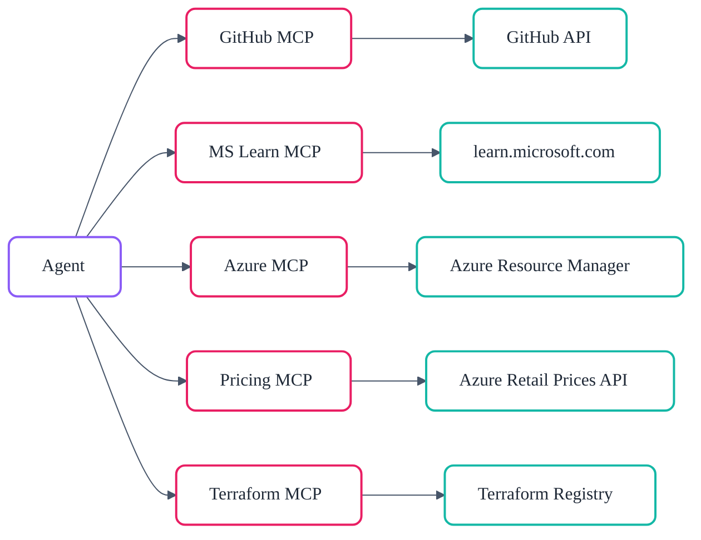

# :material-connection: MCP Server Integration

The Model Context Protocol (MCP) is an open standard that allows AI agents to
discover and invoke external tools through a uniform JSON-RPC interface.
This project integrates five MCP servers, each providing specialised capabilities that
agents invoke at runtime. Four are declared in `.vscode/mcp.json`; the fifth (Azure MCP)
runs as a VS Code extension. An additional `astro-docs` server is declared in `mcp.json`
for documentation site development but is not part of the core agent toolchain.

## :material-lan: MCP Architecture

Four of the five core MCP servers are declared in `.vscode/mcp.json` and start automatically
when VS Code invokes them. The fifth — the Azure MCP Server — runs as a VS Code extension
(`ms-azuretools.vscode-azure-mcp-server`) and uses `az login` credentials. Agents never call cloud APIs directly — they
call MCP tools, which handle authentication, caching, pagination, retries,
and response formatting.



## :octicons-mark-github-16: GitHub MCP Server

| Property  | Value                                         |
| --------- | --------------------------------------------- |
| Transport | HTTP                                          |
| Endpoint  | `https://api.githubcopilot.com/mcp/`          |
| Auth      | Automatic via GitHub Copilot token            |
| Purpose   | Issues, PRs, repos, code search, file content |

The GitHub MCP server is the primary interface for repository operations.
Agents use it to create issues, open pull requests, search code, read file
contents, manage branches, and automate the Smart PR Flow lifecycle. It is
scoped as a default server — every agent has access.

## :material-microsoft-azure: Azure MCP Server

| Property  | Value                                        |
| --------- | -------------------------------------------- |
| Transport | VS Code Copilot Extension                    |
| Extension | `ms-azuretools.vscode-azure-mcp-server`      |
| Auth      | Azure CLI (`az login`) or managed identity   |
| Purpose   | RBAC-aware Azure resource context for agents |

The Azure MCP Server is a **critical component** installed as a VS Code
extension. It provides agents with direct, RBAC-aware access to
Azure Resource Manager for querying subscriptions, resource groups,
resources, deployments, and policy assignments. Unlike the Azure Pricing
MCP server (which queries public pricing APIs), this server operates
against live Azure environments using the authenticated user's credentials.

Agents use it across the entire workflow — from governance discovery
(querying Azure Policy assignments) through deployment (validating
resource state) to as-built documentation (inventorying deployed resources).
It is scoped as a **default server** alongside GitHub,
meaning virtually every agent has access.

Installation follows the [Azure MCP Server README](https://github.com/microsoft/mcp/blob/main/servers/Azure.Mcp.Server/README.md#installation)
and is pre-configured in the dev container via the
`ms-azuretools.vscode-azure-mcp-server` extension.

## :material-currency-usd: Azure Pricing MCP Server

| Property  | Value                                                 |
| --------- | ----------------------------------------------------- |
| Transport | stdio                                                 |
| Command   | Python (`azure_pricing_mcp` module)                   |
| Auth      | None for pricing; Azure credentials for Spot VM tools |
| Tools     | 13 tools                                              |
| Source    | `mcp/azure-pricing-mcp/` (custom, built in-repo)      |

This is a **custom MCP server built specifically for this project**. It
queries the [Azure Retail Prices API](https://learn.microsoft.com/en-us/rest/api/cost-management/retail-prices/azure-retail-prices)
and provides 13 tools for cost estimation:

| Tool                     | Purpose                                      |
| ------------------------ | -------------------------------------------- |
| `azure_price_search`     | Search retail prices with filters            |
| `azure_price_compare`    | Compare prices across regions/SKUs           |
| `azure_cost_estimate`    | Estimate costs based on usage                |
| `azure_discover_skus`    | List available SKUs for a service            |
| `azure_sku_discovery`    | Intelligent SKU name matching                |
| `azure_region_recommend` | Find cheapest regions                        |
| `azure_ri_pricing`       | Reserved Instance pricing and savings        |
| `azure_bulk_estimate`    | Multi-resource estimate in one call          |
| `azure_cache_stats`      | API cache hit/miss statistics                |
| `get_customer_discount`  | Customer discount percentage                 |
| `spot_eviction_rates`    | Spot VM eviction rates (requires Azure auth) |
| `spot_price_history`     | Spot VM price history (90 days)              |
| `simulate_eviction`      | Simulate Spot VM eviction                    |

The server includes a 256-entry TTL cache (5-minute pricing, 24-hour
retirement data, 1-hour spot data), ~95 user-friendly service name
mappings (e.g. `"vm"` → `"Virtual Machines"`), and structured error
codes for consistent agent error handling.

!!! note "Pricing accuracy"

    Cached prices may not reflect real-time promotional discounts, reserved instance
    pricing, or recent regional changes. Always validate final estimates in the
    [Azure Pricing Calculator](https://azure.microsoft.com/pricing/calculator/)
    before committing budget.

Primarily scoped to the **Architect** agent (Step 2), the
**cost-estimate-subagent**, and the **As-Built** agent (Step 7).

## :material-book-open-variant: Microsoft Learn MCP Server

| Property  | Value                                                     |
| --------- | --------------------------------------------------------- |
| Transport | HTTP                                                      |
| Endpoint  | `https://learn.microsoft.com/api/mcp?maxTokenBudget=4000` |
| Auth      | None (public API)                                         |
| Purpose   | Search and fetch official Microsoft documentation         |

The Microsoft Learn MCP server provides agents with access to official
Microsoft and Azure documentation. Agents use it to look up service
configurations, verify best practices, and ground architecture decisions
in authoritative sources.

| Tool                           | Purpose                                    |
| ------------------------------ | ------------------------------------------ |
| `microsoft_docs_search`        | Search docs, return concise content chunks |
| `microsoft_docs_fetch`         | Fetch full page content as markdown        |
| `microsoft_code_sample_search` | Search for code examples in Microsoft docs |

Used across the workflow — the **Architect** agent (Step 2) searches
documentation for each Azure service, **Bicep Planner** (Step 4b) looks
up AVM module documentation, and the `copilot-customization` skill
caches fetched pages for offline reference.

## :material-terraform: Terraform Registry MCP Server

| Property  | Value                                     |
| --------- | ----------------------------------------- |
| Transport | stdio                                     |
| Command   | Go binary (`terraform-mcp-server`)        |
| Toolsets  | `registry`                                |
| Purpose   | Provider/module lookup, version discovery |

The Terraform MCP server provides registry integration for the Terraform
IaC track. Agents use it to discover the latest provider and module
versions, look up provider capabilities (resources, data sources, functions),
and retrieve module details before generating Terraform configurations.

Scoped exclusively to the **Terraform Planner** (Step 4t), **Terraform
CodeGen** (Step 5t), **terraform-lint-subagent**, and
**terraform-review-subagent**.

## :material-book-open-page-variant: Microsoft Learn MCP Server

| Property  | Value                                                          |
| --------- | -------------------------------------------------------------- |
| Transport | HTTP                                                           |
| Endpoint  | `https://learn.microsoft.com/api/mcp?maxTokenBudget=4000`      |
| Auth      | None                                                           |
| Purpose   | Official Microsoft documentation search, code sample discovery |

The Microsoft Learn MCP server provides agents with direct access to official
Microsoft documentation on learn.microsoft.com. Agents use it to verify Azure
service configurations, look up SDK methods, find working code samples, and
ground their outputs in current, authoritative documentation rather than
potentially outdated training data.

Three skills leverage this server:

| Skill                      | Purpose                                                        |
| -------------------------- | -------------------------------------------------------------- |
| `microsoft-docs`           | Search and fetch documentation — concepts, guides, limits      |
| `microsoft-code-reference` | Verify SDK methods, find code samples, catch hallucinated APIs |
| `microsoft-skill-creator`  | Generate new agent skills for Microsoft technologies           |

| Tool                           | Purpose                                  |
| ------------------------------ | ---------------------------------------- |
| `microsoft_docs_search`        | Search learn.microsoft.com documentation |
| `microsoft_docs_fetch`         | Fetch full page content from a docs URL  |
| `microsoft_code_sample_search` | Find official Microsoft code samples     |

The `maxTokenBudget=4000` parameter prevents oversized responses from consuming
excessive context window space.

Scoped as a **secondary** skill to most workflow agents — it is loaded on demand
when agents need to verify facts, not on every invocation. Code-generating agents
(Steps 4–5 planners, codegen, and Diagnose) also get `microsoft-code-reference`
for SDK/API verification.

!!! tip "CLI Fallback"

    If the Learn MCP server is unavailable, agents can use the `mslearn` CLI:
    `npx @microsoft/learn-cli search "azure functions timeout"`. All three
    skills include CLI fallback tables.

## :material-file-tree-outline: File Map

```text
AGENTS.md                                    # Table of contents for all agents
.github/
  copilot-instructions.md                    # VS Code Copilot orchestration
  agent-registry.json                        # Agent role → file/model/skills
  skill-affinity.json                        # Skill/agent affinity weights
  agents/                                    # Top-level agent definitions
    _subagents/                              # Subagent definitions
  skills/                                    # Skill packages
    workflow-engine/                          # DAG, workflow graph
    context-shredding/                       # Runtime compression
    session-resume/                          # State tracking + resume protocol
    golden-principles/                       # 10 operating principles
    azure-defaults/                          # Regions, tags, naming, security
    azure-artifacts/                         # Template structures + H2 rules
    azure-bicep-patterns/                    # Bicep composition patterns
    terraform-patterns/                      # Terraform composition patterns
    iac-common/                              # Deploy patterns + circuit breaker
    github-operations/                       # GitHub MCP + CLI + Smart PR Flow
    microsoft-docs/                          # Microsoft Learn doc search
    microsoft-code-reference/                # SDK/API verification
    microsoft-skill-creator/                 # Skill generation for MS tech
    ...
  instructions/                              # Instruction files (glob-based)
agent-output/{project}/                      # All agent-generated artefacts
  00-session-state.json                      # Machine-readable workflow state
  00-handoff.md                              # Human-readable gate summary
  01-requirements.md → 07-*.md               # Step artefacts
infra/
  bicep/{project}/                           # Bicep templates
  terraform/{project}/                       # Terraform configurations
scripts/                                     # Validation scripts
mcp/azure-pricing-mcp/                       # Custom Azure Pricing MCP server
```

## :material-cog-outline: Operations and Setup

This section covers installation verification, authentication, error
handling, and adding custom MCP servers.

### Verifying MCP Servers

All MCP servers are configured in `.vscode/mcp.json` and start
automatically when VS Code invokes them. To verify they are working:

1. Open any agent chat (e.g. the Conductor)
2. The agent's tool list should include MCP tools
3. Run `npm run lint:mcp-config` to validate the configuration file

The Azure MCP Server extension is installed via the dev container
(`.devcontainer/devcontainer.json`). Verify it appears in the
VS Code Extensions panel.

### Authentication Flows

| Server                | Auth Method                                | Setup                           |
| --------------------- | ------------------------------------------ | ------------------------------- |
| GitHub MCP            | Automatic via Copilot token                | No setup needed                 |
| Microsoft Learn MCP   | None (public API)                          | No setup needed                 |
| Azure Pricing MCP     | None for pricing; Azure CLI for Spot tools | `az login` for Spot VM features |
| Terraform MCP         | None                                       | No setup needed                 |
| Azure MCP (extension) | Azure CLI or managed identity              | Run `az login` before using     |

### Error Handling

Common MCP errors and their resolution:

| Error                    | Cause                  | Fix                                       |
| ------------------------ | ---------------------- | ----------------------------------------- |
| Tool timeout             | Slow API response      | Retry; check network connectivity         |
| Auth failure (Azure MCP) | Expired credentials    | Run `az login` to refresh                 |
| Server not found         | MCP server not started | Restart VS Code; check `.vscode/mcp.json` |
| Invalid parameters       | Wrong tool arguments   | Check tool documentation via agent chat   |

### Adding Custom MCP Servers

To add a new MCP server:

1. Place server code in `mcp/{server-name}/` (for custom servers)
2. Add the server entry to `.vscode/mcp.json`:

   ```json
   {
     "servers": {
       "my-server": {
         "type": "stdio",
         "command": "path/to/binary",
         "args": ["serve"]
       }
     }
   }
   ```

3. Run `npm run lint:mcp-config` to validate the configuration
4. Scope the server to relevant agents via `tools:` in their frontmatter

---

!!! tip "Further Reading"

    - [System Architecture](architecture.md) — the Conductor pattern and model selection
    - [Core Concepts](four-pillars.md) — high-level overview of tools and MCP
    - [Agent Architecture](agents.md) — which agents use which MCP servers
    - [Workflow Engine & Quality](workflow-engine.md) — circuit breakers and validation systems
    - [Validation & Linting](../validation-reference.md) — MCP config validation and all scripts
