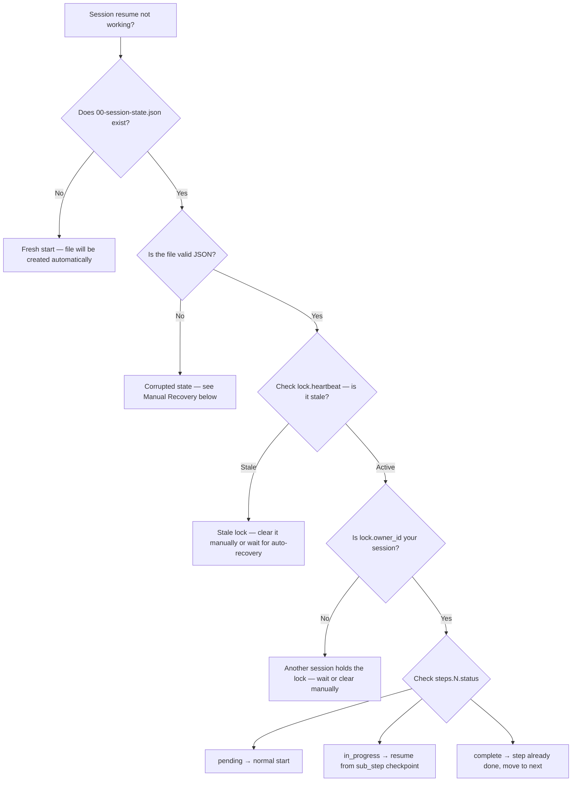

# :material-bug-outline: Session State Debugging

> Diagnose and recover from session resume failures, stale locks, and corrupted state.

## Session State Overview

Every workflow run maintains its progress in
`agent-output/{project}/00-session-state.json`. This file tracks:

- Which steps are complete, in progress, or pending
- Sub-step checkpoints within each step
- Decisions made during the workflow
- Lock/claim ownership for concurrent session safety

The schema version is declared in the `schema_version` field. The current
claim-based model (v2.0) adds atomic locking to prevent concurrent sessions
from overwriting each other. New state files should use `schema_version: "2.0"`.
The authoritative schema definition is in
`.github/skills/session-resume/references/state-file-schema.md`.

A human-readable companion file `00-handoff.md` summarises the same
state for manual inspection.

## Diagnostic Flowchart

Use this decision tree when session resume is not working:



## Common Problems

### Corrupted State File

**Symptoms:** JSON parse errors, missing required fields, validator failures.

**Fix:**

1. Run the validator to identify the issue:

   ```bash
   npm run validate:session-state
   ```

2. If the file is unrecoverable, check for a backup:

   ```bash
   ls agent-output/{project}/00-session-state.json.bak
   ```

   If a `.bak` file exists, restore it:

   ```bash
   cp agent-output/{project}/00-session-state.json.bak agent-output/{project}/00-session-state.json
   ```

3. If no backup exists, rename the corrupt file and restart:

   ```bash
   cd agent-output/{project}
   mv 00-session-state.json 00-session-state.json.corrupt
   ```

   The Conductor creates a fresh v2.0 state file on the next run.
   All steps reset to `pending`.

!!! tip "Prevention"

    The session-resume skill uses atomic writes (write to `.tmp`, rename to target,
    keep `.bak` of previous version) to prevent corruption during agent crashes.

### Stale Lock

**Symptoms:** "Lock held by another session" error, but no other session
is running.

A lock is considered stale when `lock.heartbeat` has not been updated
within the `stale_threshold_ms` window (default: 5 minutes).

**Fix:**

1. Check the heartbeat timestamp:

   ```bash
   jq '.lock.heartbeat' agent-output/{project}/00-session-state.json
   ```

2. If the timestamp is older than 5 minutes and no other session is active,
   clear the lock:

   ```bash
   jq '.lock = {}' agent-output/{project}/00-session-state.json > tmp.json
   mv tmp.json agent-output/{project}/00-session-state.json
   ```

3. Resume the workflow — the Conductor will re-acquire the lock.

### Missing Steps

**Symptoms:** Conductor skips a step or reports it as already complete
when it was never run.

**Fix:**

1. Inspect the step status:

   ```bash
   jq '.steps' agent-output/{project}/00-session-state.json
   ```

2. Reset the step to `pending`:

   ```bash
   jq '.steps."4".status = "pending" | .steps."4".sub_step = null' \
     agent-output/{project}/00-session-state.json > tmp.json
   mv tmp.json agent-output/{project}/00-session-state.json
   ```

### Schema Version Mismatch

**Symptoms:** Validator warns about unknown fields or missing lock/claim
structure.

The v2.0 schema added `lock`, `claim`, and `attempt_token` fields. If
you encounter a v1.0 state file, the Conductor will attempt to upgrade
it automatically. If it fails, manually add the missing fields or
create a fresh state file.

## Decision Logging

The `decisions` object in the session state tracks key choices made
during the workflow:

```json
{
  "decisions": {
    "iac_tool": "bicep",
    "primary_region": "swedencentral",
    "complexity": "standard"
  }
}
```

Write decisions at the moment they are made (Step 1 for `iac_tool`,
Step 2 for architecture choices). The Conductor and downstream agents
read these to route workflow steps correctly.

The `decision_log` array provides an append-only audit trail:

```json
{
  "decision_log": [
    {
      "step": 1,
      "key": "iac_tool",
      "value": "bicep",
      "reason": "Team preference and existing Bicep expertise"
    }
  ]
}
```

## Context Budget Strategy

Each step has a **file load budget** — a hard limit on how many files
the agent loads at startup. This prevents context window exhaustion:

| Step             | Budget    | Files Loaded                          |
| ---------------- | --------- | ------------------------------------- |
| 1 (Requirements) | 1-2 files | Session state only                    |
| 2 (Architecture) | 2-3 files | Requirements + session state          |
| 4 (Plan)         | 2-3 files | Architecture + governance constraints |
| 5 (Code)         | 1-2 files | Implementation plan                   |

Excess files are loaded on demand via progressive disclosure. If resume
is slow, check whether `context_files_used` in the session state lists
more files than the step's budget allows.

## Validators

Two validators check session state integrity:

```bash
# Validate JSON schema compliance
npm run validate:session-state

# Validate lock/claim model integrity
npm run validate:session-lock
```

Run these after manual edits to the state file to ensure consistency.

---

!!! tip "Further Reading"

    - [Workflow](workflow.md) — the multi-step agent workflow and approval gates
    - [Troubleshooting](troubleshooting.md) — common agent issues and solutions
    - [Validation & Linting](validation-reference.md) — all validation scripts
