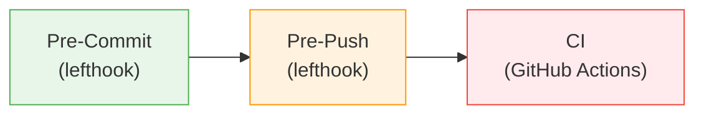

# :material-check-decagram: Validation and Linting Reference

> Central reference for all validation scripts, linting commands, git hooks, and CI workflows.

## Validation Architecture

Validation runs at three stages, catching issues progressively earlier:



1. **Pre-commit** — validates staged files only (fast, file-type scoped)
2. **Pre-push** — validates all changed files vs `main` (domain-scoped, parallel)
3. **CI** — validates the full repository on every PR and push to `main`

A **post-commit** layer also runs lightweight checks after each commit.

## Lefthook Hooks

All hooks are defined in `lefthook.yml` at the repository root.

### Pre-Commit Hooks

| Hook                  | Trigger (glob)                    | Purpose                                          |
| --------------------- | --------------------------------- | ------------------------------------------------ |
| `markdown-lint`       | `*.md`                            | markdownlint on staged markdown files            |
| `link-check`          | `docs/**/*.md`                    | Verify URLs in staged docs files                 |
| `h2-sync`             | SKILL.md, azure-artifacts files   | Check H2 heading sync across sources             |
| `artifact-validation` | `agent-output/**/*.md`            | Validate artifact H2 structure against templates |
| `agent-frontmatter`   | `**/*.agent.md`                   | Validate agent YAML frontmatter syntax           |
| `model-alignment`     | `**/*.agent.md`, `**/*.prompt.md` | Check model-prompt alignment                     |
| `agent-checks`        | `**/*.agent.md`                   | Agent body size and language density             |
| `instruction-checks`  | `**/*.instructions.md`            | Instruction frontmatter validation               |
| `instruction-refs`    | Agents, skills, instructions      | Cross-reference validation                       |
| `python-lint`         | `mcp/**/*.py`                     | Ruff linter on Python files                      |
| `terraform-fmt`       | `*.tf`                            | Terraform formatting check                       |
| `terraform-validate`  | `*.tf`                            | Terraform validation per project                 |

### Commit-Msg Hook

| Hook         | Purpose                                                                     |
| ------------ | --------------------------------------------------------------------------- |
| `commitlint` | Enforce [Conventional Commits](https://www.conventionalcommits.org/) format |

### Pre-Push Hooks

| Hook               | Purpose                                             |
| ------------------ | --------------------------------------------------- |
| `branch-naming`    | Validate branch name uses an approved prefix        |
| `branch-scope`     | Validate domain branches only modify in-scope files |
| `diff-based-check` | Run domain-scoped validators for changed file types |

### Post-Commit Hooks

| Hook              | Purpose                                                       |
| ----------------- | ------------------------------------------------------------- |
| `version-sync`    | Check version consistency across `VERSION.md`, `package.json` |
| `deprecated-refs` | Detect deprecated references in changed markdown              |
| `json-syntax`     | Validate JSON syntax of changed `.json` files                 |

## Validation Scripts

All scripts are in the `scripts/` directory. Run via `npm run <command>`.

### Architecture and Registry Validators

| npm Command                   | Script                            | Purpose                                           |
| ----------------------------- | --------------------------------- | ------------------------------------------------- |
| `lint:agent-frontmatter`      | `validate-agent-frontmatter.mjs`  | Agent definition frontmatter compliance           |
| `lint:agent-checks`           | `lint-agent-checks.mjs`           | Agent body size (≤350 lines) and language density |
| `lint:model-alignment`        | `lint-model-alignment.mjs`        | Model-specific prompt pattern compliance          |
| `lint:skills-format`          | `validate-skills-format.mjs`      | Skill file format and frontmatter                 |
| `validate:skill-checks`       | `validate-skill-checks.mjs`       | Skill size (≤500 lines) and references            |
| `validate:instruction-checks` | `validate-instruction-checks.mjs` | Instruction frontmatter and applyTo patterns      |
| `validate:agent-registry`     | `validate-agent-registry.mjs`     | Agent registry consistency                        |
| `validate:skill-affinity`     | `validate-skill-affinity.mjs`     | Skill-to-agent affinity mappings                  |
| `validate:workflow-graph`     | `validate-workflow-graph.mjs`     | DAG integrity (no orphans, no cycles)             |

### Artifact and Template Validators

| npm Command               | Script                            | Purpose                                     |
| ------------------------- | --------------------------------- | ------------------------------------------- |
| `lint:artifact-templates` | `validate-artifact-templates.mjs` | H2 heading strictness for agent outputs     |
| `lint:h2-sync`            | `validate-h2-sync.mjs`            | H2 heading consistency across three sources |
| `fix:artifact-h2`         | `fix-artifact-h2.mjs`             | Auto-fix artifact H2 headings               |
| `e2e:validate`            | `validate-e2e-step.mjs`           | E2E pipeline structural validation          |
| `e2e:benchmark`           | `benchmark-e2e.mjs`               | 8-dimension benchmark scoring               |

### Governance and Compliance Validators

| npm Command                      | Script                                   | Purpose                                                      |
| -------------------------------- | ---------------------------------------- | ------------------------------------------------------------ |
| `lint:governance-refs`           | `validate-governance-refs.mjs`           | Governance guardrails integrity                              |
| `validate:no-hardcoded-counts`   | `validate-no-hardcoded-counts.mjs`       | Prevent hardcoded entity counts                              |
| `validate:stale-refs`            | `validate-no-stale-skill-references.mjs` | Detect stale skill references                                |
| `lint:deprecated-refs`           | `validate-no-deprecated-refs.mjs`        | Block deprecated API/pattern references                      |
| `validate:iac-security-baseline` | `validate-iac-security-baseline.mjs`     | IaC security baseline (TLS, HTTPS, blob, identity, SQL auth) |

### Session and State Validators

| npm Command              | Script                       | Purpose                                |
| ------------------------ | ---------------------------- | -------------------------------------- |
| `validate:session-state` | `validate-session-state.mjs` | Session state JSON schema compliance   |
| `validate:session-lock`  | `validate-session-lock.mjs`  | Distributed lock/claim model integrity |

### Quality and Cross-Reference Validators

| npm Command             | Script                          | Purpose                            |
| ----------------------- | ------------------------------- | ---------------------------------- |
| `lint:glob-audit`       | `validate-glob-audit.mjs`       | Detect overly broad glob patterns  |
| `lint:skill-references` | `validate-skill-references.mjs` | Validate skill cross-references    |
| `lint:orphaned-content` | `validate-orphaned-content.mjs` | Detect unreferenced skills/content |
| `validate:docs-sync`    | `validate-docs-sync.mjs`        | Documentation file sync checks     |
| `lint:docs-freshness`   | `check-docs-freshness.mjs`      | Documentation staleness detection  |
| `lint:version-sync`     | `validate-version-sync.mjs`     | Version consistency across files   |

### Configuration Validators

| npm Command       | Script                       | Purpose                           |
| ----------------- | ---------------------------- | --------------------------------- |
| `validate:vscode` | `validate-vscode-config.mjs` | VS Code settings completeness     |
| `validate:hooks`  | `validate-hooks.mjs`         | Hook script structure and syntax  |
| `lint:mcp-config` | `validate-mcp-config.mjs`    | MCP server configuration validity |

### Code and Format Linters

| npm Command          | Tool                | Purpose                                        |
| -------------------- | ------------------- | ---------------------------------------------- |
| `lint:md`            | markdownlint-cli2   | Markdown formatting and style                  |
| `lint:links`         | markdown-link-check | URL validity in all markdown files             |
| `lint:links:docs`    | markdown-link-check | URL validity in `docs/` only                   |
| `lint:json`          | `lint-json.mjs`     | JSON/JSONC syntax validation                   |
| `lint:python`        | ruff                | Python code quality (`mcp/azure-pricing-mcp/`) |
| `lint:terraform-fmt` | terraform fmt       | Terraform formatting compliance                |
| `validate:terraform` | terraform validate  | Terraform validation per project               |

### Aggregate Commands

| npm Command          | Purpose                                       |
| -------------------- | --------------------------------------------- |
| `validate:all`       | Run all validators (parallel Node + external) |
| `validate:_node`     | All Node.js validators in parallel            |
| `validate:_external` | All external tool validators in parallel      |
| `validate:agents`    | Agent frontmatter + skills format combined    |

## CI Workflows

All workflows are in `.github/workflows/`.

| Workflow                  | File                            | Trigger                               | Purpose                                                      |
| ------------------------- | ------------------------------- | ------------------------------------- | ------------------------------------------------------------ |
| Lint                      | `lint.yml`                      | PR to `main`, push to `main`          | Markdown, artifacts, H2 sync, instructions, JSON, MCP config |
| Agent Validation          | `agent-validation.yml`          | Changes to agents/skills/instructions | Agent frontmatter, skills format, VS Code config             |
| Branch Enforcement        | `branch-enforcement.yml`        | PR to `main`                          | Branch naming convention and scope validation                |
| Link Check                | `link-check.yml`                | Docs changes                          | URL validity in documentation                                |
| Docs                      | `docs.yml`                      | Docs changes                          | Build and deploy Astro Starlight site                        |
| Docs Freshness            | `docs-freshness.yml`            | Scheduled                             | Documentation staleness detection                            |
| E2E Validation            | `e2e-validation.yml`            | Agent output changes                  | E2E pipeline structural validation                           |
| Policy Compliance         | `policy-compliance-check.yml`   | IaC changes                           | Azure Policy compliance checks                               |
| AVM Version Check         | `avm-version-check.yml`         | Scheduled                             | Azure Verified Module version updates                        |
| Azure Deprecation Tracker | `azure-deprecation-tracker.yml` | Scheduled                             | Track Azure service deprecations                             |

## Running Validations Locally

```bash
# Run everything
npm run validate:all

# Run a specific category
npm run lint:md                    # Markdown only
npm run lint:agent-frontmatter     # Agent definitions only
npm run validate:session-state     # Session state only

# Auto-fix where supported
npm run lint:md:fix                # Fix markdown issues
npm run fix:artifact-h2 <file> --apply  # Fix artifact H2 headings
npm run lint:python:fix            # Fix Python lint issues
```

---

!!! tip "Further Reading"

    - [Contributing](CONTRIBUTING.md) — branch naming and commit conventions
    - [Agent Hooks](hooks.md) — VS Code agent hooks (lifecycle automation)
    - [E2E Testing](e2e-testing.md) — Ralph Loop evaluation framework
