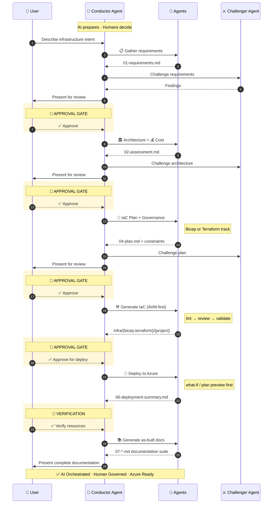

<div align="center">
  
</div>

# :material-chart-timeline-variant: Agent and Skill Workflow

The multi-step infrastructure development workflow — how agents execute each step
with artifact handoffs and approval gates. For the underlying DAG model and engine
internals, see [Workflow Engine & Quality](how-it-works/workflow-engine.md).

## :material-eye-outline: Overview

Agentic InfraOps uses a multi-agent orchestration system where specialized AI agents coordinate
through artifact handoffs to transform Azure infrastructure requirements into deployed infrastructure
code. The system supports **dual IaC tracks** — Bicep and Terraform — sharing common requirements,
architecture, design, and governance steps (1-3.5) then diverging into track-specific planning,
code generation, and deployment (steps 4-6) before converging again for documentation (step 7).

The **InfraOps Conductor** (🎼 Maestro, also referred to as the Coordinator)
orchestrates the complete workflow, routing to
Bicep or Terraform agents based on the `iac_tool` field in `01-requirements.md`,
while enforcing mandatory approval gates.

!!! tip "Quick Start"

    Press ++ctrl+shift+i++ to open Copilot Chat, select **InfraOps Conductor**, and
    describe your project. The Conductor handles all steps with approval gates.

### Formalized Workflow Engine

A machine-readable DAG (Directed Acyclic Graph) in
`.github/skills/workflow-engine/templates/workflow-graph.json` encodes the workflow.
The Conductor reads this graph instead of relying on hardcoded step logic:

- **Nodes**: agent-step, gate, subagent-fan-out, validation
- **Edges**: dependency links with conditions (`on_complete`, `on_skip`, `on_fail`)
- **IaC routing**: conditional edges route to Bicep or Terraform agents based on `decisions.iac_tool`
- **Fan-out**: Step 7 substeps (cost estimate, runbook, etc.) can execute in parallel

The Conductor resolves agent paths and models via `.github/agent-registry.json`.

### Fast-Path Variant

For **simple projects** (≤3 resources, single environment, no custom policies), the
**01-Conductor (Fast Path)** combines Plan and Code into a single step with 1-pass review.
Before skipping governance discovery, it validates the subscription has no Deny-effect
policies via Azure CLI. If Deny policies are found, it falls back to the full Conductor
automatically.

## :material-robot-outline: Agent Architecture

### The Conductor Pattern

The Conductor (also called Coordinator) orchestrates the entire workflow by delegating
to specialised agents step by step, enforcing approval gates, and maintaining session state.
The following diagram shows the end-to-end flow:



### Agent Delegation Graph

The detailed delegation graph below shows how the Conductor routes to each
specialised agent and how subagents are invoked for validation:

```mermaid
%%{init: {'theme':'neutral'}}%%
graph TB
    subgraph "Orchestrator"
        COND["InfraOps Conductor<br/>🎼 Maestro"]
    end

    subgraph "Step 1: Requirements"
        REQ["requirements<br/>📜 Scribe"]
    end

    subgraph "Step 2: Architecture"
        ARCH["architect<br/>🏛️ Oracle"]
        MCP["💰 Azure Pricing MCP"]
    end

    subgraph "Step 3: Design Artifacts"
        DIAG["azure-diagrams<br/>🎨 Skill"]
        ADR["azure-adr<br/>📝 Skill"]
    end

    subgraph "Step 3.5: Governance"
        GOV["governance<br/>🛡️ Warden"]
    end

    subgraph "Step 4: Planning"
        BPLAN["bicep-plan<br/>📐 Strategist"]
        TPLAN["terraform-plan<br/>📐 Strategist"]
    end

    subgraph "Step 5: Implementation"
        BCODE["bicep-code<br/>⚒️ Forge"]
        BLINT["bicep-lint-subagent"]
        BWHATIF["bicep-whatif-subagent"]
        BREVIEW["bicep-review-subagent"]
        TCODE["terraform-code<br/>⚒️ Forge"]
        TLINT["terraform-lint-subagent"]
        TPLANSA["terraform-plan-subagent"]
        TREVIEW["terraform-review-subagent"]
    end

    subgraph "Step 6: Deployment"
        BDEP["bicep-deploy<br/>🚀 Envoy"]
        TDEP["terraform-deploy<br/>🚀 Envoy"]
    end

    subgraph "Step 7: Documentation"
        DOCS["azure-artifacts<br/>📚 Skill"]
    end

    COND -->|"delegates"| REQ
    COND -->|"delegates"| ARCH
    COND -->|"invokes"| DIAG
    COND -->|"invokes"| ADR
    COND -->|"delegates"| GOV
    COND -->|"Bicep track"| BPLAN
    COND -->|"Terraform track"| TPLAN
    COND -->|"Bicep track"| BCODE
    COND -->|"Terraform track"| TCODE
    BCODE -->|"validates"| BLINT
    BCODE -->|"validates"| BWHATIF
    BCODE -->|"validates"| BREVIEW
    TCODE -->|"validates"| TLINT
    TCODE -->|"validates"| TPLANSA
    TCODE -->|"validates"| TREVIEW
    COND -->|"Bicep track"| BDEP
    COND -->|"Terraform track"| TDEP
    COND -->|"invokes"| DOCS

    MCP -.->|"pricing data"| ARCH

    style COND fill:#8957E5,color:#fff
    style REQ fill:#e1f5fe
    style ARCH fill:#fff3e0
    style MCP fill:#fff9c4
    style DIAG fill:#f3e5f5
    style ADR fill:#e8eaf6
    style GOV fill:#fff3e0
    style BPLAN fill:#e8f5e9
    style TPLAN fill:#e8f5e9
    style BCODE fill:#fce4ec
    style TCODE fill:#fce4ec
    style BDEP fill:#c8e6c9
    style TDEP fill:#c8e6c9
    style DOCS fill:#e3f2fd
```



## :material-account-group-outline: Agent Roster

### Primary Orchestrator

| Agent                  | Codename   | Role                                        | Model                |
| ---------------------- | ---------- | ------------------------------------------- | -------------------- |
| **InfraOps Conductor** | 🎼 Maestro | Master orchestrator for multi-step workflow | Claude Opus (latest) |

### Core Agents (by Workflow Step)

Steps 1-3.5 and 7 are shared. Steps 4-6 have Bicep and Terraform variants.

| Step | Agent              | Codename      | Role                                 | Artifact                                                |
| ---- | ------------------ | ------------- | ------------------------------------ | ------------------------------------------------------- |
| 1    | `requirements`     | 📜 Scribe     | Captures infrastructure requirements | `01-requirements.md`                                    |
| 2    | `architect`        | 🏛️ Oracle     | WAF assessment and design decisions  | `02-architecture-assessment.md`                         |
| 3    | `design`           | 🎨 Artisan    | Diagrams and ADRs                    | `03-des-*.{excalidraw,py,png,md}`                       |
| 3.5  | `governance`       | 🛡️ Warden     | Policy discovery and compliance      | `04-governance-constraints.md/.json`                    |
| 4b   | `bicep-plan`       | 📐 Strategist | Bicep implementation planning        | `04-implementation-plan.md` + `04-*-diagram.excalidraw` |
| 4t   | `terraform-plan`   | 📐 Strategist | Terraform implementation planning    | `04-implementation-plan.md` + `04-*-diagram.excalidraw` |
| 5b   | `bicep-code`       | ⚒️ Forge      | Bicep template generation            | `infra/bicep/{project}/`                                |
| 5t   | `terraform-code`   | ⚒️ Forge      | Terraform configuration generation   | `infra/terraform/{project}/`                            |
| 6b   | `bicep-deploy`     | 🚀 Envoy      | Bicep deployment                     | `06-deployment-summary.md`                              |
| 6t   | `terraform-deploy` | 🚀 Envoy      | Terraform deployment                 | `06-deployment-summary.md`                              |
| 7    | `as-built`         | 📚 Chronicler | Post-deployment documentation suite  | `07-*.md`                                               |

### Validation Subagents

**Bicep track:**

| Subagent                | Purpose                                         | Invoked By                   |
| ----------------------- | ----------------------------------------------- | ---------------------------- |
| `bicep-lint-subagent`   | Syntax validation (`bicep lint`, `bicep build`) | `bicep-code`                 |
| `bicep-whatif-subagent` | Deployment preview (`az deployment what-if`)    | `bicep-code`, `bicep-deploy` |
| `bicep-review-subagent` | Code review (AVM, security, naming)             | `bicep-code`                 |

**Terraform track:**

| Subagent                    | Purpose                                         | Invoked By       |
| --------------------------- | ----------------------------------------------- | ---------------- |
| `terraform-lint-subagent`   | Syntax validation (`terraform validate`, `fmt`) | `terraform-code` |
| `terraform-plan-subagent`   | Deployment preview (`terraform plan`)           | `terraform-code` |
| `terraform-review-subagent` | Code review (AVM-TF, security, naming)          | `terraform-code` |

### Standalone Agents

| Agent        | Codename      | Role                                                            |
| ------------ | ------------- | --------------------------------------------------------------- |
| `challenger` | ⚔️ Challenger | Adversarial reviewer — challenges architecture, plans, and code |
| `diagnose`   | 🔍 Sentinel   | Resource health assessment and troubleshooting                  |

## :material-shield-lock-outline: Approval Gates

The Conductor enforces mandatory pause points for human oversight:

!!! warning "Never Skip Gates"

    Gates are non-negotiable. Skipping approval gates can lead to deploying
    infrastructure that violates governance policies or security baselines.

| Gate         | After Step            | User Action                         |
| ------------ | --------------------- | ----------------------------------- |
| **Gate 1**   | Requirements (Step 1) | Confirm requirements complete       |
| **Gate 2**   | Architecture (Step 2) | Approve WAF assessment              |
| **Gate 2.5** | Governance (Step 3.5) | Approve governance constraints      |
| **Gate 3**   | Planning (Step 4)     | Approve implementation plan         |
| **Gate 4**   | Pre-Deploy (Step 5)   | Approve lint/what-if/review results |
| **Gate 5**   | Post-Deploy (Step 6)  | Verify deployment                   |

## :material-list-status: Workflow Steps

### Step 1: Requirements (📜 Scribe)

**Agent**: `requirements`

Gather infrastructure requirements through interactive conversation.

```text
Invoke: Ctrl+Shift+A → requirements
Output: agent-output/{project}/01-requirements.md
```

**Captures**:

- Functional requirements (what the system does)
- Non-functional requirements (performance, availability, security)
- Compliance requirements (regulatory, organizational)
- Budget constraints

**Handoff**: Passes context to `architect` agent.

### Step 2: Architecture (🏛️ Oracle)

**Agent**: `architect`

Evaluate requirements against Azure Well-Architected Framework pillars.

```text
Invoke: Ctrl+Shift+A → architect
Output: agent-output/{project}/02-architecture-assessment.md
```

**Features**:

- WAF pillar scoring (Reliability, Security, Cost, Operations, Performance)
- SKU recommendations with real-time pricing (via Azure Pricing MCP)
- Architecture decisions with rationale
- Risk identification and mitigation

**Handoff**: Suggests `azure-diagrams` skill or IaC planning agent (`bicep-plan` / `terraform-plan`).

### Step 3: Design Artifacts (🎨 Artisan | Optional)

**Skills**: `azure-diagrams`, `azure-adr`

Create visual and textual design documentation.

```text
Trigger: "Create an architecture diagram for {project}"
Output: agent-output/{project}/03-des-diagram.excalidraw, 03-des-adr-*.md
```

**Diagram types**: Azure architecture, business flows, ERD, timelines

**ADR content**: Decision, context, alternatives, consequences

### Step 3.5: Governance (🛡️ Warden)

**Agent**: `governance` (`04g-Governance`)

Discover Azure Policy constraints and produce governance artifacts.

```text
Invoke: Ctrl+Shift+A → governance
Output: agent-output/{project}/04-governance-constraints.md, 04-governance-constraints.json
```

**Features**:

- Azure Policy REST API discovery via `governance-discovery-subagent`
- Policy effect classification (Deny, Audit, Modify, DeployIfNotExists)
- Dual-track property mapping (`bicepPropertyPath` + `azurePropertyPath`)

!!! info "Approval Gate"

    The user must approve governance constraints before proceeding to planning.

### Step 4: Planning (📐 Strategist)

**Agent**: `bicep-plan` (Bicep track) or `terraform-plan` (Terraform track)

Create detailed implementation plan using governance constraints as input.
The planner validates governance completeness before proceeding: the
`04-governance-constraints.json` file must exist, be valid JSON, have
`discovery_status: "COMPLETE"`, and contain a policy array. If any check
fails, the planner stops and requests governance refresh.

=== "Bicep"

    ```text
    Invoke: Ctrl+Shift+A → bicep-plan
    Output: agent-output/{project}/04-implementation-plan.md
    ```

=== "Terraform"

    ```text
    Invoke: Ctrl+Shift+A → terraform-plan
    Output: agent-output/{project}/04-implementation-plan.md
    ```

**Prerequisites**: `04-governance-constraints.md/.json` from Step 3.5

**Features**:

- Governance constraints integration from Step 3.5
- AVM module selection (Bicep: `br/public:avm/res/`, Terraform: AVM-TF registry)
- Resource dependency mapping
- Auto-generated Step 4 diagrams (`04-dependency-diagram.excalidraw` and `04-runtime-diagram.excalidraw`)
- Naming convention validation (CAF)
- Phased implementation approach

!!! info "Approval Gate"

    The user must approve the implementation plan before proceeding to code generation.

### Step 5: Implementation (⚒️ Forge)

**Agent**: `bicep-code` (Bicep track) or `terraform-code` (Terraform track)

Generate IaC templates following Azure Verified Modules standards.

=== "Bicep"

    ```text
    Invoke: Ctrl+Shift+A → bicep-code
    Output: infra/bicep/{project}/main.bicep, modules/
    ```

=== "Terraform"

    ```text
    Invoke: Ctrl+Shift+A → terraform-code
    Output: infra/terraform/{project}/main.tf, modules/
    ```

Both tracks also produce `agent-output/{project}/05-implementation-reference.md`.

**Standards** (shared across both tracks):

- AVM-first approach (Bicep: public registry; Terraform: AVM-TF registry)
- Unique suffix for global resource names
- Required tags on all resources
- Security defaults (TLS 1.2, HTTPS-only, managed identity)
- Phase 1.5 governance compliance mapping from `04-governance-constraints.json`

**Preflight Validation** (via track-specific subagents):

| Bicep Subagent          | Terraform Subagent          | Validation                    |
| ----------------------- | --------------------------- | ----------------------------- |
| `bicep-lint-subagent`   | `terraform-lint-subagent`   | Syntax check, linting rules   |
| `bicep-whatif-subagent` | `terraform-plan-subagent`   | Deployment preview            |
| `bicep-review-subagent` | `terraform-review-subagent` | AVM compliance, security scan |

!!! info "Approval Gate"

    The user must approve preflight validation results before deployment.

### Step 6: Deployment (🚀 Envoy)

**Agent**: `bicep-deploy` (Bicep track) or `terraform-deploy` (Terraform track)

Execute Azure deployment with preflight validation.

!!! warning "Pre-Deploy Security Review"

    Before deployment, the agent runs `npm run validate:iac-security-baseline`
    (TLS 1.2, HTTPS-only, no public blob, managed identity, SQL Entra-only auth)
    and invokes `challenger-review-subagent` for a security-governance review
    of the what-if/plan output. Violations block deployment.

=== "Bicep"

    ```text
    Invoke: Ctrl+Shift+A → bicep-deploy
    Output: agent-output/{project}/06-deployment-summary.md
    ```

    **Bicep features**: `bicep build` validation, `az deployment group what-if` analysis,
    deployment execution via `deploy.ps1`, post-deployment resource verification.

=== "Terraform"

    ```text
    Invoke: Ctrl+Shift+A → terraform-deploy
    Output: agent-output/{project}/06-deployment-summary.md
    ```

    **Terraform features**: `terraform validate` and `terraform fmt -check`,
    `terraform plan` preview, phase-aware deployment via `bootstrap.sh` and `deploy.sh`,
    post-deployment resource verification.

!!! info "Approval Gate"

    The user must verify deployed resources before proceeding to documentation.

### Step 7: Documentation (📚 Skills)

**Skill**: `azure-artifacts`

Generate comprehensive workload documentation.

```text
Trigger: "Generate documentation for {project}"
Output: agent-output/{project}/07-*.md
```

**Document Suite**:

| File                        | Purpose                        |
| --------------------------- | ------------------------------ |
| `07-documentation-index.md` | Master index with links        |
| `07-design-document.md`     | Technical design documentation |
| `07-operations-runbook.md`  | Day-2 operational procedures   |
| `07-resource-inventory.md`  | Complete resource listing      |
| `07-ab-cost-estimate.md`    | As-built cost analysis         |
| `07-compliance-matrix.md`   | Security control mapping       |
| `07-backup-dr-plan.md`      | Disaster recovery procedures   |

## :material-scale-balance: Complexity Classification

The Requirements agent classifies project complexity based on scope.
The Conductor validates the classification. Complexity drives the number
of adversarial review passes at Steps 1, 2, 4, and 5.

| Tier         | Criteria                                                                     |
| ------------ | ---------------------------------------------------------------------------- |
| **Simple**   | ≤3 resource types, single region, no custom Azure Policy, single environment |
| **Standard** | 4–8 resource types, multi-region OR multi-env (not both), ≤3 custom policies |
| **Complex**  | >8 resource types, multi-region + multi-env, >3 custom policies, hub-spoke   |

### Adversarial Review Matrix

Reviews target AI-generated creative decisions (architecture, plan, code)
— not machine-discovered data (governance) or Azure tool output (what-if).

| Complexity | Step 1 (Req) | Step 2 (Arch)     | Step 4 (Plan) | Step 5 (Code) |
| ---------- | ------------ | ----------------- | ------------- | ------------- |
| simple     | 1×           | 1× + 1 cost       | 1×            | 1×            |
| standard   | 1×           | 2× (→3×) + 1 cost | 2×            | 2× (→3×)      |
| complex    | 1×           | 3× + 1 cost       | 2×            | 3×            |

> **Conditional passes**: "(→3×)" means pass 3 only runs if pass 2
> returned ≥1 `must_fix`. Plan reviews are capped at 2 passes because
> the cost-feasibility lens was already applied at Step 2.
> "+ 1 cost" is a dedicated cost-estimate challenger pass that always
> runs in parallel with architecture pass 1 (independent artifact).
>
> **Steps without review**: Design (3), Deploy (6),
> As-Built (7). Deploy previews
> are validated by Azure tooling; the human approves at each gate.
> Governance (3.5) now has 1 comprehensive challenger pass.

## Agents vs Skills

| Aspect          | Agents                                   | Skills                   |
| --------------- | ---------------------------------------- | ------------------------ |
| **Invocation**  | Manual (`Ctrl+Shift+A`) or via Conductor | Automatic or explicit    |
| **Interaction** | Conversational with handoffs             | Task-focused             |
| **State**       | Session context                          | Stateless                |
| **Output**      | Multiple artifacts                       | Specific outputs         |
| **When to use** | Core workflow steps                      | Specialized capabilities |

## Quick Reference

### Using the Conductor (Recommended)

```text
1. Ctrl+Shift+I → Select "InfraOps Conductor"
2. Describe your infrastructure project
3. Follow guided workflow through all steps with approval gates
```

### Direct Agent Invocation

```text
1. Ctrl+Shift+A → Select specific agent
2. Provide context for that step
3. Agent produces artifacts and suggests next step
```

### Skill Invocation

**Automatic**: Skills activate based on prompt keywords:

```text
"Create an architecture diagram" → azure-diagrams skill
"Document the decision to use AKS" → azure-adr skill
```

**Explicit**: Reference the skill by name:

```text
"Use the azure-artifacts skill to generate documentation"
```

## Artifact Naming Convention

| Step           | Prefix    | Example                                                     |
| -------------- | --------- | ----------------------------------------------------------- |
| Requirements   | `01-`     | `01-requirements.md`                                        |
| Architecture   | `02-`     | `02-architecture-assessment.md`                             |
| Design         | `03-des-` | `03-des-diagram.excalidraw`, `03-des-adr-0001-*.md`         |
| Planning       | `04-`     | `04-implementation-plan.md`, `04-governance-constraints.md` |
| Implementation | `05-`     | `05-implementation-reference.md`                            |
| Deployment     | `06-`     | `06-deployment-summary.md`                                  |
| As-Built       | `07-`     | `07-design-document.md`, `07-ab-diagram.excalidraw`         |
| Diagnostics    | `08-`     | `08-resource-health-report.md`                              |

## Next Steps

- [Prompt Guide](prompt-guide/index.md) — ready-to-use prompts for every agent and skill
- [Quickstart](quickstart.md) — 10-minute getting started walkthrough
