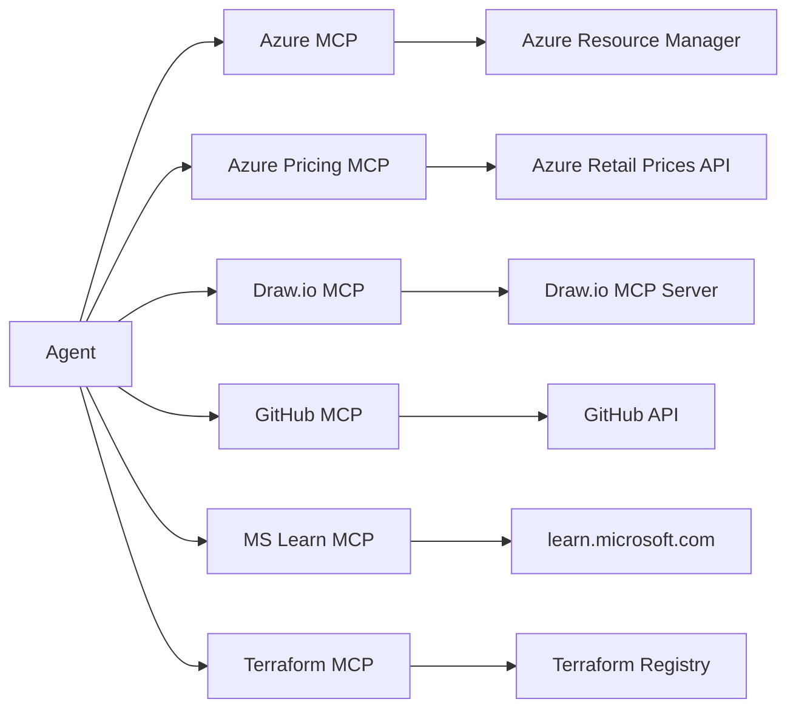

The Model Context Protocol (MCP) is an open standard that allows AI agents to
discover and invoke external tools through a uniform JSON-RPC interface.
This project integrates several core MCP servers, each providing specialised capabilities that
agents invoke at runtime: Azure MCP, Azure Pricing MCP, Draw.io MCP, GitHub MCP,
MS Learn MCP, and Terraform MCP. All core servers are declared in `.vscode/mcp.json`.
A non-core `astro-docs` server is also declared in `.vscode/mcp.json` for documentation
site development but is not part of the core agent toolchain.

## MCP Architecture

All core MCP servers are declared in `.vscode/mcp.json` and start automatically
when VS Code invokes them. The Azure MCP Server runs via the official
[`@azure/mcp`](https://github.com/Azure/azure-mcp) npm package (launched
through `npx`) and uses `az login` credentials. Agents never
call cloud APIs directly; they call MCP tools, which handle authentication, caching,
pagination, retries, and response formatting.



## Azure MCP Server

| Property  | Value                                                          |
| --------- | -------------------------------------------------------------- |
| Transport | stdio (via `npx @azure/mcp@latest`)                            |
| Package   | [`@azure/mcp`](https://github.com/Azure/azure-mcp) (Microsoft) |
| Auth      | Azure CLI (`az login`) or managed identity                     |
| Purpose   | RBAC-aware Azure resource context for agents                   |

The Azure MCP Server is a **critical component** declared in
`.vscode/mcp.json` and launched on demand via `npx -y @azure/mcp@latest
server start`. It provides agents with direct, RBAC-aware access to
Azure Resource Manager for querying subscriptions, resource groups,
resources, deployments, and policy assignments. Unlike the Azure Pricing
MCP server (which queries public pricing APIs), this server operates
against live Azure environments using the authenticated user's credentials.

Agents use it across the entire workflow — from governance discovery
(querying Azure Policy assignments) through deployment (validating
resource state) to as-built documentation (inventorying deployed resources).
It is scoped as a **default server** alongside GitHub, meaning virtually every
agent has access.

Installation follows the [Azure MCP Server README](https://github.com/microsoft/mcp/blob/main/servers/Azure.Mcp.Server/README.md#npm)
and is pre-configured in the dev container via `.vscode/mcp.json`. The first
invocation triggers an `npx` download; subsequent runs use the npx cache.

## Azure Pricing MCP Server

| Property  | Value                                                      |
| --------- | ---------------------------------------------------------- |
| Transport | stdio                                                      |
| Command   | Python (`azure_pricing_mcp` module)                        |
| Auth      | None for pricing; Azure credentials for Spot VM tools      |
| Tools     | Multiple (see tool list below)                             |
| Source    | `tools/mcp-servers/azure-pricing/` (custom, built in-repo) |

This is a **custom MCP server built specifically for this project**. It
queries the [Azure Retail Prices API](https://learn.microsoft.com/en-us/rest/api/cost-management/retail-prices/azure-retail-prices)
and provides tools for cost estimation, SKU discovery, and FinOps:

| Tool                           | Purpose                                            |
| ------------------------------ | -------------------------------------------------- |
| `azure_price_search`           | Search retail prices with filters                  |
| `azure_price_compare`          | Compare prices across regions/SKUs                 |
| `azure_cost_estimate`          | Estimate costs based on usage                      |
| `azure_sku_discovery`          | Intelligent SKU name matching (canonical)          |
| `azure_discover_skus`          | **⚠️ Deprecated v5.0** — use `azure_sku_discovery` |
| `azure_region_recommend`       | Find cheapest regions                              |
| `azure_ri_pricing`             | Reserved Instance pricing and savings              |
| `azure_bulk_estimate`          | Multi-resource estimate in one call                |
| `get_customer_discount`        | Customer discount percentage                       |
| `spot_eviction_rates`          | Spot VM eviction rates (requires `[admin]` extras) |
| `spot_price_history`           | Spot VM price history (90 days)                    |
| `simulate_eviction`            | Simulate Spot VM eviction                          |
| `find_orphaned_resources`      | Detect unused Azure resources (`[admin]` extras)   |
| `azure_ptu_sizing`             | Estimate PTUs for Azure OpenAI deployments         |
| `databricks_dbu_pricing`       | Search Databricks DBU rates                        |
| `databricks_cost_estimate`     | Estimate Databricks costs                          |
| `databricks_compare_workloads` | Compare Databricks workload costs                  |
| `github_pricing`               | GitHub pricing catalog (Plans, Copilot, Actions)   |
| `github_cost_estimate`         | GitHub cost estimation                             |

The server includes user-friendly service name mappings
(e.g., `"front door"` → `"Azure Front Door Service"`,
`"private endpoint"` → `"Virtual Network"`), request deduplication,
and connection pooling for optimal performance.

:::note[Pricing accuracy]
Cached prices may not reflect real-time promotional discounts, reserved instance
pricing, or recent regional changes. Always validate final estimates in the
[Azure Pricing Calculator](https://azure.microsoft.com/pricing/calculator/)
before committing budget.
:::

Primarily scoped to the **Architect** agent (Step 2), the
**cost-estimate-subagent**, and the **As-Built** agent (Step 7).

## Draw.io MCP Server

| Property  | Value                                                       |
| --------- | ----------------------------------------------------------- |
| Transport | stdio                                                       |
| Command   | Deno (`tools/mcp-servers/drawio/src/index.ts`)              |
| Auth      | None                                                        |
| Icons     | 700+ built-in Azure service icons                           |
| Source    | `tools/mcp-servers/drawio/` (simonkurtz-MSFT fork, in-repo) |
| Purpose   | Azure architecture diagrams via batch MCP tools             |

The Draw.io MCP server provides agents with batch diagram creation tools
for generating Azure architecture diagrams as `.drawio` files. It includes
700+ built-in Azure service icons resolved via `shape_name`, supports
transactional mode for multi-step diagram builds, and handles group
containment, edge routing, and placeholder resolution automatically.

Key tools: `search-shapes`, `create-groups`, `add-cells`,
`add-cells-to-group`, `finish-diagram`, `export-diagram`.

It is primarily used by the **Design** agent (Step 3), the planning agents
that emit architecture views, and the `drawio` skill.

## :octicons-mark-github-16: GitHub MCP Server

| Property  | Value                                         |
| --------- | --------------------------------------------- |
| Transport | HTTP                                          |
| Endpoint  | `https://api.githubcopilot.com/mcp/`          |
| Auth      | Automatic via GitHub Copilot token            |
| Purpose   | Issues, PRs, repos, code search, file content |

The GitHub MCP server is the primary interface for repository operations.
Agents use it to create issues, open pull requests, search code, read file
contents, manage branches, and automate the Smart PR Flow lifecycle. It is
scoped as a default server, so every agent has access.

## MS Learn MCP Server

| Property  | Value                                                     |
| --------- | --------------------------------------------------------- |
| Transport | HTTP                                                      |
| Endpoint  | `https://learn.microsoft.com/api/mcp?maxTokenBudget=4000` |
| Auth      | None (public API)                                         |
| Purpose   | Search and fetch official Microsoft documentation         |

The MS Learn MCP server provides agents with access to official
Microsoft and Azure documentation. Agents use it to look up service
configurations, verify best practices, and ground architecture decisions
in authoritative sources.

| Tool                           | Purpose                                    |
| ------------------------------ | ------------------------------------------ |
| `microsoft_docs_search`        | Search docs, return concise content chunks |
| `microsoft_docs_fetch`         | Fetch full page content as markdown        |
| `microsoft_code_sample_search` | Search for code examples in Microsoft docs |

Used across the workflow — the **Architect** agent (Step 2) searches
documentation for each Azure service, **IaC Planner** (Step 4) looks
up AVM module documentation, and the `copilot-customization` skill
caches fetched pages for offline reference.

Three skills also package this server for repeated use:

| Skill                      | Purpose                                                        |
| -------------------------- | -------------------------------------------------------------- |
| `microsoft-docs`           | Search and fetch documentation — concepts, guides, limits      |
| `microsoft-code-reference` | Verify SDK methods, find code samples, catch hallucinated APIs |
| `microsoft-skill-creator`  | Generate new agent skills for Microsoft technologies           |

The `maxTokenBudget=4000` parameter prevents oversized responses from consuming
excessive context window space.

:::tip[CLI fallback]
If the Learn MCP server is unavailable, agents can use the `mslearn` CLI:
`npx @microsoft/learn-cli search "azure functions timeout"`. The related
skills include CLI fallback guidance.
:::

## Terraform MCP Server

| Property  | Value                                     |
| --------- | ----------------------------------------- |
| Transport | stdio                                     |
| Command   | Go binary (`terraform-mcp-server`)        |
| Toolsets  | `registry`                                |
| Purpose   | Provider/module lookup, version discovery |

The Terraform MCP server provides registry integration for the Terraform
IaC track. Agents use it to discover the latest provider and module
versions, look up provider capabilities (resources, data sources, functions),
and retrieve module details before generating Terraform configurations.

Scoped exclusively to the **IaC Planner** (Step 4), **Terraform
CodeGen** (Step 5t) and **terraform-validate-subagent**.

## Operations and Setup

This section covers installation verification, authentication, error
handling, and adding custom MCP servers.

### Verifying MCP Servers

All six core MCP servers are configured in `.vscode/mcp.json` and
start automatically when VS Code invokes them. To verify they are working:

1. Open any agent chat (e.g. the Orchestrator)
2. The agent's tool list should include MCP tools
3. Run `npm run lint:mcp-config` to validate the configuration file

The Azure MCP Server is launched on demand via `npx @azure/mcp@latest`.
The first run downloads the package into the npx cache; later runs reuse it.

### Authentication Flows

| Server            | Auth Method                                | Setup                           |
| ----------------- | ------------------------------------------ | ------------------------------- |
| Azure MCP         | Azure CLI or managed identity              | Run `az login` before using     |
| Azure Pricing MCP | None for pricing; Azure CLI for Spot tools | `az login` for Spot VM features |
| Draw.io MCP       | None                                       | No setup needed                 |
| GitHub MCP        | Automatic via Copilot token                | No setup needed                 |
| MS Learn MCP      | None (public API)                          | No setup needed                 |
| Terraform MCP     | None                                       | No setup needed                 |

### Error Handling

Common MCP errors and their resolution:

| Error                    | Cause                  | Fix                                       |
| ------------------------ | ---------------------- | ----------------------------------------- |
| Tool timeout             | Slow API response      | Retry; check network connectivity         |
| Auth failure (Azure MCP) | Expired credentials    | Run `az login` to refresh                 |
| Server not found         | MCP server not started | Restart VS Code; check `.vscode/mcp.json` |
| Invalid parameters       | Wrong tool arguments   | Check tool documentation via agent chat   |

### Adding Custom MCP Servers

To add a new MCP server:

1. Place server code in `tools/mcp-servers/{server-name}/` (for custom servers)
2. Add the server entry to `.vscode/mcp.json`:

   ```json
   {
     "servers": {
       "my-server": {
         "type": "stdio",
         "command": "path/to/binary",
         "args": ["serve"]
       }
     }
   }
   ```

3. Run `npm run lint:mcp-config` to validate the configuration
4. Scope the server to relevant agents via `tools:` in their frontmatter

---

:::tip[Further Reading]

- [System Architecture](../architecture/) — the Orchestrator pattern and model selection
- [Core Concepts](../four-pillars/) — high-level overview of tools and MCP
- [Agent Architecture](../agents/) — which agents use which MCP servers
- [Workflow Engine & Quality](../workflow-engine/) — circuit breakers and validation systems
- [Validation & Linting](../../../reference/validation-reference/) — MCP config validation and all scripts

  :::
