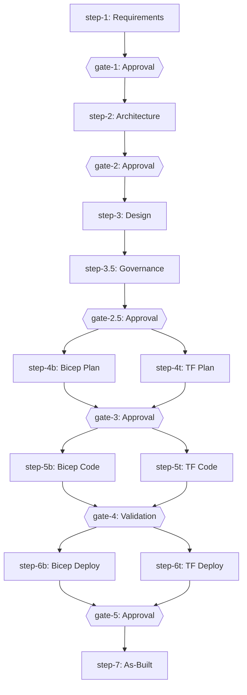

## Workflow Engine

<br/>

### The DAG Model

The workflow is encoded as a machine-readable directed acyclic graph in
`workflow-graph.json`:



Each node has a type (`agent-step`, `gate`, `subagent-fan-out`, `validation`), and each
edge has a condition (`on_complete`, `on_skip`, `on_fail`). Conditional routing at IaC
nodes is governed by the `decisions.iac_tool` field.

:::note[Read-only workflow graph]
The workflow DAG is auto-loaded by the Orchestrator. Users do not edit
`workflow-graph.json` directly. To customise the workflow, modify agent
definitions or skills instead.
:::

### Gates and Approval Points

Five mandatory gates require explicit human confirmation before the workflow advances:

| Gate | After  | Blocks Until                                      |
| ---- | ------ | ------------------------------------------------- |
| 1    | Step 1 | User approves requirements                        |
| 2    | Step 2 | User approves architecture and cost estimate      |
| 3    | Step 4 | User approves implementation plan                 |
| 4    | Step 5 | Automated validation passes (lint, build, review) |
| 5    | Step 6 | User approves deployment and verifies resources   |

### IaC Routing

The `iac_tool` field in `01-requirements.md` determines which track is activated.
Steps 4b, 5b, 6b form the Bicep track; steps 4t, 5t, 6t form the Terraform track.
Only one track is active for a given project.

### Session State and Resume

The `00-session-state.json` file (schema v3.0) provides atomic state tracking:

```json
{
  "schema_version": "3.0",
  "project": "my-project",
  "current_step": 2,
  "steps": {
    "2": {
      "status": "in_progress",
      "sub_step": "phase_2_waf",
      "started": "2026-03-04T10:05:00Z",
      "artifacts": ["agent-output/my-project/02-architecture-assessment.md"]
    }
  }
}
```

VS Code Copilot executes agents serially — only one agent runs at a time.
The v3.0 schema removed the lock/claim protocol (previously in v2.0) since
concurrent agent execution does not occur. Atomic writes (`.tmp` → rename
→ `.bak`) prevent file corruption.

### Session Break Protocol

At Gates 2 and 3, the Orchestrator recommends starting a fresh VS Code Copilot Chat
session. Long-running sessions (3+ hours) experience forced context summarisations
that lose critical decision context. The Session Break Protocol:

1. Orchestrator writes current state to `00-session-state.json`
2. Orchestrator writes `00-handoff.md` with human-readable summary
3. Orchestrator prints a "SESSION BREAK RECOMMENDED" message
4. User starts a new chat, invokes Orchestrator again
5. Orchestrator reads `00-session-state.json`, finds the next pending step, and resumes

This was driven by real-world observation: the malta-catering end-to-end test
experienced 5 forced context summarisations in a single 3h39m session.

## Quality and Safety Systems

### Validation Scripts

Every convention is backed by a machine-enforceable check. The validation suite runs
via two parallel groups: `validate:_node` (Node.js
validators) and `validate:_external` (external tool validators):

| Category            | Validators                                                                                                                                    |
| ------------------- | --------------------------------------------------------------------------------------------------------------------------------------------- |
| Markdown            | `lint:md`, `lint:links:docs`                                                                                                                  |
| Artefact format     | `validate:artifacts`, `lint:artifact-templates`, `lint:h2-sync`                                                                               |
| Agent quality       | `validate:agents`                                                                                                                             |
| Skill quality       | `validate:skills`, `validate:skill-checks`, `lint:skill-references`, `lint:orphaned-content`                                                  |
| Instruction quality | `validate:instruction-checks`                                                                                                                 |
| Governance          | `lint:governance-refs`, `lint:mcp-config`                                                                                                     |
| Infrastructure      | `lint:terraform-fmt`, `validate:terraform`, `validate:iac-security-baseline`                                                                  |
| Session state       | `validate:session-state` (also covers deprecated lock/claim field detection)                                                                  |
| Registry/config     | `validate:workflow-graph`, `validate:agent-registry`                                                                                          |
| Code quality        | `lint:json`, `lint:python`, `lint:yaml`                                                                                                       |
| VS Code config      | `validate:vscode`                                                                                                                             |
| Explorer graph      | `validate:explorer-graph`                                                                                                                     |
| Meta                | `lint:version-sync`, `lint:deprecated-refs`, `lint:docs-freshness`, `lint:glob-audit`, `validate:no-hardcoded-counts`, `validate:terminology` |

See [`reference/validation-reference`](../../reference/validation-reference/)
for the full authoritative list — it is generated from `package.json`.

All validators run via `npm run validate:all`.

### Git Hooks (Pre-Commit and Pre-Push)

**Pre-commit** (sequential, via lefthook): Validates staged files only — markdown lint,
link checks, H2 sync, artefact templates, agent frontmatter, instruction frontmatter,
Python lint, Terraform format and validate.

**Pre-push** (parallel, via lefthook): Diff-based domain routing. The `diff-based-push-check.sh`
script categorises changed files and runs only matching validators:

- `*.bicep` → Bicep build + lint
- `*.tf` → Terraform fmt + validate
- `*.agent.md` → Agent frontmatter + body size
- `*.instructions.md` → Instruction frontmatter
- `SKILL.md` → Skills format + skill size
- `*.json` → JSON syntax
- `*.py` → Ruff lint

### Circuit Breaker

:::danger[Automatic Safety Net]
The circuit breaker halts runaway agent loops before they cause damage.
If you see a `blocked` finding, investigate before retrying.
:::

The circuit breaker pattern protects against runaway agent loops during deployment:

| Anomaly Pattern     | Detection Threshold | Action                         |
| ------------------- | ------------------- | ------------------------------ |
| Error repetition    | 3 consecutive       | Halt, write `blocked` finding  |
| Empty response loop | 3 consecutive       | Halt, escalate to human        |
| Timeout cascade     | 3 consecutive       | Halt, check auth               |
| What-if oscillation | 2 cycles            | Halt, flag resource conflict   |
| Auth failure loop   | 2 consecutive       | Halt, prompt re-authentication |

### Context Compression

The context-shredding system defines three compression tiers for artifact loading:

| Tier         | Trigger    | Strategy                                   |
| ------------ | ---------- | ------------------------------------------ |
| `full`       | < 60% used | Load entire artefact                       |
| `summarized` | 60–80%     | Key H2 sections only (tables preserved)    |
| `minimal`    | > 80%      | Decision summaries only (< 500 characters) |

:::caution[Partially implemented — know the limits]
**What works today:**

- **Pre-built skill variants** — `SKILL.digest.md` and `SKILL.minimal.md` files
  exist on disk for key skills, generated and validated by scripts
  (`generate-skill-digests.mjs`, `validate-skill-digests.mjs`).
- **Hardcoded compaction checkpoints** — agents like the Architect (Phase 2.5)
  and IaC Planner (Phase 3.6) have fixed points in their bodies where they
  write a summary and switch to minimal skill loading. These are positional, not
  dynamic.
- **`compact_for_parent` carry-forward** — the challenger subagent's JSON output
  contract limits inter-pass data to a ~200-character string, preventing context
  bloat across multi-pass reviews.

**What does not work today:**

- **Dynamic tier selection** — the 60%/80% thresholds rely on the LLM estimating
  its own context consumption. VS Code Copilot provides no API for agents to
  query actual token usage. The LLM has no reliable way to know whether it is at
  55% or 75% of its context window, so tier triggers are effectively best-effort.
- **Automatic artifact compression** — the per-artifact compression templates
  (`compression-templates.md`) describe which H2 sections to keep per tier, but
  no code enforces this. Compression depends on the LLM reading the template,
  deciding its tier, and selectively extracting sections. In practice, LLMs tend
  to read entire files.

The hardcoded compaction checkpoints in agent bodies are the most reliable
mechanism. The dynamic tier system is a design intent that nudges LLM behaviour
but is not deterministic.
:::

When the `challenger-review-subagent` loads predecessor artefacts for review, it is
instructed to apply the same 3-tier compression: at the `summarized` tier, preserving
only resource list, SKUs, WAF scores, compliance matrix, and budget sections; at
`minimal`, using only the `decisions` field from `00-session-state.json` plus the
resource list. Whether the LLM follows these instructions consistently varies —
the `compact_for_parent` carry-forward between passes is the part that reliably works.

### Copilot Hooks

Copilot hooks in `.github/hooks/` intercept agent actions at runtime. See the
[Hooks guide](../../guides/hooks/) for the authoritative list; the current
set covers:

| Hook                  | Trigger                                    | Purpose                                                             |
| --------------------- | ------------------------------------------ | ------------------------------------------------------------------- |
| `tool-guardian`       | `PreToolUse`                               | Blocks dangerous commands (destructive ops, force pushes, DB drops) |
| `secrets-scanner`     | `Stop`                                     | Scans modified files for leaked secrets and credentials             |
| `session-telemetry`   | `SessionStart`, `Stop`, `UserPromptSubmit` | Merged session lifecycle logging and governance audit               |
| `subagent-validation` | `SubagentStop`                             | Validates subagent invocation and outputs                           |
| `tool-audit`          | `PostToolUse`                              | Logs tool usage metadata (name, status)                             |

Hooks are defined in `hooks.json` files with type (`command`), path to shell script,
and timeout. They run automatically — agents do not invoke them explicitly.

---

:::tip[Further Reading]

- [System Architecture](../architecture/) — the multi-step workflow, Orchestrator pattern, dual IaC tracks
- [Core Concepts](../four-pillars/) — agents, skills, instructions, and configuration registries
- [Agent Architecture](../agents/) — handoffs, the Challenger pattern, context shredding
- [MCP Integration](../mcp-integration/) — MCP servers and how agents invoke tools

  :::
