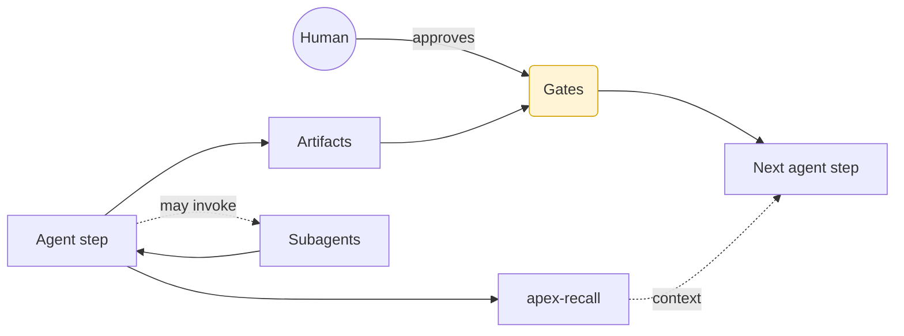
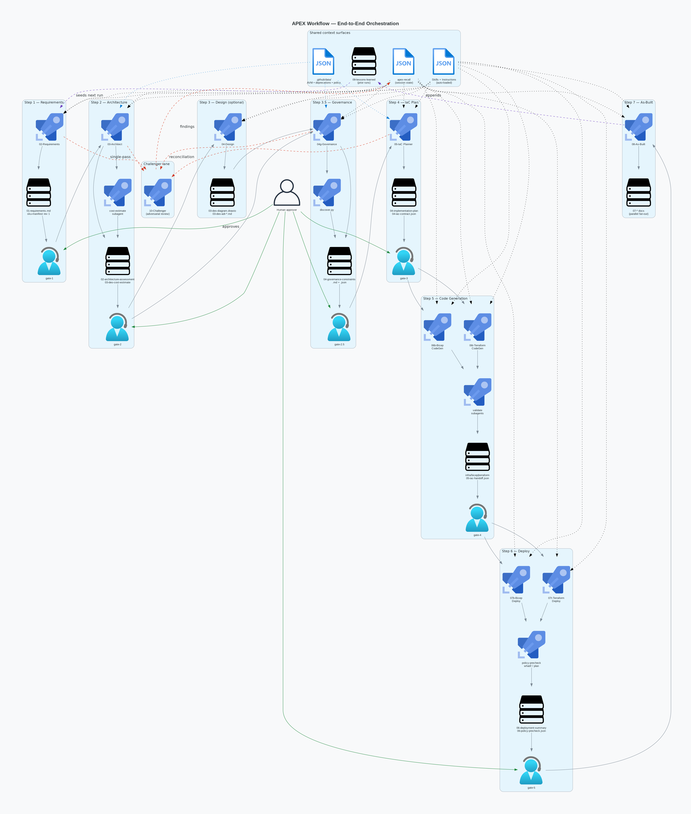
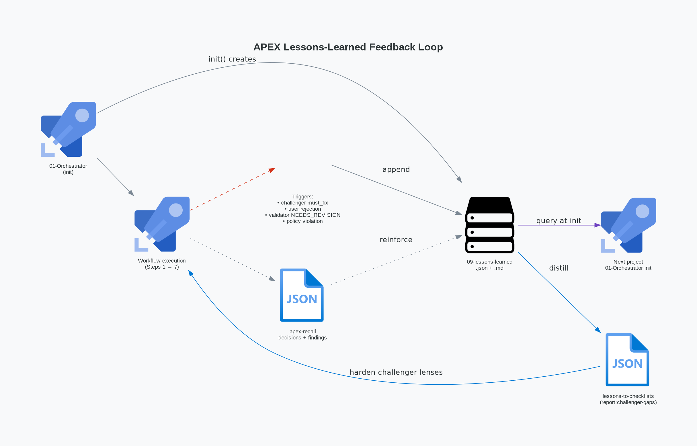

This page is the **long-form integration view** of a single APEX run. Where
[How It Works](how-it-works/) and [Workflow](workflow/) are focused
references, this page walks the same pipeline end-to-end and shows how every
cross-cutting mechanic — skills, instructions, registries, `apex-recall`,
hooks, the challenger lane, and the lessons-feedback loop — plugs into each
stage. Use it once, then jump to the focused references for day-to-day work.

:::note[Audience]
Platform engineers, agent authors, and contributors who want a single
narrative tying every moving part together. If you only need the DAG, read
[Workflow Engine & Quality](how-it-works/workflow-engine/) instead.
:::

## Mental model

APEX is an opinionated, agent-driven pipeline that turns a natural-language
Azure ask into reviewed, deploy-ready Infrastructure-as-Code. Three primitives
do the heavy lifting:

- **Agent steps** — a single Copilot agent owns one stage, produces
  versioned artifacts under `agent-output/{project}/`, and hands off through
  the Orchestrator.
- **Gates** — explicit human or validation checkpoints between steps. The
  workflow does not auto-advance past a gate.
- **Subagent fan-out** — parallel, isolated subagents called by a parent
  agent for adversarial review, cost queries, deployment previews, or
  documentation parallelism. Subagents return structured results and never
  share the parent's context window.

State lives in three deliberately separate places:

| Where                                                | What                                                   | Lifecycle             |
| ---------------------------------------------------- | ------------------------------------------------------ | --------------------- |
| `agent-output/{project}/`                            | Versioned artifacts (markdown, JSON, diagrams)         | Per-project, on disk  |
| `apex-recall` session store                          | Decisions, findings, step status, governance trace     | Per-project, queryable |
| `.github/skills/workflow-engine/templates/workflow-graph.json` | DAG — nodes, edges, gates, return edges, plan-lock     | Repo-wide, read-only  |



## The five context surfaces

Every step pulls from the same five surfaces. Understanding them once
removes 80% of the apparent "magic".

### Skills

Skills are domain knowledge packs auto-discovered by the `description` field
in each `.github/skills/{name}/SKILL.md`. Agents read `SKILL.md` on demand
and load `references/*.md` only when the body explicitly points to one —
there is no digest tier.

Skills classify as **WORKFLOW** (multi-phase procedures), **ANALYSIS**
(read-only investigations), or **UTILITY** (reusable patterns and defaults).
The catalog is large; the relevant slice per step appears in the
[Skill ↔ Step matrix](#appendix-b--skill--step-matrix).

### Instructions

Instructions are rule files auto-loaded by VS Code Copilot when their
`applyTo` glob matches the file under edit. They never need explicit
invocation. The most consequential ones for a workflow run:

| Instruction                                           | Triggered by editing                                | Role                                          |
| ----------------------------------------------------- | --------------------------------------------------- | --------------------------------------------- |
| [`agent-operating-frame`](https://github.com/jonathan-vella/azure-agentic-infraops/blob/main/.github/instructions/agent-operating-frame.instructions.md) | `.github/agents/*.agent.md`                         | Shared agent operating frame                  |
| [`governance-discovery`](https://github.com/jonathan-vella/azure-agentic-infraops/blob/main/.github/instructions/governance-discovery.instructions.md) | `**/04-governance-constraints.{md,json}`            | Policy-discovery requirements                 |
| [`sku-manifest`](https://github.com/jonathan-vella/azure-agentic-infraops/blob/main/.github/instructions/sku-manifest.instructions.md) | `**/sku-manifest.{md,json}`                         | Authoring + drift contract for the SKU manifest |
| [`iac-plan-best-practices`](https://github.com/jonathan-vella/azure-agentic-infraops/blob/main/.github/instructions/iac-plan-best-practices.instructions.md) | `**/04-implementation-plan.md`                      | Plan-level policy + cost rules                |
| [`iac-bicep-best-practices`](https://github.com/jonathan-vella/azure-agentic-infraops/blob/main/.github/instructions/iac-bicep-best-practices.instructions.md) | `**/*.bicep`                                        | Bicep code rules (AVM, security baseline)     |
| [`iac-terraform-best-practices`](https://github.com/jonathan-vella/azure-agentic-infraops/blob/main/.github/instructions/iac-terraform-best-practices.instructions.md) | `**/*.tf`                                           | Terraform code rules                          |
| [`azure-artifacts`](https://github.com/jonathan-vella/azure-agentic-infraops/blob/main/.github/instructions/azure-artifacts.instructions.md) | `**/agent-output/**/*.md`                           | H2 template enforcement                       |
| [`no-interactive-shell`](https://github.com/jonathan-vella/azure-agentic-infraops/blob/main/.github/instructions/no-interactive-shell.instructions.md) | chat-loaded agent/skill/instruction files           | Bans `-i` flags, `read -p`, heredoc prompts   |
| [`lesson-collection`](https://github.com/jonathan-vella/azure-agentic-infraops/blob/main/.github/instructions/lesson-collection.instructions.md) | `**/*orchestrator*.agent.md`                        | Lesson-capture protocol                       |

### `.github/data/` registries

Five JSON/CSV registries are the source of truth for module choice,
deprecation avoidance, and governance fallbacks:

| File                                  | Read by                              | When                                                   |
| ------------------------------------- | ------------------------------------ | ------------------------------------------------------ |
| `avm-bicep-modules.csv`               | 05-IaC Planner, 06b-Bicep CodeGen    | Module discovery and pinning                           |
| `avm-terraform-modules.csv`           | 05-IaC Planner, 06t-Terraform CodeGen | Module discovery and pinning                           |
| `avm-module-index.json`               | 05-IaC Planner, 03-Architect         | Lifecycle status (Available / Proposed / Orphaned) lookup |
| `azure-deprecations.json`             | 03-Architect, 05-IaC Planner         | Block sunset SKUs early                                 |
| `governance-policy-baseline.json`     | 04g-Governance                       | Fallback baseline when live discovery is empty         |
| `governance-policy-baseline.fixture.json` | Validators + tests                | Deterministic test fixture                              |

### `apex-recall`

All cross-step state flows through the `apex-recall` CLI — agents never
read or write `00-session-state.json` directly. The full schema for
`show --json` lives in
[`tools/apex-recall/docs/show-schema.md`](https://github.com/jonathan-vella/azure-agentic-infraops/blob/main/tools/apex-recall/docs/show-schema.md);
the valid decision-keys registry lives in
[`tools/apex-recall/docs/decision-keys.md`](https://github.com/jonathan-vella/azure-agentic-infraops/blob/main/tools/apex-recall/docs/decision-keys.md).

Lifecycle commands used during a run:

```bash
apex-recall init <project> --json                              # new project
apex-recall show <project> --json                              # full context
apex-recall checkpoint <project> <step> <phase> --json         # after each phase
apex-recall complete-step <project> <step> --json              # on completion
apex-recall decide <project> --key <k> --value <v> --json      # record decision
apex-recall finding <project> --add "<text>" --json            # log a finding
apex-recall review-audit <project> <step> ... --json           # after challenger
```

Read-only orientation (used by every agent on resume): `sessions | files |
search '<term>' | decisions`, all `--json`-capable.

### Hooks and validators

Three enforcement layers sit outside the agent prompt:

1. **Lefthook pre-commit pipeline** runs serially on staged files:
   `markdown-lint`, `link-check` (site docs only), `h2-sync`,
   `artifact-validation`, `agents`, `model-catalog-sync`,
   `instructions`, `skill-references`, `sku-manifest-render`,
   `safe-shell`.
2. **Lefthook pre-push** runs `tools/scripts/diff-based-push-check.sh`
   which categorises changed files and fires only matching validators.
3. **GitHub Actions** complement the local hooks with full-repo
   validation on PRs.

The `10-Challenger` adversarial-review wrapper is a separate enforcement
plane — it audits **AI-generated creative decisions** in artifacts, not
file syntax. Hooks and the challenger never overlap responsibilities.

## Stage-by-stage walkthrough

Every stage section follows the same sub-template so it is scannable. Counts
of resources, lenses, or passes come from
[`workflow-graph.json`](https://github.com/jonathan-vella/azure-agentic-infraops/blob/main/.github/skills/workflow-engine/templates/workflow-graph.json)
— treat that file as authoritative.

:::caution[Doc divergence — out of scope]
[`workflow-engine.md`](how-it-works/workflow-engine/) still shows a stale
`step-4b`/`step-4t` Mermaid diagram from before the Step 4 unification.
The authoritative shape is the unified `step-4` plus forked `step-5b` /
`step-5t` used throughout this page. Fixing the workflow-engine page is
tracked as a follow-up.
:::

### Step 1 — Requirements

- **Purpose & inputs** — Capture the project intent and pin the SKU
  manifest revision 1. `requires: []`; `produces: 01-requirements.md`,
  `sku-manifest.json`, `sku-manifest.md`.
- **Driving agent** — `02-Requirements` (no subagents).
- **Skills auto-loaded** — `azure-defaults` (regions, tags, naming),
  `azure-artifacts` (H2 templates).
- **Instructions activated** — `agent-operating-frame`, `azure-artifacts`,
  `sku-manifest`, `no-interactive-shell`.
- **Data sources** — none beyond user answers; lessons from prior runs are
  optionally surfaced by Orchestrator init.
- **`apex-recall` touchpoints** — `init`, `decide` (sets `iac_tool`,
  `region`, `complexity`, `relational_db`), `checkpoint` per phase,
  `complete-step 1`.
- **Artifacts** — `agent-output/{project}/01-requirements.md`,
  `sku-manifest.{json,md}` (empty `services[]` is the common case;
  user-pinned SKUs only).
- **Challenger review** — single-pass `comprehensive` (mandatory).
- **Gate & approval** — `gate-1` blocks until the human approves
  `01-requirements.md`.
- **Hooks on commit** — `markdown-lint`, `artifact-validation`,
  `sku-manifest-render`.
- **Common failures** — under-specified non-functional requirements;
  caught by the challenger and routed back via the `step-1 → step-1`
  self-refine edge.

### Step 2 — Architecture

- **Purpose & inputs** — Produce WAF-pillar-scored architecture and a
  cost estimate. `requires: gate-1`; mutates `sku-manifest`.
- **Driving agent** — `03-Architect` with `cost-estimate-subagent`.
- **Skills auto-loaded** — `azure-defaults`, `azure-artifacts`,
  `microsoft-docs` (on demand), `context-management`.
- **Instructions activated** — `agent-operating-frame`, `azure-artifacts`,
  `sku-manifest`.
- **Data sources** — `avm-module-index.json` (lifecycle status),
  `azure-deprecations.json`, Azure Pricing MCP (via subagent).
- **`apex-recall`** — `checkpoint` per phase; `decide` for review-depth
  default; cost estimate stored as artifact, summary in findings.
- **Artifacts** — `02-architecture-assessment.md`,
  `03-des-cost-estimate.md`, `03-des-sku-comparison.md` (when SKU
  trade-offs exist), mutated `sku-manifest`.
- **Challenger review** — single-pass `comprehensive` (mandatory).
  `decisions.review_depth = "deep"` opts into rotating-lens multi-pass
  (`security-governance`, `architecture-reliability`, optionally
  `cost-feasibility`).
- **Gate & approval** — `gate-2`.
- **Hooks on commit** — `markdown-lint`, `artifact-validation`,
  `sku-manifest-render`.
- **Common failures** — orphaned/proposed AVM modules selected
  (caught by `avm-module-index.json` check), missing private-endpoint
  story (caught by `security-governance` lens on deep review).

### Step 3 — Design (optional)

- **Purpose & inputs** — Architecture diagrams + ADRs.
  `requires: gate-2`; produces `03-des-diagram.drawio`, `03-des-adr-*.md`.
- **Driving agent** — `04-Design`. Optional — users can skip directly to
  Step 3.5 governance.
- **Skills auto-loaded** — `drawio` (or `python-diagrams`), `azure-adr`,
  `azure-defaults`, `azure-artifacts`.
- **Instructions activated** — `drawio`, `azure-artifacts`,
  `agent-operating-frame`.
- **Data sources** — `avm-module-index.json` for module-aware diagrams.
- **`apex-recall`** — `checkpoint`, `complete-step 3`.
- **Artifacts** — `.drawio` source + PNG; one ADR file per material
  decision.
- **Challenger review** — opt-in only; scope `design-adr` if invoked.
- **Gate & approval** — no gate; flows directly to Step 3.5.
- **Hooks on commit** — `markdown-lint`, `link-check` for ADR references.
- **Common failures** — diagrams drifting from the architecture
  assessment; surfaced at Step 7 drift detection.

### Step 3.5 — Governance

- **Purpose & inputs** — Discover effective Azure Policy assignments
  (incl. management-group-inherited) for the target subscription and
  reconcile them with the approved architecture. `requires: gate-2`.
- **Driving agent** — `04g-Governance`, invoking
  `.github/skills/azure-governance-discovery/scripts/discover.py`.
- **Skills auto-loaded** — `azure-governance-discovery`, `azure-defaults`,
  `azure-artifacts`, `iac-common` (drift routing).
- **Instructions activated** — `governance-discovery` (mandatory policy
  contract), `azure-artifacts`.
- **Data sources** — Azure Policy REST API (live);
  `governance-policy-baseline.json` as documented fallback.
- **`apex-recall`** — `checkpoint`, `decide --key governance_depth`,
  records the **L0 discovery envelope** as the first link in the
  attestation chain.
- **Artifacts** — `04-governance-constraints.md` + `.json` (with
  `discovery_metadata` envelope).
- **Challenger review** — single-pass `governance-reconciliation`.
  Skipped when `constraints.count == 0`.
- **Gate & approval** — `gate-2.5`. Precondition: reconciliation
  must not be `escalated_to_step-2`; if it is, the gate stays closed and
  Step 2 must re-approve before reconciliation re-runs. This closes the
  governance-vs-architecture livelock.
- **Hooks on commit** — `markdown-lint`, `artifact-validation` (governance
  JSON has a dedicated schema check).
- **Common failures** — Deny-effect policy on a planned resource;
  routed back to Architect via `step-3_5 → step-2` return edge
  (`on_must_fix_governance_conflict`).

### Step 4 — IaC Plan

- **Purpose & inputs** — Produce a machine-readable implementation plan
  with frozen inputs for code generation. `requires: gate-2.5`; mutates
  `sku-manifest`.
- **Driving agent** — `05-IaC Planner` (a Sonnet 4.6 agent that branches
  Bicep vs Terraform via `decisions.iac_tool`).
- **Skills auto-loaded** — `azure-defaults`, `azure-artifacts`,
  `python-diagrams`, `iac-common` (plan-consistency-checks +
  governance-drift-routing), and **track-specific**
  `azure-bicep-patterns` or `terraform-patterns`.
- **Instructions activated** — `iac-plan-best-practices`,
  `azure-artifacts`, `sku-manifest`.
- **Data sources** — `avm-bicep-modules.csv` /
  `avm-terraform-modules.csv` (pinning), `avm-module-index.json`
  (lifecycle), `azure-deprecations.json`, governance constraints from
  Step 3.5.
- **`apex-recall`** — `checkpoint` per phase; writes the **L1 governance
  attestation** (Governance Compliance Matrix H2); records
  `decisions.governance_trace`.
- **Artifacts** — `04-implementation-plan.md` (with `## 🛡️ Governance
  Compliance Matrix` and `## 📤 Code-Generation Contract` H2s),
  `04-iac-contract.json`, `04-policy-property-map.json`,
  `04-environment-manifest.json`, dependency + runtime
  Python-diagrams (`.py` + `.png`).
- **Challenger review** — single-pass `comprehensive` (mandatory).
  Deep-depth opts into rotating lenses (same matrix as Step 2).
- **Gate & approval** — `gate-3`. Two preconditions:
  1. `plan-readiness` — all challenger passes APPROVED.
  2. `plan-architecture-escalation` — anti-livelock: any finding with
     `requires_step == "step-2"` re-opens the gate and traverses the
     `step-4 → step-2` `on_architecture_must_fix` edge.
- **Hooks on commit** — `markdown-lint`, `artifact-validation`,
  `sku-manifest-render`, `agents`/`instructions` if the planner agent
  was edited.
- **Common failures** — AVM module lifecycle drift; missing private
  endpoint on a data-tier resource; deny-policy conflict surfaced late.

### Step 5 — Code Generation

- **Purpose & inputs** — Emit ready-to-deploy IaC. `requires: gate-3`;
  inputs are **frozen** (plan-lock) and read-only.
- **Driving agents** — `06b-Bicep CodeGen` or `06t-Terraform CodeGen`,
  each calling its track's validate subagent.
- **Skills auto-loaded** — `azure-defaults`, `azure-artifacts`,
  `azure-bicep-patterns` or `terraform-patterns`, `iac-common`,
  `context-management`.
- **Instructions activated** — `iac-bicep-best-practices` or
  `iac-terraform-best-practices`, `agent-operating-frame`.
- **Data sources** — same AVM CSV + index; policy-property-map and
  environment-manifest from Step 4.
- **`apex-recall`** — `checkpoint` per phase; writes the **L2
  attestation** rows; never edits frozen plan artifacts.
- **Artifacts** — `infra/bicep/{project}/` or `infra/terraform/{project}/`,
  `05-iac-handoff.json`.
- **Challenger review** — opt-in only (`artifact_scope: iac-code`);
  default skips. Plan-level findings *return* to Step 4 via the
  `step-5b|t → step-4` `on_refine` edge — they never self-edit the plan.
- **Gate & approval** — `gate-4` is a validation gate (lint, build,
  `bicep build` / `terraform validate` clean).
- **Hooks on commit** — `validate:iac-security-baseline` and IaC-specific
  validators via the pre-push diff check.
- **Common failures** — hallucinated AVM parameters (caught by
  `bicep build` / `terraform validate`); attempts to self-edit the
  frozen plan (caught by `plan_readonly` enforcement and routed back).

### Step 6 — Deploy

- **Purpose & inputs** — Execute the deployment with safety nets.
  `requires: gate-4`; mutates `sku-manifest` on quota/region substitution.
- **Driving agents** — `07b-Bicep Deploy` (preferring `azd provision`)
  or `07t-Terraform Deploy`. Each calls `policy-precheck-subagent`
  (L3 live policy check) plus `bicep-whatif-subagent` /
  `terraform-plan-subagent`.
- **Skills auto-loaded** — `azure-defaults`, `azure-artifacts`,
  `iac-common` (circuit-breaker, deploy-shared-workflow,
  policy-precheck-contract, governance-drift-routing).
- **Instructions activated** — `azure-yaml` if `azure.yaml` is edited;
  `iac-bicep-best-practices` or `iac-terraform-best-practices`.
- **Data sources** — live Azure Policy state via the precheck subagent;
  Azure Resource Manager for what-if / plan.
- **`apex-recall`** — precondition: `decisions.governance_trace` must be
  present (full L0 → L1 → L2 → L3 chain) before `az deployment create`
  / `azd provision` / `terraform apply`.
- **Artifacts** — `06-deployment-summary.md`,
  `06-policy-precheck.json`. The deployment summary folds the precheck
  into an informational H2 — no separate review.
- **Challenger review** — none (deploy artifacts are tool output, not
  creative decisions).
- **Gate & approval** — `gate-5` after human approval. On failure, the
  `step-6 → step-5` `on_fail` edge returns to CodeGen; on architecture
  gap surfaced at deploy time, `step-6 → step-2` `on_refine` returns to
  Architect.
- **Hooks on commit** — `markdown-lint`, `artifact-validation`.
- **Common failures** — quota exhaustion (handled via
  block-with-escalation substitution + `sku-manifest` mutation), policy
  Deny at apply time, transient ARM 5xx (handled by the `iac-common`
  circuit breaker).

### Step 7 — As-Built

- **Purpose & inputs** — Produce the as-built documentation suite from
  the deployed resource state. `requires: gate-5`.
- **Driving agent** — `08-As-Built` (subagent fan-out, no further
  challenger). Seven parallel substeps: design document, operations
  runbook, cost estimate, compliance matrix, backup/DR plan, resource
  inventory, documentation index.
- **Skills auto-loaded** — `azure-defaults`, `azure-artifacts`, `drawio`,
  `python-diagrams`, `context-management` (Mode A compression).
- **Instructions activated** — `azure-artifacts`, `drawio`,
  `markdown-docs` (for any docs-site copy).
- **Data sources** — live Azure Resource Manager (resource inventory);
  `sku-manifest` for bidirectional drift detection.
- **`apex-recall`** — `checkpoint` per substep; `complete-step 7`.
- **Artifacts** — `07-design-document.md`, `07-operations-runbook.md`,
  `07-ab-cost-estimate.md`, `07-compliance-matrix.md`,
  `07-backup-dr-plan.md`, `07-resource-inventory.md`,
  `07-documentation-index.md`; final `sku-manifest` mutation captures
  drift.
- **Challenger review** — none.
- **Gate & approval** — no gate; documentation set is the terminal
  artifact.
- **Hooks on commit** — `markdown-lint`, `artifact-validation`,
  `sku-manifest-render`.
- **Common failures** — drift between planned and deployed SKUs; bubbled
  into lessons-learned for the next run.

### Post — Lessons

The Orchestrator follows the `lesson-collection` protocol throughout the
run (not just at the end). Triggers: challenger `must_fix`, user
rejection, subagent `NEEDS_REVISION`, Azure Policy violation surfaced
at what-if, explicit user concern. Each trigger appends one lesson to
`09-lessons-learned.json`; the markdown twin renders at workflow
completion.

## End-to-end run timeline

The diagram below collapses every step into a single orchestration view
showing agent → subagent → gate → artifact lanes plus the shared
context surfaces (skills, `apex-recall`, registries, lessons store) and
the challenger lane.



Per-stage routing details (gate preconditions, return edges) stay inline
as Mermaid in each stage section above — this diagram is the spatial
overview.

## The lessons-learned feedback loop

`09-lessons-learned.json` is **initialised at Orchestrator init**,
appended throughout execution by the lesson-collection triggers, and
queried by the next project's Orchestrator at its own init. Findings
and decisions recorded in `apex-recall` reinforce the lessons store —
the two stores are complementary, not redundant.



The `tools/scripts/lessons-to-checklists.mjs` script
(`npm run report:challenger-gaps`) distils recurring lessons into
candidate hardening for the challenger lenses themselves — the loop
also closes back into the reviewer.

### Illustrative lesson entry

The schema lives in
[`tools/schemas/lesson-log.schema.json`](https://github.com/jonathan-vella/azure-agentic-infraops/blob/main/tools/schemas/lesson-log.schema.json).
The entry below is **fabricated for illustration only** and never
appeared in a real run:

```json
{
  "workflow_mode": "production",
  "project": "{project}",
  "lessons": [
    {
      "step": 4,
      "phase": "phase_3_module_selection",
      "category": "factual-accuracy",
      "trigger": "challenger must_fix",
      "observation": "Planner pinned avm/res/storage/storage-account at a version that lacked the requireInfrastructureEncryption flag required by an inherited deny policy.",
      "root_cause": "AVM module-index lifecycle was Available but the version chosen predated the policy property.",
      "action": "Move policy-property-map.json check earlier in Phase 2, before module pinning.",
      "telemetry": { "iterations": 2, "wall_time_min": 18 }
    }
  ]
}
```

## Appendix A — Artifact contract reference

The full H2 templates for every `agent-output/` artifact live in
[`azure-artifacts/SKILL.md`](https://github.com/jonathan-vella/azure-agentic-infraops/blob/main/.github/skills/azure-artifacts/SKILL.md)
and its `templates/` folder. The SKU manifest contract lives in
[`sku-manifest.instructions.md`](https://github.com/jonathan-vella/azure-agentic-infraops/blob/main/.github/instructions/sku-manifest.instructions.md);
the governance JSON shape is documented inside
[`governance-discovery.instructions.md`](https://github.com/jonathan-vella/azure-agentic-infraops/blob/main/.github/instructions/governance-discovery.instructions.md).
This page deliberately links rather than duplicates.

## Appendix B — Skill ↔ Step matrix

| Step    | Always-loaded skills                                           | On-demand skills                                    |
| ------- | -------------------------------------------------------------- | --------------------------------------------------- |
| 1       | `azure-defaults`, `azure-artifacts`                            | `microsoft-docs`                                    |
| 2       | `azure-defaults`, `azure-artifacts`, `context-management`      | `microsoft-docs`, `azure-compute`, `azure-storage`  |
| 3       | `azure-defaults`, `azure-artifacts`, `azure-adr`               | `drawio` or `python-diagrams`                       |
| 3.5     | `azure-defaults`, `azure-artifacts`, `azure-governance-discovery`, `iac-common` | `microsoft-docs`                                    |
| 4       | `azure-defaults`, `azure-artifacts`, `iac-common`, `python-diagrams`, track-specific patterns | `microsoft-docs`, `azure-rbac`             |
| 5       | `azure-defaults`, `azure-artifacts`, track-specific patterns, `iac-common`, `context-management` | `azure-rbac`, `entra-app-registration`     |
| 6       | `azure-defaults`, `azure-artifacts`, `iac-common`              | `azure-quotas`, `azure-validate`, `azure-deploy`    |
| 7       | `azure-defaults`, `azure-artifacts`, `drawio`, `python-diagrams`, `context-management` | `azure-resources`, `azure-compliance`       |

## Appendix C — Instruction ↔ trigger matrix

| Instruction                          | `applyTo` glob                                               | Effective at step |
| ------------------------------------ | ------------------------------------------------------------ | ----------------- |
| `agent-operating-frame`              | `.github/agents/*.agent.md`                                  | All               |
| `azure-artifacts`                    | `**/agent-output/**/*.md`                                    | 1–7               |
| `sku-manifest`                       | `**/sku-manifest.{md,json}`                                  | 1, 2, 3.5, 4, 6, 7 |
| `governance-discovery`               | `**/04-governance-constraints.{md,json}`                     | 3.5               |
| `iac-plan-best-practices`            | `**/04-implementation-plan.md`                               | 4                 |
| `iac-bicep-best-practices`           | `**/*.bicep`                                                 | 5b, 6b            |
| `iac-terraform-best-practices`       | `**/*.tf`                                                    | 5t, 6t            |
| `azure-yaml`                         | `**/azure.yaml`                                              | 5, 6              |
| `drawio`                             | `**/*.drawio`                                                | 3, 7              |
| `lesson-collection`                  | `**/*orchestrator*.agent.md`                                 | Throughout        |
| `no-interactive-shell`               | chat-loaded agent/skill/instruction files                    | Authoring only    |
| `no-hardcoded-counts`                | repo-wide markdown + scripts                                 | Authoring only    |
| `markdown-docs`                      | `site/src/content/docs/**`, `docs/**`                        | Doc authoring     |

## Appendix D — Glossary

Terse pointers only — full definitions live in the linked concept docs.

| Term              | See                                                                 |
| ----------------- | ------------------------------------------------------------------- |
| Challenger / lens | [Workflow Engine & Quality](how-it-works/workflow-engine/)          |
| Gate              | [Workflow Engine & Quality](how-it-works/workflow-engine/)          |
| Fan-out           | [Agent Architecture](how-it-works/agents/)                          |
| Frozen inputs     | `workflow-graph.json` `plan_lock` block (linked above)              |
| L0–L3 attestation | [`workflow-graph.json` `attestation_chain`](https://github.com/jonathan-vella/azure-agentic-infraops/blob/main/.github/skills/workflow-engine/templates/workflow-graph.json) |
| Skill tiers       | [Skills & Instructions](how-it-works/skills-and-instructions/)      |

## Appendix E — Further reading

- [How It Works — Overview](how-it-works/)
- [System Architecture](how-it-works/architecture/)
- [Agent Architecture](how-it-works/agents/)
- [Skills & Instructions](how-it-works/skills-and-instructions/)
- [Workflow Engine & Quality](how-it-works/workflow-engine/)
- [MCP Integration](how-it-works/mcp-integration/)
- [SKU Manifest](how-it-works/sku-manifest/) (when present)
- Repository root: [`AGENTS.md`](https://github.com/jonathan-vella/azure-agentic-infraops/blob/main/AGENTS.md)
- Vendor docs: [Anthropic Claude prompting guide](https://docs.anthropic.com/en/docs/build-with-claude/prompt-engineering/overview),
  [OpenAI GPT-5 prompting guide](https://platform.openai.com/docs/guides/prompting)
