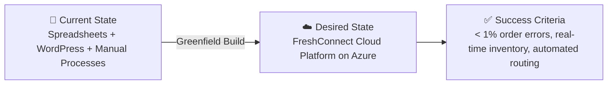

:::tip[Editorial Context]
This is **Step 1: Requirements Discovery**, where the agent acts as a technical business analyst. 
It establishes the hard guardrails (budget, SLA, compliance) that downstream agents must respect. 
The outputs here are entirely generated by the **Requirements Agent**.
:::

<CardGrid>
  <Card title="Functional Requirements" icon="puzzle">
    [Core capabilities, user types, and API integrations](./functional/)
  </Card>
  <Card title="Compliance & Security" icon="shield">
    [Regulatory frameworks, data residency, and boundaries](./compliance-security/)
  </Card>
  <Card title="Budget & Scaling" icon="rocket">
    [Financial envelopes, NFRs, and scale limits](./budget-scaling/)
  </Card>
</CardGrid>

> Generated by @requirements agent | 2026-03-11

| ⬅️ Previous | 📑 Index            | Next ➡️                                                        |
| ----------- | ------------------- | -------------------------------------------------------------- |
| —           | [Demo Index](../) | [Architecture Assessment](../02-architecture/) |

## 🎯 Project Overview

| Field                   | Value                                                                                                                 |
| ----------------------- | --------------------------------------------------------------------------------------------------------------------- |
| **Project Name**        | nordic-fresh-foods (FreshConnect MVP)                                                                                 |
| **Project Type**        | Full-Stack N-Tier Web Application                                                                                     |
| **Timeline**            | March 2026 → June 2026 (3 months to peak season)                                                                      |
| **Primary Stakeholder** | CTO, Nordic Fresh Foods                                                                                               |
| **Business Context**    | Cloud-based farm-to-table ordering platform connecting organic farmers with restaurants and consumers in Scandinavia. |
| **IaC Tool**            | Bicep                                                                                                                 |

### Business Context

| Field               | Value                                                                                                                    |
| ------------------- | ------------------------------------------------------------------------------------------------------------------------ |
| Industry / Vertical | Food & Agriculture                                                                                                       |
| Company Size        | Startup / Small (1-50 employees)                                                                                         |
| Current State       | Greenfield — no existing cloud infrastructure (spreadsheets, WordPress, manual processes)                                |
| Migration Source    | N/A (greenfield)                                                                                                         |
| Business Drivers    | Modernize operations before peak season; eliminate order errors (~8% loss); enable real-time inventory and delivery ops  |
| Success Criteria    | Reduce order errors to <1%, real-time inventory visibility, automated delivery routing, restaurant order tracking portal |

### State Transition

## 📋 Summary for Architecture Assessment

### Handoff Summary

| Aspect               | Key Points                                                                                                                                    |
| -------------------- | --------------------------------------------------------------------------------------------------------------------------------------------- |
| Critical Constraints | Budget <€1K/month (Azure only); 3-month timeline; EU data residency (GDPR) incl. external processors                                          |
| Key Decisions        | Bicep IaC; Cost-Optimized tier; N-Tier pattern; Entra External ID + social auth; Private endpoints; Dev + Prod envs                           |
| Open Risks           | PCI-DSS scope depends on payment gateway integration; seasonal 3× scale needs SKU validation; edge security compensating controls need sizing |
| Recommended Pattern  | N-Tier Web Application (App Service + SQL + KV + App Insights + Storage — SKUs per Step 2)                                                    |
| Budget Envelope      | <€1,000/month (Azure platform; 3rd-party tracked separately)                                                                                  |

### Requirements Completeness

| Section                  | Status | Notes                                                  |
| ------------------------ | ------ | ------------------------------------------------------ |
| Project Overview         | ✅     | All fields populated                                   |
| Functional Requirements  | ✅     | 8 capabilities with priorities and acceptance criteria |
| NFRs                     | ✅     | WAF metrics, scalability projections defined           |
| Compliance & Security    | ✅     | GDPR + PCI-DSS scoped; security controls confirmed     |
| Budget                   | ✅     | Hard limit <€1K/month; consumption model preferred     |
| Operational Requirements | ✅     | Monitoring, alerting, backup defined for MVP scope     |

---

import { Steps, Tabs, TabItem, Card, CardGrid, Icon, Badge } from '@astrojs/starlight/components';
import { Aside } from '@astrojs/starlight/components';

import { Steps, Tabs, TabItem, Card, CardGrid, Icon, Badge } from '@astrojs/starlight/components';
import { Aside } from '@astrojs/starlight/components';

## References

> [!NOTE]
> 📚 The following Microsoft Learn resources provide additional guidance.

| Topic                      | Link                                                                                                |
| -------------------------- | --------------------------------------------------------------------------------------------------- |
| Well-Architected Framework | [Overview](https://learn.microsoft.com/azure/well-architected/)                                     |
| Azure Regions              | [Products by Region](https://azure.microsoft.com/explore/global-infrastructure/products-by-region/) |
| Compliance Offerings       | [Azure Compliance](https://learn.microsoft.com/azure/compliance/)                                   |

---

_Requirements captured using the [requirements planning prompt](https://github.com/jonathan-vella/azure-agentic-infraops/blob/main/.github/prompts/plan-requirements.prompt.md) template_

---

| ⬅️ — | 🏠 [Demo Index](../) | ➡️ [Architecture Assessment](../02-architecture/) |
| ---- | ----------------------------- | ----------------------------------------------------------------- |

