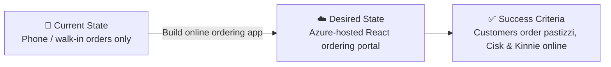

:::tip[Editorial Context]
This artifact was produced by the **Requirements Agent** (Step 1 of the APEX pipeline).
It captures the project scope, business drivers, architecture pattern recommendation,
and state transition — all gathered from a single conversational prompt with the
catering outlet owner. The Requirements Agent writes this document; the Architect
Agent consumes it in the next step.
:::

## Project Overview

| Field                   | Value                                                                     |
| ----------------------- | ------------------------------------------------------------------------- |
| **Project Name**        | malta-catering                                                            |
| **Project Type**        | Full-Stack (SPA + API)                                                    |
| **Timeline**            | 2026-04-14 → Demo (30-min live session)                                   |
| **Primary Stakeholder** | Catering outlet owner (Malta)                                             |
| **Business Context**    | Online ordering app for a Malta catering outlet selling local specialties |

`iac_tool: Bicep`

### Business Context

| Field               | Value                                                                      |
| ------------------- | -------------------------------------------------------------------------- |
| Industry / Vertical | Food & Beverage / Hospitality                                              |
| Company Size        | Small (1-50 employees)                                                     |
| Current State       | Greenfield                                                                 |
| Migration Source    | N/A (greenfield)                                                           |
| Business Drivers    | Expand reach with online ordering; reduce phone-based order errors         |
| Success Criteria    | Customers can browse a menu, place orders, and receive delivery at address |

### State Transition

### Architecture Pattern

| Field              | Value                                                                                                                                        |
| ------------------ | -------------------------------------------------------------------------------------------------------------------------------------------- |
| Workload Pattern   | SPA + API (containerized React front-end with lightweight API)                                                                               |
| Recommended Option | App Service S1 (Linux containers) + ACR Premium + VNet + Table Storage + Key Vault                                                           |
| Tier               | Cost-Optimized                                                                                                                               |
| Justification      | Small outlet, low TPS (1/s), dev-only, always-on compute, VNet integration for private connectivity, staging slot for blue-green deployments |
