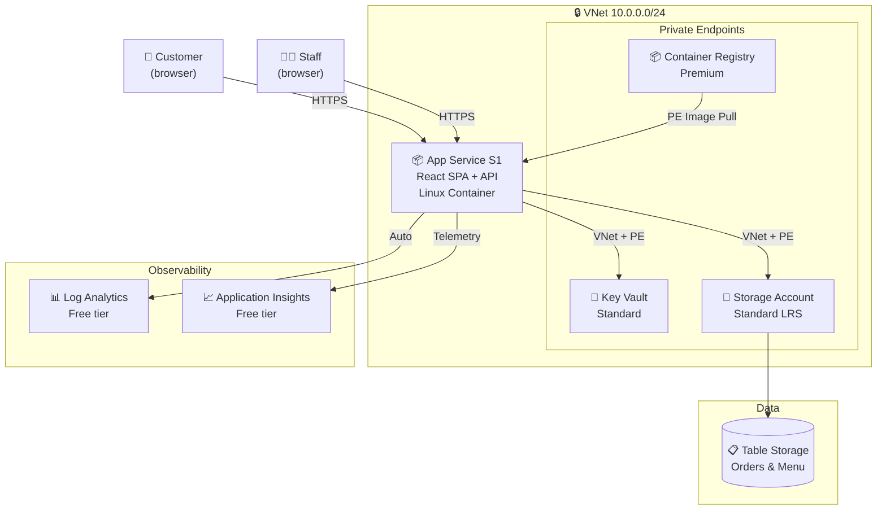

:::tip[Editorial Context]
This artifact was produced by the **Architect Agent** (Step 2 of the APEX pipeline).
It validates the requirements from Step 1, proposes a recommended Azure architecture,
documents key architecture decisions with WAF pillar mapping, and packages an
implementation handoff for the IaC Planner. The Architect Agent scores each WAF
pillar, resolves open challenger findings, and produces a cost estimate — all
without human intervention.
:::

## Requirements Validation

| Requirement Area        | Status     | Validation Notes                                    |
| ----------------------- | ---------- | --------------------------------------------------- |
| NFRs (SLA, RTO, RPO)    | ✅ Defined | 99.0% SLA, 24h RTO, 12h RPO — relaxed for dev/demo  |
| Compliance requirements | ✅ Defined | GDPR applicable; PCI/SOC/HIPAA not in scope         |
| Budget (approximate)    | ✅ Defined | EUR 100-500/month soft limit, ~$155/mo estimated    |
| Scale requirements      | ✅ Defined | 1 TPS, 100-1K daily users, up to 1K concurrent      |
| Security controls       | ✅ Defined | Managed identity, Key Vault, TLS 1.2+, VNet + PE    |
| Data residency          | ✅ Defined | EU-only, swedencentral, no cross-region replication |

:::note
One open challenger finding from Step 1 (REQ-001: Table Storage lacks native
backup) is addressed in the Reliability assessment in the
[WAF Assessment](./waf-assessment/).
:::

## Executive Summary

A lightweight ordering portal for a Malta catering outlet selling pastizzi,
Cisk, and Kinnie. The architecture uses **Azure App Service S1** (Linux
containers) with VNet integration to host a containerized React SPA with a
lightweight API, **Azure Table Storage** for order persistence, **Azure
Container Registry** (Premium) for image management, and **Azure Key Vault**
(Standard) for secrets. **Private endpoints** secure Key Vault, Storage, and
ACR traffic over a dedicated VNet. A **staging slot** enables blue-green
deployments. All resources deploy to **swedencentral** for GDPR compliance.

Estimated monthly cost: **~$155/month** (within EUR 100-500 budget).

## Recommended Architecture

## Architecture Decision Summary

| Decision           | Choice                                           | Rationale                                                                |
| ------------------ | ------------------------------------------------ | ------------------------------------------------------------------------ |
| Compute platform   | App Service S1 (Linux containers)                | Always-on, VNet integration, staging slot, resolves ACA capacity blocker |
| Persistence        | Azure Table Storage (LRS)                        | Simple key-value, < $10/mo, 20K TPS capacity                             |
| Image registry     | ACR Premium                                      | 500 GiB, ~$50/mo, private endpoint support                               |
| Secrets management | Key Vault Standard                               | Managed Identity integration, per-op pricing                             |
| Authentication     | App Service Built-in Auth                        | Zero-cost social IdP integration (Google, MS)                            |
| Monitoring         | Log Analytics + Application Insights (free tier) | Auto-configured with App Service; App Insights for app telemetry         |
| Backup strategy    | Explicitly accept data loss for demo (ARC-001)   | RPO relaxed to best-effort; prod: add daily export job                   |
| GDPR erasure       | PII/order separation in Table Storage (ARC-003)  | customer\_\* entities deletable; orders anonymized                       |
| Staff access       | Entra ID with role claims (ARC-005)              | Separate trust boundary from customer social auth                        |
| Network posture    | VNet + private endpoints (ARC-004 resolved)      | PE for Key Vault, Storage, ACR; public ingress only                      |
| Region             | swedencentral                                    | EU GDPR-compliant, project default                                       |
| IaC tool           | Bicep                                            | Azure-native, AVM modules available for all services                     |

## Implementation Handoff

### Ready for IaC Planner

| Parameter      | Value                          |
| -------------- | ------------------------------ |
| Region         | swedencentral                  |
| Environment    | dev                            |
| Budget         | EUR 100-500/month (est: ~$155) |
| Resource Count | 10                             |

### Resources to Provision

| #   | Resource                | SKU                | Key Config                                     |
| --- | ----------------------- | ------------------ | ---------------------------------------------- |
| 1   | Virtual Network         | Standard           | 10.0.0.0/24, 2 subnets (ASP delegation + PE)   |
| 2   | App Service Plan        | S1                 | Linux, always-on                               |
| 3   | Web App                 | S1 Linux container | HTTP ingress, managed identity, staging slot   |
| 4   | Container Registry      | Premium            | Admin disabled, managed identity pull, PE      |
| 5   | Storage Account         | Standard LRS GPv2  | Table service enabled, HTTPS-only, TLS 1.2, PE |
| 6   | Key Vault               | Standard           | RBAC auth, purge protection enabled, PE        |
| 7   | Private DNS Zones (×3)  | Standard           | privatelink.vaultcore, blob, azurecr           |
| 8   | Private Endpoints (×3)  | Standard           | KV, Storage, ACR                               |
| 9   | Log Analytics Workspace | Per-GB             | 30-day retention (free tier)                   |
| 10  | Application Insights    | Free tier          | Connected to Log Analytics workspace           |

### Security Requirements

| Requirement           | Implementation                                     |
| --------------------- | -------------------------------------------------- |
| VNet Integration      | App Service delegated subnet in 10.0.0.0/24        |
| Private Endpoints     | PE for Key Vault, Storage, ACR on dedicated subnet |
| Private DNS Zones     | 3 zones for privatelink name resolution            |
| Managed Identity      | System-assigned MI on Web App → KV + Storage + ACR |
| Key Vault RBAC        | Key Vault Secrets User role for Web App MI         |
| Storage RBAC          | Storage Table Data Contributor role for Web App MI |
| ACR Pull              | AcrPull role for Web App MI                        |
| TLS 1.2 minimum       | `minTlsVersion: 'TLS1_2'` on Storage Account       |
| HTTPS only            | `supportsHttpsTrafficOnly: true` on Storage        |
| No public blob access | `allowBlobPublicAccess: false` on Storage          |
| App Service auth      | Built-in auth with social IdP (Google)             |

### Monitoring Requirements

| Requirement             | Implementation                                                            |
| ----------------------- | ------------------------------------------------------------------------- |
| Log aggregation         | Log Analytics Workspace linked to App Service                             |
| Web App logs            | System and app logs to Log Analytics                                      |
| Application telemetry   | Application Insights for request tracing, dependency monitoring (ARC-002) |
| Basic health monitoring | App Service built-in health probes                                        |
