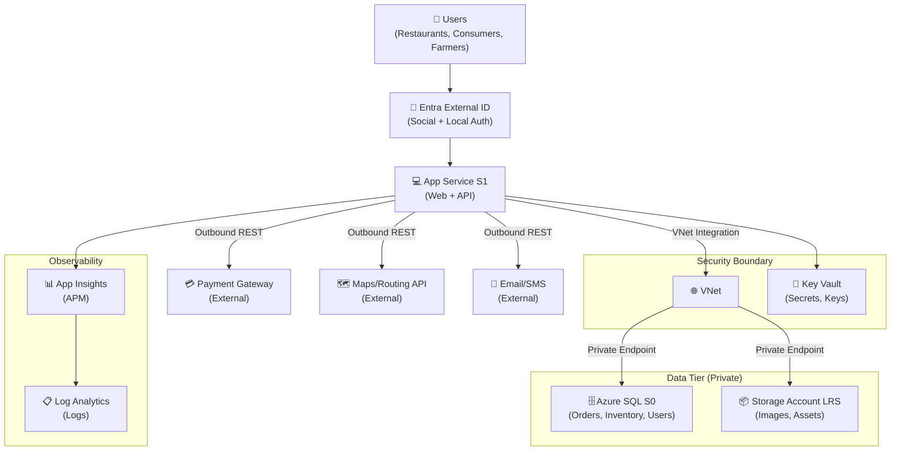

:::tip[Editorial Context]
This is **Step 2: Architecture**, where the agent leverages the Well-Architected Framework and Microsoft documentation to propose a robust architecture. The outputs here are entirely generated by the **Architect Agent**.
:::

<CardGrid>
  <Card title="WAF Assessment" icon="document">
    [Read WAF Assessment](./waf-assessment/)
  </Card>
  <Card title="Sizing & Pricing" icon="setting">
    [Read Sizing & Pricing](./sizing-pricing/)
  </Card>
</CardGrid>

> Generated by architect agent | 2026-03-11

## ✅ Requirements Validation

| Requirement Area        | Status     | Validation Notes                                                                           |
| ----------------------- | ---------- | ------------------------------------------------------------------------------------------ |
| NFRs (SLA, RTO, RPO)    | ✅ Defined | SLA 99.9%, RTO 24h, RPO 12h — relaxed and appropriate for MVP                              |
| Compliance requirements | ✅ Defined | GDPR (EU data residency) + PCI-DSS (scope minimized via external payment gateway)          |
| Budget (approximate)    | ✅ Defined | <€1,000/month hard cap; consumption model preferred                                        |
| Scale requirements      | ✅ Defined | <100 concurrent users, ~500 orders/day, 3× seasonal peak, growth to 50K users in 12 months |
| Security controls       | ✅ Defined | Managed Identity, Private Endpoints, TLS 1.2, Key Vault, Entra External ID                 |
| Data residency          | ✅ Defined | EU-only (swedencentral primary); all data and processing within EU                         |

> [!NOTE]
> All requirement areas are fully defined. No blockers for architecture assessment.

---

## 💎 Executive Summary

Nordic Fresh Foods (FreshConnect MVP) is a greenfield farm-to-table ordering platform for Scandinavia. The platform connects organic farmers with restaurants and consumers, requiring real-time inventory, order management, delivery routing, and consumer-facing identity.

**Recommended approach**: N-Tier Web Application using Azure App Service (S1) for compute, Azure SQL Database (S0) for relational data, Key Vault for secrets, Storage Account for blobs, and Application Insights + Log Analytics for observability. Private Endpoints secure data services in production. Microsoft Entra External ID handles consumer and restaurant identity at no additional cost within the free MAU tier.

**Estimated monthly cost**: ~$131 (Prod + Dev steady-state) — **87% under the €1K budget**, leaving substantial headroom for growth and peak-season autoscaling ($256/mo at 3× peak).

### Recommended Architecture

---

## 🎯 Architecture Decision Summary

| Decision                     | Choice                           | Rationale                                                                                      |
| ---------------------------- | -------------------------------- | ---------------------------------------------------------------------------------------------- |
| Compute platform             | App Service S1 (Linux)           | Managed PaaS; autoscale for 3× peak; VNet integration for PE access; lower ops burden          |
| Database                     | Azure SQL S0 (DTU model)         | Relational data (orders, inventory, users); familiar, managed; DTU model is cost-predictable   |
| Identity provider            | Microsoft Entra External ID      | Successor to Azure AD B2C (end-of-sale May 2025); free tier covers 50K MAU                     |
| Network isolation            | VNet + Private Endpoints         | GDPR + PCI-DSS mandate; private access for SQL and Storage in production                       |
| Secrets management           | Key Vault (RBAC auth)            | Centralized secrets; Managed Identity access; purge protection for compliance                  |
| Monitoring strategy          | App Insights + Log Analytics     | Workspace-based APM; centralized logs; pay-per-GB at low volumes                               |
| Storage                      | Standard LRS                     | Cost-optimized; LRS sufficient given relaxed DR (RTO 24h); product images and assets           |
| Environment separation       | Dedicated resource groups        | Dev (B1/Basic) and Prod (S1/S0) with separate KV, SQL, and monitoring per environment          |
| Autoscale strategy           | 2→3 instances (CPU-based)        | Min 2 for availability; autoscale to 3 at peak; CPU >70% or response >2s triggers              |
| WAF/DDoS protection          | Deferred to post-MVP             | Budget constraint; App Service built-in DDoS Basic + rate limiting as compensating controls    |
| Multi-region / AZ redundancy | Not included                     | Budget constraint; RTO 24h and RPO 12h achievable with single-region + PITR + IaC redeploy     |
| Payment processing           | Hosted payment fields (redirect) | PCI scope minimized — card data never touches App Service; hosted fields/redirect tokenization |
| IaC tool                     | Bicep (from Step 1)              | AVM modules available for all selected resources; native Azure tooling                         |

---

## 🚀 Implementation Handoff

### Ready for bicep-plan

The architecture is approved for implementation with the following key parameters:

| Parameter      | Value                                 |
| -------------- | ------------------------------------- |
| Region         | swedencentral                         |
| Environments   | Dev + Prod                            |
| Budget         | <€1,000/month (estimated: $204/month) |
| Resource Count | 10 distinct resource types            |
| IaC Tool       | Bicep (AVM-first)                     |
| Complexity     | Standard                              |

### Resources to Provision

| #   | Resource                   | SKU (Prod)      | SKU (Dev)       | Key Config                                     |
| --- | -------------------------- | --------------- | --------------- | ---------------------------------------------- |
| 1   | Resource Group             | —               | —               | `rg-nordic-fresh-foods-{env}`                  |
| 2   | App Service Plan           | S1 (Linux)      | B1 (Linux)      | Min 2 instances, autoscale 2→3 (prod)          |
| 3   | App Service                | S1              | B1              | VNet integration, HTTPS-only, Managed Identity |
| 4   | Azure SQL Server           | —               | —               | Azure AD-only auth, TLS 1.2                    |
| 5   | Azure SQL Database         | S0 (10 DTU)     | Basic (5 DTU)   | Geo-backup, PITR 30 days                       |
| 6   | Key Vault                  | Standard        | Standard        | RBAC auth, purge protection, MI access         |
| 7   | Storage Account            | Standard LRS    | Standard LRS    | HTTPS-only, no public blob, MI access          |
| 8   | Log Analytics Workspace    | Pay-per-GB      | Pay-per-GB      | 30-day retention                               |
| 9   | Application Insights       | Workspace-based | Workspace-based | Connected to App Service                       |
| 10  | Virtual Network            | 3 subnets       | 1 subnet        | app-subnet, data-subnet, pe-subnet (prod)      |
| 11  | Private Endpoint (SQL)     | Standard        | —               | Prod only; privatelink.database.windows.net    |
| 12  | Private Endpoint (Storage) | Standard        | —               | Prod only; privatelink.blob.core.windows.net   |
| 13  | Private DNS Zones (×2)     | Private         | —               | Prod only; SQL + Storage privatelink zones     |
| 14  | Budget Alert               | —               | —               | €900 threshold (90% of budget)                 |

### Security Requirements for Implementation

| Requirement           | Implementation                                                                 |
| --------------------- | ------------------------------------------------------------------------------ |
| Managed Identity      | System-assigned MI on App Service; RBAC to KV, SQL, Storage                    |
| Private Endpoints     | PE for SQL + Storage in `pe-subnet`; `publicNetworkAccess: 'Disabled'` on both |
| TLS 1.2 minimum       | `minTlsVersion: 'TLS1_2'` on all services                                      |
| HTTPS-only            | `httpsOnly: true` on App Service; `supportsHttpsTrafficOnly: true` on Storage  |
| Key Vault RBAC        | `enableRbacAuthorization: true`; purge protection enabled                      |
| No public blob access | `allowBlobPublicAccess: false` on Storage Account                              |
| Azure AD-only SQL     | `azureADOnlyAuthentication: true` on SQL Server                                |
| VNet integration      | App Service delegated to `app-subnet`                                          |

### Monitoring Requirements for Implementation

| Requirement            | Implementation                                                 |
| ---------------------- | -------------------------------------------------------------- |
| Application monitoring | Application Insights workspace-based; connected to App Service |
| Log aggregation        | Log Analytics workspace; diagnostic settings on all resources  |
| Alert rules            | Response time >3s, DTU >80%, error rate >5%, budget >90%       |
| Health checks          | App Service health check endpoint configured                   |
| Budget monitoring      | Azure Budget alert at €900 (90%) with email notification       |

---

## 🔒 Approval Gate

> [!IMPORTANT]
> **🏗️ Architecture Assessment Complete**
>
> | Pillar      | Score |
> | ----------- | ----- |
> | Security    | 7/10  |
> | Reliability | 6/10  |
> | Performance | 6/10  |
> | Cost        | 8/10  |
> | Operations  | 7/10  |
>
> **Composite WAF Score**: 6.8/10
>
> **Estimated Monthly Cost**: ~$204 (Prod + Dev steady-state) — **80% under €1K budget**
> **Peak Season Cost**: ~$256-286/month (3× autoscale + variable meters)
>
> **Confidence Level**: Medium-High
>
> - [ ] **Approved** — proceed to bicep-plan
> - Approver:
> - Date:
>
> Reply **"approve"** to proceed to bicep-plan, or provide feedback for revisions.

---

## References

> [!NOTE]
> 📚 The following Microsoft Learn resources informed this assessment.

| Topic                      | Link                                                                                        |
| -------------------------- | ------------------------------------------------------------------------------------------- |
| Well-Architected Framework | [Overview](https://learn.microsoft.com/azure/well-architected/)                             |
| Security Checklist         | [WAF Security](https://learn.microsoft.com/azure/well-architected/security/checklist)       |
| Reliability Checklist      | [WAF Reliability](https://learn.microsoft.com/azure/well-architected/reliability/checklist) |
| Cost Optimization          | [WAF Cost](https://learn.microsoft.com/azure/well-architected/cost-optimization/checklist)  |
| Azure Pricing Calculator   | [Calculator](https://azure.microsoft.com/pricing/calculator/)                               |
| App Service Autoscale      | [Autoscale](https://learn.microsoft.com/azure/app-service/manage-scale-up)                  |
| Private Endpoints          | [Overview](https://learn.microsoft.com/azure/private-link/private-endpoint-overview)        |
| Entra External ID          | [Overview](https://learn.microsoft.com/entra/external-id/)                                  |
| AVM Bicep Modules          | [Registry](https://aka.ms/avm/index)                                                        |

---

_Assessment performed using Azure Well-Architected Framework. Pricing data from Azure Pricing MCP (2026-03-11)._

---

