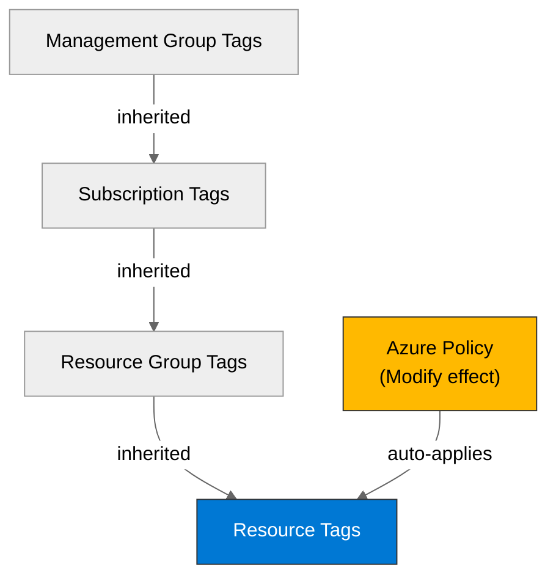

## Required Resource Group Tags

The **JV-Enforce Resource Group Tags v3** policy (Deny effect, Management Group scope) blocks resource group creation unless all 9 required tags are present.

### Deny Policy — 9 Required Tag Keys

| #   | Tag Key             | Purpose                        | Example Value               |
| --- | ------------------- | ------------------------------ | --------------------------- |
| 1   | `environment`       | Deployment stage               | `dev`, `staging`, `prod`    |
| 2   | `owner`             | Responsible team or individual | `malta-catering-team`       |
| 3   | `costcenter`        | Finance charge code            | `CC-4821`                   |
| 4   | `application`       | Application identifier         | `malta-ordering`            |
| 5   | `workload`          | Workload classification        | `ordering-portal`           |
| 6   | `sla`               | Service level agreement tier   | `bronze-demo`               |
| 7   | `backup-policy`     | Backup strategy                | `none-demo`                 |
| 8   | `maint-window`      | Maintenance window schedule    | `sun-0200-0400`             |
| 9   | `technical-contact` | Technical point of contact     | `platform-team@contoso.com` |

## Tag Key Casing Drift

:::caution[Casing Mismatch]
The governance deny policy uses **lowercase** tag keys (`environment`, `owner`, `costcenter`, etc.), while the project's default IaC convention uses **PascalCase** (`Environment`, `Owner`, `CostCenter`). The Bicep templates must use the governance-required lowercase keys on the resource group to avoid a Deny at deployment time.
:::

The standard APEX 4-tag model (`Environment`, `ManagedBy`, `Project`, `Owner`) does not satisfy this subscription's governance requirements. The deployment contract must be expanded to include all 9 lowercase tag keys.

## Tag Inheritance — Modify Policy

The **JV - Inherit Multiple Tags from Resource Group** policy (Modify effect) automatically copies 9 tag keys from the resource group to child resources:

| #   | Inherited Tag Key |
| --- | ----------------- |
| 1   | `environment`     |
| 2   | `owner`           |
| 3   | `costcenter`      |
| 4   | `application`     |
| 5   | `workload`        |
| 6   | `sla`             |
| 7   | `backup-policy`   |
| 8   | `maint-window`    |
| 9   | `tech-contact`    |

:::danger[Key Inconsistency]
The deny policy requires `technical-contact` on resource groups, but the modify (inheritance) policy pushes `tech-contact` to child resources. Until governance owners correct the drift, define **both** keys in the deployment contract to satisfy both policies.
:::

## Recommended Bicep Tag Block

To bridge both the deny policy and the modify policy, include both `technical-contact` and `tech-contact`:

```bicep title="tags.bicep"
tags: {
  environment: environment
  owner: owner
  costcenter: costCenter
  application: projectName
  workload: 'ordering-portal'
  sla: 'bronze-demo'
  'backup-policy': 'none-demo'
  'maint-window': 'sun-0200-0400'
  'technical-contact': technicalContact
  'tech-contact': technicalContact
}
```

## Tag Inheritance Flow


