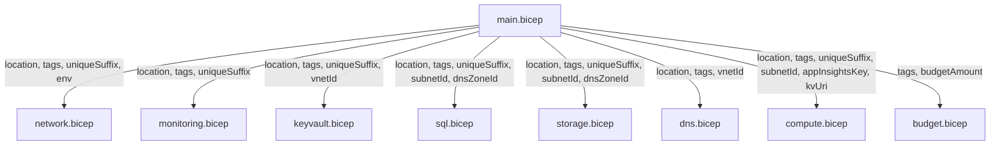

## 🗂️ Module Structure

```text
infra/bicep/nordic-fresh-foods/
├── main.bicep                      # Orchestrator — all module calls
├── main.bicepparam                 # Parameter file (prod defaults)
├── main.dev.bicepparam             # Parameter file (dev overrides)
├── deploy.ps1                      # Deployment script (phased)
├── modules/
│   ├── network.bicep               # VNet + subnets + NSGs
│   ├── monitoring.bicep            # Log Analytics + App Insights
│   ├── keyvault.bicep              # Key Vault + access policies
│   ├── sql.bicep                   # SQL Server + Database + PE
│   ├── storage.bicep               # Storage Account + PE
│   ├── dns.bicep                   # Private DNS Zones + VNet links
│   ├── compute.bicep               # App Service Plan + App Service
│   └── budget.bicep                # Consumption budget + alerts
```

### Module Interface Contract

Every module accepts these standard parameters:

```yaml
Parameters (standard):
  location: string # Region (default: resourceGroup().location)
  tags: object # All 11 tags (9 policy + 2 best-practice)
  uniqueSuffix: string # uniqueString(resourceGroup().id)
  environment: string # 'dev' | 'prod'

# Policy-enforced tag keys (EXACT names from Azure Policy Deny rule):
#   1. environment          2. owner
#   3. costcenter           4. application
#   5. workload             6. sla
#   7. backup-policy        8. maint-window
#   9. technical-contact
# Best-practice additions: ManagedBy, Project

Parameters (module-specific):
  # Each module defines additional params as needed

Outputs (standard):
  resourceId: string # Resource ID
  resourceName: string # Resource name
  principalId: string # Managed Identity principal (where applicable)
```

### Parameter Flow



---
