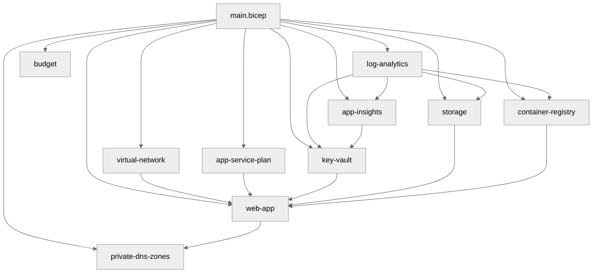

## Resources Created

| Resource                     | Bicep Type                                 | Module                             |
| ---------------------------- | ------------------------------------------ | ---------------------------------- |
| Log Analytics Workspace      | `Microsoft.OperationalInsights/workspaces` | `modules/log-analytics.bicep`      |
| Application Insights         | `Microsoft.Insights/components`            | `modules/app-insights.bicep`       |
| Key Vault + secret           | `Microsoft.KeyVault/vaults`                | `modules/key-vault.bicep`          |
| Storage Account + tables     | `Microsoft.Storage/storageAccounts`        | `modules/storage.bicep`            |
| Container Registry (Premium) | `Microsoft.ContainerRegistry/registries`   | `modules/container-registry.bicep` |
| Virtual Network + subnets    | `Microsoft.Network/virtualNetworks`        | `modules/virtual-network.bicep`    |
| App Service Plan (S1)        | `Microsoft.Web/serverfarms`                | `modules/app-service-plan.bicep`   |
| Web App + staging slot + MI  | `Microsoft.Web/sites`                      | `modules/web-app.bicep`            |
| Private DNS Zones            | `Microsoft.Network/privateDnsZones`        | `modules/private-dns-zones.bicep`  |
| Private Endpoints            | `Microsoft.Network/privateEndpoints`       | `modules/web-app.bicep`            |
| Consumption Budget           | `Microsoft.Consumption/budgets`            | `modules/budget.bicep`             |

## AVM Module Versions

| AVM Module                               | Version |
| ---------------------------------------- | ------- |
| `avm/res/operational-insights/workspace` | latest  |
| `avm/res/insights/component`             | latest  |
| `avm/res/key-vault/vault`                | latest  |
| `avm/res/storage/storage-account`        | latest  |
| `avm/res/container-registry/registry`    | latest  |
| `avm/res/network/virtual-network`        | 0.7.0   |
| `avm/res/web/serverfarm`                 | 0.4.0   |
| `avm/res/web/site`                       | 0.15.0  |
| `avm/res/network/private-dns-zone`       | 0.7.0   |

## Dependency Diagram

