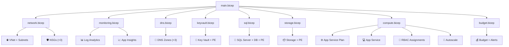

:::tip[Editorial Context]
This is **Step 6: Code**, where infrastructure-as-code modules are synthesized, validated, and security-scanned. Outputs are generated by the **CodeGen Agent**.
:::

<CardGrid>
  <Card title="Generated Artifacts" icon="document">
    [Read Generated Artifacts](./artifacts/)
  </Card>
  <Card title="Validation Results" icon="approve-check">
    [Read Validation Results](./validation/)
  </Card>
</CardGrid>


> Generated by 06b-Bicep CodeGen agent | 2025-07-13

## 📁 IaC Templates Location

📁 **Code Location**: [Bicep templates repository folder](https://github.com/jonathan-vella/azure-agentic-infraops/tree/main/infra/bicep/nordic-fresh-foods)

## 🏗️ Resources Created

| Resource                | AVM Module                                                | Module File                |
| ----------------------- | --------------------------------------------------------- | -------------------------- |
| Virtual Network         | `br/public:avm/res/network/virtual-network:0.7.2`         | network.bicep              |
| NSG (App)               | `br/public:avm/res/network/network-security-group:0.5.2`  | network.bicep              |
| NSG (Data)              | `br/public:avm/res/network/network-security-group:0.5.2`  | network.bicep              |
| NSG (PE)                | `br/public:avm/res/network/network-security-group:0.5.2`  | network.bicep              |
| Log Analytics Workspace | `br/public:avm/res/operational-insights/workspace:0.15.0` | monitoring.bicep           |
| Application Insights    | `br/public:avm/res/insights/component:0.7.1`              | monitoring.bicep           |
| Key Vault               | `br/public:avm/res/key-vault/vault:0.13.3`                | keyvault.bicep             |
| Private DNS Zones (×3)  | `br/public:avm/res/network/private-dns-zone:0.8.1`        | dns.bicep                  |
| SQL Server + Database   | `br/public:avm/res/sql/server:0.21.1`                     | sql.bicep                  |
| Storage Account         | `br/public:avm/res/storage/storage-account:0.32.0`        | storage.bicep              |
| App Service Plan        | `br/public:avm/res/web/serverfarm:0.7.0`                  | compute.bicep              |
| App Service             | `br/public:avm/res/web/site:0.22.0`                       | compute.bicep              |
| Private Endpoints (×3)  | `br/public:avm/res/network/private-endpoint:0.12.0`       | keyvault/sql/storage.bicep |
| Consumption Budget      | Raw Bicep (`Microsoft.Consumption/budgets`)               | budget.bicep               |



## 🚀 Deployment Instructions

```powershell
cd infra/bicep/nordic-fresh-foods
./deploy.ps1 -ResourceGroup "rg-nordic-fresh-foods-prod" -Environment "prod"
```

Deploys in 5 phases with approval gates between each phase.

```powershell
cd infra/bicep/nordic-fresh-foods
./deploy.ps1 -ResourceGroup "rg-nordic-fresh-foods-dev" -Environment "dev"
```

Single-pass deployment (no private endpoints, reduced SKUs).

```powershell
./deploy.ps1 -ResourceGroup "rg-nordic-fresh-foods-prod" -Environment "prod" -WhatIf
```

```powershell
./deploy.ps1 -ResourceGroup "rg-nordic-fresh-foods-prod" -Environment "prod" -StartFromPhase 3
```

Supported phases: 1 (Foundation), 2 (Observability), 3 (Security), 4 (Data), 5 (Compute)

```bash
az deployment group create \
  --resource-group "rg-nordic-fresh-foods-prod" \
  --template-file main.bicep \
  --parameters main.bicepparam \
  --parameters phase=foundation
```

### Deployment Phases

| Phase | Name          | Resources                                              | Approx. Time |
| ----- | ------------- | ------------------------------------------------------ | ------------ |
| 1     | Foundation    | VNet, Subnets, NSGs                                    | ~2 min       |
| 2     | Observability | Log Analytics, App Insights                            | ~3 min       |
| 3     | Security      | Key Vault, DNS Zones, KV PE                            | ~5 min       |
| 4     | Data          | SQL Server, Database, Storage, PEs                     | ~8 min       |
| 5     | Compute       | App Service Plan, App Service, Budget, RBAC, Autoscale | ~5 min       |

### Pre-Deployment Checklist

- [ ] Replace `<replace-with-sql-admin-group-object-id>` in parameter files
- [ ] Replace `<replace-with-sql-admin-group-name>` in parameter files
- [ ] Replace `<replace-with-budget-contact-email>` in parameter files
- [ ] Replace `<replace-with-technical-contact>` in parameter files
- [ ] Verify Azure AD group exists for SQL admin
- [ ] Confirm subscription `00858ffc-dded-4f0f-8bbf-e17fff0d47d9` is targeted

## 📝 Key Implementation Notes

| Note                                                      | Impact                                      | Reference             |
| --------------------------------------------------------- | ------------------------------------------- | --------------------- |
| Unique suffix via `uniqueString(resourceGroup().id)`      | All resource names (KV, Storage, SQL, App)  | main.bicep            |
| 11 mandatory tags (9 governance Deny + 2 baseline)        | All resources — Azure Policy enforced       | main.bicep `var tags` |
| Azure AD-only SQL auth                                    | No SQL password management; MI-based access | sql.bicep             |
| Phased deployment with `@allowed` phase parameter         | Supports incremental rollout and re-entry   | main.bicep            |
| Private endpoints conditional on `enablePrivateEndpoints` | Prod: full PE isolation; Dev: public access | all PE modules        |
| FTPS disabled on App Service                              | Security baseline — no FTP attack surface   | compute.bicep         |
| Budget alerts at 80%/100%/120% forecast + 90% actual      | Cost governance with anomaly detection      | budget.bicep          |

```bicep
var uniqueSuffix = uniqueString(resourceGroup().id)
// Example: kv-nff-prod-ab1c → 24-char limit respected via take()
```

### Governance Compliance

All 21 Azure Policy assignments from `04-governance-constraints.json` have been mapped and satisfied:

- **9 Deny-policy tags**: Applied via `var tags` in main.bicep, inherited by all modules
- **Azure AD-only SQL auth**: `azureADOnlyAuthentication: true` in sql.bicep
- **Tag inheritance (Modify)**: 4 tags auto-inherited from resource group
- **MFA for write operations**: Enforced at Azure AD level (not IaC-scoped)

---

_Implementation reference generated from Bicep templates._

---


