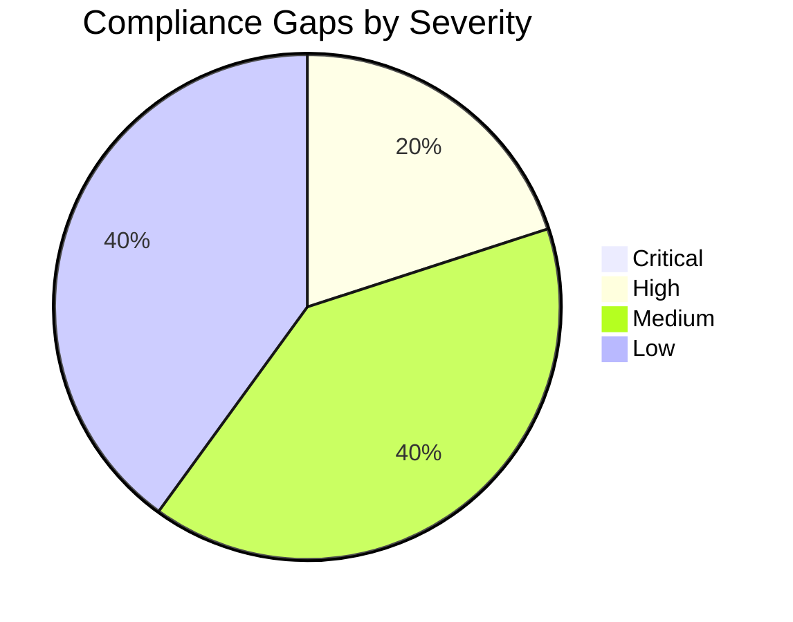

## Compliance Matrix

**Generated**: 2026-04-15
**Version**: 1.0
**Environment**: Development
**Primary Compliance Framework**: GDPR

### Executive Summary

| Compliance Area    | Coverage | Status |
| ------------------ | -------- | ------ |
| Network Security   | 90%      | ✅     |
| Data Protection    | 75%      | ⚠️     |
| Access Control     | 67%      | ⚠️     |
| Monitoring & Audit | 60%      | ⚠️     |
| Incident Response  | 50%      | ⚠️     |
| Overall            | 68%      | ⚠️     |

### Control Mapping

#### Requirement 1: GDPR Data Residency and Network Security

| Control                   | Requirement                            | Implementation                                                               | Status |
| ------------------------- | -------------------------------------- | ---------------------------------------------------------------------------- | ------ |
| EU region residency       | Personal data remains in an EU region  | All primary resources deployed in `swedencentral`                            | ✅     |
| Backend network isolation | Data services not publicly reachable   | Storage, Key Vault, and ACR use private endpoints and disabled public access | ✅     |
| Encryption in transit     | TLS 1.2+ for customer-facing endpoints | Production and staging sites enforce TLS 1.2 and HTTPS-only                  | ✅     |

**Evidence Location**: `agent-output/malta-catering/.asbuilt/`

| Evidence Item   | Type             | Date Collected |
| --------------- | ---------------- | -------------- |
| `webapp.json`   | Azure CLI output | 2026-04-15     |
| `keyvault.json` | Azure CLI output | 2026-04-15     |
| `storage.json`  | Azure CLI output | 2026-04-15     |

#### Requirement 2: Access Control and Secret Management

| Control                       | Requirement                                                    | Implementation                                                                                | Status |
| ----------------------------- | -------------------------------------------------------------- | --------------------------------------------------------------------------------------------- | ------ |
| Production workload identity  | Least-privilege access to dependencies                         | Production site has `AcrPull`, `Key Vault Secrets User`, and `Storage Table Data Contributor` | ✅     |
| Staging slot access parity    | Pre-production path should mirror production dependency access | Slot identity exists but has no direct RBAC assignments                                       | ⚠️     |
| Customer/staff authentication | Identity boundary should be enforced at the web tier           | App Service Authentication is disabled in the deployed state                                  | ⚠️     |

**Evidence Location**: `agent-output/malta-catering/.asbuilt/`

| Evidence Item       | Type              | Date Collected |
| ------------------- | ----------------- | -------------- |
| `webapp-rbac.json`  | Azure RBAC export | 2026-04-15     |
| `staging-rbac.json` | Azure RBAC export | 2026-04-15     |
| `webapp-auth.json`  | Azure CLI output  | 2026-04-15     |

#### Requirement 3: Logging, Audit, and Recovery Evidence

| Control               | Requirement                                        | Implementation                                               | Status |
| --------------------- | -------------------------------------------------- | ------------------------------------------------------------ | ------ |
| Centralized logging   | Workload telemetry retained centrally              | Log Analytics workspace deployed with 30-day retention       | ✅     |
| Application telemetry | Request and failure telemetry for the web workload | Workspace-linked Application Insights deployed               | ✅     |
| Backup evidence       | Recoverability evidence for order data             | No automated Table Storage export or backup process deployed | ⚠️     |

**Evidence Location**: `agent-output/malta-catering/.asbuilt/`

| Evidence Item       | Type                        | Date Collected |
| ------------------- | --------------------------- | -------------- |
| `loganalytics.json` | Azure CLI output            | 2026-04-15     |
| `appinsights.json`  | Azure CLI output            | 2026-04-15     |
| `curl-prod.txt`     | Runtime verification output | 2026-04-15     |

### Gap Analysis

| Gap                                            | Severity | Risk Level                                                                | Remediation                                                       | Timeline              |
| ---------------------------------------------- | -------- | ------------------------------------------------------------------------- | ----------------------------------------------------------------- | --------------------- |
| Staging slot has no direct RBAC assignments    | High     | Slot cannot reliably access ACR, Key Vault, or Storage during validation  | Grant the same three roles assigned to production                 | Before next slot use  |
| App Service Authentication is disabled         | Medium   | Customer and staff identity boundary is not enforced at the platform edge | Enable Easy Auth and configure the required identity provider(s)  | Before demo hardening |
| No automated Table Storage export/backup       | Medium   | Order data cannot be restored after logical deletion or corruption        | Add scheduled export to Blob Storage or equivalent backup process | Before production use |
| No application alert rules or action groups    | Low      | Failures rely on manual observation rather than alerting                  | Add availability and failure alerts                               | Next iteration        |
| Monitoring endpoints remain publicly reachable | Low      | App Insights and Log Analytics are not restricted by private access       | Reassess if stricter monitoring isolation becomes required        | Optional              |

Production and staging endpoint probes returned HTTP `503` during the Step 7 evidence collection window, so operational recovery remains open until availability is restored.

### Audit Trail

| Date       | Auditor           | Finding                             | Status |
| ---------- | ----------------- | ----------------------------------- | ------ |
| 2026-04-15 | 08-As-Built agent | Private backend isolation verified  | Closed |
| 2026-04-15 | 08-As-Built agent | Staging slot RBAC missing           | Open   |
| 2026-04-15 | 08-As-Built agent | App Service Authentication disabled | Open   |

### Remediation Tracker

| Finding                                                                                      | Owner             | Due Date   | Status      |
| -------------------------------------------------------------------------------------------- | ----------------- | ---------- | ----------- |
| Grant staging slot `AcrPull`, `Key Vault Secrets User`, and `Storage Table Data Contributor` | Platform owner    | 2026-04-22 | In Progress |
| Enable App Service Authentication                                                            | Application owner | 2026-04-22 | Todo        |
| Implement storage export backup path                                                         | Platform owner    | 2026-05-15 | Todo        |
| Add application alert rules                                                                  | Platform owner    | 2026-05-15 | Todo        |

### Azure Security Baseline Mapping

- Storage account hardening: HTTPS-only, TLS 1.2, public access disabled, shared key disabled.
- Key Vault hardening: RBAC enabled, purge protection enabled, soft delete enabled, public network disabled.
- Registry hardening: Premium tier, admin user disabled, public network disabled, retention enabled.
- Web tier: HTTPS-only, TLS 1.2, managed identity enabled.

---

## As-Built Cost Estimate

**Generated**: 2026-04-15
**Source**: Deployed resource inventory + `cost-estimate-subagent`
**Region**: swedencentral
**Environment**: Development

### Cost At-a-Glance

> **Monthly Total: $139.06** | Annual: $1,668.72

| Status            | Indicator                                 |
| ----------------- | ----------------------------------------- |
| Budget            | $500/month (soft) — Utilization: 27.8%    |
| Cost Trend        | Stable baseline with usage-based unknowns |
| Savings Available | Not quantified in this run                |
| Compliance        | GDPR-aligned regional placement           |

### Decision Summary

- **Implemented**: `P0v3` Linux App Service Plan, production Web App, staging slot, Premium ACR, Standard LRS Storage, Key Vault Standard, 3 private endpoints, 3 private DNS zones, Log Analytics, Application Insights, and a monthly budget resource.
- **Deferred**: Automated Table Storage backup/export, platform authentication, availability alerting, multi-region recovery.
- **Redesign Trigger**: Any requirement for warm regional failover, measured backup RPO, or materially higher production traffic will require a new pricing pass.

**Confidence**: Medium | **Expected Variance**: ±15%

### Design vs As-Built Summary

| Metric           | Design Estimate | As-Built  | Variance | Status |
| ---------------- | --------------- | --------- | -------- | ------ |
| Monthly Estimate | $154.87         | $139.06   | -$15.81  | ⚠️     |
| Annual Estimate  | $1,858.44       | $1,668.72 | -$189.72 | ⚠️     |

The as-built baseline is lower than the design estimate because the live pricing run treated Storage, Key Vault, Application Insights, Log Analytics, and Event Grid as usage-based services with no fixed baseline charge in the absence of observed consumption figures.

### Requirements → Cost Mapping

| Requirement                  | Architecture Decision                     | Cost Impact                      | Mandatory |
| ---------------------------- | ----------------------------------------- | -------------------------------- | --------- |
| Always-on container hosting  | `P0v3` Linux App Service Plan             | $64.97/month                     | Yes       |
| Private backend connectivity | 3 private endpoints + 3 private DNS zones | $23.40/month                     | Yes       |
| Private container image pull | ACR Premium                               | $50.69/month                     | Yes       |
| EU data residency            | `swedencentral` placement                 | $0.00 direct delta               | Yes       |
| Secrets management           | Key Vault Standard                        | $0.00 baseline, operations-based | Yes       |

### Top 5 Cost Drivers

| Rank | Resource                                   | Monthly Cost | % of Total | Trend  | Optimization                                       |
| ---- | ------------------------------------------ | ------------ | ---------- | ------ | -------------------------------------------------- |
| 1    | App Service Plan `P0v3`                    | $64.97       | 46.7%      | Stable | Reservation pricing not quantified in this run     |
| 2    | ACR Premium                                | $50.69       | 36.5%      | Stable | Clean up unused images to limit usage-based growth |
| 3    | Private Endpoints                          | $21.90       | 15.7%      | Stable | Fixed baseline at current endpoint count           |
| 4    | Private DNS Zones                          | $1.50        | 1.1%       | Stable | Fixed baseline at current zone count               |
| 5    | Storage / Key Vault / Monitoring baselines | $0.00        | 0.0%       | Stable | Reprice after 30 days of real telemetry            |

:::tip
**Quick Win**: Re-run the cost estimate after 30 days of usage telemetry to replace the current zero-baseline assumptions for Storage, Key Vault, and monitoring services.
:::

### Key Design Decisions Affecting Cost

| Decision               | Cost Impact  | Business Rationale                                       | Status   |
| ---------------------- | ------------ | -------------------------------------------------------- | -------- |
| `P0v3` instead of `S1` | $64.97/month | Regional deployment viability in the active subscription | Required |
| ACR Premium            | $50.69/month | Required for private endpoint support                    | Required |
| 3 private endpoints    | $21.90/month | Private access to Storage, Key Vault, and ACR            | Required |
| 3 private DNS zones    | $1.50/month  | Name resolution for private endpoints                    | Required |

### What We Are Not Paying For (Yet)

- Azure Front Door or WAF
- Warm secondary-region deployment
- Automated Table Storage backup/export process
- Application alert rules or action groups
- Measured data transfer, storage transaction, and log-ingestion overages

### Cost Risk Indicators

| Resource          | Risk Level | Issue                                              | Mitigation                                           |
| ----------------- | ---------- | -------------------------------------------------- | ---------------------------------------------------- |
| Storage Account   | Medium     | Baseline excludes transactions and capacity growth | Re-estimate after usage telemetry is available       |
| Log Analytics     | Medium     | Ingestion cost unresolved in this run              | Keep daily quota at 5 GB and review ingestion volume |
| ACR Premium       | Low        | Fixed unit priced, but storage growth not included | Enforce image cleanup and retention                  |
| Private Endpoints | Low        | Fixed hourly baseline                              | No action unless endpoint count changes              |

:::caution[Watch Item]
The current as-built total is a baseline-only figure. It will rise once live usage for Storage, Key Vault operations, Event Grid activity, and monitoring ingestion is measured.
:::

### Quick Decision Matrix

_"If you need X, expect to pay Y more"_

| Requirement                    | Additional Cost                        | SKU Change                      | Verdict     | Notes                                   |
| ------------------------------ | -------------------------------------- | ------------------------------- | ----------- | --------------------------------------- |
| Warm regional DR               | Not quantified in this run             | Additional region-wide stack    | Investigate | Requires a fresh pricing pass           |
| Measured backup/export         | Not quantified in this run             | Additional automation resources | Monitor     | Needed before production use            |
| Availability alerts            | Not quantified in this run             | Monitoring add-ons              | Monitor     | Operationally recommended               |
| Slot parity and authentication | No meaningful baseline impact expected | Config only                     | Go          | Mostly governance and runtime hardening |

### Savings Opportunities

Reservation and commitment strategies should be evaluated once production workload patterns and SKU selections are confirmed.

| Strategy                | Applicability | Prerequisites                                    |
| ----------------------- | ------------- | ------------------------------------------------ |
| Reserved Instances (RI) | Yes           | Stable App Service plan usage                    |
| Savings Plan (SP)       | Yes           | Committed compute spend confirmed                |
| Spot / Low Priority     | No            | Not applicable to the current App Service design |
| Right-sizing            | Yes           | 30-day utilization data available                |
| Dev/Test Pricing        | Yes           | Confirm subscription and licensing eligibility   |

### Detailed Cost Breakdown

#### IaC / Pricing Coverage

| Signal             | Value                                                                                                                                                    | Status |
| ------------------ | -------------------------------------------------------------------------------------------------------------------------------------------------------- | ------ |
| Templates scanned  | 10                                                                                                                                                       | ✅     |
| Resources detected | 12 cost-relevant services/components                                                                                                                     | ✅     |
| Resources priced   | 4 baseline-priced line items                                                                                                                             | ⚠️     |
| Unpriced resources | Storage usage, Key Vault operations, Log Analytics ingestion, Application Insights effective billing path, Event Grid operations, ACR stored data growth | ⚠️     |

#### Line Items

| Category      | Service                                  | SKU / Meter                    | Quantity / Units       | Est. Monthly |
| ------------- | ---------------------------------------- | ------------------------------ | ---------------------- | ------------ |
| Compute       | Azure App Service Plan (Linux dedicated) | `P0v3`                         | `730 hours`            | $64.97       |
| Compute       | Azure App Service Web App                | Included in plan               | `1 site + 1 slot`      | $0.00        |
| Data Services | Azure Container Registry                 | `Premium`                      | `1 registry unit`      | $50.69       |
| Data Services | Azure Storage Account                    | `Standard_LRS`                 | Usage-based            | $0.00        |
| Security/Mgmt | Azure Key Vault                          | `Standard`                     | Usage-based            | $0.00        |
| Networking    | Private Endpoints                        | Standard Private Endpoint      | `3 x 730 hours`        | $21.90       |
| Networking    | Private DNS Zones                        | Azure DNS Private Zone         | `3 zones`              | $1.50        |
| Monitoring    | Log Analytics Workspace                  | `PerGB2018`                    | Low usage assumed      | $0.00        |
| Monitoring    | Application Insights                     | Workspace-linked web component | Low usage assumed      | $0.00        |
| Messaging     | Event Grid system topic                  | Standard operations            | No baseline identified | $0.00        |

#### Notes

- Pricing copied verbatim from the `cost-estimate-subagent` result and not hand-adjusted.
- The returned estimate status was `PARTIAL` and confidence was `Medium`.
- Design-vs-as-built variance is negative because the design artifact carried explicit baseline assumptions for Storage and monitoring that the as-built pricing run left unresolved at zero baseline.
- Query timestamp reported by the pricing subagent: `2026-04-15T00:00:00Z`.
