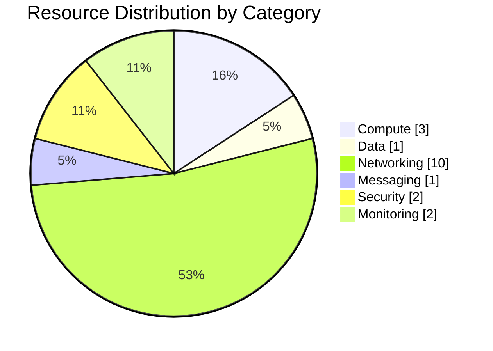

## Design Document

### Introduction

This document records the deployed Malta Catering Azure workload as it exists after the successful `azd provision` run on 2026-04-15. It is intended to support operations, audit review, troubleshooting, and future iteration of the workload.

**Intended Audience:** Solution Architects, Operations/SRE Teams, Security & Compliance Teams, Development Teams

### Project Overview

Malta Catering is a containerized online ordering demo for a Malta-based catering outlet. The deployed workload runs a Linux container on Azure App Service and uses private connectivity to Key Vault, Table Storage, and Azure Container Registry. Monitoring is provided through Application Insights and Log Analytics, and cost governance is enforced with a monthly budget resource.

**Business Objectives:**

- Publish a live online ordering surface for customers and staff.
- Keep customer and order data inside EU-hosted Azure resources.
- Demonstrate an App Service-based alternative to the blocked Container Apps deployment path.

### Design Objectives

| Objective    | Target                                      | Implementation                                                         |
| ------------ | ------------------------------------------- | ---------------------------------------------------------------------- |
| Availability | 99.0% service target                        | Single-region App Service plan with staging slot                       |
| Performance  | Low-latency always-on container hosting     | `P0v3` Linux App Service Plan with one dedicated worker                |
| Security     | Private backend access and managed identity | VNet integration, 3 private endpoints, Key Vault RBAC, ACR pull via MI |
| Scalability  | Dev/demo scale with room for growth         | Premium v3 plan supports vertical scaling and additional workers       |

### Constraints & Assumptions

**Constraints:**

- The original `S1` plan selection was not deployable in this subscription and region; the deployed plan is `P0v3`.
- The workload remains single-region in `swedencentral`; no warm DR region is deployed.

**Assumptions:**

- Table Storage backup/export remains a future production enhancement rather than part of the current deployment.
- Budgetary and monitoring baselines assume a dev/demo usage profile with low ingestion and low transaction volume.

### Stakeholders

| Role               | Team                   | Responsibility                                  |
| ------------------ | ---------------------- | ----------------------------------------------- |
| Platform Owner     | Demo Platform          | Azure subscription, policy, and deployment flow |
| Application Owner  | Malta Catering         | Container image, app behavior, and demo content |
| Operations Contact | `platform@example.com` | Runtime verification and operational follow-up  |

### Architecture Overview

The as-built architecture is delivered as editable Draw.io source.

| Category   | Count |
| ---------- | ----- |
| Compute    | 3     |
| Networking | 10    |
| Data       | 1     |
| Security   | 2     |

Additional deployed components include 2 monitoring resources, 1 Event Grid system topic, and 1 management budget object.

### Networking

The production endpoint is public on the default Azure hostname, while all backend platform services are restricted through private endpoints inside the workload VNet.

#### Virtual Network Summary

| VNet Name                 | Address Space | Region          | Purpose                                                            |
| ------------------------- | ------------- | --------------- | ------------------------------------------------------------------ |
| `vnet-malta-catering-dev` | `10.0.0.0/24` | `swedencentral` | Workload network for App Service integration and private endpoints |

#### Subnet Allocation

| Subnet                   | Address Range  | Delegated To                | NSG    |
| ------------------------ | -------------- | --------------------------- | ------ |
| `snet-app-service`       | `10.0.0.0/27`  | `Microsoft.Web/serverFarms` | `None` |
| `snet-private-endpoints` | `10.0.0.32/27` | `None`                      | `None` |

#### DNS & Private Endpoints

| Service                  | Private Endpoint                   | Private DNS Zone                     |
| ------------------------ | ---------------------------------- | ------------------------------------ |
| Azure Key Vault          | `pep-kv-malta-dev-b6lg3l-vault-0`  | `privatelink.vaultcore.azure.net`    |
| Table Storage            | `pep-stmaltadevb6lg3l-table-0`     | `privatelink.table.core.windows.net` |
| Azure Container Registry | `pep-acrmaltadevb6lg3l-registry-0` | `privatelink.azurecr.io`             |

### Storage

#### Storage Account Summary

| Account            | Kind        | Replication    | Access Tier | Public Access |
| ------------------ | ----------- | -------------- | ----------- | ------------- |
| `stmaltadevb6lg3l` | `StorageV2` | `Standard_LRS` | `Hot`       | `Disabled`    |

#### Data Retention

| Data Category | Retention Period | Lifecycle Policy                        |
| ------------- | ---------------- | --------------------------------------- |
| Customer PII  | 90 days target   | Application-managed deletion on request |
| Order records | 1 year target    | Application-managed retention           |
| Menu data     | Indefinite       | Manual application update               |

### Compute

#### Compute Resource Summary

| Resource                         | Type                   | SKU      | Instances | Scaling                |
| -------------------------------- | ---------------------- | -------- | --------- | ---------------------- |
| `asp-malta-catering-dev`         | App Service Plan       | `P0v3`   | 1         | Manual scale only      |
| `app-malta-catering-dev`         | Web App for Containers | Included | 1         | Bound to plan capacity |
| `app-malta-catering-dev/staging` | Deployment Slot        | Included | 1         | Bound to plan capacity |

#### Scaling Configuration

| Resource                 | Min | Max | Scale Trigger                   |
| ------------------------ | --- | --- | ------------------------------- |
| `asp-malta-catering-dev` | 1   | 30  | Manual App Service plan scaling |
| `app-malta-catering-dev` | 1   | 1   | No autoscale configured         |

### Identity & Access

#### Managed Identities

| Identity                               | Type            | Assigned To                      | Key Permissions                                                       |
| -------------------------------------- | --------------- | -------------------------------- | --------------------------------------------------------------------- |
| `156a5dbf-66f8-48b0-bf7c-bcd156eb6528` | System-assigned | `app-malta-catering-dev`         | `AcrPull`, `Key Vault Secrets User`, `Storage Table Data Contributor` |
| `d8c9ade8-c8c6-4f01-b300-4cd749a68fff` | System-assigned | `app-malta-catering-dev/staging` | No direct role assignments detected                                   |

#### RBAC Role Assignments

| Principal                   | Role                             | Scope                 |
| --------------------------- | -------------------------------- | --------------------- |
| Production web app identity | `AcrPull`                        | `acrmaltadevb6lg3l`   |
| Production web app identity | `Key Vault Secrets User`         | `kv-malta-dev-b6lg3l` |
| Production web app identity | `Storage Table Data Contributor` | `stmaltadevb6lg3l`    |
| Staging slot identity       | None assigned                    | Not configured        |

### Security & Compliance

#### Security Controls

| Control           | Implementation                                                                | Evidence                                                               |
| ----------------- | ----------------------------------------------------------------------------- | ---------------------------------------------------------------------- |
| TLS 1.2+          | App Service and slot both enforce `minTlsVersion = 1.2`                       | `.asbuilt/webapp.json`, `.asbuilt/webapp-staging.json`                 |
| HTTPS-only        | Production and staging sites both set `httpsOnly = true`                      | `.asbuilt/webapp.json`, `.asbuilt/webapp-staging.json`                 |
| Managed Identity  | System-assigned identity enabled on production and slot                       | `.asbuilt/webapp.json`, `.asbuilt/webapp-staging.json`                 |
| Network isolation | Key Vault, Storage, and ACR use private endpoints with public access disabled | `.asbuilt/keyvault.json`, `.asbuilt/storage.json`, `.asbuilt/acr.json` |

#### Compliance Mapping

| Framework | Control ID                            | Status |
| --------- | ------------------------------------- | ------ |
| GDPR      | Data residency in EU region           | ✅     |
| GDPR      | Secrets isolation and least privilege | ⚠️     |
| GDPR      | Customer authentication path          | ⚠️     |

The deployed workload materially improves the original architecture posture through private backend connectivity, managed identity, disabled shared keys, and Key Vault RBAC. Two important operational gaps remain in the as-built state: App Service Authentication is not enabled, and the staging slot identity currently has no RBAC assignments.

### Backup & Disaster Recovery

#### Recovery Objectives

| Tier      | RTO Target | RPO Target                | Services                                           |
| --------- | ---------- | ------------------------- | -------------------------------------------------- |
| Critical  | 24 hours   | Best-effort               | App Service, Storage, Container image availability |
| Important | 24 hours   | 7 days / last known state | Key Vault, monitoring workspace, private DNS       |
| Standard  | 48 hours   | Best-effort               | Budgeting, auxiliary diagnostics, documentation    |

#### Backup Summary

| Service                | Backup Type                     | Retention                      | Geo-Redundant |
| ---------------------- | ------------------------------- | ------------------------------ | ------------- |
| App Service config     | Infrastructure as code redeploy | Source-controlled              | No            |
| Key Vault              | Soft delete + purge protection  | 7 days                         | No            |
| Storage Table data     | None deployed                   | N/A                            | No            |
| ACR container metadata | Retention policy                | 15 days for untagged manifests | No            |

### Management & Monitoring

#### Monitoring Configuration

| Service          | Monitoring Tool                      | Key Metrics                                        |
| ---------------- | ------------------------------------ | -------------------------------------------------- |
| Web App / Slot   | Application Insights + Log Analytics | Requests, failures, container startup, HTTP status |
| App Service Plan | Azure platform metrics               | CPU, memory, worker status                         |
| Budget           | Azure Consumption Budget             | Forecast 80%, forecast 120%, actual 100%           |

#### Alert Rules

| Alert                           | Severity     | Threshold             | Action                       |
| ------------------------------- | ------------ | --------------------- | ---------------------------- |
| `forecast80`                    | Sev3         | Forecast spend ≥ 80%  | Email `platform@example.com` |
| `forecast120`                   | Sev2         | Forecast spend ≥ 120% | Email `platform@example.com` |
| `actual100`                     | Sev2         | Actual spend ≥ 100%   | Email `platform@example.com` |
| Application availability alerts | Not deployed | N/A                   | Gap recorded in Step 7       |

---

## Resource Inventory

**Generated**: 2026-04-15
**Source**: Deployed Azure resources and implemented Bicep templates
**Environment**: Development
**Region**: swedencentral

### Inventory Summary

| Category            | Count |
| ------------------- | ----- |
| **Total Resources** | 20    |
| Compute             | 3     |
| Data Services       | 1     |
| Networking          | 10    |
| Messaging           | 1     |
| Security            | 2     |
| Monitoring          | 2     |
| Management          | 1     |

The total includes the resource-group budget and the three private DNS zones that are not surfaced by the generic `az resource list` result set but are present in the live resource group and included in the as-built evidence set under `.asbuilt/`.

### Compute Resources

| Name                             | Type                        | SKU              | Location        | Monthly Cost | Purpose                                       |
| -------------------------------- | --------------------------- | ---------------- | --------------- | ------------ | --------------------------------------------- |
| `asp-malta-catering-dev`         | App Service Plan            | `P0v3`           | `swedencentral` | $64.97       | Linux dedicated compute plan for the workload |
| `app-malta-catering-dev`         | App Service Web App         | Included in plan | `swedencentral` | $0.00        | Production container host and public endpoint |
| `app-malta-catering-dev/staging` | App Service deployment slot | Included in plan | `swedencentral` | $0.00        | Pre-production slot for staged validation     |

### Data Services

| Name               | Type            | SKU            | Configuration                                                                  | Location        | Monthly Cost   |
| ------------------ | --------------- | -------------- | ------------------------------------------------------------------------------ | --------------- | -------------- |
| `stmaltadevb6lg3l` | Storage Account | `Standard_LRS` | `StorageV2`, hot tier, HTTPS-only, shared key disabled, public access disabled | `swedencentral` | $0.00 baseline |

### Networking Resources

| Name                                      | Type                    | Configuration                                           | Location        |
| ----------------------------------------- | ----------------------- | ------------------------------------------------------- | --------------- |
| `vnet-malta-catering-dev`                 | Virtual Network         | Address space `10.0.0.0/24`                             | `swedencentral` |
| `snet-app-service`                        | Delegated subnet        | `10.0.0.0/27`, delegated to `Microsoft.Web/serverFarms` | `swedencentral` |
| `snet-private-endpoints`                  | Private endpoint subnet | `10.0.0.32/27`, private endpoint policies disabled      | `swedencentral` |
| `pep-stmaltadevb6lg3l-table-0`            | Private Endpoint        | Table Storage private link in `snet-private-endpoints`  | `swedencentral` |
| `pep-kv-malta-dev-b6lg3l-vault-0`         | Private Endpoint        | Key Vault private link in `snet-private-endpoints`      | `swedencentral` |
| `pep-acrmaltadevb6lg3l-registry-0`        | Private Endpoint        | ACR registry private link in `snet-private-endpoints`   | `swedencentral` |
| `pep-stmaltadevb6lg3l-table-0.nic...`     | Network Interface       | Managed NIC for Storage private endpoint                | `swedencentral` |
| `pep-kv-malta-dev-b6lg3l-vault-0.nic...`  | Network Interface       | Managed NIC for Key Vault private endpoint              | `swedencentral` |
| `pep-acrmaltadevb6lg3l-registry-0.nic...` | Network Interface       | Managed NIC for ACR private endpoint                    | `swedencentral` |
| `privatelink.table.core.windows.net`      | Private DNS Zone        | One VNet link, two record sets                          | `global`        |
| `privatelink.vaultcore.azure.net`         | Private DNS Zone        | One VNet link, two record sets                          | `global`        |
| `privatelink.azurecr.io`                  | Private DNS Zone        | One VNet link, three record sets                        | `global`        |

### Messaging Resources

| Name                                                    | Type                    | SKU      | Configuration                                       | Location        |
| ------------------------------------------------------- | ----------------------- | -------- | --------------------------------------------------- | --------------- |
| `stmaltadevb6lg3l-54b43000-43fb-447d-bedf-faef9631cdcf` | Event Grid system topic | Standard | Auto-created platform topic associated with storage | `swedencentral` |

### Security Resources

| Name                  | Type               | Configuration                                                                   | Location        |
| --------------------- | ------------------ | ------------------------------------------------------------------------------- | --------------- |
| `kv-malta-dev-b6lg3l` | Key Vault          | Standard tier, RBAC enabled, purge protection on, public network disabled       | `swedencentral` |
| `acrmaltadevb6lg3l`   | Container Registry | Premium tier, admin disabled, retention policy enabled, public network disabled | `swedencentral` |

### Monitoring Resources

| Name                      | Type                    | Retention | Location        |
| ------------------------- | ----------------------- | --------- | --------------- |
| `log-malta-catering-dev`  | Log Analytics Workspace | 30 days   | `swedencentral` |
| `appi-malta-catering-dev` | Application Insights    | 90 days   | `swedencentral` |

### Management Resources

| Name                        | Type   | Configuration                                                          | Location   |
| --------------------------- | ------ | ---------------------------------------------------------------------- | ---------- |
| `budget-malta-catering-dev` | Budget | Monthly budget `$500`, notifications at forecast 80/120 and actual 100 | `rg scope` |

Budget management is tracked outside the category chart because it is a governance object rather than a workload runtime component.
