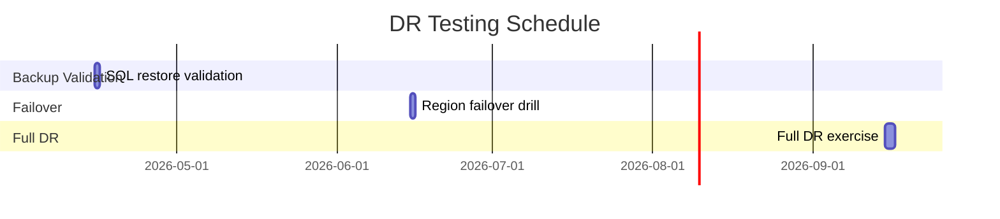
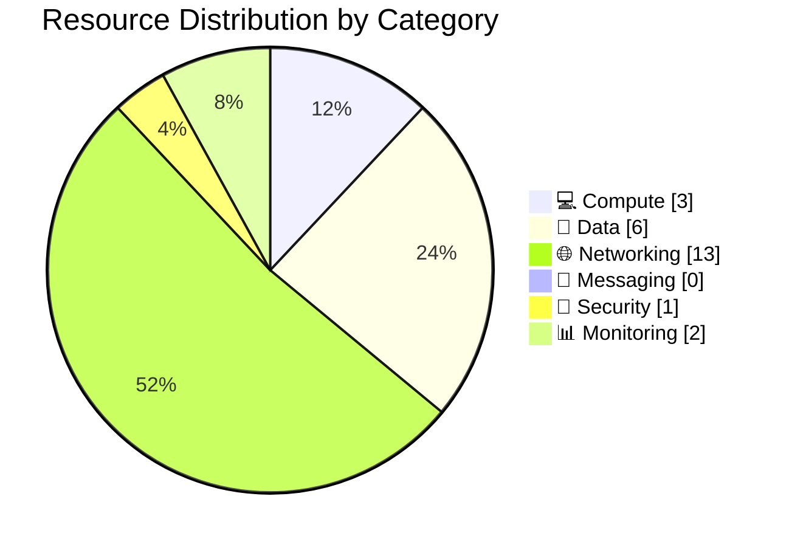

:::tip[Editorial Context]
This is **Step 8: As-Built**, capturing the realized state of the architecture to provide full traceability from initial requirements. Outputs are generated by the **As-Built Agent**.
:::

<CardGrid>
  <Card title="Operations Runbook" icon="laptop">
    [Read Operations Runbook](./runbook/)
  </Card>
  <Card title="Compliance Matrix" icon="shield">
    [Read Compliance Matrix](./compliance-matrix/)
  </Card>
</CardGrid>

:::note[Documentation Suite]
The As-Built agent generates a complete documentation package after successful deployment. Each section below is a separate artifact produced by the agent.
:::

## Architecture (As-Built)

_Diagram removed — Excalidraw is no longer in use. Architecture diagrams now use Draw.io._

## Cost Distribution (Actual)


## Cost Comparison (Estimated vs Actual)


## Compliance Gaps


---

## Design Document

> Generated by 08-As-Built agent | 2026-03-11

**Version**: 1.0
**Date**: 2026-03-11
**Author**: Generated by Workload Documentation Generator
**Status**: Complete

---

### 📝 1. Introduction

### 1.1 Document Purpose

This as-built design document captures the actual Azure deployment state for the FreshConnect MVP workload after successful Step 6 deployment.

**Intended Audience:**

- Solution Architects
- Operations/SRE Teams
- Security & Compliance Teams
- Development Teams

### 1.2 Project Overview

Cloud-based farm-to-table ordering platform connecting farms, restaurants, and consumers across Scandinavia. Deployed as a cost-optimized N-tier web application in `swedencentral` with private data access paths for SQL, Storage, and Key Vault.

**Business Objectives:**

- Reduce order errors to below 1%
- Enable near-real-time order and inventory processing
- Maintain GDPR and PCI-DSS aligned security controls under startup budget

### 1.3 Design Objectives

| Objective    | Target                               | Implementation                                                                              |
| ------------ | ------------------------------------ | ------------------------------------------------------------------------------------------- |
| Availability | 99.9%                                | App Service Standard S1 with autoscale min 2, max 3                                         |
| Performance  | p95 API < 500 ms                     | Co-located App Service + SQL in Sweden Central, S0 SQL baseline                             |
| Security     | Private data paths, no secret sprawl | Key Vault + Managed Identity + private endpoints + public network disabled on data services |
| Scalability  | 3x seasonal traffic                  | CPU autoscale policy 70% up / 30% down                                                      |

### 1.4 Constraints & Assumptions

**Constraints:**

- Budget ceiling around EUR 1,000/month
- EU data residency and policy-enforced tagging

**Assumptions:**

- Workload remains single-region for MVP
- Payment provider remains tokenized/redirect model (no CHD in Azure estate)

### 1.5 Stakeholders

| Role                  | Team                           | Responsibility                            |
| --------------------- | ------------------------------ | ----------------------------------------- |
| Platform Owner        | Nordic Fresh Foods Engineering | Product and platform ownership            |
| Operations            | InfraOps / SRE                 | Runtime operations and incident response  |
| Security & Compliance | Governance + Security          | PCI/GDPR control evidence and remediation |

---

### 🏛️ 2. Azure Architecture Overview

### 2.1 Architecture Diagram

_Diagram removed — Excalidraw is no longer in use. Architecture diagrams now use Draw.io._

### 2.2 Resource Summary

| Category   | Count |
| ---------- | ----- |
| Compute    | 3     |
| Networking | 13    |
| Data       | 6     |
| Security   | 1     |

---

### 🌐 3. Networking

The workload uses a single VNet (`10.0.0.0/16`) with 3 subnets:

- `snet-app` (`10.0.1.0/24`) delegated to `Microsoft.Web/serverFarms`
- `snet-data` (`10.0.2.0/24`) reserved for data tier
- `snet-pe` (`10.0.3.0/24`) for private endpoints (SQL, Blob, Key Vault)

Private DNS zones are linked to the VNet:

- `privatelink.database.windows.net`
- `privatelink.blob.core.windows.net`
- `privatelink.vaultcore.azure.net`

Public network access is disabled for SQL Server, Storage Account, and Key Vault. App Service remains public (`azurewebsites.net`) with HTTPS-only.

---

### 💾 4. Storage

Storage account `stnffprod7jrcjfo3iqckk` is deployed as `StorageV2` with `Standard_LRS`.

Key configuration:

- `enableHttpsTrafficOnly: true`
- `minimumTlsVersion: TLS1_2`
- `allowBlobPublicAccess: false`
- `allowSharedKeyAccess: false`
- `publicNetworkAccess: Disabled`
- Network default action: `Deny`

Blob containers listed in deployment summary: `assets`, `product-images`.

---

### 💻 5. Compute

Compute tier consists of:

- App Service Plan `asp-nordic-fresh-foods-prod` (Linux S1, capacity 2)
- Web App `app-nordic-fresh-foods-prod-7jrcjf` (state: Running)
- Autoscale `autoscale-asp-nordic-fresh-foods-prod` (2-3 instances)

Operational compute settings observed:

- `httpsOnly: true`
- `ftpsState: Disabled`
- `minTlsVersion: 1.2`
- System-assigned managed identity enabled
- VNet integration to `snet-app`

---

### 👤 6. Identity & Access

Identity model:

- User identity: Microsoft Entra External ID (application-level auth)
- Workload identity: System-assigned managed identity on App Service
- SQL admin: Entra group (`nordic-foods-dba`), Azure AD-only authentication enabled

RBAC evidence:

- App Service managed identity granted `Key Vault Secrets User` on Key Vault scope.

---

### 🔐 7. Security & Compliance

| Control           | Implementation                                            | Evidence                                                          |
| ----------------- | --------------------------------------------------------- | ----------------------------------------------------------------- |
| TLS 1.2+          | SQL min TLS 1.2, Storage TLS 1.2, Web App TLS 1.2         | `az sql server show`, `az storage account show`, `az webapp show` |
| HTTPS-only        | Web App + Storage                                         | `httpsOnly: true`, `enableHttpsTrafficOnly: true`                 |
| Managed Identity  | App Service system-assigned identity                      | App Service principal ID `24cd6768-7247-43ac-a1d2-9a7f22000a40`   |
| Network isolation | SQL/Storage/KV public access disabled + private endpoints | 3 private endpoints + 3 private DNS zones                         |

| Framework    | Control ID                           | Status |
| ------------ | ------------------------------------ | ------ |
| GDPR         | Data residency + access controls     | ✅     |
| PCI-DSS v4   | Segmentation + encryption in transit | ✅     |
| Azure Policy | Required tags + SQL AAD-only auth    | ✅     |

Open compliance risks:

- ⚠️ Several policy tags (`application`, `costcenter`, `backup-policy`, `maint-window`, `sla`, `workload`) are present but empty values in deployed tags.
- ❌ App Service ingress restrictions are currently allow-all (no WAF/IP restrictions configured).

---

### 🔄 8. Backup & Disaster Recovery

Current protection posture:

- SQL Database S0 with PITR (local backup redundancy)
- Key Vault soft delete (90 days) and purge protection enabled
- IaC reconstruction path available from `infra/bicep/nordic-fresh-foods/`

MVP DR design remains single-region with documented failover strategy to `germanywestcentral` as manual recovery pattern.

---

### 📊 9. Management & Monitoring

Monitoring stack:

- Log Analytics workspace `log-nordic-fresh-foods-prod` (PerGB2018, 30-day retention, 2 GB/day cap)
- Application Insights `appi-nordic-fresh-foods-prod` (workspace-based, 50% sampling)
- Autoscale policy on App Service Plan
- Resource group budget `budget-nordic-fresh-foods-prod` with actual+forecast notifications

---

### 📎 10. Appendix

- Subscription: `00858ffc-dded-4f0f-8bbf-e17fff0d47d9`
- Resource group: `rg-nordic-fresh-foods-prod`
- Region: `swedencentral`
- App endpoint: `https://app-nordic-fresh-foods-prod-7jrcjf.azurewebsites.net`
- SQL FQDN: `sql-nordic-fresh-foods-prod.database.windows.net`
- Key Vault URI: `https://kv-nff-prod-7jrcjfo3iqck.vault.azure.net/`
- Storage blob endpoint: `https://stnffprod7jrcjfo3iqckk.blob.core.windows.net/`

| Architecture                        | Link                                           |
| ----------------------------------- | ---------------------------------------------- |
| Design-time architecture assessment | [Architecture Assessment](../02-architecture/) |
| Deployment outcomes                 | [Deployment Summary](../07-deploy/)            |

---

### References

> [!NOTE]
> 📚 The following Microsoft Learn resources provide additional guidance.

| Topic                      | Link                                                                                               |
| -------------------------- | -------------------------------------------------------------------------------------------------- |
| Well-Architected Framework | [Overview](https://learn.microsoft.com/azure/well-architected/)                                    |
| Azure Architecture Center  | [Architectures](https://learn.microsoft.com/azure/architecture/)                                   |
| Security Best Practices    | [Security Baseline](https://learn.microsoft.com/security/benchmark/azure/overview)                 |
| Networking Best Practices  | [Network Security](https://learn.microsoft.com/azure/security/fundamentals/network-best-practices) |
| Backup Best Practices      | [Azure Backup](https://learn.microsoft.com/azure/backup/backup-overview)                           |
| Monitoring Overview        | [Azure Monitor](https://learn.microsoft.com/azure/azure-monitor/overview)                          |

---

_Design document generated from deployed infrastructure artifacts._

---

---

## Backup & DR Plan

> Generated by 08-As-Built agent | 2026-03-11

**Generated**: 2026-03-11
**Version**: 1.0
**Environment**: prod
**Primary Region**: swedencentral
**Secondary Region**: germanywestcentral (planned failover target)

---

### 📋 Executive Summary

> [!IMPORTANT]
> This document defines the backup strategy and disaster recovery procedures for nordic-fresh-foods.

| Metric           | Current                                                                      | Target   |
| ---------------- | ---------------------------------------------------------------------------- | -------- |
| **RPO**          | SQL: service-managed PITR window; app data: daily operational backup pattern | 12 hours |
| **RTO**          | Manual failover + redeploy strategy                                          | 24 hours |
| **Availability** | Single-region with autoscale                                                 | 99.9%    |

---

### 🎯 1. Recovery Objectives

### 1.1 Recovery Time Objective (RTO)

| Tier         | RTO Target | Services                               |
| ------------ | ---------- | -------------------------------------- |
| 🔴 Critical  | 4-8 hours  | App Service, SQL database, Key Vault   |
| 🟠 Important | 8-16 hours | Storage assets, DNS private resolution |
| 🟢 Standard  | 24 hours   | Monitoring, non-critical integrations  |

### 1.2 Recovery Point Objective (RPO)

| Data Type                | RPO Target  | Backup Strategy                                     |
| ------------------------ | ----------- | --------------------------------------------------- |
| Transactional data (SQL) | <= 12 hours | SQL automated backups + PITR                        |
| Blob assets              | <= 24 hours | Export/snapshot operational process                 |
| Secrets/config           | <= 24 hours | Key Vault recoverable soft-delete + IaC rehydration |

```mermaid
gantt
    title RPO / RTO Targets by Tier
    dateFormat HH:mm
    axisFormat %H:%M
    section Critical
        RPO :crit, rpo1, 00:00, 12h
        RTO :crit, rto1, 00:00, 8h
    section Important
        RPO :rpo2, 00:00, 24h
        RTO :rto2, 00:00, 16h
    section Standard
        RPO :rpo3, 00:00, 24h
        RTO :rto3, 00:00, 24h
```



---

### 💾 2. Backup Strategy

| Setting             | Configuration                         |
| ------------------- | ------------------------------------- |
| Backup Type         | Platform-managed automated backups    |
| Retention (PITR)    | Service default for S0 tier           |
| Long-Term Retention | Not configured in current deployment  |
| Geo-Redundancy      | Not enabled (local backup redundancy) |

**Point-in-Time Restore Command:**

```bash
az sql db restore \
  --resource-group rg-nordic-fresh-foods-prod \
  --server sql-nordic-fresh-foods-prod \
  --name sqldb-freshconnect-prod \
  --dest-name sqldb-freshconnect-prod-restored \
  --time "2026-03-11T17:00:00Z"
```

| Setting          | Configuration |
| ---------------- | ------------- |
| Soft Delete      | Enabled       |
| Purge Protection | Enabled       |

---

### 🌍 3. Disaster Recovery Procedures

### 3.1 Failover Procedure

1. Confirm incident severity and regional impact in Azure Service Health.
2. Restore SQL database to failover region (manual geo-restore or latest available backup path).
3. Re-deploy stack from `infra/bicep/nordic-fresh-foods/` with failover region parameters.
4. Rehydrate Key Vault secrets and validate managed identity permissions.
5. Update DNS/app endpoint routing to failover deployment.
6. Execute smoke tests and release service.

### 3.2 Failback Procedure

1. Validate primary region recovery.
2. Synchronize latest data back to primary environment.
3. Re-deploy primary resources from IaC.
4. Switch traffic back during approved maintenance window.
5. Run post-failback validation and close incident.

---

### 🧪 4. Testing Schedule

| Test Type                         | Frequency   | Last Test    | Next Test |
| --------------------------------- | ----------- | ------------ | --------- |
| SQL PITR restore test             | Quarterly   | Not recorded | 2026-Q2   |
| Private endpoint + DNS validation | Quarterly   | Not recorded | 2026-Q2   |
| Full tabletop DR exercise         | Semi-annual | Not recorded | 2026-Q3   |



---

### 📢 5. Communication Plan

| Audience             | Channel       | Template                              |
| -------------------- | ------------- | ------------------------------------- |
| Engineering on-call  | Teams + Pager | P1/P2 incident template               |
| Product stakeholders | Teams + Email | Service disruption notice             |
| Compliance contacts  | Email         | Security/compliance incident template |

---

### 👥 6. Roles and Responsibilities

| Role                      | Team                | Responsibility                                      |
| ------------------------- | ------------------- | --------------------------------------------------- |
| Incident Commander        | SRE lead            | Owns incident bridge, decisions, and communications |
| Database Recovery Lead    | Data platform       | Executes SQL restore/failover tasks                 |
| Application Recovery Lead | App engineering     | Re-deploys and validates application tier           |
| Security Lead             | Security/compliance | Verifies IAM, key access, and audit integrity       |

---

### 🔗 7. Dependencies

| Dependency                       | Impact                                   | Mitigation                                      |
| -------------------------------- | ---------------------------------------- | ----------------------------------------------- |
| Azure SQL restore availability   | Critical path for transactional recovery | Pre-tested restore runbooks and periodic drills |
| Private DNS resolution           | App-to-data connectivity                 | Validate DNS links in every DR test             |
| External payment/maps/email APIs | Functional degradation if unavailable    | Circuit breaker + degraded mode behavior        |

---

### 📖 8. Recovery Runbooks

| Scenario            | Runbook                                    | Owner                  |
| ------------------- | ------------------------------------------ | ---------------------- |
| SQL data corruption | SQL PITR and app rebind                    | Database Recovery Lead |
| Region outage       | Secondary region redeploy + traffic switch | Incident Commander     |
| Secret compromise   | Key rotation + app restart + audit         | Security Lead          |

**Trigger**: Data corruption or accidental destructive write.
**Estimated Duration**: 1-3 hours.

1. Identify last known good restore point.
2. Run `az sql db restore` to a new database name.
3. Validate schema/data and update application connection reference.
4. Restart app and run transactional smoke tests.

**Validation**:

```bash
az sql db show \
  --resource-group rg-nordic-fresh-foods-prod \
  --server sql-nordic-fresh-foods-prod \
  --name sqldb-freshconnect-prod
```

---

### 📎 9. Appendix

- App hostname: `app-nordic-fresh-foods-prod-7jrcjf.azurewebsites.net`
- SQL FQDN: `sql-nordic-fresh-foods-prod.database.windows.net`
- Key Vault URI: `https://kv-nff-prod-7jrcjfo3iqck.vault.azure.net/`
- Storage endpoint: `https://stnffprod7jrcjfo3iqckk.blob.core.windows.net/`

---

### References

> [!NOTE]
> 📚 The following Microsoft Learn resources provide DR guidance.

| Topic                 | Link                                                                                            |
| --------------------- | ----------------------------------------------------------------------------------------------- |
| Azure Backup Overview | [Backup Overview](https://learn.microsoft.com/azure/backup/backup-overview)                     |
| Backup Best Practices | [Best Practices](https://learn.microsoft.com/azure/backup/backup-overview)                     |
| RTO/RPO Guidance      | [Reliability Metrics](https://learn.microsoft.com/azure/well-architected/reliability/metrics)   |
| Site Recovery         | [ASR Overview](https://learn.microsoft.com/azure/site-recovery/site-recovery-overview)          |
| Business Continuity   | [DR Planning](https://learn.microsoft.com/azure/well-architected/reliability/disaster-recovery) |

---

_Backup and DR plan generated from infrastructure artifacts._

---

---

## Resource Inventory

> Generated by 08-As-Built agent | 2026-03-11

**Generated**: 2026-03-11
**Source**: Azure deployed state + Bicep artifacts
**Environment**: prod
**Region**: swedencentral

---

### 📊 Summary

| Category            | Count |
| ------------------- | ----- |
| **Total Resources** | 24    |
| 💻 Compute          | 3     |
| 💾 Data Services    | 6     |
| 🌐 Networking       | 13    |
| 📨 Messaging        | 0     |
| 🔐 Security         | 1     |
| 📊 Monitoring       | 2     |

> [!NOTE]
> Resource count includes governance/ops resources (budget and autoscale), private networking artifacts (private endpoints + NICs + private DNS zones), and SQL `master` system database.

---

### 📦 Resource Listing

### 💻 Compute Resources

| Name                                  | Type                                 | SKU                   | Location      | Monthly Cost        | Purpose                                              | Portal                                                                                                                                                                                                                                  |
| ------------------------------------- | ------------------------------------ | --------------------- | ------------- | ------------------- | ---------------------------------------------------- | --------------------------------------------------------------------------------------------------------------------------------------------------------------------------------------------------------------------------------------- |
| asp-nordic-fresh-foods-prod           | Microsoft.Web/serverFarms            | S1 (capacity 2)       | swedencentral | $146.00             | Linux App Service Plan for web/API workload          | [View](https://portal.azure.com/#@/resource/subscriptions/00858ffc-dded-4f0f-8bbf-e17fff0d47d9/resourceGroups/rg-nordic-fresh-foods-prod/providers/Microsoft.Web/serverFarms/asp-nordic-fresh-foods-prod/overview)                      |
| app-nordic-fresh-foods-prod-7jrcjf    | Microsoft.Web/sites                  | Standard (on S1 plan) | swedencentral | $0.00 (plan-backed) | FreshConnect application endpoint                    | [View](https://portal.azure.com/#@/resource/subscriptions/00858ffc-dded-4f0f-8bbf-e17fff0d47d9/resourceGroups/rg-nordic-fresh-foods-prod/providers/Microsoft.Web/sites/app-nordic-fresh-foods-prod-7jrcjf/overview)                     |
| autoscale-asp-nordic-fresh-foods-prod | Microsoft.Insights/autoscalesettings | N/A                   | swedencentral | $0.00               | Autoscale policy for App Service Plan (min 2, max 3) | [View](https://portal.azure.com/#@/resource/subscriptions/00858ffc-dded-4f0f-8bbf-e17fff0d47d9/resourceGroups/rg-nordic-fresh-foods-prod/providers/Microsoft.Insights/autoscalesettings/autoscale-asp-nordic-fresh-foods-prod/overview) |

### 💾 Data Services

| Name                        | Type                              | SKU                   | Configuration                                                                  | Location      | Monthly Cost                     |
| --------------------------- | --------------------------------- | --------------------- | ------------------------------------------------------------------------------ | ------------- | -------------------------------- |
| sql-nordic-fresh-foods-prod | Microsoft.Sql/servers             | v12.0                 | Azure AD-only auth, public network disabled, TLS 1.2                           | swedencentral | $0.00                            |
| sqldb-freshconnect-prod     | Microsoft.Sql/servers/databases   | S0 (Standard, 10 DTU) | Max size 250 GB, zoneRedundant false, status Online                            | swedencentral | $14.71                           |
| master                      | Microsoft.Sql/servers/databases   | System                | System database                                                                | swedencentral | Included                         |
| stnffprod7jrcjfo3iqckk      | Microsoft.Storage/storageAccounts | Standard_LRS          | HTTPS-only, public network disabled, no shared key auth, no public blob access | swedencentral | $1.86 (assumed 50 GB hot + txns) |
| assets                      | Blob container                    | N/A                   | Documented in deployment summary; data-plane read blocked by network rules     | swedencentral | Included                         |
| product-images              | Blob container                    | N/A                   | Documented in deployment summary; data-plane read blocked by network rules     | swedencentral | Included                         |

### 🌐 Networking Resources

| Name                                        | Type                                    | Configuration                                                                                 | Location      |
| ------------------------------------------- | --------------------------------------- | --------------------------------------------------------------------------------------------- | ------------- |
| vnet-nordic-fresh-foods-prod                | Microsoft.Network/virtualNetworks       | 10.0.0.0/16 with `snet-app` (10.0.1.0/24), `snet-data` (10.0.2.0/24), `snet-pe` (10.0.3.0/24) | swedencentral |
| nsg-nordic-fresh-foods-app-prod             | Microsoft.Network/networkSecurityGroups | NSG bound to `snet-app`                                                                       | swedencentral |
| nsg-nordic-fresh-foods-data-prod            | Microsoft.Network/networkSecurityGroups | NSG bound to `snet-data`                                                                      | swedencentral |
| nsg-nordic-fresh-foods-pe-prod              | Microsoft.Network/networkSecurityGroups | NSG bound to `snet-pe`                                                                        | swedencentral |
| pep-sql-nordic-fresh-foods-prod-sqlServer-0 | Microsoft.Network/privateEndpoints      | SQL private endpoint                                                                          | swedencentral |
| pep-stnffprod7jrcjfo3iqckk-blob-0           | Microsoft.Network/privateEndpoints      | Blob private endpoint                                                                         | swedencentral |
| pep-kv-nff-prod-7jrcjfo3iqck-vault-0        | Microsoft.Network/privateEndpoints      | Key Vault private endpoint                                                                    | swedencentral |
| pep-sql-...nic...                           | Microsoft.Network/networkInterfaces     | NIC for SQL PE                                                                                | swedencentral |
| pep-st...nic...                             | Microsoft.Network/networkInterfaces     | NIC for Blob PE                                                                               | swedencentral |
| pep-kv-...nic...                            | Microsoft.Network/networkInterfaces     | NIC for KV PE                                                                                 | swedencentral |
| privatelink.database.windows.net            | Microsoft.Network/privateDnsZones       | SQL private DNS zone with VNet link                                                           | global        |
| privatelink.blob.core.windows.net           | Microsoft.Network/privateDnsZones       | Blob private DNS zone with VNet link                                                          | global        |
| privatelink.vaultcore.azure.net             | Microsoft.Network/privateDnsZones       | Key Vault private DNS zone with VNet link                                                     | global        |

### 📨 Messaging Resources

| Name | Type | SKU | Configuration                                         | Location |
| ---- | ---- | --- | ----------------------------------------------------- | -------- |
| None | N/A  | N/A | Messaging services were not deployed in this workload | N/A      |

### 🔐 Security Resources

| Name                     | Type                      | Configuration                                                                                 | Location      |
| ------------------------ | ------------------------- | --------------------------------------------------------------------------------------------- | ------------- |
| kv-nff-prod-7jrcjfo3iqck | Microsoft.KeyVault/vaults | Premium, RBAC enabled, soft delete 90 days, purge protection enabled, public network disabled | swedencentral |

### 📊 Monitoring Resources

| Name                         | Type                                     | Retention | Location      |
| ---------------------------- | ---------------------------------------- | --------- | ------------- |
| log-nordic-fresh-foods-prod  | Microsoft.OperationalInsights/workspaces | 30 days   | swedencentral |
| appi-nordic-fresh-foods-prod | Microsoft.Insights/components            | 365 days  | swedencentral |

### 💰 Governance Resources

| Name                           | Type                          | Configuration                                                           | Location |
| ------------------------------ | ----------------------------- | ----------------------------------------------------------------------- | -------- |
| budget-nordic-fresh-foods-prod | Microsoft.Consumption/budgets | USD 800 monthly budget, actual 90% + forecast 80/100/120% notifications | rg scope |

---



---

### References

| Topic                | Link                                                                                                                   |
| -------------------- | ---------------------------------------------------------------------------------------------------------------------- |
| Azure Resource Types | [Resource Providers](https://learn.microsoft.com/azure/azure-resource-manager/management/resource-providers-and-types) |
| Naming Conventions   | [CAF Naming](https://learn.microsoft.com/azure/cloud-adoption-framework/ready/azure-best-practices/resource-naming)    |
| Pricing Calculator   | [Azure Pricing](https://azure.microsoft.com/pricing/calculator/)                                                       |

---

_Resource inventory generated from deployed resources and Bicep templates._

---

---

## Cost Estimate

> Generated by 08-As-Built agent | 2026-03-11

**Generated**: 2026-03-11
**Source**: Deployed resources + `cost-estimate-subagent` MCP pricing response
**Region**: swedencentral
**Environment**: Production
**MCP Tools Used**: `azure_bulk_estimate`, `azure_cost_estimate`, `azure_price_search`, `azure_sku_discovery` (via subagent)
**IaC Reference**: `infra/bicep/nordic-fresh-foods/` (demo project)

### 💵 Cost At-a-Glance

> **Monthly Total: $363.77** | Annual: $4,365.24
>
> ```text
> Budget: $800/month (resource-group budget) | Utilization: 45.47% ($363.77 of $800)
> ```
>
> | Status            | Indicator                                     |
> | ----------------- | --------------------------------------------- |
> | Cost Trend        | ➡️ Stable (monitoring-heavy profile)          |
> | Savings Available | 💰 Potential with monitoring ingestion tuning |
> | Compliance        | ✅ GDPR and PCI-DSS aligned controls deployed |

### ✅ Decision Summary

- ✅ Implemented: App Service S1 (2 instances), SQL S0, private endpoints (3), Key Vault Premium, Storage LRS, monitoring stack, budget alerts.
- ⏳ Deferred: WAF/Application Gateway, DDoS Standard, multi-region active-passive architecture.
- 🔁 Redesign Trigger: Sustained 3-instance runtime plus high telemetry ingestion pushes total toward budget threshold.

**Confidence**: Medium | **Expected Variance**: +/-20% (telemetry ingestion and unresolved PE meter are primary variables)

### Design vs As-Built Summary

| Metric           | Design Estimate | As-Built  | Variance   | Status |
| ---------------- | --------------- | --------- | ---------- | ------ |
| Monthly Estimate | $203.97         | $363.77   | +$159.80   | ⚠️     |
| Annual Estimate  | $2,447.64       | $4,365.24 | +$1,917.60 | ⚠️     |


### 🔁 Requirements → Cost Mapping

| Requirement                  | Architecture Decision                     | Cost Impact                                           | Mandatory |
| ---------------------------- | ----------------------------------------- | ----------------------------------------------------- | --------- |
| SLA 99.9%                    | S1 App Service with min 2 instances       | +$146.00/month                                        | Yes       |
| GDPR/PCI network isolation   | 3 Private Endpoints + 3 Private DNS zones | +$1.50/month in current priced output (PE unresolved) | Yes       |
| Relational transaction store | SQL S0 single database                    | +$14.71/month                                         | Yes       |
| Observability baseline       | Log Analytics + App Insights              | +$194.40/month                                        | Yes       |

### 📊 Top 5 Cost Drivers

| Rank | Resource                | Monthly Cost | % of Total | Trend | Optimization                              |
| ---- | ----------------------- | ------------ | ---------- | ----- | ----------------------------------------- |
| 1️⃣   | Log Analytics ingestion | $179.40      | 49.32%     | ⬆️    | Reduce ingestion volume and noisy logs    |
| 2️⃣   | App Service Plan S1 x2  | $146.00      | 40.13%     | ➡️    | Validate sustained capacity requirement   |
| 3️⃣   | Application Insights    | $15.00       | 4.12%      | ➡️    | Sampling/retention tuning                 |
| 4️⃣   | SQL Database S0         | $14.71       | 4.04%      | ➡️    | Keep S0 until sustained pressure          |
| 5️⃣   | Key Vault Premium       | $5.30        | 1.46%      | ➡️    | Right-size ops and vault SKU if allowable |

> 💡 **Quick Win**: Prioritize telemetry filtering and ingestion caps; this has the largest single cost-reduction potential.

#### 1️⃣ Monitoring Stack

| Aspect            | Detail                                                               |
| ----------------- | -------------------------------------------------------------------- |
| Current Inputs    | Log Analytics estimated at 2 GB/day and App Insights workspace-based |
| Monthly Cost      | $194.40                                                              |
| Optimization      | Refine data collection and reduce high-cardinality telemetry         |
| Potential Savings | Significant, workload-dependent                                      |

### 🏛️ Architecture Overview

### Cost Distribution

| Category         | Monthly Cost (USD) |  Share |
| ---------------- | -----------------: | -----: |
| 💻 Compute       |             146.00 | 40.13% |
| 💾 Data Services |              16.57 |  4.56% |
| 🌐 Networking    |               1.50 |  0.41% |
| 🔐 Security      |               5.30 |  1.46% |
| 📊 Monitoring    |             194.40 | 53.45% |
| Other            |               0.00 |  0.00% |


### Month-over-Month Projection


### Key Design Decisions Affecting Cost

| Decision                          | Cost Impact                        | Business Rationale              | Status   |
| --------------------------------- | ---------------------------------- | ------------------------------- | -------- |
| Min 2 App Service instances       | +$146.00/month                     | Availability and peak readiness | Required |
| Telemetry cap + workspace monitor | +$194.40/month in current estimate | Operational visibility          | Required |
| SQL S0 baseline                   | +$14.71/month                      | MVP transactional requirements  | Required |

### 🧾 What We Are Not Paying For (Yet)

- Azure WAF/Application Gateway v2
- Azure DDoS Protection Standard
- Multi-region active-passive duplicate stack
- Redis cache tier

### ⚠️ Cost Risk Indicators

| Resource          | Risk Level | Issue                                           | Mitigation                                      |
| ----------------- | ---------- | ----------------------------------------------- | ----------------------------------------------- |
| Log Analytics     | 🔴 High    | Ingestion estimate dominates monthly spend      | Reduce ingestion and tune diagnostic categories |
| Private Endpoints | 🟡 Medium  | Region meter unresolved in pricing tool         | Re-check meter mapping in next cost cycle       |
| App Service Plan  | 🟡 Medium  | Scale-to-3 scenarios increase compute by $73.00 | Track autoscale events and seasonal run rate    |

> **⚠️ Watch Item**: Monitoring assumptions currently drive the delta versus design estimate.

### 🎯 Quick Decision Matrix

_"If you need X, expect to pay Y more"_

| Requirement         | Additional Cost         | SKU Change                         | Verdict                   | Notes                         |
| ------------------- | ----------------------- | ---------------------------------- | ------------------------- | ----------------------------- |
| Seasonal scale-to-3 | +$73.00/month           | S1 instances 2 -> 3                | 🟢 Go                     | Included in autoscale profile |
| Full WAF tier       | Not in current as-built | Add App Gateway WAF_v2             | 🟡 Monitor                | Evaluate post-MVP             |
| Multi-region DR     | Not in current as-built | Duplicate stack in failover region | ❌ Budget impact material | Evaluate post-MVP             |

### 💰 Savings Opportunities

> ### Total Potential Savings: Variable (telemetry and retention tuning dependent)
>
> | Strategy                         | Commitment | Monthly Savings               | Annual Savings | % Reduction |
> | -------------------------------- | ---------- | ----------------------------- | -------------- | ----------- |
> | Log filtering + category tuning  | N/A        | Variable                      | Variable       | Variable    |
> | App Insights ingestion tuning    | N/A        | Variable                      | Variable       | Variable    |
> | Planned peak-window scaling only | N/A        | Up to $73 in non-peak periods | Up to $876     | 20.07%      |

### 🧾 Detailed Cost Breakdown

### IaC / Pricing Coverage

| Signal             | Value                                            | Status |
| ------------------ | ------------------------------------------------ | ------ |
| Templates scanned  | 9 Bicep files                                    | ✅     |
| Resources detected | 24 as-built resources                            | ✅     |
| Resources priced   | 10 primary billable meters                       | ✅     |
| Unpriced resources | Private Endpoint meter unresolved in tool output | ⚠️     |

### Line Items

| Category         | Service                             | SKU / Meter         | Quantity / Units     | Est. Monthly       |
| ---------------- | ----------------------------------- | ------------------- | -------------------- | ------------------ |
| 💻 Compute       | App Service Plan                    | S1 Linux            | 2 instances x 730h   | $146.00            |
| 💻 Compute       | App Service Site                    | Plan-backed         | 1                    | $0.00              |
| 💾 Data Services | Azure SQL DB                        | S0                  | 1 database           | $14.71             |
| 💾 Data Services | Storage (Hot LRS + txns)            | Blob + transactions | 50 GB + 100K txns    | $1.86              |
| 🔐 Security      | Key Vault Premium                   | Base + ops          | 1 vault + 100K ops   | $5.30              |
| 🌐 Networking    | Private DNS Zones                   | Private DNS         | 3 zones              | $1.50              |
| 🌐 Networking    | Private Endpoints                   | PE meter            | 3 endpoints          | $0.00 (unresolved) |
| 📊 Monitoring    | Log Analytics                       | Analytics Logs      | 2 GB/day (~60 GB/mo) | $179.40            |
| 📊 Monitoring    | Application Insights                | Enterprise meter    | 1 component          | $15.00             |
| Other            | Budget, NSGs, VNet, NICs, autoscale | N/A                 | N/A                  | $0.00              |

### Notes

- All dollar figures above are from `cost-estimate-subagent` output and were not manually adjusted.
- The Private Endpoint meter did not resolve for `swedencentral` in the subagent output.
- Design estimate from Step 3 used lower monitoring assumptions, causing the main variance.

---

### References

| Topic                    | Link                                                                                                                   |
| ------------------------ | ---------------------------------------------------------------------------------------------------------------------- |
| Azure Pricing Calculator | [Calculator](https://azure.microsoft.com/pricing/calculator/)                                                          |
| Cost Management          | [Overview](https://learn.microsoft.com/azure/cost-management-billing/costs/overview-cost-management)                   |
| Reserved Instances       | [Reservations](https://learn.microsoft.com/azure/cost-management-billing/reservations/save-compute-costs-reservations) |
| WAF Cost Optimization    | [Checklist](https://learn.microsoft.com/azure/well-architected/cost-optimization/checklist)                            |

---
