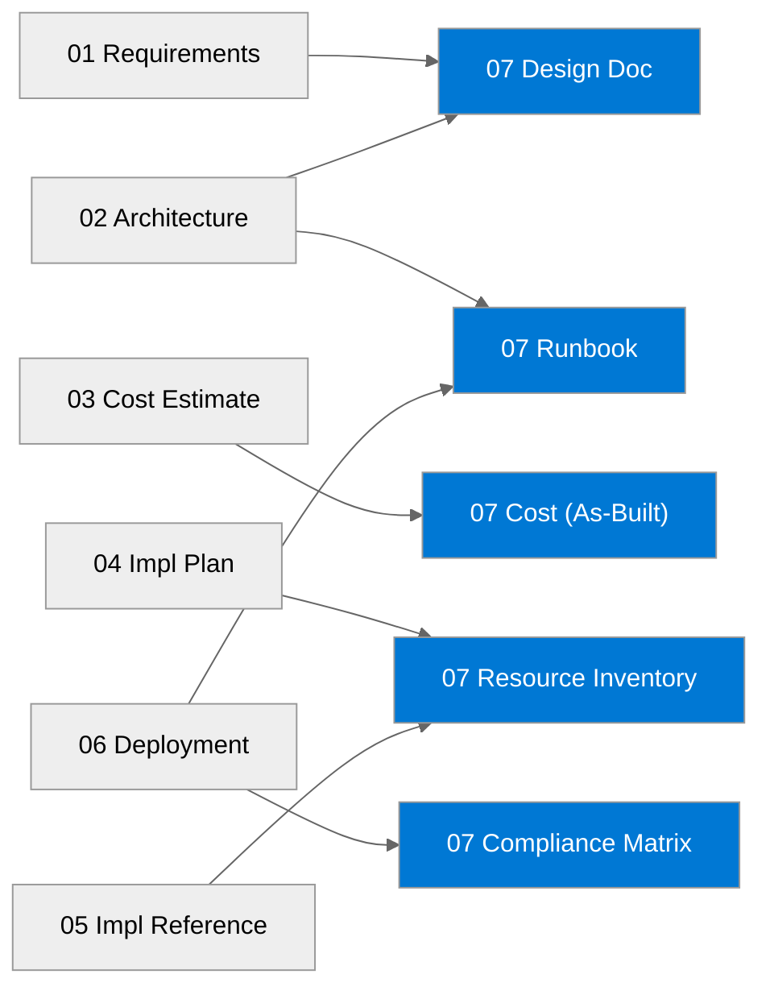

:::tip[Editorial Context]
This artifact was produced by the **As-Built Agent** (Step 7 of the APEX pipeline).
The As-Built Agent runs after a successful deployment and generates the final
handover documentation suite — design records, operational runbooks, resource
inventories, compliance matrices, backup/DR plans, and post-deployment cost
baselines. These documents are intended for operations teams, auditors, and
future architects iterating on the workload. The agent collects live evidence
from the deployed Azure resources and cross-references earlier pipeline
artifacts (requirements, architecture, cost estimates, implementation plans)
to produce a coherent documentation package.
:::

## Document Package Contents

| Document                                | Description                        | Status    |
| --------------------------------------- | ---------------------------------- | --------- |
| [Design Document](./design/)            | Comprehensive architecture design  | Generated |
| [Operations Runbook](./runbook/)        | Day-2 operational procedures       | Generated |
| [Resource Inventory](./design/)         | Complete deployed resource listing | Generated |
| [Backup & DR Plan](./runbook/)          | Recovery procedures and failover   | Generated |
| [Compliance Matrix](./compliance/)      | Security controls mapping          | Generated |
| [As-Built Cost Estimate](./compliance/) | Deployed pricing baseline          | Generated |
| As-Built Diagram                        | Editable Draw.io architecture view | Generated |

## Source Artifacts

These documents were generated from the following agentic workflow outputs:

| Artifact            | Source                           | Generated  |
| ------------------- | -------------------------------- | ---------- |
| Requirements        | `01-requirements.md`             | 2026-04-14 |
| WAF Assessment      | `02-architecture-assessment.md`  | 2026-04-14 |
| Cost Estimate       | `03-des-cost-estimate.md`        | 2026-04-14 |
| Implementation Plan | `04-implementation-plan.md`      | 2026-04-14 |
| Bicep Code          | `05-implementation-reference.md` | 2026-04-14 |
| Deployment Summary  | `06-deployment-summary.md`       | 2026-04-15 |

## Project Summary

| Attribute          | Value                                       |
| ------------------ | ------------------------------------------- |
| **Project Name**   | `malta-catering`                            |
| **Environment**    | `dev`                                       |
| **Primary Region** | `swedencentral`                             |
| **Compliance**     | `GDPR`                                      |
| **Monthly Cost**   | `$139.06/month` baseline, medium confidence |

## Architecture Overview — Cost Distribution

| Category      | Monthly Cost (USD) | Share |
| ------------- | -----------------: | ----: |
| Compute       |              64.97 | 46.7% |
| Data Services |              50.69 | 36.5% |
| Networking    |              23.40 | 16.8% |

## Related Resources

- **Infrastructure Code**: `infra/bicep/malta-catering/`
- **ADRs**: `03-des-adr-0001-app-service-s1-compute.md`, `03-des-adr-0002-table-storage-persistence.md`, `03-des-adr-0003-public-network-posture.md`
- **External**: [Azure Well-Architected Framework](https://learn.microsoft.com/azure/well-architected/) | [AVM Index](https://aka.ms/avm/index)
