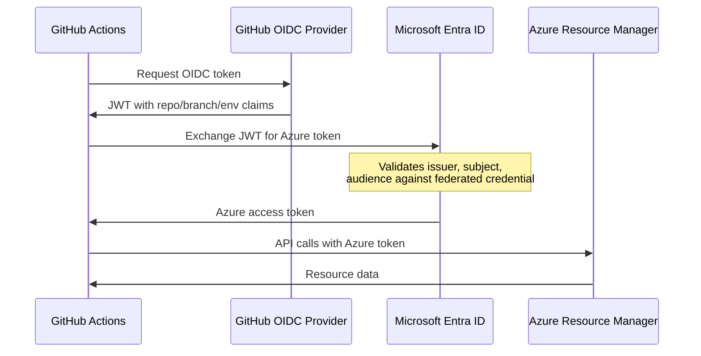

One command configures everything you need to run APEX workflows against
your Azure environment — Entra ID app registration, OIDC federated
credentials, RBAC roles, GitHub secrets, variables, and environments.

## Quick Start

From inside the dev container:

```bash
npm run setup
```

The wizard prompts for your Azure subscription, management group, and app
name, then creates everything automatically. Safe to re-run — it skips
completed steps.

:::tip[Already have an Entra app?]
The wizard detects existing resources by name and reuses them. If you
previously created the app registration manually, the wizard picks it up
and only fills in missing pieces.
:::

## Prerequisites

| Requirement                                  | How to Check                       |
| -------------------------------------------- | ---------------------------------- |
| Azure CLI logged in                          | `az account show`                  |
| GitHub CLI authenticated                     | `gh auth status`                   |
| jq installed                                 | `jq --version`                     |
| Permission to create Entra app registrations | Ask your Azure AD admin            |
| Permission to assign RBAC roles              | Owner or User Access Administrator |

## What Gets Created

The wizard creates these resources across Azure and GitHub:

### Azure Resources

| Resource                                   | Details                                            |
| ------------------------------------------ | -------------------------------------------------- |
| Entra ID App Registration                  | `apex-github-oidc-{repo-name}`                     |
| Service Principal                          | Linked to the app registration                     |
| Federated Credential: `github-main`        | Subject: `repo:{owner}/{repo}:ref:refs/heads/main` |
| Federated Credential: `github-env-dev`     | Subject: `repo:{owner}/{repo}:environment:dev`     |
| Federated Credential: `github-env-staging` | Subject: `repo:{owner}/{repo}:environment:staging` |
| Federated Credential: `github-env-prod`    | Subject: `repo:{owner}/{repo}:environment:prod`    |
| RBAC: Reader                               | At Management Group scope (governance reads)       |
| RBAC: Contributor                          | At Subscription scope (deployments)                |

### GitHub Resources

| Resource                                 | Details                          |
| ---------------------------------------- | -------------------------------- |
| Secret: `AZURE_CLIENT_ID`                | Entra app client ID              |
| Secret: `AZURE_TENANT_ID`                | Azure AD tenant ID               |
| Secret: `AZURE_SUBSCRIPTION_ID`          | Target subscription ID           |
| Variable: `GOVERNANCE_BASELINE_ENABLED`  | `true` (kill switch)             |
| Variable: `GOVERNANCE_MG_ID`             | Management Group to scan         |
| Variable: `GOVERNANCE_MAX_SUBSCRIPTIONS` | Max subscriptions (default: 100) |
| Environment: `dev`                       | For development deployments      |
| Environment: `staging`                   | For staging deployments          |
| Environment: `prod`                      | For production deployments       |
| GitHub Pages                             | Enabled with Actions source      |
| Auto-merge                               | Enabled on repository            |

## Architecture

GitHub Actions workflows authenticate to Azure using **OpenID Connect
(OIDC)** — no client secrets to rotate.



**Why OIDC?** No secrets to store or rotate. The federated credential
binds a specific GitHub repo + branch/environment to the Azure service
principal. Tokens are short-lived and scoped.

## Headless Mode

For CI automation or scripted provisioning, pass `--non-interactive` and
set environment variables:

```bash
export AZURE_TENANT_ID="00000000-0000-0000-0000-000000000000"
export AZURE_SUBSCRIPTION_ID="00000000-0000-0000-0000-000000000000"
export GOVERNANCE_MG_ID="mg-contoso-root"
export GOVERNANCE_MAX_SUBSCRIPTIONS="100"
export APP_DISPLAY_NAME="apex-github-oidc-my-project"
export DEPLOY_ENVIRONMENTS="dev,staging,prod"

npm run setup -- --non-interactive
```

All variables are required in headless mode. The wizard exits with an
error if any are missing.

## Manual Setup

If you cannot run the wizard (for example, a different admin must create
the Entra app), follow these steps manually.

### 1. Create App Registration

```bash
# Create the app
az ad app create --display-name "apex-github-oidc-my-project"

# Note the appId from the output, then create the service principal
az ad sp create --id <APP_ID>
```

### 2. Add Federated Credentials

```bash
APP_ID="<your-app-id>"
REPO="owner/repo"

# Main branch (for scheduled workflows like governance baseline)
az ad app federated-credential create --id "$APP_ID" --parameters '{
  "name": "github-main",
  "issuer": "https://token.actions.githubusercontent.com",
  "subject": "repo:'"$REPO"':ref:refs/heads/main",
  "audiences": ["api://AzureADTokenExchange"]
}'

# Repeat for each environment (dev, staging, prod)
for ENV in dev staging prod; do
  az ad app federated-credential create --id "$APP_ID" --parameters '{
    "name": "github-env-'"$ENV"'",
    "issuer": "https://token.actions.githubusercontent.com",
    "subject": "repo:'"$REPO"':environment:'"$ENV"'",
    "audiences": ["api://AzureADTokenExchange"]
  }'
done
```

### 3. Assign RBAC Roles

```bash
SP_OBJECT_ID=$(az ad sp show --id "$APP_ID" --query id -o tsv)

# Reader at Management Group (for governance policy reads)
az role assignment create \
  --assignee-object-id "$SP_OBJECT_ID" \
  --assignee-principal-type ServicePrincipal \
  --role "Reader" \
  --scope "/providers/Microsoft.Management/managementGroups/<MG_ID>"

# Contributor at Subscription (for deployments)
az role assignment create \
  --assignee-object-id "$SP_OBJECT_ID" \
  --assignee-principal-type ServicePrincipal \
  --role "Contributor" \
  --scope "/subscriptions/<SUBSCRIPTION_ID>"
```

### 4. Configure GitHub Repository

```bash
# Secrets
gh secret set AZURE_CLIENT_ID --body "$APP_ID"
gh secret set AZURE_TENANT_ID --body "<TENANT_ID>"
gh secret set AZURE_SUBSCRIPTION_ID --body "<SUBSCRIPTION_ID>"

# Variables
gh variable set GOVERNANCE_BASELINE_ENABLED --body "true"
gh variable set GOVERNANCE_MG_ID --body "<MG_ID>"
gh variable set GOVERNANCE_MAX_SUBSCRIPTIONS --body "100"

# Environments
for ENV in dev staging prod; do
  gh api "repos/<OWNER>/<REPO>/environments/$ENV" --method PUT
done
```

## Troubleshooting

### "Not logged in to Azure CLI"

Run `az login --use-device-code` inside the dev container.

### "Cannot list Management Groups"

Your account needs the **Management Group Reader** role at the tenant
root level, or at least at the target MG. Ask your Azure admin.

### "Could not create environment"

GitHub environment creation requires **admin** access to the repository.
If you are a collaborator, ask the repo owner to create the environments
or run the wizard from their account.

### "Federated credential subject mismatch"

The scheduled governance workflow runs on `main` with no environment
context. Its OIDC subject is `repo:{owner}/{repo}:ref:refs/heads/main`.
If you see authentication failures, verify this exact subject exists on
the federated credential.

### Re-running the wizard

The wizard is idempotent. State files in `.azure/.setup-state/` track
completed phases. To start fresh:

```bash
npm run setup -- --reset
npm run setup
```

## Cleanup

To completely remove all resources created by the wizard:

```bash
APP_ID=$(az ad app list --display-name "apex-github-oidc-my-project" \
  --query '[0].appId' -o tsv)
SP_OBJECT_ID=$(az ad sp show --id "$APP_ID" --query id -o tsv)

# Remove RBAC assignments
az role assignment delete --assignee "$SP_OBJECT_ID" --role "Reader" \
  --scope "/providers/Microsoft.Management/managementGroups/<MG_ID>"
az role assignment delete --assignee "$SP_OBJECT_ID" --role "Contributor" \
  --scope "/subscriptions/<SUBSCRIPTION_ID>"

# Delete the app registration (also deletes SP and federated credentials)
az ad app delete --id "$APP_ID"

# Remove GitHub secrets and variables
gh secret delete AZURE_CLIENT_ID
gh secret delete AZURE_TENANT_ID
gh secret delete AZURE_SUBSCRIPTION_ID
gh variable delete GOVERNANCE_BASELINE_ENABLED
gh variable delete GOVERNANCE_MG_ID
gh variable delete GOVERNANCE_MAX_SUBSCRIPTIONS
```
