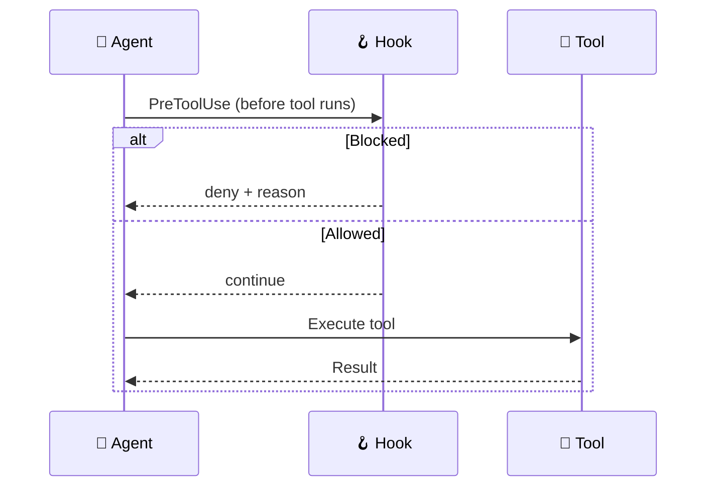

VS Code Agent Hooks automate code quality enforcement by running shell commands at key
lifecycle points during agent sessions. They complement the instruction-based approach
with deterministic, code-driven automation.

:::note[Git hooks vs. Agent hooks]
This page covers **VS Code Agent Hooks** (lifecycle events during agent sessions).
For **git hooks** (pre-commit, pre-push, commit-msg via lefthook), see the
[Validation & Linting Reference](../../reference/validation-reference/).
:::

:::note[Preview Feature]
:::
Agent hooks are a [VS Code Preview feature](https://code.visualstudio.com/docs/copilot/customization/hooks).
Agent-scoped hooks (defined in `.agent.md` frontmatter) require
`chat.useCustomAgentHooks: true` in `.vscode/settings.json`.

## How Hooks Work



## Hook Inventory

| Hook Directory         | Event(s)     | Purpose                                     | Timeout |
| :--------------------- | :----------- | :------------------------------------------ | ------: |
| `tool-guardian/`       | PreToolUse   | Block dangerous terminal commands           |     10s |
| `subagent-validation/` | SubagentStop | Validate subagent output quality (advisory) |     15s |

The suite is intentionally small and high-signal. Secret scanning is handled by
**gitleaks** (pre-commit via lefthook + CI via the gitleaks action), not by an
agent hook. Earlier `secrets-scanner`, `session-telemetry`, and `tool-audit`
hooks were removed: the first duplicated gitleaks, and the latter two only wrote
logs that nothing consumed.

## Configuration

Hooks are registered in `.vscode/settings.json`:

```json
{
  "chat.hookFilesLocations": {
    ".github/hooks/tool-guardian": true,
    ".github/hooks/subagent-validation": true
  },
  "chat.useCustomAgentHooks": true
}
```

### Agent-Scoped Hooks

Agents can define hooks in their YAML frontmatter (requires `chat.useCustomAgentHooks`):

```yaml
hooks:
  PreToolUse:
    - type: command
      command: "bash .github/hooks/tool-guardian/guard-tool.sh"
      timeout: 10
```

:::caution[Do not duplicate global hooks]
:::
If a hook is already registered globally in `chat.hookFilesLocations`, do not
re-define it in agent frontmatter — this causes the hook to run twice.
Use agent-scoped hooks only for agent-specific logic not covered by global hooks.

## Safety Considerations

### Self-Modification Protection

The PreToolUse hook blocks file-edit tools (`replace_string_in_file`, `create_file`, etc.)
from modifying files under `.github/hooks/`. Path resolution uses `realpath` to handle
symlinks and traversal attacks (`../`).

### Command Precision (low false-positive rate)

`tool-guardian` runs in `block` mode by default, so its patterns are anchored to
avoid blocking legitimate work. Destructive `rm -rf` rules match a whole-target
delete (`rm -rf /`, `rm -rf .`, `rm -rf ~`) but allow scoped sub-paths
(`rm -rf ./dist`, `rm -rf ~/project/build`); SQL rules match `TRUNCATE TABLE`
rather than the `truncate` coreutil; and there is no blanket `sudo` block
(routine `sudo apt-get` is allowed, while `sudo rm -rf /` is still caught by the
`rm` rule).

### Timeout Enforcement

Each hook specifies a timeout (5-180s). If a hook exceeds its timeout, VS Code terminates
it and continues the agent session.

To stay within budget, `tool-guardian` avoids per-pattern subprocess fan-out: it
runs a single combined-alternation `grep` and only falls through to the detailed,
per-pattern loop when that pre-check matches. `subagent-validation` does all
parsing and emission in one `python3` process.

### Bounded Logging

`tool-guardian` appends a JSONL audit line per evaluated tool call via the shared
`hook_log` helper, which rotates the log to `<file>.1` once it reaches
`HOOK_LOG_MAX_BYTES` (default 1 MiB) so it cannot grow without bound.

### Secret Scanning (handled by gitleaks, not a hook)

Secrets are caught by **gitleaks** at two independent layers — pre-commit (via
lefthook, soft-skips locally if gitleaks is missing) and CI (the gitleaks action,
hard-fail). There is no agent hook for secret scanning; a former bespoke
regex-based `secrets-scanner` was removed because it duplicated gitleaks with a
weaker ruleset.

## Hook Directory Structure

Each hook follows this pattern:

```text
.github/hooks/{name}/
├── hooks.json          # Event binding + timeout
└── {name}.sh           # Shell script (present at configured path; exec bit optional)
```

### Shared Library

Common helpers — `hook_timestamp`, `hook_emit_continue`, `hook_json_escape`,
`hook_log`, `hook_parse_allowlist`, and `hook_is_allowlisted` — live in
`.github/hooks/lib/common.sh`. Hook scripts source it (currently `tool-guardian`)
so JSON emission, logging, timestamps, and allowlist parsing stay DRY:

```bash
source "$(dirname "${BASH_SOURCE[0]}")/../lib/common.sh"
```

`lib/` holds no `hooks.json` and is never registered in `chat.hookFilesLocations` —
it is a sourced library, not a hook, so `npm run validate:hooks` skips it.

### hooks.json Schema

```json
{
  "hooks": {
    "<EventName>": [
      {
        "type": "command",
        "command": "bash .github/hooks/{name}/{name}.sh",
        "timeout": 30
      }
    ]
  }
}
```

Valid event names: `PreToolUse`, `PostToolUse`, `SessionStart`, `SubagentStart`,
`SubagentStop`, `Stop`.

### Script Conventions

All hook scripts must:

1. Start with `#!/usr/bin/env bash`
2. Include `set -euo pipefail`
3. Read JSON from stdin
4. Write JSON to stdout (`{"continue": true}` or `{"hookSpecificOutput": {...}}`)
5. Be present at the configured path and be invoked through `bash` in `hooks.json`
   so execution does not depend on the file mode

## Validation

```bash
# Validate hook configurations
npm run validate:hooks

# Run hook integration tests
npm run test:hooks
```

## Adding a New Hook

### 1. Create the hook directory and script

```bash
mkdir -p .github/hooks/my-hook-name
```

Create `.github/hooks/my-hook-name/my-hook-name.sh`:

```bash
#!/usr/bin/env bash
set -euo pipefail

INPUT=$(cat)

# Parse input JSON
FIELD=$(echo "$INPUT" | python3 -c \
  "import sys,json; print(json.load(sys.stdin).get('field',''))" \
  2>/dev/null || echo "")

# Your logic here...

# Output JSON safely (prevents injection)
python3 -c "
import json, sys
print(json.dumps({'continue': True, 'systemMessage': sys.argv[1]}))
" "Your message" 2>/dev/null || echo '{"continue": true}'
```

### 2. Create hooks.json

```json
{
  "hooks": {
    "PostToolUse": [
      {
        "type": "command",
        "command": "bash .github/hooks/my-hook-name/my-hook-name.sh",
        "timeout": 30
      }
    ]
  }
}
```

### 3. Register in VS Code settings

Add to `chat.hookFilesLocations` in `.vscode/settings.json`:

```json
".github/hooks/my-hook-name": true
```

### 4. Add tests and validate

Add test cases under `tools/tests/bats/`, then run:

```bash
npm run validate:hooks
npm run test:hooks
```

### Best practices

- **JSON safety**: Always use `python3 json.dumps()` for output — never string interpolation
- **Fast execution**: Keep hooks under their timeout; check tool availability with `command -v`
- **No network calls**: Hooks should be fast and local
- **Path safety**: Use `realpath` and verify paths are within the repository
- **Error handling**: Use `set -euo pipefail`; handle missing tools gracefully

## Troubleshooting

### Hook Not Firing

1. Verify the hook directory is listed in `chat.hookFilesLocations` in `.vscode/settings.json`
2. Check the script exists and the configured command uses `bash`:
   `ls -la .github/hooks/{name}/{name}.sh`
3. View hook output: **Output** panel → **GitHub Copilot Chat Hooks** channel

### Hook Timeout

If a hook exceeds its timeout, VS Code kills the process and continues. Check for:

- Network calls in hooks (avoid — hooks should be fast and local)
- Large file processing
- Missing tool binaries (hooks should check `command -v` before running tools)

### Manual Testing

Test a hook locally by piping mock JSON:

```bash
echo '{"toolName":"run_in_terminal","toolInput":"rm -rf /"}' | \
  bash .github/hooks/tool-guardian/guard-tool.sh
```

## Relationship to Git Hooks

Agent hooks (`.github/hooks/`) and git hooks (`lefthook.yml`) serve different purposes:

|             | Agent Hooks                   | Git Hooks (lefthook)           |
| :---------- | :---------------------------- | :----------------------------- |
| **When**    | During agent sessions         | On git commit/push             |
| **Scope**   | Individual tool invocations   | Staged/changed files           |
| **Config**  | `.github/hooks/*/hooks.json`  | `lefthook.yml`                 |
| **Purpose** | Real-time quality enforcement | Pre-commit/pre-push validation |

Both systems complement each other — agent hooks catch issues during authoring,
git hooks catch issues before commit.

## Related

- [Quickstart](../../getting-started/quickstart/) — install and run your first project
- [Workflow](../../concepts/workflow/) — how agents collaborate across steps
- [Troubleshooting](../troubleshooting/) — diagnose failed deploys
